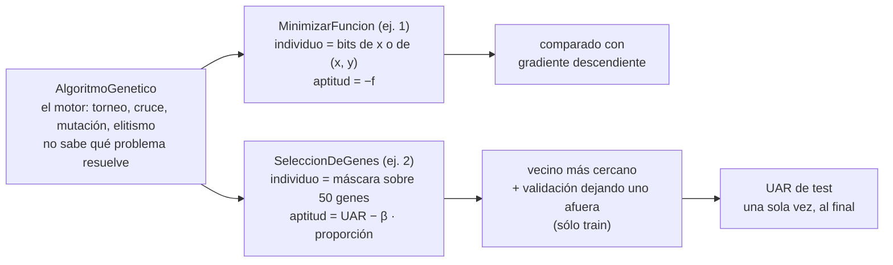
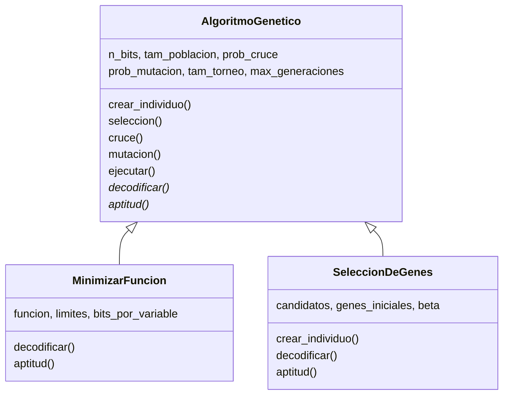
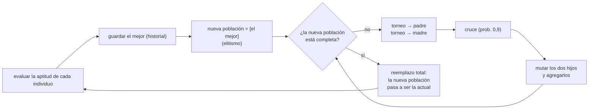
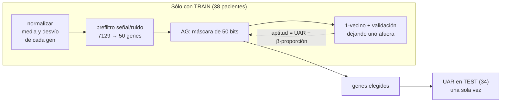

## Mapa del notebook



Todos los números de este apunte salen de **volver a correr el notebook** (dan idénticos a los guardados) y de unos experimentos extra hechos para la defensa, que están marcados como tales.

---

## 1. La organización del código

El notebook separa **el algoritmo** del **problema**:

- `AlgoritmoGenetico` es el **motor**: crea la población, selecciona, cruza, muta y aplica elitismo. No sabe si está buscando un mínimo o eligiendo genes.
- Cada problema es una **clase hija** que define sólo dos métodos: `decodificar` (bits → solución) y `aptitud` (solución → número).



> **PARA LA DEFENSA — por qué así**
> Es la idea de la teoría: **la representación y la aptitud dependen del problema; la selección, la cruza, la mutación y el reemplazo no.** El código lo refleja literalmente: el ejercicio 2 reutiliza el motor del ejercicio 1 sin tocar una línea. `decodificar` y `aptitud` en la clase madre tiran `NotImplementedError` a propósito: obligan a cada problema a definirlas.

---

## 2. El motor: `AlgoritmoGenetico`

### Los parámetros

```python
def __init__(self, n_bits, tam_poblacion=50, prob_cruce=0.9, prob_mutacion=None,
             tam_torneo=3, max_generaciones=200, semilla=None):
    ...
    if prob_mutacion is None:
        prob_mutacion = 1 / n_bits     # en promedio cambia 1 bit por hijo
    ...
    random.seed(semilla)               # misma semilla = mismos resultados
```

| Parámetro | Valor | Por qué |
|---|---|---|
| Población | 50 (ej. 1), 30 (ej. 2) | Suficiente para cubrir el dominio en el ej. 1. En el ej. 2 cada evaluación es cara (un clasificador entero) y se baja |
| Probabilidad de cruce | 0,9 | La cruza es el operador principal: se aplica casi siempre. El 10 % restante pasa copias de los padres |
| Probabilidad de mutación | $1/L$ por bit | En promedio **un bit por hijo**. Mantiene la diversidad sin destruir lo que trae la cruza |
| Tamaño del torneo | 3 | Presión selectiva moderada (ver abajo) |
| Generaciones | 200 (ej. 1), 60 (ej. 2) | Criterio de parada: cantidad fija. En el ej. 2 la aptitud deja de cambiar alrededor de la generación 35 (figura de §5) |
| Semilla | 0, 1, 2… | Que cada corrida sea **reproducible**: con la misma semilla da exactamente lo mismo |

> **OJO — `random.seed` es global**
> La semilla se fija para todo el módulo `random`, no para el objeto. Funciona porque las corridas se hacen una atrás de la otra. Si alguien pregunta: no es un generador propio por instancia, pero para este uso alcanza.

### `crear_individuo`: la población inicial

```python
def crear_individuo(self):
    individuo = []
    for i in range(self.n_bits):
        individuo.append(random.randint(0, 1))
    return individuo
```

Una lista de `n_bits` bits al azar. Así la población inicial queda repartida uniformemente por todo el dominio, que es lo que necesita la búsqueda en muchos puntos.

### `seleccion`: torneo

```python
def seleccion(self, poblacion, aptitudes):
    ganador = random.randrange(len(poblacion))
    for i in range(self.tam_torneo - 1):
        rival = random.randrange(len(poblacion))
        if aptitudes[rival] > aptitudes[ganador]:
            ganador = rival
    return poblacion[ganador]
```

Se sortea un individuo, se lo hace competir contra `tam_torneo − 1` rivales sorteados, y gana el de mayor aptitud.

> **PARA LA DEFENSA — por qué torneo y no ruleta**
> 1. **La aptitud del ejercicio 1 es negativa.** Es $-f$, y $f_1$ va de −419 a +419. La ruleta necesita valores positivos (son tajadas); habría que desplazar la aptitud. El torneo sólo compara, así que el signo no importa.
> 2. **No sufre los mares de mediocres y virtuosos**, porque usa el orden y no el valor. En el ej. 2 todas las aptitudes terminan entre 0,97 y 0,99: con ruleta, la selección sería casi un sorteo.
> 3. **El tamaño regula la presión.** Con 3, el mejor espera unas 3 copias por generación.

**Cumple los dos requisitos de la selección:** el mejor gana todos los torneos en los que entra; cualquier otro puede ganar si le tocan rivales peores. Como los rivales se sortean **con reposición**, hasta el peor puede salir, si le tocan tres veces él mismo: probabilidad $(1/50)^3 = 1/125\,000$. En la práctica, no sale.

### `cruce`: un punto

```python
def cruce(self, padre, madre):
    if random.random() < self.prob_cruce:
        corte = random.randint(1, self.n_bits - 1)
        hijo1 = padre[:corte] + madre[corte:]
        hijo2 = madre[:corte] + padre[corte:]
    else:
        hijo1 = padre[:]
        hijo2 = madre[:]
    return hijo1, hijo2
```

- El corte va de 1 a `n_bits − 1`: así cada hijo recibe **al menos un bit de cada padre** (un corte en 0 o en `n_bits` copiaría un padre entero).
- El corte es **el mismo en los dos padres**, así los hijos conservan la longitud.
- `padre[:]` hace una **copia**. Sin la copia, el hijo sería el mismo objeto que el padre, y mutar al hijo modificaría al padre, que puede seguir en la población.

En el ejercicio 1 con dos variables, el corte puede caer **dentro** de los bits de $x$ o de $y$: si cae justo en el bit 20, el hijo toma la $x$ de un padre y la $y$ del otro.

### `mutacion`: bit a bit

```python
def mutacion(self, individuo):
    mutado = []
    for bit in individuo:
        if random.random() < self.prob_mutacion:
            mutado.append(1 - bit)
        else:
            mutado.append(bit)
    return mutado
```

Cada bit se invierte (`1 - bit`) con probabilidad $p_m = 1/L$. Es la tasa **por gen**: con $L = 40$ (ej. 1, dos variables), cada hijo recibe en promedio una mutación, y la probabilidad de que salga sin ninguna es $(1 - 1/40)^{40} \approx 0{,}36$.

### `ejecutar`: el ciclo completo

```python
def ejecutar(self):
    poblacion = [self.crear_individuo() for ...]          # (en el notebook, con un for)
    for generacion in range(self.max_generaciones):
        aptitudes = [self.aptitud(ind) for ind in poblacion]
        mejor = self.indice_del_mejor(aptitudes)
        ...                                                # guarda historial para graficar
        nueva_poblacion = [poblacion[mejor]]               # elitismo
        while len(nueva_poblacion) < self.tam_poblacion:
            padre = self.seleccion(poblacion, aptitudes)
            madre = self.seleccion(poblacion, aptitudes)
            hijo1, hijo2 = self.cruce(padre, madre)
            nueva_poblacion.append(self.mutacion(hijo1))
            if len(nueva_poblacion) < self.tam_poblacion:
                nueva_poblacion.append(self.mutacion(hijo2))
        poblacion = nueva_poblacion
    # al final: se evalúa la última población y se devuelve su mejor
```



Puntos para explicar:

- **Elitismo de uno.** El mejor pasa sin cruza ni mutación. Garantiza que **la mejor aptitud nunca baja** de una generación a otra (en la figura de §5 se ve la escalera). Y como el mejor nunca se pierde, el mejor de la última población **es el mejor que se encontró en toda la corrida**: por eso alcanza con devolver ése.
- **El `if` del segundo hijo.** Con 50 individuos, el élite ocupa un lugar y quedan 49, un número impar: el último par aporta un solo hijo. El `if` evita pasarse de tamaño.
- **Los padres se eligen de la población vieja** (`poblacion`, con sus `aptitudes`), no de la que se está armando.
- **Parada:** sólo por cantidad de generaciones. No corta por aptitud deseada ni por estancamiento; se podría agregar, pero así las corridas son comparables (todas hacen el mismo trabajo).

---

## 3. Ejercicio 1: minimizar dos funciones

### `MinimizarFuncion`

```python
def decodificar(self, individuo):
    punto = []
    maximo_entero = 2 ** self.bits_por_variable - 1
    for i in range(len(self.limites)):
        bits = individuo[i*b : (i+1)*b]                 # b = bits_por_variable
        entero = self.binario_a_entero(bits)
        a, b_ = self.limites[i]
        punto.append(a + entero * (b_ - a) / maximo_entero)
    return punto

def aptitud(self, individuo):
    return -self.funcion(self.decodificar(individuo))
```

- **`binario_a_entero`** hace `entero = entero*2 + bit`, recorriendo de izquierda a derecha: es la regla de Horner, lo mismo que $\sum 2^{L-i}a_i$.
- **Decodificar** es la fórmula $x = a + (b-a)\,\dfrac{d}{2^L-1}$: el entero 0 va a $a$ y el entero máximo, a $b$. Con dos variables, los primeros 20 bits son $x$ y los siguientes 20, $y$.
- **Aptitud $= -f$:** el AG **maximiza** y el ejercicio pide un **mínimo**. Dar vuelta el signo es una función decreciente: el mínimo de $f$ es el máximo de la aptitud. Se puede usar $-f$ (aunque dé negativo) porque la selección es por torneo.

**¿Por qué 20 bits por variable?** Por la resolución $\Delta = (b-a)/(2^{20}-1)$:

| | Dominio | Resolución con 20 bits | Mínimo global |
|---|---|---|---|
| $f_1(x) = -x\sin\sqrt{|x|}$ | $[-512, 512]$ | $1024/1\,048\,575 \approx 0{,}001$ | $f_1(420{,}97) = -418{,}98$ |
| $f_2(x,y)$ | $[-100, 100]^2$ | $200/1\,048\,575 \approx 0{,}0002$ | $f_2(0,0) = 0$ |

Con 10 bits la resolución de $f_1$ sería 1, y el mínimo podría quedar entre dos valores representables.

### El gradiente descendiente

```python
def gradiente_descendiente(funcion, punto_inicial, limites, tasa=0.1, iteraciones=1000, h=1e-6):
    for it in range(iteraciones):
        # derivada parcial por diferencias centradas
        gradiente[i] = (funcion(p + h e_i) - funcion(p - h e_i)) / (2h)
        # paso en contra del gradiente, recortado a los límites
        punto[i] = punto[i] - tasa * gradiente[i]
        punto[i] = min(max(punto[i], minimo), maximo)
```

- **Derivada numérica** con diferencias **centradas**: $\frac{f(p+h e_i) - f(p-h e_i)}{2h}$. Tiene error de orden $h^2$, mejor que la diferencia hacia adelante (orden $h$), y no hay que derivar a mano.
- **Recorte a los límites**, para que el punto no se salga del dominio.
- **Tasa 1 para $f_1$ y 0,1 para $f_2$:** $f_1$ tiene valores del orden de cientos en un dominio de 1024, y con 0,1 avanzaría muy lento; $f_2$ tiene pendientes más grandes y con 1 saltaría de un anillo a otro sin control.
- **1000 iteraciones fijas.**

### Cómo se compara

```python
def comparar(resultados_ag, resultados_gd, f_optimo, tolerancia=0.1):
```

10 corridas de cada método: el AG con semillas 0 a 9 y el gradiente desde 10 puntos al azar (semilla 0). Para cada método se informa el mejor $f$, el $f$ promedio y **cuántas corridas llegaron al mínimo global**, con tolerancia 0,1 en $f$.

### Resultados

| Función | Método | Mejor $f$ | $f$ promedio | Llegó al global |
|---|---|---:|---:|---:|
| $f_1$ | Algoritmo genético | −418,983 | −418,983 | **10/10** |
| $f_1$ | Gradiente | −418,983 | −158,35 | 1/10 |
| $f_2$ | Algoritmo genético | 0,01996 | 0,01996 | **10/10** |
| $f_2$ | Gradiente | 4,10 | 7,89 | 0/10 |


**Por qué falla el gradiente en $f_1$:** $f_1$ tiene varios valles. Las 10 corridas terminan en $x$ = 420,97; 203,81 (dos veces); −124,83 (tres veces); −302,52; 5,24; −25,88; 65,55. Sólo la que arrancó en 352,7, que ya estaba en el valle del global, llega a él. **El gradiente encuentra el mínimo del valle donde empieza.**


{width=62%}


**Por qué el AG da 0,01996 y no 0 en $f_2$:** con 20 bits en $[-100, 100]$, **el 0 no es representable**. Los valores más cercanos son $\pm 0{,}0000954$ (los enteros 524 287 y 524 288). En el punto $(\pm0{,}0000954, \pm0{,}0000954)$, $f_2$ vale exactamente **0,01996**: es el mejor valor posible con esta representación, y las 10 corridas lo encontraron. Es una limitación de la **codificación**, no del algoritmo; con más bits baja.

> **OJO — la comparación no es pareja en evaluaciones, y conviene decirlo antes de que lo pregunten**
> Una corrida del AG evalúa la función $50 \times 200 + 50 = 10\,050$ veces. Una corrida del gradiente, $1000 \times 2 = 2000$ en $f_1$ y $1000 \times 4 = 4000$ en $f_2$ (dos evaluaciones por derivada parcial). **Pero** el problema del gradiente no es el presupuesto: con las 1000 iteraciones ya llegó al fondo de su valle y no se mueve más. Más iteraciones no lo sacan. Y en $f_1$ el «mejor $f$» del gradiente es el global porque una de las 10 corridas arrancó en el valle correcto: con muchos arranques al azar, el gradiente también lo encuentra (*multistart*), pero no sabe cuál de sus resultados es el bueno hasta compararlos.

### Conclusiones del ejercicio 1

- El gradiente es **local**: va al mínimo del valle donde arranca. En $f_1$ llega al global 1 de 10 veces; en $f_2$, con mínimos en anillos, nunca.
- El AG es **global**: la población cubre todo el dominio, y la selección la concentra en la mejor zona. 10 de 10 en las dos funciones.
- El costo: el AG evalúa la función unas 2,5 a 5 veces más que una corrida de gradiente.

---

## 4. Ejercicio 2: selección de genes para la leucemia

### El problema y el esquema

38 pacientes de entrenamiento (27 ALL y 11 AML), 34 de prueba (20 ALL y 14 AML), **7129 genes** por paciente. Hay que encontrar un subconjunto chico de genes que clasifique bien.

Es el esquema **envolvente** (*wrapper*) de selección de características: el AG propone subconjuntos y un clasificador los evalúa.



### Leer los datos

```python
def leer_csv(nombre):    # sin encabezado; cada fila es un paciente; la última columna es la clase
```

Cada fila tiene 7129 valores y la clase al final (0 = ALL, 1 = AML). La lectura imprime la cantidad por clase, que es lo que justifica el UAR.

### Normalizar con la media y el desvío de train

```python
medias[j], desvios[j]   # calculados SOLO con X_train
X_train = normalizar(X_train)
X_test  = normalizar(X_test)    # con las medias y desvíos de train
```

Cada gen se lleva a media 0 y desvío 1: $z = (x - \mu_j)/\sigma_j$.

**Por qué normalizar:** el clasificador usa **distancias**, y los genes tienen escalas muy distintas: el desvío de cada gen en train va de **21,5 a 12 518** (mediana 176). Sin normalizar, en la distancia mandan los genes de valores grandes, y no necesariamente son los que importan.

**Por qué con las estadísticas de train también para test:** el conjunto de prueba representa pacientes que todavía no existen. Calcular la media con ellos sería usar información del futuro (**fuga de datos**). Y el modelo tiene que aplicarle a un paciente nuevo la **misma** transformación con la que se entrenó.

> **OJO — una corrección y un dato para tener a mano**
> 1. El texto del notebook dice «los rangos van de 21 a 12 500»: son los **desvíos** de los genes, no los rangos (los rangos van de 83 a 61 228).
> 2. **Experimento extra:** con **todos** los genes, el vecino más cercano **sin normalizar** da UAR de test 0,83 y **normalizado**, 0,76. Al normalizar, los miles de genes que son ruido pasan a pesar lo mismo que los informativos y ensucian la distancia. Con los 10 genes del ranking da casi igual (0,94 sin normalizar, 0,93 normalizado). La normalización es importante cuando se combinan **pocos genes elegidos**, para que ninguno domine la distancia por su escala, que es justamente el caso del AG.

### El clasificador: vecino más cercano

```python
def distancia(a, b, genes):          # distancia AL CUADRADO, sólo sobre los genes elegidos
    return sum((a[g] - b[g])**2 for g in genes)

def clasificar(paciente, X_ref, y_ref, genes):   # la clase del paciente más parecido
```

> **PARA LA DEFENSA — por qué el vecino más cercano**
> 1. **No tiene azar ni entrenamiento.** El mismo subconjunto de genes recibe **siempre la misma aptitud**. Con una red neuronal, la aptitud dependería de la inicialización de los pesos, y el AG estaría seleccionando en parte por suerte.
> 2. **Es barato.** La aptitud se calcula miles de veces (30 individuos × 60 generaciones por corrida); entrenar una red en cada evaluación sería carísimo.
> 3. **Con 38 pacientes**, un modelo con muchos parámetros sobreajusta enseguida.
>
> **¿Por qué la distancia al cuadrado, sin raíz?** La raíz es creciente: el más cercano es el mismo con o sin raíz, y se ahorra el cálculo.

### La medida: UAR

```python
def uar(reales, predichas):   # promedio del porcentaje de aciertos de cada clase
```

$$\text{UAR} = \frac{1}{2}\left(\frac{\text{ALL bien clasificados}}{\text{total ALL}} + \frac{\text{AML bien clasificados}}{\text{total AML}}\right)$$

**Por qué no el porcentaje de aciertos:** las clases están desbalanceadas. Un clasificador que dijera **siempre ALL** acertaría 27 de 38 en train (71 %) y 20 de 34 en test (59 %), sin haber aprendido nada. Su UAR es **0,5**, que es lo que vale tirar una moneda. El UAR le da el mismo peso a cada clase.

### La validación: dejando uno afuera

```python
def uar_validacion(genes):     # cada paciente de train se clasifica con los otros 37
def uar_test(genes):           # cada paciente de test se clasifica con los 38 de train
```

**Por qué dejando uno afuera (*leave-one-out*):** con 38 pacientes no se puede separar un conjunto de validación: si se apartaran 10, quedarían 28 para comparar, y la validación tendría 10 casos (cada error movería el UAR muchísimo). Dejando uno afuera, **los 38 se usan para validar** y cada uno se clasifica con los otros 37. Con el vecino más cercano no hay nada que reentrenar, así que hacerlo 38 veces es barato.

**Por qué el test no entra en la búsqueda:** si la aptitud usara el test, el AG elegiría los genes que mejor le van **a esos 34 pacientes** y el UAR de test dejaría de estimar lo que pasa con pacientes nuevos. Por eso test se usa **una sola vez por corrida, al final**.

### El prefiltro: señal/ruido

```python
def senal_ruido(j):   # calculada SOLO con train
    return abs(media_all - media_aml) / (desvio_all + desvio_aml)
```

$$SN_j = \frac{|\mu_{ALL} - \mu_{AML}|}{\sigma_{ALL} + \sigma_{AML}}$$

Es la medida del trabajo original sobre estos datos (Golub et al., 1999). Es grande si las medias de las dos clases están **lejos** en relación con **cuánto varía** cada una: un gen que separa bien. Se ordenan los 7129 genes y se quedan los **50** de mayor señal/ruido (de 1,52 el primero a 0,94 el número 50).

> **PARA LA DEFENSA — por qué un prefiltro (la decisión más importante del ejercicio)**
> **Sin prefiltro el AG sobreajusta.** Con 7129 genes y 38 pacientes hay muchísimas combinaciones de genes que separan perfecto a esos 38 **por casualidad**. El AG las encuentra (validación ≈ 1,0) pero no sirven para pacientes nuevos. **Experimento extra**, el mismo AG sobre los 7129 genes, 5 semillas:
>
> | Semilla | 0 | 1 | 2 | 3 | 4 |
> |---|---|---|---|---|---|
> | Genes elegidos | 17 | 16 | 14 | 15 | 20 |
> | UAR validación | 1,00 | 0,955 | 1,00 | 1,00 | 1,00 |
> | UAR test | 0,66 | 0,48 | 0,69 | 0,73 | 0,60 |
>
> Con el prefiltro, el AG busca entre 50 genes que **ya tienen sentido biológico** (diferencian las clases cada uno por su cuenta), y el espacio pasa de $2^{7129}$ a $2^{50}$ subconjuntos.

> **OJO — lo que el prefiltro pierde, y cómo contestarlo**
> El prefiltro mira **cada gen por separado**. Si dos genes sólo sirven juntos (interacción, como el XOR), el ranking los descarta y el AG ya no los ve. Es un **compromiso**: se pierde esa posibilidad a cambio de no sobreajustar. Con 38 pacientes, el riesgo de sobreajuste es mucho más concreto que el de perder una interacción.

### `SeleccionDeGenes`

```python
class SeleccionDeGenes(AlgoritmoGenetico):
    def __init__(self, candidatos, genes_iniciales=10, beta=0.2, tam_poblacion=30,
                 max_generaciones=60, semilla=None):
        ... AlgoritmoGenetico.__init__(self, len(candidatos), ...)   # 50 bits

    def crear_individuo(self):      # cada bit vale 1 con probabilidad 10/50
    def decodificar(self, individuo):   # bit i en 1 → se usa el gen candidatos[i]
    def aptitud(self, individuo):
        genes = self.decodificar(individuo)
        if len(genes) == 0:
            return 0
        return uar_validacion(genes) - self.beta * len(genes) / self.n_bits
```

**Representación:** una **máscara de 50 bits**, uno por gen candidato. Pasa la prueba de la representación: cualquier cruce o mutación da otra máscara válida. El cromosoma no indexa los 7129 genes sino la lista `candidatos`: el bit 0 es el gen de mayor señal/ruido.

**Población inicial con pocos genes.** `crear_individuo` se **redefine**: en vez de bits 50/50 (unos 25 genes por individuo), cada bit se prende con probabilidad 10/50, así cada individuo arranca con **unos 10 genes**. Como lo que se busca es un subconjunto chico, se arranca cerca de esa zona.

**Máscara vacía → aptitud 0.** Sin genes no hay distancia (todas valen 0) y el clasificador no tiene sentido; con aptitud 0 ese individuo pierde todos los torneos.

**La aptitud:** UAR de validación menos una penalización por cantidad de genes.

$$f = \text{UAR}_{\text{val}} - \beta\,\frac{\text{genes usados}}{50}, \qquad \beta = 0{,}2$$

> **PARA LA DEFENSA — qué hace realmente $\beta = 0{,}2$**
> Cada gen cuesta $0{,}2/50 = 0{,}004$ de aptitud. Un error de validación cuesta mucho más: equivocarse con un AML baja el UAR en $\frac{1}{2}\cdot\frac{1}{11} = 0{,}045$, y con un ALL, $\frac{1}{2}\cdot\frac{1}{27} = 0{,}019$. Para que al AG le convenga aceptar un error a cambio de sacar genes, tendría que sacar al menos 5 genes por un ALL o 12 por un AML. **En la práctica, $\beta$ funciona como desempate:** entre los subconjuntos que clasifican igual, gana el más chico. Por eso las aptitudes finales son $1 - 0{,}004\cdot k$: 0,992 con 2 genes, 0,988 con 3 y 0,984 con 4 (figura de §5).

**Hereda del motor:** torneo de 3, cruce 0,9, mutación $1/50$ por bit, elitismo. Población 30 y 60 generaciones porque cada evaluación clasifica 38 pacientes.

---

## 5. Resultados del ejercicio 2

### Las 5 corridas

| Semilla | Genes elegidos | Cantidad | UAR validación | UAR test |
|---|---|---:|---:|---:|
| 0 | 1744, 6470, 2120, 4051 | 4 | 1,00 | 0,868 |
| 1 | 4846, 2353 | 2 | 1,00 | 0,939 |
| 2 | 460, 6973, 4051 | 3 | 1,00 | 0,757 |
| 3 | 3319, 1248, 148 | 3 | 1,00 | 0,786 |
| 4 | 2758, 6538, 6375 | 3 | 1,00 | 0,807 |


### Comparación

| Método | Genes | UAR validación | UAR test |
|---|---:|---:|---:|
| Todos los genes | 7129 | 0,80 | 0,76 |
| 10 mejores por señal/ruido (sin AG) | 10 | 1,00 | **0,93** |
| Algoritmo genético (promedio de 5) | **3** | 1,00 | 0,83 |

### Cómo leer estos números

**1. Cuánto vale una diferencia en el test.** Con 34 pacientes de test, **un** error en un AML baja el UAR 0,036 y uno en un ALL, 0,025. La diferencia entre 0,83 y 0,93 son unos **3 o 4 pacientes**. Las corridas del AG van de 0,76 a 0,94: entre la mejor y la peor hay unos 5 a 7 pacientes de diferencia.

**2. Hay sobreajuste a la validación.** Las 5 corridas tienen validación 1,00 y test entre 0,76 y 0,94. El AG busca **justamente** el subconjunto que maximiza la validación, así que ese número queda optimista: entre los $2^{50}$ subconjuntos hay muchos chicos que separan perfecto a 38 pacientes por casualidad.

> **OJO — hay una pequeña fuga en la validación (experimento extra)**
> El prefiltro se calcula con **los 38** pacientes de train. Después, en la validación dejando uno afuera, el paciente que se deja afuera **ya participó** en la elección de los 50 candidatos. Eso hace la validación algo optimista. Para medirlo, se repitió todo **dentro** de la validación: para cada paciente, se recalcula el prefiltro y se corre el AG **sin él**, y después se lo clasifica (validación anidada). Resultado:
>
> - los 10 mejores del ranking: validación ingenua **1,00** → anidada **0,89**;
> - el procedimiento completo (prefiltro + AG, semilla 0): validación ingenua **1,00** → anidada **0,79**, con 2,6 genes en promedio.
>
> El 0,79 anidado está mucho más cerca del UAR de test (0,83 promedio) que el 1,00. **Si te preguntan cómo estimarías honestamente el desempeño sin mirar el test, es esto.**

**3. El AG gana en tamaño, no en desempeño.** Los 10 mejores del ranking dan más UAR de test (0,93) que el AG (0,83 promedio), con más genes. El AG llega a 2–4 genes, que es un modelo mucho más simple e interpretable, pero pierde un poco de desempeño. Es lo que pide la aptitud: con $\beta = 0{,}2$ y validación ya en 1,00, el AG sólo optimiza el tamaño.

**4. Qué pasa si se cambia $\beta$ (experimento extra, 5 semillas cada uno):**

| $\beta$ | Genes elegidos | UAR test por corrida | UAR test promedio |
|---|---|---|---:|
| 0 | 16, 10, 16, 15, 12 | 0,93 · 0,73 · 0,90 · 0,93 · 0,89 | **0,88** |
| 0,2 (el del notebook) | 4, 2, 3, 3, 3 | 0,87 · 0,94 · 0,76 · 0,79 · 0,81 | 0,83 |
| 0,5 | 2, 3, 2, 2, 3 | 0,94 · 0,74 · 0,75 · 0,75 · 0,81 | 0,80 |

En todas, la validación es 1,00: el AG no distingue entre ellas por desempeño. Con más genes, el vecino más cercano es más **robusto** (un gen ruidoso pesa menos en la distancia) y el test mejora en promedio. **$\beta$ elige el punto del compromiso entre tamaño y desempeño**; 0,2 privilegia el tamaño.

### Conclusiones del ejercicio 2

- El AG reduce de 7129 genes a **2–4** y supera a usar todos los genes (UAR de test 0,83 contra 0,76).
- La validación de 1,00 es optimista: hay sobreajuste a la validación, y una pequeña fuga por el prefiltro. Una estimación honesta (anidada) da 0,79.
- Los 10 mejores del ranking rinden más en test (0,93): el AG gana en tamaño del subconjunto, no en desempeño. Bajando $\beta$ se recupera desempeño a costa de usar más genes.

---

## 6. Debilidades, para conocerlas antes que el docente

| Debilidad | Qué contestar |
|---|---|
| La validación da siempre 1,00 | Es sobreajuste a la validación: el AG busca exactamente eso. La estimación honesta es la validación anidada (0,79) o el test (0,83 promedio) |
| El prefiltro usa todo train y el LOO también | Es una fuga chica; la validación anidada la elimina. El test no está afectado: nunca se usó |
| Los 10 del ranking le ganan al AG en test | El AG optimiza tamaño con $\beta = 0{,}2$; con $\beta = 0$ llega a 0,88 con 10–16 genes |
| El test varía mucho entre corridas | Con 34 pacientes, un error mueve el UAR 0,025–0,036: la diferencia entre corridas son pocos pacientes |
| El prefiltro descarta genes que sólo sirven en combinación | Es un compromiso: sin prefiltro el AG sobreajusta (test 0,48–0,73) |
| En el ej. 1 el AG evalúa más veces | 10 050 contra 2000–4000; pero el gradiente queda trabado en su valle y más iteraciones no lo sacan |
| Normalizar empeora el resultado con todos los genes | Con miles de genes de ruido, normalizar los iguala con los buenos; con pocos genes elegidos, normalizar evita que uno domine por su escala |
| Sólo para por cantidad de generaciones | Hace comparables las corridas; se podría agregar «sin mejora en $n$ generaciones» (en el ej. 2 la aptitud deja de cambiar alrededor de la generación 35) |

---

## 7. Preguntas probables

**¿Por qué la aptitud del ejercicio 1 es $-f$ y no $1/f$?** Porque $f_1$ puede ser negativa o cero, y $1/f$ cambiaría de signo y explotaría. $-f$ es decreciente en todo el dominio, y con torneo el signo no importa.

**¿Qué pasa si sacás el elitismo?** El mejor individuo puede perderse de una generación a otra (no salir en los torneos, o salir y que la cruza o la mutación lo arruinen), y la curva del mejor deja de ser una escalera. Además, ya no alcanzaría con devolver el mejor de la última población: habría que guardar el mejor de toda la corrida.

**¿Por qué la mutación es $1/L$?** Para mutar en promedio un bit por hijo. Mucho más es búsqueda al azar; mucho menos, la población pierde diversidad y se estanca.

**¿Por qué el gradiente usa diferencias centradas?** Para no derivar a mano y porque el error es de orden $h^2$, menor que el de la diferencia hacia adelante.

**¿Por qué no llega a 0 en $f_2$?** Porque el 0 no es representable con 20 bits en $[-100, 100]$; el punto más cercano da 0,01996, y es el mejor posible.

**¿Por qué UAR y no accuracy?** Clases desbalanceadas: decir siempre ALL da 71 % de aciertos en train y UAR 0,5.

**¿Por qué vecino más cercano y no una red?** Determinista (la aptitud de un subconjunto no depende del azar), barato (se evalúa miles de veces) y con pocos datos no sobreajusta por parámetros.

**¿Por qué leave-one-out?** Con 38 pacientes no se puede apartar un conjunto de validación sin quedarse sin datos; LOO usa los 38 y con 1-vecino es barato.

**¿Para qué sirve $\beta$?** Para preferir subconjuntos más chicos. Con 0,2 cada gen cuesta 0,004, mucho menos que un error: actúa como desempate.

**¿Por qué arrancar con unos 10 genes por individuo?** Porque se buscan subconjuntos chicos; con bits al 50 % cada individuo arrancaría con 25 genes y el AG tardaría en bajar.

**¿Cómo estimarías el desempeño real sin usar el test?** Con validación anidada: repetir el prefiltro y el AG dentro de cada partición de la validación. Da 0,79.

**¿El AG encontró «los genes de la leucemia»?** No con certeza: cada semilla elige genes distintos (sólo el 4051 se repite), todos con validación 1,00. Con 38 pacientes hay muchos subconjuntos equivalentes; el resultado es **un** subconjunto chico que funciona, no **el** subconjunto.

---

## 8. Guion para la defensa

1. **Organización** (§1): motor genérico + una clase por problema; sólo cambian `decodificar` y `aptitud`.
2. **Motor** (§2): torneo de 3 (por qué no ruleta: aptitud negativa y escala), cruce en un punto 0,9, mutación $1/L$, elitismo de uno.
3. **Ejercicio 1** (§3): 20 bits por la resolución, aptitud $-f$, gradiente con diferencias centradas. Resultados 10/10 contra 1/10 y 0/10, y por qué: el gradiente va al valle donde arranca. El 0,01996 de $f_2$ es el límite de la codificación.
4. **Ejercicio 2** (§4): el esquema envolvente y dónde se usa cada conjunto de datos. Normalizar con train, 1-vecino, UAR, leave-one-out, prefiltro señal/ruido (y por qué: sin él, test 0,48–0,73), máscara de 50 bits, $\beta$ como desempate.
5. **Resultados** (§5): 7129 → 3 genes, test 0,83 contra 0,76 con todos; la validación de 1,00 es optimista (anidada: 0,79); los 10 del ranking dan 0,93: el AG gana en tamaño.
