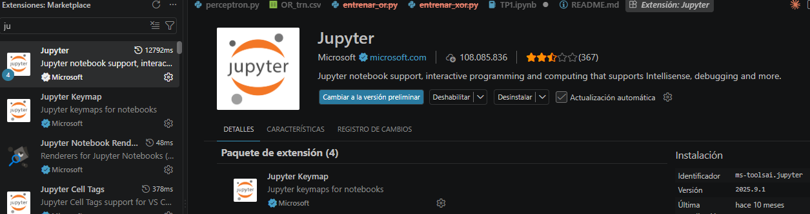

# TP1 — Perceptrón simple


## Contenido

| ruta | qué es |
|---|---|
| `TP.ipynb` | notebook principal: los tres ejercicios con su análisis (incluye la clase `Perceptron`) |
| `src/data_loader.py` | lectura de los archivos de patrones separados por comas |
| `src/graficos.py` | rutinas de graficación: grilla de checkpoints y animación de la recta de separación |
| `Dataset/` | archivos de patrones provistos por la cátedra |
| `Graficos/` | GIFs generados por el notebook (se regeneran al ejecutarlo) |
| `IC_GTP1.pdf` | enunciado original |

## Cómo ejecutarlo

Hace falta Python 3.10 o superior y **Visual Studio Code**. No hace falta abrir Jupyter en el
navegador: se trabaja íntegramente dentro de VS Code.

### 1. Instalar las extensiones de VS Code

En VS Code, abrir el panel de extensiones (`Ctrl+Shift+X`) e instalar estas dos, ambas
publicadas por **Microsoft**:

| extensión | identificador | para qué |
|---|---|---|
| **Python** | `ms-python.python` | reconocer el intérprete y los entornos virtuales |
| **Jupyter** | `ms-toolsai.jupyter` | abrir y ejecutar archivos `.ipynb` |




Buscar por el identificador (por ejemplo `ms-toolsai.jupyter`) evita instalar alguna de las
muchas extensiones parecidas de terceros. Alternativamente, desde una terminal:

```bash
code --install-extension ms-python.python
code --install-extension ms-toolsai.jupyter
```

### 2. Ubicarse en esta carpeta

Abrir en VS Code la carpeta `Perceptrón/TP1` del repositorio clonado
(*Archivo → Abrir carpeta…*).

> **Importante:** hay que abrir **esta** carpeta, no la raíz del repositorio. El notebook
> importa el paquete `src/` y busca los datos en `Dataset/` mediante rutas relativas, así que
> si se abre desde otro lado fallan el `import` y la lectura de los CSV.

### 3. Crear el entorno virtual e instalar las dependencias

En la terminal integrada de VS Code (`Ctrl+Ñ`), estando en `Perceptrón/TP1`:

En Windows (PowerShell):

```powershell
python -m venv .venv
.venv\Scripts\Activate.ps1
pip install -r requirements.txt
```

En Linux o macOS:

```bash
python3 -m venv .venv
source .venv/bin/activate
pip install -r requirements.txt
```

> Si PowerShell bloquea la activación con un error de *execution policy*, ejecutar una vez:
> `Set-ExecutionPolicy -Scope CurrentUser RemoteSigned`

### 4. Abrir el notebook y elegir el kernel

Abrir `TP.ipynb`. Arriba a la derecha aparece el botón **Select Kernel**: elegir
*Python Environments…* y seleccionar el intérprete que dice `.venv` (queda marcado como
**Recommended**).

Si `.venv` no aparece en la lista, cerrar y volver a abrir VS Code para que detecte el
entorno recién creado.

### 5. Ejecutar

Botón **Run All** en la barra superior del notebook, o `Ctrl+Enter` celda por celda.

> Las celdas que generan animaciones (Ejercicios 2 y 3) tardan un par de minutos: arman un GIF
> con varios paneles y hasta 100 frames cuando el entrenamiento no converge (XOR, OR al 90 %).
> Es esperable, no significa que se haya colgado.

## Reproducibilidad

Los pesos se inicializan con una semilla fija (`semilla = 42`), de modo que todas las
corridas dan exactamente los mismos resultados que los citados en el análisis.
