# El perceptrón simple
### Material de estudio — Unidad 1: Redes neuronales

**Inteligencia Computacional** · Ingeniería en Informática · FICH–UNL

De la fisiología de una neurona al primer modelo que aprende solo: suma ponderada, umbral, frontera de decisión, corrección de error y descenso por gradiente — hasta chocar con el XOR.

> Construido sobre las clases 001–005 de **Diego Milone** y su presentación *Perceptrón simple* (60 diapositivas), ampliado con la bibliografía de cátedra: Haykin, *Neural Networks and Learning Machines* (caps. 1 y 3) · Freeman & Skapura, *Neural Networks: Algorithms, Applications and Programming Techniques* (cap. 1) · Kosko, *Neural Networks and Fuzzy Systems* (cap. 2).

**📄 [Versión PDF, 46 páginas, lista para imprimir](Perceptron-simple-apunte.pdf)**

---

## Contenido

0. [Cómo leer este apunte](#0-cómo-leer-este-apunte)
1. [La neurona biológica](#1-la-neurona-biológica)
2. [El modelo: perceptrón simple](#2-el-modelo-perceptrón-simple)
3. [Geometría: qué puede decidir una neurona](#3-geometría-qué-puede-decidir-una-neurona)
4. [El bias: por qué sin él no hay ni OR](#4-el-bias-por-qué-sin-él-no-hay-ni-or)
5. [Aprendizaje por corrección de error](#5-aprendizaje-por-corrección-de-error)
6. [Métodos de gradiente (LMS)](#6-métodos-de-gradiente-lms)
7. [El límite: el XOR](#7-el-límite-el-xor)
8. [Formulario, glosario y errores típicos](#8-formulario-glosario-y-errores-típicos)
9. [Autoevaluación](#9-autoevaluación)
10. [Guía de lectura de la bibliografía](#10-guía-de-lectura-de-la-bibliografía)

---

## 0 Cómo leer este apunte

El texto principal sigue el hilo de las clases. Los recuadros marcan de dónde viene cada cosa, para que sepas siempre qué dijo el profesor y qué agrega un libro:

> [!NOTE]
> **Bibliografía**
>
> Lo que amplía un libro de cátedra y Milone no desarrolla — muchas veces porque él mismo dice «esto lo van a poder consultar en la bibliografía». Siempre con autor y capítulo.

> [!TIP]
> **Para el parcial**
>
> Lo que se pregunta, lo que se confunde, y la respuesta corta que conviene tener lista.

> [!IMPORTANT]
> **La idea de fondo**
>
> El «por qué» detrás de una fórmula: qué problema resuelve, qué pasaría si fuera de otra manera. Es lo que separa saber aplicar de saber entender.

> [!WARNING]
> **Ojo**
>
> Errores, ambigüedades de notación y una errata real de las diapositivas.

Las ecuaciones numeradas (1), (2)… son las que conviene poder escribir de memoria; están todas juntas en el formulario del capítulo 8.

## 1 La neurona biológica

El objetivo declarado de la primera clase es explícito: conocer la fisiología de una neurona «elemental» **para después poder modelarla computacionalmente**. No es una clase de biología: cada elemento que se describe acá va a tener, en el capítulo siguiente, una contraparte matemática exacta.

### 1.1 El cerebro como referencia de escala

La corteza cerebral humana tiene del orden de $10^{11}$ neuronas. Milone da el dato para dimensionar la distancia entre el cerebro y lo que se puede simular: en la materia no se va a modelar semejante cantidad en una computadora estándar.

> [!NOTE]
> **Bibliografía · Haykin, §2**
>
> Haykin da $\sim 10^{10}$ neuronas en la corteza y $6\times10^{13}$ sinapsis. La diferencia con el $10^{11}$ de Milone es normal (varía según se cuente corteza o cerebro completo). Lo importante no es el número sino la **relación: hay unas mil sinapsis por neurona**. Eso anticipa algo central del modelo: lo que se ajusta al aprender son las conexiones, y son muchísimas más que las unidades.
>
> Y el contraste que vale la pena retener: una neurona es **cinco o seis órdenes de magnitud más lenta** que una compuerta de silicio (milisegundos contra nanosegundos), pero el cerebro compensa con cantidad e interconexión masiva — y con una eficiencia energética de $10^{-16}$ joules por operación, varios órdenes mejor que cualquier computadora.

### 1.2 Las seis propiedades que se le piden a una red neuronal

Antes de entrar a la neurona individual, Milone enumera qué se espera de una red. Estas seis propiedades son la **justificación de toda la unidad**: explican por qué se recurre a este tipo de modelo y no a un programa clásico.

| Propiedad | Qué significa |
|---|---|
| **No linealidad** | Un cambio chico en la entrada puede producir un cambio grande en la salida, y *no vale la superposición*: la salida ante la suma de dos entradas no es la suma de las salidas. |
| **Paralelismo** | Muchas unidades operan a la vez, pero cada una es elemental. La potencia está en el conjunto, no en la unidad. |
| **Aprendizaje** | La red aprende de ejemplos, en vez de que alguien programe la solución línea por línea. |
| **Generalización** | Responde bien ante casos *nunca vistos exactamente igual* durante el entrenamiento. |
| **Adaptabilidad** | Se sigue ajustando mientras funciona en el mundo real, más allá del entrenamiento inicial. |
| **Robustez** | Sigue funcionando con ruido o datos faltantes — como reconocer algo a través de un vidrio sucio, o entender una voz cortada por teléfono. |

> [!TIP]
> **Para el parcial**
>
> **Aprendizaje ≠ generalización.** Aprender es ajustarse a los ejemplos dados; generalizar es responder bien fuera de ellos. Una red puede aprender perfecto y generalizar pésimo — eso es sobreajuste. Milone da el argumento decisivo: si el problema fuera solo resolver los ejemplos del libro, se codificaría directo y no haría falta ninguna red.

> [!NOTE]
> **Bibliografía · Kosko, cap. 2**
>
> Kosko explica por qué la no linealidad es obligatoria y no un capricho: *«las funciones de señal lineales hacen que el cómputo y el análisis sean comparativamente fáciles. Pero las funciones lineales no suprimen ruido, así que las redes lineales no son robustas. La no linealidad aumenta la riqueza computacional de una red y facilita la supresión de ruido. Pero la no linealidad arriesga intratabilidad […] y favorece la inestabilidad dinámica.»* Su conclusión: la monotonía acotada (una sigmoidea) es el equilibrio que encontró la evolución. Fijate que esto liga la propiedad 1 con la 6: no linealidad y robustez son la misma cosa vista de dos lados.

### 1.3 Anatomía

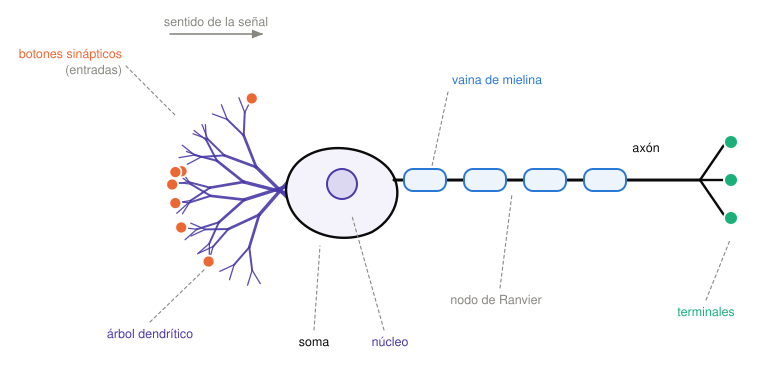

**Figura 1.** *Las partes que importan para el modelo. La asimetría clave es *muchas entradas, una sola salida*: el árbol dendrítico puede recibir miles de conexiones, pero el axón emite un único pulso (que sí se ramifica hacia muchos destinos).*

| Parte | Función | Qué será en el modelo |
|---|---|---|
| Árbol dendrítico | zona receptora: por ahí *entran* los impulsos | las entradas $x_j$ |
| Soma (cuerpo) | integra lo que llega | el sumador |
| Núcleo | procesa | — |
| Cono axónico | donde se suman los potenciales y se decide el disparo | la comparación con el umbral |
| Axón | zona de transmisión: por ahí *sale* la respuesta | la salida $y$ |
| Botón sináptico | punto de contacto con otra neurona | el peso $w_j$ |

> [!NOTE]
> **Bibliografía · Haykin, §2**
>
> La célula piramidal, uno de los tipos más comunes de neurona cortical, *«puede recibir 10.000 o más contactos sinápticos, y puede proyectar sobre miles de células objetivo»*. Criterio para distinguirlos a simple vista: *«un axón tiene una superficie más lisa, menos ramificaciones y mayor longitud, mientras que una dendrita tiene una superficie irregular y más ramificaciones»*.

### 1.4 Reposo, sinapsis y despolarización

Milone lo cuenta funcionalmente: la membrana tiene una polaridad; la sinapsis transmite neurotransmisores cuya finalidad es **despolarizarla**; cuando se acumula suficiente estímulo y se supera un umbral, la neurona emite **un único pulso** por el axón. Ese es el **comportamiento todo o nada**: no hay pulsos parciales.

**Figura 2.** *La sinapsis en detalle. El signo del efecto lo deciden los iones que entran: positivos despolarizan (excitatorio), negativos hiperpolarizan (inhibitorio). Esta es, literalmente, la biología del signo del peso $w$.*

> [!NOTE]
> **Bibliografía · Freeman & Skapura, §1.1**
>
> **De dónde sale el potencial de reposo.** Una bomba sodio-potasio saca Na⁺ y mete K⁺; los iones orgánicos negativos son demasiado grandes para difundir y quedan atrapados adentro. El equilibrio resultante deja una diferencia de potencial de **70 a 100 mV** con el interior más negativo. No es pasividad: es un equilibrio mantenido activamente, y por eso hace falta acumular estímulo para que pase algo.
>
> **Por qué el disparo es «todo o nada».** Acá está la razón física: *«la despolarización en el cono axónico altera la permeabilidad de la membrana al sodio. Como resultado hay un gran ingreso de iones de sodio positivos, **lo que contribuye aún más a la despolarización**. Este efecto autogenerado da como resultado el potencial de acción.»* Es realimentación positiva: cruzado el umbral, la despolarización se alimenta a sí misma y el pulso sale completo. No existe «medio pulso».
>
> **Período refractario.** Tras disparar, un punto queda incapaz de reexcitarse por ~1 ms. Eso limita la frecuencia a unos **1000 pulsos por segundo** — dato que vuelve a aparecer en §2.6.

> [!NOTE]
> **Bibliografía · Kosko, cap. 2**
>
> El umbral de disparo ronda los **−40 mV** y no es fijo: *«es inversamente proporcional a la cantidad de canales moleculares abiertos»*. Y el par iónico antagónico es explícito: **el sodio (Na⁺) es excitatorio** y **el potasio (K⁺) es inhibitorio**.

### 1.5 El aprendizaje ocurre en las sinapsis

Milone marca este punto como «la cuestión clave»: al aprender, se van modificando las sinapsis — las débiles se vuelven fuertes, y algunas pueden desaparecer. Es decir: **lo que cambia con el aprendizaje no son las neuronas, son las conexiones**. Esa idea se traslada íntegra al modelo: entrenar una red es ajustar sus pesos.

> [!NOTE]
> **Bibliografía · Freeman & Skapura, §1.1.4**
>
> > Cuando el axón de una célula A está lo suficientemente cerca como para excitar a una célula B y participa repetida o persistentemente en dispararla, ocurre algún proceso de crecimiento o cambio metabólico en una o ambas células, de modo que la eficiencia de A como una de las células que dispara a B aumenta.
> >
> > — D. Hebb, *The Organization of Behavior*, 1949, p. 50
>
> El ejemplo canónico es el condicionamiento de Pavlov con tres neuronas: **C** (vista de comida) alcanza para disparar a **B** (salivación); **A** (campana) no. Si se hace sonar la campana *mientras B está disparando*, A participa en la excitación de B aunque sola no habría podido — y por el postulado de Hebb la conexión A→B se refuerza. Repetido lo suficiente, la campana sola produce salivación.
>
> Haykin completa el cuadro: la plasticidad del cerebro adulto tiene **dos** mecanismos — modificar las sinapsis existentes *y crear conexiones nuevas*. El segundo es un grado de libertad que un MLP no tiene: ahí la topología es fija y solo cambian los valores.

## 2 El modelo: perceptrón simple

Ahora se toma la neurona biológica y se la reduce a lo mínimo que preserva su comportamiento esencial. El resultado — un modelo que cabe en una línea de código — se llama **perceptrón simple**.

### 2.1 Las entradas y los pesos sinápticos

Hay $N$ entradas $x_1, x_2, \dots, x_N$ (las dendritas). A cada una le corresponde un **peso sináptico** $w_i$, que es la simulación de la conexión entre esa entrada y el árbol dendrítico.

> **Definición**
>
> El **peso sináptico** $w_i$ es un *número real*. Su signo y su magnitud codifican, en un solo número, las dos cosas que en la biología eran separadas:
>
> - $w_i > 0$ → sinapsis **excitatoria**; cuanto más grande, más fuerte.
> - $w_i < 0$ → sinapsis **inhibitoria**; cuanto más negativo, más inhibe.
> - $w_i = 0$ → **desconexión**: esa entrada no influye.
>
> Ponderar por $w_i$ es, literalmente, «pesar» cada entrada según lo que importa para despolarizar la neurona.

Las entradas $x_i$ también son números reales. En los ejemplos suelen valer $\pm 1$, pero en el caso general pueden tomar cualquier valor.

### 2.2 Lo que hace el cuerpo de la neurona: dos operaciones

En el cuerpo neuronal pasan exactamente dos cosas, en ese orden:

1. **Suma ponderada** de las entradas — cada $x_i$ multiplicada por su $w_i$. Es el equivalente de la integración de potenciales en el cono axónico.
2. **Comparación con un umbral** $u$: si la suma lo supera, la neurona dispara.

**Figura 3a.** *Primera versión del modelo. Cada entrada se multiplica por su peso, se suman todas, y el resultado se compara con el umbral $u$.*

$$
y=\varphi\!\left(\sum_{i=1}^{N} w_i x_i - u\right)\qquad\qquad \text{(1)}
$$

donde $\varphi$ es la **función de activación** (§2.5). Si la suma supera el umbral sale $+1$; si no, $-1$.

> [!WARNING]
> **Ojo · convención de la salida**
>
> Milone advierte esto explícitamente: **algunos libros usan $\{0,\,+1\}$ y otros $\{-1,\,+1\}$**. La cátedra usa $\{-1,\,+1\}$ (por eso la función signo). Freeman & Skapura usan $\{0,1\}$ en su tratamiento del XOR; Haykin usa $\{-1,+1\}$. No es un detalle cosmético: la regla de aprendizaje del capítulo 5 depende de que el error $y_d - y$ valga $0$ o $\pm 2$, cosa que solo pasa con $\{-1,+1\}$.

### 2.3 Las tres simplificaciones que se están haciendo

Milone se detiene en esto, y conviene tenerlo claro porque es exactamente la distancia entre el modelo y la biología del capítulo 1:

| En la neurona real | En el modelo |
|---|---|
| Los estímulos llegan en momentos distintos (el ojo y el oído no están sincronizados) | **Todas las entradas llegan simultáneamente** |
| La membrana integra carga a lo largo del tiempo | **La evaluación es instantánea**: se elimina toda la dinámica temporal |
| La salida es un tren de pulsos con una frecuencia | **Un único valor**, $+1$ o $-1$ |

> [!IMPORTANT]
> **La idea de fondo**
>
> Estas simplificaciones no son descuido: son *la* decisión de diseño de la unidad. Al eliminar el tiempo, la neurona deja de ser un sistema dinámico y pasa a ser una **función** $\mathbb{R}^N \to \{-1,+1\}$. Eso es lo que permite estudiarla con álgebra lineal y geometría en vez de con ecuaciones diferenciales — y lo que hace posible todo el capítulo 3. El precio: el modelo no puede representar nada que dependa del orden o del ritmo de las entradas.

### 2.4 El truco de la entrada extendida

La ecuación (1) tiene un término suelto, el $-u$, que no encaja en la sumatoria. Milone lo arregla en dos pasos.

**Paso 1.** Se mete el umbral adentro, restando: en vez de preguntar si la suma supera $u$, se pregunta si la suma menos $u$ supera cero.

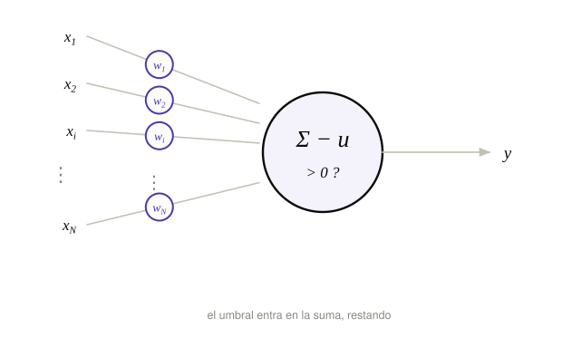

**Figura 3b.** *Mismo modelo, otra escritura: ahora la comparación es siempre contra cero.*

**Paso 2.** Se observa que $-u$ se puede escribir como el producto de una entrada ficticia por un peso ficticio:

$$
x_0 = -1, \qquad w_0 = u \qquad\Longrightarrow\qquad w_0 x_0 = -u\qquad\qquad \text{(2)}
$$

Con eso, el umbral deja de ser un caso especial: es una entrada más. Basta con arrancar la sumatoria en $i=0$ en vez de en $i=1$.

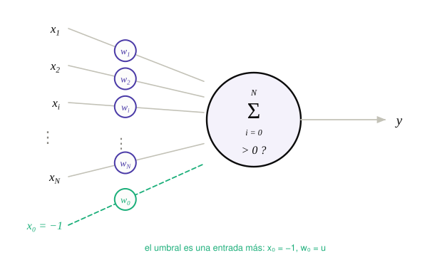

**Figura 3c.** *Versión definitiva. Una sola sumatoria desde $i=0$ describe todo el comportamiento de la neurona.*

$$
y=\varphi\!\left(\sum_{i=0}^{N} w_i x_i\right)=\varphi\big(\langle \mathbf{w}, \mathbf{x}\rangle\big)\qquad\qquad \text{(3)}
$$

La suma ponderada es entonces un **producto interno** entre el vector de pesos $\mathbf{w}=(w_0,w_1,\dots,w_N)$ y el vector de entradas $\mathbf{x}=(x_0,x_1,\dots,x_N)$. Como todo producto interno, devuelve un *escalar*, y ese escalar es el **nivel de activación** de la neurona. Se lo llama también **activación lineal** o, en Haykin, *campo local inducido*.

> [!IMPORTANT]
> **La idea de fondo**
>
> El truco de la entrada extendida no es cosmético: convierte una expresión afín ($\mathbf{w}\cdot\mathbf{x} - u$) en una lineal ($\mathbf{w}\cdot\mathbf{x}$) subiendo una dimensión. A partir de acá, *todo* lo que sigue — la geometría del capítulo 3, la regla de aprendizaje del 5, el gradiente del 6 — se escribe con un solo símbolo, $\mathbf{w}$, sin tratar al umbral aparte. Es la razón por la que en la práctica nunca se programa el bias como caso especial: se agrega una columna de $-1$ (o de $+1$) a los datos y listo.

> [!WARNING]
> **Ojo · el signo de $x_0$ cambia entre libros**
>
> Esta es **la** confusión que hay que tener resuelta antes de abrir Haykin:
>
> | Fuente | $x_0$ | $w_0$ | Término que aporta |
> |---|---|---|---|
> | Milone / cátedra | $-1$ | $w_0 = u$ (umbral) | $-u$ |
> | Haykin | $+1$ | $w_0 = b$ (bias) | $+b$ |
>
> Ambos describen lo mismo, con $b = -u$. Si copiás una fórmula de Haykin a un ejercicio de la cátedra sin ajustar el signo, el bias te va a quedar al revés y la recta desplazada para el lado equivocado. En este apunte se usa siempre la convención de la cátedra: $x_0=-1$, $w_0=u$.

### 2.5 Funciones de activación

La función $\varphi$ es lo que convierte la activación lineal en la salida. La cátedra presenta cinco.

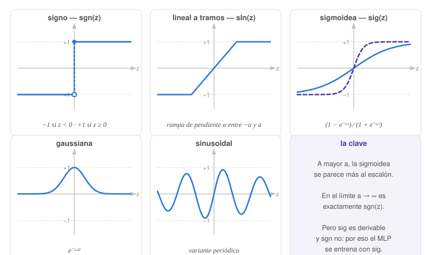

**Figura 4.** *Las funciones de activación de la materia. El punto lleno y el punto hueco en la primera marcan que $\operatorname{sgn}(0)=+1$.*

#### Función signo

$$
\operatorname{sgn}(z)=\begin{cases}-1 & \text{si } z<0\\[2pt] +1 & \text{si } z\ge 0\end{cases}\qquad\qquad \text{(4)}
$$

Es la traducción literal del comportamiento todo o nada. Su problema: tiene una discontinuidad en $z=0$ y **no es derivable**.

#### Lineal a tramos

$$
\operatorname{sln}(z)=\begin{cases}-1 & \text{si } z<-a\\[2pt] \alpha z & \text{si } -a\le z< a\\[2pt] +1 & \text{si } z\ge a\end{cases}\qquad\qquad \text{(5)}
$$

Reemplaza el salto por una **rampa lineal** de pendiente $\alpha$. Para que la función sea continua hace falta $\alpha = 1/a$: cuanto más chico el ancho $a$ de la zona de transición, más empinada la rampa, y más se parece al escalón.

> [!WARNING]
> **Ojo · errata en la diapositiva**
>
> La diapositiva escribe la condición del tramo central como *«$\alpha z$ si $-a. Es una errata: el dibujo de la propia diapositiva muestra la rampa yendo de $-a$ hasta $+a$, y con la condición tal como está escrita la función quedaría indefinida entre $0$ y $a$. Lo correcto es $-a \le z < a$, como en la ecuación (5).*

#### Sigmoidea

$$
\operatorname{sig}(z)=\frac{1-e^{-az}}{1+e^{-az}}\qquad\qquad \text{(6)}
$$

No tiene discontinuidades, sigue siendo no lineal, y crece siempre entre $-1$ y $+1$. La constante $a$ controla la pendiente: **cuanto más grande es $a$, más se parece a la función signo**, y en el límite $a\to\infty$ *es* la función signo.

> [!IMPORTANT]
> **La idea de fondo · por qué la sigmoidea**
>
> Milone lo anticipa sin desarrollarlo: la sigmoidea da «una gran ventaja cuando tengamos que hacer una simple derivada». Ese es el motivo entero.
>
> El capítulo 6 va a entrenar la neurona moviendo los pesos en contra del gradiente del error. Para calcular ese gradiente hay que derivar la salida respecto de los pesos, y por la regla de la cadena aparece $\varphi'(z)$. Con $\varphi = \operatorname{sgn}$ eso no existe: la derivada es $0$ en todos lados salvo en $z=0$, donde no está definida. Un gradiente que vale cero en casi todo el dominio no da ninguna información sobre hacia dónde moverse.
>
> Por eso el modelo «suaviza» la biología: el escalón es más fiel al todo o nada, pero la sigmoidea es la que se puede entrenar. Y como es el escalón en el límite, no se pierde el comportamiento — se lo recupera tan aproximado como uno quiera subiendo $a$.

> [!NOTE]
> **Bibliografía · Haykin, §3 «Models of a Neuron»**
>
> Haykin formaliza exactamente esta distinción. A la neurona con función umbral la llama *«modelo de McCulloch–Pitts, en reconocimiento del trabajo pionero de McCulloch y Pitts (1943) […] Esto describe la propiedad **todo o nada** del modelo»*. Y sobre la sigmoidea: *«es por lejos la forma más común […] Nótese también que la función sigmoidea es derivable, mientras que la función umbral no lo es. (La derivabilidad es una característica importante de la teoría de redes neuronales, como se describe en el Capítulo 4)»* — y el capítulo 4 de Haykin es, precisamente, *back-propagation*.

> [!NOTE]
> **Bibliografía · Kosko · el matiz que reconcilia todo**
>
> ¿No era que la neurona biológica es «todo o nada»? ¿Por qué entonces Kosko afirma que *«casi todas las neuronas biológicas tienen características de señal sigmoidales»*?
>
> Porque son dos escalas distintas. El **disparo individual** es binario. Pero **lo que transmite información es la frecuencia de disparo**: Kosko define la señal como *«la frecuencia de disparo de potenciales de acción en un intervalo de muestreo»* (los últimos 10 a 30 ms). Y esa frecuencia es continua y acotada: por abajo en 0 (no disparar) y por arriba por el período refractario, en ~1000 pulsos/s (§1.4). Una magnitud creciente y saturada en ambos extremos: **exactamente la forma de una sigmoidea**.
>
> Por eso Freeman & Skapura pueden decir que *«la salida del elemento de proceso corresponde a la frecuencia de disparo de la neurona»* y representarla con un número real, sin contradecir nada. **Binario en el pulso, continuo en la tasa.**

#### Otras

La **gaussiana** —que reaparece en la materia con las redes de base radial (RBF)— y una **sinusoidal**, que Milone menciona solo como muestra de que las variantes son muchas. En una gaussiana la neurona responde según la *distancia* a un centro, no según un semiplano: es otra geometría, y por eso las RBF son un tema aparte.

## 3 Geometría: qué puede decidir una neurona

Con dos entradas se puede dibujar todo, y lo que se ve con dos vale en general. Esta es la parte que conviene entender de verdad: casi todo lo que sigue en la unidad es geometría.

### 3.1 El perceptrón de dos entradas

Con $N=2$ y activación signo, la ecuación (3) se reduce a algo que se calcula de memoria:

$$
y=\operatorname{sgn}(w_1x_1+w_2x_2)\qquad\qquad \text{(7)}
$$

Milone insiste en lo barato que es: «es un modelo muy sencillo, muy fácil de calcular, lo hacen con una línea de código en cualquier lenguaje». Si la suma da $3{,}5$ la salida es $+1$; si da $-15$, la salida es $-1$. Fin.

### 3.2 El punto crítico: dónde cambia la decisión

Lo interesante no son los valores de la suma sino **dónde cambia de signo**. Ese lugar es el conjunto de entradas para las que la suma ponderada vale exactamente cero:

$$
w_1x_1+w_2x_2=0\qquad\qquad \text{(8)}
$$

Y esa es la ecuación de una **recta**. Despejando $x_2$:

$$
x_2=-\frac{w_1}{w_2}\,x_1\qquad\qquad \text{(9)}
$$

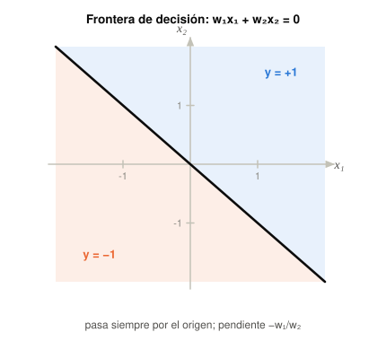

**Figura 5.** *La frontera de decisión sin bias: una recta de pendiente $-w_1/w_2$ que pasa *siempre* por el origen. Cambiar los pesos la hace más o menos empinada, pero nunca la despega del origen.*

> **Definición**
>
> La **frontera de decisión** (o superficie de decisión) es el conjunto de puntos donde la activación lineal vale cero. Divide el espacio de entrada en dos **semiplanos**: en uno la neurona responde $+1$, en el otro $-1$. Todo lo que puede hacer un perceptrón simple es decidir de qué lado de esa frontera cae la entrada.

Un ejemplo concreto de la clase: si $w_1=w_2=1$, la recta queda a $-45°$. Para la entrada $x_1=1$, $x_2=1$ la suma da $1\cdot 1+1\cdot 1=2>0$, así que toda esa región de arriba responde $+1$, y toda la de abajo responde $-1$.

### 3.3 Qué significa geométricamente el vector de pesos

Esto no está en las clases, pero es la forma más rápida de entender todo lo que viene — sobre todo la regla de aprendizaje del capítulo 5.

Escribamos la frontera en forma vectorial. Con la entrada extendida, la frontera es $\langle\mathbf{w},\mathbf{x}\rangle=0$: el conjunto de vectores **ortogonales a $\mathbf{w}$**. Es decir:

> [!IMPORTANT]
> **La idea de fondo**
>
> **El vector de pesos $\mathbf{w}$ es perpendicular a la frontera de decisión, y apunta hacia el lado donde la neurona responde $+1$.**
>
> De ahí salen tres consecuencias inmediatas:
>
> - Cambiar la *dirección* de $\mathbf{w}$ **gira** la frontera.
> - Cambiar su *módulo* no mueve la frontera para nada: $\mathbf{w}$ y $2\mathbf{w}$ definen la misma recta. Por eso hay infinitas soluciones a un mismo problema.
> - El valor $\langle\mathbf{w},\mathbf{x}\rangle$ es proporcional a la **distancia con signo** del punto a la frontera: mide no solo *de qué lado* cae la entrada, sino *qué tan lejos* del límite está. Un valor grande es una decisión «confiada».

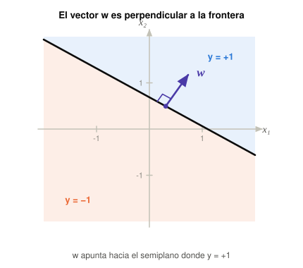

**Figura 7.** *$\mathbf{w}$ es normal a la frontera. Girar $\mathbf{w}$ gira la recta; estirarlo no la mueve.*

### 3.4 En general: hiperplanos

Con $N$ entradas el razonamiento es idéntico, solo cambia el nombre del objeto:

| Entradas | Espacio | Frontera de decisión |
|---|---|---|
| $N=1$ | una recta | un punto |
| $N=2$ | el plano | una recta |
| $N=3$ | el espacio | un plano |
| $N$ | $\mathbb{R}^N$ | un **hiperplano** de dimensión $N-1$ |

> [!NOTE]
> **Bibliografía · Haykin, §1.2**
>
> *«En la forma más simple del perceptrón hay dos regiones de decisión separadas por un hiperplano, definido por $\sum_{i=1}^{m} w_i x_i + b = 0$. […] Un punto $(x_1,x_2)$ que cae por encima de la recta frontera se asigna a la clase $\mathcal{C}_1$, y uno que cae por debajo a la clase $\mathcal{C}_2$. Nótese también que **el efecto del bias $b$ es meramente desplazar la frontera de decisión lejos del origen**.»* — esa última frase es exactamente el tema del capítulo 4.

### 3.5 Separabilidad lineal

Lo anterior deja planteado el límite del modelo, mucho antes de llegar al XOR: si la única frontera disponible es un hiperplano, entonces **un perceptrón simple solo puede resolver problemas cuyas clases se puedan separar con un hiperplano**.

> **Definición**
>
> Dos clases son **linealmente separables** si existe un hiperplano que deja todos los puntos de una clase de un lado y todos los de la otra del otro lado. Formalmente: existe $\mathbf{w}$ tal que $\langle\mathbf{w},\mathbf{x}\rangle > 0$ para todo $\mathbf{x}$ de la clase 1 y $\langle\mathbf{w},\mathbf{x}\rangle \le 0$ para todo $\mathbf{x}$ de la clase 2.

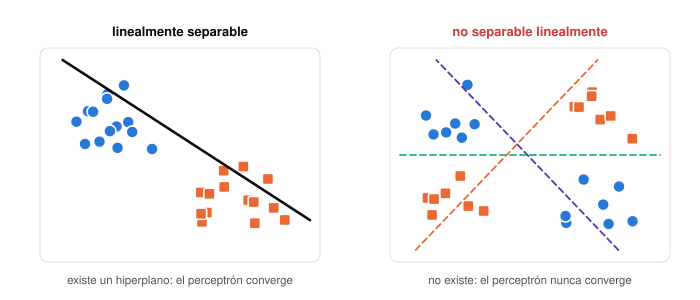

**Figura 10.** *Izquierda: existe un hiperplano; el algoritmo de aprendizaje tiene garantía de convergencia (§5.5). Derecha: no existe, y ninguna cantidad de iteraciones lo va a encontrar. El caso de la derecha es la forma general del XOR.*

> [!TIP]
> **Para el parcial**
>
> La separabilidad lineal es una propiedad **de los datos**, no del algoritmo. Ningún método de entrenamiento puede arreglar un problema no separable con una sola neurona: la limitación es la forma de la frontera, no la forma de buscarla. Por eso la solución (que se ve más adelante en la materia) no es entrenar mejor sino *agregar capas*.

## 4 El bias: por qué sin él no hay ni OR

Milone construye este capítulo entero alrededor de un ejemplo que parece trivial y no lo es: la función lógica OR.

### 4.1 El problema

Con la convención $\text{verdadero}=+1$, $\text{falso}=-1$, la tabla del OR es:

| $x_1$ | $x_2$ | OR | como punto del plano |
|---|---|---|---|
| $+1$ | $+1$ | $+1$ | arriba a la derecha |
| $-1$ | $+1$ | $+1$ | arriba a la izquierda |
| $+1$ | $-1$ | $+1$ | abajo a la derecha |
| $-1$ | $-1$ | $-1$ | abajo a la izquierda |

Tres puntos en $+1$, uno solo en $-1$. Parece fácil: alcanzaría con una recta que deje aislada la esquina de abajo a la izquierda. Y sin embargo, con la ecuación (9) —una recta obligada a pasar por el origen— no hay ninguna que separe las dos clases.

### 4.2 Por qué falla, y por qué no es cuestión de probar más

En la clase el argumento es por ensayo: se prueba una recta, queda mal un punto; se la gira, queda mal otro. Hay una razón estructural detrás, y vale la pena tenerla porque cierra el asunto de una vez:

> [!IMPORTANT]
> **La idea de fondo · el argumento de los opuestos**
>
> Los puntos $(-1,+1)$ y $(+1,-1)$ son **opuestos**: uno es el negativo del otro, $\mathbf{x}' = -\mathbf{x}$.
>
> Para cualquier recta que pase por el origen, $\langle\mathbf{w},-\mathbf{x}\rangle = -\langle\mathbf{w},\mathbf{x}\rangle$: las activaciones de dos puntos opuestos son *el mismo número con el signo cambiado*. Solo hay dos posibilidades:
>
> - La activación **no** es cero → los signos son contrarios → uno de los dos puntos queda mal, y el OR exige que ambos den $+1$.
> - La activación **es exactamente cero** → los dos puntos caen justo *encima* de la recta, ni de un lado ni del otro.
>
> Conclusión: **no existe ninguna recta por el origen que deje a las dos clases del OR estrictamente de lados opuestos.** Lo más que se puede hacer es apoyar los dos puntos sobre la frontera — y eso, como se ve enseguida, no sirve.

> [!WARNING]
> **Ojo · el caso degenerado, y por qué no cuenta**
>
> Con la convención de la cátedra $\operatorname{sgn}(0)=+1$, esa situación límite *aprueba* la tabla del OR. Con $w_1=w_2=1$ y sin bias:
>
> | $x_1$ | $x_2$ | $x_1+x_2$ | $y$ | observación |
> |---|---|---|---|---|
> | $+1$ | $+1$ | $+2$ | $+1$ | bien, con margen |
> | $-1$ | $+1$ | $0$ | $+1$ | **justo sobre la recta** |
> | $+1$ | $-1$ | $0$ | $+1$ | **justo sobre la recta** |
> | $-1$ | $-1$ | $-2$ | $-1$ | bien, con margen |
>
> Los cuatro vértices dan el valor correcto, pero **no es una solución**, por dos razones:
>
> 1. **No separa nada.** Dos de los cuatro puntos están *sobre* la frontera. Salen $+1$ únicamente por el desempate de la convención: si la cátedra hubiera definido $\operatorname{sgn}(0)=-1$, la misma recta fallaría en dos casos.
> 2. **Es frágil.** Y acá se ve por qué Milone puso ejemplos ruidosos en el archivo de entrenamiento (§5.1): basta que la entrada sea $(-1{,}1,\;+0{,}9)$ en vez de $(-1,+1)$ para que la activación pase a $-0{,}2$ y la salida a $-1$ — lo contrario de lo correcto. Con $w_0=-1$ esa misma entrada da $+0{,}8$ y sale bien.
>
> Moraleja: el bias no solo permite resolver el OR, sino resolverlo **con margen** —con los puntos lejos de la frontera—, que es exactamente la «decisión confiada» de §3.3 y lo que hace que la solución sobreviva al ruido.

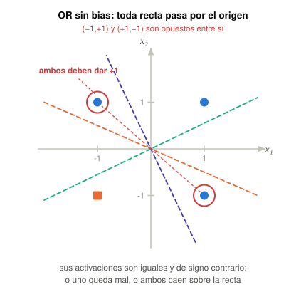

**Figura 6.** *Sin bias, cualquier recta pasa por el origen. Los dos puntos circulados son opuestos entre sí, así que sus activaciones son iguales y de signo contrario: o uno queda mal clasificado, o ambos caen exactamente sobre la recta. El OR exige que los dos den $+1$ y estén de un lado.*

### 4.3 La solución: despegar la recta del origen

Lo que hace falta es una recta que *no* pase por el origen. Y eso es exactamente lo que agrega el término $w_0x_0 = -w_0$ de la entrada extendida. La frontera pasa a ser:

$$
w_1x_1+w_2x_2-w_0=0 \qquad\Longleftrightarrow\qquad x_2=\frac{w_0}{w_2}-\frac{w_1}{w_2}\,x_1\qquad\qquad \text{(10)}
$$

Comparada con la ecuación (9), apareció una **ordenada al origen** $w_0/w_2$. La pendiente sigue dependiendo de $w_1$ y $w_2$; el desplazamiento lo controla $w_0$. Ahora sí se puede aislar la esquina.

La solución que muestra la diapositiva es $w_1=1$, $w_2=1$, $w_0=-1$, o sea la neurona $y=\operatorname{sgn}(x_1+x_2+1)$:

| $x_1$ | $x_2$ | $x_1+x_2+1$ | $y$ | OR esperado |
|---|---|---|---|---|
| $+1$ | $+1$ | $+3$ | $+1$ | $+1$ ✓ |
| $-1$ | $+1$ | $+1$ | $+1$ | $+1$ ✓ |
| $+1$ | $-1$ | $+1$ | $+1$ | $+1$ ✓ |
| $-1$ | $-1$ | $-1$ | $-1$ | $-1$ ✓ |

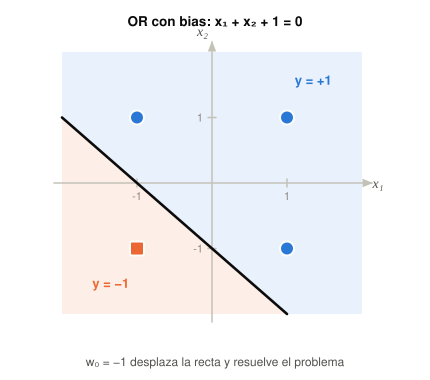

**Figura 6b.** *Con $w_0=-1$ la recta se desplaza y aísla el único punto de la clase $-1$. El problema estaba resuelto todo el tiempo: solo faltaba el grado de libertad del desplazamiento.*

> [!TIP]
> **Para el parcial · tres nombres, una cosa**
>
> El mismo parámetro aparece en la bibliografía como **umbral** ($u$), **bias** ($b$) y **sesgo**. Milone lo dice explícitamente: «eso también lo van a encontrar en la bibliografía como *bias* o sesgo». Y la conclusión que él remarca: **cada neurona de una red debe tener su bias**, porque si no, ni siquiera un problema tan elemental como el OR tiene solución.

> [!IMPORTANT]
> **La idea de fondo · contando grados de libertad**
>
> Sin bias, una neurona de $N$ entradas tiene $N$ parámetros, pero solo $N-1$ importan (el módulo de $\mathbf{w}$ no mueve la frontera): son las *orientaciones* posibles de un hiperplano que pasa por el origen. Con bias hay $N+1$ parámetros y $N$ efectivos: orientación *más* desplazamiento. Ese grado de libertad extra es la diferencia entre «hiperplanos por el origen» e «hiperplanos, a secas».

### 4.4 Y sin embargo, algo falta

Milone cierra la clase con la pregunta correcta: hasta acá **los pesos los pusimos nosotros a mano**. Pero la propiedad 3 de la lista de §1.2 decía que la red tiene que aprender sola a partir de ejemplos. Eso es el capítulo siguiente.

## 5 Aprendizaje por corrección de error

El objetivo ahora: que la neurona encuentre sola los $w_i$ a partir de ejemplos. Milone lo plantea como «un algoritmo intuitivo», y recién en el capítulo 6 lo deriva formalmente. El orden es deliberado: primero se ve *por qué* la regla tiene la forma que tiene, después se demuestra que es la correcta.

### 5.1 Los ingredientes

#### Inicialización al azar

Se arranca con pesos aleatorios **pequeños**: la diapositiva especifica $\mathbf{w}(1)\in[-0{,}5,\;0{,}5]$. Milone admite que «en principio parece extraño», y explica la idea: el algoritmo debería encontrar buenos pesos *independientemente de dónde se inicie*.

#### El conjunto de entrenamiento

Un archivo con muchos pares *entrada → salida deseada*. Para el OR:

| $x_1$ | $x_2$ | $y_d$ | comentario |
|---|---|---|---|
| $+1$ | $+1$ | $+1$ | caso ideal |
| $+1$ | $-1$ | $+1$ | caso ideal |
| $+0{,}9$ | $+1{,}1$ | $+1$ | «verdadero, verdadero» con ruido |
| $-0{,}7$ | $-1{,}1$ | $-1$ | «falso, falso» con ruido |

> [!IMPORTANT]
> **La idea de fondo**
>
> Que Milone incluya casos ruidosos en el ejemplo no es un detalle: es la propiedad 6 (robustez) y la 4 (generalización) apareciendo en acto. Si el archivo tuviera solo los cuatro vértices exactos, entrenar sería una forma cara de escribir una tabla. Lo que se le pide a la neurona es que responda bien también a $(0{,}9,\;1{,}1)$, que nunca vio.

#### Notación de la iteración

Se agrega el índice $n$: cada vez que se muestra un ejemplo, ocurre una iteración y la neurona «aprende un poquito más». La salida en la iteración $n$ es

$$
y(n)=\varphi\big(\langle\mathbf{w}(n),\mathbf{x}(n)\rangle\big)\qquad\qquad \text{(11)}
$$

y $y_d(n)$ es la salida deseada que dice el archivo.

### 5.2 Principio de mínima perturbación

> **Definición**
>
> **Principio de mínima perturbación:** si para el ejemplo actual la salida ya es correcta, no se toca nada.
>
> $$ y(n)=y_d(n)\;\Longrightarrow\;\mathbf{w}(n+1)=\mathbf{w}(n) $$
>
> Milone lo resume así: «si la cosa está bien, no cambio nada, lo dejo como está».

No es pereza: cada ajuste que se hace para arreglar un ejemplo puede romper otro. Cambiar solo cuando hay evidencia de error es lo que permite que el proceso converja en vez de oscilar.

### 5.3 Penalización: los dos casos

Si la salida es incorrecta, hay que mover los pesos «en el sentido opuesto al que contribuyeron para que la neurona se equivoque». Suponiendo entradas positivas ($x_i(n)>0$) para razonarlo:

#### Caso A — se activó de más

Salió $y(n)=+1$ pero debía salir $y_d(n)=-1$. La suma ponderada dio positiva y tenía que dar negativa: hay que **hacerla más negativa**, o sea restarle a los pesos una proporción de las entradas.

$$
\mathbf{w}(n+1)=\mathbf{w}(n)-\eta\,\mathbf{x}(n)\qquad\qquad \text{(12a)}
$$

#### Caso B — faltó activarse

Salió $y(n)=-1$ pero debía salir $y_d(n)=+1$. Hay que **hacer la suma más positiva**: sumarle a los pesos una proporción de las entradas.

$$
\mathbf{w}(n+1)=\mathbf{w}(n)+\eta\,\mathbf{x}(n)\qquad\qquad \text{(12b)}
$$

La constante $\eta$ (la **velocidad de aprendizaje**) es chica — Milone usa $0{,}1$ en el ejemplo. Si los pesos valían $0{,}7$ y $0{,}8$ y se les resta $0{,}1$ por la entrada, «van a valer algo menos», y la próxima vez que entre ese mismo patrón la suma va a dar más chica o directamente negativa.

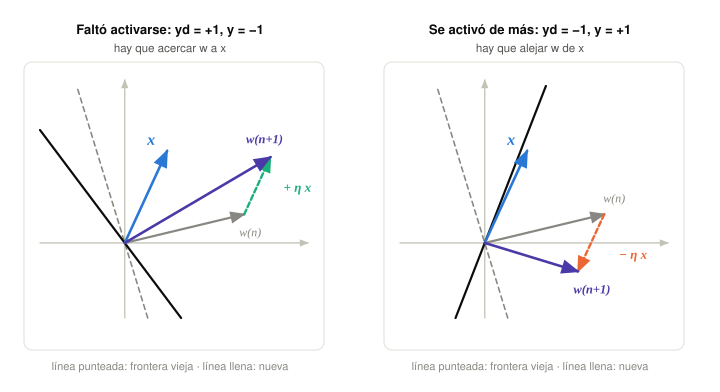

**Figura 11.** *La misma regla, vista como geometría. Sumar $\eta\mathbf{x}$ *acerca* el vector de pesos a la entrada; restarlo lo *aleja*. Como la frontera es perpendicular a $\mathbf{w}$ (§3.3), mover $\mathbf{w}$ la hace girar en la dirección que corrige el error.*

> [!IMPORTANT]
> **La idea de fondo**
>
> Esta figura es la mejor forma de recordar la regla. Sumar $\eta\mathbf{x}$ aumenta $\langle\mathbf{w},\mathbf{x}\rangle$ — porque $\langle\mathbf{w}+\eta\mathbf{x},\mathbf{x}\rangle=\langle\mathbf{w},\mathbf{x}\rangle+\eta\|\mathbf{x}\|^2$ y el segundo término es siempre positivo. Restar lo disminuye, por lo mismo. **Este argumento no necesita suponer entradas positivas**: vale para cualquier $\mathbf{x}$, lo cual explica por qué la regla funciona en general aunque Milone la haya motivado con $x_i>0$.

### 5.4 Las dos reglas en una sola ecuación

Los casos A y B se unifican observando que el error $y_d(n)-y(n)$ ya contiene el signo y la condición de «no cambiar nada»:

$$
\boxed{\;\mathbf{w}(n+1)=\mathbf{w}(n)+\frac{\eta}{2}\big[y_d(n)-y(n)\big]\,\mathbf{x}(n)\;}\qquad\qquad \text{(13)}
$$

Verificación de los tres casos, que es donde se ve por qué aparece el $\tfrac12$:

| $y_d$ | $y$ | $y_d-y$ | ajuste | corresponde a |
|---|---|---|---|---|
| $+1$ | $+1$ | $0$ | ninguno | mínima perturbación |
| $-1$ | $-1$ | $0$ | ninguno | mínima perturbación |
| $-1$ | $+1$ | $-2$ | $-\eta\,\mathbf{x}$ | caso A (12a) |
| $+1$ | $-1$ | $+2$ | $+\eta\,\mathbf{x}$ | caso B (12b) |

El $2$ del error se cancela con el $\tfrac12$ del coeficiente y queda exactamente $\pm\eta\mathbf{x}$. Milone lo dice con esas palabras: «este 2 se simplifica con el 2 que pusimos acá abajo».

### 5.5 El algoritmo completo

**Algoritmo del perceptrón simple**

1. **Inicialización** al azar: $\mathbf{w}(1)\in[-0{,}5,\;0{,}5]$.
2. **Para cada ejemplo** de entrenamiento $\mathbf{x}(n)\,|\,y_d(n)$:
  - se obtiene la salida: $y(n)=\varphi\big(\langle\mathbf{w}(n),\mathbf{x}(n)\rangle\big)$
  - se adaptan los pesos: $\mathbf{w}(n+1)=\mathbf{w}(n)+\frac{\eta}{2}\,[\,y_d(n)-y(n)\,]\,\mathbf{x}(n)$
3. **Volver a 2** hasta satisfacer algún criterio de finalización.

Sobre el paso 3: como la velocidad de aprendizaje es chica, cada ejemplo aporta poquito, así que hay que **recorrer el archivo de entrenamiento muchas veces** —a cada pasada completa se la llama *época*— hasta que la neurona no se equivoque en ningún caso, o en la menor cantidad posible.

> [!TIP]
> **Para el parcial**
>
> Los criterios de finalización habituales: (a) cero errores en una época completa; (b) el error dejó de bajar; (c) se alcanzó un número máximo de épocas. El (c) hace falta siempre, porque si el problema *no* es linealmente separable el criterio (a) no se cumple nunca y el algoritmo no termina.

### 5.6 El teorema de convergencia

Esto no está en las clases pero es *el* resultado teórico del tema, y es lo que justifica que el algoritmo no sea solo una receta razonable.

> [!NOTE]
> **Bibliografía · Haykin, cap. 1 §1.3**
>
> > Sean $\mathcal{H}_1$ y $\mathcal{H}_2$ subconjuntos de vectores de entrenamiento **linealmente separables**. Sean las entradas presentadas al perceptrón provenientes de esos dos subconjuntos. El perceptrón converge después de $n_0$ iteraciones, en el sentido de que
> >
> > $$ \mathbf{w}(n_0)=\mathbf{w}(n_0+1)=\mathbf{w}(n_0+2)=\cdots $$
> >
> > es un vector solución para $n_0\le n_{\max}$.
> >
> > — Teorema de convergencia del perceptrón (Rosenblatt, 1962)
>
> La demostración acota el número máximo de correcciones:
>
> $$n_{\max}=\frac{\beta\,\|\mathbf{w}_o\|^2}{\alpha^2},\qquad \alpha=\min_{\mathbf{x}\in\mathcal{H}_1}\mathbf{w}_o^{T}\mathbf{x},\qquad \beta=\max_{\mathbf{x}\in\mathcal{H}_1}\|\mathbf{x}\|^2$$
>
> donde $\mathbf{w}_o$ es cualquier solución. La idea de la prueba es elegante: se muestra que $\|\mathbf{w}(n+1)\|^2$ crece *al menos* cuadráticamente con $n$ por un lado, y *a lo sumo* linealmente por el otro. Como ambas cosas no pueden ser ciertas indefinidamente, el número de correcciones tiene que ser finito.
>
> Haykin agrega dos observaciones prácticas: el valor de $\eta$ «no es importante mientras sea positivo» —solo escala los vectores sin afectar su separabilidad— y arrancar de un $\mathbf{w}(0)$ distinto de cero «meramente aumenta o disminuye el número de iteraciones necesarias; independientemente del valor asignado, la convergencia está asegurada».

> [!TIP]
> **Para el parcial · lo que el teorema NO dice**
>
> - No dice nada si los datos **no** son linealmente separables: en ese caso el algoritmo puede oscilar para siempre.
> - No dice que la solución encontrada sea «la mejor»: converge a *alguna* recta que separa, no a la que deja más margen.
> - No acota el tiempo en términos útiles: $n_{\max}$ depende de $\mathbf{w}_o$, que es justamente lo que no se conoce.

## 6 Métodos de gradiente (LMS)

La misma regla, otra vez — pero ahora deducida en vez de intuida. Milone lo justifica así: «en principio es equivalente a lo que vimos antes, pero tiene un mayor sustento matemático». Y tiene una segunda razón, más importante: el método del gradiente **se generaliza a redes completas**, y de ahí sale *back-propagation*.

### 6.1 La idea

Cada combinación de pesos produce un error. Si se grafica el error en función de los pesos se obtiene una **superficie de error**. Parado en cualquier punto de esa superficie, el **gradiente** es un vector que apunta hacia donde el error *crece*. Entonces, para reducirlo, hay que moverse en el sentido **opuesto**.

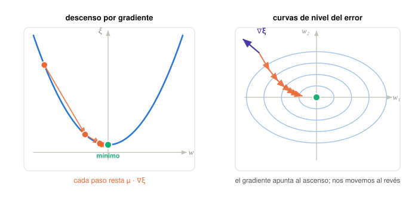

**Figura 8.** *Izquierda: un corte de la superficie de error; cada paso resta una fracción del gradiente y se acerca al mínimo. Derecha: la misma idea en el plano $(w_1,w_2)$ — el gradiente $\nabla\xi$ apunta al ascenso, y el recorrido va en contra.*

$$
\mathbf{w}(n+1)=\mathbf{w}(n)-\mu\,\nabla_{\!w}\,\xi\big(\mathbf{w}(n)\big)\qquad\qquad \text{(14)}
$$

donde $\xi$ es la función de error y $\mu$ la velocidad de aprendizaje. Milone es explícito sobre el compromiso: «si la hago más grande se va a mover más rápido en la superficie; si la hago más pequeña se va a mover más lentamente. En el caso de tener superficies suaves puedo ir más rápido, y si la superficie es muy escarpada o tiene muchos altibajos voy a tener que moverme con más cuidado».

> [!NOTE]
> **Bibliografía · Haykin, cap. 1 §1.3**
>
> El mismo compromiso, enunciado como dos requisitos en conflicto: *«promediado de las entradas pasadas para dar estimaciones estables de los pesos, lo que requiere un $\eta$ pequeño»* contra *«adaptación rápida respecto de cambios reales en las distribuciones subyacentes, lo que requiere un $\eta$ grande»*. Haykin recomienda $0<\eta\le 1$.

### 6.2 La derivación, paso a paso

**Aviso importante.** Milone lo repite dos veces y conviene subrayarlo: acá se analiza el **caso lineal**. Se *elimina* la función de activación —$\varphi$ es la identidad, no el signo ni una sigmoidea— para que la derivada sea simple. La versión con activación completa viene después en la materia.

**1. Criterio del error instantáneo.** Se mide el error cuadrático entre la salida deseada $d(n)$ y la real $y(n)$:

$$
e^2(n)=\big[d(n)-y(n)\big]^2=\big[d(n)-\langle\mathbf{w}(n),\mathbf{x}(n)\rangle\big]^2\qquad\qquad \text{(15)}
$$

Se eleva al cuadrado por dos motivos: para que errores positivos y negativos no se cancelen, y porque —a diferencia del valor absoluto— el cuadrado es derivable en cero.

**2. Se calcula el gradiente respecto de los pesos.** Acá está el punto que más se equivoca: **se deriva respecto de $\mathbf{w}$, no de $\mathbf{x}$**. Milone lo avisa: «yo estoy derivando con respecto a los pesos, no con respecto a $x$ como ustedes hacían en matemáticas; acá $x$ sería una constante para mí».

Aplicando la regla de la cadena a $[\,\cdot\,]^2$: baja el $2$, queda el paréntesis igual, y se multiplica por la derivada de lo de adentro. Y la derivada de $d(n)-\langle\mathbf{w},\mathbf{x}\rangle$ respecto de $\mathbf{w}$ es $-\mathbf{x}(n)$, porque $d(n)$ es una constante y $\mathbf{x}(n)$ es el factor que multiplica a la variable:

$$
\nabla_{\!w}\,e^2(n)=2\big[d(n)-\langle\mathbf{w}(n),\mathbf{x}(n)\rangle\big]\big(-\mathbf{x}(n)\big)=2\,e(n)\big(-\mathbf{x}(n)\big)\qquad\qquad \text{(16)}
$$

**3. Se reemplaza en la ecuación (14).** Los dos signos menos se cancelan:

$$
\boxed{\;\mathbf{w}(n+1)=\mathbf{w}(n)+2\mu\,e(n)\,\mathbf{x}(n)\;}\qquad\qquad \text{(17)}
$$

### 6.3 Es la misma regla

Comparemos las dos ecuaciones enmarcadas:

| Origen | Regla | coeficiente de $e\,\mathbf{x}$ |
|---|---|---|
| Intuitiva (13) | $\mathbf{w}+\frac{\eta}{2}\,[\,y_d-y\,]\,\mathbf{x}$ | $\eta/2$ |
| Gradiente (17) | $\mathbf{w}+2\mu\,e\,\mathbf{x}$ | $2\mu$ |
| Haykin (1.22) | $\mathbf{w}+\eta\,[\,d-y\,]\,\mathbf{x}$ | $\eta$ |

Las tres tienen exactamente la misma forma: **pesos actuales, más una constante positiva, por el error, por la entrada**. Lo único que cambia es cómo se bautiza la constante. Que un libro escriba $\eta$, otro $\eta/2$ y otro $2\mu$ es irrelevante: es un único parámetro libre que se elige chico, y cualquiera de las tres formas se convierte en otra redefiniéndolo.

> [!WARNING]
> **Ojo · una cuenta que conviene hacer**
>
> En la clase, al comparar (13) con (17), se dice «si decimos que $\eta$ es igual a $2\mu$ tenemos exactamente lo mismo». Si se igualan literalmente los coeficientes, $\eta/2 = 2\mu$, lo que da $\eta=4\mu$. La diferencia no tiene ninguna consecuencia —es puro bautismo de la constante de aprendizaje— pero si al estudiar te da distinto, no estás equivocándote: **lo importante es que la regla es la misma, no el factor**.

### 6.4 El ejemplo numérico, completo

Es el de la diapositiva, y conviene poder rehacerlo de memoria.

Datos: $\mathbf{w}(n)=(+1,+1,+1)$, entrada $\mathbf{x}(n)=(-1,+1,+1)$ —recordá que la primera componente es $x_0=-1$, la del bias—, salida deseada $d=-1$, y $\mu=\tfrac12$.

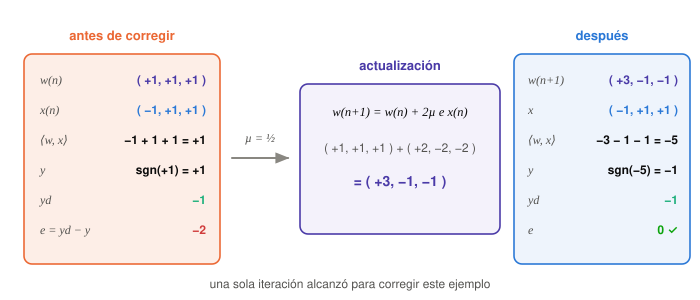

**Figura 12.** *Una sola iteración corrige el ejemplo. Los pesos pasan de $(+1,+1,+1)$ a $(+3,-1,-1)$ y el error se hace cero.*

Al detalle:

1. Activación: $\langle\mathbf{w},\mathbf{x}\rangle=(1)(-1)+(1)(+1)+(1)(+1)=-1+1+1=+1$.
2. Salida: $y=\operatorname{sgn}(+1)=+1$. Pero se esperaba $d=-1$ → hay error.
3. Error: $e=d-y=-1-(+1)=-2$.
4. Ajuste: $2\mu\,e\,\mathbf{x}=2\cdot\tfrac12\cdot(-2)\cdot(-1,+1,+1)=(+2,-2,-2)$.
5. Nuevos pesos: $\mathbf{w}(n+1)=(+1,+1,+1)+(+2,-2,-2)=(+3,-1,-1)$.

Y la comprobación: si vuelve a entrar el mismo patrón, $\langle\mathbf{w}(n+1),\mathbf{x}\rangle=(3)(-1)+(-1)(1)+(-1)(1)=-3-1-1=-5$, con lo que $y=\operatorname{sgn}(-5)=-1=d$ y el error ahora es $0$. **La neurona aprendió ese ejemplo.**

> [!TIP]
> **Para el parcial**
>
> Aprender *un* ejemplo en una iteración no significa haber resuelto el problema: al mostrar el siguiente, el ajuste puede volver a romper este. Por eso el algoritmo recorre el archivo muchas veces con $\mu$ chico — para que cada caso aporte un empujón parcial y el resultado sea un compromiso entre todos, no una carrera detrás del último ejemplo visto.

### 6.5 Qué es realmente este algoritmo

> [!NOTE]
> **Bibliografía · Haykin, cap. 3**
>
> La diapositiva lo nombra al pasar —«caso sencillo: perceptrón simple *(least mean squares)*»— y detrás de ese paréntesis hay un capítulo entero. La ecuación (17) es el **algoritmo LMS**, desarrollado por **Widrow y Hoff en 1960**, también llamado regla delta o Widrow-Hoff. (El paper original de Widrow está en la carpeta de bibliografía de la materia: *30 Years of Adaptive Neural Networks*.)
>
> Haykin: *«el perceptrón de Rosenblatt fue el primer algoritmo de aprendizaje para resolver un problema de clasificación linealmente separable. El algoritmo LMS […] fue el primer algoritmo de filtrado adaptativo lineal para resolver problemas como predicción y ecualización de canales de comunicación. El desarrollo del LMS estuvo de hecho inspirado en el perceptrón.»*
>
> Sus virtudes, según Haykin: complejidad lineal en la cantidad de parámetros, trivial de programar, y sobre todo *«robusto respecto de perturbaciones externas»*. Por eso *«se ha establecido no solo como el caballo de batalla de las aplicaciones de filtrado adaptativo, sino como el **punto de referencia** contra el cual se evalúan los demás algoritmos»*. Y cierra el capítulo diciendo que ese material *«prepara el escenario para el algoritmo de back-propagation»*: es exactamente el camino que sigue la materia.

> [!IMPORTANT]
> **La idea de fondo · perceptrón y LMS no son idénticos**
>
> Se parecen tanto que es fácil creer que son lo mismo, y no lo son. La diferencia está en **qué $y$ entra en el error**:
>
> - **Regla del perceptrón:** $y$ es la salida *después* de la función signo. El error solo puede valer $0$ o $\pm 2$, así que la corrección es siempre del mismo tamaño, o nula.
> - **LMS (caso lineal):** $y$ es la activación lineal, *sin* pasar por la función de activación. El error es un número real cualquiera, así que **la corrección es proporcional a cuán equivocada estuvo** la neurona — y sigue corrigiendo incluso cuando el signo ya es correcto pero el valor está lejos.
>
> De ahí una consecuencia importante: si los datos *no* son linealmente separables, la regla del perceptrón no converge nunca, mientras que el LMS igual converge a la solución de mínimo error cuadrático. Por eso Milone insiste en el aviso de «estamos analizando un caso lineal donde hemos obviado la existencia de la función de activación»: no es un detalle técnico, es lo que distingue los dos algoritmos.

## 7 El límite: el XOR

La última diapositiva del bloque es una pregunta: *«¿el perceptrón simple puede resolver este problema?»*, con cuatro puntos dibujados. Es el **OR exclusivo**, y la respuesta es que no.

| $x_1$ | $x_2$ | XOR |
|---|---|---|
| $-1$ | $-1$ | $-1$ |
| $-1$ | $+1$ | $+1$ |
| $+1$ | $-1$ | $+1$ |
| $+1$ | $+1$ | $-1$ |

Los dos $+1$ quedan en una diagonal y los dos $-1$ en la otra. En la clase Milone prueba tres posiciones de la recta y las tres fallan: «siempre, ubiquemos donde ubiquemos la recta, estaríamos clasificando mal uno o hasta dos de los casos».

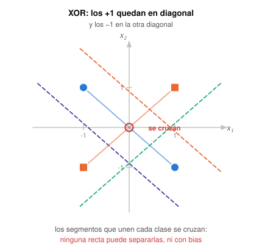

**Figura 9.** *El XOR. Cualquier recta que se pruebe deja al menos un punto del lado equivocado — y hay una razón geométrica exacta por la que es así.*

### 7.1 La demostración, en una línea

> [!IMPORTANT]
> **La idea de fondo**
>
> Uní con un segmento los dos puntos de la clase $+1$: va de $(-1,+1)$ a $(+1,-1)$. Uní con otro los dos de la clase $-1$: va de $(-1,-1)$ a $(+1,+1)$. **Los dos segmentos se cruzan en el origen.**
>
> Ahora bien: si existiera una recta que separara las clases, dejaría los dos puntos $+1$ de un lado, y por lo tanto todo el segmento que los une también quedaría de ese lado (una recta no puede cortar un segmento cuyos dos extremos están del mismo lado). Lo mismo con el segmento de los $-1$, del otro lado. Pero entonces los dos segmentos estarían en semiplanos *disjuntos*… y sin embargo se tocan en el origen. **Contradicción.**
>
> Esto vale *con bias y todo*: el argumento no supone que la recta pase por el origen. No es que no la encontramos: no existe. En lenguaje formal, las *envolventes convexas* de las dos clases se intersecan, y ese es el criterio general de no separabilidad.

> [!TIP]
> **Para el parcial · comparar OR y XOR**
>
> Son dos imposibilidades distintas y se confunden:
>
> - El **OR sin bias** es imposible porque la recta está obligada a pasar por el origen. *Con* bias se resuelve sin problema (§4.3).
> - El **XOR** es imposible *aun con* bias, porque las clases no son linealmente separables. Ningún ajuste de $w_0$ lo arregla.
>
> Si en un ejercicio te piden justificar por qué falla cada uno, la respuesta no es la misma.

### 7.2 Por qué esto fue un problema histórico

> [!NOTE]
> **Bibliografía · Freeman & Skapura, §1.2.4**
>
> En 1969 apareció *Perceptrons: An Introduction to Computational Geometry*, de **Marvin Minsky y Seymour Papert**, que Freeman & Skapura describen como el libro que *«algunos consideran que tocó a muerto por las redes neuronales»*. Su análisis mostraba que *«los perceptrones pueden diferenciar patrones solo si los patrones son linealmente separables. Como muchos problemas de clasificación no poseen clases linealmente separables, esta condición impone una restricción severa a la aplicabilidad del perceptrón»*. Y presentaban el XOR como el ejemplo más simple posible de esa limitación — exactamente el mismo ejemplo de la clase.
>
> El efecto fue devastador: *«el resultado final fue que el campo de las redes neuronales artificiales quedó casi enteramente abandonado, salvo por unos pocos investigadores tercos»*. Es el episodio que se conoce como el «invierno» de las redes neuronales, y duró más de una década.
>
> Freeman & Skapura son justos con el libro, igual: *«el análisis es tan pertinente hoy como lo era en 1969, y muchas de las conclusiones y preocupaciones que plantea siguen siendo válidas»*. La limitación es real; lo que estuvo mal fue concluir que era insuperable.

> [!NOTE]
> **Bibliografía · Freeman & Skapura, ejercicio 1.5**
>
> Un ejercicio del libro que vale la pena pensar, porque descarta la salida fácil: *«Un nodo lineal es aquel cuya salida es igual a su activación. Mostrar que una red como la de la Figura 1.15, pero con un nodo de salida lineal, también es incapaz de resolver el problema XOR.»* Es decir: el problema **no** es la función de activación. Sacar el escalón no ayuda. El problema es que la frontera es un hiperplano.

### 7.3 Qué viene después

La salida no es entrenar mejor —el capítulo 5 ya mostró que no hay nada que encontrar— sino cambiar la *forma* de la frontera. Y eso se consigue apilando neuronas: si una primera capa produce varias fronteras lineales, una segunda capa puede combinarlas y obtener regiones que ya no son semiplanos. Ese es el **perceptrón multicapa**, y su algoritmo de entrenamiento —*back-propagation*— es el método del gradiente de este capítulo aplicado a una red completa, que es justamente por qué valía la pena derivarlo formalmente.

La diapositiva de Milone lo anticipa cuando enumera las aplicaciones del método del gradiente: *«caso sencillo: perceptrón simple (least mean squares) · **caso general: perceptrón multicapa (back-propagation)**»*.

## 8 Formulario, glosario y errores típicos

### 8.1 Formulario

| Ec. | Expresión | Qué es |
|---|---|---|
| (1) | $y=\varphi\!\left(\sum_{i=1}^{N}w_ix_i-u\right)$ | modelo con umbral explícito |
| (2) | $x_0=-1,\quad w_0=u$ | entrada extendida |
| (3) | $y=\varphi\!\left(\sum_{i=0}^{N}w_ix_i\right)=\varphi(\langle\mathbf{w},\mathbf{x}\rangle)$ | perceptrón simple |
| (4) | $\operatorname{sgn}(z)=-1$ si $z<0$; $+1$ si $z\ge0$ | activación signo |
| (5) | $\operatorname{sln}(z)=-1$ si $z<-a$; $\alpha z$ si $-a\le zactivación lineal a tramos | activación lineal a tramos |
| (6) | $\operatorname{sig}(z)=\dfrac{1-e^{-az}}{1+e^{-az}}$ | activación sigmoidea |
| (7) | $y=\operatorname{sgn}(w_1x_1+w_2x_2)$ | perceptrón de 2 entradas |
| (8) | $w_1x_1+w_2x_2=0$ | frontera (forma implícita) |
| (9) | $x_2=-\dfrac{w_1}{w_2}x_1$ | frontera sin bias |
| (10) | $x_2=\dfrac{w_0}{w_2}-\dfrac{w_1}{w_2}x_1$ | frontera con bias |
| (11) | $y(n)=\varphi(\langle\mathbf{w}(n),\mathbf{x}(n)\rangle)$ | salida en la iteración $n$ |
| (12) | $\mathbf{w}(n{+}1)=\mathbf{w}(n)\mp\eta\,\mathbf{x}(n)$ | penalización (casos A y B) |
| (13) | $\mathbf{w}(n{+}1)=\mathbf{w}(n)+\frac{\eta}{2}[y_d(n)-y(n)]\mathbf{x}(n)$ | corrección de error |
| (14) | $\mathbf{w}(n{+}1)=\mathbf{w}(n)-\mu\nabla_{\!w}\xi(\mathbf{w}(n))$ | descenso por gradiente |
| (15) | $e^2(n)=[d(n)-\langle\mathbf{w}(n),\mathbf{x}(n)\rangle]^2$ | error instantáneo |
| (16) | $\nabla_{\!w}e^2(n)=2e(n)(-\mathbf{x}(n))$ | gradiente del error |
| (17) | $\mathbf{w}(n{+}1)=\mathbf{w}(n)+2\mu\,e(n)\,\mathbf{x}(n)$ | LMS / Widrow-Hoff |

### 8.2 Glosario

| Término | Definición |
|---|---|
| **Peso sináptico** | Número real $w_i$ asociado a una entrada. Signo = tipo (excitatorio/inhibitorio); módulo = intensidad; cero = desconexión. |
| **Activación lineal** | El producto interno $\langle\mathbf{w},\mathbf{x}\rangle$. En Haykin, *campo local inducido*. |
| **Función de activación** | $\varphi$: convierte la activación lineal en la salida. Haykin la llama también *squashing function* porque comprime el rango. |
| **Umbral / bias / sesgo** | El parámetro $u=w_0$. Desplaza la frontera de decisión respecto del origen. |
| **Entrada extendida** | Agregar $x_0=-1$ para que el umbral entre en la sumatoria como un peso más. |
| **Frontera de decisión** | Conjunto donde $\langle\mathbf{w},\mathbf{x}\rangle=0$. Recta en 2D, plano en 3D, hiperplano en general. |
| **Linealmente separable** | Que existe un hiperplano que separa las dos clases. Condición necesaria para que el perceptrón converja. |
| **Mínima perturbación** | Si la salida es correcta, no se modifica ningún peso. |
| **Velocidad de aprendizaje** | $\eta$ o $\mu$. Grande = avance rápido pero inestable; chica = lento pero estable. |
| **Época** | Una pasada completa por todo el conjunto de entrenamiento. |
| **LMS** | *Least Mean Squares*, Widrow-Hoff (1960). El descenso por gradiente sobre el error cuadrático en el caso lineal. |
| **Teorema de convergencia** | Si las clases son linealmente separables, el algoritmo del perceptrón encuentra una solución en un número finito de pasos (Rosenblatt, 1962). |

### 8.3 Errores típicos

| El error | Lo correcto |
|---|---|
| Derivar el error respecto de $\mathbf{x}$ | Se deriva respecto de $\mathbf{w}$: las entradas son constantes en el proceso de aprendizaje. |
| Copiar el signo de $x_0$ de Haykin a un ejercicio de la cátedra | Milone usa $x_0=-1,\,w_0=u$. Haykin usa $x_0=+1,\,w_0=b$, con $b=-u$. |
| Olvidar el bias al armar la red | Sin bias la frontera pasa por el origen y ni el OR tiene solución. |
| Decir «el OR sin bias da mal la tabla» | Más preciso: *ninguna recta por el origen separa* las clases. La recta $x_1+x_2=0$ pasa la tabla solo porque dos puntos caen sobre ella y $\operatorname{sgn}(0)=+1$ — y eso se rompe con el mínimo ruido. |
| Creer que el XOR se arregla ajustando el bias | El XOR no es linealmente separable: falla con bias y todo. Hace falta otra capa. |
| Confundir el error $\pm2$ con el error $\pm1$ | Con salidas en $\{-1,+1\}$, $y_d-y$ vale $0$ o $\pm2$. De ahí el $\tfrac12$ en la ecuación (13). |
| Aplicar el LMS con la función signo puesta | La derivación del capítulo 6 supone el caso lineal, sin activación. Con signo la derivada no existe. |
| Pensar que un $\mathbf{w}$ más grande «decide más fuerte» | Escalar $\mathbf{w}$ no mueve la frontera: la decisión es idéntica. |
| Esperar que el algoritmo termine siempre | Si los datos no son separables, no converge. Hay que poner un tope de épocas. |

## 9 Autoevaluación

Si podés responder estas doce sin mirar, tenés el tema.

1. ¿Por qué el cerebro le gana a una computadora en ciertas tareas si sus neuronas son cinco órdenes de magnitud más lentas que un transistor?
2. Explicá por qué el comportamiento «todo o nada» es consecuencia de un mecanismo de *realimentación positiva*, y no una convención del modelo.
3. Un peso vale $w_3=-4{,}2$. ¿Qué dice eso sobre la conexión, en términos biológicos? ¿Y si valiera $0$?
4. Enumerá las tres simplificaciones que hace el perceptrón respecto de la neurona real. ¿Cuál de ellas impide modelar algo que dependa del *orden* de las entradas?
5. Partiendo de $y=\varphi\big(\sum_{i=1}^{N}w_ix_i-u\big)$, mostrá en dos pasos cómo se llega a $y=\varphi(\langle\mathbf{w},\mathbf{x}\rangle)$. ¿Cuánto valen $x_0$ y $w_0$?
6. Si la neurona biológica dispara en modo todo o nada, ¿por qué el MLP usa sigmoideas? Dá *dos* razones: una matemática y una biológica.
7. Un perceptrón de 2 entradas tiene $w_1=2$, $w_2=-1$, $w_0=3$. Escribí la ecuación de la frontera, calculá su pendiente y su ordenada al origen, y decidí qué responde ante $(1,\,-2)$.
8. ¿Por qué escalar todos los pesos por 10 no cambia ninguna decisión de la neurona? ¿Qué *sí* cambia entonces al modificar $\mathbf{w}$?
9. Demostrá, con el argumento de los puntos opuestos, que ninguna recta por el origen separa las clases del OR. ¿Por qué la recta $x_1+x_2=0$ igual «aprueba» la tabla, y por qué eso no cuenta como solución?
10. Escribí la regla de corrección de error y verificá que reproduce los tres casos posibles. ¿De dónde sale el factor $\tfrac12$?
11. Derivá $\nabla_{\!w}\,e^2(n)$ paso a paso. ¿Respecto de qué variable se deriva y por qué? ¿Qué suposición sobre $\varphi$ hace falta?
12. Nombrá las dos imposibilidades distintas del capítulo 4 y del capítulo 7, y explicá por qué una se arregla con el bias y la otra no.

## 10 Guía de lectura de la bibliografía

Todos estos textos están en la carpeta `Bibliografía-20260811/` de la materia. El orden sugerido:

| Texto | Qué buscar ahí |
|---|---|
| **Freeman & Skapura** §1.1, págs. 7–16 | La biología completa en diez páginas muy claras: fisiología de la neurona, la unión sináptica, el modelo de McCulloch-Pitts con sus cinco supuestos, y la regla de Hebb con el ejemplo de Pavlov. **Es la lectura principal del capítulo 1 de este apunte.** |
| **Freeman & Skapura** §1.2, págs. 17–19 | El salto al elemento de proceso general: pesos, entrada neta, función de salida. La traducción biología → modelo, dicha por ellos. |
| **Freeman & Skapura** §1.2.3–1.2.4, págs. 21–27 | El perceptrón de Rosenblatt en su forma histórica, Minsky & Papert, y el desarrollo completo del XOR con la figura del plano. Complementa el capítulo 7. |
| **Haykin** Introducción §2–3, págs. 6–16 | Escala del cerebro, plasticidad, jerarquía de niveles de organización, y la formalización del modelo de neurona con la comparación escalón vs. sigmoidea. |
| **Haykin** Cap. 1, págs. 47–55 | *Rosenblatt's Perceptron*: el modelo, la frontera como hiperplano, y la demostración completa del teorema de convergencia. Es el respaldo teórico del capítulo 5. |
| **Haykin** Cap. 3, págs. 91–100 | El algoritmo LMS de Widrow-Hoff: de dónde sale, por qué es robusto, y cómo prepara el terreno para back-propagation. Es el respaldo del capítulo 6. |
| **Kosko** Cap. 2, págs. 40–44 | Complemento cuantitativo: umbral en milivoltios, par iónico Na⁺/K⁺, y la discusión sobre por qué las señales biológicas son sigmoidales. También es la referencia de cátedra para profundizar aprendizaje hebbiano, útil más adelante para Hopfield. |
| **Widrow** *30 Years of Adaptive Neural Networks* | El paper del autor del LMS. Para leer después del capítulo 3 de Haykin, si querés la fuente original. |

Las citas de la bibliografía están traducidas del inglés. Las referencias a «la clase» y «la diapositiva» corresponden a los videos 001–005 y a la presentación *Perceptrón simple* de Diego Milone, Inteligencia Computacional, FICH–UNL.
