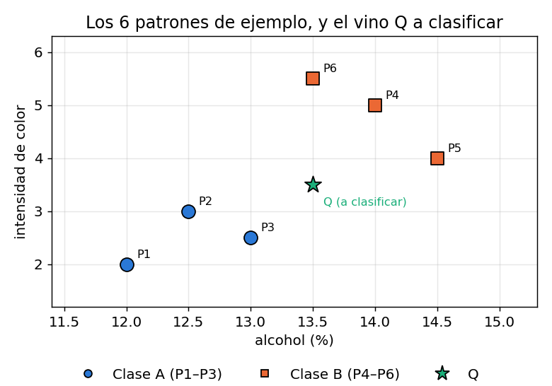
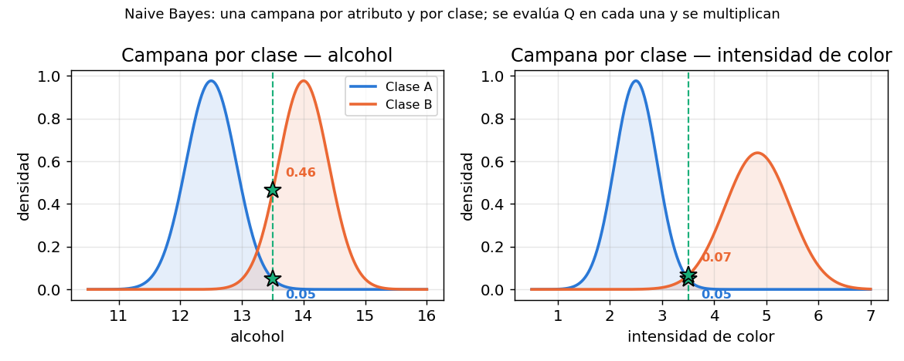
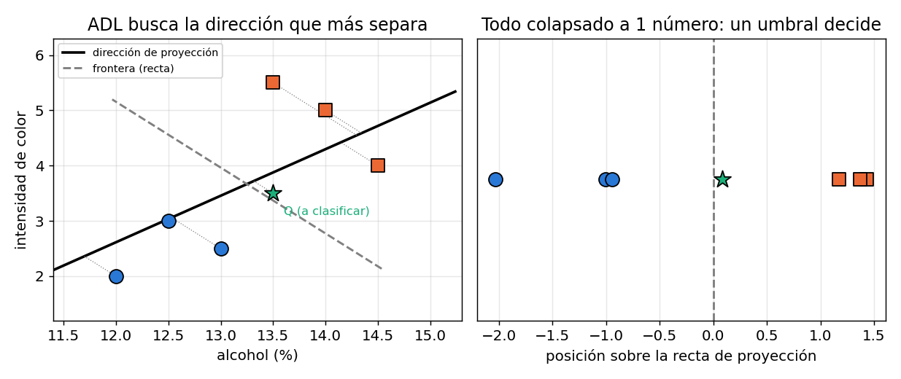
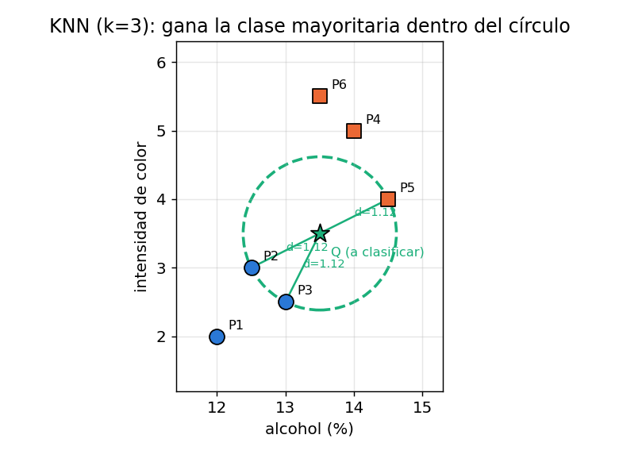
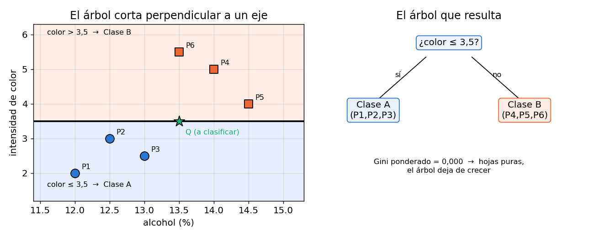
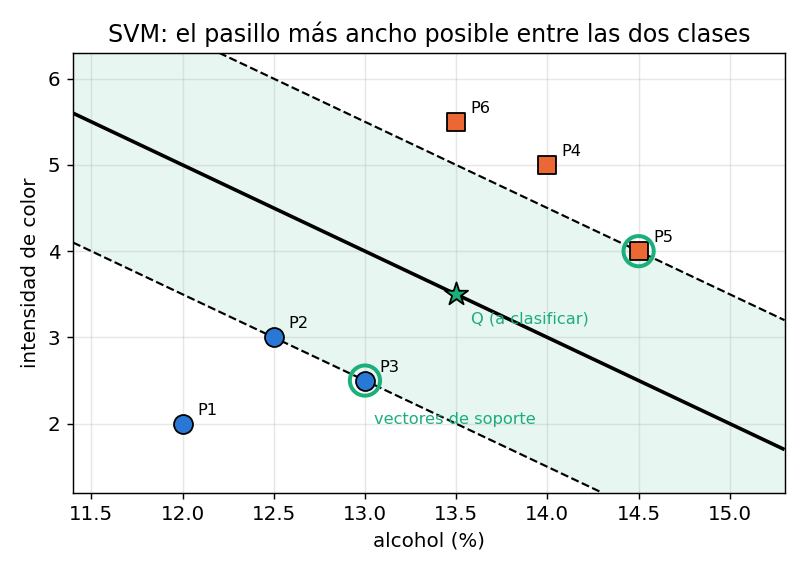
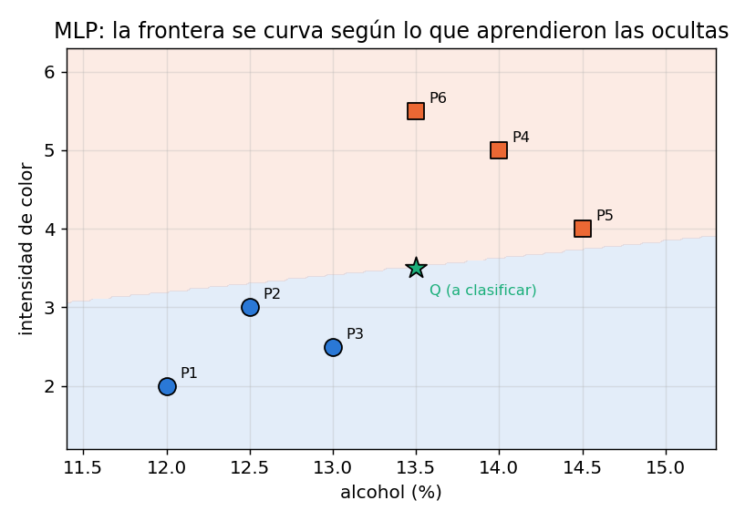
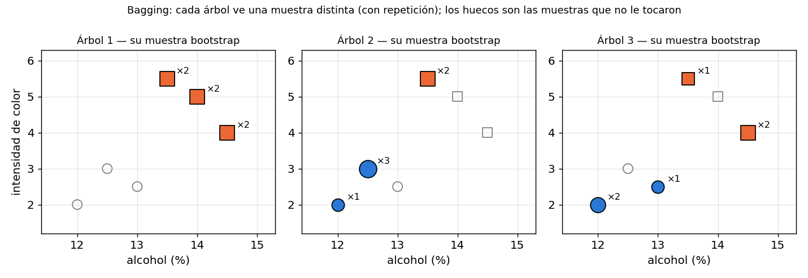
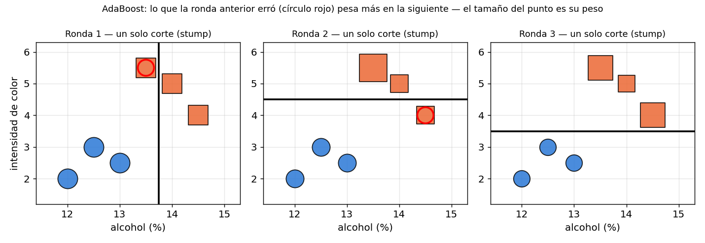

*Este apunte acompaña al `TP3.ipynb`. Para cada ejercicio: primero **qué hace por dentro** cada función de scikit-learn que se usó, después **qué dicen los números** que salieron. Todos los valores citados están reproducidos y verificados con `random_state=2077`.*

---

## 0. La idea de fondo: scikit-learn es una interfaz, no seis algoritmos

Antes de los ejercicios hay que entender **una sola cosa**, porque es lo que hace que el código del TP sea tan corto: en scikit-learn todos los clasificadores son **estimadores** y todos respetan el mismo contrato de tres métodos.

$$
\texttt{modelo.fit}(X, y) \;\longrightarrow\; \texttt{modelo.predict}(X) \;\longrightarrow\; \texttt{modelo.score}(X, y)
$$

- `fit(X, y)`: ajusta los parámetros internos con los datos de entrenamiento. En el MLP son los pesos, en KNN es simplemente guardar los datos, en el árbol son los cortes.
- `predict(X)`: devuelve la clase predicha para cada fila de `X`.
- `score(X, y)`: predice y compara con `y`. Para clasificadores devuelve la **tasa de acierto** (fracción entre 0 y 1), no un porcentaje.

Las matrices tienen siempre la misma forma: `X` es `(n_muestras, n_atributos)` e `y` es `(n_muestras,)` con la etiqueta entera de cada fila.

> **IDEA DE FONDO — por qué esto importa para el TP**
> Como los seis clasificadores del Ejercicio 2 comparten el contrato, la función `evaluar_kfold(k, modelo)` del notebook **no sabe ni le importa** qué modelo recibió: llama `fit` y `score` igual para un perceptrón multicapa que para un árbol. Eso es lo que permite escribir un solo bucle y comparar seis algoritmos distintos. Es el argumento a dar si en la defensa preguntan por qué no hay seis funciones de entrenamiento.

Hay un cuarto método clave para entender el código:

```python
from sklearn.base import clone
modelo_2d = clone(modelo)
```

`clone` devuelve un **estimador nuevo con los mismos hiperparámetros pero sin entrenar**. Se usa cuando hace falta reentrenar el mismo tipo de modelo sobre otros datos (las 2 componentes de PCA, el dataset completo) sin pisar el modelo ya ajustado. Sin `clone`, `fit` sobre el mismo objeto **destruye** el ajuste anterior.

### Claves de la sección 0

| Clave | Qué tenés que poder responder |
|---|---|
| `fit` / `predict` / `score` | Qué hace cada uno y qué devuelve `score` (fracción, no %) |
| Estimador | Por qué un solo bucle sirve para los seis clasificadores |
| `clone` | Por qué hace falta para reentrenar sin perder el modelo original |

---

## 1. Ejercicio 1 — Particiones y perceptrón multicapa sobre Digits

### 1.1 `load_digits()` — qué son los datos

```python
digits = load_digits()
X = digits.data      # (1797, 64)
y = digits.target    # (1797,)  valores 0..9
```

Son **1797 imágenes de 8×8 píxeles** de dígitos manuscritos, cada píxel un entero de 0 a 16 (escala de grises). El "aplanado" es lo importante: la imagen de 8×8 se estira a un vector de **64 atributos**, uno por píxel.

$$
\underbrace{\text{imagen } 8\times 8}_{\texttt{digits.images[i]}} \;\longrightarrow\; \underbrace{\text{vector de } 64}_{\texttt{X[i]}}
$$

> **OJO — al aplanar se pierde la vecindad**
> El modelo recibe 64 números sueltos: no sabe que el píxel 9 está debajo del píxel 1. Toda la información espacial queda **implícita en la correlación** entre columnas. Esto vuelve más adelante: es exactamente lo que Naive Bayes tira a la basura al asumir independencia entre atributos, y por eso es el peor de los seis.

`digits.images` conserva la forma 8×8 y es lo que usa la celda que dibuja la grilla de ejemplos; `digits.data` es la versión aplanada que consumen los modelos.

### 1.2 `train_test_split` — una sola partición

```python
X_train, X_test, y_train, y_test = train_test_split(X, y, test_size=0.2, random_state=2077)
```

Mezcla las filas al azar y las corta en dos: 80% para entrenar, 20% para probar. Devuelve **cuatro** arrays, siempre en ese orden (entradas de entrenamiento, entradas de prueba, salidas de entrenamiento, salidas de prueba).

- `test_size=0.2` → fracción que va a prueba (359 de 1797).
- `random_state=2077` → fija la semilla del mezclado. **Sin esto los resultados cambian en cada corrida** y no se pueden comparar modelos.

El defecto de este esquema es que da **un solo número**: si esa partición particular resultó fácil o difícil, no hay forma de saberlo. No tiene varianza porque no tiene con qué compararse.

### 1.3 `KFold` — validación cruzada

```python
kf = KFold(n_splits=k, shuffle=True, random_state=2077)
for train, test in kf.split(X):
    ...
```

`KFold` parte el dataset en $k$ bloques ("pliegues") del mismo tamaño y arma $k$ experimentos: en cada uno, **un bloque distinto es el conjunto de prueba** y los otros $k-1$ son el de entrenamiento.

$$
\text{con } k=5:\quad
\begin{array}{c|ccccc}
\text{ronda 1} & \mathbf{T} & E & E & E & E\\
\text{ronda 2} & E & \mathbf{T} & E & E & E\\
\text{ronda 3} & E & E & \mathbf{T} & E & E\\
\text{ronda 4} & E & E & E & \mathbf{T} & E\\
\text{ronda 5} & E & E & E & E & \mathbf{T}
\end{array}
\qquad \mathbf{T}=\text{prueba},\; E=\text{entrenamiento}
$$

Dos detalles que hay que poder defender:

- `kf.split(X)` **no devuelve datos, devuelve índices**. Por eso en el código aparece `X[train]`, `y[train]`: se indexa el array original con la lista de posiciones. Es un generador, se recorre con un `for`.
- `shuffle=True` es obligatorio acá. Sin él, `KFold` corta el dataset **en el orden en que viene**; si el archivo estuviera ordenado por clase, un pliegue podría quedarse con todos los "7" y ningún modelo aprendería nada. Recién con `shuffle=True` tiene sentido `random_state`.

> **PARA LA DEFENSA — por qué KFold y no una sola partición**
> Cada muestra es de prueba **exactamente una vez** y de entrenamiento $k-1$ veces: se aprovecha todo el dataset para las dos cosas. Y sobre todo se obtienen $k$ tasas de acierto en vez de una, lo que permite calcular **media** (cuán bueno es el modelo) y **varianza** (cuán dependiente es del reparto de los datos). Ese segundo número es el que una sola partición no puede dar.

### 1.4 `MLPClassifier` — el perceptrón multicapa de la biblioteca

```python
MLPClassifier(hidden_layer_sizes=(50,), max_iter=1000, random_state=2077)
```

Es la versión de biblioteca de la red que en el TP2 estaba implementada a mano. Los argumentos usados:

| Argumento | Qué significa |
|---|---|
| `hidden_layer_sizes=(50,)` | una tupla con **el tamaño de cada capa oculta**: `(50,)` es una capa de 50 neuronas; `(20,10)` son dos capas, de 20 y de 10 |
| `max_iter=1000` | máximo de **épocas** (pasadas completas sobre los datos), no de patrones |
| `random_state=2077` | semilla de la inicialización aleatoria de los pesos |

Las capas de entrada y salida **no se declaran**: `fit` las deduce solo (64 entradas por las columnas de `X`, 10 salidas por las clases distintas en `y`). Por defecto usa activación ReLU y el optimizador Adam, y para clasificar con más de dos clases arma internamente una salida por clase y elige la mayor — el equivalente al `argmax` del TP2.

> **OJO — `max_iter` no es "cantidad de patrones"**
> Si el entrenamiento no converge antes de las 1000 épocas, sklearn emite un `ConvergenceWarning` y devuelve el modelo tal como quedó. Que no haya warning es la evidencia de que 1000 alcanzaron.

### 1.5 La función `evaluar_kfold` del notebook

```python
def evaluar_kfold(k, modelo):
    kf = KFold(n_splits=k, shuffle=True, random_state=2077)
    resultados = []
    for train, test in kf.split(X):
        modelo.fit(X[train], y[train])
        resultados.append(modelo.score(X[test], y[test]))
    return resultados
```

Es el bucle de validación cruzada completo, escrito a mano. Devuelve la **lista de $k$ tasas de acierto**, no un promedio: el promedio lo calcula después `resultados_a_df`, y la lista cruda es lo que necesita el gráfico de dispersión para dibujar un punto por partición.

Notar que **reentrena el mismo objeto `modelo` en cada vuelta**: como `fit` reinicializa los pesos, cada pliegue arranca de cero y no hay contaminación entre rondas.

### 1.6 Media y varianza — qué mide cada una

`resultados_a_df` arma la tabla comparativa con:

$$
\bar{a} = \frac{1}{k}\sum_{i=1}^{k} a_i
\qquad\qquad
\sigma^2 = \frac{1}{k}\sum_{i=1}^{k} (a_i - \bar{a})^2
$$

- La **media** responde: *¿qué tan bien clasifica este modelo?*
- La **varianza** responde: *¿qué tanto depende del reparto particular de los datos?* Varianza alta = el resultado es cuestión de suerte.

> **OJO — la varianza se calcula sobre fracciones, no sobre porcentajes**
> En el código, `np.var(resultados)` usa los valores entre 0 y 1, mientras que las medias se muestran en %. Por eso las varianzas parecen ridículamente chicas ($7\times10^{-5}$). Es una escala **relativa**: sirve para comparar modelos entre sí, no para leerla como número absoluto. Si se calculara sobre porcentajes sería $10^4$ veces mayor.

### 1.7 Análisis de resultados

**Primero se eligió la arquitectura.** Se compararon cinco candidatas, cada una evaluada con KFold=5 y KFold=10, combinando los aciertos de ambos esquemas:

| Arquitectura | Media combinada (%) | Varianza combinada |
|---|---|---|
| (10,) | 96,31 | 0,000122 |
| (20,) | 96,36 | 0,000192 |
| (10, 10) | 94,95 | 0,000319 |
| (20, 10) | 96,44 | 0,000108 |
| **(50,)** | **97,03** | **0,000070** |

`(50,)` gana en las dos columnas a la vez: **la mejor media y la menor varianza**. Que gane en ambas es lo que hace que la elección no requiera justificar un compromiso.

El dato interesante es que **`(10,10)` es la peor de las cinco**, peor incluso que `(10,)` que tiene la mitad de neuronas. Más capas no es mejor: con 64 entradas y 10 clases, un cuello de botella de 10 neuronas obliga a comprimir demasiado la información antes de la segunda capa, y encima agrega una capa más de gradientes que atenuar. La comparación `(10,)` vs `(10,10)` es la evidencia concreta de eso.

**Después se comparó el método de evaluación**, ya con `(50,)` fija:

| Método | Mínimo (%) | Máximo (%) | Media (%) | Varianza |
|---|---|---|---|---|
| Partición 20% | — | — | 97,78 | — |
| KFold = 5 | 96,10 | 97,50 | 96,99 | 0,000023 |
| KFold = 10 | 95,53 | 98,89 | 97,05 | 0,000094 |

Tres lecturas:

1. **Las tres medias son prácticamente la misma** (96,99% a 97,78%). El desempeño real del modelo ronda el 97%, y ningún método de evaluación lo cambia — sólo lo estima con más o menos precisión.
2. **La partición única dio el número más alto (97,78%) y no tiene varianza.** Cayó por encima de las dos medias de validación cruzada: es una partición afortunada, y sin otras con qué compararla no había forma de saberlo. Ése es exactamente el riesgo de reportar un solo `train_test_split`.
3. **KFold=10 tiene 4 veces más varianza que KFold=5** (0,000094 vs 0,000023), y su rango es mucho más ancho (95,53–98,89 vs 96,10–97,50). La razón es de tamaño muestral: con $k=10$ cada conjunto de prueba tiene ~180 muestras en vez de ~360, y sobre menos muestras cada acierto o error individual mueve más el porcentaje. Es dispersión de la **medición**, no inestabilidad del modelo.

> **PARA LA DEFENSA — ¿entonces KFold=10 es peor?**
> No. Su media es igual de válida (de hecho es la que se calcula con más entrenamiento: cada modelo ve el 90% de los datos en vez del 80%). Lo que hay que decir es que **con $k$ grande la varianza entre pliegues mide más el tamaño chico del conjunto de prueba que la estabilidad del modelo**. Para comparar modelos entre sí, $k=5$ da varianzas más limpias — y por eso el Ejercicio 2 usa 5.

---

## 2. Ejercicio 2 — Seis clasificadores sobre las mismas particiones

### 2.1 Un ejemplo chico para atravesar los seis modelos

Los seis clasificadores se instancian igual y se evalúan con la misma `evaluar_kfold(5, modelo)`. Lo que cambia es **cómo deciden por dentro**. Para verlo sin las 64 dimensiones de Digits, usamos **6 vinos con 2 atributos** y clasificamos un vino nuevo **Q**:

| Patrón | alcohol (%) | color | Clase |
|---|---|---|---|
| P1 | 12,0 | 2,0 | A |
| P2 | 12,5 | 3,0 | A |
| P3 | 13,0 | 2,5 | A |
| P4 | 14,0 | 5,0 | B |
| P5 | 14,5 | 4,0 | B |
| P6 | 13,5 | 5,5 | B |
| **Q** | **13,5** | **3,5** | **?** |



> **IDEA DE FONDO — Q está en tierra de nadie a propósito**
> Con estos 6 patrones cualquier modelo acierta el entrenamiento; lo interesante es **Q**. Los seis algoritmos van a llegar a conclusiones **distintas** sobre el mismo punto, y esa discrepancia es exactamente la firma de cada uno. Al final de la sección hay una tabla con qué votó cada uno.

---

### 2.2 Naive Bayes — "¿bajo qué clase es más verosímil este vino?"

**La idea.** Da vuelta la pregunta. En vez de preguntarse *"¿qué clase corresponde a Q?"*, se pregunta *"si Q fuera de la clase A, ¿qué tan raro sería? ¿y si fuera de la B?"* — y se queda con la clase bajo la cual Q resulta **menos raro**. Ésa es la regla de Bayes: para invertir "clase → datos" en "datos → clase".

**Cómo lo hace con nuestros 6 vinos.** Mira **un atributo por vez**. Toma los 3 vinos de la clase A y arma una campana de Gauss del alcohol (media 12,5) y otra del color (media 2,5). Ídem con los 3 de la clase B (alcohol 14,0; color 4,83). Son cuatro campanas: **una por atributo y por clase**.



Después evalúa Q en cada campana y **multiplica**:

$$
\underbrace{P(C)}_{\text{prior}} \cdot \underbrace{P(\text{alcohol}=13{,}5 \mid C)}_{\text{campana 1}} \cdot \underbrace{P(\text{color}=3{,}5 \mid C)}_{\text{campana 2}}
$$

- Clase A: $0{,}5 \times 0{,}049 \times 0{,}049 = 0{,}0012$
- Clase B: $0{,}5 \times 0{,}462 \times 0{,}065 = 0{,}0150$

Gana **B**, con una confianza del **92,7%** — y el número que decidió fue el alcohol, donde Q está casi encima de la media de B.

> **OJO — el "naive" está en el punto (multiplicar)**
> Multiplicar las dos probabilidades es afirmar que **el alcohol y el color son independientes**: que saber uno no dice nada del otro. En los vinos es dudoso, en imágenes es delirante — el píxel de al lado de un trazo negro es negro. Ahí está todo el fracaso de Naive Bayes en Digits: no es que el algoritmo sea malo, es que **su supuesto no aplica a estos datos**. La ventaja de ese mismo supuesto es que estimar 64 campanas sueltas es baratísimo y necesita poquísimos datos; por eso Naive Bayes sigue vivo en clasificación de texto, donde tener muchas más variables que muestras es lo normal.

**Si te preguntan mañana:** *estima, para cada clase, cómo se distribuye cada atributo por separado; a un dato nuevo lo evalúa en todas esas distribuciones, multiplica y se queda con la clase más verosímil. "Naive" porque multiplicar equivale a suponer que los atributos son independientes.*

---

### 2.3 Análisis discriminante lineal — "achatemos todo sobre la mejor dirección"

**La idea.** Buscar **una sola dirección** en el espacio tal que, al proyectar todos los datos sobre ella, las clases queden lo más separadas posible: los centros lejos entre sí, y cada clase compacta alrededor del suyo. Una vez proyectado, cada vino es **un solo número** y clasificar es comparar contra un umbral.

**Con nuestros 6 vinos.** Los centros son (12,5; 2,5) y (14,0; 4,83). La dirección elegida no es la que une los centros a secas: se corrige por cómo se dispersan los puntos dentro de cada clase, así que sale un poco inclinada. Sobre esa recta, los 3 vinos A caen todos a la izquierda y los 3 B a la derecha, y el umbral queda en el medio.



**Q cae apenas del lado B**, casi pegado al umbral. Es una decisión frágil, y eso es honesto: Q está en el medio.

> **OJO — la limitación es geométrica, no de precisión**
> ADL siempre dibuja **una recta** (un hiperplano). Si la separación real entre las clases es curva, no hay ajuste que lo arregle: le falta la forma, no le faltan datos. Además supone que todas las clases se dispersan igual (misma matriz de covarianza). En Digits llegó al 95%, sorprendentemente bien para un modelo tan rígido — señal de que los dígitos son bastante separables linealmente — pero sus errores típicos (8→1, 5→9) son justo los pares donde haría falta una frontera curva.

**Si te preguntan mañana:** *proyecta los datos sobre la dirección que maximiza la separación entre las medias de las clases relativa a la dispersión interna, y clasifica con un umbral sobre esa proyección. La frontera resultante siempre es lineal.*

---

### 2.4 K vecinos más cercanos — "decime con quién andás"

**La idea.** No hay entrenamiento, no hay fórmula, no hay parámetros. Se guardan los datos y listo. Para clasificar Q se buscan los $k$ patrones **más cercanos** y se hace **votación por mayoría**.

**Con nuestros 6 vinos ($k=3$).** Las distancias de Q a cada uno: P2 → 1,12 · P3 → 1,12 · P5 → 1,12 · P4 → 1,58 · P6 → 2,00 · P1 → 2,12. Los tres más cercanos son **P2 (A), P3 (A) y P5 (B)**: gana **A por 2 a 1**.



Fijate que **KNN votó A y Naive Bayes votó B** sobre el mismo punto. No es que uno esté mal: miran cosas distintas. Naive Bayes mira los **centros** de cada clase (y el de B queda más cerca en alcohol); KNN mira los **vecinos individuales**, y los vecinos concretos de Q son mayoritariamente A.

> **OJO — todo el trabajo está en predecir, no en entrenar**
> `fit` en KNN es casi instantáneo (guarda la tabla), pero `predict` tiene que calcular la distancia a **todas** las muestras. Es lo contrario de todos los demás. Y como se apoya en distancias, es sensible a la **escala** de los atributos: si un atributo va de 0 a 1000 y otro de 0 a 1, el primero domina la distancia y el segundo no existe. En Digits eso no molestó (los 64 píxeles comparten escala 0–16) y por eso salió segundo con 98,61%; en un dataset con unidades mezcladas habría que normalizar primero.

**Si te preguntan mañana:** *guarda todos los datos; para clasificar busca los k más cercanos y vota. Sin modelo global, sin supuestos de forma — por eso se adapta a cualquier frontera, y por eso depende de la escala de los atributos.*

---

### 2.5 Árbol de decisión — "veinte preguntas"

**La idea.** Una cadena de preguntas de sí o no, cada una sobre **un solo atributo**: *"¿el color es menor a 3,5?"*. Cada respuesta parte el conjunto en dos, y se sigue preguntando hasta que cada grupo tenga una sola clase.

**Cómo elige la pregunta.** Prueba **todos** los cortes posibles de **todos** los atributos y se queda con el que deja los dos grupos más "puros". La medida de pureza es el **Gini**: 0 si el grupo tiene una sola clase, 0,5 si está mitad y mitad. Con nuestros 6 vinos:

| Corte candidato | Izquierda | Derecha | Gini ponderado |
|---|---|---|---|
| alcohol ≤ 12,75 | 2 vinos (puros) | 4 vinos (mezcla) | 0,250 |
| **alcohol ≤ 13,25** | **3 (puros)** | **3 (puros)** | **0,000** |
| color ≤ 2,75 | 2 (puros) | 4 (mezcla) | 0,250 |
| **color ≤ 3,5** | **3 (puros)** | **3 (puros)** | **0,000** |
| color ≤ 4,5 | 4 (mezcla) | 2 (puros) | 0,250 |

Hay **empate en 0,000** entre dos cortes; scikit-learn se queda con `color ≤ 3,5`. Como las dos hojas quedan puras, **el árbol termina con una sola pregunta**.



**Q tiene color = 3,5**, así que cae del lado "sí" por un pelo: **clase A**.

> **OJO — el corte siempre es perpendicular a un eje**
> Ésa es la restricción que define al árbol: nunca pregunta *"¿alcohol + color > 17?"*, siempre *"¿este atributo es mayor o menor que este valor?"*. Si la frontera real es diagonal, el árbol la aproxima con una escalerita de rectángulos — y necesita muchos cortes para algo que una recta resolvería con uno. En Digits eso se paga caro (86,03%, anteúltimo): la información está repartida entre píxeles, y cortar de a un píxel por vez fragmenta el problema. Su virtud es otra: es el único de los seis que se puede **leer y explicar** como una lista de reglas.

**Si te preguntan mañana:** *elige repetidamente el corte de un atributo que más reduce la impureza (Gini) de los grupos resultantes, hasta que las hojas sean puras. La frontera queda hecha de rectángulos perpendiculares a los ejes.*

---

### 2.6 Máquina de soporte vectorial — "el pasillo más ancho"

**La idea.** Hay infinitas rectas que separan las dos clases. La SVM elige **una**: la que deja el **pasillo más ancho posible** entre ellas. La intuición es que una frontera con mucho aire alrededor tiene más chances de seguir funcionando con datos nuevos que una que pasa raspando.

**Con nuestros 6 vinos.** El pasillo más ancho lo determinan **P3 (13,0; 2,5)** y **P5 (14,5; 4,0)** — los dos vinos más cercanos a la frontera. Ésos son los **vectores de soporte**, y son los únicos que importan: los otros cuatro se podrían mover libremente (sin cruzar el pasillo) y la frontera **no cambiaría**.



Q cae **justo sobre la línea del medio** (su distancia al hiperplano es exactamente 0) — la ambigüedad de Q llevada al extremo. Ante el empate, sklearn lo asigna a **B**.

**Y el truco del núcleo.** Hasta acá la frontera es recta. Lo que hace potente a la SVM es el *kernel*: en vez de trazar la recta en el espacio original, la traza en un espacio de más dimensiones donde los datos sí son separables — y al volver, esa recta se ve como una **curva**. La analogía útil: si dos clases están mezcladas sobre una hoja plana, arrugás la hoja de la forma correcta y podés separarlas con un corte de tijera recto; al desarrugar, el corte quedó curvo. El núcleo RBF (el que usa `SVC()` por defecto) hace justamente eso.

> **PARA LA DEFENSA — por qué ganó en Digits (98,78%)**
> Combina las dos cosas que a los otros les faltan: **no asume ninguna forma** (el núcleo RBF se adapta) y a la vez **maximiza el margen**, que es una forma de regularización — no se pega a los datos de entrenamiento. Además, que la frontera dependa sólo de los vectores de soporte y no de todas las muestras la hace poco sensible a puntos lejanos.

**Si te preguntan mañana:** *busca el hiperplano que separa las clases con el margen más ancho; sólo los puntos del borde (vectores de soporte) lo determinan. Con un núcleo, esa separación lineal se hace en un espacio transformado, lo que en el espacio original equivale a una frontera curva.*

---

### 2.7 Perceptrón multicapa — "que la frontera la aprenda la red"

**La idea** (que ya viene del TP2): cada neurona oculta traza su propia recta; la capa de salida **combina** esas rectas de forma no lineal. Con suficientes neuronas ocultas, la combinación puede tomar prácticamente cualquier forma. Nadie le dice qué forma buscar: la encuentra ajustando los pesos con retropropagación.



Con nuestro ejemplo, la red vota **A** para Q.

> **IDEA DE FONDO — la contracara de la flexibilidad**
> Los otros cinco modelos tienen su forma decidida de antemano (elipses, rectas, rectángulos, vecindad, margen). El MLP no: la construye. Eso lo hace el más general y también el que **más datos y más ajuste necesita** — hay que elegir cantidad de capas, de neuronas, épocas, y cada corrida arranca de pesos aleatorios distintos. El Ejercicio 1 es literalmente eso: comparar cinco arquitecturas porque no hay forma de saber a priori cuál sirve.

---

### 2.8 Los seis votos sobre el mismo Q

| Modelo | Vota | En qué se apoyó |
|---|---|---|
| Naive Bayes | **B** (92,7%) | el alcohol de Q coincide con la media de B |
| ADL | **B** (al filo) | la proyección de Q cae apenas pasando el umbral |
| KNN (k=3) | **A** (2 a 1) | dos de sus tres vecinos concretos son A |
| Árbol | **A** | color = 3,5 entra por un pelo en la rama "≤ 3,5" |
| SVM | **B** (empate) | Q cae exactamente sobre el hiperplano |
| MLP | **A** | la frontera aprendida deja a Q del lado A |

> **PARA LA DEFENSA — la moraleja del ejemplo**
> Seis algoritmos, los mismos 6 datos, un punto ambiguo y **tres votos contra tres**. No hay un modelo "correcto": cada uno responde a una pregunta distinta sobre los mismos datos (¿verosimilitud?, ¿proyección?, ¿vecinos?, ¿reglas?, ¿margen?, ¿frontera aprendida?). Cuál gana depende de **qué supuesto se parece más a la estructura real del dataset** — y por eso el Ejercicio 2 los compara empíricamente en vez de elegir uno de antemano.

### 2.9 `cross_val_predict` — cómo se arma la matriz de confusión

```python
predicciones = cross_val_predict(modelo, X, y, cv=kf_ex2)
```

Hace validación cruzada pero devuelve **las predicciones**, no las tasas de acierto. La clave está en cómo las junta: para cada muestra, la predicción devuelta es la que hizo el modelo **en el pliegue donde esa muestra era de prueba**. Así, el vector `predicciones` tiene 1797 valores, uno por muestra, y **cada uno viene de un modelo que no vio esa muestra al entrenar**.

$$
\texttt{cross\_val\_predict} \;\longrightarrow\; \hat{y}_i \text{ predicho por el modelo del pliegue que contiene a } i
$$

Es lo que permite armar **una sola** matriz de confusión sobre todo el dataset sin hacer trampa. Además se le pasa el mismo objeto `kf` con la misma semilla que usó `evaluar_kfold`, así los pliegues son idénticos y la matriz es consistente con la tabla de aciertos.

> **OJO — `cross_val_predict` reentrena todo de nuevo**
> No reutiliza los modelos de `evaluar_kfold`: entrena otros $k$ modelos desde cero. Coincide porque coinciden las semillas y las particiones, no porque comparta trabajo.

### 2.10 `confusion_matrix` y `ConfusionMatrixDisplay`

```python
matriz = confusion_matrix(y, predicciones)
ConfusionMatrixDisplay(matriz, display_labels=digits.target_names).plot(ax=ax, colorbar=False)
```

`confusion_matrix(y_verdadero, y_predicho)` devuelve una matriz de $10\times 10$ donde

$$
M_{ij} = \#\{\text{muestras de clase real } i \text{ que el modelo predijo como } j\}
$$

**Fila = clase real, columna = clase predicha.** La diagonal son los aciertos; todo lo de afuera son errores específicos. El total de errores es $\sum M - \operatorname{tr}(M)$.

`ConfusionMatrixDisplay` sólo dibuja: `.plot(ax=ax)` la mete en un subgráfico concreto (por eso el bucle sobre `axes.ravel()`, que aplana la grilla 2×3 a una lista de 6) y `colorbar=False` evita seis barras de color repetidas.

### 2.11 `PCA` y el mapa de fronteras

```python
pca = PCA(n_components=2, random_state=2077)
X_2d = pca.fit_transform(X)
```

PCA (Análisis de Componentes Principales) busca las **direcciones de máxima varianza** de los datos y proyecta sobre las 2 primeras. De 64 columnas quedan 2, elegidas para conservar tanta dispersión como sea posible. `fit_transform` hace las dos cosas: calcula las direcciones y aplica la proyección.

El truco para dibujar la frontera:

```python
xx, yy = np.meshgrid(np.linspace(x_min, x_max, 300), np.linspace(y_min, y_max, 300))
Z = modelo_2d.predict(np.c_[xx.ravel(), yy.ravel()]).reshape(xx.shape)
ax.contourf(xx, yy, Z, alpha=0.3, cmap='tab10')
```

1. `meshgrid` arma una grilla de $300\times300$ puntos que cubre todo el plano.
2. `np.c_[xx.ravel(), yy.ravel()]` los aplana a una tabla de 90.000 filas × 2 columnas — el formato `(n_muestras, n_atributos)` que espera `predict`.
3. Se predice la clase de **cada punto del plano** y se vuelve a plegar a la forma de la grilla con `reshape`.
4. `contourf` pinta cada región con el color de su clase predicha.

> **OJO — este gráfico es ilustrativo, no la verdad del modelo**
> Los modelos del gráfico se entrenaron con `clone(modelo).fit(X_2d, y)`: sobre **2** atributos, no sobre los 64 reales. Al comprimir 64→2 se pierde información y se mezclan clases que en 64D estaban separadas, así que los errores visibles acá **no tienen por qué coincidir** con los de la matriz de confusión. Lo comparable entre modelos es la **forma** de la frontera, que es la firma geométrica del algoritmo. Decir esto antes de que lo pregunten es la diferencia entre "hizo un gráfico lindo" y "entendió qué está mirando".

### 2.12 Análisis de resultados

**Tabla comparativa (KFold = 5, Digits):**

| Modelo | Media (%) | Varianza | Errores totales |
|---|---|---|---|
| Máquina de soporte vectorial | 98,78 | 0,000033 | 22 |
| K vecinos más cercanos | 98,61 | 0,000025 | 25 |
| Perceptrón multicapa (50,) | 96,99 | **0,000023** | 54 |
| Análisis discriminante lineal | 95,05 | 0,000122 | 89 |
| Árbol de decisión | 86,03 | 0,000094 | 251 |
| Naive Bayes | 83,08 | 0,000768 | 304 |

Lo primero: **el MLP no es el más preciso, pero es el más estable** — tiene la varianza más baja de los seis, por debajo incluso de SVM y KNN. Media y varianza no ordenan igual, y ése es el punto de mirar las dos.

Lo segundo, y más importante: **el orden del ranking se explica por los supuestos de la tabla de la sección 2.1.** Los dos primeros (SVM, KNN) son los dos que **no asumen nada** sobre la forma de la frontera ni sobre la independencia de los atributos. Los dos últimos (árbol, Naive Bayes) son los que imponen la estructura más rígida. En un problema donde toda la información está en la correlación entre píxeles vecinos, eso es exactamente lo que se espera.

**Las matrices de confusión distinguen dos cosas que la media no puede distinguir:** un modelo que se equivoca en casos genuinamente difíciles, y un modelo que se equivoca por un sesgo propio.

- **Naive Bayes (304 errores)** tiene el patrón más revelador: decenas de dígitos distintos caen sobre el **8** (real 2→predicho 8: **44** veces; 3→8: 25; 1→8: 25; 9→8: 23). No son pares difíciles: es un **cajón genérico** al que va a parar todo. Al ignorar la correlación entre píxeles pierde la forma del trazo y termina prefiriendo sistemáticamente las clases que resultan más probables "en promedio". Es un sesgo del **modelo**.
- **Árbol de decisión (251 errores)**: cantidad parecida, patrón distinto. Sus errores están **repartidos** (4→6: 10, 8→9: 9, 8→2: 9, 8→1: 9, 2→3: 9), sin ningún destino dominante. Cada corte mira un píxel a la vez, así que cada error es una decisión puntual mal tomada, no un sesgo global.
- **ADL (89 errores)**: su confusión principal es 8→1 (12) y 5→9 (8) — pares donde una frontera curva ayudaría y una recta no alcanza.
- **KNN (25) y SVM (22)**: los mejores, y con errores muy dispersos (ningún par supera 6).
- **MLP (54)**: su confusión más repetida también es 8→1 (6).

> **PARA LA DEFENSA — el dato que conviene tener a mano**
> La confusión **"8 predicho como 1"** es la más frecuente en MLP, ADL, KNN **y** SVM — cuatro algoritmos con lógicas completamente distintas. Que cuatro modelos independientes se equivoquen en lo mismo indica que hay imágenes de "8" genuinamente ambiguas: es una **propiedad de los datos**, no una falla de un modelo. En cambio el patrón de Naive Bayes (todo cayendo sobre 8 y 7, con decenas de casos) no aparece en ningún otro: es propio de **ese** modelo. Distinguir error del dato de error del modelo es justamente lo que la matriz de confusión permite y la media no.

**Y las fronteras del gráfico PCA explican el "por qué" geométrico:**

- **Naive Bayes** dibuja elipses alineadas a los ejes → su supuesto de campanas de Gauss independientes, hecho dibujo.
- **Árbol** dibuja rectángulos en escalones → cada corte es una pregunta sobre una sola variable.
- **ADL** dibuja rectas → separación lineal con covarianza compartida.
- **KNN** dibuja fronteras irregulares y recortadas → decide por vecindad, sin fórmula global.
- **SVM** dibuja curvas suaves adaptadas a cada grupo → margen máximo con núcleo RBF.
- **MLP** dibuja regiones curvas flexibles → combinación no lineal de las entradas en la capa oculta.

**Conclusión del ejercicio.** Los modelos que no asumen independencia entre atributos ni una forma fija de frontera (SVM, KNN) dominan en Digits, porque la información relevante está en la relación espacial entre píxeles. El MLP queda tercero pero es el más estable entre particiones. Y Naive Bayes, el peor por lejos, falla por una razón que se puede señalar con evidencia concreta: sus dos supuestos (independencia y normalidad por atributo) son falsos para imágenes, y su matriz de confusión lo muestra como sesgo sistemático hacia el 8 y el 7, no como casos difíciles.

---

## 3. Ejercicio 3 — Ensambles: Bagging vs AdaBoost sobre Wine

### 3.1 `load_wine()` — qué son los datos

**178 vinos** de 3 variedades de uva de la misma región de Italia, descriptos por **13 mediciones químicas** (alcohol, ácido málico, magnesio, fenoles, flavonoides, intensidad de color, prolina…). El objetivo es predecir la variedad.

| Clase | Muestras |
|---|---|
| class_0 | 59 |
| class_1 | 71 |
| class_2 | 48 |

Dos diferencias con Digits que van a explicar todo lo que sigue: es **chiquísimo** (178 contra 1797 muestras — con KFold=5 quedan apenas ~35 muestras de prueba por pliegue) y sus atributos son **magnitudes químicas con significado propio**, no píxeles.

### 3.2 Qué es un ensamble: muchos mediocres que juntos aciertan

**La idea de fondo.** Un solo árbol profundo se aprende los datos de memoria y falla con datos nuevos. Un ensamble hace lo contrario: entrena **muchos clasificadores flojos** y los combina. La apuesta es que los errores de cada uno sean **distintos entre sí**, y que al votar se cancelen.

La analogía: un jurado de diez personas mediocres pero que se equivocan en cosas distintas decide mejor que cualquiera de ellas sola. Lo que arruina un jurado es que todos piensen igual — por eso lo importante en un ensamble es **cómo se logra que los miembros sean distintos**. Bagging y AdaBoost responden esa pregunta de dos formas opuestas.

#### `BaggingClassifier` — muchos en paralelo, y se promedia

Cada árbol se entrena sobre una **muestra bootstrap**: se sortean $n$ muestras del dataset **con reposición**. Algunas salen repetidas, otras no salen (en promedio queda afuera el ~37% de las muestras). Así cada árbol ve un dataset ligeramente distinto y aprende un modelo ligeramente distinto. Al final, **voto por mayoría**.

Con nuestros 6 vinos, tres muestras bootstrap posibles:



Lo importante: **los árboles no se hablan entre sí**. Se podrían entrenar los diez al mismo tiempo en diez procesadores distintos y el resultado sería idéntico. Esa independencia es lo que hace que promediar **reduzca la varianza**: si cada árbol se equivoca por su cuenta, la mayoría rara vez se equivoca junta.

$$
\hat{y} = \text{voto mayoritario}\big(\hat{y}^{(1)}, \dots, \hat{y}^{(N)}\big)
$$

#### `AdaBoostClassifier` — uno atrás del otro, corrigiendo

Acá los clasificadores se entrenan **en secuencia**, y cada uno se enfoca en lo que el anterior erró: después de cada ronda, **las muestras mal clasificadas suben de peso** para que el siguiente les preste más atención. Al final cada clasificador vota con un peso proporcional a lo bien que le fue.

Su clasificador base por defecto es un **stump**: un árbol de profundidad 1, o sea *una sola pregunta sobre un solo atributo*. Un stump solo es apenas mejor que tirar una moneda — la gracia está en encadenar 50.



La analogía: es alguien estudiando para un final que después de cada simulacro **sólo repasa lo que le salió mal**. Funciona muy bien... salvo que uno de esos ejercicios esté mal enunciado, porque entonces se obsesiona con un caso que no representa nada.

> **IDEA DE FONDO — el contraste en una frase**
> Bagging ataca la **varianza**: promedia modelos independientes para que ninguno mande solo, y es robusto por construcción.
> AdaBoost ataca el **sesgo**: encadena modelos demasiado simples hasta que juntos capturan algo que ninguno podía solo — pero como cada ronda depende de la anterior, **un error temprano se propaga**.

Con nuestros 6 vinos, Bagging vota **A** para Q y AdaBoost vota **B**: la misma discrepancia, en chiquito, que la varianza del ejercicio va a mostrar en grande.

### 3.3 `feature_importances_` — en qué se apoya cada modelo

```python
importancia_bagging = np.mean([arbol.feature_importances_ for arbol in modelo_bagging_full.estimators_], axis=0)
importancia_adaboost = modelo_adaboost_full.feature_importances_
```

En un árbol, `feature_importances_` mide **cuánta impureza (Gini) elimina cada atributo** en el total de sus cortes, normalizado para que sume 1. Un atributo con importancia 0 es un atributo que el modelo **nunca usó**.

La asimetría del código tiene explicación: **`BaggingClassifier` no expone `feature_importances_`** (es genérico, podría envolver un clasificador que ni siquiera tenga cortes), así que hay que entrar a `estimators_` — la lista de los árboles entrenados — y promediar las importancias a mano. `AdaBoostClassifier` sí lo expone directamente, promediado por los pesos $\alpha_m$.

Ambos se reentrenan sobre el **dataset completo** con `clone(...).fit(X, y)`: acá no se está midiendo desempeño (para eso está KFold), sino inspeccionando en qué se apoya el modelo, y para eso conviene usar toda la información disponible.

### 3.4 Análisis de resultados

**Tabla (KFold = 5, Wine):**

| Modelo | Aciertos por pliegue (%) | Media (%) | Varianza |
|---|---|---|---|
| **Bagging** | 94,44 · 97,22 · 97,22 · 97,14 · 97,14 | **96,63** | **0,0001201** |
| AdaBoost | 97,22 · 100,00 · 94,44 · 88,57 · 97,14 | 95,48 | 0,0015006 |

La media es parecida; **la varianza de AdaBoost es 12 veces mayor**. Y la fila de pliegues muestra por qué: AdaBoost sacó un **100%** perfecto en un pliegue y un **88,57%** en otro. Bagging se movió entre 94,44 y 97,22 y nada más.

**Las matrices de confusión, en cambio, son casi idénticas:**

$$
\text{Bagging: } \begin{pmatrix}57&2&0\\1&68&2\\0&1&47\end{pmatrix}
\qquad
\text{AdaBoost: } \begin{pmatrix}56&3&0\\1&67&3\\0&1&47\end{pmatrix}
$$

6 errores contra 8, sobre 178 muestras, y **en los mismos lugares**: confusiones `class_0`↔`class_1` y `class_1`↔`class_2`, **nunca** `class_0`↔`class_2`. La clase 1 está "en el medio" químicamente y las dos de los extremos no se confunden jamás.

> **OJO — la matriz de confusión no ve la inestabilidad**
> Acá está la lección metodológica del ejercicio: la matriz **suma los 5 pliegues en una sola cuenta**, y al sumar borra la información de en qué pliegue ocurrió cada error. Por eso puede mostrar dos modelos casi iguales mientras la varianza los muestra muy distintos. Media, varianza y matriz de confusión responden **tres preguntas diferentes** y ninguna reemplaza a las otras.

**Por qué AdaBoost es tan inestable acá.** Wine tiene ~35 muestras de prueba por pliegue: **una sola muestra mal clasificada mueve el porcentaje casi 3 puntos**. Y la reponderación secuencial de AdaBoost amplifica eso: si una muestra atípica cae en el conjunto de entrenamiento, las rondas siguientes se obsesionan con ella y deforman el modelo; si cae en el de prueba, no molesta. El resultado depende entonces de **qué muestras específicas cayeron dónde** — exactamente lo que la varianza entre pliegues está midiendo. Bagging, al promediar árboles independientes, diluye ese efecto.

**La tabla de importancias confirma el mecanismo:**

| Atributo | Bagging | AdaBoost |
|---|---|---|
| proline | 0,357 | 0,118 |
| flavanoids | 0,313 | 0,337 |
| color_intensity | 0,155 | 0,081 |
| od280/od315 | 0,049 | 0,183 |
| malic_acid | 0,000 | 0,123 |
| total_phenols | 0,012 | **0,000** |
| alcalinity_of_ash | 0,009 | **0,000** |
| proanthocyanins | 0,005 | **0,000** |
| magnesium | 0,003 | **0,000** |
| nonflavanoid_phenols | 0,002 | **0,000** |

Los dos coinciden en que **`proline` y `flavanoids` son los atributos determinantes** — lo cual es una validación cruzada del hallazgo: dos métodos distintos señalan la misma química.

Pero **AdaBoost ignora por completo 5 de los 13 atributos** (importancia exactamente 0). La causa es directa: su clasificador base es un stump, **un corte sobre un atributo por ronda**, así que sólo puede incorporar tantos atributos como rondas útiles tenga. Bagging usa árboles **completos**, que reparten la decisión entre los 13. El caso de `malic_acid` es el más claro del contraste: AdaBoost le da 0,123 y Bagging **0,000**.

> **PARA LA DEFENSA — cómo se enlazan los tres resultados**
> Apoyarse en menos atributos → mayor dependencia de que esos pocos atributos se comporten bien en la partición que tocó → mayor varianza entre pliegues. La tabla de importancias no es un adorno: es la **explicación mecánica** del número de varianza de la primera tabla, y las matrices de confusión son la prueba de que la diferencia no está en *qué* clasifica mal sino en *cuán consistentemente* lo hace.

**Conclusión del ejercicio.** Bagging obtuvo mejor media y, sobre todo, mucha más estabilidad. La razón no es que AdaBoost clasifique peor —sus matrices de confusión son casi idénticas— sino que su mecanismo de reponderación secuencial, apoyado en un subconjunto chico de atributos, lo vuelve muy sensible a qué muestras caen en cada partición. En un dataset de 178 muestras, esa sensibilidad se paga cara.

---

## 4. Las preguntas que conviene tener contestadas

| Pregunta | Respuesta corta |
|---|---|
| ¿Por qué `shuffle=True` en `KFold`? | Sin mezclar, los pliegues siguen el orden del archivo; si estuviera ordenado por clase, un pliegue podría no ver una clase entera |
| ¿Qué devuelve `kf.split(X)`? | Pares de **índices** (train, test), no datos; por eso `X[train]` |
| ¿Qué devuelve `score`? | La tasa de acierto como fracción entre 0 y 1 |
| ¿Por qué las varianzas son tan chicas? | Se calculan sobre fracciones, no sobre porcentajes: son valores relativos para comparar modelos |
| ¿Por qué KFold=10 tiene más varianza que KFold=5? | Conjuntos de prueba más chicos (~180 vs ~360): cada error individual pesa más en el porcentaje |
| ¿Por qué `clone`? | Para reentrenar el mismo tipo de modelo sobre otros datos sin destruir el ajuste original |
| ¿Por qué `cross_val_predict` y no `predict`? | Garantiza que la predicción de cada muestra venga de un modelo que **no la vio** al entrenar |
| ¿Fila o columna es la clase real? | **Fila** = real, **columna** = predicha; la diagonal son los aciertos |
| ¿Por qué el gráfico PCA no coincide con la matriz de confusión? | Los modelos del gráfico se entrenaron sobre 2 atributos, la matriz usa los 64; se compara la **forma** de la frontera, no los puntos |
| **Idea de Naive Bayes en una frase** | Se pregunta bajo qué clase el dato sería más verosímil: modela cada atributo por separado, multiplica y elige la clase ganadora |
| **Idea de ADL** | Proyecta todo sobre la dirección que más separa las clases y decide con un umbral: frontera siempre lineal |
| **Idea de KNN** | Sin entrenamiento: mira los k patrones más cercanos y vota |
| **Idea del árbol** | Cadena de preguntas "¿atributo ≤ valor?", eligiendo en cada paso el corte que más reduce el Gini |
| **Idea de la SVM** | El pasillo más ancho entre las clases; sólo los vectores de soporte lo definen, y el núcleo la vuelve curva |
| ¿Qué es un vector de soporte? | Un punto del borde del margen: los únicos que determinan la frontera; mover los demás no la cambia |
| ¿Qué es el "kernel trick"? | Separar linealmente en un espacio transformado, lo que en el espacio original se ve como una frontera curva |
| ¿Qué es una muestra bootstrap? | Un sorteo de n muestras **con reposición**: quedan repetidas y afuera queda ~37% del dataset |
| ¿Qué es un stump? | El clasificador base de AdaBoost: un árbol de profundidad 1, un solo corte sobre un solo atributo |
| ¿Por qué Naive Bayes anda tan mal en Digits? | Asume independencia entre píxeles; en imágenes la información **está** en la correlación entre píxeles vecinos |
| ¿Bagging vs AdaBoost en una frase? | Bagging entrena en paralelo y promedia (reduce varianza); AdaBoost entrena en secuencia repesando errores (reduce sesgo) |
| ¿Por qué a Bagging hay que promediarle las importancias a mano? | `BaggingClassifier` no expone `feature_importances_`; hay que recorrer `estimators_` |
| Si las matrices de confusión son iguales, ¿por qué elegir Bagging? | Porque la matriz suma los 5 pliegues y borra en cuál falló; la varianza muestra que AdaBoost depende mucho más de la partición |
