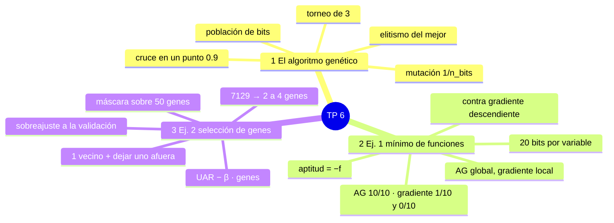
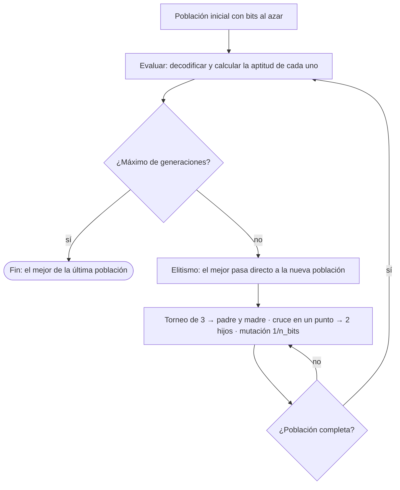
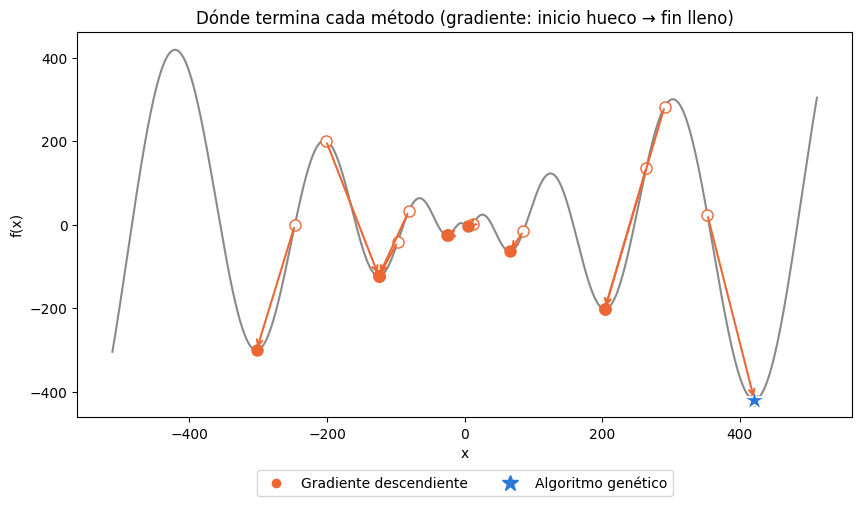
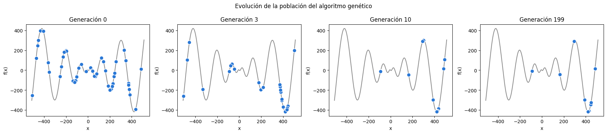
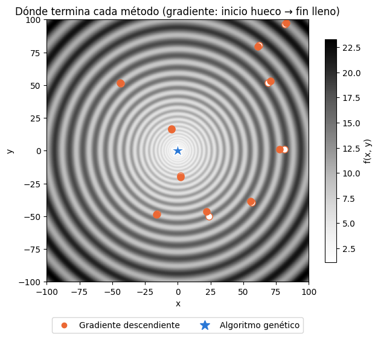
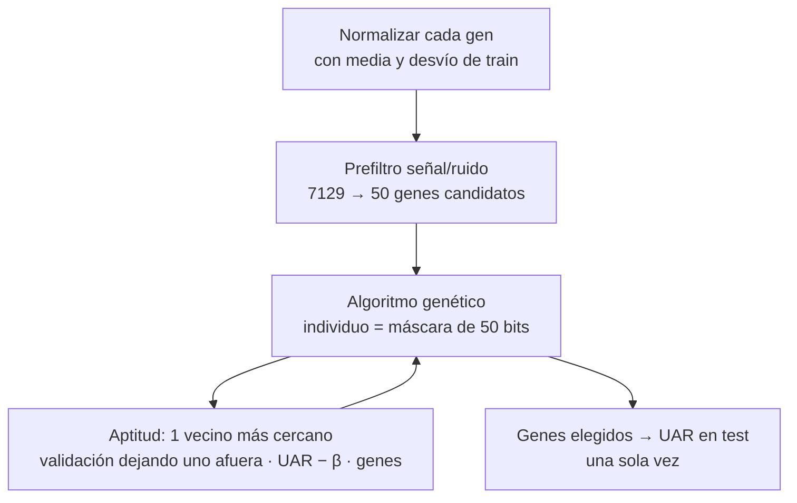
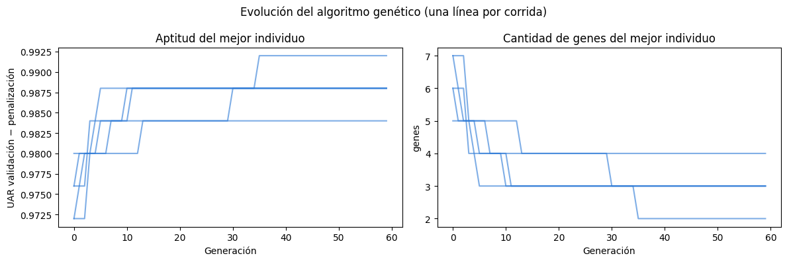

## Mapa del tema



---

## 1. El algoritmo genético

### Qué problema resuelve

Buscar la **mejor solución** de un problema cuando no se puede derivar o cuando hay muchos mínimos locales. En vez de seguir un solo punto, mantiene una **población** de soluciones que se va mejorando generación tras generación: las mejores tienen más chances de tener hijos, y los hijos mezclan a los padres.

### Cómo está armado el código

Todo el algoritmo está en **una función**, `algoritmo_genetico(poblacion, decodificar, aptitud)`, que no sabe qué problema resuelve. Recibe:

| Parámetro | Qué es | Ejercicio 1 | Ejercicio 2 |
|---|---|---|---|
| `poblacion` | lista de individuos (listas de bits) | 50 con bits al azar | 30 máscaras con unos 10 genes |
| `decodificar` | bits → lo que representan | bits → punto $x$ o $(x, y)$ | máscara → lista de genes |
| `aptitud` | qué tan bueno es (mayor = mejor) | $-f$ | UAR $- \beta \cdot$ proporción de genes |

> **PARA LA DEFENSA — por qué así**
> El algoritmo se escribe **una sola vez** y se usa en los dos ejercicios. Lo único que cambia entre problemas es qué representa un individuo y cómo se mide.

### El algoritmo

```text
Algoritmo genético
 1. población inicial (bits al azar)
 2. repetir max_generaciones veces
    2.1 evaluar: decodificar cada individuo y calcular su aptitud
    2.2 elitismo: el mejor pasa directo a la nueva población
    2.3 mientras la nueva población no esté completa
          padre = torneo(3), madre = torneo(3)
          con prob. 0,9 cruce en un punto → 2 hijos (si no, copias)
          mutar cada hijo: cada bit cambia con prob. 1/n_bits
          agregar los hijos
    2.4 la nueva población reemplaza a la vieja
 3. devolver el mejor de la última población
```



### Cada operador, con un ejemplo

**Selección por torneo de 3.** Se eligen 3 individuos al azar y gana el de mayor aptitud. Si salen individuos con aptitud 5, 12 y 8, gana el de 12.

**Cruce en un punto.** Se corta a los dos padres en el mismo lugar y se intercambian las colas. Con corte en la posición 4:

| | Antes del corte | Después | Hijo |
|---|---|---|---|
| Padre | `1100` | `10` | hijo 1 = `1100` + `01` = `110001` |
| Madre | `0011` | `01` | hijo 2 = `0011` + `10` = `001110` |

**Mutación.** Cada bit cambia (0 ↔ 1) con probabilidad $1/n$, donde $n$ es la cantidad de bits: **en promedio cambia un bit por hijo**.

**Elitismo.** El mejor individuo se copia tal cual a la generación siguiente. Así **el mejor nunca empeora** y alcanza con devolver el mejor de la última población.

### Los parámetros

| Parámetro | Valor | Por qué |
|---|---|---|
| Torneo | 3 | presión de selección moderada; funciona con aptitudes negativas (la ruleta no) |
| Probabilidad de cruce | 0,9 | casi siempre se mezclan los padres; el 10 % pasan copias |
| Probabilidad de mutación | $1/n$ | un bit por hijo en promedio: explora sin destruir lo bueno |
| Elitismo | 1 individuo | no perder el mejor |
| Población / generaciones | 50 / 200 (ej. 1); 30 / 60 (ej. 2) | en el ej. 2 cada evaluación es más cara |

> **OJO — por qué torneo y no ruleta**
> La ruleta reparte probabilidades proporcionales a la aptitud, y en el ejercicio 1 la aptitud $-f$ puede ser negativa. El torneo sólo **compara** aptitudes, así que el signo y la escala no importan.

---

## 2. Ejercicio 1: mínimo global de dos funciones

$$f_1(x) = -x \sin\left(\sqrt{|x|}\right), \qquad -512 \le x \le 512$$

$$f_2(x, y) = (x^2 + y^2)^{0.25}\left[\sin^2\left(50(x^2+y^2)^{0.1}\right) + 1\right], \qquad -100 \le x, y \le 100$$

### El individuo: bits que representan un punto

Cada variable usa **20 bits**. Para decodificar, los bits se pasan a un entero y ese entero se lleva al intervalo $[a, b]$:

$$x = a + \text{entero} \cdot \frac{b - a}{2^{20} - 1}$$

**Ejemplo con 4 bits** en $[-512, 512]$: `1010` = 10, entonces $x = -512 + 10 \cdot \frac{1024}{15} = 170{,}67$; ahí $f_1 = -81{,}46$ y la aptitud es $81{,}46$.

- En $f_2$ el individuo tiene 40 bits: 20 para $x$ y 20 para $y$.
- **Aptitud $= -f$**: el algoritmo busca la mayor aptitud y nosotros el menor $f$.
- **Resolución** con 20 bits: $1024/(2^{20}-1) \approx 0{,}001$ en $f_1$ y $\approx 0{,}0002$ en $f_2$.

### Con qué se compara: gradiente descendiente

$$p \leftarrow p - \eta\, \nabla f(p), \qquad \frac{\partial f}{\partial x_i} \approx \frac{f(p + h\,e_i) - f(p - h\,e_i)}{2h}$$

Desde un punto al azar, da 1000 pasos en contra del gradiente ($\eta = 1$ en $f_1$, $0{,}1$ en $f_2$). El gradiente se calcula numéricamente (diferencias centradas, $h = 10^{-6}$), sin derivar a mano.

### Resultados (10 corridas de cada método)

| Función | Método | Mejor $f$ | $f$ promedio | Llegó al mínimo global |
|---|---|---:|---:|---:|
| $f_1$ | Algoritmo genético | −418,98 | −418,98 | **10/10** |
| $f_1$ | Gradiente | −418,98 | −158,35 | 1/10 |
| $f_2$ | Algoritmo genético | 0,020 | 0,020 | **10/10** |
| $f_2$ | Gradiente | 4,10 | 7,89 | 0/10 |

{width=85%}



{width=55%}

> **OJO — por qué el AG da 0,020 y no 0 en $f_2$**
> Con 20 bits en $[-100, 100]$ **el 0 no es representable**: el valor más cercano es $\pm 0{,}0000954$, y ahí $f_2 = 0{,}01996$. Es el mejor valor posible con esa codificación, y las 10 corridas lo encontraron. Con más bits baja.

### Interpretación de los resultados

- **Cómo leer la tabla.** *Mejor $f$* es la mejor de las 10 corridas; *$f$ promedio* dice qué tan confiable es el método (si es igual al mejor, todas las corridas llegaron al mismo lugar). *Llegó al mínimo global* cuenta las corridas que quedaron a menos de 0,1 del mínimo.
- **El gradiente tiene el mismo mejor $f$ que el AG en $f_1$, pero un promedio de −158.** Una sola de sus 10 corridas arrancó en el valle del mínimo global; las otras 9 quedaron en otros valles. Por eso el promedio es mucho peor que el mejor.
- **El gradiente es local.** En la figura de $f_1$ cada flecha baja al valle más cercano a su inicio y se queda ahí: ahí el gradiente vale 0 y no hay nada que lo empuje a salir. En $f_2$ los mínimos locales son anillos alrededor del origen, y cada corrida queda trabada en su anillo: 0 de 10.
- **El AG es global.** En la figura de la evolución, la población de la generación 0 está repartida por todo el dominio; en la 10 ya está casi toda en el valle del mínimo global. La selección hace que los individuos de los valles buenos tengan más hijos, y el cruce y la mutación permiten "saltar" de un valle a otro. Por eso el promedio es igual al mejor: las 10 corridas llegaron.
- **El precio del AG:** una corrida evalúa $f$ $50 \cdot 200 + 50 = 10\,050$ veces; una del gradiente, 2000 ($f_1$) o 4000 ($f_2$). Pero darle más iteraciones al gradiente no lo saca de su valle: el problema no es el presupuesto, es que es un método local.

---

## 3. Ejercicio 2: selección de genes para clasificar leucemia

### El problema

38 pacientes de entrenamiento (27 ALL y 11 AML) y 34 de prueba (20 ALL y 14 AML), con **7129 genes** cada uno. Hay que encontrar **pocos genes** que alcancen para clasificar bien.

Es el esquema **envolvente** (*wrapper*): el AG propone subconjuntos de genes y un clasificador dice qué tan buenos son.



### Las decisiones, una por una

| Paso | Qué se hace | Por qué |
|---|---|---|
| **Normalizar** | cada gen a media 0 y desvío 1, con las medias y desvíos de **train** | el clasificador usa distancias y los genes tienen escalas muy distintas; usar test sería mirar el futuro |
| **Prefiltro** | quedarse con los 50 genes de mayor señal/ruido $\lvert\mu_{ALL} - \mu_{AML}\rvert \,/\, (\sigma_{ALL} + \sigma_{AML})$ | sobre los 7129 genes el AG sobreajustaba (UAR de test entre 0,48 y 0,79) |
| **Individuo** | máscara de 50 bits: `1` uso el gen, `0` no | cualquier cruce o mutación da otra máscara válida |
| **Población inicial** | cada bit se prende con prob. 10/50: unos 10 genes | se buscan subconjuntos chicos; al 50 % arrancarían con 25 |
| **Clasificador** | 1 vecino más cercano: la clase del paciente más parecido | sin azar (la misma máscara siempre tiene la misma aptitud) y barato |
| **Validación** | dejando uno afuera: cada paciente de train se clasifica con los otros 37 | con 38 pacientes no se puede apartar un conjunto de validación |
| **Medida** | UAR: promedio del porcentaje de aciertos de cada clase | las clases están desbalanceadas |
| **Aptitud** | $\text{UAR} - \beta\,\frac{\text{genes usados}}{50}$, con $\beta = 0{,}2$ | a igual UAR, gana el subconjunto más chico |

**Por qué UAR y no porcentaje de aciertos.** Un clasificador que dijera *siempre ALL* acertaría 27 de 38 en train (71 %) sin aprender nada. Su UAR es $\frac{1}{2}(1 + 0) = 0{,}5$, lo mismo que tirar una moneda.

**Qué hace $\beta = 0{,}2$.** Cada gen cuesta $0{,}2/50 = 0{,}004$ de aptitud; un error de validación cuesta mucho más ($0{,}045$ un AML, $0{,}019$ un ALL). Entonces $\beta$ funciona como **desempate**: entre subconjuntos que clasifican igual, gana el más chico. Con UAR 1, la aptitud es $0{,}992$ con 2 genes, $0{,}988$ con 3 y $0{,}984$ con 4.

### Resultados (5 corridas)

| Semilla | Genes elegidos | Cantidad | UAR validación | UAR test |
|---|---|---:|---:|---:|
| 0 | 1744, 6470, 2120, 4051 | 4 | 1,00 | 0,868 |
| 1 | 4846, 2353 | 2 | 1,00 | 0,939 |
| 2 | 460, 6973, 4051 | 3 | 1,00 | 0,757 |
| 3 | 3319, 1248, 148 | 3 | 1,00 | 0,786 |
| 4 | 2758, 6538, 6375 | 3 | 1,00 | 0,807 |

| Método | Genes | UAR validación | UAR test |
|---|---:|---:|---:|
| Todos los genes | 7129 | 0,80 | 0,76 |
| 10 mejores por señal/ruido (sin AG) | 10 | 1,00 | **0,93** |
| Algoritmo genético (promedio de 5) | **3** | 1,00 | 0,83 |



### Interpretación de los resultados

- **Cómo leer la tabla de corridas.** *UAR validación* es lo que vio el AG mientras buscaba (train, dejando uno afuera). *UAR test* es lo que pasa con 34 pacientes que el AG nunca vio: es la medida honesta.
- **El AG reduce de 7129 a 2–4 genes y clasifica mejor que usar todos** (UAR de test 0,83 contra 0,76). Con todos los genes, los miles que no tienen relación con la leucemia meten ruido en la distancia del vecino más cercano; con pocos genes buenos, la distancia mira sólo lo que importa.
- **Hay sobreajuste a la validación.** Las 5 corridas dan 1,00 en validación y entre 0,76 y 0,94 en test. Con sólo 38 pacientes hay muchas combinaciones chicas de genes que los separan perfecto **por casualidad**, y el AG busca justamente las que dan 1,00. Por eso cada semilla elige genes distintos (sólo el 4051 se repite): el resultado es *un* subconjunto chico que funciona, no *el* subconjunto de la leucemia.
- **El AG gana en tamaño, no en desempeño.** Los 10 mejores del ranking, sin AG, dan más en test (0,93) con más genes. En cuanto la validación llega a 1,00, el AG ya no puede mejorar el UAR y lo único que sigue optimizando es la penalización: sacar genes.
- **Cómo leer el gráfico.** La aptitud del mejor sube en escalones y nunca baja (elitismo). Cada escalón es un gen menos con el mismo UAR: los valores finales 0,984, 0,988 y 0,992 son exactamente 4, 3 y 2 genes con UAR 1.
- **Las diferencias en test son de pocos pacientes:** con 34, un error mueve el UAR 0,036 (AML) o 0,025 (ALL). Entre 0,83 y 0,93 hay unos 3 o 4 pacientes.

---

## Guion para la defensa

1. **El algoritmo** (§1): una función que no sabe qué problema resuelve; cada ejercicio le pasa población, `decodificar` y `aptitud`. *Dibujo:* el diagrama de una generación.
2. **Los operadores** (§1): torneo de 3 (y por qué no ruleta), cruce en un punto con el ejemplo `1100|10` y `0011|01`, mutación $1/n$, elitismo. *Dibujo:* los dos padres cortados y los dos hijos.
3. **Ejercicio 1** (§2): 20 bits por variable, cómo se decodifica (ejemplo `1010` → 170,67), aptitud $-f$. *Dibujo:* $f_1$ con varios valles, el gradiente cayendo al más cercano y el AG en el global.
4. **Resultados del ejercicio 1** (§2): 10/10 contra 1/10 y 0/10. El 0,020 de $f_2$ es el límite de la codificación.
5. **Ejercicio 2** (§3): esquema envolvente y dónde se usa cada conjunto de datos. *Dibujo:* el flujo train → prefiltro → AG ↔ aptitud → test.
6. **Decisiones del ejercicio 2** (§3): normalizar con train, prefiltro, 1 vecino, dejar uno afuera, UAR, $\beta$ como desempate.
7. **Resultados y conclusiones** (§3): 7129 → 3 genes, test 0,83 contra 0,76; la validación de 1,00 es optimista; los 10 del ranking dan 0,93.

---

## Formulario

| Qué | Fórmula |
|---|---|
| Decodificar 20 bits | $x = a + \text{entero} \cdot \dfrac{b - a}{2^{20} - 1}$ |
| Aptitud ej. 1 | $-f$ |
| Mutación | cada bit con probabilidad $1/n$ |
| Gradiente | $p \leftarrow p - \eta\,\nabla f(p)$, con $\dfrac{\partial f}{\partial x_i} \approx \dfrac{f(p + h e_i) - f(p - h e_i)}{2h}$ |
| Señal/ruido de un gen | $\dfrac{\lvert\mu_{ALL} - \mu_{AML}\rvert}{\sigma_{ALL} + \sigma_{AML}}$ |
| UAR | $\dfrac{1}{2}\left(\dfrac{\text{ALL bien}}{\text{total ALL}} + \dfrac{\text{AML bien}}{\text{total AML}}\right)$ |
| Aptitud ej. 2 | $\text{UAR}_{\text{val}} - \beta\,\dfrac{\text{genes usados}}{50}$, $\beta = 0{,}2$ |

---

## Errores típicos

1. **Usar el test para calcular la aptitud.** El AG elegiría los genes que mejor clasifican a esos 34 pacientes y el UAR de test dejaría de medir lo que pasa con pacientes nuevos. El test se usa una sola vez, al final.
2. **Normalizar con las medias de test.** Es usar información de pacientes que todavía no existen. Se normaliza todo con las medias y desvíos de train.
3. **Medir con porcentaje de aciertos con clases desbalanceadas.** Decir siempre ALL da 71 %; el UAR da 0,5.
4. **Decir que el AG "falla" en $f_2$ porque no da 0.** El 0 no se puede representar con 20 bits; 0,01996 es el mejor valor posible.
5. **Creer que la validación de 1,00 es el desempeño real.** Es optimista: el AG buscó justamente lo que maximiza ese número.

---

## Autoevaluación

1. ¿Qué tres cosas recibe `algoritmo_genetico` y qué es cada una en cada ejercicio?
2. ¿Por qué la aptitud del ejercicio 1 es $-f$? ¿Por qué se usa torneo y no ruleta?
3. Decodificá `0110` con 4 bits en $[-512, 512]$. ($x = -102{,}4$)
4. Cruzá `111000` y `000111` con corte en la posición 2. (`110111` y `001000`)
5. ¿Qué pasaría sin elitismo? (el mejor se puede perder entre generaciones; habría que guardar el mejor de toda la corrida)
6. ¿Por qué el gradiente llega al global sólo 1 de 10 veces en $f_1$?
7. ¿Por qué el AG da 0,01996 y no 0 en $f_2$?
8. ¿Por qué UAR? ¿Cuánto da un clasificador que dice siempre ALL? (0,5)
9. ¿Por qué 1 vecino más cercano y validación dejando uno afuera?
10. ¿Para qué sirve el prefiltro? ¿Qué pasaba sin él? (test entre 0,48 y 0,79)
11. ¿Qué aptitud tiene un subconjunto de 5 genes con UAR 1? (0,98)
12. Si el AG da validación 1,00, ¿por qué el test da 0,83?
