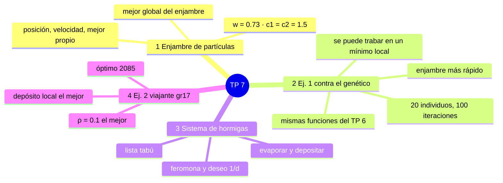
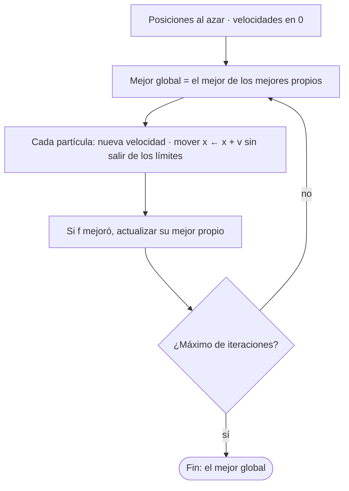
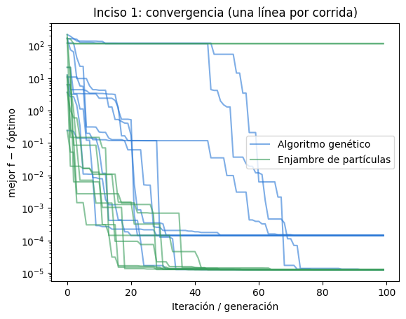
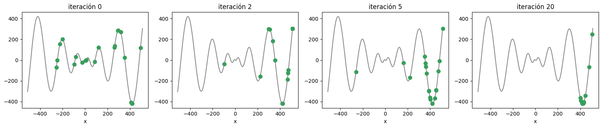
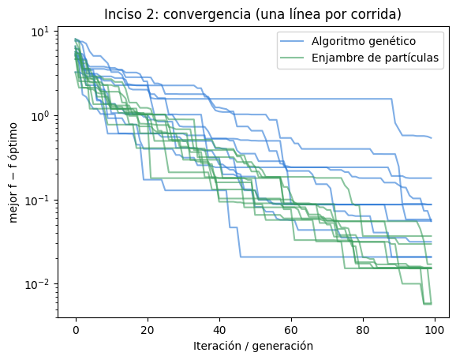
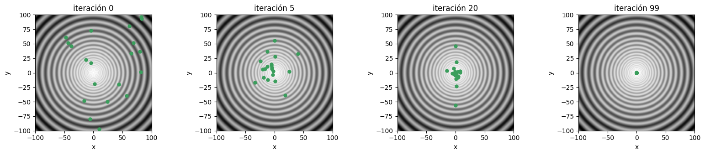
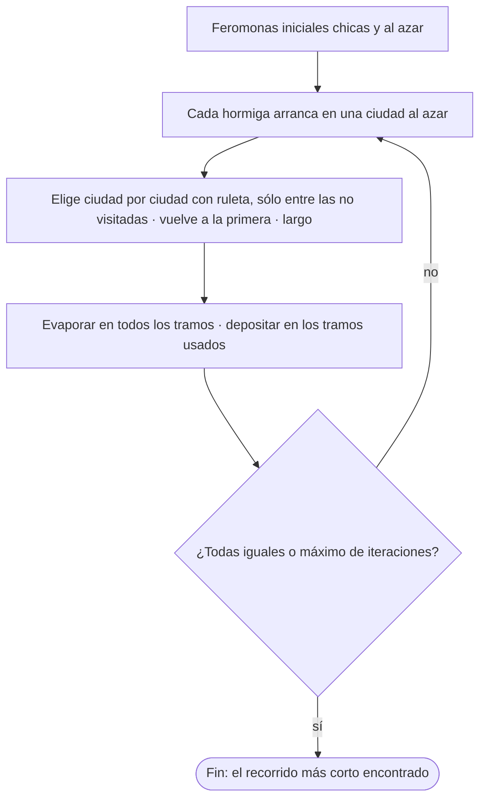
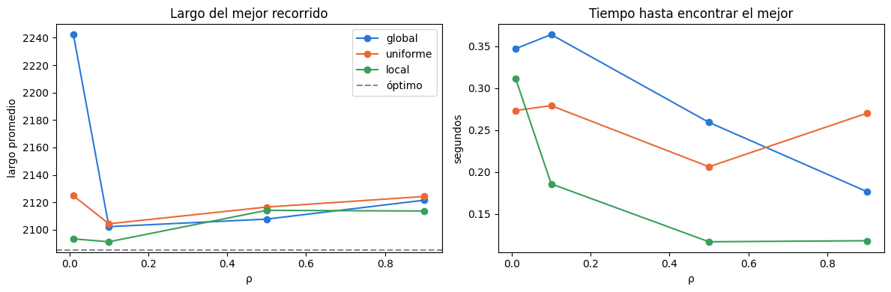
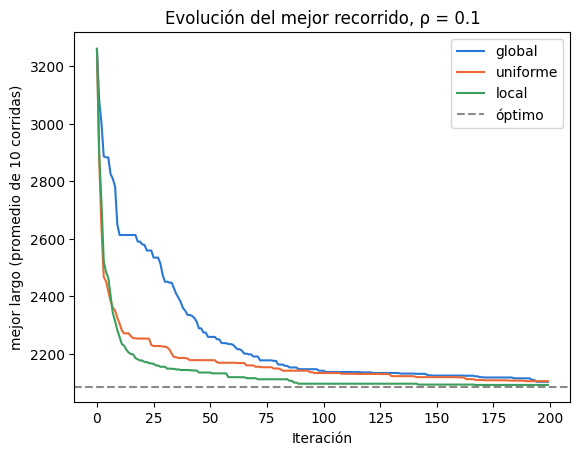

## Mapa del tema



---

## 1. Enjambre de partículas

### Qué problema resuelve

Minimizar una función $f$ de variables reales, como en el TP 6, pero **sin codificar en bits**: cada solución es directamente un punto que se mueve por el espacio.

### La idea

Cada **partícula** tiene una posición $x$ y una velocidad $v$, y recuerda **la mejor posición que encontró** ($y_k$, su mejor propio). Todo el enjambre conoce **la mejor posición de todas** ($\hat{y}$, el mejor global). En cada iteración, cada partícula corrige su velocidad hacia esos dos lugares:

$$v \leftarrow \underbrace{w\, v}_{\text{lo que traía}} + \underbrace{c_1 r_1 (y_k - x)}_{\text{hacia su mejor}} + \underbrace{c_2 r_2 (\hat{y} - x)}_{\text{hacia el mejor del enjambre}} \qquad x \leftarrow x + v$$

- $r_1, r_2$: números al azar entre 0 y 1, nuevos en cada dimensión. Hacen que no todas vayan exactamente al mismo lugar: cumplen el papel de la mutación.
- $w$ (inercia) frena la velocidad que se arrastra; sin ella ($w = 1$) las partículas se aceleran y salen del dominio.

### El algoritmo

```text
Enjambre de partículas (mejor global)
 1. posiciones al azar en el dominio, velocidades en 0
    mejor propio de cada partícula = su posición inicial
 2. repetir 100 veces
    2.1 mejor global = el mejor de los mejores propios
    2.2 para cada partícula, dimensión por dimensión:
          v = w·v + c1·r1·(y − x) + c2·r2·(ŷ − x)
          x = x + v      (si se sale del dominio, queda en el borde)
    2.3 si f(x) es menor que f(mejor propio), actualizar el mejor propio
 3. devolver el mejor global
```



### Una actualización a mano

Una partícula en $x = 2$ con $v = 0{,}5$. Su mejor propio es $y = 1$ y el del enjambre $\hat{y} = 0$. Con $w = 0{,}73$, $c_1 = c_2 = 1{,}5$ y salen $r_1 = 0{,}5$, $r_2 = 0{,}8$:

| Término | Cuenta | Valor |
|---|---|---:|
| Inercia | $0{,}73 \cdot 0{,}5$ | 0,365 |
| Hacia su mejor | $1{,}5 \cdot 0{,}5 \cdot (1 - 2)$ | −0,75 |
| Hacia el mejor del enjambre | $1{,}5 \cdot 0{,}8 \cdot (0 - 2)$ | −2,4 |
| Nueva velocidad | suma | **−2,785** |
| Nueva posición | $2 - 2{,}785$ | **−0,785** |

Qué se ve: la partícula **pasó de largo** al mejor global ($\hat{y} = 0$) y quedó del otro lado. Eso es exploración: revisa la zona alrededor del mejor. En las iteraciones siguientes las dos atracciones la traen de vuelta.

### Los parámetros

| Parámetro | Valor | Por qué |
|---|---|---|
| Partículas | 20 | igual que la población del AG, para comparar |
| Iteraciones | 100 | igual que las generaciones del AG |
| $w$ | 0,73 | valor habitual: frena sin detener |
| $c_1 = c_2$ | 1,5 | el mismo peso a lo propio y a lo social |
| Velocidad inicial | 0 | el primer movimiento lo deciden sólo las atracciones |
| Límites | la posición se recorta al borde | para no evaluar fuera del dominio |

---

## 2. Ejercicio 1: enjambre contra algoritmo genético

Las mismas funciones del TP 6:

$$f_1(x) = -x \sin\left(\sqrt{|x|}\right), \qquad -512 \le x \le 512$$

$$f_2(x, y) = (x^2 + y^2)^{0.25}\left[\sin^2\left(50(x^2+y^2)^{0.1}\right) + 1\right], \qquad -100 \le x, y \le 100$$

**Cómo se compara.** El AG es el del TP 6 (20 bits por variable, torneo, cruce en un punto, mutación $1/n$, elitismo). Los dos usan **20 individuos y 100 iteraciones**: cada iteración evalúa $f$ 20 veces en los dos métodos, así que la comparación es pareja. Se hacen 10 corridas de cada uno. Una corrida **llega** cuando su mejor $f$ queda a menos de 0,1 del mínimo; la **velocidad de convergencia** es la iteración en que llegó.

### Resultados

| Función | Método | Mejor $f$ | $f$ promedio | Llegó | Iteración de llegada |
|---|---|---:|---:|---:|---:|
| $f_1$ | Algoritmo genético | −418,98 | −418,98 | **10/10** | 27 |
| $f_1$ | Enjambre | −418,98 | −396,03 | 8/10 | **3,5** |
| $f_2$ | Algoritmo genético | 0,021 | 0,111 | 8/10 | 65 |
| $f_2$ | Enjambre | **0,006** | **0,016** | **10/10** | **55** |

{width=60%}



{width=60%}



### Interpretación de los resultados

- **El enjambre converge mucho más rápido.** En $f_1$ llega en la iteración 3,5 en promedio, contra 27 del genético, con la misma cantidad de evaluaciones de $f$. Apenas una partícula cae en el valle bueno, se convierte en el mejor global y **todas** se dirigen hacia ahí en la iteración siguiente. En el genético, en cambio, la información viaja más despacio: hace falta que los buenos ganen torneos y se crucen.
- **Pero en $f_1$ el enjambre se trabó en 2 de 10 corridas.** Las dos terminaron en el borde $x = -512$, donde $f_1 = -304{,}2$: el segundo mejor valle de la función. Si todas las partículas se juntan en un valle que no es el global, las atracciones ($y_k - x$ y $\hat{y} - x$) valen casi 0, la velocidad se apaga y nadie sale a explorar. Es **convergencia prematura**. Por eso el promedio del enjambre (−396) es peor que el del genético (−418,98).
- **El genético es más confiable en $f_1$** porque la mutación siempre puede tirar un individuo a otro valle, aunque la población ya esté concentrada.
- **En $f_2$ gana el enjambre** en todo: llega en 10 de 10 corridas y termina más cerca del 0 (0,016 contra 0,111 en promedio). Las partículas se mueven en los números reales y pueden acercarse al origen tanto como haga falta; el genético está limitado por la resolución de los 20 bits, y con 20 individuos algunas corridas quedan en anillos de mínimos locales (llega 8 de 10).
- **En resumen:** el enjambre es más simple (no hay codificación, cruce ni mutación) y más rápido; el genético explora más y se traba menos.

---

## 3. Sistema de hormigas

### Qué problema resuelve

**El viajante:** visitar $n$ ciudades una sola vez cada una y volver a la primera, con el recorrido **más corto**. Probar todos los recorridos es imposible: con 17 ciudades hay $16!/2 \approx 10^{13}$.

### La idea

Cada hormiga arma un recorrido completo eligiendo de a una ciudad. Al terminar, deja **feromona** en los tramos que usó. En la iteración siguiente, los tramos con más feromona son más probables. Así la colonia **aprende** qué tramos forman buenos recorridos.

Desde la ciudad $i$, la probabilidad de ir a $j$ es:

$$p_{ij} = \frac{\sigma_{ij}^\alpha\ \eta_{ij}^\beta}{\displaystyle\sum_{u \text{ no visitada}} \sigma_{iu}^\alpha\ \eta_{iu}^\beta} \qquad \eta_{ij} = \frac{1}{d_{ij}}$$

- $\sigma_{ij}$: feromona del tramo (lo que aprendió la colonia).
- $\eta_{ij} = 1/d_{ij}$: el **deseo**; las ciudades cercanas atraen más (lo que se sabe del problema).
- **Lista tabú:** sólo se puede ir a ciudades no visitadas.

Después de que todas las hormigas terminan:

1. **Evaporar** en todos los tramos: $\sigma_{ij} \leftarrow (1 - \rho)\,\sigma_{ij}$. Así lo viejo se olvida.
2. **Depositar** en los tramos usados por cada hormiga $k$:

| Método | Cuánto deja la hormiga $k$ en el tramo $(i, j)$ | Qué premia |
|---|---|---|
| Global | $Q / L_k$ ($L_k$ = largo de su recorrido) | que el recorrido completo sea corto |
| Uniforme | $Q$ | sólo que pasó por ahí |
| Local | $Q / d_{ij}$ | que ese tramo sea corto |

### El algoritmo

```text
Sistema de hormigas
 1. feromonas iniciales chicas y al azar: σij ~ U(0; 0,1)
 2. repetir hasta 200 iteraciones
    2.1 cada hormiga:
          arranca en una ciudad al azar
          elige la próxima por ruleta con pij, sólo entre las no visitadas
          al visitar todas, vuelve a la primera y se calcula el largo
    2.2 guardar el mejor recorrido visto hasta ahora
    2.3 evaporar en todos los tramos:  σij ← (1 − ρ) σij
    2.4 depositar en los tramos usados (global, uniforme o local)
    2.5 si todas las hormigas hicieron el mismo recorrido, terminar
 3. devolver el mejor recorrido
```



### Un paso a mano

Una hormiga está en la ciudad 0 de `gr17` y le quedan, entre otras, las ciudades 6, 5 y 2, a distancias 80, 150 y 257. Todas con feromona $\sigma = 0{,}1$, $\alpha = \beta = 1$. Mirando sólo esas tres:

| Ciudad | $d$ | $\sigma \cdot (1/d)$ | Probabilidad |
|---|---:|---:|---:|
| 6 | 80 | 0,00125 | **0,542** |
| 5 | 150 | 0,000667 | 0,289 |
| 2 | 257 | 0,000389 | 0,169 |

Con feromonas iguales decide sólo la distancia: la más cercana tiene más de la mitad de la probabilidad, pero las otras **también pueden salir** (ruleta). Si el tramo 0–6 tenía $\sigma = 0{,}5$ y $\rho = 0{,}1$, después de evaporar queda $0{,}45$; si una hormiga con un recorrido de 2100 pasó por ahí, con $Q = 1$ deja $1/2100 = 0{,}00048$ (global), $1$ (uniforme) o $1/80 = 0{,}0125$ (local).

### Los parámetros

| Parámetro | Valor | Por qué |
|---|---|---|
| Hormigas | 10 | |
| $\alpha$ | 1 | peso de la feromona; más grande amplifica el azar del principio |
| $\beta$ | 1 | con $\beta = 2$ la distancia pesa tanto que todas las configuraciones llegan al óptimo y no se ven diferencias |
| $Q$ | 1 | escala del depósito |
| $\sigma_0$ | 0,1 | feromonas iniciales chicas y al azar |
| Iteraciones | 200 como máximo | |
| $\rho$ | 0,01 · 0,1 · 0,5 · 0,9 | lo que se estudia |

---

## 4. Ejercicio 2: el viajante con `gr17`

17 ciudades con una matriz de distancias simétrica. El recorrido óptimo mide **2085** (es un problema conocido de la biblioteca TSPLIB).

**El experimento.** Los 3 métodos de depósito con 4 tasas de evaporación, 10 corridas por configuración. Se mide el largo del mejor recorrido de cada corrida y el **tiempo de búsqueda**: segundos e iteraciones hasta encontrar ese mejor recorrido.

### Resultados

| Depósito | $\rho$ | Mejor largo | Largo promedio | Peor largo | Llegó al óptimo | Iteraciones | Tiempo (s) |
|---|---:|---:|---:|---:|---:|---:|---:|
| global | 0,01 | 2160 | 2242,3 | 2287 | 0/10 | 157,6 | 0,33 |
| global | 0,1 | 2085 | 2102,3 | 2132 | 2/10 | 165,8 | 0,34 |
| global | 0,5 | 2085 | 2107,8 | 2149 | 1/10 | 120,6 | 0,25 |
| global | 0,9 | 2085 | 2121,6 | 2160 | 1/10 | 82,3 | 0,17 |
| uniforme | 0,01 | 2085 | 2124,8 | 2173 | 1/10 | 128,9 | 0,28 |
| uniforme | 0,1 | 2085 | 2104,4 | 2152 | 4/10 | 145,1 | 0,31 |
| uniforme | 0,5 | 2085 | 2116,6 | 2158 | 1/10 | 103,0 | 0,22 |
| uniforme | 0,9 | 2085 | 2124,3 | 2167 | 1/10 | 125,1 | 0,26 |
| local | 0,01 | 2085 | 2093,4 | 2115 | 4/10 | 129,7 | 0,28 |
| **local** | **0,1** | 2085 | **2091,3** | **2105** | **5/10** | 81,9 | 0,17 |
| local | 0,5 | 2085 | 2114,2 | 2149 | 3/10 | 61,3 | 0,14 |
| local | 0,9 | 2085 | 2113,7 | 2149 | 2/10 | 59,3 | 0,13 |



{width=60%}

### Interpretación de los resultados

**Efecto de la evaporación ($\rho$).**

- **$\rho = 0{,}1$ es el mejor valor en los tres métodos** (el largo promedio más bajo de cada uno). Es el equilibrio entre recordar y olvidar.
- **$\rho$ muy chico (0,01): la colonia no olvida.** Con $\rho = 0{,}01$, después de 200 iteraciones todavía queda el 13 % de la feromona inicial al azar y de lo que dejaron las primeras hormigas, que armaron recorridos malos. Esos tramos siguen pesando y la búsqueda no se corrige. Es el peor caso, sobre todo con depósito global (2242 de promedio, nunca llega al óptimo).
- **$\rho$ grande (0,5 y 0,9): la colonia olvida demasiado rápido.** Con $\rho = 0{,}5$, lo depositado hace 10 iteraciones ya se redujo a la milésima parte. La colonia no acumula lo aprendido y depende sólo de lo que encontró en las últimas iteraciones. Por eso encuentra su mejor recorrido **antes** (menos iteraciones, gráfico derecho), pero ese recorrido es **más largo**: se queda con lo primero razonable que encuentra (convergencia prematura).

**Efecto de la cantidad de feromona depositada (método de depósito).**

- **El depósito local fue el mejor:** con $\rho = 0{,}1$ tiene el menor largo promedio (2091), el peor caso más bajo (2105), llegó al óptimo en 5 de 10 corridas y fue el más rápido (82 iteraciones). Premia los **tramos cortos**, que es justamente lo que forma un buen recorrido, así que refuerza lo mismo que el deseo $1/d$.
- **El global arranca lento** (gráfico de evolución): con $Q = 1$ deposita $1/L \approx 0{,}0005$ por tramo, mucho menos que la feromona inicial (hasta 0,1). Hasta que la feromona inicial se evapora, lo que aprenden las hormigas casi no pesa. Al final llega a un largo parecido al uniforme.
- **El uniforme** deposita lo mismo para un recorrido bueno que para uno malo: sólo refuerza los tramos **más usados**, no los mejores. Funciona porque los tramos más usados suelen ser los cortos (por el deseo $1/d$).

**Tiempo de búsqueda.**

- Todas las corridas tardan menos de medio segundo: con 17 ciudades el problema es chico.
- **Ninguna corrida terminó porque todas las hormigas hicieran el mismo recorrido:** con $\alpha = 1$ siempre hay variedad, y todas llegaron a las 200 iteraciones. Por eso el tiempo de búsqueda se mide **hasta encontrar el mejor recorrido**, no hasta el final.

---

## Guion para la defensa

1. **Enjambre** (§1): qué tiene cada partícula ($x$, $v$, $y_k$) y qué conoce el enjambre ($\hat{y}$). La fórmula de la velocidad término por término. *Dibujo:* una partícula con tres flechas (inercia, hacia su mejor, hacia el mejor global) y la suma.
2. **Ejemplo a mano** (§1): $x = 2 \to -0{,}785$: pasa de largo al mejor global, eso es explorar.
3. **Ejercicio 1** (§2): comparación pareja (20 individuos, 100 iteraciones). El enjambre llega en 3,5 iteraciones contra 27, pero se traba 2 de 10 en $f_1$ en $x = -512$; en $f_2$ gana. *Dibujo:* $f_1$ con las partículas juntándose en un valle.
4. **Sistema de hormigas** (§3): recorrido por ruleta con $\sigma^\alpha \eta^\beta$, lista tabú, evaporar y depositar. Los tres depósitos. *Dibujo:* 4 ciudades, una hormiga eligiendo con las probabilidades.
5. **Ejemplo a mano** (§3): probabilidades 0,542 · 0,289 · 0,169.
6. **Ejercicio 2** (§4): $\rho = 0{,}1$ es el mejor; chico no olvida, grande olvida demasiado. Local es el mejor depósito, global arranca lento. Tiempo medido hasta encontrar el mejor.

---

## Formulario

| Qué | Fórmula |
|---|---|
| Velocidad (enjambre) | $v \leftarrow w\,v + c_1 r_1 (y_k - x) + c_2 r_2 (\hat{y} - x)$ |
| Posición (enjambre) | $x \leftarrow x + v$ |
| Probabilidad (hormigas) | $p_{ij} = \dfrac{\sigma_{ij}^\alpha\,\eta_{ij}^\beta}{\sum_{u \text{ no visitada}} \sigma_{iu}^\alpha\,\eta_{iu}^\beta}$, $\eta_{ij} = 1/d_{ij}$ |
| Evaporación | $\sigma_{ij} \leftarrow (1 - \rho)\,\sigma_{ij}$ |
| Depósito global / uniforme / local | $Q/L_k$ · $Q$ · $Q/d_{ij}$ |
| Largo de un recorrido | suma de los tramos, incluido el de vuelta a la primera ciudad |

---

## Errores típicos

1. **Comparar el enjambre y el genético con distinta cantidad de evaluaciones.** Si uno tiene 50 individuos y el otro 20, una iteración no cuesta lo mismo. Acá los dos usan 20.
2. **Decir que el enjambre "siempre" es mejor.** Es más rápido, pero en $f_1$ se trabó en 2 de 10 corridas; el genético llegó en las 10.
3. **Usar los mismos $r_1$, $r_2$ para todas las dimensiones o todas las partículas.** Se sortean de nuevo cada vez; si no, todas las partículas se mueven igual y se pierde la exploración.
4. **Evaporar sólo en los tramos usados, o depositar antes de evaporar.** Se evapora en **todos** los tramos y después se deposita.
5. **Olvidar el tramo de vuelta** al calcular el largo del recorrido.
6. **Medir el tiempo total cuando todas las corridas llegan al máximo de iteraciones.** Así todas tardarían lo mismo; lo informativo es cuándo encontró su mejor recorrido.

---

## Autoevaluación

1. ¿Qué guarda cada partícula y qué guarda el enjambre?
2. Calculá la nueva velocidad con $x = 1$, $v = 0$, $y = 1$, $\hat{y} = 3$, $c_2 = 1{,}5$, $r_2 = 0{,}5$. ($v = 1{,}5$; el término cognitivo vale 0)
3. ¿Para qué sirven $r_1$ y $r_2$? ¿Y la inercia $w$?
4. ¿Por qué la comparación con el genético es pareja?
5. ¿Por qué el enjambre converge más rápido que el genético?
6. ¿Por qué el enjambre se trabó en 2 corridas de $f_1$? ¿Dónde quedó? ($x = -512$, $f = -304{,}2$)
7. ¿Qué es la lista tabú y por qué es obligatoria en el viajante?
8. Con feromonas iguales y distancias 100 y 300, ¿qué probabilidad tiene cada ciudad con $\beta = 1$? (0,75 y 0,25)
9. ¿Qué pasa con $\rho$ muy chico? ¿Y muy grande?
10. ¿Qué premia cada método de depósito? ¿Cuál fue el mejor y por qué?
11. ¿Por qué el depósito global arranca más lento con $Q = 1$?
12. ¿Por qué se usó $\beta = 1$ y no $\beta = 2$?
