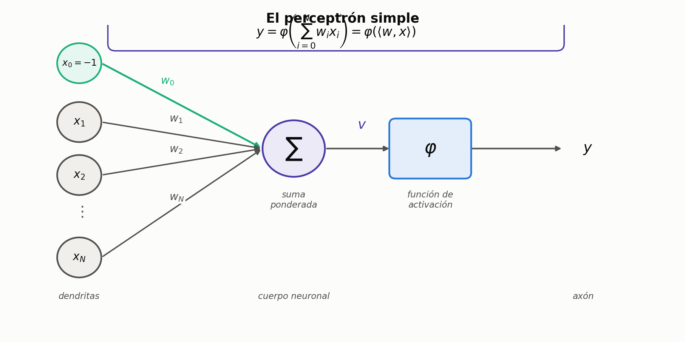
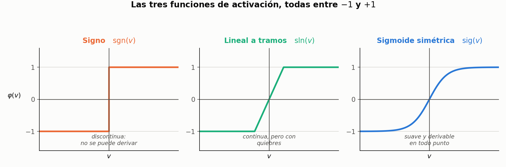
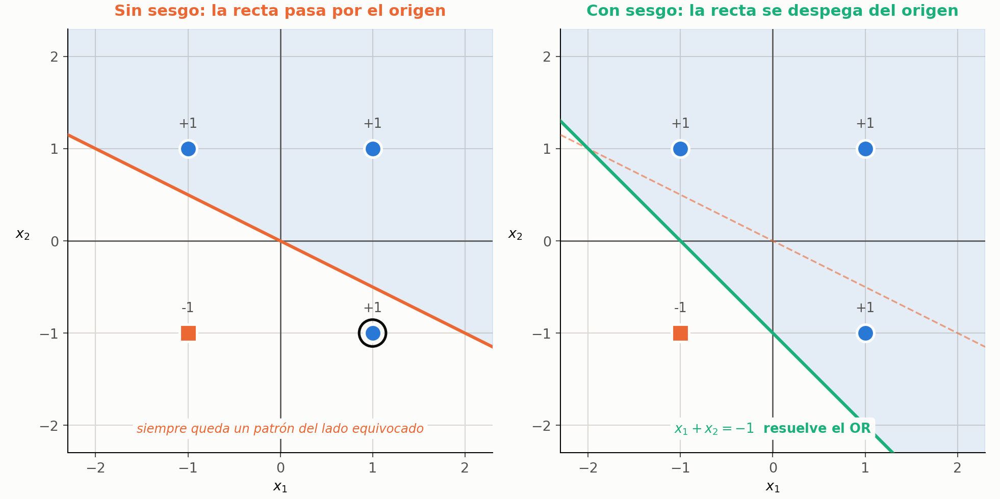
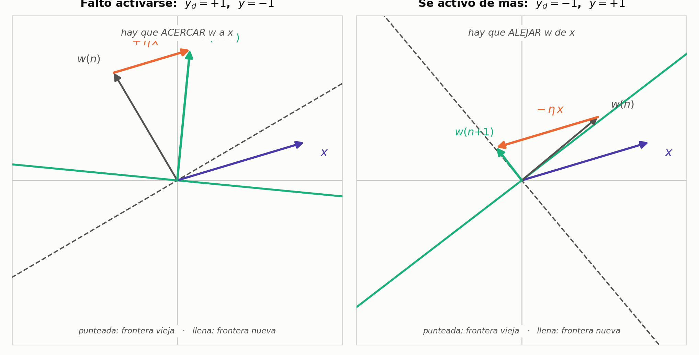
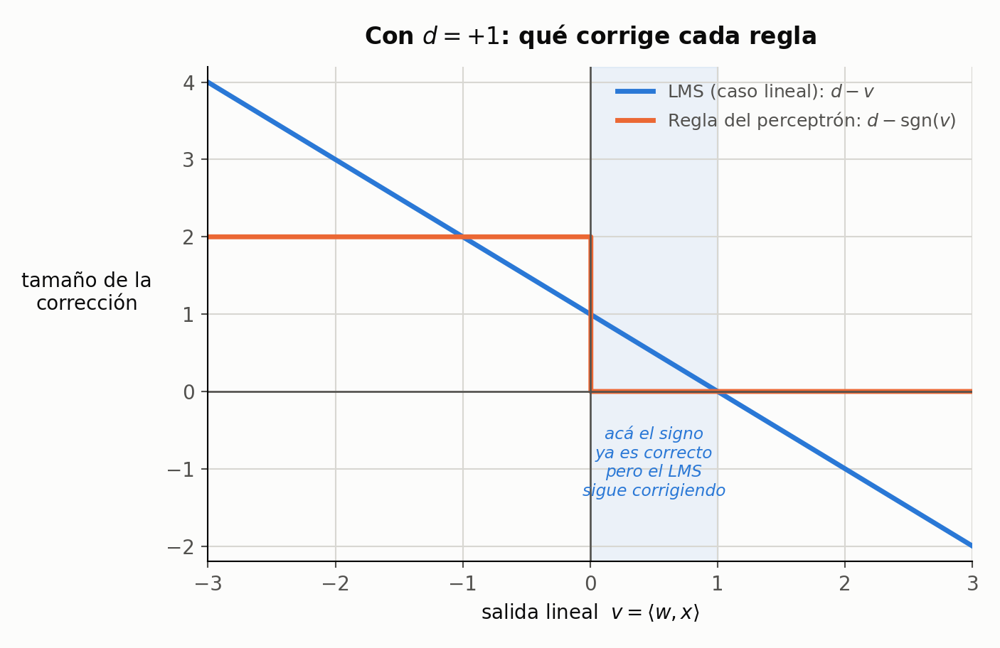
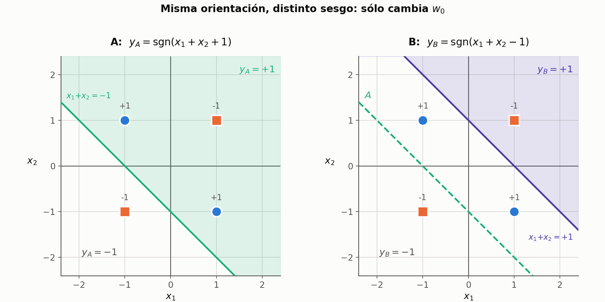
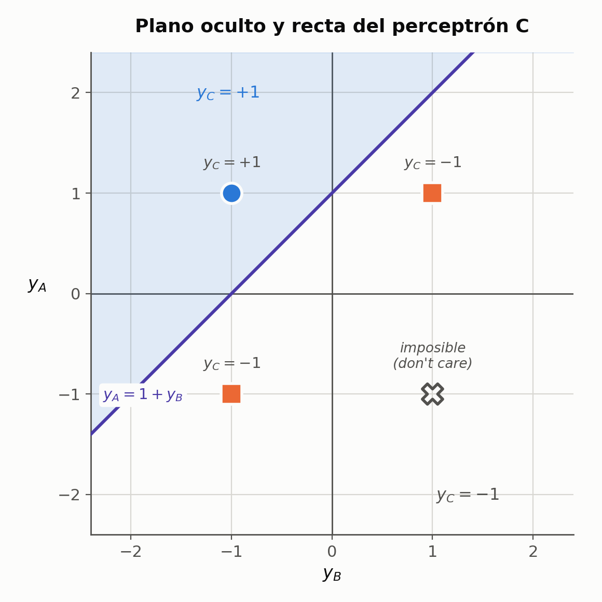

*De la neurona biológica hasta el límite del perceptrón simple, y cómo se rompe ese límite a mano con tres neuronas. Continúa en `02-perceptron-multicapa.md`, donde ese mismo gradiente se retoma con activación derivable y varias capas.*

*Notación: vectores columna, entrada extendida con $x_0 = -1$ y $w_0 = u$ el umbral.*

---

## 1. Qué se copia de la biología, y qué no

La neurona real tiene tres partes que interesan:

- **dendritas** — por donde entra la información, desde otras neuronas o desde sensores;
- **cuerpo neuronal** — donde se acumulan los estímulos;
- **axón** — la salida, una sola.

Las conexiones de entrada (las **sinapsis**) no pesan todas igual: algunas son **excitatorias** y empujan a la neurona a activarse, otras son **inhibitorias** y la frenan, y cada una puede ser fuerte o débil. Cuando la carga acumulada supera un **umbral**, la membrana se despolariza y sale **un único pulso** por el axón. Si no llega al umbral, no sale nada.

Eso último —**todo o nada**— es la propiedad que se modela.

> **IDEA DE FONDO — dónde vive el aprendizaje**
> Aprender, en el cerebro, es **modificar las sinapsis**: que algunas débiles se vuelvan fuertes, que otras se debiliten, que algunas se desconecten. La neurona no cambia; cambian sus conexiones.
> Eso es exactamente lo que va a hacer el algoritmo: **lo único que se toca son los pesos**.

**Lo que el modelo deja afuera**, y conviene saber que se deja afuera:

- **la dinámica temporal.** En la neurona real los estímulos llegan en momentos distintos; en el modelo se supone que **todas las entradas llegan a la vez** y que la evaluación es instantánea.
- **la mecánica de la despolarización**, los neurotransmisores, la propagación del impulso. Nada de eso aparece.

### Claves de la sección 1

| Clave | Qué tenés que poder responder |
|---|---|
| Las tres partes | Dendritas, cuerpo, axón: qué hace cada una |
| Excitatoria / inhibitoria | Qué significa y cómo se representa después |
| Todo o nada | Qué propiedad se modela y cuál se descarta |
| Dónde está el aprendizaje | Qué cambia cuando una red aprende |

---

## 2. El modelo



Cada entrada $x_i$ tiene un **peso sináptico** $w_i$, que es un número real: **positivo** si la conexión es excitatoria, **negativo** si es inhibitoria, **cero** si no hay conexión. El cuerpo neuronal hace dos cosas:

1. la **suma ponderada** de las entradas, $v = \sum w_i x_i$;
2. compara contra un **umbral** $u$: si lo supera, dispara.

### El truco del sesgo

Comparar contra un umbral es incómodo. Se lo pasa restando al otro lado:

$$
\sum_{i=1}^{N} w_i x_i > u
\qquad\Longleftrightarrow\qquad
\sum_{i=1}^{N} w_i x_i - u > 0
$$

Y ahora el paso que ordena todo: se escribe $-u$ como **una entrada más**, fija en $x_0 = -1$, con su propio peso $w_0 = u$. Así el umbral entra en la sumatoria y desaparece de la comparación:

$$
\boxed{\;y = \varphi\left(\sum_{i=0}^{N} w_i x_i\right) = \varphi\big(\langle w, x\rangle\big)\;}
\qquad\text{con } x_0 = -1
$$

Fijate que la sumatoria ahora arranca en $\mathbf{0}$ y no en 1: ése es el único rastro del cambio.

> **IDEA DE FONDO — por qué conviene tanto**
> Con la entrada extendida, el umbral **deja de ser un caso aparte**: es un peso más, se guarda como los demás y —lo importante— **se aprende como los demás**, con la misma fórmula. Si lo dejaras afuera, el algoritmo de aprendizaje necesitaría una regla especial sólo para él.
> Y de paso, el modelo entero queda escrito como **un producto interno**: dos vectores adentro, un escalar afuera. Ese escalar es el nivel de activación de la neurona.

$w_0$ aparece en la bibliografía como **umbral**, **sesgo** o **bias**: son la misma cosa.

### Claves de la sección 2

| Clave | Qué tenés que poder responder |
|---|---|
| Peso sináptico | Qué significa su signo y su magnitud |
| Las dos operaciones | Qué hace el cuerpo neuronal, en orden |
| La entrada extendida | Cómo se pasa de $>u$ a $>0$, y qué vale $x_0$ |
| Por qué conviene | Dos motivos: se aprende igual, y queda un producto interno |
| $u$, $w_0$, sesgo, bias | Que son la misma cosa |

---

## 3. Funciones de activación

$\varphi$ es la que convierte la activación lineal $v$ en la salida. Todas las de esta materia van entre $-1$ y $+1$.



$$
\mathrm{sgn}(v) = \begin{cases} +1 & v \ge 0 \\ -1 & v < 0\end{cases}
\qquad
\mathrm{sig}(v) = \frac{2}{1+e^{-a v}} - 1
$$

La **función signo** es el todo-o-nada literal. La **lineal a tramos** le agrega una zona de transición con pendiente $\alpha$. La **sigmoide** es la misma forma sin ninguna discontinuidad, y su parámetro $a$ controla la pendiente: cuanto más grande, más se parece al signo.

> **PARA LA DEFENSA — por qué importa la sigmoide**
> No es una cuestión estética. **La sigmoide es derivable en todo punto y el signo no**, y todo el método del gradiente exige derivar la función de activación. Con $a$ grande se recupera el comportamiento todo-o-nada de la neurona biológica **sin pagar el precio de la discontinuidad**.
> Es la razón por la que el perceptrón multicapa la usa y el perceptrón simple no la necesita.

> **OJO — las dos sigmoides de la bibliografía**
> Algunos libros usan una sigmoide entre $0$ y $1$ en vez de entre $-1$ y $+1$. Las dos son correctas —es convención—, pero **si mezclás fórmulas de un libro y otro no cierra nada**: cambian la derivada y la codificación de las salidas. Lo mismo con la codificación de las clases: hay textos con $\{0,1\}$ y otros con $\{-1,+1\}$. Acá se usa siempre **bipolar**, $\pm 1$.

Existen otras (gaussiana, sinusoidal) que aparecen más adelante en la materia.

### Claves de la sección 3

| Clave | Qué tenés que poder responder |
|---|---|
| Las tres | Nombrarlas y dibujarlas |
| El parámetro | Qué controla $a$ en la sigmoide |
| El motivo real | Por qué se necesita una función derivable |
| Bibliografía | Qué dos convenciones no hay que mezclar |

---

## 4. Qué puede decidir una neurona

Con dos entradas, la salida es $y = \mathrm{sgn}(w_1x_1 + w_2x_2)$ y lo interesante es la **frontera**: el lugar donde la suma ponderada vale exactamente cero, porque un poquito más y la neurona se activa, un poquito menos y no.

$$
w_1x_1 + w_2x_2 = 0
\qquad\Longrightarrow\qquad
x_2 = -\frac{w_1}{w_2}\,x_1
$$

**Es la ecuación de una recta**, y como no tiene término independiente, **pasa por el origen**. Los pesos fijan su pendiente.

Esa recta parte el plano en dos **semiplanos**: en todo uno la neurona da $+1$, en todo el otro da $-1$. Eso es todo lo que una neurona puede decidir.

> **IDEA DE FONDO — el caso general**
> Con $N$ entradas la frontera $\langle w,x\rangle = 0$ es un **hiperplano en $\mathbb{R}^N$**. Con 2 entradas es una recta, con 3 un plano, con 28 un hiperplano en $\mathbb{R}^{28}$.
> Y no es un ejemplo forzado: si la entrada fuera una imagen de $1024\times1024$ y cada píxel una entrada, la neurona estaría trazando un hiperplano en $\mathbb{R}^{1\,000\,000}$.

Un problema que se puede resolver así se llama **linealmente separable**.

### Claves de la sección 4

| Clave | Qué tenés que poder responder |
|---|---|
| La frontera | Qué ecuación la define y por qué esa zona es la interesante |
| Recta por el origen | Por qué no tiene ordenada al origen |
| Semiplanos | Qué decide la neurona en cada uno |
| Caso general | Qué es la frontera con $N$ entradas |
| Separabilidad lineal | Qué quiere decir |

---

## 5. El sesgo: sin él no se resuelve ni el OR

Probemos con el OR, codificado en bipolar: da $+1$ salvo cuando las dos entradas son falsas.

| $x_1$ | $x_2$ | OR |
|:---:|:---:|:---:|
| $-1$ | $-1$ | $-1$ |
| $-1$ | $+1$ | $+1$ |
| $+1$ | $-1$ | $+1$ |
| $+1$ | $+1$ | $+1$ |



Con una recta que pasa por el origen, se la incline como se la incline, **siempre queda un patrón del lado equivocado**. La solución es despegarla del origen, y eso es exactamente lo que hace $w_0$:

$$
w_1x_1 + w_2x_2 - w_0 = 0
\qquad\Longrightarrow\qquad
x_2 = \frac{w_0}{w_2} - \frac{w_1}{w_2}\,x_1
$$

Ahora hay **ordenada al origen**, y vale $w_0 / w_2$. Con $w_1 = w_2 = 1$ y $w_0 = -1$ queda la recta $x_1 + x_2 = -1$, que resuelve el OR.

> **PARA LA DEFENSA — la demostración en una línea**
> Que "siempre falla uno" se puede *demostrar*, no sólo mostrar. Una recta que pasa por el origen deja **dos puntos opuestos siempre en semiplanos distintos** —si $x$ está de un lado, $-x$ está del otro—.
> Ahora mirá el OR: los patrones $(-1,+1)$ y $(+1,-1)$ son opuestos, y los dos tienen que dar $+1$, o sea que necesitan estar del **mismo** lado. Imposible sin sesgo.

> **OJO — el caso degenerado, y por qué no cuenta**
> Hay una escapatoria: poner la recta *justo encima* de esos dos puntos, sobre la diagonal $x_1+x_2=0$. Ahí el producto interno da exactamente cero, y como la convención es $\mathrm{sgn}(0)=+1$, los dos salen $+1$ y parece que funciona.
> No cuenta, por dos razones: depende de una **convención arbitraria** sobre el valor en cero, y es **infinitamente frágil** — mové un peso una milésima y se rompe. Los patrones quedan sobre la frontera, que es el peor lugar posible.

**Conclusión operativa:** toda neurona de toda red lleva su sesgo. Sin él, ni siquiera el OR.

### Claves de la sección 5

| Clave | Qué tenés que poder responder |
|---|---|
| El OR | La tabla en bipolar |
| El fracaso | Por qué ninguna recta por el origen sirve |
| La demostración | El argumento de los puntos opuestos |
| El caso degenerado | Cuál es y por qué no vale |
| La ordenada | Qué cociente la da |

---

## 6. Cómo aprende (1): corrección de error

Hasta acá los pesos los pusimos nosotros mirando el dibujo. La idea de una red neuronal es otra: **mostrarle ejemplos y que los pesos salgan solos**.

El archivo de entrenamiento tiene, en cada línea, las entradas y **la salida que debería dar**. Y no son sólo los cuatro casos perfectos: puede haber $(+0{,}9;\ +1{,}1)$ con salida deseada $+1$, o $(-0{,}7;\ -1{,}1)$ con salida $-1$. Casos con ruido, que es lo que hay en el mundo real.

El algoritmo:

**1. Inicialización.** Los pesos arrancan **al azar y chicos**, por ejemplo en $[-0{,}5;\ +0{,}5]$.

**2. Para cada ejemplo**, se calcula la salida $y(n) = \varphi\big(\langle w(n), x(n)\rangle\big)$ y:

- **Si acertó** ($y = d$): **no se toca nada.** Es el **principio de mínima perturbación**.
- **Si erró**: se **penaliza**, moviendo los pesos *en el sentido opuesto al que contribuyeron al error*.

Desarmemos la penalización. Supongamos entradas positivas:

- Dio $+1$ y tenía que dar $-1$ → la suma ponderada tiene que **bajar** → hay que **restar** una proporción de las entradas: $w(n+1) = w(n) - \eta\,x(n)$.
- Dio $-1$ y tenía que dar $+1$ → tiene que **subir** → **sumar**: $w(n+1) = w(n) + \eta\,x(n)$.

### La misma regla, vista como geometría



Hay una forma de ver la regla que la vuelve obvia, y conviene tenerla porque es lo que se dibuja en la pizarra.

Acordate de que la frontera $\langle w, x\rangle = 0$ es **el conjunto de puntos perpendiculares a $w$**. O sea: **el vector de pesos apunta hacia el semiplano donde la neurona da $+1$**, y la frontera es la recta que lo cruza en ángulo recto.

Entonces la regla es sólo esto:

- **Faltó activarse** ($d=+1$, $y=-1$): $x$ está del lado equivocado, el ángulo entre $w$ y $x$ pasa de $90°$. Sumar $\eta\,x$ **acerca $w$ a $x$**, achica ese ángulo, y el producto interno se vuelve positivo.
- **Se activó de más** ($d=-1$, $y=+1$): al revés. Restar $\eta\,x$ **aleja $w$ de $x$**, el ángulo pasa de $90°$ y el producto interno se vuelve negativo.

> **IDEA DE FONDO — mover el vector es girar la recta**
> Los pesos y la frontera son la misma cosa vista de dos maneras. Cuando el algoritmo mueve $w$ un poquito, la frontera **gira** —porque siempre queda perpendicular a él— y lo hace en la dirección que corrige ese patrón.
> Por eso $\eta$ tiene el rol que tiene: es cuánto gira la recta en cada corrección. Grande, pega saltos; chico, la va acomodando de a poco.

### Los tres casos, en una sola fórmula

$$
\boxed{\;w(n+1) = w(n) + \frac{\eta}{2}\big[d(n) - y(n)\big]\,x(n)\;}
$$

Y funciona porque, con salidas $\pm 1$, el error $d - y$ sólo puede valer tres cosas:

| Situación | $d - y$ | Qué hace la fórmula |
|---|:---:|---|
| acertó | $0$ | no cambia nada — mínima perturbación |
| dio $-1$, iba $+1$ | $+2$ | suma $\eta\,x(n)$ |
| dio $+1$, iba $-1$ | $-2$ | resta $\eta\,x(n)$ |

> **IDEA DE FONDO — de dónde sale ese $\tfrac{1}{2}$**
> Del $2$ de la tabla. Como el error sólo puede valer $0$ o $\pm 2$, el $\tfrac{1}{2}$ lo normaliza y deja la corrección en $0$ o $\pm\eta$ limpio. **No es un factor mágico: está puesto para cancelar el 2 de las salidas bipolares.**

**3. Repetir** con el ejemplo siguiente, y volver a pasar por todo el archivo tantas veces como haga falta.

> **PARA LA DEFENSA — qué tiene de bueno y qué le falta**
> Lo bueno: es intuitivo y funciona. Lo que le falta: **es un argumento de sentido común, no una deducción**. Nadie demostró que ese sea el mejor ajuste, ni cuánto conviene que valga $\eta$.
> Ésa es la puerta que abre la sección siguiente de la unidad: llegar **a la misma fórmula** minimizando una función de error con el método del gradiente. No para cambiar el algoritmo, sino porque **ese camino formal sí generaliza** al perceptrón multicapa, donde la intuición ya no alcanza.

### Claves de la sección 6

| Clave | Qué tenés que poder responder |
|---|---|
| Los datos | Qué tiene cada línea del archivo, y por qué hay ruido |
| Inicialización | Cómo arrancan los pesos |
| Mínima perturbación | Qué se hace cuando la salida es correcta |
| Penalización | Los dos casos de error y qué se hace en cada uno |
| Geometría | Por qué $w$ apunta al semiplano positivo y qué le pasa a la frontera al mover $w$ |
| La fórmula única | Cómo cubre los tres casos con una sola expresión |
| El $\tfrac{1}{2}$ | Qué normaliza |
| Lo que falta | Por qué se rehace todo con el gradiente |

---

## 7. Cómo aprende (2): el método del gradiente

La regla de la sección anterior **funciona**, pero llegó por intuición: *si la salida es menor de lo que tenía que ser, subí los pesos*. Nadie demostró que sea la mejor corrección, ni siquiera que sea la correcta.

Ahora se llega al mismo lugar por el camino formal, y esto es lo que va a valer para el resto de la materia: se plantea una **medida del error**, se la deriva respecto de los pesos y se baja por el gradiente. El perceptrón multicapa usa exactamente este método; back-propagation **es** este método con más eslabones en la cadena.

Hay una condición previa que conviene decir de entrada: para derivar hace falta que $\varphi$ sea **derivable**, y la función signo no lo es. Por eso en esta parte se trabaja con **salida lineal** ($\varphi(v) = v$), y en el multicapa se la reemplaza por la sigmoide.

---

### 7.1 La superficie de error

El error es una función de los pesos, así que se lo puede pensar como una **superficie** sobre el espacio de pesos. Con dos pesos se grafica literal: eje $w_1$, eje $w_2$, y el error en vertical.


En cada punto, el **gradiente** $\nabla_w \xi$ apunta hacia donde el error **crece** más rápido. Como se busca el mínimo, hay que moverse en el **sentido opuesto**.

$$
w(n+1) = w(n) - \mu\, \nabla_w \xi\big(w(n)\big)
$$

| Término | Significado |
|---|---|
| $w(n)$, $w(n+1)$ | pesos actuales y de la iteración siguiente |
| $\nabla_w \xi$ | gradiente del error **respecto de los pesos** (vector columna, mismo tamaño que $w$) |
| $\mu$ | velocidad de aprendizaje |
| el signo $-$ | es *todo* el algoritmo: bajar en contra del gradiente |

> **OJO — el gradiente no apunta al mínimo**
> Apunta hacia donde el error **crece**. Por eso la ecuación lleva el menos. Es el error de enunciado más común en esta parte, y se nota enseguida en un oral.

### 7.1 bis Por qué esa ecuación y no otra

El dibujo convence, pero la justificación formal es de tres líneas y conviene tenerla, porque es la que además **explica el rol de $\mu$**.

**Primero, por qué $-\nabla\xi$.** Para una dirección unitaria $u$ cualquiera, la derivada direccional del error es

$$\nabla\xi^{\mathsf{T}} u = \lVert \nabla\xi \rVert \cos\theta$$

con $\theta$ el ángulo entre $u$ y el gradiente. Eso es **mínimo** cuando $\cos\theta = -1$, o sea $\theta = 180°$: la dirección exactamente opuesta al gradiente. No es una elección razonable entre varias — es *la* dirección de máximo descenso.

**Segundo, por qué el error baja.** Desarrollo de Taylor de primer orden alrededor de $w$:

$$\xi(w + \Delta w) \approx \xi(w) + \nabla\xi(w)^{\mathsf{T}}\Delta w$$

y reemplazando $\Delta w = -\mu\,\nabla\xi(w)$:

$$\xi(w + \Delta w) \approx \xi(w) - \mu\,\lVert \nabla\xi(w) \rVert^2$$

Como $\lVert\nabla\xi\rVert^2 \ge 0$ y $\mu > 0$, lo que se resta nunca es negativo: **el error baja**, salvo que ya estés en un punto con $\nabla\xi = 0$.

> **IDEA DE FONDO — acá está la explicación honesta de $\mu$**
> La garantía de que el error baja sale de una aproximación **de primer orden**, que sólo vale **cerca** de $w$. Con $\mu$ grande el paso te deja lejos, la aproximación lineal deja de ser válida, manda el término de segundo orden y el error **puede subir**.
> O sea: que $\mu$ grande haga oscilar no es una intuición ni un accidente numérico. Es que se rompe la hipótesis con la que se demostró que bajaba.

> **PARA LA DEFENSA — el umbral exacto, si te lo piden**
> En el caso cuadrático se puede calcular. Con $\xi(w) = \tfrac{1}{2}w^2$ la iteración es $w \leftarrow w - \mu w = (1-\mu)w$, que converge sólo si $|1-\mu| < 1$, o sea $0 < \mu < 2$. En $\mu = 2$ oscila para siempre entre $+w$ y $-w$; arriba de 2, diverge.
> En varias dimensiones la condición es $\mu < 2/\lambda_{\max}$, con $\lambda_{\max}$ el mayor autovalor del Hessiano. Es el número que está detrás del "depende de lo escarpada que sea la superficie".

### 7.2 El rol de $\mu$

- $\mu$ **grande** → pasos largos, se recorre rápido la superficie pero se corre riesgo de pasarse del mínimo y oscilar.
- $\mu$ **chico** → convergencia lenta pero estable.

El criterio que se da en clase: si la superficie es **suave**, se puede avanzar rápido; si es **escarpada o con altibajos**, hay que moverse con cuidado.

> **PARA LA DEFENSA — el compromiso, dicho bien**
> No alcanza con "más rápido o más lento". La formulación que se busca es: **con $\mu$ grande la red se aprende el último patrón que le mostraste y se olvida de todos los anteriores**, porque mueve los pesos tanto que borra el ajuste previo. Con $\mu$ chico aprende bien pero hay que mostrarle los datos muchísimas veces.

### 7.3 Por qué la figura es un paraboloide

No es una elección del dibujante. En el **caso lineal con error cuadrático** la función de error es **cuadrática en $w$**, o sea **convexa**, con **un único mínimo global**. De ahí que:

- el descenso por gradiente **converja al óptimo** con $\mu$ razonable;
- esa garantía **se pierda** en el perceptrón multicapa, donde la superficie tiene mínimos locales y mesetas. Ahí el mismo método pasa a llamarse **back-propagation**.

### Claves de la sección 7

| Clave | Qué tenés que poder responder |
|---|---|
| Superficie de error | Qué hay en cada eje y qué representa un punto |
| Gradiente | Hacia dónde apunta, y por qué eso obliga al signo menos |
| Ecuación básica | Escribirla completa |
| $\mu$ | El compromiso, en términos de qué se aprende y qué se olvida |
| Forma de la superficie | Por qué es convexa acá y por qué deja de serlo después |

---

### Para la pizarra: la ecuación básica del descenso por gradiente

**Te preguntan:** *"¿Qué es el método del gradiente y por qué sirve para entrenar?"*

**Arrancás dibujando**, no escribiendo: la superficie de error con los pesos como ejes.


**Paso 1.** Planteás que el error es una función de los pesos, así que se puede pensar como una superficie sobre el espacio de pesos.

> **Llegás a:** un dibujo con ejes $w_1$, $w_2$ y el error en vertical, y un punto sobre la superficie.

**Paso 2.** En ese punto, el gradiente $\nabla_w \xi$ apunta hacia donde el error **crece** más rápido.

> **Trampa:** decir que el gradiente apunta al mínimo. Apunta al **máximo** local de crecimiento; por eso se le pone el menos.

**Paso 3.** Para bajar, te movés en sentido opuesto, con un paso proporcional a $\mu$.

> **Llegás a:** $\;w(n+1) = w(n) - \mu\,\nabla_w \xi\big(w(n)\big)$

**Paso 4.** Si te piden justificarlo y no sólo enunciarlo, hacé Taylor de primer orden.

> **Llegás a:** $\;\xi(w + \Delta w) \approx \xi(w) + \nabla\xi^{\mathsf{T}}\Delta w = \xi(w) - \mu\lVert\nabla\xi\rVert^2$
>
> y como $\lVert\nabla\xi\rVert^2 \ge 0$, el error baja.

**Paso 5.** Cerrás con el rol de $\mu$: grande, se pasa y oscila; chico, converge pero lento.

> **Trampa:** decir sólo "más rápido / más lento". Lo que se pide es el compromiso: con $\mu$ grande **la red se aprende el último patrón y se olvida los anteriores**.
>
> **Para sumar:** el paso 4 explica *por qué*. La garantía sale de una aproximación de primer orden, válida sólo cerca de $w$; con $\mu$ grande el paso cae lejos, la aproximación no vale más y el error puede subir.

---

## 8. La derivación (caso lineal)

### 8.1 El criterio de error instantáneo

$$
e^2(n) = \big[d(n) - y(n)\big]^2 = \big[d(n) - \langle w(n), x(n)\rangle\big]^2
$$

Dos cosas para notar:

1. **Error cuadrático**: penaliza la magnitud de la diferencia y no su signo.
2. **Se reemplazó $y$ por el producto interno**: se pasó de $y = \varphi(\langle w,x\rangle)$ a $y = \langle w,x\rangle$. Es decir, **se eliminó la función de activación**.

> **OJO — la simplificación que hay que declarar en voz alta**
> Se está analizando un **caso lineal**: la activación es la identidad, no $\mathrm{sgn}$ ni una sigmoide. En clase se lo remarca dos veces, y no es un detalle técnico — es lo que hace que la derivada salga limpia, porque $\mathrm{sgn}$ ni siquiera es derivable. Si arrancás la deducción sin aclararlo, la primera repregunta va a ser justamente ésa.

### 8.2 La derivada

Hay que calcular $\nabla_w e^2(n)$, o sea derivar **respecto de $w$**.

> **OJO — acá la variable es $w$**
> **$x(n)$ y $d(n)$ son constantes.** No se deriva respecto de $x$ como en Matemática. Es donde se traba la mitad del curso.

Regla de la cadena sobre el cuadrado:

$$
\nabla_w e^2(n) = 2\big[d(n) - \langle w(n),x(n)\rangle\big] \cdot \nabla_w\big(d(n) - \langle w(n),x(n)\rangle\big)
$$

El paréntesis interior: $d(n)$ es constante y deriva a cero; $\langle w,x\rangle = \sum_i w_i x_i$ deriva a $x$. Con el menos que lo precede:

$$
\nabla_w e^2(n) = 2\,e(n)\,\big(-x(n)\big)
$$

### 8.3 Reemplazo en la ecuación del gradiente

$$
\boxed{\;w(n+1) = w(n) + 2\mu\, e(n)\, x(n)\;}
$$

El menos del descenso se cancela con el menos de $-x(n)$: por eso la actualización queda **sumando**.

> **IDEA DE FONDO — la lectura geométrica**
> $e(n)$ es un escalar y $x(n)$ un vector columna, así que la corrección $2\mu\,e(n)\,x(n)$ es un vector **en la dirección del patrón de entrada**, con magnitud proporcional al error y signo según si la salida se quedó corta o larga. Cada paso empuja a $w$ a lo largo de $x$.
> Guardá esa forma —constante $\times$ error $\times$ entrada—: es la **misma estructura** que va a tener back-propagation.

### Claves de la sección 8

| Clave | Qué tenés que poder responder |
|---|---|
| Criterio | Escribir $e^2(n)$ y decir qué se simplificó |
| Respecto de qué | Qué es variable y qué es constante al derivar |
| El desarrollo | Los dos pasos de la regla de la cadena |
| El resultado | Por qué la actualización queda sumando |
| Lectura geométrica | En qué dirección se mueve $w$ y con qué magnitud |

### Para la pizarra: deducir la regla LMS

**Te preguntan:** *"Deducí la regla de aprendizaje del perceptrón simple por el método del gradiente."*

**Arrancás escribiendo:** el criterio de error instantáneo.

**Paso 1.** Escribís el error cuadrático de un patrón, reemplazando la salida por el producto interno.

> **Llegás a:** $\;e^2(n) = \big[d(n) - y(n)\big]^2 = \big[d(n) - \langle w(n), x(n)\rangle\big]^2$
> **Trampa:** olvidarte de aclarar en voz alta que **estás en el caso lineal**, sin función de activación. Es la simplificación de la que depende todo el resto.

**Paso 2.** Derivás respecto de $w$ aplicando la regla de la cadena sobre el cuadrado.

> **Llegás a:** $\;\nabla_w e^2(n) = 2\big[d(n) - \langle w,x\rangle\big]\cdot \nabla_w\big(d - \langle w,x\rangle\big)$
> **Trampa:** derivar respecto de $x$. Acá **$x$ y $d$ son constantes**; la variable es $w$.

**Paso 3.** Resolvés el paréntesis interior: $d$ es constante y da cero; $\langle w,x\rangle$ deriva a $x$.

> **Llegás a:** $\;\nabla_w e^2(n) = 2\,e(n)\,\big(-x(n)\big)$

**Paso 4.** Reemplazás en la ecuación del gradiente.

> **Llegás a:** $\;w(n+1) = w(n) + 2\mu\, e(n)\, x(n)$
> **Trampa:** dejar el signo menos. Se cancela con el $-x$: la corrección queda **sumando**.

**Paso 5 (el remate).** Comparás con la regla intuitiva de corrección de error y mostrás que son la misma con otra constante.

> **Llegás a:** $\;\dfrac{\eta}{2} = 2\mu \;\Longrightarrow\; \eta = 4\mu$

---

## 9. Equivalencia con la regla intuitiva

La regla obtenida en la parte anterior era:

$$
w(n+1) = w(n) + \frac{\eta}{2}\big[y_d(n) - y(n)\big]\,x(n)
$$

y la nueva es $w(n+1) = w(n) + 2\mu\,e(n)\,x(n)$. Son **idénticas** si

$$
\frac{\eta}{2} = 2\mu \quad\Longleftrightarrow\quad \eta = 4\mu
$$

La constante la elegís vos, así que el número no es el punto: lo relevante es que **la forma de la ecuación es la misma**. Eso es lo que había que demostrar.

> **IDEA DE FONDO — de dónde sale el $\tfrac{1}{2}$**
> Con activación $\mathrm{sgn}$ las salidas son $\pm 1$, así que $e = d - y$ sólo puede valer $0$, $+2$ o $-2$. Entonces $\tfrac{\eta}{2}e \in \{0, +\eta, -\eta\}$, y la regla se lee: *si acertó no toques nada; si erró, sumá o restá $\eta x$.* **El $\tfrac{1}{2}$ está puesto para normalizar ese factor 2** de las salidas bipolares.

Esta regla, en su versión lineal, es el **LMS** (*least mean squares*), también llamado **regla delta** o **Widrow-Hoff**.

### 9.1 Pero no son el mismo algoritmo



Se parecen tanto que es fácil creer que son lo mismo. La diferencia está en **qué entra en el error**:

| | Qué es $y$ | Tamaño de la corrección |
|---|---|---|
| **Regla del perceptrón** | la salida **después** de $\mathrm{sgn}$ | siempre la misma, o nula |
| **LMS (caso lineal)** | la activación lineal, **sin** pasar por $\varphi$ | proporcional a cuán equivocada estuvo |

> **PARA LA DEFENSA — la consecuencia que importa**
> Mirá la franja marcada en el gráfico: entre $v=0$ y $v=1$ **el signo ya es correcto**, así que la regla del perceptrón deja de corregir — pero el LMS sigue, porque el valor todavía está lejos.
> De ahí sale la diferencia real: **si los datos no son linealmente separables, la regla del perceptrón no converge nunca**, mientras que el LMS igual converge a la solución de mínimo error cuadrático.
> Por eso Milone insiste con el aviso de *"estamos analizando un caso lineal donde hemos obviado la existencia de la función de activación"*: no es un tecnicismo, es lo que distingue los dos algoritmos.

> **IDEA DE FONDO — gradiente instantáneo, no del error total**
> Se minimiza $e^2(n)$, el error de **un** patrón, no el promedio sobre el conjunto. Es una aproximación ruidosa del gradiente verdadero: cada ejemplo tira para su lado. Por eso conviene $\mu$ chico, para que el promedio de muchos pasitos aproxime el descenso real. Es la diferencia entre entrenamiento **estocástico** (o por patrón) y **por lote**.

> **OJO — las tres constantes, para que no se te crucen**
>
> | Símbolo | De dónde sale | Dónde aparece |
> |:---:|---|---|
> | $\eta$ | corrección de error (§6) | $w(n+1) = w(n) + \tfrac{\eta}{2}\,[d-y]\,x$ |
> | $\mu$ | método del gradiente (§7) | $\Delta w = -\mu\,\nabla_w \xi$ |
> | $\eta = 4\mu$ | la equivalencia de esta sección | para pasar de una a la otra |
>
> En el multicapa se usa $\mu$. Si en el pizarrón escribís $\eta$, aclará cuál es.

### Claves de la sección 9

| Clave | Qué tenés que poder responder |
|---|---|
| La equivalencia | Igualar las constantes y decir por qué el número no importa |
| El $\tfrac{1}{2}$ | Qué normaliza y de dónde viene ese 2 |
| Nombres | LMS, regla delta, Widrow-Hoff |
| La diferencia real | Qué entra en el error en cada regla |
| No separables | Cuál converge y cuál no, y por qué |
| Instantáneo | Qué se minimiza exactamente y qué implica para $\mu$ |

---

## 10. Ejemplo numérico

**Estado inicial**, tal como está en el apunte de cátedra:

$$
w(n) = \begin{bmatrix} +1 \\ +1 \\ +1 \end{bmatrix},
\qquad
x(n) = \begin{bmatrix} -1 \\ +1 \\ +1 \end{bmatrix},
\qquad d(n) = -1
$$

Recordá que $x_0 = -1$ es la entrada de sesgo: las entradas reales del patrón son $x_1 = +1$ y $x_2 = +1$.

**Paso 1 — salida actual:**

$$
\langle w,x\rangle = \begin{bmatrix} +1 & +1 & +1 \end{bmatrix}\begin{bmatrix} -1 \\ +1 \\ +1 \end{bmatrix} = -1 + 1 + 1 = +1
\;\Longrightarrow\; y = \mathrm{sgn}(+1) = +1
$$

Deseada $-1$, obtenida $+1$: hay error.

**Paso 2 — error:** $e = d - y = -1 - (+1) = -2$

**Paso 3 — actualización**, con $\mu = \tfrac{1}{2}$, o sea $2\mu = 1$:

$$
w(n+1) = \begin{bmatrix} +1 \\ +1 \\ +1 \end{bmatrix} + 1\cdot(-2)\begin{bmatrix} -1 \\ +1 \\ +1 \end{bmatrix}
= \begin{bmatrix} +1 \\ +1 \\ +1 \end{bmatrix} + \begin{bmatrix} +2 \\ -2 \\ -2 \end{bmatrix}
= \begin{bmatrix} +3 \\ -1 \\ -1 \end{bmatrix}
$$

**Paso 4 — verificación** con el mismo patrón:

$$
\langle w,x\rangle = \begin{bmatrix} +3 & -1 & -1 \end{bmatrix}\begin{bmatrix} -1 \\ +1 \\ +1 \end{bmatrix} = -3 - 1 - 1 = -5
\;\Longrightarrow\; y = -1 = d
$$

Error cero: **la neurona aprendió ese ejemplo en una sola iteración.**

### 10.1 Qué le pasó a la recta


Vale la pena mirar el ejemplo en el plano y no sólo en los números.

Antes, la frontera era $x_1 + x_2 = 1$ y el semiplano positivo estaba **arriba a la derecha**, que es donde cae el patrón — por eso daba $+1$ cuando tenía que dar $-1$. Después, la frontera pasó a $x_1 + x_2 = -3$ y el semiplano positivo quedó **abajo a la izquierda**.

> **OJO — la recta no se corrigió: se dio vuelta y se fue lejos**
> No sólo se desplazó: **el lado positivo cambió de lugar**. Y es esperable, porque $\mu = \tfrac{1}{2}$ es enorme para un ejemplo con entradas de módulo 1.
> Con un solo patrón no se nota el problema —quedó bien clasificado—, pero **si hubiera un archivo de entrenamiento, este paso habría roto casi todo lo aprendido antes**. Es exactamente el fenómeno del recuadro de la sección 2.2, ahora con números: *$\mu$ grande = la red se aprende el último y se olvida el resto.*
> El ejemplo usa $\mu$ grande **para que la cuenta dé redonda en el pizarrón**, no porque sea un buen valor.

> **OJO — el ejemplo mezcla dos casos**
> La fórmula se dedujo asumiendo salida **lineal**, pero en el ejemplo se aplica $\mathrm{sgn}$. Es un atajo didáctico. Si te lo preguntan: para el caso no lineal hay que derivar también $\varphi$, y por regla de la cadena aparece el factor $\varphi'(\langle w,x\rangle)$ — que es justamente lo que da lugar al término de **sensibilidad local** en back-propagation.

### Claves de la sección 10

| Clave | Qué tenés que poder responder |
|---|---|
| El cálculo | Rehacer los cuatro pasos sin mirar |
| El sesgo | Por qué $x_0=-1$ y cuánto aporta al producto interno |
| En el plano | Dónde quedó la recta antes y después, y de qué lado el $+1$ |
| $\mu$ del ejemplo | Por qué es grande y qué habría pasado con más patrones |
| La inconsistencia | Dónde se mezcla el caso lineal con $\mathrm{sgn}$ |

---

## 11. Del ejemplo al entrenamiento real

Un ejemplo se corrige de una. Con 50 o 100 patrones no se puede corregir a fondo por cada uno: arreglás uno y rompés otro. De ahí las tres decisiones prácticas:

1. **$\mu$ pequeño**, para que la red aprenda "un poquito de cada uno".
2. **Múltiples pasadas (épocas)** sobre todo el archivo de entrenamiento.
3. **Criterio de finalización**: que no se equivoque en ningún caso o en la menor cantidad posible; o error bajo un umbral; o máximo de épocas.

### El algoritmo completo

1. **Inicialización al azar**: $w(1) \in [-0.5,\ 0.5]$.
2. Para cada ejemplo $x(n)\,|\,d(n)$:
   - obtener la salida: $y(n) = \varphi\big(\langle w(n), x(n)\rangle\big)$
   - adaptar los pesos: $w(n+1) = w(n) + 2\mu\, e(n)\, x(n)$
3. Volver a 2 hasta satisfacer el criterio de finalización.

> **OJO — por qué la inicialización es chica y al azar**
> **Chica**, porque valores grandes saturarían una activación sigmoide: en la zona plana la derivada es casi cero y la red no aprende. **Al azar**, porque si todos los pesos arrancaran iguales, todas las neuronas de una capa calcularían lo mismo y se moverían juntas para siempre — no habría forma de que se especializaran. Con una sola neurona no se nota; con una red, es la diferencia entre aprender y no.

### Claves de la sección 11

| Clave | Qué tenés que poder responder |
|---|---|
| $\mu$ chico | Por qué con muchos patrones no se puede corregir a fondo |
| Épocas | Qué es una y por qué hacen falta varias |
| Finalización | Tres criterios posibles |
| Inicialización | Por qué chica y por qué al azar (dos motivos distintos) |

---

## 12. El límite: el problema del XOR

Con las clases dispuestas en diagonal, se prueba a mano dónde poner la recta: inclinándola, desplazándola con el sesgo — **siempre queda mal clasificado al menos uno**.

La razón de fondo: el perceptrón simple genera una **frontera de decisión lineal**, $\langle w,x\rangle = 0$, que es un hiperplano. Sólo puede resolver problemas **linealmente separables**, y el XOR no lo es.

> **PARA LA DEFENSA — el síntoma no es la causa**
> No es un problema de aprendizaje, ni de elegir bien $\mu$, ni de darle más épocas. El algoritmo funciona perfecto: es una **limitación estructural del modelo**. **No existe** ningún $w$ que resuelva el problema.
> El OR y el AND sí son linealmente separables y el perceptrón los resuelve. El XOR no.

La salida es agregar capas: con neuronas ocultas se componen varias fronteras lineales y se obtienen regiones que una sola recta no puede dar. Las dos secciones que siguen lo hacen **a mano**, sin entrenar nada.

### Claves de la sección 12

| Clave | Qué tenés que poder responder |
|---|---|
| La prueba | Por qué mover o inclinar la recta no alcanza |
| La causa | Qué forma tiene la frontera y qué implica |
| Qué sí resuelve | OR y AND, y por qué |
| La salida | Qué se agrega y qué hace falta para entrenarlo |

---

## 13. Romper el límite a mano: de la recta a los pesos

El XOR no lo resuelve **una** neurona. Pero nada impide usar **varias**. En lo que sigue se arma, sin entrenar nada, una red de tres perceptrones que lo resuelve: dos que trazan una recta cada uno y un tercero que combina lo que dijeron los dos primeros.

Vale la pena hacerlo a mano antes de ver back-propagation, por dos razones. Primero, porque muestra que **la solución existe** — y eso separa el problema de *existencia* del de *aprendizaje*. Segundo, porque la capa oculta se ve haciendo lo que realmente hace: **cambiar la representación** del problema.

Ubicar las rectas en el dibujo es fácil. Lo que hay que saber hacer es **traducir una recta a pesos**, porque los pesos son lo único que existe en la red. Es la fórmula que se usa tres veces.

Partiendo de la frontera $\langle w, x\rangle = 0$ con $x_0 = -1$:

$$
w_0(-1) + w_1 x_1 + w_2 x_2 = 0
\qquad\Longrightarrow\qquad
\boxed{\;x_2 = \frac{w_0}{w_2} \;-\; \frac{w_1}{w_2}\,x_1\;}
$$

Leído como $x_2 = b + m\,x_1$:

$$
\text{ordenada al origen } b = \frac{w_0}{w_2}
\qquad\qquad
\text{pendiente } m = -\frac{w_1}{w_2}
$$

**El método:** se lee del gráfico la ordenada y la pendiente que se necesitan, se plantean esos dos cocientes, y se elige cualquier terna que los cumpla.

> **IDEA DE FONDO — los pesos no son únicos**
> Fijate qué aparece: **sólo cocientes**. Dos condiciones, tres incógnitas, queda un grado de libertad — la **escala** del vector. Verificado numéricamente:
>
> ```
>   factor   1.0: pesos [-1.  1.  1.]  ->  yA = [-1, 1, 1, 1]
>   factor   7.0: pesos [-7.  7.  7.]  ->  yA = [-1, 1, 1, 1]
>   factor  0.25: pesos [-0.25  0.25  0.25]  ->  yA = [-1, 1, 1, 1]
> ```
>
> Eso explica algo de la unidad anterior: por qué dos entrenamientos con inicializaciones distintas terminan en pesos distintos y **ambos correctos**. La solución no es un punto, es una **familia de vectores**.

> **OJO — vale para múltiplos positivos, no para cualquiera**
> Con un factor **negativo** la recta es idéntica pero la neurona clasifica **al revés**:
>
> ```
>   factor   1.0: pesos [-1.  1.  1.]  ->  yA = [-1,  1,  1,  1]
>   factor  -1.0: pesos [ 1. -1. -1.]  ->  yA = [ 1, -1, -1, -1]
> ```
>
> O sea: **la recta fija la dirección de $w$; el signo fija de qué lado está el $+1$.** Si te dan una recta y te piden los pesos, tenés que decidir también el sentido.

### Claves de la sección 13

| Clave | Qué tenés que poder responder |
|---|---|
| La fórmula | Deducirla desde $\langle w,x\rangle=0$ |
| $b$ y $m$ | Qué cociente da cada uno |
| No unicidad | Cuántas condiciones, cuántas incógnitas, qué queda libre |
| El signo | Qué cambia al multiplicar $w$ por un negativo |

---

## 14. Las dos neuronas de la primera capa

Se aplica la fórmula de la sección 2 dos veces, a dos rectas paralelas de pendiente $-1$ que dejan la diagonal en el medio: una que corta en $-1$ y otra en $+1$.



| | Recta | Cocientes | Pesos | Qué calcula |
|:---:|---|---|---|---|
| **A** | $x_1+x_2 = -1$ | $\frac{w_0}{w_2}=-1$, $\frac{w_1}{w_2}=+1$ | $w_A = [-1,\,+1,\,+1]^{T}$ | $y_A = \mathrm{sgn}(x_1+x_2+1)$ |
| **B** | $x_1+x_2 = +1$ | $\frac{w_0}{w_2}=+1$, $\frac{w_1}{w_2}=+1$ | $w_B = [+1,\,+1,\,+1]^{T}$ | $y_B = \mathrm{sgn}(x_1+x_2-1)$ |

En palabras: **A suma las dos entradas y le agrega 1; B suma las dos entradas y le resta 1.** Las dos devuelven el signo.

| $(x_1,x_2)$ | $x_1{+}x_2{+}1$ | $y_A$ | $x_1{+}x_2{-}1$ | $y_B$ |
|:---:|:---:|:---:|:---:|:---:|
| $(-1,-1)$ | $-1$ | $-1$ | $-3$ | $-1$ |
| $(-1,+1)$ | $+1$ | $+1$ | $-1$ | $-1$ |
| $(+1,-1)$ | $+1$ | $+1$ | $-1$ | $-1$ |
| $(+1,+1)$ | $+3$ | $+1$ | $+1$ | $+1$ |

> **IDEA DE FONDO — el sesgo es lo único que cambia**
> $w_A$ y $w_B$ tienen **idénticos $w_1$ y $w_2$** y difieren **sólo en $w_0$**. Los pesos de las entradas fijan la *orientación* de la recta; el sesgo fija su *corrimiento*. Dos neuronas con la misma orientación y distinto sesgo generan una franja — que es exactamente lo que hace falta.
> Es el argumento más directo de por qué sin sesgo esto sería imposible: ambas rectas pasarían por el origen, serían la misma, y no habría franja.

> **OJO — ninguna de las dos resuelve nada por su cuenta**
> A da $+1$ también para $(+1,+1)$, que debería dar $-1$. En clase se lo llama *"una fase, una parte de la resolución"*. Si te preguntan qué aprende una neurona oculta, la respuesta no es "media función XOR": es **una pregunta binaria sobre la entrada**.

### Claves de la sección 14

| Clave | Qué tenés que poder responder |
|---|---|
| $w_A$ y $w_B$ | Los pesos y de qué cocientes salen |
| En palabras | Qué operación hace cada neurona |
| Rol de $w_0$ | Qué controla el sesgo frente a $w_1,w_2$ |
| Sin sesgo | Por qué la construcción se caería |

---

## 15. Las tres franjas y lo que tiene que hacer C

Como las rectas son paralelas y B está por encima de A, el plano queda en **tres bandas**, cada una con su **código** $(y_A, y_B)$:


| Región | $y_A$ | $y_B$ | Patrón | $y_C$ deseada |
|---|:---:|:---:|---|:---:|
| arriba de ambas | $+1$ | $+1$ | $(+1,+1)$ | $-1$ |
| **franja del medio** | $+1$ | $-1$ | $(-1,+1)$ y $(+1,-1)$ | $+1$ |
| abajo de ambas | $-1$ | $-1$ | $(-1,-1)$ | $-1$ |
| — | $-1$ | $+1$ | **nunca ocurre** | **X** |

> **IDEA DE FONDO — por qué hay una X**
> $y_A=-1$ con $y_B=+1$ querría decir "estoy **debajo** de A pero **encima** de B". Como B está por arriba de A, esa región **no existe**: *"nunca se forman regiones con esa intersección"*. Va una **X — don't care**: la salida de C ahí es irrelevante.
> Contable: de $2^2=4$ códigos posibles, la capa oculta genera **sólo 3**.

> **IDEA DE FONDO — la capa oculta cambia la representación**
> Éste es *el* concepto de toda la unidad. El problema sigue siendo linealmente inseparable en el plano $(x_1,x_2)$ y siempre lo va a ser. Pero en el plano $(y_A, y_B)$ **los tres códigos alcanzables sí son separables**, y ahí un perceptrón simple común lo termina.
> Cada neurona oculta responde una pregunta binaria; el vector de respuestas es una **codificación nueva** del patrón, una en la que el problema ya es fácil.

Notá además que dos patrones distintos —$(-1,+1)$ y $(+1,-1)$— **comparten código**. La capa oculta los volvió indistinguibles, y está bien: la función pide lo mismo para los dos.

### Claves de la sección 15

| Clave | Qué tenés que poder responder |
|---|---|
| Las tres franjas | Cuáles son y qué código tiene cada una |
| El *don't care* | Por qué esa combinación es geométricamente imposible |
| Cambio de representación | Por qué el problema sí se resuelve en el plano oculto |

---

## 16. El perceptrón C

Tercera aplicación de la misma fórmula, pero **en el plano oculto**: las entradas de C ya no son $x_1,x_2$ sino $y_A,y_B$.



En el apunte de cátedra este plano se dibuja con **$y_B$ en el eje horizontal y $y_A$ en el vertical**, y la recta se escribe $y_A = +1 + y_B$ — ordenada $+1$, pendiente $+1$. De ahí:

$$
\frac{w_{C0}}{w_{C2}} = +1
\qquad
-\frac{w_{C1}}{w_{C2}} = +1
\qquad\Longrightarrow\qquad
w_C = \begin{bmatrix} +1 \\ -1 \\ +1 \end{bmatrix}
\qquad
y_C = \mathrm{sgn}(y_A - y_B - 1)
$$

En palabras: **toma la salida de A, le resta la de B, le resta 1, y devuelve el signo.**

| $y_A$ | $y_B$ | $y_A - y_B - 1$ | $y_C$ | ¿cierra? |
|:---:|:---:|:---:|:---:|:---:|
| $+1$ | $-1$ | $+1$ | $+1$ | sí |
| $+1$ | $+1$ | $-1$ | $-1$ | sí |
| $-1$ | $-1$ | $-1$ | $-1$ | sí |
| $-1$ | $+1$ | $-3$ | $-1$ | *don't care* |

> **OJO — el orden de los subíndices de $w_C$ es una trampa**
> $w_{C1}$ y $w_{C2}$ están numerados según **los ejes del gráfico del plano oculto**, donde el eje 1 (horizontal) es $y_B$ y el eje 2 (vertical) es $y_A$. Por eso aparece $w_{C1}=-1$ y sin embargo la ecuación queda $\mathrm{sgn}(y_A - y_B - 1)$: el $-1$ le corresponde a **$y_B$**.
> En el diagrama de la red no hay ambigüedad: **A→C pesa $+1$ y B→C pesa $-1$**. Si te confundís, guiate por el diagrama, no por los subíndices.

### Claves de la sección 16

| Clave | Qué tenés que poder responder |
|---|---|
| Recta de C | Ordenada, pendiente, y en qué plano vive |
| $w_C$ | Los tres pesos |
| En palabras | Qué operación hace C |
| Subíndices | Por qué $w_{C1}=-1$ corresponde a $y_B$ |

---

## 17. La red completa


| Conexión | Peso | | Conexión | Peso |
|---|:---:|---|---|:---:|
| $x_1 \to A$ | $+1$ | | $x_1 \to B$ | $+1$ |
| $x_2 \to A$ | $+1$ | | $x_2 \to B$ | $+1$ |
| $x_0 \to A$ | $-1$ | | $x_0 \to B$ | $+1$ |
| $A \to C$ | $+1$ | | $B \to C$ | $-1$ |
| $x_0 \to C$ | $+1$ | | | |

$$
\left.
\begin{aligned}
y_A &= \mathrm{sgn}(x_1 + x_2 + 1) \\
y_B &= \mathrm{sgn}(x_1 + x_2 - 1)
\end{aligned}
\right\}
\;\Longrightarrow\;
y_C = \mathrm{sgn}(y_A - y_B - 1)
$$

### Verificación

Un caso a mano, el $(-1,-1)$:

$$
\langle w_A, x\rangle = \underbrace{(-1)(-1)}_{\text{sesgo}} + (+1)(-1) + (+1)(-1) = +1 -1 -1 = -1 \;\Rightarrow\; y_A = -1
$$
$$
\langle w_B, x\rangle = (+1)(-1) + (+1)(-1) + (+1)(-1) = -3 \;\Rightarrow\; y_B = -1
$$
$$
y = \mathrm{sgn}\big[(+1)(-1) + (-1)(-1) + (-1)(-1)\big] = \mathrm{sgn}(-1) = -1 \quad\checkmark
$$

> **OJO — el signo del sesgo es donde se equivoca todo el mundo**
> El sesgo aporta $w_0 \cdot x_0 = w_0 \cdot (-1) = -w_0$. O sea que **un peso de sesgo positivo resta y uno negativo suma**. En A, con $w_{A0}=-1$, el término vale $+1$; en B, con $w_{B0}=+1$, vale $-1$.

Los cuatro casos, por programa (`imagenes/verificacion_red_xor.py`):

```
  x1  x2 |   vA  yA |   vB  yB |   vC   y |   d  ok
--------------------------------------------------------
  -1  -1 |   -1  -1 |   -3  -1 |   -1  -1 |  -1  True
  -1   1 |    1   1 |   -1  -1 |    1   1 |   1  True
   1  -1 |    1   1 |   -1  -1 |    1   1 |   1  True
   1   1 |    3   1 |    1   1 |   -1  -1 |  -1  True
```

> **IDEA DE FONDO — dos de los cuatro casos son el mismo**
> Las filas $(-1,+1)$ y $(+1,-1)$ son **idénticas columna por columna**. La razón: en la primera capa **todos los pesos de entrada valen $+1$**, así que A y B reciben $x_1+x_2$ y no distinguen de cuál entrada vino cada valor.
> No es casualidad del ejemplo: es una **simetría de la red**. El XOR es simétrico en sus argumentos y se lleva bien con eso — pero si el problema **no** fuera simétrico, esos pesos iguales serían una limitación grave.

> **PARA LA DEFENSA — las tres cosas que hay que decir**
> 1. **La neurona de salida no es un mecanismo nuevo**: es el mismo perceptrón simple, sobre entradas transformadas.
> 2. **Las regiones dejan de ser semiplanos**: al intersecarlos aparecen regiones convexas, y con más capas, arbitrarias.
> 3. **Acá todavía no hay aprendizaje.** Todo se diseñó a mano. La pregunta abierta —¿cómo encuentra la red estos pesos sola, si nadie dice cuál era la salida deseada de A o de B?— es la que responde **back-propagation**.

> **PARA LA DEFENSA — qué la hace una red**
> No la cantidad de neuronas: que **la salida de unas sea la entrada de otras**. Tres perceptrones en paralelo, sin conectarse, seguirían dando tres fronteras lineales independientes y ninguno resolvería el XOR. Es la **composición** la que produce la frontera no lineal.

### Claves de la sección 17

| Clave | Qué tenés que poder responder |
|---|---|
| El diagrama | Dibujar la red con los nueve pesos, de memoria |
| El sesgo | Cuántas entradas $x_0=-1$ hay y qué signo aporta |
| Verificación | Rehacer un caso a mano |
| La simetría | Por qué dos patrones dan lo mismo en toda la red |
| Red vs. perceptrones | Qué la hace una red |

---

## 18. Lo que viene

En `02-perceptron-multicapa.md`: qué regiones puede formar cada arquitectura, la notación matricial general, el cambio de $\mathrm{sgn}$ por la sigmoide, y **back-propagation** — el método del gradiente extendido para que la red encuentre sola estos pesos.

---

## Formulario

| Qué | Fórmula |
|---|---|
| Salida de la neurona | $y = \varphi(\langle w, x\rangle)$, con $x_0=-1$ y $w_0=u$ |
| Frontera de decisión | $\langle w, x\rangle = 0$ |
| La recta, despejada | $x_2 = \dfrac{w_0}{w_2} - \dfrac{w_1}{w_2}\,x_1$ |
| Sigmoide simétrica | $\varphi(v) = \dfrac{2}{1+e^{-bv}} - 1$ |
| Corrección de error | $w(n+1) = w(n) + \dfrac{\eta}{2}\,[d(n)-y(n)]\,x(n)$ |
| Criterio de error instantáneo | $\xi(n) = \tfrac{1}{2}e^2(n)$ |
| Regla del gradiente | $\Delta w(n) = -\mu\,\nabla_w \xi(n)$ |
| LMS (Widrow-Hoff) | $w(n+1) = w(n) + 2\mu\,e(n)\,x(n)$ |
| Equivalencia de constantes | $\eta = 4\mu$ |
| De la recta a los pesos | $w_1 = -m$, $w_2 = 1$, $w_0 = b$ para $x_2 = m\,x_1 + b$ |

## Errores típicos

| Error | Cómo se detecta |
|---|---|
| Olvidar $x_0 = -1$ | La red no puede correr la frontera del origen: el OR deja de salir |
| Decir que el gradiente apunta al mínimo | Apunta al **máximo** crecimiento; por eso la regla lleva el menos |
| Confundir $\eta$ con $\mu$ | Son la misma idea con constante distinta: $\eta = 4\mu$ |
| Creer que la regla intuitiva y LMS son el mismo algoritmo | Dan la misma fórmula, pero una usa $\mathrm{sgn}$ y la otra salida lineal |
| Aplicar el gradiente con función signo | No es derivable: por eso se usa salida lineal, y después la sigmoide |
| Decir que el XOR falla por mal entrenamiento | **No existe** ningún $w$ que lo resuelva: es estructural |
| Escalar los pesos por un número negativo | Sólo los múltiplos **positivos** preservan la clasificación |
| Creer que los pesos son únicos | Sólo importan las **razones**: hay infinitas soluciones equivalentes |

## Autoevaluación

1. Escribí el modelo de la neurona y explicá el truco del sesgo.
2. ¿Por qué la frontera de decisión es $\langle w,x\rangle = 0$ y qué forma tiene?
3. Mostrá que sin sesgo no se puede resolver ni el OR.
4. Escribí la regla de corrección de error y explicá los tres casos.
5. Dibujá la superficie de error y deducí $\Delta w = -\mu\nabla\xi$.
6. Justificá con Taylor por qué el error baja, y qué pasa si $\mu$ es grande.
7. Derivá LMS desde $\xi(n) = \tfrac{1}{2}e^2(n)$.
8. Mostrá que la regla intuitiva y LMS coinciden, y por qué **no** son el mismo algoritmo.
9. ¿Por qué el XOR no se resuelve con una neurona? Distinguí existencia de aprendizaje.
10. Traducí una recta cualquiera a pesos, y verificá el signo.
11. Armá la red de tres perceptrones del XOR y verificá los cuatro patrones.
12. ¿Qué hace la capa oculta, dicho en una frase?
