*Continúa a `01-perceptron-simple-y-gradiente.md`, que llegó hasta la red de tres neuronas armada a mano. Responde las dos preguntas que quedaron abiertas: qué se puede resolver según cuántas capas tenga la red, y cómo encuentra sola los pesos.*

*Notación: vectores columna, $x_0=-1$; **negritas** para matrices y vectores ($\mathbf{W}$, $\mathbf{y}$) y **superíndices romanos** para la capa ($\mathbf{W}^{I}$, $\mathbf{y}^{II}$).*

---

## 1. Qué resuelve cada arquitectura

Éste es un resultado importante de los años 80 y la figura está en toda la bibliografía. Resume qué tipo de regiones de decisión puede construir una red según cuántas capas tenga.

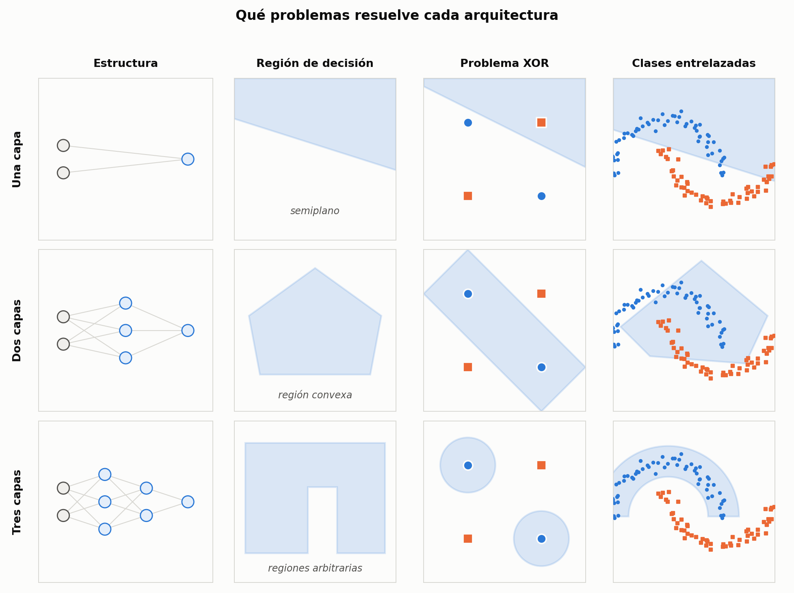

### Una capa — semiplano

Un solo perceptrón traza una recta y parte el espacio en dos: $+1$ de un lado, $-1$ del otro. En general, con $N$ entradas, un **hiperplano en $\mathbb{R}^N$**.

Falla en el XOR, y falla mucho peor con clases entrelazadas: por más que se acomode la recta, siempre queda una porción de una clase del lado equivocado.

### Dos capas — regiones convexas

Es la red del apunte anterior. Cada neurona de la primera capa aporta un semiplano; la de salida los **interseca**. Con más neuronas en la primera capa se intersecan más semiplanos y la región se afina — de una franja se pasa a un triángulo, a un pentágono, a algo cada vez más redondeado.

Pero hay un techo: **las regiones son siempre convexas** (abiertas o cerradas). No se pueden hacer regiones con huecos ni con concavidades, y por eso las dos medialunas siguen sin resolverse: la parte cóncava de una clase queda inevitablemente adentro de la región de la otra.

### Tres capas — regiones arbitrarias

Al agregar una capa más aparece una **capa oculta**, que se llama así porque *"no está en contacto ni con la salida ni con la entrada"*. Con eso se pueden construir regiones con **concavidades**, con **huecos**, e incluso regiones **no conexas** (dos manchas separadas que pertenecen a la misma clase). Ahí sí entran el hueco entre las dos medialunas y las dos esquinas sueltas del XOR.

> **OJO — cómo cuenta las capas la cátedra**
> Acá "capas" son **capas de neuronas**, no de valores. Las entradas $x_1, x_2, \dots$ **no cuentan como capa**: son datos, no neuronas.
> Por eso la red del XOR —dos neuronas más una de salida— es de **dos capas**, no de tres. Mucha bibliografía moderna la llamaría "una capa oculta" o incluso "de tres capas" contando la entrada. **No es un error de nadie: son convenciones distintas.** Fijate siempre cómo cuenta el texto que estás leyendo antes de comparar resultados.

> **PARA LA DEFENSA — "virtualmente cualquier problema" tiene letra chica**
> La frase que se usa en clase es que tres capas permiten resolver *virtualmente cualquier problema*, y enseguida viene la aclaración: **"la arquitectura permite resolverlo, pero hay que saber encontrar los pesos que efectivamente lo resuelven"**.
> Son dos cosas distintas y conviene decirlas separadas:
> **existencia** (¿hay una configuración de pesos que resuelve esto?) y **aprendizaje** (¿el algoritmo la encuentra?). El resultado de los años 80 es sobre lo primero. Todo lo que viene después —back-propagation, la elección de $\mu$, los mínimos locales— es el problema de lo segundo, y no está garantizado.

### Cómo elegir la arquitectura para un problema concreto

La tabla dice qué puede hacer cada arquitectura, pero en un parcial o en un TP la pregunta viene al revés: *dado este problema, ¿qué red hace falta?* El razonamiento tiene tres pasos.

**Paso 1 — ¿qué forma tiene la región que necesito?** Mirá dónde está cada clase y preguntate si la frontera que las separa es una recta, un contorno cerrado, o algo con entrantes.

**Paso 2 — buscá esa forma en la tabla.** Recta abierta → una capa. Región convexa, abierta o cerrada → dos capas. Con concavidades, huecos o partes separadas → tres.

**Paso 3 — cuántas neuronas en la capa oculta.** Cada neurona aporta un semiplano y la capa siguiente los interseca, así que **$N$ neuronas ocultas dan un polígono de hasta $N$ lados**. De ahí salen dos consecuencias: con $N=2$ **no se puede cerrar** una región (dos semiplanos dan una franja o una cuña, nunca un recinto), y a más neuronas, más lados y mejor aproximación a un contorno curvo.

Los tres casos clásicos, que son los de la figura:

| Problema | Región que hace falta | Arquitectura mínima | Por qué |
|---|---|---|---|
| **XOR** | una franja entre dos rectas paralelas | 2 capas, 2 ocultas | convexa **abierta**: alcanza con intersecar dos semiplanos |
| **Clases concéntricas** | un recinto **cerrado** alrededor de la clase interior | 2 capas, 3 ocultas o más | convexa **cerrada**: hacen falta al menos 3 semiplanos para cerrar un polígono |
| **Medialunas** | un contorno con una **concavidad** | 3 capas | ninguna región convexa puede seguir la curva de una medialuna sin comerse parte de la otra |

> **IDEA DE FONDO — el XOR y las concéntricas son el mismo caso, del derecho y del revés**
> Los dos se resuelven con **una sola capa oculta**, y sin embargo parecen problemas muy distintos. La diferencia es sólo si la región convexa queda **abierta** (la franja del XOR) o **cerrada** (el recinto de las concéntricas).
> Ésa es toda la variedad que da una capa oculta, y es más de lo que parece. Lo que **no** puede hacer, por más neuronas que le pongas, es una concavidad — y ahí es donde recién hace falta la tercera capa.

> **OJO — el mínimo geométrico no es el mínimo práctico**
> El paso 3 te da el **mínimo teórico**, o sea cuántas neuronas hacen falta para que la solución *exista*. Que el entrenamiento la *encuentre* es otra cosa: con el mínimo justo, la convergencia depende mucho de la inicialización.
> La regla de trabajo es ponerle unas cuantas neuronas más que el mínimo. No cambia lo que la red **puede** representar — cambia la probabilidad de que back-propagation llegue.

### Claves de la sección 1

| Clave | Qué tenés que poder responder |
|---|---|
| Una capa | Qué región genera y por qué falla en el XOR |
| Dos capas | Qué operación hace la capa de salida sobre los semiplanos |
| Límite convexo | Qué tipo de región **no** se puede hacer con dos capas |
| Tres capas | Qué habilita la capa oculta que antes no se podía |
| Elegir arquitectura | Los tres pasos, y aplicarlos al XOR, a las concéntricas y a las medialunas |
| Cuántas neuronas | Por qué $N$ ocultas dan un polígono de $N$ lados y por qué con 2 no se cierra |
| Conteo de capas | Por qué la red del XOR es "de dos capas" en esta materia |
| Letra chica | Diferencia entre que exista solución y que el algoritmo la encuentre |

---

## 2. Arquitectura general y notación

Hasta acá las redes eran de juguete. Ahora se generaliza a cualquier cantidad de entradas, neuronas y capas.

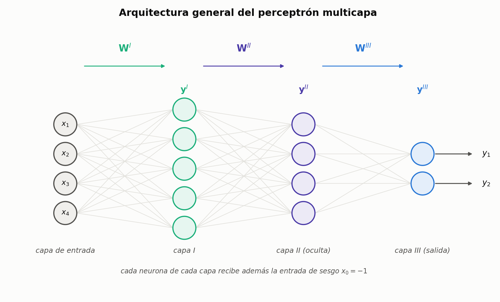

Tres cosas cambian respecto de los ejemplos anteriores:

**Muchas entradas.** El dibujo usa cuatro, o sea patrones en $\mathbb{R}^4$, pero no hay límite. El ejemplo que se da en clase es contundente: si la entrada es una imagen de $1024 \times 1024$ y cada píxel es una entrada, la red está clasificando en $\mathbb{R}^{1\,000\,000}$.

**Muchas salidas.** Con una sola salida $\pm 1$ había dos clases y nada más. Con dos salidas hay cuatro combinaciones, con tres hay ocho: **ya no se está limitado a dos clases.**

**Notación matricial.** Los pesos de cada capa se agrupan en una matriz y las salidas en un vector:

$$
\mathbf{W}^{I},\; \mathbf{y}^{I}
\qquad
\mathbf{W}^{II},\; \mathbf{y}^{II}
\qquad
\mathbf{W}^{III},\; \mathbf{y}^{III}
$$

> **OJO — el superíndice es de la capa de llegada**
> $\mathbf{W}^{II}$ **no** son los pesos "de la segunda capa de conexiones vista desde la entrada": son los pesos que **unen la capa I con la capa II**, y se le adjudican a la capa II. La regla es: *la notación hace referencia siempre a la capa de la neurona en la que estamos parados.* Los pesos que entran a una neurona pertenecen a la capa de esa neurona.

**Dimensiones.** Si la capa $p$ tiene $M_p$ neuronas y recibe $M_{p-1}$ entradas, entonces

$$
\mathbf{W}^{(p)} \text{ es de } M_p \times (M_{p-1} + 1)
$$

El $+1$ es la columna del sesgo. En el dibujo, con $4$ entradas y $5$ neuronas en la capa I, se cuentan **20 conexiones dibujadas** — pero la matriz real es de $5 \times 5 = 25$ pesos, porque el dibujo omite el $x_0$ para no ensuciarlo.

> **OJO — el sesgo está en todas las capas**
> En los diagramas generales casi nunca se dibuja, pero **la entrada $x_0 = -1$ está conectada a todas las neuronas de todas las capas**, cada una con su propio $w_0$. Que no aparezca en el dibujo no significa que no esté: significa que se lo da por sobreentendido. Al contar parámetros o al programar, es el error más fácil de cometer.

### Claves de la sección 2

| Clave | Qué tenés que poder responder |
|---|---|
| $\mathbf{W}^{(p)}$ | A qué capa pertenece una matriz de pesos |
| Dimensiones | Cuántas filas y columnas tiene, y de dónde sale el $+1$ |
| Muchas salidas | Por qué dejan de ser sólo dos clases |
| Sesgo | Dónde está aunque no se dibuje |
| Espacio de entrada | Por qué $\mathbb{R}^{1\,000\,000}$ no es un ejemplo exótico |

---

## 3. Propagación hacia adelante

Con la notación armada, calcular la salida de la red es repetir tres veces la misma operación.

**Capa I.** Para la neurona $j$, producto interno entre sus pesos y la entrada:

$$
v^{I}_j = \big\langle \mathbf{w}^{I}_j,\, \mathbf{x} \big\rangle = \sum_{i=0}^{N} w^{I}_{ji}\, x_i
\qquad\qquad
\text{(completo: } \mathbf{v}^{I} = \mathbf{W}^{I}\mathbf{x}\text{)}
$$

A $v$ se le llama **salida lineal**, porque todavía no pasó por la función de activación. Después:

$$
y^{I}_j = \varphi\big(v^{I}_j\big)
$$

**Capa II.** Toma como entrada las salidas de la capa I:

$$
v^{II}_j = \big\langle \mathbf{w}^{II}_j,\, \mathbf{y}^{I} \big\rangle
\qquad\Longrightarrow\qquad
y^{II}_j = \varphi\big(v^{II}_j\big)
$$

**Capa III.** Igual, y sus salidas **son** las salidas de la red:

$$
v^{III}_j = \big\langle \mathbf{w}^{III}_j,\, \mathbf{y}^{II} \big\rangle
\qquad\Longrightarrow\qquad
y^{III}_j = \varphi\big(v^{III}_j\big) = y_j
$$

> **IDEA DE FONDO — la distinción $v$ / $y$ no es cosmética**
> Separar la **salida lineal** $v$ de la **salida** $y$ parece un capricho de notación, pero es lo que hace legible toda la derivación de back-propagation. La cadena de derivadas pasa exactamente por ese punto: primero se deriva $y$ respecto de $v$ (ahí aparece $\varphi'$), y recién después $v$ respecto de $w$ (ahí aparece la entrada). Si no hubieras separado los dos, no tendrías dónde apoyar la regla de la cadena.

### Claves de la sección 3

| Clave | Qué tenés que poder responder |
|---|---|
| $v$ vs. $y$ | Qué es cada una y en qué orden se calculan |
| Forma matricial | Escribir $\mathbf{v}^{I} = \mathbf{W}^{I}\mathbf{x}$ y decir las dimensiones |
| Encadenado | Qué es la entrada de la capa II y de la capa III |
| Por qué separarlas | Qué papel juega esa distinción en back-propagation |

---

## 4. La función de activación: sigmoide simétrica

Acá se abandona la función signo. En su lugar:

$$
\varphi(v) = \frac{2}{1 + e^{-b\,v}} - 1
$$

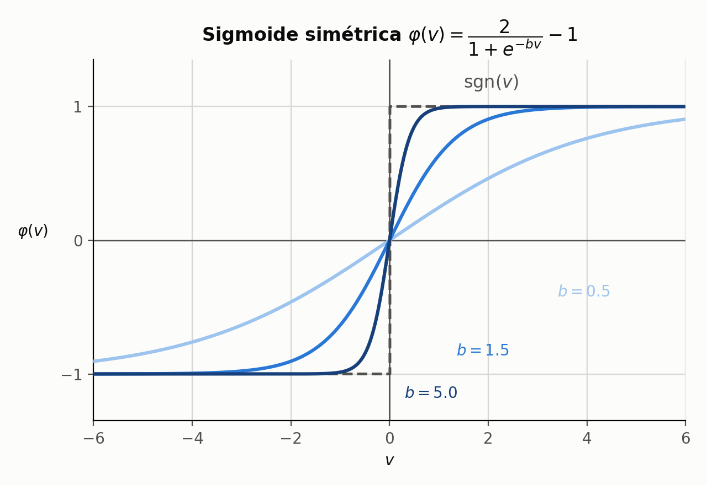

**Por qué se cambia.** Porque hay que derivarla. Todo el método del gradiente exige que la función de activación sea derivable, y $\mathrm{sgn}$ tiene una discontinuidad en el origen: su derivada es cero donde está definida y no existe justo donde importa. La sigmoide da la misma forma en $S$ **sin discontinuidades**.

**Qué hace $b$.** Controla cuán abrupta es la transición. Con $b$ grande la curva se pega a la función signo; con $b$ chico es una rampa suave. O sea: *se puede tener el comportamiento del signo sin pagar el precio de la discontinuidad.*

**Simétrica.** Va de $-1$ a $+1$, igual que $\mathrm{sgn}$, así que toda la codificación bipolar de las unidades anteriores se mantiene.

> **OJO — el aviso más importante de esta clase**
> Existen **dos** sigmoides muy parecidas en la bibliografía:
>
> - la **simétrica**, que es la que usa esta materia, entre $-1$ y $+1$;
> - la **logística**, entre $0$ y $1$.
>
> Las dos son correctas —es una cuestión de convención—, pero **si cambiás de una a la otra, todos los cálculos cambian**: la derivada es distinta, las fórmulas de los deltas son distintas, la codificación de las salidas deseadas es distinta. En clase se insiste: *no mezclar ecuaciones de un libro con ecuaciones de otro*, porque después no hay forma de que la red funcione. Antes de copiar una fórmula de Haykin o de Bishop, fijate cuál de las dos usa.

> **IDEA DE FONDO — $b$ y la escala de $w$ hacen lo mismo**
> En el apunte anterior quedó que la escala del vector de pesos era un grado de libertad irrelevante, porque con $\mathrm{sgn}$ sólo importa el signo. Con la sigmoide **deja de ser irrelevante**: como $\varphi$ actúa sobre $v = \langle w,x\rangle$, multiplicar $w$ por $k$ es exactamente lo mismo que multiplicar $b$ por $k$. Los dos controlan la misma cosa: cuán abrupta es la decisión.
> Consecuencia práctica: normalmente se fija $b$ y se deja que el entrenamiento ajuste $\|w\|$. Y también explica por qué la inicialización de pesos conviene chica: con $\|w\|$ grande la red arranca saturada, en la zona plana de la sigmoide, donde $\varphi' \approx 0$ y por lo tanto **no aprende**.

### Claves de la sección 4

| Clave | Qué tenés que poder responder |
|---|---|
| Fórmula | Escribir $\varphi(v)$ de memoria |
| Motivo del cambio | Por qué $\mathrm{sgn}$ no sirve para el gradiente |
| Parámetro $b$ | Qué controla y qué pasa en los extremos |
| Las dos sigmoides | En qué se diferencian y por qué no se pueden mezclar |
| Saturación | Por qué conviene inicializar los pesos chicos |

---

## 5. El criterio de error

Ahora la red tiene varias salidas, así que hay **un error por cada neurona de salida**. Para cada una:

$$
e_j(n) = d_j(n) - y_j(n)
$$

y el criterio de error de la red completa es la **suma del error cuadrático instantáneo**:

$$
\xi(n) = \frac{1}{2}\sum_{j=1}^{M} e_j^2(n)
$$

donde **$M$ es la cantidad de neuronas de la capa de salida** —el $M_p$ de la sección 2, con $p$ la última capa— y **$j$ las recorre**, de 1 a $M$. El patrón es $n$: la suma **no** corre sobre los patrones.

> **OJO — no confundas los dos errores**
> $\xi(n)$ es el error de **un** patrón, sumado sobre las $M$ salidas. El que se grafica por época es otro: $\sum_n \xi(n)$, sumado sobre **todos los patrones** del conjunto. Con una sola salida ($M=1$, como en el XOR o en concent) la sumatoria de $\xi(n)$ tiene un único término y es fácil creer que ahí ya está el error total. Con tres salidas (iris81) la diferencia se ve enseguida.

Tres decisiones metidas en esa fórmula, y las tres tienen motivo:

**Por qué al cuadrado.** No es cosmético. Si una salida se equivoca en $+1$ y otra en $-1$, al sumarlas **se compensarían** y el error total daría cero, con la red equivocándose en las dos. Elevando al cuadrado, cada error suma siempre y el total sólo baja cuando las neuronas realmente aciertan.

**Por qué el $\tfrac{1}{2}$.** Pura conveniencia: cuando se derive, el exponente $2$ va a bajar multiplicando y se va a cancelar con este $\tfrac{1}{2}$. Es un truco de limpieza, no tiene contenido.

**Por qué "instantáneo".** Es el error del patrón $n$, **no** el error sobre todo el conjunto de entrenamiento. El mismo ejemplo puede volver a mostrarse muchas iteraciones después, pero cada vez se calcula su propio $\xi(n)$.

> **IDEA DE FONDO — dónde se fue el $2\mu$ del perceptrón simple**
> En la unidad anterior el criterio era $e^2(n)$, sin el medio, y la regla terminaba en $w(n+1) = w(n) + 2\mu\,e(n)\,x(n)$ — con ese $2$ colgado adelante que después había que absorber en la constante.
> Con $\xi = \tfrac{1}{2}\sum e_j^2$, ese $2$ se cancela solo y las fórmulas de back-propagation quedan sin factores sueltos. **Es la misma cuenta, con la constante elegida de entrada para que salga limpia.**

### Claves de la sección 5

| Clave | Qué tenés que poder responder |
|---|---|
| $\xi(n)$ | Escribirla y decir sobre qué índice suma: $j$, las salidas, no los patrones |
| El cuadrado | El argumento de la compensación entre errores |
| El $\tfrac{1}{2}$ | Para qué está y de dónde viene |
| "Instantáneo" | Qué distingue este error del error sobre todo el conjunto |

---

## 6. La regla del gradiente y la cadena que hay que derivar

La idea es la misma de la unidad anterior: mover cada peso en el sentido opuesto al gradiente del error.

$$
\Delta w_{ji}(n) = -\mu\,\frac{\partial \xi(n)}{\partial w_{ji}(n)}
$$

Se deriva **respecto de los pesos** porque la superficie de error tiene a los pesos como coordenadas: distintos pesos, distinto error, y lo que se busca es el conjunto de pesos que lo hace mínimo.

**Sobre $\mu$**, el compromiso se explica bien en clase:

- $\mu$ **muy grande**: la red se aprende el ejemplo que le acabás de mostrar, pero *"se olvida todo lo que aprendió antes"*, porque modifica los pesos tanto que borra el ajuste de los ejemplos anteriores.
- $\mu$ **muy chico**: aprende bien pero lentísimo; hay que mostrarle todo muchísimas veces.

### La regla de la cadena

Acá está el corazón del asunto. El error no depende de los pesos de forma directa: depende **a través de una cadena de dependencias**.

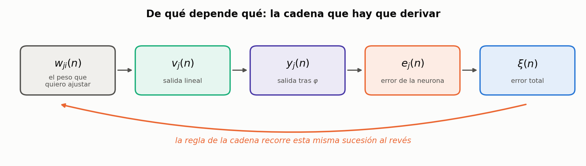

Leído de derecha a izquierda, que es como lo dice la clase — *"una función de una función de una función"*:

- $\xi(n)$ depende de $e_j(n)$, el error de la neurona $j$;
- $e_j(n)$ depende de $y_j(n)$, la salida de esa neurona (es una simple resta, pero depende);
- $y_j(n)$ depende de $v_j(n)$, la salida lineal, a través de $\varphi$;
- $v_j(n)$ es lo único que depende **de forma directa** del peso $w_{ji}(n)$.

Por lo tanto:

$$
\boxed{\;
\frac{\partial \xi(n)}{\partial w_{ji}(n)} =
\frac{\partial \xi(n)}{\partial e_j(n)}\;
\frac{\partial e_j(n)}{\partial y_j(n)}\;
\frac{\partial y_j(n)}{\partial v_j(n)}\;
\frac{\partial v_j(n)}{\partial w_{ji}(n)}
\;}
$$

> **PARA LA DEFENSA — ésta es la ecuación fundamental**
> Todo lo que sigue en la unidad es **resolver estos cuatro factores uno por uno** y después repetir el procedimiento hacia atrás capa por capa. Si podés escribir esta ecuación y explicar de dónde sale cada factor, tenés el esqueleto completo de back-propagation aunque todavía no hayas hecho las cuentas.
> Y notá la simetría con la propagación hacia adelante: **la información va $w \to v \to y \to e \to \xi$, y la derivada recorre exactamente el mismo camino al revés.** De ahí el nombre: propagación hacia atrás.

### Claves de la sección 6

| Clave | Qué tenés que poder responder |
|---|---|
| Regla del gradiente | Escribir $\Delta w_{ji}$ y justificar el signo |
| $\mu$ grande / chico | Qué falla en cada extremo |
| La cadena | Nombrar los cuatro eslabones en orden |
| Ecuación fundamental | Escribirla completa y explicar cada factor |
| El nombre | Por qué se llama "propagación hacia atrás" |

---

## 7. El factor fácil: $\partial v_j / \partial w_{ji} = y_i$

Se empieza por el último eslabón de la cadena, que es el más simple. Reemplazando $v_j$ por su definición:

$$
v_j(n) = \sum_{i=0}^{N} w_{ji}(n)\, y_i(n)
$$

Al derivar esa suma respecto de **un** peso $w_{ji}$, todos los términos con índice distinto de $i$ son **constantes** —no contienen la variable contra la que se deriva— y su derivada es cero. Sobrevive un solo término:

$$
\frac{\partial v_j(n)}{\partial w_{ji}(n)}
= \frac{\partial \big[w_{ji}(n)\, y_i(n)\big]}{\partial w_{ji}(n)}
= y_i(n)
$$

Es el caso de derivar $3x$ respecto de $x$: queda la constante que multiplica. Acá la constante es $y_i(n)$, la entrada que llega por esa conexión.

> **OJO — $y_i$ no es $y_j$, y se diferencian por un solo subíndice**
> Es la sutileza que se remarca en clase, y es fácil de pasar por alto porque las dos letras son iguales:
>
> - $y_i(n)$ es **la entrada** a la neurona $j$ por la conexión $i$ — o sea, la salida de la neurona $i$ de la **capa anterior**.
> - $y_j(n)$ es **la salida** de la neurona $j$, la que sale de su función de activación.
>
> Cuando aparezcan los superíndices de capa la distinción se vuelve obvia: $y^{(p-1)}_i$ contra $y^{(p)}_j$. Mientras tanto, la regla mental es: **el subíndice del peso te dice quién es quién.** En $w_{ji}$, el $j$ es la neurona que recibe y el $i$ es de dónde viene.

### Claves de la sección 7

| Clave | Qué tenés que poder responder |
|---|---|
| La derivada | Por qué de toda la sumatoria sobrevive un solo término |
| El resultado | Qué es $y_i$ concretamente |
| $y_i$ vs. $y_j$ | Cuál es entrada y cuál es salida |
| Subíndices de $w_{ji}$ | Cuál indica la neurona que recibe |

---

## 8. El gradiente de error local instantáneo: $\delta_j$

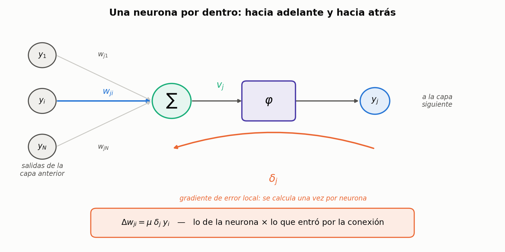

La §7 se llevó el último factor de la cadena. Los **tres restantes** se agrupan en una sola cantidad, que es **la pieza central de todo back-propagation**:

$$
\boxed{\;
\delta_j(n) = -\frac{\partial \xi(n)}{\partial y_j(n)}\;\frac{\partial y_j(n)}{\partial v_j(n)}
\;}
$$

> **OJO — son tres eslabones, aunque se vean dos**
> $\dfrac{\partial \xi}{\partial y_j}$ es la **fusión** de los dos primeros de la §6: $\dfrac{\partial \xi}{\partial e_j}\dfrac{\partial e_j}{\partial y_j}$. Se escriben juntos porque siempre van juntos.
> Si buscás dónde quedó el $e$, está ahí adentro: con $\xi = \tfrac{1}{2}\sum e_j^2$ y $e_j = d_j - y_j$ resulta $\partial\xi/\partial e_j = e_j$ y $\partial e_j/\partial y_j = -1$, o sea $\partial \xi / \partial y_j = -e_j$. Reemplazando, $\delta_j = e_j\,\varphi'(v_j)$, que es la fórmula de la §11.

> **IDEA DE FONDO — por qué la definición no se escribe directamente con $e_j$**
> Porque **una neurona oculta no tiene $e_j$**: no hay $d_j$ para ella, el error no existe en esa capa. Lo que sí existe siempre es $\partial \xi / \partial y_j$, sólo que en las ocultas vale otra cosa —$-\sum_k \delta_k w_{kj}$, la §12—.
> Ésa es toda la razón de que la definición sea genérica: **es la única forma que sirve para los dos casos**. Definirla como $e_j\varphi'$ te dejaría sin manera de bajar a las capas ocultas.

Cada palabra del nombre está justificada:

- **gradiente**, porque es una derivada: es una parte del gradiente global que se viene calculando;
- **local**, porque es de **esa** neurona $j$ en particular;
- **instantáneo**, porque está calculado en la iteración $n$.

En la práctica se lo llama simplemente **delta**.

> **IDEA DE FONDO — por qué conviene agrupar así y no de otra forma**
> El corte no es arbitrario. $\delta_j$ junta **todo lo que depende de la neurona** y deja afuera **lo que depende de la conexión**. Por eso la actualización termina teniendo la forma
> $$\Delta w_{ji} = \mu \cdot \underbrace{\delta_j}_{\text{de la neurona}} \cdot \underbrace{y_i}_{\text{de la conexión}}$$
> y por eso el $\delta$ **se calcula una sola vez por neurona** y después se reutiliza para todos los pesos que entran a ella. Si agruparas de otro modo, tendrías que recalcular lo mismo una vez por conexión.
> Es también lo que hace posible propagar hacia atrás: lo único que una capa necesita de la capa siguiente son sus $\delta$.

> **OJO — el signo menos del $\delta$**
> En el desarrollo de clase el $\delta$ aparece primero **sin** el signo menos y enseguida **con** él. La versión que se usa de acá en adelante es **con el menos**, y no es un detalle: es lo que hace que la actualización quede **sumando** en vez de restando, absorbiendo el $-\mu$ de la regla del gradiente. Si copiás la versión sin el menos y después usás la fórmula final, la red aprende en la dirección contraria.

### Para la pizarra: el último factor y la definición de $\delta$

**Te preguntan:** *"Planteá la regla de la cadena para ajustar un peso de una red."*

**Arrancás escribiendo:** la cadena de dependencias completa.

**Paso 1.** Escribís de qué depende qué: $\xi \leftarrow e_j \leftarrow y_j \leftarrow v_j \leftarrow w_{ji}$.

> **Llegás a:** $\;\dfrac{\partial \xi}{\partial w_{ji}} = \dfrac{\partial \xi}{\partial e_j}\dfrac{\partial e_j}{\partial y_j}\dfrac{\partial y_j}{\partial v_j}\dfrac{\partial v_j}{\partial w_{ji}}$

**Paso 2.** Resolvés el último factor. Escribís $v_j = \sum_i w_{ji} y_i$ y derivás respecto de **un** peso: todos los términos con índice distinto de $i$ son constantes.

> **Llegás a:** $\;\dfrac{\partial v_j}{\partial w_{ji}} = y_i(n)$
> **Trampa:** confundir $y_i$ con $y_j$. $y_i$ es **la entrada** por esa conexión (salida de la capa anterior); $y_j$ es la salida de la neurona.

**Paso 3.** Agrupás los tres factores restantes y los bautizás.

> **Llegás a:** $\;\delta_j(n) = -\dfrac{\partial \xi}{\partial y_j}\,\dfrac{\partial y_j}{\partial v_j}$
> Decí las tres palabras: **gradiente** (es una derivada), **local** (de esa neurona), **instantáneo** (en la iteración $n$).

**Paso 4.** Armás la regla de ajuste.

> **Llegás a:** $\;\boxed{\Delta w_{ji}(n) = \mu\,\delta_j(n)\,y_i(n)}$
> **Trampa:** perder el signo. El menos de $\delta$ cancela el $-\mu$ del gradiente.

### Claves de la sección 8

| Clave | Qué tenés que poder responder |
|---|---|
| Definición | Escribir $\delta_j$ y decir qué **tres** factores agrupa |
| Dónde está el $e$ | Que $\partial\xi/\partial y_j = -e_j$, y sólo en la capa de salida |
| Las tres palabras | Justificar "gradiente", "local" e "instantáneo" |
| Por qué ese corte | Qué es de la neurona y qué es de la conexión |
| El signo | Qué pasa si lo copiás sin el menos |

---

## 9. La derivada de la sigmoide simétrica

De los dos factores del $\delta$, uno se puede resolver ya: $\partial y_j / \partial v_j$ es simplemente **la derivada de la función de activación**.

> **OJO — acá se hace una simplificación**
> Se asume que **todas las neuronas de la red tienen la misma función de activación**. Existen redes con funciones distintas por neurona, o con parámetros distintos; en ese caso esta derivada habría que calcularla neurona por neurona. Con la simplificación, se calcula **una vez** y sirve para toda la red.

Partiendo de $\varphi(v) = \dfrac{2}{1+e^{-v}} - 1$ y derivando respecto de $v$:

$$
\frac{\partial y_j}{\partial v_j}
= \frac{2\,e^{-v_j}}{\big(1+e^{-v_j}\big)^2}
= 2\;\underbrace{\frac{1}{1+e^{-v_j}}}_{(1)}\;\underbrace{\frac{e^{-v_j}}{1+e^{-v_j}}}_{(2)}
$$

El paso astuto está en el factor $(2)$: **se suma y se resta $1$** en el numerador —que es lo mismo que no hacer nada— para poder partirlo en dos:

$$
\frac{e^{-v_j}}{1+e^{-v_j}}
= \frac{-1 + 1 + e^{-v_j}}{1+e^{-v_j}}
= 1 - \frac{1}{1+e^{-v_j}}
$$

Y ahora el reemplazo que resuelve todo. De la definición de la sigmoide,

$$
y_j = \frac{2}{1+e^{-v_j}} - 1
\qquad\Longleftrightarrow\qquad
\frac{1}{1+e^{-v_j}} = \frac{y_j + 1}{2}
$$

Metiendo eso en los dos factores, **la exponencial desaparece**:

$$
\frac{\partial y_j}{\partial v_j}
= 2\cdot\frac{y_j+1}{2}\left(1 - \frac{y_j+1}{2}\right)
= (y_j+1)\,\frac{2-y_j-1}{2}
$$

$$
\boxed{\;\frac{\partial y_j}{\partial v_j} = \varphi'(v_j) = \tfrac{1}{2}\,\big(1+y_j\big)\big(1-y_j\big)\;}
$$

> **IDEA DE FONDO — la derivada se escribe con la salida, no con la entrada**
> Éste es el motivo real por el que se elige una sigmoide y no otra función suave cualquiera. La derivada **no depende de $v_j$**: depende de $y_j$, que es un número que la propagación hacia adelante **ya calculó**. No hay que volver a evaluar ninguna exponencial ni guardar los $v$: con las salidas de la pasada hacia adelante alcanza.
> Es fácil de recordar además: *un medio, por uno más la salida, por uno menos la salida.*

> **OJO — el orden de los factores define el signo, y esto sí se presta a error**
> Es $\tfrac{1}{2}(1+y)(1-y)$, **no** $\tfrac{1}{2}(1+y)(y-1)$. Las dos expresiones son idénticas salvo el signo, y la segunda da siempre **negativa** — lo cual es imposible, porque la sigmoide es creciente y su derivada tiene que ser positiva en todo punto.
> Comprobado contra la derivada numérica:
>
> ```
>      v         y       num.   1/2(1+y)(1-y)   1/2(1+y)(y-1)
> ------------------------------------------------------------
>  -3.00   -0.9051    0.09035         0.09035        -0.09035
>  -1.00   -0.4621    0.39322         0.39322        -0.39322
>   0.00    0.0000    0.50000         0.50000        -0.50000
>   1.00    0.4621    0.39322         0.39322        -0.39322
>   3.00    0.9051    0.09035         0.09035        -0.09035
>
> Maximo error de 1/2(1+y)(1-y) frente a la derivada numerica: 2.660e-10
> ```
>
> El control mental de tres segundos: **en $v=0$ la derivada tiene que dar $+0{,}5$.** Si tu fórmula da $-0{,}5$, tenés los factores dados vuelta.

> **OJO — dónde se fue el parámetro $b$**
> Las diapositivas hacen la deducción con $b=1$ y por eso $b$ no aparece en el resultado. En el caso general, $\varphi(v)=\frac{2}{1+e^{-bv}}-1$ y la derivada es
> $$\varphi'(v_j) = \tfrac{b}{2}\,(1+y_j)(1-y_j)$$
> Comprobado: para $v=0{,}7$ y $b=2$, la derivada numérica da $0{,}634740$, que es exactamente $\tfrac{b}{2}(1+y)(1-y)$ y el **doble** de lo que daría la fórmula sin el $b$. Con $b=1$ las dos coinciden, y por eso en esta materia no molesta — pero si algún día cambiás $b$, el factor tiene que estar.

### Qué significa esta derivada

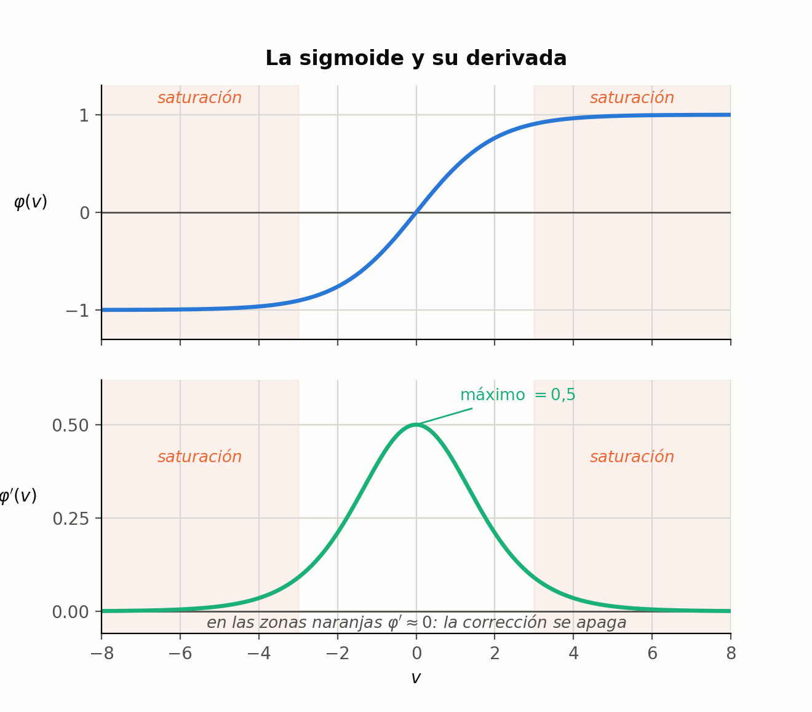

La derivada vale como máximo $0{,}5$, justo en $v_j = 0$ —donde la neurona está indecisa— y se desploma hacia cero en los extremos.

Como $\varphi'$ multiplica al $\delta$, y el $\delta$ multiplica a la corrección, esto significa que **una neurona saturada casi no corrige sus pesos**, por más grande que sea su error.

Es el mismo fenómeno que anticipaba el recuadro de la sección 4 sobre inicializar los pesos chicos, ahora con la cuenta que lo explica: si $\|w\|$ es grande, $v$ es grande, $\varphi'\approx 0$ y el aprendizaje se apaga.

Y explica algo más, que aparece cuando se apilan capas: como cada capa hacia atrás multiplica por otro $\varphi' \le 0{,}5$, las correcciones se van achicando a medida que se alejan de la salida. Las primeras capas aprenden más lento que las últimas — un problema real de las redes profundas, y acá se ve de dónde sale.

### Para la pizarra: la derivada de la sigmoide simétrica

**Te preguntan:** *"Deducí la derivada de la función de activación."*

**Arrancás escribiendo:** la definición, y aclarando que es **la simétrica**, entre $-1$ y $+1$.

**Paso 1.** Escribís $\varphi$ y derivás respecto de $v$ como cociente.

> **Llegás a:** $\;\dfrac{\partial y_j}{\partial v_j} = \dfrac{2\,e^{-v_j}}{\big(1+e^{-v_j}\big)^2}$

**Paso 2.** Partís esa fracción en dos factores.

> **Llegás a:** $\;2\cdot\dfrac{1}{1+e^{-v_j}}\cdot\dfrac{e^{-v_j}}{1+e^{-v_j}}$

**Paso 3.** En el segundo factor **sumás y restás $1$** en el numerador.

> **Llegás a:** $\;\dfrac{e^{-v_j}}{1+e^{-v_j}} = \dfrac{-1+1+e^{-v_j}}{1+e^{-v_j}} = 1 - \dfrac{1}{1+e^{-v_j}}$
> **Trampa:** no explicar el truco. Decilo: *"sumar y restar uno es no hacer nada, pero me deja partirlo en dos"*.

**Paso 4.** Despejás $\dfrac{1}{1+e^{-v_j}}$ de la definición de la sigmoide y reemplazás en los dos factores.

> **Llegás a:** $\;\dfrac{1}{1+e^{-v_j}} = \dfrac{y_j+1}{2}$, y con eso $\;2\cdot\dfrac{y_j+1}{2}\left(1-\dfrac{y_j+1}{2}\right)$

**Paso 5.** Simplificás.

> **Llegás a:** $\;\boxed{\varphi'(v_j) = \tfrac{1}{2}\big(1+y_j\big)\big(1-y_j\big)}$
> **Trampa:** escribir $(1+y)(y-1)$. Da **negativa**, y una función creciente no puede tener derivada negativa.
> **Control de tres segundos:** en $v=0$ tiene que dar $+0{,}5$.

**Paso 6 (si te lo piden).** Decís por qué importa: la derivada quedó **en función de la salida**, que la pasada hacia adelante ya calculó. No hay que recalcular ninguna exponencial.

### Claves de la sección 9

| Clave | Qué tenés que poder responder |
|---|---|
| Simplificación | Qué se asume sobre las funciones de activación |
| El truco | Para qué se suma y se resta $1$ |
| El reemplazo | Cómo se pasa de $\frac{1}{1+e^{-v}}$ a $\frac{y+1}{2}$ |
| Resultado | Escribir $\varphi'$ y el control en $v=0$ |
| Por qué importa | Qué ventaja tiene que dependa de $y$ y no de $v$ |
| Saturación | Por qué una neurona saturada no aprende |

---

## 10. La regla de actualización

Juntando todo lo que se resolvió:

$$
\frac{\partial \xi(n)}{\partial w_{ji}(n)} = -\,\delta_j(n)\, y_i(n)
\qquad\Longrightarrow\qquad
\Delta w_{ji}(n) = -\mu\,\frac{\partial \xi(n)}{\partial w_{ji}(n)}
$$

$$
\boxed{\;\Delta w_{ji}(n) = \mu\,\delta_j(n)\,y_i(n)\;}
\qquad\text{con}\qquad
\delta_j(n) = -\frac{\partial \xi(n)}{\partial y_j(n)}\cdot\tfrac{1}{2}\big(1+y_j(n)\big)\big(1-y_j(n)\big)
$$

El signo menos de la regla del gradiente **se canceló** con el del $\delta$: por eso la corrección queda sumando.

> **PARA LA DEFENSA — es la misma forma que el LMS del perceptrón simple**
> Comparalas:
>
> | | corrección |
> |---|---|
> | LMS (perceptrón simple) | $\Delta w = 2\mu\; e(n)\; x(n)$ |
> | Back-propagation | $\Delta w_{ji} = \mu\; \delta_j(n)\; y_i(n)$ |
>
> **Es la misma estructura**: velocidad de aprendizaje $\times$ *algo local de la neurona* $\times$ *lo que entró por esa conexión*. Lo único que cambió es que el error crudo $e$ fue reemplazado por el $\delta$, y la entrada $x$ por la salida de la capa anterior $y_i$.
> Dicho de otro modo: **back-propagation no es un algoritmo nuevo, es el LMS con un error corregido**. El $\delta$ es "cuánto error le toca a esta neurona", y calcularlo es todo el problema — trivial en la capa de salida, y el asunto central en las ocultas.

De la fórmula queda **un solo factor sin resolver**: $-\dfrac{\partial \xi(n)}{\partial y_j(n)}$. Y ahí está el quiebre de la unidad, porque la respuesta **depende de en qué capa esté la neurona**.

### Claves de la sección 10

| Clave | Qué tenés que poder responder |
|---|---|
| Fórmula final | Escribir $\Delta w_{ji} = \mu\,\delta_j\,y_i$ |
| El signo | Por qué la corrección quedó sumando |
| Paralelo con LMS | Qué papel juega el $\delta$ y qué papel la $y_i$ |
| Lo que falta | Cuál es el único factor sin resolver y de qué depende |

---

## 11. Back-propagation en la capa de salida

Éste es el caso fácil, y por eso se hace primero. Con los superíndices de capa puestos, lo que se busca es el ajuste de los pesos de la capa III:

$$
\Delta w^{III}_{ji}(n) = \mu\;\delta^{III}_j(n)\;y^{II}_i(n)
$$

> **OJO — quién es $y^{II}_i$ acá**
> Es la **entrada** a la capa III, o sea **la salida de la capa II**. Lo que sale de las neuronas de la capa II es lo que entra a las de la capa III. Es la misma sutileza $y_i$ / $y_j$ de la sección 7, ahora con el superíndice que la vuelve evidente: la entrada lleva el superíndice de la capa **anterior**.

Falta entonces $\delta^{III}_j$, que por definición es

$$
\delta^{III}_j(n) = -\frac{\partial \xi(n)}{\partial y^{III}_j(n)}\cdot
\tfrac{1}{2}\big(1+y^{III}_j(n)\big)\big(1-y^{III}_j(n)\big)
$$

La segunda mitad ya está resuelta —es la derivada de la sigmoide de la sección 9—, así que sólo queda $\partial \xi / \partial y^{III}_j$. Y acá se vuelve a abrir el paso que en la sección 8 se había compactado:

$$
\frac{\partial \xi(n)}{\partial y^{III}_j(n)} =
\frac{\partial \xi(n)}{\partial e_j(n)}\;\frac{\partial e_j(n)}{\partial y^{III}_j(n)}
$$

**Primer factor.** Reemplazando $\xi(n) = \tfrac{1}{2}\sum_k e_k^2(n)$ y derivando respecto de $e_j$: de toda la sumatoria, **los términos con $k \neq j$ son constantes** y su derivada es cero. Sobrevive sólo el término $j$, donde baja el $2$ del cuadrado — **y ese $2$ se simplifica con el $\tfrac{1}{2}$**:

$$
\frac{\partial \xi(n)}{\partial e_j(n)} = e_j(n)
$$

**Segundo factor.** Como $e_j(n) = d_j(n) - y^{III}_j(n)$, y $d_j$ es una constante:

$$
\frac{\partial e_j(n)}{\partial y^{III}_j(n)} = -1
$$

**Juntando.** El $-1$ se cancela con el signo menos de la definición del $\delta$:

$$
\boxed{\;\delta^{III}_j(n) = \tfrac{1}{2}\,e_j(n)\,\big(1+y^{III}_j(n)\big)\big(1-y^{III}_j(n)\big)\;}
\qquad {\large \star}
$$

Y reemplazando en la actualización, absorbiendo el $\tfrac{1}{2}$ y el $\mu$ en una sola constante $\eta$:

$$
\Delta w^{III}_{ji}(n) = \eta\;
\underbrace{e_j(n)}_{\text{error}}\;
\underbrace{\big(1+y^{III}_j(n)\big)\big(1-y^{III}_j(n)\big)}_{\text{derivada de }\varphi}\;
\underbrace{y^{II}_i(n)}_{\text{entrada}}
$$

> **PARA LA DEFENSA — la estructura de la fórmula es la respuesta**
> Si te piden la actualización de la capa de salida y te olvidás de un factor, reconstruila por su estructura, que se dice en clase tal cual:
> **velocidad de aprendizaje $\times$ error $\times$ derivada de la función de activación $\times$ entrada.**
> Cuatro piezas, en ese orden. Y es la misma estructura del LMS de la unidad anterior con un factor extra: **la derivada de la activación**, que es exactamente lo que allá no aparecía porque se había supuesto el caso lineal.

> **IDEA DE FONDO — la estrellita $\star$ no es decoración**
> El resultado de $\delta^{III}_j$ queda marcado con una estrella en las diapositivas porque **se vuelve a usar**: cuando toque derivar las capas ocultas, la cuenta va a llegar a una expresión que contiene exactamente esto, y en vez de recalcularla se la reemplaza por $\delta^{III}_k$. Ése es el truco que convierte una cuenta larguísima en una fórmula recursiva — y, en la práctica, el que permite programar back-propagation como un bucle sobre las capas en vez de una fórmula distinta para cada una.

> **OJO — otra vez la constante cambia de nombre**
> Se pasó de $\mu$ a $\eta$ para absorber el $\tfrac{1}{2}$ que venía del $\delta$. Es el mismo movimiento que en la unidad del perceptrón simple, donde $\eta = 4\mu$. **La constante de aprendizaje se redefine cada vez que aparece un factor numérico**, así que no te preocupes por su valor: lo que hay que reconocer es la forma de la ecuación. Si en un parcial te aparece un $\tfrac{1}{2}$ de más o de menos, mirá si el enunciado usa $\mu$ o $\eta$.

### Para la pizarra: el $\delta$ de la capa de salida

**Te preguntan:** *"Deducí el ajuste de los pesos de la capa de salida."*

**Arrancás escribiendo:** $\Delta w^{III}_{ji} = \mu\,\delta^{III}_j\,y^{II}_i$, y aclarás que $y^{II}_i$ es **la entrada** a la capa III.

**Paso 1.** Escribís el $\delta$ y separás la parte ya conocida (la derivada de la activación) de la que falta.

> **Llegás a:** $\;\delta^{III}_j = -\dfrac{\partial \xi}{\partial y^{III}_j}\cdot\tfrac{1}{2}\big(1+y^{III}_j\big)\big(1-y^{III}_j\big)$

**Paso 2.** Abrís $\dfrac{\partial \xi}{\partial y^{III}_j}$ en dos eslabones.

> **Llegás a:** $\;\dfrac{\partial \xi}{\partial e_j}\,\dfrac{\partial e_j}{\partial y^{III}_j}$

**Paso 3.** Primer eslabón: reemplazás $\xi = \tfrac{1}{2}\sum_k e_k^2$ y derivás respecto de $e_j$. **Sobrevive un solo término** y el $2$ que baja se cancela con el $\tfrac{1}{2}$.

> **Llegás a:** $\;\dfrac{\partial \xi}{\partial e_j} = e_j(n)$

**Paso 4.** Segundo eslabón: $e_j = d_j - y^{III}_j$, con $d_j$ constante.

> **Llegás a:** $\;\dfrac{\partial e_j}{\partial y^{III}_j} = -1$

**Paso 5.** Juntás: el $-1$ cancela el menos de adelante.

> **Llegás a:** $\;\boxed{\delta^{III}_j = \tfrac{1}{2}\,e_j\,\big(1+y^{III}_j\big)\big(1-y^{III}_j\big)}\quad\star$
> **Marcá la estrella en la pizarra.** La vas a reusar en la sección 12.

**Paso 6.** Escribís el ajuste final y **decís su estructura en voz alta**.

> **Llegás a:** $\;\Delta w^{III}_{ji} = \eta\; e_j\,\big(1+y^{III}_j\big)\big(1-y^{III}_j\big)\; y^{II}_i$
> **La frase:** *velocidad de aprendizaje, por error, por derivada de la activación, por entrada.*

### Claves de la sección 11

| Clave | Qué tenés que poder responder |
|---|---|
| $y^{II}_i$ | Por qué la entrada lleva el superíndice de la capa anterior |
| $\partial \xi/\partial e_j$ | Por qué sobrevive un solo término y adónde va el $2$ |
| $\partial e_j/\partial y_j$ | Cuánto vale y con qué se cancela |
| $\delta^{III}_j$ | Escribirlo completo |
| Estructura | Los cuatro factores de $\Delta w^{III}_{ji}$, en orden |
| La estrellita | Por qué este resultado se guarda para después |

---

## 12. Back-propagation en las capas ocultas

Acá se complica, y conviene decir por qué antes de meterse en la cuenta.

El punto de partida es **la misma ecuación**, sólo que con otro superíndice:

$$
\Delta w^{II}_{ji}(n) = \mu\;\delta^{II}_j(n)\;y^{I}_i(n)
$$

La entrada a la capa II es $y^{I}_i$, la salida de la capa I — que todavía **no** es la entrada de la red: para eso habría que ir una capa más atrás. Y el $\delta$ ahora es el de la capa II, que es lo que hay que encontrar.

### 12.1 Por qué esto es más difícil

El error se mide en **la capa de salida**, pero ahora hay que derivar respecto de una neurona de **la capa oculta**. Como se dice en clase: *"cada vez estamos más lejos de la salida final de la red"*. Para llegar del error hasta la neurona $j$ hay que **atravesar la capa de salida**, y ese trayecto es toda la dificultad.

Arrancando de la definición del $\delta$, la parte de la derecha ya está resuelta —es la derivada de la sigmoide de la sección 9— y lo que falta es la de la izquierda:

$$
\delta^{II}_j(n) = -\frac{\partial \xi(n)}{\partial y^{II}_j(n)}\cdot
\tfrac{1}{2}\big(1+y^{II}_j(n)\big)\big(1-y^{II}_j(n)\big)
$$

### 12.2 Los tres índices: ordenar esto antes de empezar


Antes de la cuenta hay que fijar la notación, porque de acá en adelante conviven tres índices y en clase se insiste en no mezclarlos:

| Índice | Recorre | Es |
|:---:|---|---|
| $i$ | las neuronas de la **capa anterior** | de dónde viene la entrada |
| $j$ | las neuronas de la **capa actual** (la oculta) | dónde estoy parado |
| $k$ | las neuronas de la **capa de salida** | adónde va lo que produzco |

> **OJO — la $y$ que está adentro del error no es la $y$ contra la que derivo**
> Es la advertencia que más se repite en esta clase. Dentro de $e_k = d_k - y^{III}_k$ **la salida que aparece es la de la capa III**, no la $y^{II}_j$ de la capa oculta. Son dos cosas distintas que se escriben con la misma letra y sólo se distinguen por el superíndice y el subíndice.
> Justamente **porque no son la misma** es que hay que recorrer un camino de derivadas para conectarlas. Si fueran la misma, la cuenta se terminaría en un renglón.

### 12.3 Desarmar el criterio de error

Reemplazando $\xi(n) = \tfrac{1}{2}\sum_k e_k^2(n)$ y usando que **la derivada de una suma es la suma de las derivadas** —se saca el $\tfrac{1}{2}$ afuera y se entra con la derivada en la sumatoria—:

$$
\delta^{II}_j(n) = -\frac{\partial\left\{\tfrac{1}{2}\sum_k e_k^2(n)\right\}}{\partial y^{II}_j(n)}\;\tfrac{1}{2}\big(1+y^{II}_j\big)\big(1-y^{II}_j\big)
= -\frac{1}{2}\sum_k \frac{\partial e_k^2(n)}{\partial y^{II}_j(n)}\;\tfrac{1}{2}\big(1+y^{II}_j\big)\big(1-y^{II}_j\big)
$$

Cada término de la suma es la derivada de algo elevado al cuadrado: baja el $2$ —que se cancela con el $\tfrac{1}{2}$— y queda la función por la derivada de la función:

$$
\delta^{II}_j(n) = -\sum_k e_k(n)\,\frac{\partial e_k(n)}{\partial y^{II}_j(n)}\;\tfrac{1}{2}\big(1+y^{II}_j\big)\big(1-y^{II}_j\big)
$$

> **OJO — acá la sumatoria NO se colapsa**
> En la capa de salida, al derivar $\sum_k e_k^2$ respecto de $e_j$, sobrevivía **un solo término**. Acá no: se está derivando respecto de $y^{II}_j$, y la salida de esa neurona oculta **alimenta a todas las neuronas de la capa de salida**. Ninguno de los términos es constante, así que **la sumatoria queda**.
> Ésa es, en una frase, toda la diferencia entre el caso fácil y el difícil: en la salida el error de una neurona es asunto suyo; en una capa oculta, la neurona es corresponsable del error de todas las que alimenta.

### 12.4 El camino que hay que recorrer

Falta $\partial e_k / \partial y^{II}_j$, y no se puede derivar de una porque el error de la capa III no depende directamente de la salida de la capa II. Hay que atravesar la capa de salida con la regla de la cadena, eslabón por eslabón:

$$
\frac{\partial e_k(n)}{\partial y^{II}_j(n)} =
\underbrace{\frac{\partial e_k(n)}{\partial y^{III}_k(n)}}_{(1)}\;
\underbrace{\frac{\partial y^{III}_k(n)}{\partial v^{III}_k(n)}}_{(2)}\;
\underbrace{\frac{\partial v^{III}_k(n)}{\partial y^{II}_j(n)}}_{(3)}
$$

que se lee: el error de la capa de salida respecto de la salida de la capa de salida; ésa respecto de su salida lineal; y esa salida lineal respecto de la salida de la capa oculta —que es justamente **la entrada** a la capa de salida—. Ahí ya se llegó a la capa que interesa.

**Factor (1).** Como $e_k(n) = d_k(n) - y^{III}_k(n)$ y $d_k$ es constante:

$$
\frac{\partial e_k(n)}{\partial y^{III}_k(n)} = -1
$$

**Factor (2).** Es la derivada de la función de activación, ya conocida — pero **de la capa de salida**:

$$
\frac{\partial y^{III}_k(n)}{\partial v^{III}_k(n)} = \tfrac{1}{2}\big(1+y^{III}_k(n)\big)\big(1-y^{III}_k(n)\big)
$$

**Factor (3).** Como $v^{III}_k(n) = \sum_j w^{III}_{kj}(n)\, y^{II}_j(n)$, al derivar respecto de $y^{II}_j$ pasa lo mismo que en la sección 7: todos los términos con índice distinto de $j$ son constantes y se anulan, y del que sobrevive queda la constante que multiplica:

$$
\frac{\partial v^{III}_k(n)}{\partial y^{II}_j(n)} = w^{III}_{kj}(n)
$$

> **IDEA DE FONDO — se acumulan DOS derivadas de activación**
> Prestá atención a que ahora hay dos: la del factor (2), que es la de **la capa de salida** y va evaluada en $y^{III}_k$, y la que se viene arrastrando desde la definición del $\delta$, que es la de **la capa oculta** y va evaluada en $y^{II}_j$. En clase se las llama *"la colita que venimos arrastrando"*.
> Y ésta es la razón de fondo por la que las capas profundas aprenden lento: **cada capa que se retrocede agrega otro factor $\varphi' \le 0{,}5$**, así que la corrección se multiplica por un número menor que uno una vez por capa.

### 12.5 Juntando todo

Reemplazando los tres factores, el $-1$ del factor (1) se cancela con el signo menos de adelante:

$$
\delta^{II}_j(n) = \sum_k e_k(n)\;\tfrac{1}{2}\big(1+y^{III}_k\big)\big(1-y^{III}_k\big)\;w^{III}_{kj}(n)\;
\cdot\;\tfrac{1}{2}\big(1+y^{II}_j\big)\big(1-y^{II}_j\big)
$$

Ésta ya es la fórmula del gradiente de error local en la capa oculta. Pero mirala con atención antes de seguir.

### 12.6 El reemplazo que es el corazón del método

De la capa de salida (sección 11) teníamos, marcado con $\star$:

$$
\delta^{III}_k(n) = \tfrac{1}{2}\,e_k(n)\,\big(1+y^{III}_k(n)\big)\big(1-y^{III}_k(n)\big)
$$

**Eso es exactamente lo que quedó adentro de la sumatoria.** Reemplazando:

$$
\boxed{\;
\delta^{II}_j(n) = \left[\sum_k \delta^{III}_k(n)\,w^{III}_{kj}(n)\right]
\tfrac{1}{2}\big(1+y^{II}_j(n)\big)\big(1-y^{II}_j(n)\big)
\;}
$$


> **PARA LA DEFENSA — qué significa ese corchete**
> Es el punto que en clase se marca como *"una cuestión clave, el corazón del método"*, y no es sólo eficiencia de cálculo: tiene contenido conceptual.
> Mirá qué es $\sum_k \delta^{III}_k\, w^{III}_{kj}$: un **promedio ponderado de los $\delta$ de la capa de salida, pesado por los pesos de la capa de salida**. Es decir, se están haciendo pasar los $\delta$ de la capa III **a través de los pesos que unen la capa III con la capa II**, pero en sentido contrario.
> Y eso es **exactamente el espejo de la propagación hacia adelante**: allá las entradas atravesaban los pesos para producir la salida de la capa siguiente; acá los $\delta$ atraviesan los mismos pesos, de atrás para adelante, para producir el $\delta$ de la capa anterior. **De ahí el nombre: retropropagación.**
> Un detalle que suma: el sentido se invierte pero los pesos son **los mismos**. Hacia adelante se usan las **filas** de $\mathbf{W}$; hacia atrás, las **columnas** — o sea $\mathbf{W}^{T}$. No hay una segunda red para el camino de vuelta.

Y la actualización de los pesos de la capa oculta queda:

$$
\Delta w^{II}_{ji}(n) = \eta\;
\underbrace{\left[\sum_k \delta^{III}_k(n)\,w^{III}_{kj}(n)\right]}_{\text{error retropropagado}}\;
\underbrace{\big(1+y^{II}_j(n)\big)\big(1-y^{II}_j(n)\big)}_{\text{derivada de }\varphi\text{ acá}}\;
\underbrace{y^{I}_i(n)}_{\text{entrada}}
$$

**La misma estructura de siempre**: velocidad de aprendizaje $\times$ error $\times$ derivada de la activación $\times$ entrada. Lo único que cambió es que el "error" ya no es $e_j$ sino el error **retropropagado** desde la capa siguiente.

### Para la pizarra: el $\delta$ de una capa oculta

**Te preguntan:** *"¿Y cómo se ajustan los pesos de una capa oculta, si ahí no hay salida deseada?"*

**Arrancás dibujando** tres capas y marcando los índices: $i$ de dónde viene, $j$ dónde estoy, $k$ adónde va. **Sin esto la cuenta se te mezcla.**


**Paso 1.** Planteás el problema: el error se mide en la capa de salida, pero hay que derivar respecto de una neurona de la capa oculta. Hay que **atravesar la capa de salida**.

**Paso 2.** Escribís el $\delta$ y reemplazás $\xi$, metiendo la derivada dentro de la sumatoria.

> **Llegás a:** $\;\delta^{II}_j = -\sum_k e_k\,\dfrac{\partial e_k}{\partial y^{II}_j}\;\cdot\;\tfrac{1}{2}\big(1+y^{II}_j\big)\big(1-y^{II}_j\big)$
> **Trampa:** colapsar la sumatoria como en la capa de salida. Acá **ningún** término es constante: la neurona oculta alimenta a **todas** las de salida.

**Paso 3.** Abrís $\dfrac{\partial e_k}{\partial y^{II}_j}$ en tres eslabones, atravesando la capa de salida.

> **Llegás a:** $\;\dfrac{\partial e_k}{\partial y^{III}_k}\;\dfrac{\partial y^{III}_k}{\partial v^{III}_k}\;\dfrac{\partial v^{III}_k}{\partial y^{II}_j}$

**Paso 4.** Resolvés los tres.

> **Llegás a:**
> $(1)\;\dfrac{\partial e_k}{\partial y^{III}_k} = -1$
> $(2)\;\dfrac{\partial y^{III}_k}{\partial v^{III}_k} = \tfrac{1}{2}\big(1+y^{III}_k\big)\big(1-y^{III}_k\big)$
> $(3)\;\dfrac{\partial v^{III}_k}{\partial y^{II}_j} = w^{III}_{kj}$
> **Trampa:** evaluar la derivada de la activación en la neurona equivocada. La de $(2)$ va en **$k$**; la que arrastrás desde el paso 2 va en **$j$**. Son **dos** derivadas distintas.

**Paso 5.** Reemplazás; el $-1$ cancela el menos.

> **Llegás a:** $\;\delta^{II}_j = \sum_k e_k\,\tfrac{1}{2}\big(1+y^{III}_k\big)\big(1-y^{III}_k\big)\,w^{III}_{kj}\;\cdot\;\tfrac{1}{2}\big(1+y^{II}_j\big)\big(1-y^{II}_j\big)$

**Paso 6 (el remate).** Señalás la estrella de la sección 11: eso que quedó adentro de la sumatoria **es $\delta^{III}_k$**.

> **Llegás a:** $\;\boxed{\delta^{II}_j = \left[\sum_k \delta^{III}_k\,w^{III}_{kj}\right]\tfrac{1}{2}\big(1+y^{II}_j\big)\big(1-y^{II}_j\big)}$

**Paso 7.** Explicás qué es el corchete. **Éste es el punto que te están evaluando.**

> **La frase:** *es un promedio ponderado de los $\delta$ de la capa siguiente, pesado por los pesos que las unen. Estamos haciendo pasar los $\delta$ por los mismos pesos, en sentido contrario. Por eso se llama retropropagación.*


### Claves de la sección 12

| Clave | Qué tenés que poder responder |
|---|---|
| Los tres índices | Qué recorre $i$, qué recorre $j$, qué recorre $k$ |
| Por qué es difícil | Dónde se mide el error y dónde hay que derivar |
| La sumatoria | Por qué no se colapsa como en la capa de salida |
| Los tres factores | Cuánto vale cada uno de $(1)$, $(2)$ y $(3)$ |
| Dos $\varphi'$ | Cuál va evaluada en $y^{III}_k$ y cuál en $y^{II}_j$ |
| El reemplazo | Cómo aparece $\delta^{III}_k$ adentro de la cuenta |
| El corchete | Qué significa conceptualmente, y por qué "retro" |
| $\mathbf{W}^{T}$ | Por qué el camino de vuelta usa los mismos pesos |

---

## 13. La generalización: una capa $p$ cualquiera

La ecuación de la capa oculta no depende de que la red tenga tres capas. Renombrando: si $p$ es **la capa en la que estoy parado**, entonces $p-1$ es de donde viene la entrada y $p+1$ es la capa siguiente:

$$
\boxed{\;
\Delta w^{(p)}_{ji}(n) = \eta\;
\big\langle \boldsymbol{\delta}^{(p+1)},\, \mathbf{w}^{(p+1)}_j \big\rangle\;
\big(1+y^{(p)}_j(n)\big)\big(1-y^{(p)}_j(n)\big)\;
y^{(p-1)}_i(n)
\;}
$$

Pieza por pieza:

| Pieza | Qué es |
|---|---|
| $\eta$ | velocidad de aprendizaje |
| $\big\langle \boldsymbol{\delta}^{(p+1)}, \mathbf{w}^{(p+1)}_j \big\rangle$ | el error retropropagado desde la capa siguiente |
| $\big(1+y^{(p)}_j\big)\big(1-y^{(p)}_j\big)$ | derivada de la activación **en la capa actual** |
| $y^{(p-1)}_i$ | la entrada a la capa $p$, o sea la salida de la capa $p-1$ |

> **OJO — qué vector es $\mathbf{w}^{(p+1)}_j$**
> No es la fila de pesos de una neurona: es el vector de los pesos que **salen** de la neurona $j$ hacia todas las neuronas de la capa $p+1$. En la matriz $\mathbf{W}^{(p+1)}$ eso es **la columna $j$**, no una fila. Por eso el producto interno se escribe con $\boldsymbol{\delta}^{(p+1)}$, que tiene una componente por cada neurona de esa capa.
> Es la forma compacta de decir $\sum_k \delta^{(p+1)}_k w^{(p+1)}_{kj}$.

### La misma fórmula, desplegada para una red de tres capas

La forma general es compacta pero tiene **dos bordes** donde hay que interpretarla. Conviene tenerla escrita entera al menos una vez, con $y^{(0)}_i = x_i$:

**Capa III, la de salida.** No existe $p+1$, así que el producto interno se reemplaza por el error verdadero:

$$\Delta w^{(III)}_{ji}(n) = \eta\; \underbrace{\big(d_j(n) - y^{(III)}_j(n)\big)}_{e_j(n)}\; \big(1+y^{(III)}_j\big)\big(1-y^{(III)}_j\big)\; y^{(II)}_i(n)$$

**Capa II, oculta.** La fórmula general, tal cual:

$$\Delta w^{(II)}_{ji}(n) = \eta\; \big\langle \boldsymbol{\delta}^{(III)},\, \mathbf{w}^{(III)}_j \big\rangle\; \big(1+y^{(II)}_j\big)\big(1-y^{(II)}_j\big)\; y^{(I)}_i(n)$$

**Capa I, la primera.** Igual, pero la "salida de la capa anterior" es la **entrada de la red**:

$$\Delta w^{(I)}_{ji}(n) = \eta\; \big\langle \boldsymbol{\delta}^{(II)},\, \mathbf{w}^{(II)}_j \big\rangle\; \big(1+y^{(I)}_j\big)\big(1-y^{(I)}_j\big)\; x_i(n)$$

Los $\delta$ se calculan **en este orden**, porque cada capa necesita los de la siguiente:

$$\delta^{(III)}_j = e_j\big(1+y^{(III)}_j\big)\big(1-y^{(III)}_j\big)
\;\longrightarrow\;
\delta^{(II)}_j = \big\langle \boldsymbol{\delta}^{(III)}, \mathbf{w}^{(III)}_j \big\rangle \big(1+y^{(II)}_j\big)\big(1-y^{(II)}_j\big)
\;\longrightarrow\;
\delta^{(I)}_j$$

> **OJO — los dos bordes son lo único que cambia**
> **Arriba** ($p$ = capa de salida): no hay $\boldsymbol{\delta}^{(p+1)}$, va $e_j$ en su lugar.
> **Abajo** ($p = I$): no hay $y^{(p-1)}$, va $x_i$ en su lugar.
> En el medio la fórmula es idéntica para todas las capas, tenga la red tres o veinte. Si en el pizarrón te piden desplegarla, escribí primero la del medio y después aclará los dos bordes: se entiende mejor que ir capa por capa.

> **PARA LA DEFENSA — por qué esta ecuación cierra la unidad**
> Porque **no importa cuántas capas tenga la red**. Con esta única fórmula se pueden ajustar los pesos de todas las capas: se empieza por la de salida, donde el $\delta$ sale del error verdadero, y de ahí para atrás cada capa arma su $\delta$ con los de la capa siguiente. Es un **bucle**, no una fórmula por capa.
> Si te piden "explicá back-propagation", esto es el final del camino: una regla recursiva que hace bajar el error por una red de profundidad arbitraria.

### Para la pizarra: la generalización a una capa $p$

**Te preguntan:** *"Escribí la regla general para una capa cualquiera."*

**Paso 1.** Renombrás: $p$ es donde estás, $p-1$ de dónde viene la entrada, $p+1$ la capa siguiente.

**Paso 2.** Escribís la fórmula.

> **Llegás a:**
> $$\Delta w^{(p)}_{ji}(n) = \eta\;\big\langle \boldsymbol{\delta}^{(p+1)},\, \mathbf{w}^{(p+1)}_j \big\rangle\;\big(1+y^{(p)}_j\big)\big(1-y^{(p)}_j\big)\;y^{(p-1)}_i(n)$$
> **Trampa:** decir que $\mathbf{w}^{(p+1)}_j$ es una fila. Es **la columna $j$**: los pesos que **salen** de la neurona $j$.

**Paso 3.** Cerrás con por qué esto termina la unidad: **no importa cuántas capas tenga la red**. Se empieza por la de salida, donde el $\delta$ sale del error verdadero, y de ahí para atrás cada capa arma el suyo con los de la siguiente. Es un bucle, no una fórmula por capa.

### Claves de la sección 13

| Clave | Qué tenés que poder responder |
|---|---|
| La fórmula general | Escribirla e identificar sus cuatro piezas |
| $p-1$, $p$, $p+1$ | Qué papel cumple cada capa |
| $\mathbf{w}^{(p+1)}_j$ | Por qué es una columna y no una fila |
| Por qué generaliza | Por qué sirve para cualquier cantidad de capas |

---

## 14. El algoritmo completo, paso a paso

Todo lo deducido hasta acá son ecuaciones sueltas. Esta sección las pone en orden de ejecución: qué se calcula primero, qué después, y con qué valores.

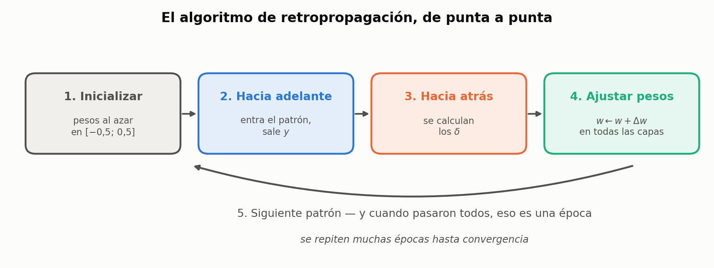

La red de ejemplo es chica a propósito: **2 entradas, 3 neuronas en la capa I, 2 en la capa II y 1 en la capa de salida.** Alcanza para que aparezcan todos los casos.

### Paso 1 — Inicialización

Todos los pesos, al azar y **con valores pequeños**: por ejemplo, uniformes en $[-0{,}5;\,+0{,}5]$.

Ya vimos el motivo en la sección 9, pero conviene tenerlo a mano: con pesos grandes, $v$ arranca grande, la neurona arranca **saturada**, $\varphi' \approx 0$ y la red no aprende. Los valores chicos la dejan en la zona donde la derivada es máxima.

### Paso 2 — Propagación hacia adelante

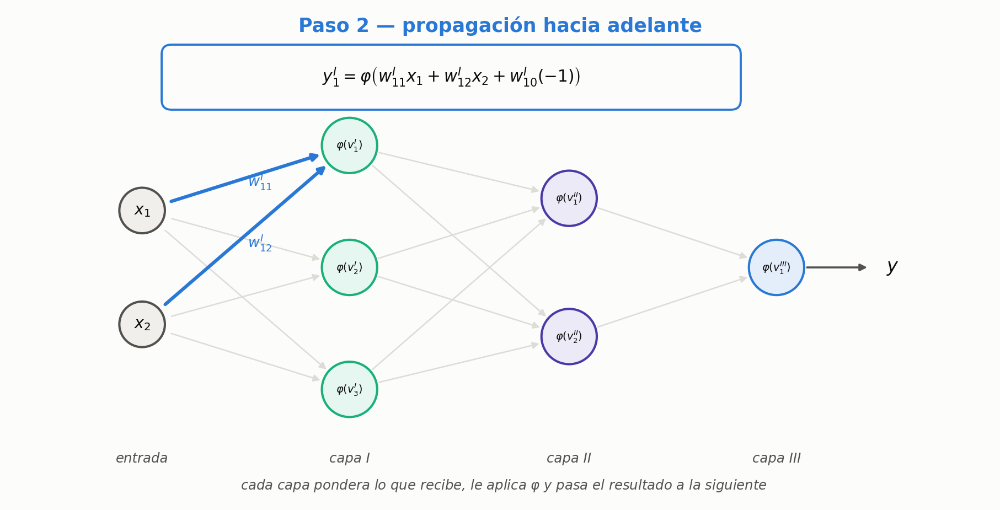

Entra un patrón $(x_1, x_2)$ y se recorre la red de izquierda a derecha. Para la primera neurona de la capa I:

$$
y^{I}_1 = \varphi\Big(w^{I}_{11}\,x_1 + w^{I}_{12}\,x_2 + w^{I}_{10}\,(-1)\Big)
$$

donde el superíndice indica la **capa** y el subíndice, la **neurona** dentro de esa capa. Lo mismo para $y^{I}_2$ e $y^{I}_3$. Después la capa II toma como entrada las tres salidas de la capa I, y la capa III toma las dos de la capa II:

$$
y^{II}_1 = \varphi\Big(w^{II}_{11}y^{I}_1 + w^{II}_{12}y^{I}_2 + w^{II}_{13}y^{I}_3 + w^{II}_{10}(-1)\Big)
\qquad
y = y^{III}_1 = \varphi\Big(w^{III}_{11}y^{II}_1 + w^{III}_{12}y^{II}_2 + w^{III}_{10}(-1)\Big)
$$

> **OJO — el sesgo está aunque no se dibuje**
> En el esquema no aparece, para no ensuciarlo. Pero **todas** las neuronas de **todas** las capas tienen su peso de sesgo multiplicando a $-1$: $w^{I}_{10}$, $w^{I}_{20}$, $w^{I}_{30}$, $w^{II}_{10}$, $w^{II}_{20}$, $w^{III}_{10}$. Son seis pesos más que hay que inicializar, usar y actualizar.

> **IDEA DE FONDO — hasta acá no se entrenó nada**
> El paso 2 es puro cálculo: se propagó una entrada y salió un número. **Ningún peso se movió.** Lo que sí queda es un subproducto imprescindible: las salidas $y^{I}_j$, $y^{II}_j$, $y^{III}$ de todas las neuronas, que hay que **guardar** porque los pasos 3 y 4 las van a usar.

### Paso 3 — Propagación hacia atrás

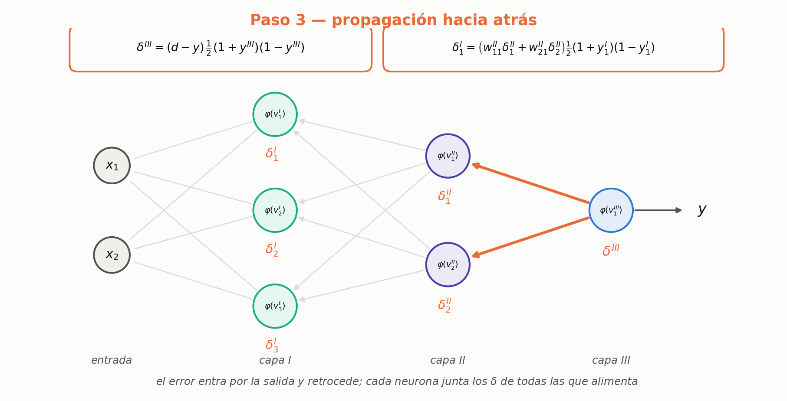

Ahora se recorre la red de derecha a izquierda calculando un $\delta$ por neurona.

**Capa de salida** (una sola neurona, así que un solo $\delta$):

$$
\delta^{III} = \underbrace{(d - y)}_{\text{el error}}\;\cdot\;\tfrac{1}{2}\big(1+y^{III}\big)\big(1-y^{III}\big)
$$

**Capa II.** Se propaga $\delta^{III}$ hacia atrás multiplicándolo por el peso que une cada neurona con la de salida:

$$
\delta^{II}_1 = w^{III}_{11}\,\delta^{III}\;\cdot\;\tfrac{1}{2}\big(1+y^{II}_1\big)\big(1-y^{II}_1\big)
\qquad
\delta^{II}_2 = w^{III}_{12}\,\delta^{III}\;\cdot\;\tfrac{1}{2}\big(1+y^{II}_2\big)\big(1-y^{II}_2\big)
$$

**Capa I.** Acá la suma tiene **dos** términos, porque la neurona 1 de la capa I alimenta a **las dos** neuronas de la capa II:

$$
\delta^{I}_1 = \Big(w^{II}_{11}\,\delta^{II}_1 + w^{II}_{21}\,\delta^{II}_2\Big)\;\cdot\;\tfrac{1}{2}\big(1+y^{I}_1\big)\big(1-y^{I}_1\big)
$$

> **IDEA DE FONDO — cuántos términos tiene la suma, sin pensar**
> Es la regla práctica que hace todo esto mecánico: **la sumatoria del $\delta$ de una neurona tiene tantos términos como neuronas haya en la capa siguiente.**
> En esta red: la capa II mira a una sola neurona de salida → **un** término (por eso arriba no hay sumatoria, es un producto). La capa I mira a dos neuronas de la capa II → **dos** términos.
> Y el otro chequeo: la derivada de activación de afuera va siempre evaluada en **la salida de la neurona cuyo $\delta$ estás calculando**, nunca en la de la capa siguiente.

Al terminar el paso 3 hay un $\delta$ por neurona: $\delta^{I}_1, \delta^{I}_2, \delta^{I}_3, \delta^{II}_1, \delta^{II}_2, \delta^{III}$. Seis números, uno por neurona. **Todavía ningún peso se movió.**

### Paso 4 — Adaptación de los pesos

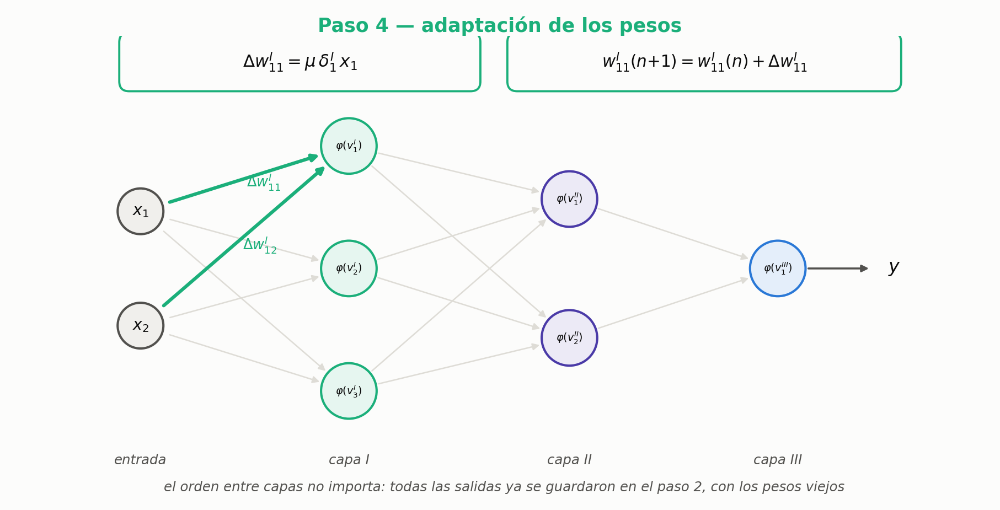

Ahora sí. Para cada peso:

$$
\Delta w^{I}_{11} = \mu\;\delta^{I}_1\;x_1
\qquad\qquad
w^{I}_{11}(n+1) = w^{I}_{11}(n) + \Delta w^{I}_{11}
$$

> **OJO — $\Delta w$ no es el peso nuevo, es el cambio**
> Es la confusión más común y en clase se la repite varias veces: lo que sale de la fórmula es **el ajuste**, y hay que **sumárselo al peso actual**. El peso nuevo, el que va a actuar la próxima vez que entre un patrón, es $w(n) + \Delta w$.

Los pesos de sesgo se actualizan igual que los demás, usando el $\delta$ de su propia neurona y recordando que su entrada vale $-1$:

$$
\Delta w^{I}_{10} = \mu\;\delta^{I}_1\;(-1)
$$

> **PARA LA DEFENSA — por qué el orden de actualización no importa**
> Éste es el punto más fino de la clase y se explica medio de corrido, así que vale desarmarlo.
> La pregunta natural es: si actualizo primero la capa I, ¿los pesos nuevos no cambian las salidas que después necesito para actualizar la capa II? **No**, y la razón es que las salidas $y^{(p)}_j$ **ya están calculadas y guardadas** desde el paso 2, con los pesos viejos. No se recalculan. Lo mismo con los $\delta$: todos salieron del paso 3, también con los pesos viejos.
> Por eso el paso 4 puede recorrer las capas en cualquier orden —de adelante hacia atrás, de atrás hacia adelante, salteado— y da **exactamente el mismo resultado**.
>
> **La precisión que falta:** eso vale porque los pasos 3 y 4 están **separados**. Si en cambio fueras intercalando —actualizar la capa III y después usar esos pesos nuevos para calcular $\delta^{II}$— el resultado **sí** cambiaría, y estaría mal: el gradiente está definido en el punto $w(n)$, no en un punto a medio mover. Primero todos los $\delta$, después todos los $\Delta w$. Ése es el orden que sí importa.

### Paso 5 — Siguiente patrón, y épocas

Todo lo anterior fue **para un solo patrón**. Se toma el siguiente del archivo de entrenamiento y se repite: adelante, atrás, ajuste. Y así con todos.

> **IDEA DE FONDO — qué es una época**
> Una **época** es una pasada completa por todos los patrones de entrenamiento, cada uno una vez. Un entrenamiento típico son 10, 20, 50 o 100 épocas: al conjunto se le muestran los datos muchas veces, y en cada pasada los pesos se corrigen un poco más.
> Notá que los pesos se actualizan **después de cada patrón**, no al final de la época. Eso lo hace un entrenamiento **estocástico** (o *por patrón*), consistente con el "error instantáneo" $\xi(n)$ de la sección 5: nunca se promedió sobre el conjunto, y por eso conviene $\mu$ chico, para que el ruido de patrón a patrón se promedie solo.

### Claves de la sección 14

| Clave | Qué tenés que poder responder |
|---|---|
| Los cinco pasos | Enumerarlos en orden |
| Inicialización | Por qué los valores chicos |
| Qué guarda el paso 2 | Qué se necesita después y por qué no se recalcula |
| Cantidad de términos | Cuántos suma el $\delta$ de una neurona y por qué |
| $\Delta w$ vs. $w$ | Qué devuelve la fórmula y qué hay que hacer con eso |
| Orden de actualización | Por qué da igual, y qué orden sí importa |
| Época | Qué es y cuántas se usan |
| Estocástico | Cuándo se actualizan los pesos y qué implica para $\mu$ |

---

---

## 15. Un ejemplo numérico completo, paso por paso

Todo lo anterior, sobre una red **2 → 3 → 2 → 1**, con un patrón y una sola iteración. Cada bloque
dice **qué fórmula está aplicando y de qué sección sale**.

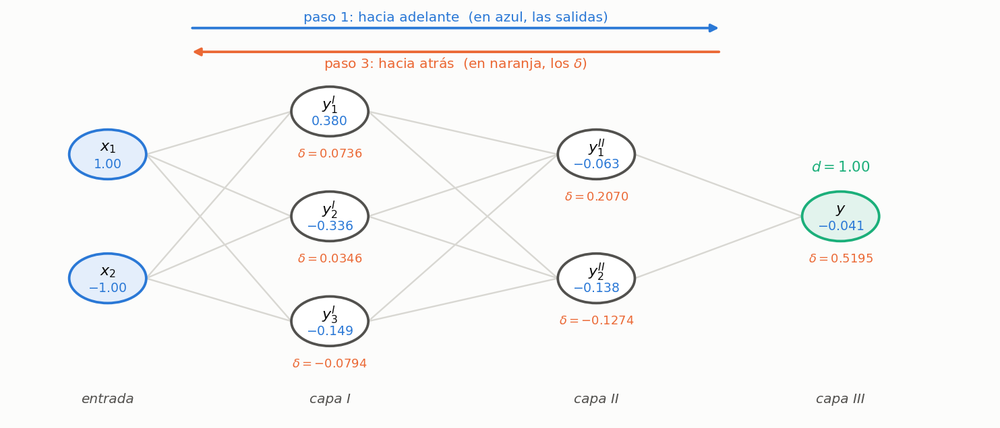

### Los datos de partida

Los pesos son inventados —al entrenar salen de un sorteo—, el patrón es $\mathbf{x} = (1,\,-1)$, la
respuesta correcta es $d = 1$ y la velocidad de aprendizaje es $\mu = 0{,}5$.

$$\mathbf{W}^{I} = \begin{pmatrix} 0{,}5 & -0{,}4 \\ -0{,}3 & 0{,}6 \\ 0{,}2 & 0{,}2 \end{pmatrix}
\quad
\mathbf{u}^{I} = \begin{pmatrix} 0{,}1 \\ -0{,}2 \\ 0{,}3 \end{pmatrix}
\quad
\mathbf{W}^{II} = \begin{pmatrix} 0{,}4 & 0{,}5 & -0{,}6 \\ -0{,}7 & 0{,}2 & 0{,}3 \end{pmatrix}
\quad
\mathbf{u}^{II} = \begin{pmatrix} 0{,}2 \\ -0{,}1 \end{pmatrix}
\quad
\mathbf{W}^{III} = \begin{pmatrix} 0{,}8 & -0{,}5 \end{pmatrix}
\quad
u^{III} = 0{,}1$$

Los $\mathbf{u}$ son los pesos del sesgo, o sea los $w_{j0}$ que multiplican a $x_0 = -1$. Son 14 pesos
de conexión más 6 umbrales: **20 parámetros**.

### Paso 1 — Hacia adelante

> **Fórmulas: §3 y §4.** $\;v_j = \sum_i w_{ji}\,y_i + w_{j0}(-1)\;$ y $\;y_j = \varphi(v_j)$, con
> $\varphi(v) = \dfrac{2}{1+e^{-v}} - 1$.

**Capa I** — entra $\mathbf{x}$:

$$\begin{aligned}
v^{I}_1 &= 0{,}5\,(1) + (-0{,}4)(-1) - 0{,}1 = 0{,}5 + 0{,}4 - 0{,}1 = \mathbf{0{,}8} \\
v^{I}_2 &= (-0{,}3)(1) + 0{,}6\,(-1) - (-0{,}2) = -0{,}3 - 0{,}6 + 0{,}2 = \mathbf{-0{,}7} \\
v^{I}_3 &= 0{,}2\,(1) + 0{,}2\,(-1) - 0{,}3 = 0{,}2 - 0{,}2 - 0{,}3 = \mathbf{-0{,}3}
\end{aligned}$$

$$y^{I}_1 = \varphi(0{,}8) = 0{,}3799 \qquad y^{I}_2 = \varphi(-0{,}7) = -0{,}3364 \qquad y^{I}_3 = \varphi(-0{,}3) = -0{,}1489$$

**Capa II** — sus entradas son las tres salidas de la capa I:

$$\begin{aligned}
v^{II}_1 &= 0{,}4\,(0{,}3799) + 0{,}5\,(-0{,}3364) + (-0{,}6)(-0{,}1489) - 0{,}2 = -0{,}1269 \\
v^{II}_2 &= (-0{,}7)(0{,}3799) + 0{,}2\,(-0{,}3364) + 0{,}3\,(-0{,}1489) - (-0{,}1) = -0{,}2779
\end{aligned}$$

$$y^{II}_1 = \varphi(-0{,}1269) = -0{,}0634 \qquad y^{II}_2 = \varphi(-0{,}2779) = -0{,}1381$$

**Capa III** — una sola neurona:

$$v^{III} = 0{,}8\,(-0{,}0634) + (-0{,}5)(-0{,}1381) - 0{,}1 = -0{,}0507 + 0{,}0691 - 0{,}1 = -0{,}0817$$

$$y = \varphi(-0{,}0817) = \mathbf{-0{,}0408}$$

### Paso 2 — El error

> **Fórmula: §5.** $\;e_j(n) = d_j(n) - y_j(n)\;$ y $\;\xi(n) = \tfrac{1}{2}\sum_j e_j^2(n)$.
> Con $M = 1$ la sumatoria tiene un solo término.

$$e = 1{,}0000 - (-0{,}0408) = \mathbf{1{,}0408} \qquad\qquad \xi = \tfrac{1}{2}(1{,}0408)^2 = 0{,}5416$$

### Paso 3 — Hacia atrás

**Capa III.**

> **Fórmulas: §11 y §9.** $\;\delta_j = e_j\,\varphi'(v_j)\;$ con $\;\varphi'(v_j) = \tfrac{1}{2}(1+y_j)(1-y_j)$.

$$\varphi'(v^{III}) = \tfrac{1}{2}\,(1 - 0{,}0408)(1 + 0{,}0408) = 0{,}4992$$
$$\delta^{III} = 1{,}0408 \times 0{,}4992 = \mathbf{0{,}5195}$$

**Capa II.** Acá no hay error propio, así que el primer factor cambia.

> **Fórmula: §12.** $\;\delta^{(p)}_j = \Big(\sum_k \delta^{(p+1)}_k\, w^{(p+1)}_{kj}\Big)\,\varphi'(v^{(p)}_j)$
> — que es el $\big\langle \boldsymbol{\delta}^{(p+1)}, \mathbf{w}^{(p+1)}_j \big\rangle$ de la §13.
> Con una sola neurona en la capa III, la sumatoria tiene un término.

$$\begin{aligned}
\text{para } j=1:\quad & \delta^{III} w^{III}_{11} = 0{,}5195 \times 0{,}8 = 0{,}4156 \\
\text{para } j=2:\quad & \delta^{III} w^{III}_{12} = 0{,}5195 \times (-0{,}5) = -0{,}2598
\end{aligned}$$

$$\delta^{II}_1 = 0{,}4156 \times \underbrace{0{,}4980}_{\varphi'(v^{II}_1)} = \mathbf{0{,}2070}
\qquad
\delta^{II}_2 = -0{,}2598 \times \underbrace{0{,}4905}_{\varphi'(v^{II}_2)} = \mathbf{-0{,}1274}$$

> **OJO — por qué la neurona 2 tiene $\delta$ negativo**
> Porque su peso hacia la salida es $-0{,}5$: le manda señal **en contra**. Si la salida quedó corta,
> esta neurona ayuda **bajando**, no subiendo. El signo del peso decide el signo de la culpa.

**Capa I.** La misma fórmula, pero ahora la sumatoria tiene **dos** términos, porque cada neurona de
la capa I alimenta a las dos de la capa II:

$$\begin{aligned}
j=1:\quad & 0{,}4\,(0{,}2070) + (-0{,}7)(-0{,}1274) = 0{,}0828 + 0{,}0892 = 0{,}1720 \\
j=2:\quad & 0{,}5\,(0{,}2070) + 0{,}2\,(-0{,}1274) = 0{,}1035 - 0{,}0255 = 0{,}0780 \\
j=3:\quad & (-0{,}6)(0{,}2070) + 0{,}3\,(-0{,}1274) = -0{,}1242 - 0{,}0382 = -0{,}1624
\end{aligned}$$

$$\delta^{I}_1 = 0{,}1720 \times 0{,}4278 = \mathbf{0{,}0736}
\qquad
\delta^{I}_2 = 0{,}0780 \times 0{,}4434 = \mathbf{0{,}0346}
\qquad
\delta^{I}_3 = -0{,}1624 \times 0{,}4889 = \mathbf{-0{,}0794}$$

> **IDEA DE FONDO — todo $\delta$ tiene la misma forma**
> $\delta = (\text{algo que viene de afuera}) \times \varphi'(v)$. Lo único que cambia es el primer
> factor: en la capa de salida es el error $e$ (§11); en cualquier oculta es la suma de las culpas que
> le llegan de la capa siguiente (§12). El segundo factor es siempre el mismo.

### Paso 4 — Mover los pesos

> **Fórmula: §10.** $\;\Delta w_{ji}(n) = \mu\,\delta_j(n)\,y_i(n)$. Para el umbral, cuya "entrada" es
> el $-1$ fijo: $\;\Delta w_{j0} = \mu\,\delta_j\,(-1) = -\mu\,\delta_j$.

**Capa III** — $\delta = 0{,}5195$, y sus entradas fueron $\mathbf{y}^{II} = (-0{,}0634,\,-0{,}1381)$:

$$\begin{aligned}
\Delta w^{III}_{11} &= 0{,}5 \times 0{,}5195 \times (-0{,}0634) = -0{,}0165 &&\longrightarrow\quad 0{,}8 - 0{,}0165 = 0{,}7835 \\
\Delta w^{III}_{12} &= 0{,}5 \times 0{,}5195 \times (-0{,}1381) = -0{,}0359 &&\longrightarrow\quad -0{,}5 - 0{,}0359 = -0{,}5359 \\
\Delta u^{III} &= -0{,}5 \times 0{,}5195 = -0{,}2598 &&\longrightarrow\quad 0{,}1 - 0{,}2598 = -0{,}1598
\end{aligned}$$

Las otras dos capas salen igual. Las matrices completas, antes y después:

$$\mathbf{W}^{I}: \begin{pmatrix} 0{,}5 & -0{,}4 \\ -0{,}3 & 0{,}6 \\ 0{,}2 & 0{,}2 \end{pmatrix}
\longrightarrow
\begin{pmatrix} 0{,}5368 & -0{,}4368 \\ -0{,}2827 & 0{,}5827 \\ 0{,}1603 & 0{,}2397 \end{pmatrix}
\qquad
\mathbf{W}^{II}: \begin{pmatrix} 0{,}4 & 0{,}5 & -0{,}6 \\ -0{,}7 & 0{,}2 & 0{,}3 \end{pmatrix}
\longrightarrow
\begin{pmatrix} 0{,}4393 & 0{,}4652 & -0{,}6154 \\ -0{,}7242 & 0{,}2214 & 0{,}3095 \end{pmatrix}$$

### El control

Se vuelve a pasar el **mismo** patrón por la red con los pesos nuevos:

| | Antes | Después |
|---|---:|---:|
| Salida $y$ | $-0{,}0408$ | $0{,}1465$ |
| Error $\xi$ | $0{,}5416$ | $0{,}3642$ |

La salida se movió hacia el $1$ que buscábamos y el error bajó un 33 %, **en una sola iteración con un
solo patrón**. Eso es todo el algoritmo: repetir esto para cada patrón, muchas épocas.

> **OJO — el orden de los pasos 3 y 4 no se puede mezclar**
> Todos los $\delta$ se calculan primero, y recién después se mueven todos los pesos. Si fueras
> actualizando mientras retrocedés, los $\delta$ de las capas de más atrás saldrían calculados con
> pesos que ya cambiaron, y ése ya no es el gradiente que buscabas.

### Claves de la sección 15

| Clave | Qué tenés que poder responder |
|---|---|
| Contar parámetros | 14 pesos + 6 umbrales = 20, y de dónde sale cada número |
| Qué fórmula en cada paso | §3 y §4 adelante, §5 el error, §11 y §12 los $\delta$, §10 la corrección |
| El $\delta$ negativo | Por qué el signo del peso decide el signo de la culpa |
| Cuántos términos tiene la suma | Tantos como neuronas tenga la capa siguiente |
| El control | Que el error baja: es la única verificación que vale |

## 16. Cierre: el recorrido completo de la unidad

Vale la pena mirar el camino entero de una vez, porque cada pieza contesta la pregunta que dejó abierta la anterior:

| La pregunta | La respuesta |
|---|---|
| ¿Qué puede resolver un perceptrón simple? | Sólo problemas linealmente separables |
| ¿Y si no lo son? | Se combinan varios: la capa oculta **cambia la representación** |
| ¿Cuántas capas hacen falta? | Una: semiplanos. Dos: regiones convexas. Tres: cualquier región |
| ¿Cómo se encuentran los pesos? | Descenso por gradiente sobre el error cuadrático |
| ¿Por qué no sirve $\mathrm{sgn}$? | No es derivable: se cambia por la sigmoide simétrica |
| ¿Cuánto corrige cada peso? | $\Delta w_{ji} = \mu\,\delta_j\,y_i$ |
| ¿Y el $\delta$ de una neurona oculta, si no tiene error propio? | Se arma con los $\delta$ de la capa siguiente: **retropropagación** |
| ¿En qué orden se hace todo? | Adelante, atrás, ajustar; patrón a patrón; muchas épocas |

> **PARA LA DEFENSA — la unidad en una frase**
> *Back-propagation es el método del gradiente del perceptrón simple, aplicado a una red de varias capas, con dos agregados: la función de activación pasa a ser derivable, y el error de las neuronas ocultas —que nadie mide— se reconstruye haciendo pasar los $\delta$ de la capa siguiente por los mismos pesos, en sentido inverso.*

---

## Formulario

| Expresión | Qué es |
|---|---|
| $\mathbf{v}^{(p)} = \mathbf{W}^{(p)}\mathbf{y}^{(p-1)}$ | salida lineal de la capa $p$ |
| $y^{(p)}_j = \varphi\big(v^{(p)}_j\big)$ | salida de la neurona $j$ de la capa $p$ |
| $\varphi(v) = \dfrac{2}{1+e^{-bv}} - 1$ | sigmoide **simétrica** ($-1$ a $+1$) |
| $\mathbf{W}^{(p)}$ es $M_p \times (M_{p-1}+1)$ | dimensiones, con la columna del sesgo |
| $e_j(n) = d_j(n) - y_j(n)$ | error de la neurona de salida $j$ |
| $\xi(n) = \frac{1}{2}\sum_{j=1}^{M} e_j^2(n)$ | error cuadrático instantáneo de la red |
| $\Delta w_{ji}(n) = -\mu\,\dfrac{\partial \xi(n)}{\partial w_{ji}(n)}$ | regla del gradiente |
| $\dfrac{\partial \xi}{\partial w_{ji}} = \dfrac{\partial \xi}{\partial e_j}\dfrac{\partial e_j}{\partial y_j}\dfrac{\partial y_j}{\partial v_j}\dfrac{\partial v_j}{\partial w_{ji}}$ | la cadena a resolver |
| $\dfrac{\partial v_j}{\partial w_{ji}} = y_i(n)$ | la entrada que llega por esa conexión |
| $\varphi'(v_j) = \tfrac{1}{2}(1+y_j)(1-y_j)$ | derivada de la sigmoide simétrica ($b=1$) |
| $\varphi'(v_j) = \tfrac{b}{2}(1+y_j)(1-y_j)$ | la misma, con $b$ general |
| $\delta_j(n) = -\dfrac{\partial \xi}{\partial y_j}\,\varphi'(v_j)$ | gradiente de error local instantáneo |
| $\Delta w_{ji}(n) = \mu\,\delta_j(n)\,y_i(n)$ | **la regla de actualización** |
| $\delta^{III}_j(n) = \tfrac{1}{2}e_j(1+y^{III}_j)(1-y^{III}_j)$ | delta de la **capa de salida** $\;\star$ |
| $\Delta w^{III}_{ji} = \eta\,e_j(1+y^{III}_j)(1-y^{III}_j)\,y^{II}_i$ | ajuste en la capa de salida |
| $\delta^{II}_j = \big[\sum_k \delta^{III}_k w^{III}_{kj}\big]\tfrac{1}{2}(1+y^{II}_j)(1-y^{II}_j)$ | delta de una **capa oculta** |
| $\Delta w^{II}_{ji} = \eta\big[\sum_k \delta^{III}_k w^{III}_{kj}\big](1+y^{II}_j)(1-y^{II}_j)\,y^{I}_i$ | ajuste en la capa oculta |
| $\Delta w^{(p)}_{ji} = \eta\,\langle \boldsymbol{\delta}^{(p+1)}, \mathbf{w}^{(p+1)}_j\rangle (1+y^{(p)}_j)(1-y^{(p)}_j)\,y^{(p-1)}_i$ | **la fórmula general** |
| $w_{ji}(n+1) = w_{ji}(n) + \Delta w_{ji}(n)$ | cómo se aplica el ajuste |
| $\Delta w^{(p)}_{j0} = \mu\,\delta^{(p)}_j\,(-1)$ | ajuste del peso de sesgo |

## Errores típicos

- Contar las entradas como una capa. En esta materia las capas son **de neuronas**.
- Decir que tres capas "resuelven cualquier problema" sin la aclaración de que eso es **existencia**, no aprendizaje.
- Creer que con dos capas se puede hacer cualquier región. Sólo **convexas**.
- Olvidar el sesgo en las capas ocultas porque no está dibujado.
- Confundir $\mathbf{W}^{II}$ con "los pesos de la segunda capa vista desde la entrada". Es la capa **de llegada**.
- Mezclar la sigmoide simétrica con la logística $0$–$1$ al copiar fórmulas de otro libro.
- Perder de vista la distinción entre $v$ (salida lineal) e $y$ (salida). Toda la cadena se apoya ahí.
- Escribir el error total sin el cuadrado, o sin el $\tfrac{1}{2}$, y después no entender por qué no cierran las constantes.
- Confundir $y_i$ con $y_j$ en $\Delta w_{ji} = \mu\,\delta_j\,y_i$. La primera es la **entrada** por esa conexión; la segunda, la **salida** de la neurona.
- Escribir la derivada de la sigmoide como $\tfrac{1}{2}(1+y)(y-1)$. Da negativa, y una función creciente no puede tener derivada negativa.
- Usar el $\delta$ sin el signo menos y después aplicar $\Delta w = \mu\,\delta\,y_i$: la red corrige para el lado equivocado.
- Olvidar el factor $b$ en $\varphi'$ si se trabaja con $b \neq 1$.
- Recalcular la exponencial para obtener $\varphi'$. Ya la tenés: $\varphi'$ se escribe con $y_j$, que la propagación hacia adelante calculó.
- Poner $y^{III}_i$ donde va $y^{II}_i$ en el ajuste de la capa de salida. La **entrada** lleva el superíndice de la capa anterior.
- Buscarle un $e_j$ a una neurona oculta. No existe: no hay $d_j$ para una neurona intermedia.
- Confundir $\mu$ con $\eta$. Difieren en las constantes absorbidas; lo que importa es la forma de la ecuación.
- Colapsar la sumatoria en la capa oculta como se hace en la de salida. Ahí **ninguno** de los términos es constante.
- Poner una sola derivada de activación en el $\delta$ de una capa oculta. Van **dos**: la de la capa siguiente (en $y^{III}_k$) y la de la capa actual (en $y^{II}_j$).
- Evaluar la derivada de la activación en la neurona equivocada. La del corchete va en $k$; la de afuera, en $j$.
- Tomar $\mathbf{w}^{(p+1)}_j$ como una fila de la matriz. Es **la columna** $j$: los pesos que salen de la neurona $j$.
- Tratar a $\Delta w$ como si fuera el peso nuevo. Es **el cambio**: hay que sumárselo al peso actual.
- Recalcular las salidas de las neuronas con los pesos ya actualizados. Se usan las **guardadas del paso 2**.
- Intercalar el cálculo de los $\delta$ con la actualización de los pesos. Primero **todos** los $\delta$, después **todos** los $\Delta w$.
- Olvidar de actualizar los pesos de sesgo, que no están dibujados pero existen en todas las neuronas.
- Confundir iteración con época: una época son **todos** los patrones, una vez cada uno.

## Los seis controles de signo

Son los lugares donde se pierde un menos y la red termina aprendiendo al revés:

1. El gradiente apunta hacia arriba: por eso el paso lleva **menos**.
2. En la regla LMS (apunte `01` §8), el $-x$ de la derivada cancela ese menos: la corrección queda **sumando**.
3. El $\delta$ se define **con** signo menos adelante.
4. En la capa de salida (§11), $\partial e_j/\partial y_j = -1$ cancela el menos del $\delta$.
5. En las capas ocultas (§12), pasa exactamente lo mismo con el factor $(1)$.
6. $\varphi'$ es $(1+y)(1-y)$, **positiva** siempre. En $v=0$ vale $+0{,}5$.

## Autoevaluación

1. Dibujá la tabla de regiones de decisión de memoria: tres filas, qué región genera cada una.
2. ¿Por qué dos capas no pueden separar las dos medialunas, por más neuronas que se pongan en la primera capa?
3. Según la convención de la cátedra, ¿de cuántas capas es la red del XOR? ¿Y contando como lo hace la mayoría de la bibliografía moderna?
4. Una capa de $7$ neuronas recibe $12$ entradas. ¿Qué dimensiones tiene su matriz de pesos y cuántos parámetros son?
5. Escribí las tres ecuaciones de la propagación hacia adelante para una red de tres capas.
6. ¿Qué problema concreto tiene $\mathrm{sgn}$ que la sigmoide no tiene?
7. ¿Qué pasa con el aprendizaje si los pesos se inicializan grandes? Explicalo con la forma de la sigmoide.
8. Justificá el cuadrado y el $\tfrac{1}{2}$ en $\xi(n)$, cada uno con su motivo.
9. Escribí la ecuación de la regla de la cadena y explicá qué representa cada uno de los cuatro factores.
10. Derivá $\partial v_j/\partial w_{ji}$ y explicá por qué sobrevive un solo término de la sumatoria.
11. ¿Qué agrupa el $\delta_j$ y por qué conviene cortar la cadena justo ahí?
12. Deducí $\varphi'(v) = \tfrac{1}{2}(1+y)(1-y)$ paso a paso, incluido el truco de sumar y restar $1$.
13. ¿Cuánto vale $\varphi'$ en $v=0$? Usalo como control de signo.
14. Compará $\Delta w_{ji} = \mu\,\delta_j\,y_i$ con la regla del LMS: ¿qué reemplaza a qué?
15. ¿Por qué una neurona saturada casi no ajusta sus pesos?
16. Deducí $\delta^{III}_j$ paso a paso: los dos factores de $\partial\xi/\partial y_j$ y dónde se cancela cada signo.
17. Enunciá la estructura de $\Delta w^{III}_{ji}$ en cuatro palabras, sin escribir la fórmula.
18. ¿Para qué queda marcado con $\star$ el resultado de $\delta^{III}_j$?
19. ¿Por qué el problema de las capas ocultas es más difícil que el de la capa de salida?
20. Explicá con la figura por qué el $\delta$ de una neurona oculta necesita una sumatoria.
21. Deducí $\delta^{II}_j$ completo, desde $\xi(n)$ hasta el corchete, sin saltear pasos.
22. ¿Por qué en la capa oculta la sumatoria no se colapsa y en la de salida sí?
23. Escribí los tres factores de $\partial e_k/\partial y^{II}_j$ y cuánto vale cada uno.
24. ¿Dónde aparecen las dos derivadas de activación y en qué neurona va evaluada cada una?
25. Explicá en qué sentido el corchete $\sum_k \delta^{III}_k w^{III}_{kj}$ es el espejo de la propagación hacia adelante.
26. Escribí la fórmula general para la capa $p$ y explicá por qué sirve para cualquier profundidad.
27. Enumerá los cinco pasos del algoritmo de back-propagation.
28. En la red de ejemplo (2-3-2-1), ¿cuántos $\delta$ se calculan y cuántos pesos se actualizan por patrón?
29. ¿Cuántos términos tiene la sumatoria del $\delta$ de una neurona de la capa I? ¿Y de la capa II? ¿Por qué?
30. ¿Por qué el orden en que se actualizan las capas no cambia el resultado?
31. ¿Qué orden **sí** importa, y qué pasaría si lo invirtieras?
32. Diferencia entre iteración y época. ¿Cuándo se actualizan los pesos?
