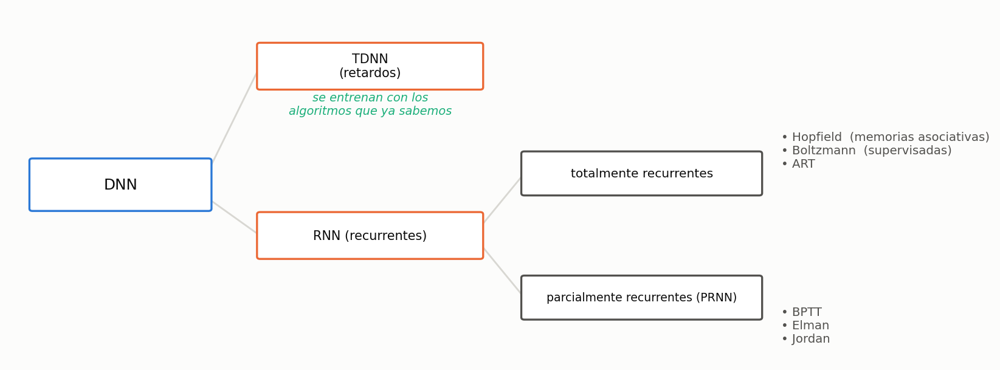
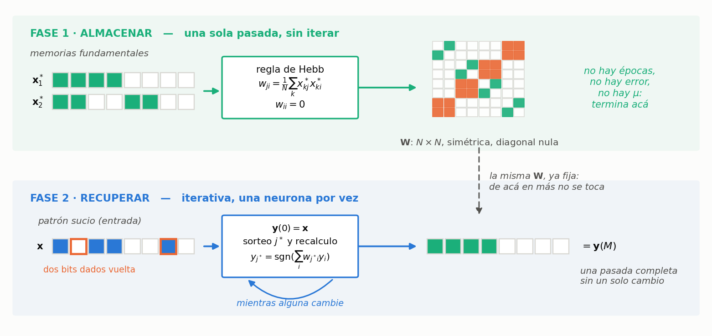
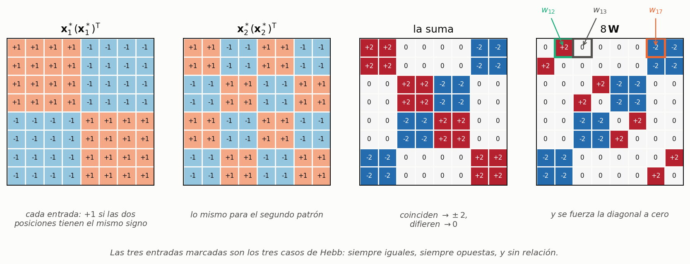
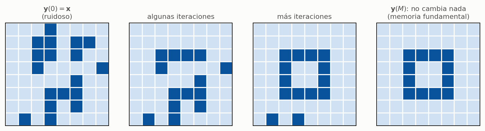
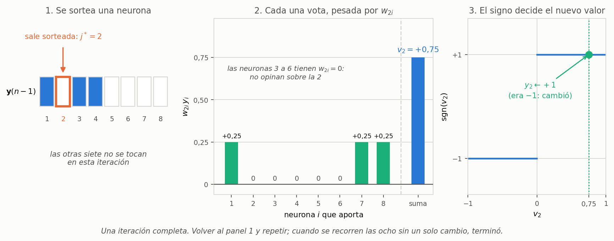
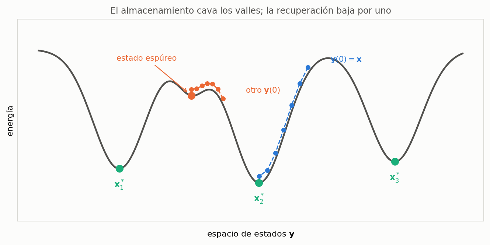
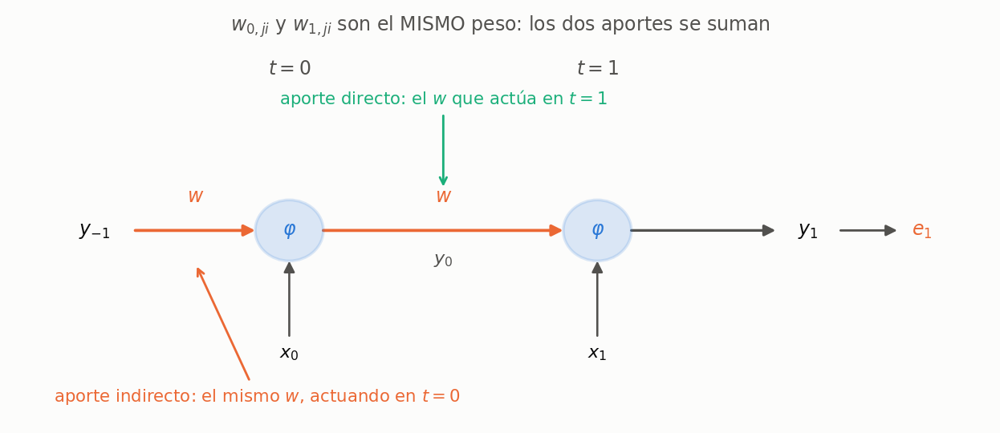
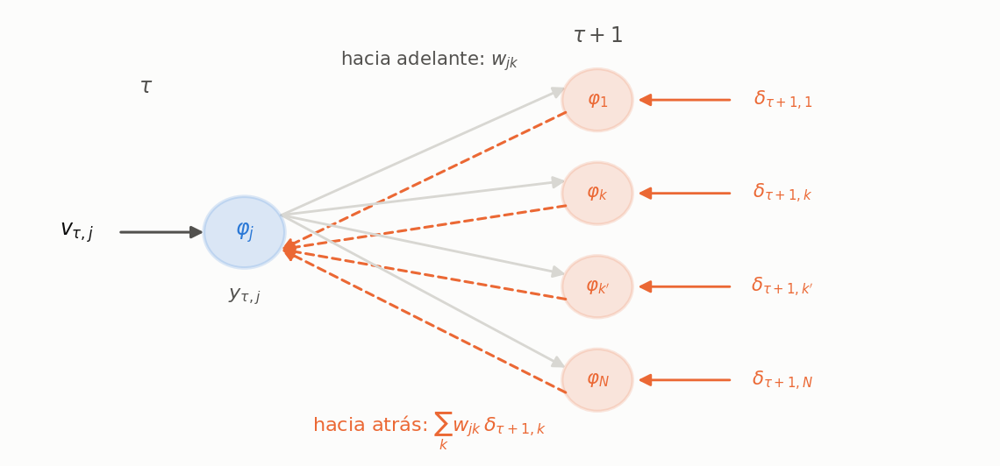
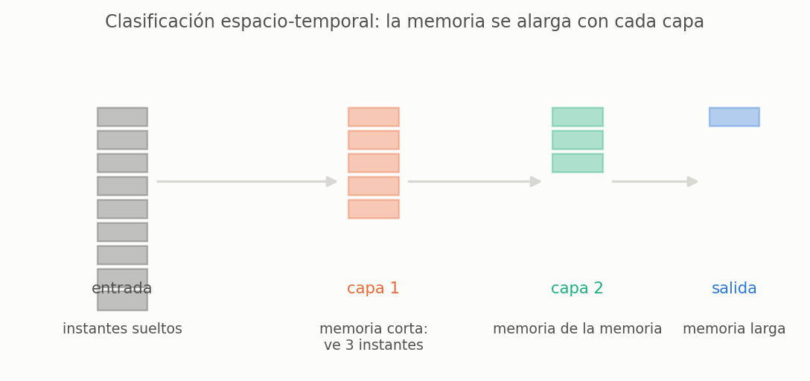
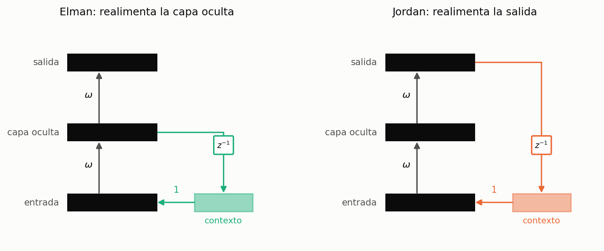

*Notación: $n$ y $t$ son el tiempo **discreto** (no se usa $t$ para tiempo continuo acá). En las diapositivas de la introducción, el subíndice indica el retardo: $\mathbf{y}_1(n)$ significa $\mathbf{y}(n-1)$. En las notas de BPTT el tiempo va como primer subíndice: $y_{t,j}$ es la salida de la neurona $j$ en el instante $t$.*

*Las figuras 1, 6, 10 y 12 reconstruyen diapositivas que en el PDF están vacías o son ilegibles: el profesor las dibujaba en el pizarrón.*

---

## 1. Por qué dinámicas

Todo lo que vimos hasta acá es **estático**: entra un patrón, sale una salida, se acabó. Si el problema tiene historia —predecir la temperatura de mañana, reconocer una palabra hablada— eso no alcanza. Hay tres formas de meterle tiempo a una red, y sólo la tercera la vuelve dinámica de verdad.


**Aproximación 1 — entradas desplazadas.** $y(n) = f(\mathbf{x}(n))$, donde $\mathbf{x}(n)$ se agranda para incluir $\mathbf{x}(n-1)$, $\mathbf{x}(n-2)$, … Si medías temperatura, humedad y viento (3 entradas) y expandís 5 instantes hacia atrás, la red pasa a tener $6 \times 3 = 18$ entradas.

**Aproximación 2 — realimentación de las salidas.** $y(n) = f(\mathbf{x}(n), \mathbf{y}_1(n))$. Vuelven las **salidas** de instantes anteriores. Tiene que ser $\mathbf{y}(n-1)$ como mínimo: la salida actual todavía no está calculada.

**Aproximación 3 — realimentación de estados internos.** $y(n) = f(\mathbf{x}(n), \mathbf{z}_1(n))$. Vuelven las salidas de las **neuronas ocultas**.

**Caso general:** $y(n) = f(\mathbf{x}(n), \mathbf{z}_1(n), \mathbf{y}_1(n))$ — las tres cosas a la vez.

> **IDEA DE FONDO — sólo la tercera cambia la red**
> En las aproximaciones 1 y 2 la red **sigue siendo estática**: la misma que ya sabés entrenar, sólo que con más entradas. Entra un patrón, sale una salida, sin ninguna dinámica interna. La memoria está afuera, en cómo armaste el vector de entrada. En la 3 la red guarda estado propio, y ahí sí empieza a comportarse dinámicamente. Es la distinción que más se pregunta de esta introducción.

### Claves de la sección 1

| Clave | Qué tenés que poder responder |
|---|---|
| Las tres aproximaciones | Entradas retardadas / salidas realimentadas / estados internos |
| $\mathbf{y}_1(n)$ | Es $\mathbf{y}(n-1)$: el subíndice es el retardo |
| Estático vs. dinámico | Las dos primeras no cambian la red; la tercera sí |

---

## 2. Clasificación



Las **TDNN** son las de la aproximación 1 generalizada, y tienen una propiedad muy práctica: se siguen entrenando con back-propagation, tal cual. Las **recurrentes** permiten conexiones hacia atrás —de una neurona a sí misma, a otras de la misma capa, o a capas anteriores— y ahí hay que inventar algo nuevo.

**Ese "algo nuevo" se bifurca en dos caminos, y son las dos mitades de este apunte:** las **redes de Hopfield** (§3 a §6), que esquivan el problema no usando gradiente en absoluto, y **BPTT** (§7 a §11), que lo enfrenta desenrollando la red en el tiempo para poder derivarla. Van primero las de Hopfield porque son las más simples de las dos.

### Claves de la sección 2

| Clave | Qué tenés que poder responder |
|---|---|
| TDNN | Aproximación 1 generalizada; se entrena con BP común |
| Recurrentes | Permiten conexiones hacia atrás; hace falta un método nuevo |
| Las dos ramas | Hopfield (sin gradiente) y BPTT (con gradiente, desenrollando) |

---

## 3. Redes de Hopfield: arquitectura y modelo


Tantas neuronas como entradas y como salidas, **una sola capa**, y cada neurona realimenta a **todas las demás** a través de un retardo.

$$y_j(n) = \operatorname{sgn}\!\left( \sum_{i=1}^{N} w_{ji}\, y_i(n-1) - \theta_j \right)
\qquad
\operatorname{sgn}(x) = \begin{cases} +1 & x > 0 \\ y_j(n-1) & x = 0 \\ -1 & x < 0 \end{cases}$$

con dos restricciones sobre los pesos:

$$w_{ji} = w_{ij}\ \ \forall\, i \neq j \qquad\qquad w_{ii} = 0\ \ \forall\, i$$

> **OJO — el caso $x = 0$ no es el de siempre**
> En el perceptrón, $\operatorname{sgn}(0)$ era $+1$ por convención. Acá vale $y_j(n-1)$: **la neurona se queda como estaba**. Tiene sentido en una red dinámica —si el estímulo neto es nulo, no hay razón para cambiar de estado— y es exactamente el tipo de detalle que se pregunta.

> **OJO — $w_{ii}=0$ no se entrena, se impone**
> No es que quede en cero: se fuerza en cero y no se toca nunca. Una neurona no se realimenta a sí misma. Y la simetría tampoco es un resultado: es una condición de diseño, y es la que hace que exista la función de energía de la sección 6.

**Generalidades** (diapositivas 14 a 16):

- Cada neurona tiene un **disparo probabilístico**: en cada paso se sortea cuál se actualiza.
- **Conexiones simétricas**.
- El entrenamiento es **no supervisado**: no hay salida deseada en ningún momento.
- Puede usarse como **memoria asociativa**: se accede **por contenido**, no por dirección. Le das una foto con ruido y te devuelve la que tenía guardada.

### El algoritmo completo, de punta a punta

Antes de meterse en las cuentas conviene tener el mapa. Una red de Hopfield se usa en **dos fases separadas**, y son el contenido de las secciones 4, 5 y 6:



| | **Fase 1 — Almacenamiento** (§4) | **Fase 2 — Recuperación** (§5) |
|---|---|---|
| Cuándo | una sola vez, al principio | cada vez que querés consultar la memoria |
| Qué le das | los $P$ patrones limpios $\mathbf{x}^*_k$ | un patrón sucio $\mathbf{x}$ |
| Qué hace | calcula $\mathbf{W}$ con la regla de Hebb | itera actualizando neuronas de a una |
| Iterativo | **no** — una cuenta y listo | **sí** — hasta que nada cambie |
| Qué devuelve | la matriz $\mathbf{W}$ | el patrón limpio $\mathbf{y}(M)$ |

Escrito como receta:

> **FASE 1 — Almacenamiento (una pasada)**
>
> 1. Elegís los $P$ patrones que querés guardar (las *memorias fundamentales*), cada uno un vector de $\pm1$ de largo $N$.
> 2. Calculás cada peso con $w_{ji} = \frac{1}{N}\sum_k x^*_{kj}x^*_{ki}$.
> 3. Forzás $w_{ii}=0$. Terminó el entrenamiento — no hay épocas, no hay error, no hay $\mu$.
>
> **FASE 2 — Recuperación (iterativa)**
>
> 4. Ponés el patrón sucio como estado inicial: $\mathbf{y}(0)=\mathbf{x}$.
> 5. Sorteás una neurona $j^*$ y recalculás sólo su salida con $\operatorname{sgn}$ de lo que le entra del resto.
> 6. Repetís 5 hasta recorrer las $N$ neuronas sin que ninguna cambie.
> 7. Ese estado final es la respuesta. Con suerte es la memoria fundamental más parecida al patrón sucio; si no, es un **estado espúreo** (§6).

> **PARA LA DEFENSA — si lo que tenés que hacer es exponer el tema**
> Las secciones 4, 5 y 6 van por partes porque explican **por qué** funciona cada pieza. Para desarrollarlo **de corrido** —arrancando por la ecuación de la neurona, abriendo qué significa cada símbolo y sobre una retina de $2\times2$ que entra en un renglón— está la sección **Hopfield de corrido**, al final del bloque, con el reparto de los quince minutos.

> **IDEA DE FONDO — por qué esto se llama "memoria"**
> La fase 1 *escribe* en la memoria y la fase 2 *lee*. Pero lo que se guarda no está en ninguna posición: está repartido en toda la matriz $\mathbf{W}$, como relaciones entre pares de neuronas. Por eso se lee **por contenido** —le das un pedazo del dato y la red completa el resto— y no por dirección.

### Claves de la sección 3

| Clave | Qué tenés que poder responder |
|---|---|
| Arquitectura | Una capa, $N$ neuronas, todas contra todas, con retardo |
| $\operatorname{sgn}(0)$ | Vale $y_j(n-1)$: la neurona se queda como estaba |
| Las dos restricciones | $w_{ji}=w_{ij}$ y $w_{ii}=0$; se **imponen**, no se aprenden |
| Las dos fases | Almacenamiento directo y recuperación iterativa |

---

## 4. Almacenamiento: aprendizaje hebbiano

*Fase 1 del algoritmo: acá se calcula $\mathbf{W}$ y con eso el entrenamiento termina.*

Dado un conjunto de **memorias fundamentales** (o datos limpios) $X^* = \{\mathbf{x}^*_k \in \mathbb{R}^N\}$, con $P$ patrones:

$$w_{ji} = \frac{1}{N} \sum_{k=1}^{P} x^*_{kj}\, x^*_{ki}$$

Cada peso es (casi) un promedio del **producto** de dos componentes a lo largo de todos los patrones. Hay tres casos, y conviene tenerlos dibujados:


| Cómo se comportan $i$ y $j$ | Cada producto | La suma | $w_{ji}$ |
|---|---|---|---|
| Siempre iguales ($+,+$ o $-,-$) | siempre $+1$ | se acumula | grande y **positivo** |
| Siempre opuestas | siempre $-1$ | se acumula | grande y **negativo** |
| Sin relación | mitad $+1$, mitad $-1$ | se cancela | $\approx 0$ |

> **IDEA DE FONDO — qué guarda realmente la red**
> No guarda los patrones: guarda **qué relación hay entre cada par de posiciones**. Que dos píxeles se prendan siempre juntos, o siempre al revés, o que no tengan nada que ver. Ésa es la regla de Hebb: los pesos crecen entre neuronas que se activan juntas, sin ninguna corrección de error de por medio.

> **OJO — se divide por $N$, no por $P$**
> $N$ es la **dimensión** (la cantidad de neuronas); $P$ es la cantidad de patrones, y es sobre lo que corre la sumatoria. Es fácil cruzarlos porque intuitivamente uno promediaría sobre los patrones.

**Observaciones** (diapositivas 20 a 22):

- El entrenamiento **NO es iterativo**. Se muestran los patrones una vez, se hace la cuenta y listo. Se sabe de antemano cuánto va a tardar.
- $w_{ji}$ es mayor cuando las neuronas $i$ y $j$ se tienen que activar juntas.
- La capacidad está limitada a $$P_{\max} = \frac{N}{2\ln(N)}$$ con un 1 % de error.

> **PARA LA DEFENSA — la capacidad es chiquísima, y conviene decir el número**
> Con $N = 100$ neuronas, $P_{\max} = 100 / (2 \ln 100) \approx 10.9$: **once** memorias fundamentales. Una imagen de $100\times100$ píxeles necesita $N = 10\,000$ neuronas y guarda unas 543. Que el límite crezca **más lento que $N$** es el gran problema práctico de estas redes.

### Un ejemplo a mano: guardar dos patrones

Con $N=8$ neuronas y dos memorias fundamentales. Las elijo **ortogonales** ($\mathbf{x}^*_1 \cdot \mathbf{x}^*_2 = 0$), que es el caso favorable:

$$\mathbf{x}^*_1 = (+1,+1,+1,+1,-1,-1,-1,-1)^{\mathsf{T}} \qquad
\mathbf{x}^*_2 = (+1,+1,-1,-1,+1,+1,-1,-1)^{\mathsf{T}}$$

#### Paso 1 — qué pide la fórmula, entrada por entrada

La fórmula $w_{ji} = \frac{1}{N}\sum_{k=1}^{P} x^*_{kj}\,x^*_{ki}$ dice, para el peso entre la neurona $j$ y la neurona $i$: *andá a la posición $j$ y a la posición $i$ de cada patrón, multiplicá esos dos números, sumá sobre los patrones y dividí por $N$*. Nada más. Con $N=8$ y $P=2$:

$$w_{ji} = \frac{1}{8}\left( x^*_{1j}x^*_{1i} + x^*_{2j}x^*_{2i} \right)$$

Conviene tener los dos patrones escritos con la posición arriba:

| posición $i$ | 1 | 2 | 3 | 4 | 5 | 6 | 7 | 8 |
|---|---|---|---|---|---|---|---|---|
| $\mathbf{x}^*_1$ | $+1$ | $+1$ | $+1$ | $+1$ | $-1$ | $-1$ | $-1$ | $-1$ |
| $\mathbf{x}^*_2$ | $+1$ | $+1$ | $-1$ | $-1$ | $+1$ | $+1$ | $-1$ | $-1$ |

Y ahora las cuentas de tres entradas, una por cada caso de Hebb:

$$w_{12} = \tfrac{1}{8}\big(\underbrace{(+1)(+1)}_{\text{de }\mathbf{x}^*_1} + \underbrace{(+1)(+1)}_{\text{de }\mathbf{x}^*_2}\big) = \tfrac{1}{8}(1+1) = \tfrac{2}{8}$$

$$w_{17} = \tfrac{1}{8}\big((+1)(-1) + (+1)(-1)\big) = \tfrac{1}{8}(-1-1) = -\tfrac{2}{8}$$

$$w_{13} = \tfrac{1}{8}\big(\underbrace{(+1)(+1)}_{=\,+1} + \underbrace{(+1)(-1)}_{=\,-1}\big) = \tfrac{1}{8}(1-1) = 0$$

Las tres cuentas son el mismo par de multiplicaciones; lo único que cambia es si los dos productos se suman o se cancelan. Repitiendo esto para los $8\times 8$ pares se arma la matriz entera, y después se fuerza $w_{ii}=0$ (la restricción de la arquitectura: nadie se realimenta a sí mismo).

#### Paso 2 — el atajo: la misma cuenta como productos externos



Hacer 64 cuentitas a mano es tedioso y no hace falta. Fijate que "multiplicar la componente $j$ por la componente $i$, para todos los pares" es exactamente el **producto externo** $\mathbf{x}^*_k(\mathbf{x}^*_k)^{\mathsf{T}}$: una matriz de $8\times 8$ donde la entrada $(j,i)$ es $x^*_{kj}x^*_{ki}$. Entonces la sumatoria sobre $k$ es una suma de matrices:

$$\mathbf{W} = \frac{1}{N}\sum_{k=1}^{P} \mathbf{x}^*_k (\mathbf{x}^*_k)^{\mathsf{T}} \;-\; \text{(diagonal a cero)}$$

que es la misma fórmula de recién, escrita de una. Cada producto externo se llena a ojo: donde las dos posiciones tienen el mismo signo va $+1$, donde tienen signo distinto va $-1$.

$$\mathbf{x}^*_1(\mathbf{x}^*_1)^{\mathsf{T}} = \begin{pmatrix}
+ & + & + & + & - & - & - & - \\
+ & + & + & + & - & - & - & - \\
+ & + & + & + & - & - & - & - \\
+ & + & + & + & - & - & - & - \\
- & - & - & - & + & + & + & + \\
- & - & - & - & + & + & + & + \\
- & - & - & - & + & + & + & + \\
- & - & - & - & + & + & + & +
\end{pmatrix}
\qquad
\mathbf{x}^*_2(\mathbf{x}^*_2)^{\mathsf{T}} = \begin{pmatrix}
+ & + & - & - & + & + & - & - \\
+ & + & - & - & + & + & - & - \\
- & - & + & + & - & - & + & + \\
- & - & + & + & - & - & + & + \\
+ & + & - & - & + & + & - & - \\
+ & + & - & - & + & + & - & - \\
- & - & + & + & - & - & + & + \\
- & - & + & + & - & - & + & +
\end{pmatrix}$$

*(escribí $+$ y $-$ por $+1$ y $-1$ para que se vea el patrón de bloques)*

#### Paso 3 — sumar las dos y borrar la diagonal

Sumando entrada a entrada: donde las dos matrices coinciden queda $\pm 2$, donde difieren queda $0$. Después se pone la diagonal en cero. Mostrando $8\,\mathbf{W}$ para no arrastrar fracciones:

$$8\,\mathbf{W} = \begin{pmatrix}
0 & 2 & 0 & 0 & 0 & 0 & -2 & -2 \\
2 & 0 & 0 & 0 & 0 & 0 & -2 & -2 \\
0 & 0 & 0 & 2 & -2 & -2 & 0 & 0 \\
0 & 0 & 2 & 0 & -2 & -2 & 0 & 0 \\
0 & 0 & -2 & -2 & 0 & 2 & 0 & 0 \\
0 & 0 & -2 & -2 & 2 & 0 & 0 & 0 \\
-2 & -2 & 0 & 0 & 0 & 0 & 0 & 2 \\
-2 & -2 & 0 & 0 & 0 & 0 & 2 & 0
\end{pmatrix}$$

Cuatro cosas para leer de esa matriz:

- Es **simétrica** y tiene la **diagonal nula**, como tenía que ser.
- Las posiciones 1 y 2 valen lo mismo en los dos patrones: $w_{12} = +2/8$, grande y positivo.
- Las posiciones 1 y 7 son opuestas en los dos: $w_{17} = -2/8$, grande y negativo.
- Las posiciones 1 y 3 coinciden en $\mathbf{x}^*_1$ y se oponen en $\mathbf{x}^*_2$: los productos se cancelan y $w_{13} = 0$. **Ese cero es el tercer caso de Hebb, y es visible en la cuenta.**

> **OJO — dos patrones en ocho neuronas ya es mucho**
> $P_{\max} = 8/(2\ln 8) = 1{,}92$. Guardar dos ya está sobre el límite. Funciona igual **porque los elegí ortogonales**: la cota vale para patrones al azar. Si hubiera tomado dos parecidos, la recuperación fallaría — y eso es exactamente lo que produce los estados espúreos.

### Para la pizarra: armar la matriz de pesos

**Te preguntan:** *"Almacená estos patrones en una red de Hopfield."*

**Antes de escribir una sola cuenta, dibujás la tabla** con los patrones en **filas** y las posiciones numeradas **arriba**. Todo el ejercicio se resuelve leyendo columnas de esa tabla, y sin ella te vas a perder.

**Paso 1.** Fijás el tamaño de la red y lo decís en voz alta: *"cada patrón tiene $N$ componentes, así que hay $N$ neuronas y $\mathbf{W}$ es de $N\times N$"*.

> **Trampa:** entregar una matriz de $P\times P$. Los índices $j$ e $i$ son **neuronas** (posiciones del vector), no patrones. Si te dan 3 patrones de 6 bits, la matriz es de $6\times 6$ con 3 términos por suma, no de $3\times3$.

**Paso 2.** Escribís la fórmula y **señalás qué índice corre**.

> **Llegás a:** $\;w_{ji} = \dfrac{1}{N}\sum_{k=1}^{P} x^*_{kj}\,x^*_{ki}$
> **La frase:** *"$j$ e $i$ eligen el cable y están fijos; el que corre es $k$, que recorre los patrones."*

**Paso 3.** Para un par $(j,i)$, tapás todo menos **las dos columnas** $j$ e $i$ y bajás fila por fila multiplicando. Como cada producto de $\pm1$ da $\pm1$, la suma es una cuenta de votos:

> **Llegás a:** $\;w_{ji} = \dfrac{(\#\text{ patrones donde coinciden}) - (\#\text{ patrones donde difieren})}{N}$
> **Decilo así y ganás tiempo:** en vez de multiplicar $P$ veces, contás coincidencias y restás. Es la misma cuenta, tres veces más rápida en el pizarrón.

**Paso 4.** Calculás **sólo la mitad de arriba** de la matriz y completás por reflejo.

> **La frase:** *"$w_{ji} = w_{ij}$ sale gratis, porque es el mismo par de columnas y el producto no distingue el orden. Cables reales hay $N(N-1)/2$, no $N^2$."*

**Paso 5.** Escribís ceros en la diagonal, y **aclarás que es a mano**.

> **Llegás a:** $\;w_{jj} = 0$
> **La frase:** *"Hebb sola daría $w_{jj} = P/N$, porque la columna de una neurona está perfectamente correlacionada consigo misma. Sería el peso más grande de su fila, la neurona se haría caso a sí misma y quedaría clavada. Se calcula y se tira."*
> **Ojo con la asimetría de las dos condiciones:** la simetría **se verifica**, la diagonal **se fuerza**. Es una pregunta de seguimiento clásica.

**Paso 6 (el remate).** Leés la matriz en voz alta señalando los tres casos, uno por uno:

> $w_{ji} > 0$ → *"en los patrones guardados estas dos neuronas tienden a coincidir"*.
> $w_{ji} < 0$ → *"tienden a oponerse"*.
> $w_{ji} = 0$ → *"no hay relación estable entre ellas, los votos se cancelaron"*. **Marcá alguno de los ceros y decí que no es un error de cuenta, es información.**

**Y cerrás con la frase que ordena todo el método:** *"la matriz no contiene ningún patrón escrito en ninguna parte; sólo guarda relaciones entre pares de posiciones."*

### Claves de la sección 4

| Clave | Qué tenés que poder responder |
|---|---|
| La regla | $w_{ji} = \frac{1}{N}\sum_{k=1}^{P} x^*_{kj}x^*_{ki}$, y de dónde sale cada entrada |
| Los tres casos | Iguales / opuestas / sin relación, y qué $w_{ji}$ da cada uno |
| $N$ vs. $P$ | Se divide por la dimensión; la suma corre sobre los patrones |
| No iterativo | Una pasada, tiempo conocido de antemano |
| Capacidad | $P_{\max} = N/(2\ln N)$, y por qué es un problema |
| Tamaño de $\mathbf{W}$ | Que es $N\times N$ y nunca $P\times P$: los índices son neuronas |
| Las dos condiciones | La simetría se verifica sola; la diagonal se fuerza a mano |

### Con esto termina la fase 1 — qué falta

Ya tenemos $\mathbf{W}$: una matriz de $8\times 8$ que no contiene ninguno de los dos patrones escrito en ningún lado, sino sólo las relaciones entre pares de posiciones. La pregunta obvia es **cómo se recupera un patrón de ahí adentro**, y ésa es toda la fase 2.

La respuesta corta: se pone el patrón sucio como estado inicial de la red y **se la deja funcionar**. La ecuación que hace falta ya la tenemos escrita desde la sección 3 —$y_j(n)=\operatorname{sgn}(\sum_i w_{ji}y_i(n-1))$, el modelo de la neurona—, sólo que ahora los $w_{ji}$ ya no son un símbolo: son los números que acabamos de calcular. **Almacenar era llenar la fórmula; recuperar es hacerla correr.**

---

## 5. Recuperación

*Fase 2 del algoritmo: la $\mathbf{W}$ de la sección 4 ya está fija y no se toca más. Lo único que cambia de acá en adelante es el **estado** $\mathbf{y}(n)$, y cambia de a una neurona por vez.*

Dado un patrón $\mathbf{x}$ (incompleto, ruidoso…) se **fuerza** la salida inicial:

$$\mathbf{y}(0) = \mathbf{x}$$

y después se itera:

1. $j^* = \operatorname{rnd}(N)$ — se elige una neurona **al azar**;
2. $y_{j^*}(n) = \operatorname{sgn}\!\left( \sum_{i=1}^{N} w_{ji}\, y_i(n-1) \right)$;
3. volver a 1 hasta no observar cambios en las $y_j$.



Vale la pena abrir **una sola** de esas iteraciones, porque el paso 2 es toda la red funcionando:



La lectura importante del panel del medio: **el peso es cuánto vale el voto**. Un $w_{2i}$ grande y positivo dice "esta neurona y la 2 tienen que coincidir"; uno grande y negativo, "tienen que oponerse"; uno nulo, "no tengo opinión". Recuperar es hacer que gane la mayoría ponderada — y esa mayoría, si no se pasó la capacidad, es la memoria fundamental más parecida.

**Observaciones** (diapositivas 25 a 28):

- El proceso de recuperación **SÍ es iterativo** (dinámico).
- En general **no se usan los $\theta_j$** — por eso desaparecen de la fórmula del paso 2.
- La salida final es $\mathbf{y}(M)$ cuando no hay cambios al **recorrer todas** las salidas.
- Se pueden obtener **estados espúreos y oscilaciones**.

> **IDEA DE FONDO — Hopfield es el espejo de todo lo anterior**
> En el perceptrón y el multicapa: entrenamiento **iterativo**, uso **directo**. En Hopfield: entrenamiento **directo**, uso **iterativo**. Está dado vuelta, y es la mejor forma de recordarlo.

> **OJO — el criterio de parada es una pasada completa, no una neurona**
> No alcanza con que la neurona que tocó no cambie. Hay que recorrer **todas** sin que ninguna cambie: recién ahí nada puede moverse en el futuro, porque a cada neurona le entra lo mismo que antes. Cuánto tarda no se sabe: pueden ser tres iteraciones o quinientas.

### El mismo ejemplo, recuperando

Le doy $\mathbf{x}^*_1$ con **dos bits dados vuelta** (las posiciones 2 y 7), o sea un 25 % de ruido, y dejo correr el algoritmo. Con la semilla que usé, el sorteo de neuronas dio 7, 1, 2, 2, 2, 7, …

| Paso | $j^*$ | $v_{j^*} = \sum_i w_{ji} y_i$ | $y_{j^*}$ nuevo | Estado | ¿Cambió? |
|:---:|:---:|:---:|:---:|---|:---:|
| — | — | — | — | $(+\,-\,+\,+\,-\,-\,+\,-)$ | — |
| 1 | 7 | $-0{,}25$ | $-1$ | $(+\,-\,+\,+\,-\,-\,-\,-)$ | **sí** |
| 2 | 1 | $+0{,}25$ | $+1$ | sin cambios | no |
| 3 | 2 | $+0{,}75$ | $+1$ | $(+\,+\,+\,+\,-\,-\,-\,-)$ | **sí** |
| 4–11 | varias | — | — | sin cambios | no |

En el paso 11 ya se recorrieron las ocho neuronas sin un solo cambio: **convergió**, y el resultado es exactamente $\mathbf{x}^*_1$.

Fijate el paso 3: $v_2 = +0{,}75$ es la suma de lo que "opinan" las otras siete neuronas sobre cuánto debería valer la 2. Como la mayoría del resto quedó consistente con $\mathbf{x}^*_1$, la arrastran al valor correcto. Ése es todo el mecanismo de la memoria asociativa.

### Para la pizarra: recuperar un patrón sucio

**Te preguntan:** *"Con esa $\mathbf{W}$, recuperá este patrón con ruido."*

**Arrancás dibujando la tabla de iteraciones vacía**, con estas columnas: **Paso · $j^*$ · $v_{j^*}$ · $y_{j^*}$ nuevo · estado · ¿cambió?**. Es el andamio del ejercicio: si lo armás primero, la cuenta se llena sola.

**Paso 1.** Escribís el estado inicial y **usás el verbo correcto**.

> **Llegás a:** $\;\mathbf{y}(0) = \mathbf{x}$
> **La frase:** *"el patrón sucio se **fuerza** como estado inicial"* — no se "presenta a la entrada", porque esta red no tiene entrada: tiene estado.

**Paso 2.** Sorteás $j^*$ y lo decís.

> **La frase:** *"la neurona se elige al azar, $j^* = \operatorname{rnd}(N)$"*. Si por comodidad las vas a recorrer en orden en el pizarrón, **aclaralo**: *"las recorro en orden para que se siga la cuenta, pero el algoritmo las sortea"*.

**Paso 3.** Calculás $v_{j^*}$ recorriendo **la fila $j^*$** de la matriz, y salteás los ceros.

> **Llegás a:** $\;v_{j^*} = \sum_{i} w_{j^*i}\,y_i$
> **Trampa:** incluir el término $i = j^*$. No existe, $w_{jj}=0$.
> **Atajo de pizarrón:** sólo aportan las $i$ con $w_{j^*i} \neq 0$. Si la fila tiene muchos ceros, la cuenta son dos o tres términos.

**Paso 4.** Aplicás el signo y actualizás **una sola** posición del estado.

> **Llegás a:** $\;y_{j^*} = \operatorname{sgn}(v_{j^*})$, y en la columna «estado» copiás el anterior **cambiando sólo ese lugar**.
> **Trampa grave:** recalcular todas las neuronas con el estado viejo y actualizarlas juntas. Ése es el modo **sincrónico**, y puede oscilar con período 2. El algoritmo es **asincrónico**: de a una, y la siguiente ya usa el valor nuevo.
> **Trampa de empate:** si $v_{j^*} = 0$, **no** pongas $+1$: en la convención de la cátedra la neurona se queda como estaba, $y_{j^*}(n) = y_{j^*}(n-1)$ (ver la tabla de errores típicos). Decilo antes de que te lo pregunten.

**Paso 5.** Repetís hasta parar, y **enunciás bien el criterio**.

> **La frase:** *"se termina cuando se recorren las $N$ neuronas sin que ninguna cambie"*.
> **Trampa:** decir "cuando la neurona que toqué no cambió". No alcanza. Recién con una pasada completa sin cambios sabés que nada puede moverse en el futuro, porque a cada neurona le entra lo mismo que antes. **Y cuánto tarda no se sabe de antemano** — eso también conviene decirlo.

**Paso 6 (el remate).** Volvés sobre **un** paso en el que la neurona se dio vuelta y lo leés como una votación:

> **La frase:** *"$v_{j^*}$ es la suma de lo que opinan las otras neuronas sobre cuánto debería valer ésta, y cada opinión pesa lo que dice su cable. Como la mayoría del resto quedó consistente con la memoria, la arrastran al valor correcto. Ése es todo el mecanismo de la memoria asociativa."*

**Si te preguntan por la diferencia con todo lo anterior, ésta es la respuesta de una línea:** *"el multicapa entrena iterando y se usa de una; Hopfield entrena de una y se usa iterando. Está dado vuelta."*

### Claves de la sección 5

| Clave | Qué tenés que poder responder |
|---|---|
| Inicialización | $\mathbf{y}(0)=\mathbf{x}$: el patrón sucio se **fuerza** como estado |
| Los tres pasos | Sortear $j^*$, recalcular con $\operatorname{sgn}$, repetir |
| De a una | Se actualiza **una** neurona por iteración, no todas |
| Criterio de parada | Una pasada completa por las $N$ sin cambios |
| El espejo | Hopfield entrena directo y usa iterativo; el multicapa al revés |

### Qué falta todavía

Con el ejemplo salió bien, pero quedaron dos preguntas sin responder, y son las de la sección que sigue: **¿por qué tiene que frenar?** (nada de lo anterior garantiza que no oscile para siempre) y **¿por qué frena en el patrón correcto y no en cualquier otro estado?** Las dos se contestan con una sola herramienta: una función de energía que baja en cada paso.

---

## 6. Campos energéticos y estados espúreos



La forma de entender qué pasa: el almacenamiento **cava un paisaje** de picos y valles sobre el espacio de estados, y en el fondo de los valles quedan las memorias fundamentales. La recuperación arranca en el punto sucio $\mathbf{y}(0)=\mathbf{x}$ y **baja** por la ladera hasta el fondo del valle más cercano.

### La función de energía

La cátedra habla del campo energético pero no escribe la función. Es ésta:

$$E(\mathbf{y}) = -\frac{1}{2}\sum_{j}\sum_{i} w_{ji}\, y_j\, y_i$$

y con ella el "paisaje" deja de ser una metáfora: es una función concreta que le asigna un número a cada estado posible de la red. Leerla es fácil: si dos neuronas están en el estado que su peso "quiere" —las dos iguales y $w_{ji}>0$, o cruzadas y $w_{ji}<0$— ese término aporta **negativo** y baja la energía. Cada par contento baja $E$; cada par a disgusto la sube.

**Por qué el algoritmo de recuperación baja por el valle.** Cuando se actualiza una sola neurona $j$, sólo cambian los términos que la contienen. Llamando $v_j = \sum_i w_{ji} y_i$, ese aporte es $-y_j v_j$, y el cambio de energía al pasar de $y_j$ a $y_j^{\text{nuevo}}$ vale

$$\Delta E = -\left(y_j^{\text{nuevo}} - y_j\right) v_j$$

La regla es $y_j^{\text{nuevo}} = \operatorname{sgn}(v_j)$, así que $y_j^{\text{nuevo}}$ y $v_j$ **siempre tienen el mismo signo**. Si la neurona no cambia, $\Delta E = 0$. Si cambia, $(y_j^{\text{nuevo}} - y_j)$ tiene el signo de $v_j$ y el producto queda positivo, con lo cual $\Delta E < 0$.

$$\boxed{\;\Delta E \le 0 \text{ en todo paso}\;}$$

Como $E$ sólo puede tomar una cantidad **finita** de valores ($2^N$ estados) y nunca sube, no puede bajar para siempre: la red **tiene** que quedarse quieta. Eso es la convergencia.


En el ejemplo de las ocho neuronas: la energía arranca en $-1{,}0$, baja a $-1{,}5$ cuando se corrige $y_7$, baja a $-3{,}0$ cuando se corrige $y_2$, y ahí se queda. $-3{,}0$ es exactamente la energía de $\mathbf{x}^*_1$.

> **IDEA DE FONDO — acá se paga la simetría**
> La demostración de arriba usa que el aporte del par $(i,j)$ es **uno solo**, y eso vale porque $w_{ji}=w_{ij}$. Si los pesos no fueran simétricos, $E$ podría **subir**: lo verifiqué sobre 4000 configuraciones al azar — con $\mathbf{W}$ simétrica el mayor aumento observado fue exactamente $0$; con $\mathbf{W}$ asimétrica la energía llegó a subir $6{,}2$.
> Por eso $w_{ji}=w_{ij}$ no es un capricho: **es la condición que garantiza que la red converja**. Y $w_{ii}=0$ evita que una neurona se auto-refuerce y quede clavada por su propio peso.

### Estados espúreos y oscilaciones

Que la red converja no quiere decir que converja **a lo correcto**. El paisaje puede tener valles que nadie cavó a propósito:

- **Estados espúreos.** Mínimos locales que no corresponden a ninguna memoria almacenada. La red cae ahí y devuelve algo que se parece un poco a una memoria y un poco a otra, pero no es ninguna. Aparecen al pasarse de capacidad, o con memorias muy parecidas entre sí.
- **Oscilaciones.** La red queda dando vueltas entre dos estados y nunca se estabiliza: $+1, -1, +1, -1, \dots$

> **OJO — el negativo de una memoria también es un mínimo**
> $E(-\mathbf{y}) = E(\mathbf{y})$, porque la energía es cuadrática en $\mathbf{y}$. En el ejemplo: $E(-\mathbf{x}^*_1) = -3{,}0$, igual que $E(\mathbf{x}^*_1)$. O sea que **por cada memoria que guardás, guardás gratis su negativo**, y la red puede converger a él. Es el estado espúreo más fácil de nombrar si te lo preguntan.

### Qué tan chica es la capacidad

$$P_{\max} = \frac{N}{2\ln N}$$

| $N$ (neuronas) | $P_{\max}$ | Qué significa |
|---:|---:|---|
| 10 | 2,2 | dos memorias |
| 100 | 10,9 | once |
| 1 000 | 72,4 | setenta y dos |
| 10 000 | 543 | una imagen de $100\times100$ guarda 543 caras |

> **PARA LA DEFENSA — el número que hay que saber leer**
> $P_{\max}$ crece **más lento que $N$**: al pasar de 100 a 10 000 neuronas, las neuronas se multiplican por 100 y las memorias sólo por 50. Peor: los **pesos** crecen como $N^2$, así que con 10 000 neuronas tenés $10^8$ pesos para guardar 543 patrones. Es carísimo, y es la razón principal por la que Hopfield hoy no se usa como memoria en producción.

### Los tres finales posibles

| Final | Qué pasó | Por qué |
|---|---|---|
| La memoria correcta | cayó en el valle que corresponde | todo bien |
| Un **estado espúreo** | cayó en un mínimo local | pasado de capacidad, o memorias parecidas |
| **Oscilación** | no converge nunca | idem, o pesos no simétricos |

### Para la pizarra: por qué la red tiene que frenar

**Te preguntan:** *"Demostrá que el algoritmo de recuperación converge."*

**Arrancás anunciando la estrategia en una línea:** *"voy a construir una función que baje en cada paso y esté acotada por abajo; con eso la convergencia sale sola."*

**Paso 1.** Escribís la energía y aclarás de dónde viene el $-\tfrac12$.

> **Llegás a:** $\;E(\mathbf{y}) = -\dfrac{1}{2}\sum_{i \neq j} w_{ji}\,y_i\,y_j$
> **La frase:** *"cada par se cuenta dos veces en la doble suma, y el medio lo compensa; el menos es para que los estados cómodos tengan energía baja."*

**Paso 2.** Actualizás **una sola** neurona $j$ y observás qué términos se mueven.

> **La frase:** *"como sólo cambia $y_j$, los únicos términos que se mueven son los que la contienen, y su aporte total es $-y_j v_j$ con $v_j = \sum_i w_{ji}y_i$."*
> **Acá se usa la simetría, y hay que decirlo:** el par $(i,j)$ aporta **un solo** término porque $w_{ji} = w_{ij}$. Si los pesos no fueran simétricos aportaría dos distintos, la cuenta de abajo no cerraría y **la energía podría subir**.

**Paso 3.** Supuesto: la neurona **cambió**, o sea $y_j^{\text{nuevo}} = -y_j$.

> **Llegás a:** $\;\Delta E = -\big(y_j^{\text{nuevo}} - y_j\big)\,v_j = -(-2y_j)\,v_j = 2\,y_j\,v_j$

**Paso 4.** El argumento clave, y es una sola observación:

> **La frase:** *"si la neurona cambió, fue porque $\operatorname{sgn}(v_j) \neq y_j$; entonces $y_j$ y $v_j$ tienen signos distintos y su producto es negativo."*
> **Llegás a:** $\;\Delta E < 0$ si cambió, y $\Delta E = 0$ si no cambió.

**Paso 5 (el cierre).** Encajás las tres piezas y las contás con los dedos:

> **Llegás a:** $\;\boxed{\Delta E \le 0 \text{ en todo paso}}$
> **La frase:** *"la energía nunca sube, hay una cantidad **finita** de estados ($2^N$) y está acotada por abajo. No puede bajar para siempre: frena en una cantidad finita de pasos."*

**Paso 6 (lo que te van a preguntar después).** Tené preparadas estas tres:

> **¿Frena en el patrón correcto?** No necesariamente: frena en el **primer mínimo local** que encuentra. Si no te pasaste de capacidad, esos mínimos son las memorias; si te pasaste, son estados espúreos.
> **¿Son los patrones los mínimos globales?** No hace falta que lo sean. Lo que importa es que su cuenca de atracción sea ancha, no que sean el fondo absoluto.
> **¿Qué significa "mínimo local" acá?** No hay derivadas ni pendientes: el estado vive en los vértices de un hipercubo. Significa exactamente *"dar vuelta cualquiera de las $N$ neuronas, de a una, no baja la energía"*.

### Para la pizarra: desarrollar Hopfield de punta a punta

**Te preguntan:** *"Desarrollá el método de Hopfield."* Sin más datos. Es la consigna más abierta y la más fácil de desordenar, así que conviene tener un guión fijo. Siete movimientos, en este orden:

**1. Partís la pizarra en dos y titulás.** A la izquierda **«Fase 1 — almacenar»**, a la derecha **«Fase 2 — recuperar»**. Debajo del título de cada mitad, una línea: *almacenar es llenar la fórmula; recuperar es hacerla correr.* Con eso ya dijiste la estructura entera del método.

**2. Dibujás la arquitectura** antes de escribir cualquier fórmula: tres o cuatro neuronas, todas unidas con todas, sin flechas de dirección. Y decís las tres cosas que la definen: **una sola capa** que es entrada, proceso y salida al mismo tiempo; **$w_{ji} = w_{ij}$**; **$w_{jj} = 0$**. Aclarás que los umbrales $\theta_j$ en general no se usan.

**3. Escribís el modelo de la neurona**, que es lo único que la red sabe hacer:

> $v_j = \sum_i w_{ji}\,y_i$ &nbsp;y&nbsp; $y_j = \operatorname{sgn}(v_j)$ — *"una votación ponderada: el peso es cuánto vale el voto"*.

**4. Fase 1: Hebb.** La fórmula, los tres casos (coinciden / se oponen / se cancelan), y las dos frases que no hay que olvidar: **no es iterativo** (una pasada, tiempo conocido de antemano, no supervisado) y **la matriz no contiene los patrones**, sólo relaciones entre pares de posiciones. Si te dan números, acá va la tabla de patrones en filas del guión anterior.

**5. Fase 2: recuperar.** Los tres pasos numerados —forzar $\mathbf{y}(0)=\mathbf{x}$, sortear $j^*$, aplicar $\operatorname{sgn}$— y el criterio de parada enunciado como una pasada completa. Si hay números, la tabla de iteraciones.

**6. Por qué funciona.** La energía, $\Delta E \le 0$, y el cierre por finitud. Es el único momento de toda la exposición donde hay una demostración, así que es donde te van a mirar: tres líneas y el recuadro.

**7. El remate honesto.** Los tres finales posibles (memoria correcta, espúreo, oscilación), el negativo de cada memoria como espúreo inevitable porque $E(-\mathbf{y}) = E(\mathbf{y})$, y la capacidad $P_{\max} = N/(2\ln N)$ con el número dicho en voz alta. Cerrás con por qué hoy no se usa en producción: los pesos crecen como $N^2$ y las memorias más lento que $N$.

> **La regla de oro de esta exposición:** cada vez que escribas una fórmula, decí **qué índice corre**. En Hopfield casi todos los errores de pizarrón son confundir $N$ con $P$, o $k$ con $j$.

### Claves de la sección 6

| Clave | Qué tenés que poder responder |
|---|---|
| La energía | Que existe porque $\mathbf{W}$ es simétrica, y que nunca sube |
| Por qué converge | Baja y está acotada: no puede bajar para siempre |
| Estado espúreo | Un mínimo local que no es ninguna memoria fundamental |
| Los tres finales | Memoria correcta, espúreo, oscilación — y qué causa cada uno |

## Hopfield de corrido: cómo exponer el tema en quince minutos

*Las secciones 3 a 6 van por partes porque explican **por qué** funciona cada pieza. Esta sección hace lo otro: desarrolla el método **de corrido**, arrancando por la ecuación de la neurona y abriendo qué significa cada símbolo antes de usarlo. Todo sobre una retina de $2\times2$ — cuatro neuronas — para que cada cuenta entre en un renglón y se pueda hacer a mano en la pizarra.*

### El plan, si tenés 10 a 15 minutos

| Minutos | Paso | Qué queda escrito en la pizarra |
|---|---|---|
| 0–3 | 1 y 2: la ecuación, símbolo por símbolo | $y_j(n)=\operatorname{sgn}\!\big(\sum_i w_{ji}y_i(n-1)\big)$ y el diccionario |
| 3–5 | 3: cómo funciona, con números | La red de 4 neuronas y una votación resuelta |
| 5–6 | 4: las dos restricciones | $w_{ji}=w_{ij}$ y $w_{jj}=0$ |
| 6–7 | 5: recién acá, las dos fases | La pizarra partida en dos |
| 7–9 | 6: fase 1, Hebb | La tabla de patrones y tres pesos |
| 9–11 | 7 y 8: fase 2, iterar y parar | La tabla de iteraciones |
| 11–14 | 9: la energía y la convergencia | $E$, $\Delta E\le 0$ y el recuadro |
| 14–15 | Cierre: los tres finales y la capacidad | $P_{\max}=N/(2\ln N)$ |

> **OJO — el error de ritmo más común**
> Gastar ocho minutos calculando $\mathbf{W}$ entrada por entrada. **Calculás tres pesos, uno de cada caso, y decís «los demás salen igual»**: lo que se evalúa es que entiendas los tres casos, no que sepas multiplicar. El tiempo que ahorrás ahí va a la energía, que es la única parte con demostración.

### El diccionario de símbolos

Conviene dejarlo escrito en un costado de la pizarra desde el principio y no borrarlo: casi todas las repreguntas son sobre qué es cada letra.

| Símbolo | Qué es | Cuidado |
|---|---|---|
| $N$ | cantidad de **neuronas** = largo de cada patrón | es la **dimensión**, no la cantidad de patrones |
| $P$ | cantidad de **patrones** guardados | sólo aparece en la suma de Hebb, nunca en el tamaño de $\mathbf{W}$ |
| $j$, $i$ | **neuronas**: $j$ es la que estoy actualizando, $i$ cualquiera de las otras | son posiciones del vector, **no** patrones |
| $k$ | el **patrón** por el que va la suma de Hebb | es el único índice que recorre patrones |
| $n$ | el **paso de tiempo** discreto | cada paso toca **una sola** neurona |
| $y_j(n)$ | el valor de la neurona $j$ **ahora**: $+1$ o $-1$ | es el estado, lo único que se mueve en la fase 2 |
| $x^*_{kj}$ | el valor que tiene la neurona $j$ **en el patrón $k$** | es un dato fijo, no cambia nunca |
| $w_{ji}$ | el **peso** del cable entre las neuronas $j$ e $i$ | $\mathbf{W}$ es de $N\times N$, nunca de $P\times P$ |
| $v_j$ | el **campo local**: lo que le entra a la neurona $j$ | es un número real, no un $\pm1$ |
| $\theta_j$ | el umbral | **en general no se usa**, por eso desaparece |

---

### Paso 1 — Escribís la ecuación y la abrís símbolo por símbolo

**Lo primero que va a la pizarra es esto, antes que cualquier dibujo:**

$$y_j(n) = \operatorname{sgn}\!\left( \sum_{i=1}^{N} w_{ji}\, y_i(n-1) - \theta_j \right)$$

**Y ahora la leés de adentro hacia afuera, que es el orden en que se calcula.** Señalá cada pedazo con la mano mientras lo decís:

1. **$y_i(n-1)$** — *"el valor que tenían las otras neuronas en el paso anterior. Vale $+1$ o $-1$, nada más."*
2. **$w_{ji}$** — *"el peso del cable entre la neurona $j$ y la neurona $i$. Es un número real, y es lo único que la red 'sabe'."*
3. **$w_{ji}\,y_i(n-1)$** — *"el aporte de la neurona $i$: su valor, pesado por cuánto vale su opinión."*
4. **$\sum_{i=1}^{N}$** — *"se suman los aportes de **todas** las neuronas. Es una sola capa: no hay una capa anterior, están todas al mismo nivel."*
5. **$-\theta_j$** — *"el umbral, que **en general no se usa**; de acá en más lo dejo en cero y desaparece de la fórmula."*
6. **$\operatorname{sgn}(\cdot)$** — *"y de todo ese número real me quedo sólo con el signo, así que la salida vuelve a ser $+1$ o $-1$."*
7. **$y_j(n)$** — *"y eso es el nuevo valor de la neurona $j$."*

**Le ponés nombre a la suma, porque la vas a usar todo el tiempo:**

$$v_j = \sum_{i} w_{ji}\, y_i \qquad\Longrightarrow\qquad y_j = \operatorname{sgn}(v_j)$$

*"$v_j$ se llama **campo local**: es lo que le entra a la neurona $j$."*

> **OJO — el caso $\operatorname{sgn}(0)$, acá, no es el del perceptrón**
> $$\operatorname{sgn}(x) = \begin{cases} +1 & x > 0 \\ y_j(n-1) & x = 0 \\ -1 & x < 0 \end{cases}$$
> En el empate **la neurona se queda como estaba**. Tiene sentido: si el estímulo neto es nulo, no hay razón para cambiar de estado. Es exactamente el tipo de detalle que se pregunta.

### Paso 2 — Mostrás qué hace esa ecuación, con números

**Dibujás la red:** cuatro neuronas —una retina de $2\times2$— todas unidas con todas, sin capas y sin flechas de dirección. Numeradas $1$ y $2$ arriba, $3$ y $4$ abajo, y esa numeración no cambia nunca.

**Y resolvés una votación a mano.** Supongamos que ya tenemos los pesos y el estado actual es $\mathbf{y} = (+1,\,+1,\,+1,\,-1)$. Actualizamos la neurona 3:

$$v_3 = w_{31}y_1 + w_{32}y_2 + w_{34}y_4 = (-0{,}25)(+1) + (-0{,}25)(+1) + (+0{,}25)(-1) = -0{,}75$$

$$y_3 = \operatorname{sgn}(-0{,}75) = -1$$

**Lo que decís:** *"Es una **votación ponderada**. Cada neurona opina sobre cuánto debería valer la 3, y **el peso es cuánto vale el voto**: positivo significa 'tienen que coincidir', negativo 'tienen que oponerse', y cero 'no tengo opinión'. Gana la mayoría ponderada, y la neurona se acomoda."*

> **OJO — la suma no incluye a la propia neurona**
> En $v_3$ no aparece ningún término con $y_3$. Es por la segunda restricción, que viene en el paso siguiente.

### Paso 3 — Las dos restricciones sobre los pesos

$$w_{ji} = w_{ij}\ \ \forall\, i \neq j \qquad\qquad w_{jj} = 0$$

**Qué dice cada una, y por qué está:**

- **$w_{ji} = w_{ij}$ (simetría).** El cable entre dos neuronas es **uno solo**, y se usa en las dos direcciones. *"No es un resultado: es una condición de diseño, y es la que va a hacer que exista la función de energía del paso 9. Sin ella la red puede quedar oscilando para siempre."* **Anunciala acá**, así en el paso 9 sólo tenés que señalarla.
- **$w_{jj} = 0$ (diagonal nula).** *"Una neurona no se vota a sí misma. Si pudiera, se haría caso a sí misma por encima de todos los demás y quedaría clavada donde está, sorda al resto — cada estado sería un punto fijo y la red no haría nada."*

**Consecuencia de contabilidad que conviene decir:** $\mathbf{W}$ tiene $N^2$ casilleros, pero cables distintos hay $N(N-1)/2$. Con cuatro neuronas: **16 casilleros, 6 cables**, porque cuatro son la diagonal y los otros seis están repetidos por simetría.

### Paso 4 — Recién ahora: el método tiene dos fases

**Lo que decís:** *"Todo lo anterior supone que los pesos ya existen. La pregunta es de dónde salen, y ahí aparece la estructura del método: **dos fases que no se mezclan**."*

**Partís la pizarra en dos y escribís:**

| | **Fase 1 — Almacenamiento** | **Fase 2 — Recuperación** |
|---|---|---|
| Cuándo | una sola vez, al principio | cada vez que consultás la memoria |
| Qué le das | los $P$ patrones limpios | un patrón sucio |
| Qué hace | calcula $\mathbf{W}$ con Hebb | itera con la ecuación del paso 1 |
| Iterativo | **no** — una cuenta y listo | **sí** — hasta que nada cambie |

**La frase que ordena el resto de la exposición:** *"Almacenar es llenar la fórmula; recuperar es hacerla correr. Y cuando arranca la fase 2, $\mathbf{W}$ ya está fija y no se toca más."*

### Paso 5 — Fase 1: construís $\mathbf{W}$ con Hebb

**Escribís los patrones en filas, con las posiciones numeradas arriba.** Guardamos **uno** solo, la franja de arriba prendida:

$$\mathbf{x}^*_1 = (+1,\,+1,\,-1,\,-1)$$

**La fórmula, y la abrís igual que la primera:**

$$w_{ji} = \frac{1}{N}\sum_{k=1}^{P} x^*_{kj}\,x^*_{ki}$$

1. **$x^*_{kj}$** — *"el valor de la neurona $j$ en el patrón $k$."*
2. **$x^*_{kj}\,x^*_{ki}$** — *"el producto de lo que valen las neuronas $j$ e $i$ **en ese patrón**. Como son $\pm1$, da $+1$ si coinciden y $-1$ si se oponen."*
3. **$\sum_{k=1}^{P}$** — *"se suma sobre los **patrones**. Ojo: $j$ e $i$ eligen el cable y están fijos; el que corre es $k$."*
4. **$1/N$** — *"se divide por la **dimensión**, no por la cantidad de patrones. Es sólo escala: no cambia ningún signo, así que no cambia la dinámica."*

**Y decís qué mide el resultado:** *"$w_{ji}$ es, en el fondo, **coincidencias menos diferencias**: en cuántos patrones esas dos neuronas tuvieron el mismo valor, menos en cuántos tuvieron valores distintos, dividido $N$."*

**Calculás tres pesos y parás:**

| Peso | Qué pasa con ese par | Cuenta | Caso |
|---|---|---|---|
| $w_{12}$ | las neuronas 1 y 2 valen las dos $+1$ | $(+1)(+1)/4 = +0{,}25$ | **positivo**: que coincidan |
| $w_{13}$ | la 1 vale $+1$ y la 3 vale $-1$ | $(+1)(-1)/4 = -0{,}25$ | **negativo**: que se opongan |
| $w_{34}$ | las dos valen $-1$ | $(-1)(-1)/4 = +0{,}25$ | **positivo**: los dos apagados también cuenta |

$$\mathbf{W} = \begin{pmatrix} 0 & +0{,}25 & -0{,}25 & -0{,}25 \\ +0{,}25 & 0 & -0{,}25 & -0{,}25 \\ -0{,}25 & -0{,}25 & 0 & +0{,}25 \\ -0{,}25 & -0{,}25 & +0{,}25 & 0 \end{pmatrix}$$

**Las tres afirmaciones con las que cerrás la fase 1:**

- **No es iterativo.** Una pasada, se sabe de antemano cuánto tarda, no hay épocas, ni error, ni $\mu$. Es **no supervisado**: nunca hubo una salida deseada.
- **La simetría salió gratis** (el producto $x_j x_i$ no distingue el orden); **la diagonal se forzó a mano** (Hebb daría $w_{jj} = P/N$, porque cada término sería $x_{kj}^2 = +1$).
- **$\mathbf{W}$ no contiene el patrón escrito en ninguna parte.** Guarda relaciones entre pares de posiciones, no las posiciones.

> **OJO — el tercer caso de Hebb hay que provocarlo**
> Con un solo patrón no aparecen ceros. Si te preguntan por el caso $w_{ji}=0$, contalo así: *"con dos patrones donde ese par coincide en uno y se opone en el otro, los votos se cancelan y el peso da cero: esas dos neuronas no tienen relación estable, y la red no opina sobre ellas"*. Si querés mostrarlo con números sin pasarte de capacidad, subí a una retina de $3\times3$ ($N=9$, $P_{\max}=2{,}05$) y guardá dos patrones.

### Paso 6 — Fase 2: forzás el estado inicial

Le damos el patrón guardado **con un píxel mal**: el de abajo a la izquierda quedó prendido.

$$\mathbf{y}(0) = (+1,\,+1,\,+1,\,-1)$$

**Lo que decís:** *"Se **fuerza** como estado inicial. No se 'presenta a la entrada', porque esta red no tiene entrada: **tiene estado**. Y a partir de acá $\mathbf{W}$ es una constante: lo único que se mueve es $\mathbf{y}(n)$."*

### Paso 7 — Iterás, de a una neurona sorteada

**Dibujás la tabla vacía primero** —es el andamio de todo el ejercicio— y después la llenás:

| Paso $n$ | $j^*$ | $v_{j^*} = \sum_i w_{j^*i}\,y_i$ | $y_{j^*}$ nuevo | Estado | ¿Cambió? |
|:---:|:---:|:---|:---:|:---:|:---:|
| — | — | — | — | $(+\,+\,+\,-)$ | — |
| 1 | 3 | $(-0{,}25)(+1)+(-0{,}25)(+1)+(+0{,}25)(-1) = -0{,}75$ | $-1$ | $(+\,+\,-\,-)$ | **sí** |
| 2 | 1 | $(+0{,}25)(+1)+(-0{,}25)(-1)+(-0{,}25)(-1) = +0{,}75$ | $+1$ | sin cambios | no |
| 3 | 2 | $+0{,}75$ | $+1$ | sin cambios | no |
| 4 | 4 | $-0{,}75$ | $-1$ | sin cambios | no |
| 5 | 3 | $-0{,}75$ | $-1$ | sin cambios | no |

**Lo que decís sobre el paso 1 de la tabla:** *"Las otras tres neuronas opinaron sobre la 3, y dos de las tres estaban en $+1$ con cables negativos: la empujaron a $-1$, que es el valor que tenía en el patrón guardado. **Ése es todo el mecanismo de la memoria asociativa.**"*

> **OJO — las dos trampas de este paso**
> **Una por vez:** no se recalculan todas con el estado viejo. Eso es el modo **sincrónico** y puede oscilar con período 2. La siguiente neurona ya usa el valor nuevo de la anterior.
> **El sorteo:** la neurona se elige al azar, $j^*=\operatorname{rnd}(N)$. Si en la pizarra las vas a recorrer en orden por comodidad, **aclaralo**.

### Paso 8 — Parás, y enunciás bien el criterio

**Lo que decís:** *"Se termina cuando se recorren las $N$ neuronas sin que ninguna cambie."* En la tabla, los pasos 2 a 5 recorrieron las cuatro sin un solo cambio: **convergió**, y el estado final es exactamente $\mathbf{x}^*_1$.

**Y agregás la aclaración que evita la repregunta:** *"No alcanza con que la neurona que toqué no cambie. Recién con una pasada completa sin cambios sabemos que nada puede moverse en el futuro, porque a cada neurona le entra lo mismo que antes. Cuánto tarda no se sabe de antemano."*

### Paso 9 — Demostrás que tenía que frenar

Éste es el único momento de toda la exposición con una demostración, así que es donde te van a mirar. **Escribís la energía y la abrís, igual que las otras dos:**

$$E(\mathbf{y}) = -\frac{1}{2}\sum_{i \neq j} w_{ji}\,y_i\,y_j$$

- **$w_{ji}\,y_i\,y_j$** — *"un término por cada par de neuronas. Si están como el peso 'quiere' —las dos iguales con $w>0$, o cruzadas con $w<0$— el término es positivo."*
- **el signo menos** — *"para que esa situación cómoda **baje** la energía. $E$ mide incomodidad."*
- **el $\tfrac12$** — *"porque la doble suma cuenta cada par dos veces."*

**La demostración, en tres líneas:**

1. Al actualizar una sola neurona $j$, **sólo se mueven los términos que la contienen**, y su aporte total es $-y_j v_j$. *(Acá señalás la simetría del paso 3: el par $(i,j)$ aporta **un solo** término porque $w_{ji}=w_{ij}$.)*
2. Si la neurona **cambió**, $y_j^{\text{nuevo}} = -y_j$, y entonces
   $$\Delta E = -\big(y_j^{\text{nuevo}} - y_j\big)v_j = -(-2y_j)\,v_j = 2\,y_j\,v_j$$
   Pero si cambió fue porque $\operatorname{sgn}(v_j) \neq y_j$: tienen **signos distintos**, el producto es negativo, y $\Delta E < 0$.
3. Si **no cambió**, $\Delta E = 0$.

$$\boxed{\Delta E \le 0 \text{ en todo paso}}$$

**El cierre, contado con los dedos:** *"La energía nunca sube, hay una cantidad **finita** de estados y está acotada por abajo. No puede bajar para siempre: frena en una cantidad finita de pasos."*

**Y lo verificás sobre el ejemplo, que es lo que lo vuelve convincente:** el estado sucio tenía $E = 0$; al corregirse la neurona 3 la energía cayó a $E = -1{,}5$, y ahí se quedó. $-1{,}5$ es exactamente la energía de $\mathbf{x}^*_1$.

> **IDEA DE FONDO — con cuatro neuronas se puede mostrar el paisaje entero**
> Hay sólo $2^4 = 16$ estados posibles. Si calculás la energía de todos, encontrás **exactamente dos** mínimos: $\mathbf{x}^*_1$ y $-\mathbf{x}^*_1$, los dos con $E=-1{,}5$. Es la forma más barata de mostrar que *"por cada memoria guardás gratis su negativo"*, sin tener que creerle a la fórmula.

### El cierre honesto (los últimos dos minutos)

No termines en *"y converge"*, porque queda la impresión de que el método es mejor de lo que es. Terminá con las tres limitaciones, que además son de donde salen las preguntas:

1. **Frena en el pozo más cercano, no necesariamente en el correcto.** Los tres finales posibles: la memoria correcta, un **estado espúreo** (un mínimo local que nadie guardó — el negativo de una memoria, o una mezcla de una cantidad impar de ellas), o una **oscilación**, que sólo puede pasar si los pesos no son simétricos.
2. **Los patrones son mínimos locales, no necesariamente globales.** Y no hace falta que lo sean: lo que importa es que su cuenca de atracción sea ancha.
3. **La capacidad es chiquísima:** $P_{\max} = N/(2\ln N)$. Decí el número en voz alta. *"En el ejemplo de cuatro neuronas, $P_{\max} = 1{,}44$: podía guardar **un** patrón, y por eso guardé uno solo. Con $N=100$ son once memorias. Una imagen de $100\times100$ necesita $10\,000$ neuronas y $10^8$ pesos, y guarda 543 patrones."* $P_{\max}$ crece más lento que $N$ y los pesos crecen como $N^2$: por eso hoy no se usa como memoria en producción.

> **IDEA DE FONDO — la frase con la que conviene terminar**
> *"Hopfield es el espejo de todo lo anterior: el multicapa entrena iterando y se usa de una; Hopfield entrena de una y se usa iterando."* Es corta, es verdadera, y deja al que escucha con el tema ubicado dentro de la materia.

### Los nueve pasos, para memorizar

| # | Paso | La frase que lo dispara |
|---|---|---|
| 1 | La ecuación, símbolo por símbolo | *"de adentro hacia afuera: valor, peso, suma, signo"* |
| 2 | Qué hace: una votación con números | *"el peso es cuánto vale el voto"* |
| 3 | Las dos restricciones | *"la simetría sostiene la energía; la diagonal evita que se clave"* |
| 4 | Recién acá, las dos fases | *"almacenar es llenar la fórmula; recuperar es hacerla correr"* |
| 5 | Hebb: tres pesos y basta | *"$j$ e $i$ eligen el cable, $k$ recorre los patrones"* |
| 6 | Forzar $\mathbf{y}(0)=\mathbf{x}$ | *"no tiene entrada, tiene estado"* |
| 7 | Sortear y actualizar, de a una | *"gana la mayoría ponderada"* |
| 8 | Parar con una pasada completa | *"no alcanza con una neurona quieta"* |
| 9 | La energía y la convergencia | *"nunca sube, y hay finitos estados"* |

> **PARA LA DEFENSA — el tamaño de los ejemplos**
> Usá siempre patrones cortos: $2\times2$ ($N=4$) alcanza para todo el desarrollo, y $3\times3$ ($N=9$, $P_{\max}=2{,}05$) es lo mínimo si te piden **dos** patrones y querés mostrar el caso $w_{ji}=0$. Nunca arranques con ocho neuronas en la pizarra: cada $v_j$ pasa a tener siete términos y se te va la mitad del tiempo en aritmética.

### Fin del bloque de Hopfield

Con esto cierra la primera mitad de la unidad: una red recurrente que **no se entrena por gradiente**, que guarda de una pasada y recupera iterando. Lo que sigue es el otro camino — redes recurrentes que **sí** se entrenan con back-propagation, y para eso hay que resolver el problema de derivar algo que se realimenta a sí mismo. Ésa es la segunda mitad, de la sección 7 en adelante.

---

## 7. BPTT: la idea del desenrollado

Ahora una red **totalmente recurrente** que sí queremos entrenar: dos entradas, dos neuronas, todas conectadas con todas y cada una consigo misma.


El truco es **desenrollarla a lo largo del tiempo**: dibujar una copia de la red por cada instante, alimentando cada copia con la salida de la anterior. Lo que queda es una red **profunda pero puramente hacia adelante**, sin ninguna realimentación — y eso ya lo sabemos entrenar.

$$\mathbf{y}_t = \varphi\!\left( \mathbf{W}^{I} \mathbf{x}_t + \mathbf{W}\, \mathbf{y}_{t-1} \right)$$

o, en forma escalar, que es la que sirve para derivar:

$$y_{t,j} = \varphi(v_{t,j}) = \varphi\!\left( \sum_i w^{I}_{ji}\, x_{t,i} + \sum_i w_{ji}\, y_{t-1,i} \right)$$

con la sigmoidea simétrica $\varphi(v) = \dfrac{2}{1+e^{-v}} - 1$.

> **OJO — hay una sola copia de los pesos**
> Las capas del desenrollado **comparten los pesos**: el $\mathbf{W}$ que actúa en $t-3$ es el mismo objeto que el que actúa en $t$. La red que hay que entrenar al final es la chiquita. Toda la dificultad de BPTT sale de acá.

> **OJO — la clase y las notas dicen cosas distintas sobre eso**
> En la clase 030 dice que, por el peso compartido, hay que hacer *"alguna especie de promediación ponderada"*. Las notas lo resuelven bien y **no es un promedio: es una suma**. Si un mismo peso aporta al error por varios caminos, la regla de la cadena manda **sumar** todos los aportes. La respuesta que vale es la de las notas.

**BPTT truncada.** No se puede desenrollar hasta el infinito: con una secuencia de 10 000 pasos, 10 000 capas es inviable. Se elige una profundidad $P$ y se retropropaga sólo hasta ahí.

### Claves de la sección 7

| Clave | Qué tenés que poder responder |
|---|---|
| El desenrollado | Una copia de la red por instante; queda profunda y hacia adelante |
| Pesos compartidos | Hay **una** copia de $\mathbf{W}$; todas las capas usan la misma |
| Suma, no promedio | Varios caminos hacia el mismo peso se **suman** (regla de la cadena) |
| Truncar | Por qué hace falta y qué se pierde |

### Qué falta

Con la red desenrollada ya se puede derivar, pero aparece un problema que en el multicapa no existía: **un mismo peso actúa en todas las capas**. Derivar respecto de él obliga a juntar los aportes de todos los instantes, y ésa es toda la sección que sigue.

---

## 8. BPTT: la derivación para los pesos recurrentes

El error total sobre toda la secuencia:

$$E = \sum_{t=1}^{T} E_t = \frac{1}{2}\sum_{t=1}^{T}\sum_{k=1}^{N} e_{t,k}^2 = \frac{1}{2}\sum_{t=1}^{T}\sum_{k=1}^{N} (y_{t,k} - d_{t,k})^2$$

y el gradiente de un peso es la suma de lo que aporta en cada instante:

$$\frac{\partial E}{\partial w_{ji}} = \frac{\partial E_0}{\partial w_{ji}} + \frac{\partial E_1}{\partial w_{ji}} + \cdots + \frac{\partial E_T}{\partial w_{ji}}$$

### Paso 1 — el caso $t=0$

La red desenrollada tiene una sola capa. $E_0$ depende de los $\mathbf{W}$ que actúan sobre el estado inicial $\mathbf{y}_{-1}$, así que la cadena tiene tres factores:

$$\frac{\partial E_0}{\partial w_{ji}} = \frac{\partial E_0}{\partial y_{0,j}}\, \frac{\partial y_{0,j}}{\partial v_{0,j}}\, \frac{\partial v_{0,j}}{\partial w_{ji}}$$

**Primer factor.** De la sumatoria sobre $k$ sólo sobrevive $k=j$, porque $\partial e_{0,k}/\partial y_{0,j} = 1$ únicamente cuando $k=j$:

$$\frac{\partial E_0}{\partial y_{0,j}} = \frac{\partial}{\partial y_{0,j}} \frac{1}{2}\sum_k e_{0,k}^2 = \sum_k e_{0,k}\,\frac{\partial e_{0,k}}{\partial y_{0,j}} = e_{0,j}$$

**Segundo factor.** La derivada de la activación:

$$\frac{\partial y_{0,j}}{\partial v_{0,j}} = \varphi'(v_{0,j}) = \tfrac{1}{2}\,(1 - y_{0,j})(1 + y_{0,j})$$

**Tercer factor.** De $v_{0,j} = \sum_\ell w_{j\ell}\, y_{-1,\ell}$ sólo sobrevive $\ell = i$:

$$\frac{\partial v_{0,j}}{\partial w_{ji}} = y_{-1,i}$$

Juntando, y llamando

$$\delta_{0,j} \triangleq \frac{\partial E_0}{\partial y_{0,j}}\,\frac{\partial y_{0,j}}{\partial v_{0,j}} = (y_{0,j} - d_{0,j})\,\varphi'(v_{0,j})$$

queda simplemente

$$\frac{\partial E_0}{\partial w_{ji}} = \delta_{0,j}\, y_{-1,i}$$

### Paso 2 — el caso $t=1$: aparecen dos aportes

Con la red desenrollada en dos capas, $E_1$ depende del mismo $w_{ji}$ por **dos caminos**.



$$\frac{\partial E_1}{\partial w_{ji}} = \underbrace{\frac{\partial E_1}{\partial w_{1,ji}}}_{\text{directo}} + \underbrace{\frac{\partial E_1}{\partial w_{0,ji}}}_{\text{indirecto}}$$

*(La notación $w_{0,ji}$ y $w_{1,ji}$ es un abuso deliberado: son **el mismo peso**, actuando en dos instantes.)*

**El aporte directo** sale igual que antes:

$$\frac{\partial E_1}{\partial w_{1,ji}} = e_{1,j}\cdot \varphi'(v_{1,j}) \cdot y_{0,i} = \delta_{1,j}\, y_{0,i}$$

**El aporte indirecto** es el que tiene todo el trabajo. Acá $j$ es la neurona actuando en $t=0$, que recibe $y_{-1,i}$ y cuya salida alimenta a **todas** las neuronas $k$ de $t=1$:



$$\begin{aligned}
\frac{\partial E_1}{\partial w_{0,ji}}
&= \frac{\partial E_1}{\partial y_{0,j}}\, \frac{\partial y_{0,j}}{\partial v_{0,j}}\, \frac{\partial v_{0,j}}{\partial w_{0,ji}} \\[4pt]
&= \left(\frac{\partial}{\partial y_{0,j}} \frac{1}{2}\sum_{k=1}^{N} e_{1,k}^2\right) \cdot \varphi'(v_{0,j}) \cdot y_{-1,i} \\[4pt]
&= \sum_{k} e_{1,k}\, \frac{\partial e_{1,k}}{\partial y_{1,k}}\, \frac{\partial y_{1,k}}{\partial v_{1,k}}\, \frac{\partial v_{1,k}}{\partial y_{0,j}} \cdot \varphi'(v_{0,j})\; y_{-1,i} \\[4pt]
&= \sum_{k} e_{1,k} \cdot 1 \cdot \varphi'(v_{1,k}) \cdot w_{jk} \cdot \varphi'(v_{0,j})\; y_{-1,i} \\[4pt]
&= \left( \sum_{k} \delta_{1,k}\, w_{jk} \right) \varphi'(v_{0,j})\; y_{-1,i} \;=\; \delta_{0,j}\, y_{-1,i}
\end{aligned}$$

> **OJO — este $\delta_{0,j}$ no es el $\delta_{0,j}$ del paso 1**
> Se llaman igual y son cosas distintas. El del paso 1 venía de $E_0$; éste viene de retropropagar $E_1$ un paso hacia atrás. Las notas lo dicen explícitamente y proponen escribirlos $\delta_{0,j}^{(E_0)}$ y $\delta_{0,j}^{(E_1)}$ si hace falta desambiguar. En el pizarrón, decilo en voz alta cuando lo escribas.

### Paso 3 — la generalización

Sumando los dos aportes:

$$\frac{\partial E_1}{\partial w_{ji}} = \delta_{1,j}\, y_{0,i} + \delta_{0,j}\, y_{-1,i} = \sum_{\tau=1}^{0} \delta_{\tau,j}\, y_{\tau-1,i}$$

y para un $t$ cualquiera:

$$\boxed{\;\frac{\partial E_t}{\partial w_{ji}} = \sum_{\tau=t}^{0} \delta_{\tau,j}\, y_{\tau-1,i}\;}$$

con los $\delta$ definidos **recursivamente**:

$$\delta_{\tau,j} = \begin{cases}
(y_{\tau,j} - d_{\tau,j})\;\varphi'(v_{\tau,j}), & \text{si } \tau = t \\[8pt]
\left( \displaystyle\sum_k w_{jk}\, \delta_{\tau+1,k} \right)\varphi'(v_{\tau,j}), & \text{si } \tau < t
\end{cases}$$

El gradiente global y la actualización:

$$\frac{\partial E}{\partial w_{ji}} = \sum_{t=1}^{T} \sum_{\tau=t}^{0} \delta_{\tau,j}\, y_{\tau-1,i}
\qquad\qquad
w_{ji} \leftarrow w_{ji} - \eta\, \frac{\partial E}{\partial w_{ji}}$$

> **IDEA DE FONDO — es back-propagation, con el tiempo como profundidad**
> La recursión de $\delta$ es idéntica a la del multicapa: el $\delta$ de una neurona sale de los $\delta$ de las que alimenta, pesados por las conexiones, por la derivada de su propia activación. Lo único que cambió es que "la capa siguiente" ahora es **el instante siguiente**, y que los pesos son los mismos en todas las capas.

### Claves de la sección 8

| Clave | Qué tenés que poder responder |
|---|---|
| Los tres factores | $\partial E/\partial y$, $\varphi'$, y la entrada por esa conexión |
| Los dos aportes | Directo (el peso actuando en $t$) e indirecto (actuando antes) |
| Por qué se suman | Un peso que llega al error por varios caminos: la cadena suma |
| La recursión | $\delta_{\tau,j}$ con sus dos casos, $\tau=t$ y $\tau<t$ |
| Los dos $\delta_{0,j}$ | Que se llaman igual y no son lo mismo |

### Qué falta

Todo lo anterior fue para los pesos **recurrentes** $w_{ji}$. Falta la otra matriz, la que conecta la entrada — y la buena noticia es que casi no hay trabajo nuevo.

---

## 9. Los pesos de entrada

El desarrollo es el mismo; cambia **un solo factor**. En vez de

$$\frac{\partial v_{0,j}}{\partial w_{ji}} = \frac{\partial}{\partial w_{ji}} \sum_\ell w_{j\ell}\, y_{-1,\ell} = y_{-1,i}$$

ahora es

$$\frac{\partial v_{0,j}}{\partial w^{I}_{ji}} = \frac{\partial}{\partial w^{I}_{ji}} \sum_\ell w^{I}_{j\ell}\, x_{0,\ell} = x_{0,i}$$

y por lo tanto, con **los mismos $\delta$**:

$$\frac{\partial E_t}{\partial w^{I}_{ji}} = \sum_{\tau=t}^{0} \delta_{\tau,j}\, x_{\tau,i}$$

> **PARA LA DEFENSA — decilo así y ahorrás media pizarra**
> "Los $\delta$ son los mismos; lo único que cambia es el último factor de la cadena, que pasa de $y_{\tau-1,i}$ a $x_{\tau,i}$." Es cierto y es lo que se busca escuchar: el $\delta$ no sabe nada de por dónde entró la señal.

### Claves de la sección 9

| Clave | Qué tenés que poder responder |
|---|---|
| Qué cambia | Sólo el último factor: $y_{\tau-1,i}$ pasa a ser $x_{\tau,i}$ |
| Qué no cambia | Los $\delta$: son exactamente los mismos |
| Por qué | El $\delta$ agrupa lo que pasa **dentro** de la neurona, no en la conexión |

### Qué falta

Ya está el gradiente completo, y es correcto. El problema es que **es caro**: la fórmula tiene una sumatoria adentro de otra, y el costo crece con $T^2$. La sección que sigue lo reorganiza para calcular exactamente lo mismo en un solo barrido.

---

## 10. BPTT optimizado: el $\delta^*$ acumulativo

Esta sección está en las notas y **no se dio en clase**. Vale la pena, porque el algoritmo de arriba es caro.

El problema: para cada $t$ hay que recorrer todos los $\tau$ desde $t$ hasta 0, así que el trabajo crece con $T^2$. Pero si se escriben todos los aportes juntos y se **agrupan factores comunes**, aparece una estructura recursiva. Para $t=2$:

$$\frac{\partial E}{\partial w} =
\underbrace{\frac{\partial E_2}{\partial v_2}}_{\delta^*_2}\frac{\partial v_2}{\partial w}
+ \underbrace{\left(\frac{\partial E_1}{\partial v_1} + \delta^*_2 \frac{\partial v_2}{\partial v_1}\right)}_{\delta^*_1}\frac{\partial v_1}{\partial w}
+ \underbrace{\left(\frac{\partial E_0}{\partial v_0} + \delta^*_1 \frac{\partial v_1}{\partial v_0}\right)}_{\delta^*_0}\frac{\partial v_0}{\partial w}$$

Cada $\delta^*$ es el anterior **actualizado**: se lo multiplica por $\partial v_{t+1}/\partial v_t$ y se le suma el error directo de ese instante. En general:

$$\delta^*_t \triangleq \frac{\partial E_t}{\partial v_t} + \delta^*_{t+1}\, \frac{\partial v_{t+1}}{\partial v_t}$$

Desarrollando los dos términos —el directo es $(y_t - d_t)\varphi'(v_t)$, y el segundo es $\sum_k \delta^*_{t+1,k}\, w_{jk}\, \varphi'(v_{t,j})$— aparece $\varphi'$ como **factor común**, y queda:

$$\boxed{\;\delta^*_{t,j} = \left[ (y_{t,j} - d_{t,j}) + \sum_k w_{jk}\, \delta^*_{t+1,k} \right] \varphi'(v_{t,j})\;}$$

con lo cual los gradientes son una sola sumatoria:

$$\frac{\partial E}{\partial w_{ji}} = \sum_{t=T-1}^{0} \delta^*_{t,j}\, y_{t-1,i}
\qquad\qquad
\frac{\partial E}{\partial w^{I}_{ji}} = \sum_{t=T-1}^{0} \delta^*_{t,j}\, x_{t,i}$$

Desaparece la sumatoria interna sobre $\tau$: la complejidad baja de $O(T^2)$ a $O(T)$.

> **IDEA DE FONDO — la diferencia entre $\delta$ y $\delta^*$ en una línea**
> El $\delta$ común lleva el error de **un** instante hacia atrás, y hay que repetir el barrido para cada instante. El $\delta^*$ **acumula**: al ir de $T-1$ hacia 0 arrastra los errores de todos los instantes posteriores ya sumados, así que un solo barrido alcanza. Es la misma idea que hace lineal a back-propagation frente a calcular cada derivada por separado.

### Los dos algoritmos

**BPTT original — $O(T^2)$**

```
dW_I ← 0,  dW ← 0
para t = 0 hasta T-1:
    δ ← (y_t − d_t)
    para τ = t hasta 0:              # truncada: hasta máx(0, t−P)
        δ    ← δ ⊙ φ'(v_τ)
        dW_I ← dW_I + δ · x_τᵀ
        dW   ← dW   + δ · y_{τ−1}ᵀ
        δ    ← Wᵀ · δ
```

**BPTT optimizado — $O(T)$**

```
dW_I ← 0,  dW ← 0,  δ* ← 0
para t = T-1 hasta 0:
    δ*   ← (y_t − d_t) + δ*
    δ*   ← δ* ⊙ φ'(v_t)
    dW_I ← dW_I + δ* · x_tᵀ
    dW   ← dW   + δ* · y_{t−1}ᵀ
    δ*   ← Wᵀ · δ*
```

Las dos versiones **acumulan** los gradientes y actualizan los pesos al final de la secuencia.

### Control de dimensiones

Antes de escribir nada en el pizarrón conviene tener claro qué forma tiene cada cosa. Con $N$ neuronas y entradas de dimensión $M$:

| Objeto | Forma | Se lee |
|---|---|---|
| $\mathbf{x}_t$ | $M \times 1$ | la entrada en el instante $t$ |
| $\mathbf{y}_t$, $\mathbf{v}_t$, $\boldsymbol{\delta}_t$ | $N \times 1$ | uno por neurona |
| $\mathbf{W}^{I}$ | $N \times M$ | de la entrada a las neuronas |
| $\mathbf{W}$ | $N \times N$ | de las neuronas a sí mismas |
| $\boldsymbol{\delta}\cdot\mathbf{x}_t^{\mathsf{T}}$ | $N \times M$ | mismo tamaño que $\mathbf{W}^{I}$ ✓ |
| $\boldsymbol{\delta}\cdot\mathbf{y}_{t-1}^{\mathsf{T}}$ | $N \times N$ | mismo tamaño que $\mathbf{W}$ ✓ |
| $\mathbf{W}^{\mathsf{T}}\boldsymbol{\delta}$ | $N \times 1$ | otro $\boldsymbol{\delta}$: por eso la recursión cierra |

> **OJO — la transpuesta del paso hacia atrás**
> Hacia adelante se usa $\mathbf{W}$; hacia atrás, $\mathbf{W}^{\mathsf{T}}$. En la fórmula escalar eso es la diferencia entre $\sum_i w_{ji}\,y_{t-1,i}$ (se suma sobre el **segundo** índice) y $\sum_k w_{jk}\,\delta_{\tau+1,k}$ (se suma sobre el **primero**, mirándolo desde $j$). Es el error de signo/índice más común al escribir BPTT de memoria: si te queda $\mathbf{W}$ sin transponer en la vuelta, las dimensiones te avisan.

### Cuánto cuesta, y por qué se trunca

El BPTT original recorre, para cada $t$, todos los $\tau$ desde $t$ hasta 0. Eso es $1+2+\cdots+T \approx T^2/2$ pasos de retropropagación.

| Longitud $T$ | BPTT original ($\approx T^2/2$) | Truncado a $P=5$ ($\approx TP$) | Optimizado ($T$) |
|---:|---:|---:|---:|
| 10 | 50 | 50 | 10 |
| 100 | 5 000 | 500 | 100 |
| 1 000 | 500 000 | 5 000 | 1 000 |

**BPTT truncada** limita el bucle interno a $P$ pasos: `para τ = t hasta máx(0, t−P)`. Se pierde la capacidad de aprender dependencias más largas que $P$, pero se gana poder correrlo. En la clase 030 lo plantea así: *"podemos elegir tomar una memoria de dos instantes, el actual y el anterior, y hacer la expansión sobre esos"*.

> **PARA LA DEFENSA — truncar y optimizar no son lo mismo**
> **Truncar** cambia el resultado: descarta aportes reales del gradiente a cambio de velocidad. **Optimizar** con el $\delta^*$ da **exactamente el mismo gradiente** que el algoritmo original, sólo que reorganizado para calcularlo en un barrido. Se pueden combinar, pero son decisiones distintas.

### Claves de la sección 10

| Clave | Qué tenés que poder responder |
|---|---|
| Qué acumula el $\delta^*$ | Los errores de todos los instantes posteriores, ya sumados |
| La recursión | $\delta^*_{t,j} = [(y-d) + \sum_k w_{jk}\delta^*_{t+1,k}]\,\varphi'(v_{t,j})$ |
| El sentido del barrido | De $T-1$ hacia $0$, al revés que la propagación |
| $O(T^2)$ vs. $O(T)$ | De dónde sale cada uno |
| Truncar $\neq$ optimizar | Uno cambia el gradiente, el otro no |
| $\mathbf{W}$ vs. $\mathbf{W}^{\mathsf{T}}$ | Adelante sin transponer, atrás transpuesta |

---

## 11. El algoritmo completo, paso a paso

Todo lo de las secciones 7 a 10 son ecuaciones sueltas. Acá quedan en **orden de ejecución**: qué se calcula primero, qué se guarda, y cuándo recién se tocan los pesos. Es la sección para responder *"contame cómo se entrena una red recurrente"* sin derivar nada.

### Paso 0 — Preparar

Pesos $\mathbf{W}^{I}$ y $\mathbf{W}$ al azar y **chicos**, por el mismo motivo que en el multicapa: con pesos grandes las neuronas arrancan saturadas, $\varphi'\approx0$ y no aprende. Estado inicial $\mathbf{y}_{-1} = \mathbf{0}$. Se elige la profundidad de truncado $P$ y la velocidad $\eta$.

### Paso 1 — Recorrer la secuencia hacia adelante

Para $t = 0, 1, \dots, T-1$, con la **misma** $\mathbf{W}$ en todos los instantes:

$$\mathbf{v}_t = \mathbf{W}^{I}\mathbf{x}_t + \mathbf{W}\,\mathbf{y}_{t-1}
\qquad
\mathbf{y}_t = \varphi(\mathbf{v}_t)$$

> **OJO — hay que guardar toda la secuencia, no sólo el último valor**
> La retropropagación va a necesitar $\mathbf{y}_t$ (y con eso $\varphi'$) de **cada** instante. Ésta es la diferencia práctica más grande con el multicapa: la memoria que consume BPTT crece con $T$, y es la otra razón por la que se trunca.

### Paso 2 — Calcular los errores

$$\mathbf{e}_t = \mathbf{y}_t - \mathbf{d}_t \quad \text{para cada } t \text{ que tenga salida deseada}$$

No todos los instantes tienen que tenerla: si la tarea es clasificar una secuencia entera, puede haber un solo $\mathbf{d}$ al final, y los demás $\mathbf{e}_t$ valen cero.

### Paso 3 — Recorrer hacia atrás acumulando los gradientes

Con el $\delta^*$ de la sección 10, de $t = T-1$ hasta $0$:

$$\boldsymbol{\delta}^*_t = \big[\mathbf{e}_t + \mathbf{W}^{\mathsf{T}}\boldsymbol{\delta}^*_{t+1}\big] \odot \varphi'(\mathbf{v}_t)
\qquad
\Delta\mathbf{W} \mathrel{+}= \boldsymbol{\delta}^*_t\,\mathbf{y}_{t-1}^{\mathsf{T}}
\qquad
\Delta\mathbf{W}^{I} \mathrel{+}= \boldsymbol{\delta}^*_t\,\mathbf{x}_t^{\mathsf{T}}$$

con $\boldsymbol{\delta}^*_T = \mathbf{0}$ para arrancar. El $\odot$ es producto elemento a elemento.

### Paso 4 — Recién ahora, actualizar

$$\mathbf{W} \leftarrow \mathbf{W} - \eta\,\Delta\mathbf{W}
\qquad
\mathbf{W}^{I} \leftarrow \mathbf{W}^{I} - \eta\,\Delta\mathbf{W}^{I}$$

> **OJO — el orden importa, y es el mismo error que en el multicapa**
> Los pesos se tocan **al final de la secuencia**, nunca en el medio del barrido hacia atrás. Si se actualizaran en el paso 3, los $\delta^*$ que faltan calcular usarían una $\mathbf{W}$ distinta de la que se usó hacia adelante, y el gradiente deja de ser el gradiente.

### Paso 5 — Siguiente secuencia, y épocas

Se repite con la secuencia siguiente. Una **época** es todas las secuencias del conjunto, una vez cada una.

> **PARA LA DEFENSA — los cinco pasos en una frase**
> *Hacia adelante guardando todo, calcular los errores, hacia atrás acumulando $\delta^*$ y gradientes, actualizar una sola vez al final, repetir.* Es exactamente el ciclo del multicapa, con "capa" reemplazado por "instante" y con una sola copia de pesos.

### Claves de la sección 11

| Clave | Qué tenés que poder responder |
|---|---|
| Los cinco pasos | Enumerarlos en orden |
| Qué se guarda del paso 1 | Toda la secuencia de $\mathbf{y}_t$ y $\mathbf{v}_t$, y por qué |
| Sentido de cada barrido | Adelante $0\to T-1$; atrás $T-1\to 0$ |
| Cuándo se actualiza | Al final de la secuencia, nunca en el medio |
| Memoria | Por qué crece con $T$, y qué lo limita |

---

## 12. Dos errores en las notas de BPTT

> **OJO — el índice del factor $\varphi'$ en el aporte indirecto**
> Las notas escriben $(1 - y_{0,i})(1 + y_{0,i})$ —con **$i$**— cuatro veces, en las dos secciones. Va con **$j$**: es la derivada de la activación de la neurona $j$ en $t=0$, y la $i$ es el índice de la entrada, que sólo aparece en el último factor de la cadena. Lo confirma el propio documento: la definición recursiva de $\delta_{\tau,j}$ que da unas líneas después lleva $j$.

> **OJO — falta el $\tfrac{1}{2}$ en la derivada de la sigmoide (otra vez)**
> Las notas definen $\varphi(v) = \frac{2}{1+e^{-v}} - 1$ y después usan $\varphi' = (1-y)(1+y)$. Con esa $\varphi$ la derivada correcta es $\varphi' = \tfrac{1}{2}(1-y)(1+y)$ —verificado contra la derivada numérica, error $1.3\times10^{-10}$—. La forma sin el $\tfrac{1}{2}$ corresponde a $\varphi(v) = \frac{2}{1+e^{-2v}}-1$.
> **Acá importa más que en el perceptrón**, porque el factor aparece **una vez por paso desenrollado** y se acumula: con cinco pasos hacia atrás el $\delta$ sale $2^5 = 32$ veces más grande. Es el mismo desliz de la diapositiva 45 de multicapa.
> El control de siempre: en $v=0$ la derivada tiene que dar $\tfrac{1}{2}$.

> **IDEA DE FONDO — por qué el $(1-y)(1+y)$ igual es una buena noticia**
> Las notas hacen notar algo que sí es correcto y vale repetir: ese factor **acota** el $\delta$, porque $|y| \le 1$ hace que nunca supere 1. Eso frena la **explosión de gradientes** que aparece cuando hay muchas capas desenrolladas. Con otras activaciones hay que agregar mecanismos extra —normalización, recorte de gradientes—.

### Claves de la sección 12

| Clave | Qué tenés que poder responder |
|---|---|
| El índice de $\varphi'$ | Va en $j$, la neurona; la $i$ es la entrada |
| El $\tfrac{1}{2}$ | Por qué acá pesa más que en el multicapa: se acumula por paso |
| El control | En $v=0$, $\varphi'$ tiene que dar $\tfrac{1}{2}$ |
| $(1-y)(1+y)$ acota | Frena la explosión de gradientes |

---

## 13. TDNN: redes con retardos en el tiempo


Es la aproximación 1 llevada hasta el final: retardos **en la entrada** y también en la **salida de cada capa**. Cada conjunto de retardos trae su propia matriz de pesos ($\mathbf{W}^I_0$, $\mathbf{W}^I_1$, $\mathbf{W}^I_2$, …).

Se entrena con **back-propagation, tal cual**: no hay recurrencia, sólo más conjuntos de pesos.

> **OJO — cada retardo se paga en pesos**
> Si la entrada tiene $M$ componentes, la capa 1 tiene $H$ neuronas y ponés $R$ retardos en la entrada, no tenés una matriz $M \times H$ sino $R+1$ matrices: $(R+1)\,M\,H$ pesos. Con $M=3$, $H=10$ y $R=5$ pasás de 30 a 180 pesos **sólo en la primera capa**, y todavía faltan los retardos de las salidas de capa. Por eso la TDNN es simple de entrenar pero se vuelve grande enseguida.



Lo interesante es qué ve cada capa. La capa 1 mira tres instantes de la entrada: memoria **corta**. La capa 2 mira tres salidas de la capa 1, y cada una de ésas ya resumía tres instantes: es **la memoria de la memoria**, o sea memoria media. La capa de salida, memoria **larga**. Sin poner ningún retardo enorme, la red termina viendo muy hacia atrás.

Aplicaciones: reconocimiento del **habla**, sobre todo, y de **caracteres manuscritos**, donde hay que acordarse de los trazos anteriores para saber qué letra es la actual. Y el eje no tiene que ser tiempo: en una imagen puede ser **espacio**.

### Claves de la sección 13

| Clave | Qué tenés que poder responder |
|---|---|
| Qué es | Retardos en la entrada y en la salida de cada capa; sin recurrencia |
| Cómo se entrena | Back-propagation común, sin ningún cambio |
| El costo | $R+1$ matrices por capa: los pesos se multiplican |
| Memoria de la memoria | Por qué las capas altas ven más hacia atrás |

---

## 14. Elman y Jordan



Las dos son **parcialmente recurrentes**: guardan algo en una "capa de contexto" con retardo y lo vuelven a meter como entrada. La diferencia es **de dónde sale lo que se guarda**:

| | Qué realimenta | A dónde vuelve |
|---|---|---|
| **Elman** | la salida de la **capa oculta** | a la entrada de esa misma capa |
| **Jordan** | la salida de **la red** | a la entrada de la capa anterior |

En las dos se pueden encadenar varios retardos para tener más memoria. Y en las dos hay realimentación de verdad: no son *feed-forward* como la TDNN.

**Cómo se entrenan.** La cátedra deja el algoritmo afuera —*"no vamos a ver en detalle el algoritmo de entrenamiento, por lo menos vamos a dejar un panorama de cómo son las arquitecturas"*—, así que si te preguntan alcanza con la idea: la capa de contexto se trata como **una entrada más** en cada paso, con sus valores congelados (los del instante anterior), y con eso la red vuelve a ser hacia adelante y se entrena con back-propagation común. Es BPTT truncada a un solo paso. Si querés retropropagar más atrás, hay que desenrollar como en la sección 7.

> **PARA LA DEFENSA — cómo ordenar las cuatro arquitecturas**
> **TDNN**: sin recurrencia, sólo retardos; back-propagation común. **Elman y Jordan**: recurrencia parcial, por una capa de contexto. **BPTT**: recurrencia total, que se desenrolla para poder entrenarla. **Hopfield**: recurrencia total también, pero sin entrenamiento por gradiente — Hebb de una pasada.

### Claves de la sección 14

| Clave | Qué tenés que poder responder |
|---|---|
| Qué comparten | Una capa de contexto con retardo que vuelve como entrada |
| En qué difieren | Elman realimenta la capa oculta; Jordan, la salida de la red |
| Cómo se entrenan | El contexto se congela y se trata como entrada más: BP común |
| Con qué equivale | BPTT truncada a un solo paso |

---

## 15. Dónde encaja esta unidad en toda la materia

Es la última unidad, y es la que cierra varios ejes que venían abiertos. Vale tener el cuadro completo, porque en un oral es la clase de pregunta que se hace al final.

| Red | ¿Estática o dinámica? | Entrenamiento | ¿Iterativo al entrenar? | ¿Iterativo al usar? |
|---|---|---|---|---|
| Perceptrón simple | estática | supervisado (corrección de error / LMS) | sí | no |
| Perceptrón multicapa | estática | supervisado (back-propagation) | sí | no |
| Base radial | estática | **mixto**: no supervisado + supervisado | sí | no |
| **Hopfield** | **dinámica** | **no supervisado** (Hebb) | **no** | **sí** |
| **BPTT / Elman / Jordan** | **dinámica** | supervisado (BP sobre la red desenrollada) | sí | no |
| **TDNN** | estática con memoria | supervisado (back-propagation) | sí | no |

Tres lecturas que salen de ese cuadro:

**El eje supervisado / no supervisado.** Apareció por primera vez en base radial, con $k$-medias entrenando la capa radial. Hopfield es el segundo caso, y es más radical: **toda** la red se entrena sin salida deseada.

**El eje iterativo.** Hopfield es el único caso de toda la materia donde el entrenamiento es directo y el uso es iterativo. En todo lo demás es al revés. Si hay una sola frase para llevarse de esta unidad, es ésa.

**El eje del gradiente.** El método del gradiente recorre la materia entera con la misma forma —derivar el error, ir en contra del gradiente— y en cada unidad cambia sólo qué es "la capa siguiente": en el multicapa es la capa de arriba; en BPTT es **el instante siguiente**. Hopfield es la excepción: no hay gradiente en ningún lado.

> **PARA LA DEFENSA — la pregunta de cierre más probable**
> *"¿Por qué se llaman dinámicas?"* La respuesta corta: porque **la salida no queda determinada por la entrada actual**. En Hopfield, porque la red itera hasta estabilizarse y recién ahí hay salida. En las recurrentes, porque el estado interno arrastra la historia. Todo lo demás que vimos responde una entrada y termina.

### Claves de la sección 15

| Clave | Qué tenés que poder responder |
|---|---|
| El cuadro | Ubicar cualquiera de las seis redes en estática/dinámica y supervisada/no |
| El eje iterativo | Hopfield es el único al revés que todo el resto |
| El eje del gradiente | Qué es "la capa siguiente" en cada unidad |
| Por qué "dinámicas" | La salida no queda determinada por la entrada actual |

---

## 16. Para la pizarra

### Guion: qué dibujar primero

| Si te preguntan… | Arrancá dibujando |
|---|---|
| ¿Por qué dinámicas? | Los tres bloques con el cuadradito $z^{-1}$, uno al lado del otro |
| Estático vs. dinámico | La aproximación 1 al lado de la 3, y señalá dónde está la memoria |
| Arquitectura de Hopfield | Tres neuronas en columna, entradas y salidas, y las flechas cruzadas con el retardo |
| «Desarrollá Hopfield» (a secas) | La pizarra partida en dos: «Fase 1 — almacenar» / «Fase 2 — recuperar» |
| Almacenar con números | La tabla de patrones en **filas**, con las posiciones numeradas arriba |
| Recuperar con números | La tabla de iteraciones vacía: Paso · $j^*$ · $v_{j^*}$ · $y$ nuevo · estado · ¿cambió? |
| Aprendizaje hebbiano | Dos filas de $\pm1$ y la fila de productos abajo |
| ¿Por qué falla Hopfield? | El paisaje de energía con tres valles y uno chiquito de más |
| BPTT | Primero la red chiquita recurrente, después las cuatro copias en fila |
| El aporte indirecto | La neurona $j$ en $t$ abanicándose hacia las $k$ de $t+1$ |
| TDNN | La columna de entradas retardadas, y recién después las capas |

### D1 — El $\delta$ de BPTT (aporte indirecto)

**Te preguntan:** deducí cómo se retropropaga el error a través del tiempo.

**Arrancás escribiendo:** $\dfrac{\partial E_1}{\partial w_{0,ji}} = \dfrac{\partial E_1}{\partial y_{0,j}}\dfrac{\partial y_{0,j}}{\partial v_{0,j}}\dfrac{\partial v_{0,j}}{\partial w_{0,ji}}$

1. Aclará que $j$ es la neurona en $t=0$ y que su salida alimenta a **todas** las $k$ de $t=1$. Dibujá el abanico.
2. Abrí el primer factor: $\frac{\partial}{\partial y_{0,j}}\frac{1}{2}\sum_k e_{1,k}^2$, y encadená por $y_{1,k}$ y $v_{1,k}$.
   **Llegás a:** $\sum_k e_{1,k}\,\varphi'(v_{1,k})\, w_{jk}$
3. Reconocé que $e_{1,k}\varphi'(v_{1,k})$ es $\delta_{1,k}$.
   **Llegás a:** $\left(\sum_k w_{jk}\,\delta_{1,k}\right)\varphi'(v_{0,j})\,y_{-1,i} = \delta_{0,j}\,y_{-1,i}$
4. Sumá el aporte directo y generalizá.
   **Llegás a:** $\dfrac{\partial E_t}{\partial w_{ji}} = \sum_{\tau=t}^{0} \delta_{\tau,j}\, y_{\tau-1,i}$

**Trampa 1:** el $\varphi'$ del aporte indirecto va con **$j$**, no con $i$.
**Trampa 2:** $\varphi' = \tfrac{1}{2}(1-y)(1+y)$, con el medio.
**Trampa 3:** los aportes se **suman**; no es un promedio.

**Cierre hablado:** *"es back-propagation con el tiempo haciendo de profundidad, y con los pesos compartidos entre capas"*.

### D2 — El $\delta^*$ acumulativo

**Te preguntan:** ¿cómo se evita el costo cuadrático?

1. Escribí los aportes de $E_0$, $E_1$ y $E_2$ en notación simplificada $\partial E/\partial v \cdot \partial v/\partial w$.
2. Agrupá por $\partial v_t/\partial w$.
   **Llegás a:** tres corchetes, cada uno con el anterior adentro.
3. Definí $\delta^*_t = \dfrac{\partial E_t}{\partial v_t} + \delta^*_{t+1}\dfrac{\partial v_{t+1}}{\partial v_t}$ y sacá $\varphi'$ como factor común.
   **Llegás a:** $\delta^*_{t,j} = \left[(y_{t,j}-d_{t,j}) + \sum_k w_{jk}\delta^*_{t+1,k}\right]\varphi'(v_{t,j})$

**Cierre hablado:** *"un solo barrido de $T-1$ a 0; el $\delta^*$ ya trae acumulado todo lo que viene después"*.

### Los cuatro guiones de Hopfield

Los desarrollos completos, con las trampas y las frases para decir en voz alta, están al final de cada sección del bloque de Hopfield:

| Guion | Dónde | Consigna que lo dispara |
|---|---|---|
| Armar la matriz de pesos | sección 4 | *"Almacená estos patrones en una red de Hopfield"* |
| Recuperar un patrón sucio | sección 5 | *"Con esa $\mathbf{W}$, recuperá este patrón con ruido"* |
| Por qué la red tiene que frenar | sección 6 | *"Demostrá que el algoritmo converge"* |
| Hopfield de punta a punta | sección 6 | *"Desarrollá el método de Hopfield"*, sin más datos |

Las tres cosas que hay que decir **sí o sí** en cualquiera de los cuatro, porque son las preguntas de seguimiento seguras:

1. **$\mathbf{W}$ es de $N\times N$, nunca de $P\times P$.** Los índices $j$ e $i$ son neuronas; el que recorre los patrones es $k$.
2. **La simetría se verifica sola, la diagonal se fuerza.** $w_{ji}=w_{ij}$ sale gratis del producto punto; $w_{jj}=0$ hay que borrarlo a mano porque Hebb daría $P/N$.
3. **La simetría es lo que hace existir la energía**, y la energía es lo único que garantiza que la red frene.

---

## 17. Formulario

| Qué | Fórmula |
|---|---|
| Caso general dinámico | $y(n)=f(\mathbf{x}(n),\mathbf{z}_1(n),\mathbf{y}_1(n))$ |
| Hopfield: modelo | $y_j(n)=\operatorname{sgn}\!\left(\sum_i w_{ji}y_i(n-1)-\theta_j\right)$ |
| Hopfield: restricciones | $w_{ji}=w_{ij}\ \forall i\neq j$; $\;w_{ii}=0$ |
| Hopfield: almacenamiento | $w_{ji}=\frac{1}{N}\sum_{k=1}^{P}x^*_{kj}x^*_{ki}$ |
| Hopfield: energía | $E(\mathbf{y})=-\frac{1}{2}\sum_j\sum_i w_{ji}y_jy_i$, y $\Delta E \le 0$ en todo paso |
| Hopfield: capacidad | $P_{\max}=\dfrac{N}{2\ln N}$ (1 % de error) |
| Hopfield: recuperación | $\mathbf{y}(0)=\mathbf{x}$; $\;j^*=\operatorname{rnd}(N)$; $\;y_{j^*}(n)=\operatorname{sgn}\!\left(\sum_i w_{ji}y_i(n-1)\right)$ |
| RNN: paso adelante | $\mathbf{y}_t=\varphi(\mathbf{W}^I\mathbf{x}_t+\mathbf{W}\mathbf{y}_{t-1})$ |
| Error de la secuencia | $E=\frac{1}{2}\sum_t\sum_k (y_{t,k}-d_{t,k})^2$ |
| Derivada de la activación | $\varphi'(v)=\frac{1}{2}(1-y)(1+y)$ |
| $\delta$ recursivo | $\delta_{\tau,j}=\left(\sum_k w_{jk}\delta_{\tau+1,k}\right)\varphi'(v_{\tau,j})$, con $\delta_{t,j}=e_{t,j}\varphi'(v_{t,j})$ |
| Gradiente (recurrentes) | $\frac{\partial E_t}{\partial w_{ji}}=\sum_{\tau=t}^{0}\delta_{\tau,j}y_{\tau-1,i}$ |
| Gradiente (entrada) | $\frac{\partial E_t}{\partial w^I_{ji}}=\sum_{\tau=t}^{0}\delta_{\tau,j}x_{\tau,i}$ |
| $\delta^*$ acumulativo | $\delta^*_{t,j}=\left[(y_{t,j}-d_{t,j})+\sum_k w_{jk}\delta^*_{t+1,k}\right]\varphi'(v_{t,j})$ |

## Errores típicos

| Error | Cómo se detecta |
|---|---|
| Decir que la aproximación 1 vuelve dinámica a la red | La red no cambia: sólo recibe más entradas |
| Poner $\operatorname{sgn}(0)=+1$ en Hopfield | Acá vale $y_j(n-1)$: la neurona se queda como estaba |
| Dividir por $P$ en la regla de Hebb | Se divide por $N$, la dimensión; la suma corre sobre los $P$ patrones |
| Decir que Hopfield entrena iterando | Al revés que todo lo anterior: entrena directo, **usa** iterando |
| Parar la recuperación con una neurona quieta | Hay que recorrer **todas** sin cambios |
| Promediar los aportes en BPTT | Se **suman**: es la regla de la cadena sobre un peso compartido |
| Usar $\varphi'=(1-y)(1+y)$ | Falta el $\frac{1}{2}$. En $v=0$ tiene que dar $0{,}5$ |
| Poner $i$ en el $\varphi'$ del aporte indirecto | Va $j$: es la activación de la neurona, no de la entrada |
| Confundir Elman con Jordan | Elman realimenta la **oculta**; Jordan, la **salida** |
| Olvidar $\mathbf{W}^{\mathsf{T}}$ en el paso hacia atrás | Las dimensiones no cierran: hacia adelante $\mathbf{W}$, hacia atrás $\mathbf{W}^{\mathsf{T}}$ |
| Decir que truncar y optimizar son lo mismo | Truncar cambia el gradiente; el $\delta^*$ da el mismo, más rápido |

## Los controles de índices y de tiempo

Son los lugares donde se pierde un índice o un instante y toda la derivación deja de cerrar:

1. En $w_{ji}$, la $j$ es **a dónde llega** y la $i$ **de dónde sale**. En $\Delta w_{ji}=\delta_j\,y_i$, el $\delta$ va con $j$ y la señal con $i$.
2. $\varphi'$ se evalúa **siempre en la neurona del $\delta$ que estás armando**: $\varphi'(v_{\tau,j})$, no $\varphi'(v_{\tau,i})$.
3. Hacia adelante se usa $\mathbf{W}$; hacia atrás, $\mathbf{W}^{\mathsf{T}}$. Si las dimensiones no cierran, es esto.
4. En la suma del $\delta$ hacia atrás el índice mudo es $k$ (las neuronas del instante **siguiente**), y $\sum_k w_{jk}\,\delta_{\tau+1,k}$ suma sobre el **primer** índice mirado desde $j$.
5. El barrido hacia atrás va de $T-1$ a $0$; el $\tau$ del BPTT original va de $t$ a $0$. Los dos **decrecen**.
6. $\mathbf{y}_{t-1}$ y no $\mathbf{y}_t$ en el gradiente de $\mathbf{W}$: lo que entró por la conexión recurrente es el estado **anterior**.
7. En Hopfield, $\operatorname{sgn}$ usa $y_i(n-1)$: todas las entradas son del paso anterior, incluida la de la neurona que se está actualizando.
8. En Hebb se divide por $N$ (la dimensión) y se suma sobre $k$ (los patrones). Es el cruce más fácil de hacer.
