*Notación: $\varepsilon$ para una medida de error genérica; $\varepsilon_e$ el error medido sobre los datos de entrenamiento, $\varepsilon_m$ sobre los de monitoreo y $\varepsilon_p$ sobre los de prueba. El subíndice $i$ recorre los patrones y el $j$ las particiones. Los símbolos $\oplus$ y $\ominus$ son la clase positiva y la negativa.*

*La unidad es casi toda pizarrón: de las 50 diapositivas, las 3 a 5, la 9, la 10 y las 15 y 16 tienen sólo el título o una pregunta suelta, y las curvas de sobre-entrenamiento y los esquemas de particiones son dibujos sin números. Las trece figuras de este apunte están todas generadas de cero a partir de la descripción hablada; ninguna es una captura de la cátedra.*

---

## 1. Superficies de error: dónde se mueve el entrenamiento

Antes de hablar de generalización hay que tener clara la imagen sobre la que se mueve cualquier algoritmo de ajuste.

Supongamos el sistema más elemental posible: una entrada, una salida, **un solo peso $w$**. Para cada valor de $w$ el sistema comete un error: la diferencia entre la salida esperada y la que realmente da. Barriendo $w$ sobre los reales queda una **curva de error**, y en algún lado hay un $w^{*}$ óptimo, que es el que el algoritmo de entrenamiento tiene que encontrar.

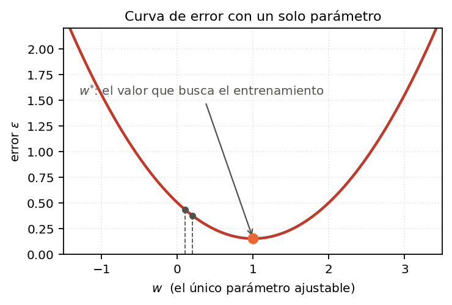

Con dos parámetros —dos entradas, o una entrada y el sesgo— la curva pasa a ser una **superficie**: dos ejes $w_1$ y $w_2$, y en el eje vertical el error. Partiendo de un punto inicial cualquiera, el método del gradiente baja por la ladera hasta el mínimo.

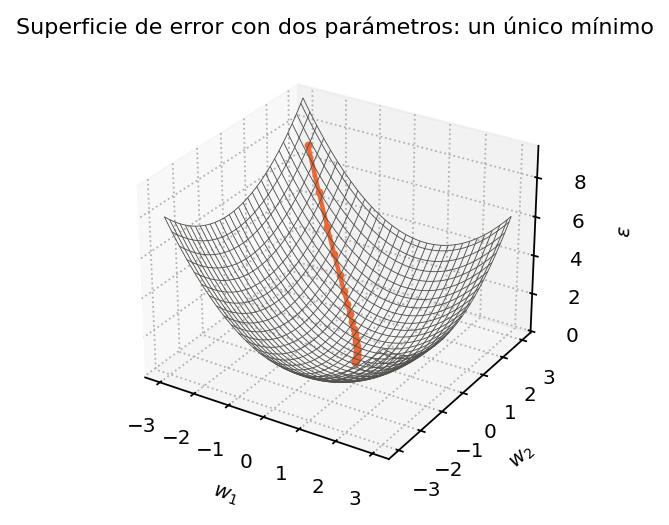

> **IDEA DE FONDO — "parámetro" es más que "peso"**
> Los pesos son parámetros, pero también lo son la cantidad de neuronas ocultas, la cantidad de capas y la arquitectura entera. Son *cualquier número que define la estructura y las conexiones del sistema*. La diferencia es que los pesos los sabemos entrenar automáticamente y los otros no —todavía—, pero conceptualmente viven en la misma superficie de error. Esto va a importar en la sección 3, cuando el eje horizontal deje de ser "épocas" y pase a ser "cantidad de parámetros libres".

### 1.1 Por qué las superficies reales son feas

Esos dos ejemplos son demasiado amables. En la práctica pasan tres cosas:

- **Múltiples mínimos locales.** Con cuatro valles, el algoritmo cae en el que le queda cerca del punto de arranque. Dependiendo de dónde inicialicés, terminás en el global o en uno cualquiera.
- **Mesetas y escalones.** Ahí el gradiente es **cero** y el algoritmo no sabe hacia dónde seguir. Esto pasa incluso en superficies con un **único** mínimo: es una patología distinta de la de los mínimos locales, no la misma.
- **Irregularidad general.** En un caso real la superficie es rugosa y llena de valles chicos.

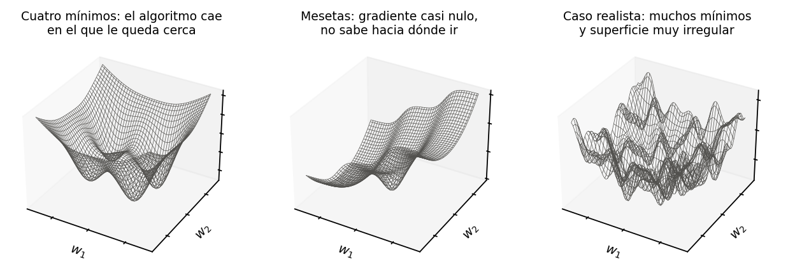

Y encima todo esto es la versión de dos dimensiones. En un problema real hay entre miles y cientos de miles de parámetros: la superficie vive en un espacio tan grande que ni siquiera podemos imaginarnos su forma, y cuantas más dimensiones tiene, **más zonas vacías** hay —regiones donde no hay ningún dato, donde el problema no está representado y donde no podemos medir nada—.

> **PARA LA DEFENSA — la consecuencia práctica, que es la que se pregunta**
> Si volvés a correr la misma red sobre exactamente los mismos datos, podés obtener resultados bastante diferentes: cambió la inicialización, y con ella el valle donde caíste. Por eso **nunca se reporta una sola corrida**. El remedio elemental que da la cátedra es reinicializar muchas veces al azar y quedarse con la mejor; el remedio serio son los **métodos de búsqueda global** —a diferencia del gradiente, que es una búsqueda puntual—, y se ven más adelante en la materia.

### Claves de la sección 1

| Clave | Qué tenés que poder responder |
|---|---|
| Superficie de error | Error del sistema en función de sus parámetros; el entrenamiento se mueve sobre ella |
| Parámetro | Cualquier número que define estructura y conexiones, no sólo los pesos |
| Mínimos locales | Dónde caés depende de dónde arrancaste |
| Mesetas | Gradiente nulo con un único mínimo: es otro problema, no el de los mínimos locales |
| Maldición de la dimensión | Más dimensiones $\Rightarrow$ más zonas vacías sin datos |

---

## 2. El problema de fondo: el error que nos importa no es el que medimos

Toda esa superficie la medimos **con los datos de entrenamiento**. Y ahí aparece la pregunta que da nombre a la unidad, y que en las diapositivas 9 y 10 está escrita sola en el medio de la pantalla:

> ¿El modelo es capaz de funcionar bien en casos más generales?
> ¿Cuál será el error en casos nunca vistos durante el entrenamiento?

**Capacidad de generalización** es exactamente eso: qué tan bien funciona el sistema en situaciones que nunca vio, dentro del mismo problema y de la misma población de datos.

> **IDEA DE FONDO — de nada sirve un error de entrenamiento bajo**
> En la realidad los datos de entrenamiento no van a estar: van a estar *otros*, parecidos pero distintos. Que el modelo reconozca perfectamente los ejemplos que ya vio no es un logro, es casi un síntoma. La única cifra que tiene valor es la que estima el desempeño sobre datos nuevos, y conseguir esa cifra honestamente es todo el contenido de las secciones 4 y 5.

---

## 3. Sobre-entrenamiento

Si graficamos el error contra las **épocas** —la cantidad de veces que le mostramos los datos completos— pasa lo siguiente:

- El **error de entrenamiento** baja siempre. Con ondulaciones, pero baja. Eso está bien: demuestra que el algoritmo funciona y que se ajusta cada vez mejor a lo que le mostramos.
- El error medido sobre datos que **no** vio baja también al principio —era lo esperado, está aprendiendo—, después **se estanca**, y a partir de cierto punto **empieza a subir**.

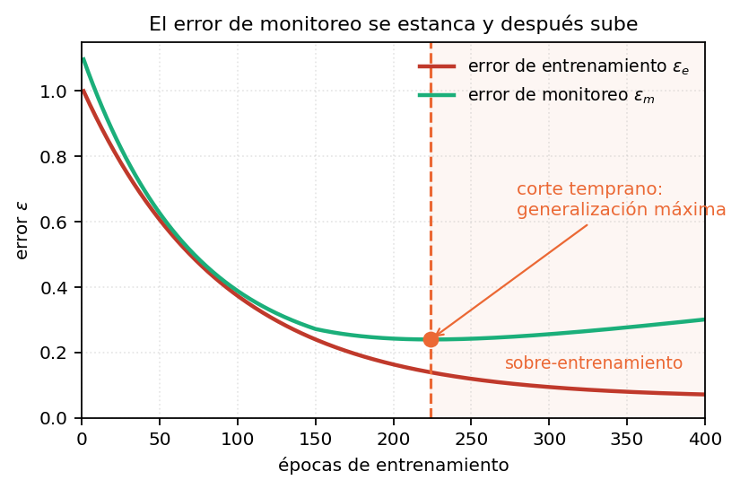

¿Qué pasó en ese punto? El modelo dejó de aprender lo general del problema y empezó a aprenderse **detalles particulares de los datos de entrenamiento**: el ruido de la medición, o el ruido que se incorporó después, que no tiene nada que ver con las clases. Como esos detalles no están en los datos nuevos, ahí el desempeño empeora.

### 3.1 La misma curva, contra la complejidad del modelo

Ahora dejemos fija la cantidad de épocas y hagamos variar otra cosa: la **cantidad de parámetros libres** —pesos, neuronas, capas—.

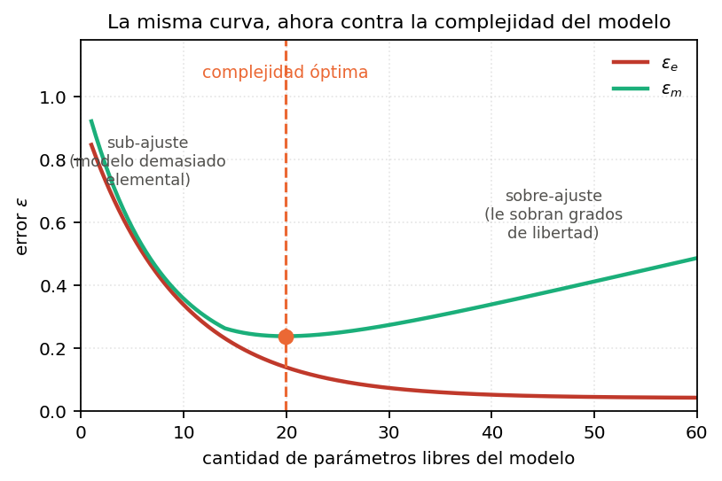

El fenómeno es idéntico, y por la misma razón: cuantos más parámetros libres tiene la red, **más capacidad tiene de modelar los detalles finos** de los datos de entrenamiento. En el otro extremo, un modelo demasiado elemental no puede aprender ni los detalles ni las cosas gruesas, y mucho menos generalizar.

> **OJO — dos ejes distintos, un solo concepto**
> Épocas y cantidad de parámetros son **dos formas de darle al modelo más oportunidad de memorizar**. Las curvas tienen la misma forma y el punto óptimo significa lo mismo: el punto donde se **maximiza la capacidad de generalización**. Si te preguntan "¿cómo evitás el sobre-entrenamiento?", hay dos respuestas posibles según cuál de los dos ejes estés moviendo, y conviene decir las dos.

### 3.2 Visto en clasificación

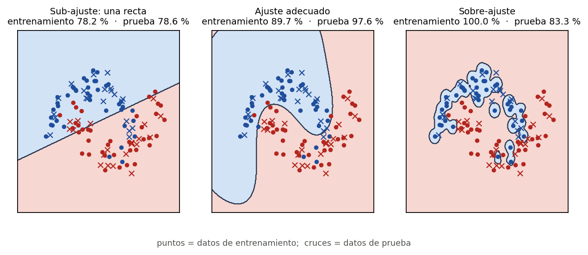

Los números de esa figura salen de una corrida real, con una partición de prueba del 35 % de los datos, y dicen todo:

| Modelo | Aciertos en entrenamiento | Aciertos en prueba |
|---|---:|---:|
| Recta (sub-ajuste) | 78,2 % | 78,6 % |
| Frontera curva moderada | 89,7 % | 97,6 % |
| Frontera que rodea cada punto | **100,0 %** | **83,3 %** |

El tercer modelo separa **perfectamente** los datos de entrenamiento —da la vuelta alrededor de cada punto rojo y de cada punto azul— y es el peor de los tres en prueba, salvo por la recta. El error de entrenamiento cero no es un mérito: es la evidencia de que se aprendió el ruido.

### 3.3 Visto en regresión: sesgo y varianza

El mismo experimento con un problema de predicción —cuánto va a llover mañana, por ejemplo— en vez de clasificación.

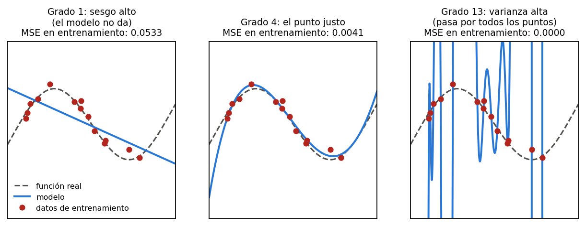

Leído en términos de **sesgo** y **varianza**:

- **Grado 1.** El sesgo es enorme: el modelo ni siquiera puede tener la forma de la función real. MSE en entrenamiento $= 0{,}0533$.
- **Grado 4.** Sesgo intermedio, y prácticamente indistinguible de la curva que generó los datos. MSE $= 0{,}0041$.
- **Grado 13.** El error de entrenamiento es prácticamente **cero** —la curva pasa por todos los puntos— pero entre punto y punto está obligada a hacer excursiones que se alejan muchísimo del modelo real. Redujimos el sesgo y **disparamos la varianza**.

> **PARA LA DEFENSA — la frase que resume las dos figuras**
> Sub-ajuste es **sesgo alto**: el modelo no da para representar el problema. Sobre-ajuste es **varianza alta**: el modelo da de sobra y usa lo que le sobra para copiar el ruido. Lo que se busca no es minimizar ninguno de los dos, sino el punto donde la **suma** de ambos es mínima, y ese punto sólo se ve en la curva verde: la del error sobre datos que el modelo no vio.

### Claves de la sección 3

| Clave | Qué tenés que poder responder |
|---|---|
| $\varepsilon_e$ vs. $\varepsilon_m$ | Uno baja siempre; el otro baja, se estanca y sube |
| Qué se aprende de más | El ruido y las particularidades de los datos de entrenamiento |
| Los dos ejes | Épocas y cantidad de parámetros libres dan la misma curva |
| Sub-ajuste | Sesgo alto: el modelo no puede representar el problema |
| Sobre-ajuste | Varianza alta: error de entrenamiento casi nulo, error de prueba grande |

---

## 4. Corte temprano, y la trampa que trae

La solución que sale sola es: **no sigamos entrenando**. Vamos midiendo el error sobre datos no vistos, y cuando vemos que empieza a subir, cortamos. Eso es el **corte temprano** del entrenamiento.

En la práctica se sigue un poco más allá del mínimo —porque la curva ondula y no se sabe si subió de verdad o fue un rebote— guardando el estado del modelo en cada punto, y al final se recupera el mejor.

Pero acá hay un problema implícito, y es la pregunta que la diapositiva 16 tira al aire:

> ¿Estamos ajustando un parámetro con los datos de prueba?

**Sí.** Y esto es lo más importante de toda la unidad.

> **OJO — el sesgo se esconde un nivel más arriba**
> Los **pesos** ya no se están sobre-ajustando a los datos de entrenamiento, es cierto. Pero la **cantidad de épocas** —o la cantidad de parámetros libres, o la arquitectura— la estamos eligiendo mirando los datos de prueba. O sea que ahora ese hiperparámetro está sobre-ajustado a los datos de prueba, y la cifra que reportemos deja de ser una estimación honesta.

> **IDEA DE FONDO — la regla, sin excepciones**
> Los datos de prueba **no se pueden usar para absolutamente nada**. La imagen que usa el profesor: un cliente te pide un detector de spam, te manda **sólo** los datos de entrenamiento y **se queda** con los de prueba. No los tenés en tu disco ni en ningún lado; él los va a usar para evaluarte. Si en tu situación los tenés a mano, tenés que comportarte como si no los tuvieras.

**La solución** es abrir un tercer conjunto **dentro** de los datos de entrenamiento: el conjunto de **monitoreo** —algunos lo llaman de **validación**—. Sirve para monitorear el error sobre datos que el modelo no vio, sin tocar los de prueba.

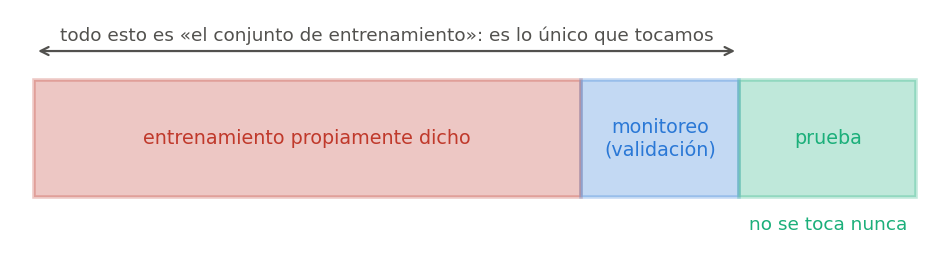

| Conjunto | Para qué se usa | ¿Lo ve el entrenamiento? |
|---|---|---|
| Entrenamiento | Ajustar los pesos | Sí, directamente |
| Monitoreo (validación) | Decidir cuándo cortar y qué arquitectura elegir | No ajusta pesos, pero **sí** decide |
| Prueba | Estimar el desempeño final, una sola vez | Nunca, para nada |

> **PARA LA DEFENSA — la objeción que te van a hacer**
> "Si separo monitoreo, me quedan menos datos para entrenar, y ya tenía pocos." Es cierto, es un problema real, y la respuesta es la sección 5: la validación cruzada permite estimar la generalización **reutilizando** todos los datos en distintos roles, en vez de sacrificar un bloque de manera permanente.

### Claves de la sección 4

| Clave | Qué tenés que poder responder |
|---|---|
| Corte temprano | Parar donde el error de monitoreo hace mínimo |
| La trampa | Elegir el punto de corte con los datos de prueba los contamina |
| Monitoreo | Subconjunto tomado de los datos de entrenamiento, no de los de prueba |
| La regla | Los datos de prueba no se usan para nada, nunca |

---

## 5. Estimación de la capacidad de generalización

Ahora la pregunta operativa: **cómo mido** qué tan bien va a funcionar en datos nuevos.

### 5.1 Los datos, y por qué hay que desordenarlos primero

Cada fila del archivo es un patrón: un paciente con su frecuencia respiratoria, su frecuencia cardíaca, la concentración de tal molécula; o un mensaje con la cantidad de tal palabra y su extensión. La última columna es la clase: $1$ para lo que queremos detectar —patológico, spam— y $0$ para lo demás. La cátedra los dibuja como una imagen: una fila por patrón, cada columna en color según la intensidad de esa medición, y la última columna en negro o blanco según la clase.

**Los datos suelen venir ordenados por clase, y eso es un problema.** Si tomás el primer bloque para prueba, te queda un bloque de una sola clase, y encima puede ser sistemáticamente el más fácil o el más difícil.

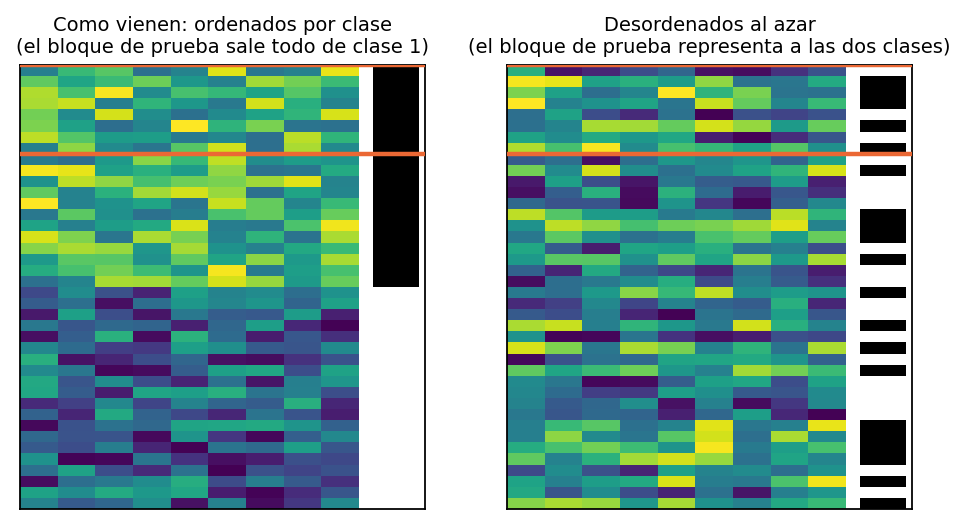

El **primer paso**, entonces, es **desordenar al azar**. Y no hace falta reescribir el archivo: alcanza con generar en memoria un vector con los índices $1$ a $P$ permutados al azar e indexar los datos con él.

> **OJO — el orden de los datos no es información, es un artefacto**
> Están así porque alguien los guardó así. Cualquier estructura que respetes al particionar es estructura que el experimento va a heredar sin que te des cuenta.

### 5.2 Validación cruzada: la idea

Tomo, digamos, 10 casos de 100 para prueba y entreno con los otros 90. Pero: ¿y si justo esos diez eran los difíciles, y mi error da alto por mala suerte? ¿O si siete de los diez eran triviales y me da una tasa de error muy baja pero poco creíble?

La respuesta es **repetir el mecanismo muchas veces**, cambiando cada vez qué bloque se deja afuera. Cada repetición se llama una **partición**.

Con $P = 100$ patrones y bloques de 10, salen 10 particiones. Y para cada una:

1. **Se arranca de cero.** Reinicialización completa de los pesos al azar. No se guarda nada de la partición anterior.
2. Entrenamiento completo, con el algoritmo que sea, con monitoreo o sin él.
3. Se mide el error de prueba $\varepsilon_j$ sobre el bloque que quedó afuera.

Y la estimación final es el promedio sobre las $n$ particiones:

$$\bar{\varepsilon} = \frac{1}{n} \sum_{j=1}^{n} \varepsilon_j$$

> **OJO — el paso 1 es el que se olvida y el que invalida todo**
> Cada partición es un experimento **independiente y completo**. Si arrastrás los pesos de la partición anterior, la red ya vio los datos que ahora son de prueba, y toda la estimación se cae.

### 5.3 Y siempre, la varianza

$$\sigma^2_\varepsilon = \frac{1}{n} \sum_{j=1}^{n} \left(\varepsilon_j - \bar{\varepsilon}\right)^2$$

> **PARA LA DEFENSA — la recomendación explícita de la cátedra**
> No alcanza con la media: **hay que reportar también la varianza** entre particiones. Si el error medio da 5 % con una varianza chica, las particiones son homogéneas y no hay más que discutir. Pero si una partición da 1 %, otra 40 %, otra 0,5 % y otra 80 %, el promedio no significa nada: te está avisando que **hay un problema con los datos**, porque las particiones son muy distintas entre sí. La regla práctica que dio: si la varianza es mucho más grande que el error, hay algo mal.

### 5.4 Las variantes, y cómo se llaman

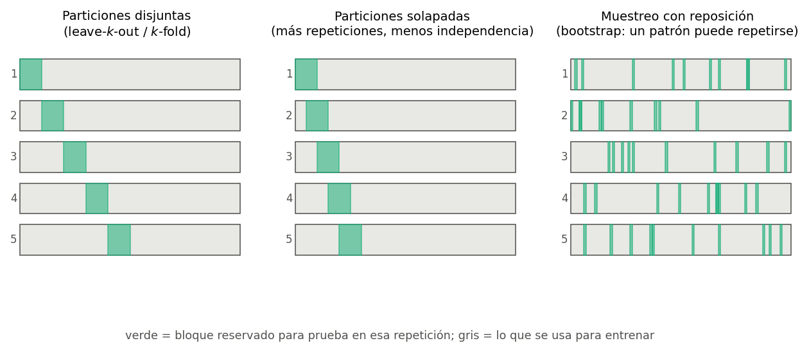

**Leave-$k$-out.** Se deja un bloque de $k$ patrones afuera y se entrena con el resto. El nombre nombra **el tamaño del bloque**.

**$k$-fold.** Se parte el conjunto en $k$ pliegues y se rota cuál es el de prueba. El nombre nombra **la cantidad de particiones**.

> **OJO — son la misma familia, pero la $k$ significa cosas distintas**
> Con $P = 100$: *leave-10-out* deja 10 afuera y produce **10** particiones —ahí las dos nomenclaturas coinciden, que es lo que confunde—. Pero *leave-20-out* deja 20 afuera y produce **5** particiones, que sería *5-fold*. Hay bibliografía que usa una y bibliografía que usa la otra. Si te preguntan por la diferencia, la respuesta es exactamente ésta: **una $k$ cuenta patrones y la otra cuenta particiones.**

**Leave-1-out.** El caso extremo: se deja **un** patrón afuera, se entrena con los $P-1$ restantes, y se repite $P$ veces.

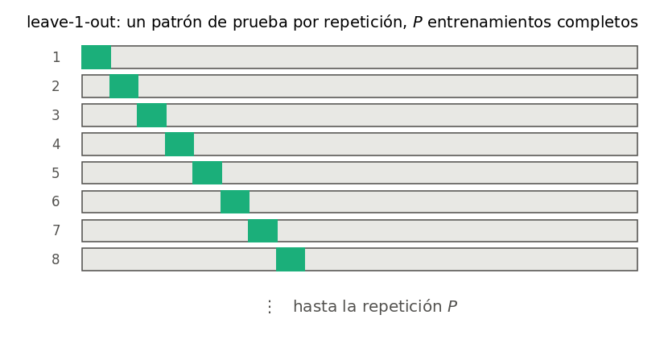

| | Costo | Sesgo de la estimación |
|---|---|---|
| Leave-1-out | Muy alto: $P$ entrenamientos completos, cada uno evaluado con **un solo** ejemplo | **Bastante más chico** que el de cualquiera de los otros |

**Particiones solapadas.** En vez de bloques excluyentes, los bloques comparten patrones —el primero toma del 1 al 10, el segundo del 6 al 15—. Se usa sobre todo cuando hay **pocos datos**.

> **IDEA DE FONDO — qué se pierde y qué se gana al solapar**
> Se **pierde la independencia estadística** entre experimentos: las particiones ya no son observaciones independientes, y por eso la varianza que calcules está subestimada. Se **gana** la posibilidad de tener muchas más particiones para promediar. Con paso 5 en vez de 10 salen casi el doble. Es un intercambio consciente, no un descuido.

**Muestreo con reposición (bootstrap).** Se eligen los patrones de cada partición **con reposición**: un mismo patrón puede salir dos veces dentro de la misma partición, y también puede quedar afuera. Permite generar muchísimas más particiones que cualquiera de los métodos anteriores, y tiene un fundamento teórico propio.

### Claves de la sección 5

| Clave | Qué tenés que poder responder |
|---|---|
| Primer paso | Desordenar al azar, con un vector de índices permutados |
| Por qué repetir | Para que la estimación no dependa de qué bloque tocó como prueba |
| Reinicializar | Cada partición arranca de cero, siempre |
| $\bar{\varepsilon}$ y $\sigma^2_\varepsilon$ | Media **y** varianza; varianza grande = problema con los datos |
| leave-$k$-out vs. $k$-fold | Una $k$ cuenta patrones dejados afuera, la otra cuenta particiones |
| leave-1-out | $P$ entrenamientos, muy caro, el de menor sesgo |
| Solapadas | Más particiones a cambio de independencia estadística |
| Con reposición | Un patrón puede repetirse dentro de la partición; es el bootstrap |

---

## 6. Medidas de desempeño en clasificación

Hasta acá dijimos "el error" sin definirlo. Ahora sí, para un clasificador binario —positivo/negativo, patológico/normal, spam/no spam—. Todo se extiende a más clases, pero se define con dos.

### 6.1 La matriz de confusión

Filas: la clase **correcta**. Columnas: lo que **dijo** el clasificador.

Las cuatro celdas, dichas con cuidado —el error clásico es equivocarse en cuál es cuál—:

| Símbolo | Nombre | La clase era | El clasificador dijo | ¿Acertó? |
|---|---|---|---|---|
| $t_\oplus$ | verdaderos positivos | $\oplus$ | $\oplus$ | sí |
| $f_\ominus$ | falsos negativos | $\oplus$ | $\ominus$ | **no** |
| $f_\oplus$ | falsos positivos | $\ominus$ | $\oplus$ | **no** |
| $t_\ominus$ | verdaderos negativos | $\ominus$ | $\ominus$ | sí |

Y los totales por fila:

$$N_\oplus = t_\oplus + f_\ominus, \qquad N_\ominus = f_\oplus + t_\ominus, \qquad N = N_\oplus + N_\ominus$$

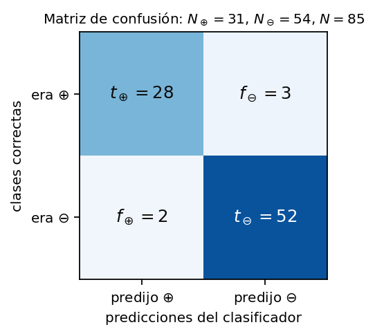

> **OJO — el nombre se lee al revés de como uno lo diría**
> "Falso negativo" **no** significa "era negativo y se equivocó". Significa: **el clasificador dijo negativo y ese negativo es falso** — o sea, era positivo. El adjetivo (verdadero/falso) dice si acertó; el sustantivo (positivo/negativo) dice **lo que predijo**. Si te trabás en el pizarrón, reconstruilo así y no falla.

### 6.2 Sensibilidad y especificidad

$$s^{+} = \frac{t_\oplus}{t_\oplus + f_\ominus} = \frac{t_\oplus}{N_\oplus} \qquad\longrightarrow\qquad \textit{sensitivity, true positive rate, hit rate, recall, power}$$

$$s^{-} = \frac{t_\ominus}{t_\ominus + f_\oplus} = \frac{t_\ominus}{N_\ominus} \qquad\longrightarrow\qquad \textit{specificity, true negative rate}$$

Cada una mira **una sola** clase: en el denominador de $s^{+}$ están todos los positivos que había, y los negativos no aparecen en ninguna parte.

> **OJO — el clasificador tramposo, que se pregunta siempre**
> Un clasificador que diga **siempre positivo**, sin mirar la entrada, tiene $s^{+} = 100\,\%$. Y es inservible. El simétrico —siempre negativo— tiene $s^{-} = 100\,\%$. Conclusión: **cualquiera de las dos por separado es engañosa**; hay que darlas juntas o usar una medida compuesta.

### 6.3 Precisión y valor predictivo negativo

$$p = \frac{t_\oplus}{t_\oplus + f_\oplus} \qquad\longrightarrow\qquad \textit{precision, positive predictive value}$$

$$n = \frac{t_\ominus}{t_\ominus + f_\ominus} \qquad\longrightarrow\qquad \textit{negative predictive value}$$

Acá el denominador cambia de fila a **columna**: son todos los casos que el clasificador **llamó** positivos, aciertos y errores.

> **IDEA DE FONDO — por qué la precisión sí resiste al tramposo**
> El clasificador que dice siempre positivo mete en el denominador de $p$ **todos** los negativos, como falsos positivos. El denominador se dispara y $p$ se derrumba. Con los números del ejemplo: $p = 31/85 = 36{,}5\,\%$ contra el $93{,}3\,\%$ del clasificador de verdad. Ésa es la diferencia entre una medida de una sola fila y una que cruza fila y columna.

### 6.4 Exactitud, F1 y G

$$a = \frac{t_\oplus + t_\ominus}{N} \qquad\longrightarrow\qquad \textit{accuracy}$$

Es la más intuitiva y la más usada: cuántas veces acertó, sobre el total. Contempla las dos clases, así que el clasificador tramposo tampoco la engaña.

$$F_1 = \frac{2\,t_\oplus}{2\,t_\oplus + f_\oplus + f_\ominus} = 2\,\frac{s^{+}\,p}{s^{+} + p} \qquad\longrightarrow\qquad \textit{F-score, media armónica}$$

$$G = \sqrt{s^{+}\,p} \qquad\longrightarrow\qquad \textit{G-measure, media geométrica}$$

$F_1$ y $G$ combinan **sensibilidad y precisión**, las dos enfocadas en la clase positiva, que suele ser la clase de interés: es la que uno está buscando —el enfermo, el spam—.

> **PARA LA DEFENSA — la identidad de $F_1$ conviene saber pasarla**
> Reemplazá $s^{+} = t_\oplus/(t_\oplus + f_\ominus)$ y $p = t_\oplus/(t_\oplus + f_\oplus)$ en la media armónica. El numerador queda $2\,t_\oplus^2$ y el denominador $t_\oplus\,(2t_\oplus + f_\oplus + f_\ominus)$; se simplifica un $t_\oplus$ y sale la forma de la izquierda. Que la media armónica sea **armónica** y no aritmética importa: castiga que una de las dos sea baja, mientras que el promedio común la dejaría pasar.

**Todo el ejemplo, con los números de la matriz de confusión de la figura** ($t_\oplus = 28$, $f_\ominus = 3$, $f_\oplus = 2$, $t_\ominus = 52$, $N = 85$):

| Medida | Cuenta | Valor |
|---|---|---:|
| $s^{+}$ | $28/31$ | 90,32 % |
| $s^{-}$ | $52/54$ | 96,30 % |
| $p$ | $28/30$ | 93,33 % |
| $n$ | $52/55$ | 94,55 % |
| $a$ | $80/85$ | 94,12 % |
| $F_1$ | $56/61$ | 91,80 % |
| $G$ | media geom. de $s^{+}$ y $p$ | 91,82 % |

Y el mismo conjunto de datos evaluado con el clasificador que dice **siempre positivo**: $s^{+} = 100\,\%$, $s^{-} = 0\,\%$, $p = a = 36{,}5\,\%$, $F_1 = 53{,}4\,\%$. Ahí se ve de un vistazo cuáles medidas son engañables y cuáles no.

### 6.5 Errores relativos

Dos clasificadores tienen $a_1 = 50\,\%$ y $a_2 = 51\,\%$. Otros dos tienen $a_3 = 98\,\%$ y $a_4 = 99\,\%$. En los dos casos la diferencia es de **un punto**, y sin embargo no son comparables: ganarle a un clasificador que acierta la mitad de las veces —o sea, que en un problema binario no sirve para nada— es muchísimo más fácil que ganarle a uno que ya tiene el problema prácticamente resuelto.

Definiendo el error como $e = 1 - a$ y tomando el clasificador de referencia $e_r$:

$$\delta_e = \frac{e_r - e}{e_r}$$

Con los números:

$$\delta_e^{(1\to 2)} = \frac{0{,}50 - 0{,}49}{0{,}50} = \frac{1}{50} = 2\,\% \qquad\qquad \delta_e^{(3\to 4)} = \frac{0{,}02 - 0{,}01}{0{,}02} = \frac{1}{2} = 50\,\%$$

El segundo par **redujo el error a la mitad**; el primero lo movió un 2 %. Es la misma diferencia de un punto de exactitud, leída como corresponde.

> **PARA LA DEFENSA — cuándo se usa**
> $\delta_e$ es la herramienta para **comparar dos sistemas**, especialmente cuando la referencia ya está arriba del 90 %. Se puede definir sobre cualquiera de las medidas de la sección, no sólo sobre la exactitud: todas están definidas como tasas de acierto, así que todas admiten su $e = 1 - (\cdot)$.

### Claves de la sección 6

| Clave | Qué tenés que poder responder |
|---|---|
| Matriz de confusión | Filas = clase real, columnas = predicción; se mira la diagonal |
| $f_\ominus$ | Dijo negativo y se equivocó: **era positivo** |
| $s^{+}$, $s^{-}$ | Una fila cada una; engañables por el clasificador constante |
| $p$, $n$ | Cruzan fila y columna; ahí el tramposo se cae |
| $a$ | La más intuitiva; contempla ambas clases |
| $F_1$, $G$ | Media armónica y geométrica de $s^{+}$ y $p$ |
| $\delta_e$ | Reducción **relativa** de error respecto de una referencia |

---

## 7. Medidas de desempeño en predicción de series

Para predicción —cuántos milímetros va a llover mañana— no se puede contar aciertos: se puede errar por poco o por mucho, y eso tiene que verse en la medida.

El error instantáneo es la distancia vertical entre lo que dijo el modelo y lo que era:

$$e_i = y_i - \hat{y}_i$$

Pero una sumatoria directa de los $e_i$ **no sirve**: los errores positivos se compensan con los negativos, y un predictor pésimo puede dar suma cero. Hay que medir **área**, sin importar de qué lado de la referencia esté.

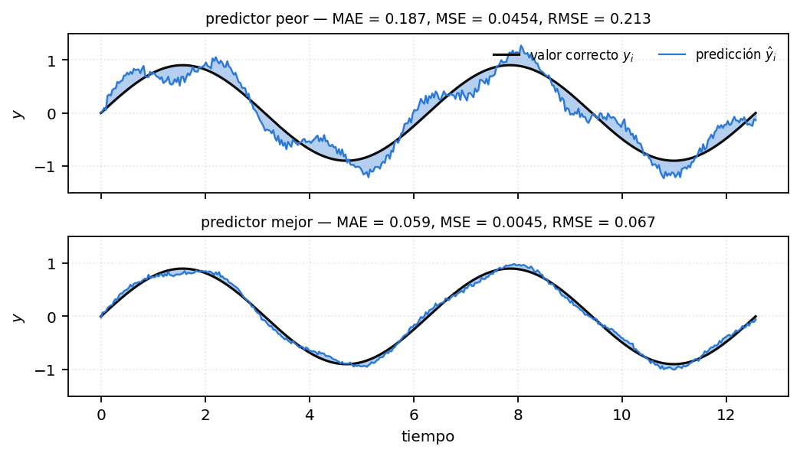

$$\tilde{\varepsilon}_A = \frac{1}{N}\sum_{i=1}^{N} \lvert e_i \rvert \qquad\longrightarrow\qquad \textit{MAE / MAD}$$

$$\tilde{\varepsilon}_S = \frac{1}{N}\sum_{i=1}^{N} e_i^{2} \qquad\longrightarrow\qquad \textit{MSE}$$

$$\tilde{\varepsilon}_R = \sqrt{\frac{1}{N}\sum_{i=1}^{N} e_i^{2}} \qquad\longrightarrow\qquad \textit{RMSE}$$

Las dos formas de sacarse de encima el signo son el **valor absoluto** y el **cuadrado**.

Los números de la figura, calculados sobre las series dibujadas:

| | MAE | MSE | RMSE |
|---|---:|---:|---:|
| Predictor peor | 0,187 | 0,0454 | 0,213 |
| Predictor mejor | 0,059 | 0,0045 | 0,067 |

> **IDEA DE FONDO — por qué el MSE domina aunque el MAE sea más natural**
> El MSE se usa mucho más porque es **más tratable analíticamente**: es derivable en todas partes y de derivada simple, y por eso es el que aparece cuando hay que **deducir** un algoritmo de entrenamiento —el gradiente del perceptrón, back-propagation, el LMS de la capa de salida de una RBF—. El valor absoluto no es derivable en el cero. El RMSE agrega sólo la raíz, y su único propósito es **volver el error a la escala lineal** de la variable, la que el cuadrado había abandonado.

> **PARA LA DEFENSA — el caso del pico**
> Estas tres medidas son un enfoque elemental. Hay muchas más: correlación, índices de concordancia, y en particular el **error máximo de pico**, que reporta cuánto se desvía el predictor **en el peor caso**. Importa cuando un pico aislado dispara una alarma: para el MSE ese pico es un punto entre mil y se diluye, pero en la aplicación es lo único que importa. Si te preguntan "¿alcanza con el MSE?", ésta es la respuesta.

### Claves de la sección 7

| Clave | Qué tenés que poder responder |
|---|---|
| Por qué no la suma directa | Los errores positivos y negativos se compensan |
| MAE | Media del valor absoluto; mide área |
| MSE | Media del cuadrado; el analíticamente tratable |
| RMSE | Raíz del MSE; devuelve el error a la escala de la variable |
| Error máximo de pico | Peor caso; importa cuando un pico aislado tiene consecuencias |

---

## 8. Formulario

**Estimación por validación cruzada**

$$\bar{\varepsilon} = \frac{1}{n}\sum_{j=1}^{n}\varepsilon_j \qquad\qquad \sigma^2_\varepsilon = \frac{1}{n}\sum_{j=1}^{n}\left(\varepsilon_j - \bar{\varepsilon}\right)^2$$

**Matriz de confusión**

$$N_\oplus = t_\oplus + f_\ominus \qquad N_\ominus = f_\oplus + t_\ominus \qquad N = N_\oplus + N_\ominus$$

**Clasificación**

$$s^{+} = \frac{t_\oplus}{N_\oplus} \qquad s^{-} = \frac{t_\ominus}{N_\ominus} \qquad p = \frac{t_\oplus}{t_\oplus + f_\oplus} \qquad n = \frac{t_\ominus}{t_\ominus + f_\ominus}$$

$$a = \frac{t_\oplus + t_\ominus}{N} \qquad F_1 = \frac{2t_\oplus}{2t_\oplus + f_\oplus + f_\ominus} = 2\frac{s^{+}p}{s^{+}+p} \qquad G = \sqrt{s^{+}p}$$

$$e = 1 - a \qquad\qquad \delta_e = \frac{e_r - e}{e_r}$$

**Predicción**

$$e_i = y_i - \hat{y}_i \qquad \tilde{\varepsilon}_A = \frac{1}{N}\sum_i \lvert e_i\rvert \qquad \tilde{\varepsilon}_S = \frac{1}{N}\sum_i e_i^2 \qquad \tilde{\varepsilon}_R = \sqrt{\tilde{\varepsilon}_S}$$

---

## 9. Errores típicos

| Error | Lo correcto |
|---|---|
| Decir que el error de entrenamiento bajo es un buen resultado | Es condición necesaria y nada más; puede ser síntoma de sobre-ajuste |
| Elegir la cantidad de épocas o la arquitectura mirando el error de prueba | Eso contamina la estimación: se usa el conjunto de **monitoreo** |
| Reportar sólo el error medio de la validación cruzada | Va acompañado de la **varianza** entre particiones |
| Arrastrar los pesos entrenados de una partición a la siguiente | Cada partición reinicializa de cero |
| Confundir leave-$k$-out con $k$-fold | Una $k$ cuenta patrones afuera, la otra cuenta particiones |
| Leer $f_\ominus$ como "era negativo y erró" | Es "**dijo** negativo y erró", o sea que era positivo |
| Reportar sólo sensibilidad, o sólo especificidad | Cada una mira una fila; el clasificador constante las engaña |
| Decir que mesetas y mínimos locales son el mismo problema | Una superficie con un único mínimo puede tener mesetas igual |
| Usar la suma de $e_i$ como error de una serie | Se compensan los signos: valor absoluto o cuadrado |
| Justificar el MSE diciendo que "castiga los errores grandes" | La razón que da la cátedra es que es **analíticamente tratable** |

---

## 10. Autoevaluación

1. Dibujá una superficie de error con un único mínimo global que igual haga fracasar al descenso por gradiente. ¿Cuál es el mecanismo?
2. ¿Por qué dos corridas de la misma red sobre los mismos datos pueden dar resultados distintos? Nombrá las dos causas y el remedio elemental.
3. Dibujá $\varepsilon_e$ y $\varepsilon_m$ contra las épocas, marcá el punto de corte temprano y explicá qué está aprendiendo el modelo a la derecha de ese punto.
4. Dibujá el mismo par de curvas contra la cantidad de parámetros libres. ¿Por qué tienen la misma forma?
5. Un modelo alcanza 100 % de aciertos en entrenamiento y 83 % en prueba, y otro alcanza 90 % y 98 %. ¿Cuál entregarías, y con qué argumento?
6. ¿Por qué el corte temprano, hecho ingenuamente, es una forma encubierta de sobre-ajuste? ¿Qué conjunto lo arregla?
7. Enumerá los tres subconjuntos y decí, para cada uno, quién lo mira y para decidir qué.
8. ¿Cuál es el primer paso antes de particionar, y por qué? ¿Cómo se implementa sin reescribir los datos?
9. Con $P = 100$ y bloques de 20: ¿cuántas particiones salen? ¿Cómo se llama eso en cada una de las dos nomenclaturas?
10. Escribí las ventajas y las desventajas de leave-1-out en dos líneas.
11. ¿Qué se pierde y qué se gana al solapar particiones? ¿Qué cantidad reportada queda mal estimada?
12. Dibujá la matriz de confusión con los cuatro nombres en su lugar y escribí los tres totales.
13. Un clasificador dice siempre positivo. Calculá $s^{+}$, $s^{-}$, $p$ y $a$ y decidí cuáles medidas lo delatan.
14. Deducí $F_1 = 2t_\oplus/(2t_\oplus + f_\oplus + f_\ominus)$ a partir de la media armónica de $s^{+}$ y $p$.
15. Dos sistemas pasan de 98 % a 99 % de exactitud, y otros dos de 50 % a 51 %. Calculá $\delta_e$ en los dos casos y explicá la diferencia.
16. ¿Por qué no se puede usar $\sum_i e_i$ como medida de error en una serie? Escribí las tres alternativas y decí qué agrega la raíz del RMSE.
17. ¿En qué situación el MSE es una mala medida aunque esté bien calculado?
