*Notación: $N$ es la dimensión de la entrada, $M$ la cantidad de neuronas del mapa, $L$ la cantidad de patrones de entrenamiento y $n$ la iteración (un patrón por iteración). $\mathbf{w}_j \in \mathbb{R}^N$ es el vector de pesos de la neurona $j$; $G$ o $j^*$ es la ganadora. En la parte de LVQ la cátedra cambia de nombres: el vector de pesos pasa a llamarse **prototipo** $\mathbf{m}_i$ y la velocidad de aprendizaje $\eta$ pasa a llamarse $\alpha$. Es la misma cosa.*

*Las figuras 1, 2, 4, 5, 6, 7, 8, 10, 11, 12, 13 y 14 reconstruyen contenido que en las diapositivas no está: son las láminas que el profesor desarrollaba en el pizarrón (todo el bloque "Formación de mapas topológicos" son siete viñetas sin una sola figura) o simulaciones hechas para verificar lo que la clase afirma. Todos los números que aparecen en el apunte salen de las corridas de `../imagenes/graficos_som.py`.*

---

## 1. Auto-organización

**Definición (Turing, 1952):** la auto-organización es el proceso por el cual, **a partir de interacciones locales, emerge un ordenamiento global**. Nadie coordina desde afuera; cada elemento sigue reglas elementales y la estructura completa termina exhibiendo un comportamiento mucho más complejo que esas reglas.

Los cuatro ejemplos que da la clase, en orden de cercanía al tema:

- **Las hormigas.** No hay un cerebro central que reparta tareas, y sin embargo el hormiguero recolecta alimento con una organización muy compleja. (Este caso vuelve en la tercera parte de la materia, en inteligencia colectiva.)
- **Los alumnos del curso.** Al principio del cuatrimestre se sientan sin estructura; hacia el final hay grupos estables sentados siempre en la misma zona del aula. Nadie asignó los asientos.
- **La corteza cerebral.** Las neuronas relacionadas con el tacto de la mano quedan todas en una misma zona, las del pie en otra, las motoras en otra. Se organizaron así porque **las que recibían información parecida empezaron a funcionar parecido**, y estaban cerca.
- **La retina.** Conos y bastones, bordes y colores. El experimento de los gatos: un gatito criado en una habitación con sólo barras **horizontales** y otro con sólo barras **verticales**; al sacarlos al mundo normal, el primero se chocaba las columnas verticales — su retina literalmente no las veía. **No nacemos sabiendo ver: la retina también se entrena.**

> **IDEA DE FONDO — de dónde sale la arquitectura**
> Los dos últimos ejemplos no son adorno: son el origen del modelo. Kohonen (años 80) copió tres cosas del cerebro. (1) Las neuronas están **en un plano**, no en capas apiladas. (2) Cuando una se activa, **influye sobre las que tiene alrededor**. (3) Neuronas cercanas terminan representando **estímulos parecidos**. Toda la red sale de ahí.

### Claves de la sección 1

| Clave | Qué tenés que poder responder |
|---|---|
| Definición | Interacciones locales $\to$ ordenamiento global (Turing, 1952) |
| Ejemplo canónico | Corteza cerebral / retina: neuronas cercanas, estímulos parecidos |
| Quién lo propuso | Kohonen, años 80 |

---

## 2. Arquitectura del SOM

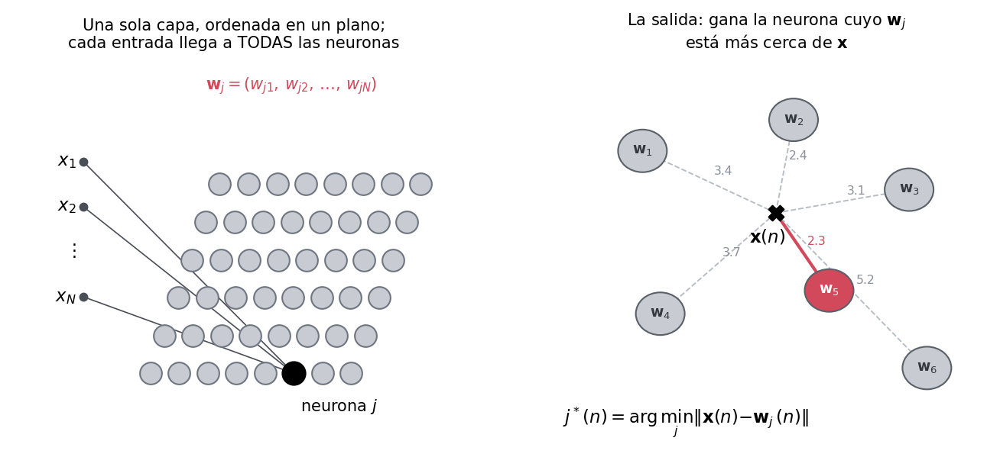

La arquitectura tiene tres piezas y nada más:

1. Un **vector de entrada** $\mathbf{x} \in \mathbb{R}^N$.
2. Una **matriz de pesos**: cada entrada se conecta con **todas** las neuronas (conexión todos contra todos).
3. Una **sola capa** de $M$ neuronas, **ordenadas en un plano** (o en una línea, o en un hexágono).

El vector $\mathbf{w}_j = (w_{j1}, w_{j2}, \ldots, w_{jN})^{\mathsf{T}}$ junta **todos los pesos que llegan a la neurona $j$**, uno por cada entrada. Vive en el mismo espacio $\mathbb{R}^N$ que los datos, y eso es lo que permite dibujarlos juntos en todas las figuras que vienen.

La salida es **competitiva**: ante un patrón se comparan la entrada y **todos** los vectores de peso, y se activa **una sola** neurona, la de menor distancia:

$$j^*(n) = G(\mathbf{x}(n)) = \arg\min_j \left\{ \left\| \mathbf{x}(n) - \mathbf{w}_j(n) \right\| \right\}$$

> **OJO — no hay función de activación, no hay producto interno**
> Acá no se calcula $\sum w_{ji}x_i$ ni se le pasa una sigmoide. Se calcula una **distancia** y se toma el mínimo. Es la primera red de la materia donde el peso no es un coeficiente de una combinación lineal sino **un punto del espacio de entrada**: $\mathbf{w}_j$ es la posición de la neurona $j$ dentro de $\mathbb{R}^N$.

> **PARA LA DEFENSA — el plano tiene dos espacios y hay que no mezclarlos**
> Está el **espacio del mapa** (dónde está la neurona respecto de las otras: la cuadrícula, en 1D o 2D) y el **espacio de entrada** $\mathbb{R}^N$ (dónde está su vector de pesos). La vecindad se mide en el **primero**; la distancia que elige a la ganadora, en el **segundo**. Casi todo lo interesante del SOM es la relación entre esos dos espacios, y casi todos los enredos vienen de confundirlos.

### Claves de la sección 2

| Clave | Qué tenés que poder responder |
|---|---|
| Capas | Una sola, ordenada en un plano |
| Conexión | Todos contra todos: cada entrada llega a cada neurona |
| $\mathbf{w}_j$ | Los $N$ pesos que llegan a la neurona $j$; es un punto de $\mathbb{R}^N$ |
| Salida | $j^*=\arg\min_j\|\mathbf{x}-\mathbf{w}_j\|$: gana una sola |
| Los dos espacios | Mapa (vecindad) vs. entrada (distancia) |

---

## 3. Entornos de influencia o vecindades

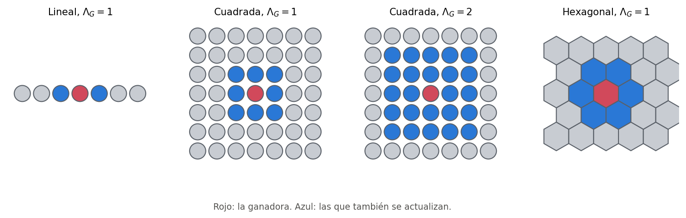

**Formas básicas** del mapa: **lineal** (una fila de neuronas), **rectangular o cuadrada** (la cuadrícula) y **hexagonal** (cada neurona tiene 6 vecinas; es la que Kohonen usó originalmente).

Cómo se cuenta el radio en la forma cuadrada, que es lo que se pregunta: con $\Lambda_G = 1$ entran las 8 de alrededor. Con $\Lambda_G = 2$ se aplica el mismo criterio **a cada una de esas 8**, y quedan las 24 de alrededor. Es la distancia de Chebyshev, $\max(|\Delta \text{fila}|, |\Delta \text{columna}|)$: un cuadrado, no un círculo.

Dos ejes independientes para caracterizar un entorno:

- **Alcance $\Lambda_G$:** entornos **fijos** o **variables**. En la práctica se usan variables, grandes al principio y decrecientes.
- **Excitación asociada al entorno:** **excitatorias puras**, **inhibitorias puras**, o **funciones generales de excitación/inhibición**.

### Claves de la sección 3

| Clave | Qué tenés que poder responder |
|---|---|
| Tres formas | Lineal, cuadrada (la habitual), hexagonal (la original de Kohonen) |
| Cómo crece $\Lambda_G$ | Se aplica el criterio recursivamente: radio 2 = las vecinas de las vecinas |
| Los dos ejes | Alcance (fijo/variable) y tipo de excitación |

---

## 4. Funciones de excitación/inhibición lateral

$h_{G,i}$ es **cuánto le llega** de la actualización a la neurona $i$ cuando ganó la $G$, en función de la distancia $|G-i|$ **medida sobre el mapa**.

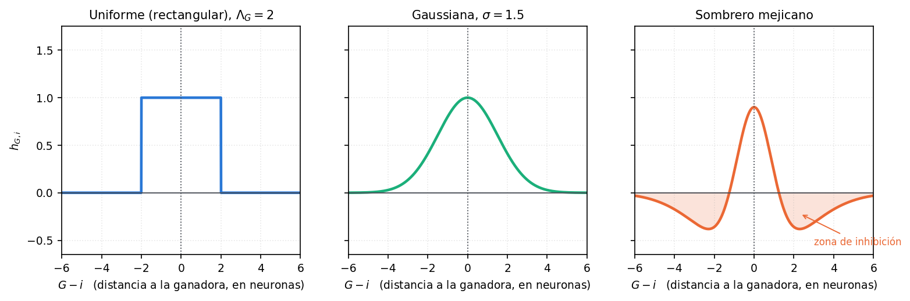

**Uniforme (entorno simple o rectangular).** Para $\Lambda_G(n)=2$:

$$\Lambda_G(n) = 2 \;\Rightarrow\;
\begin{cases}
h_{G,i} = \beta(n) & \text{si } |G-i| \le 2 \\[2pt]
h_{G,i} = 0 & \text{si } |G-i| > 2
\end{cases}$$

con $\beta(n)$ adaptable en función de las iteraciones $n$.

**Gaussiana.**

$$h_{G,i} = \beta(n)\, e^{-\dfrac{|G-i|^2}{2\sigma^2(n)}}$$

Acá $\beta(n)$ deja de ser el valor que reciben todas y pasa a ser sólo el **pico**: cuanto más lejos está la neurona de la ganadora, menos la influye. El ancho lo pone $\sigma(n)$, y hacerlo decrecer con $n$ es la forma continua de reducir el entorno.

**Sombrero mejicano.** Excitación en el centro, **inhibición** en un anillo alrededor, y cero más lejos. Es la que se demostró que funciona en la retina.

> **IDEA DE FONDO — por qué el sombrero mejicano detecta bordes**
> Es el experimento que da la clase: mirá fijo un tubo fluorescente o una lámpara, cerrá los ojos, y en la imagen que te queda vas a ver **el borde** del objeto luminoso. La zona iluminada excita a sus neuronas y esas **inhiben a las de alrededor**; el contraste entre lo excitado y lo inhibido cae justo sobre el borde. Ése es el fenómeno de inhibición lateral, y ésa es la razón de que la curva tenga la panza negativa.

> **OJO — lo que se usa en la práctica es la aburrida**
> Las tres funciones entran en el parcial, pero el algoritmo que se implementa usa la **uniforme**: todas las neuronas del entorno se actualizan **igual que la ganadora**, y el resto no se toca. La gaussiana y el sombrero son el marco conceptual (y el nexo con la biología), no lo que se programa.

### Claves de la sección 4

| Clave | Qué tenés que poder responder |
|---|---|
| Qué es $h_{G,i}$ | Cuánto de la actualización recibe $i$ según su distancia **en el mapa** a $G$ |
| Uniforme | Vale $\beta(n)$ dentro del radio, $0$ afuera; es la que se implementa |
| Gaussiana | $\beta(n)$ es el pico; $\sigma(n)$ es el ancho y decrece con $n$ |
| Sombrero mejicano | Excita en el centro, inhibe alrededor; retina, detección de bordes |

---

## 5. Entrenamiento: el algoritmo

Dos características que definen todo lo demás:

- Entrenamiento **NO supervisado**: no hay salida deseada en ningún momento. No hay error contra una referencia.
- Aprendizaje **competitivo**: en cada iteración se ajustan **la ganadora y su entorno**, no toda la red.

**1. Inicialización.** Valores pequeños al azar, $w_{ji} \in [-0{,}5;\, +0{,}5]$ con distribución uniforme; o bien eligiendo al azar $\mathbf{w}_j(0) = \mathbf{x}_\ell$, con $\ell \in [1,\ldots,L]$ (un patrón cualquiera del archivo de entrenamiento).

**2. Selección del ganador.**

$$G(\mathbf{x}(n)) = \arg\min_{\forall j} \left\{ \left\| \mathbf{x}(n) - \mathbf{w}_j(n) \right\| \right\}$$

**3. Adaptación de los pesos.**

$$\mathbf{w}_j(n+1) =
\begin{cases}
\mathbf{w}_j(n) + \eta(n)\left(\mathbf{x}(n) - \mathbf{w}_j(n)\right) & \text{si } y_j \in \Lambda_G(n) \\[4pt]
\mathbf{w}_j(n) & \text{si } y_j \notin \Lambda_G(n)
\end{cases}$$

**4. Volver a 2** hasta no observar cambios significativos.

Cómo leer la ecuación del paso 3: $\mathbf{x}(n) - \mathbf{w}_j(n)$ es el **vector que va del peso al patrón**; se le suma una fracción $\eta$ de ese vector, o sea que **el peso se acerca un poco al patrón**. Nada más que eso.

> **OJO — no es un error de salida, es un vector de posición**
> En la clase se lo llama "vector de error" y el nombre confunde. En el perceptrón el error era $d - y$, la diferencia contra una salida deseada. Acá no hay salida deseada: $\mathbf{x}-\mathbf{w}_j$ es la **diferencia entre dos puntos del mismo espacio**, y el "aprendizaje" es literalmente mover la neurona hacia el dato. Por eso el entrenamiento es no supervisado aunque la fórmula se parezca a la del descenso por gradiente.

> **OJO — el entorno se evalúa en el mapa, la distancia en la entrada**
> $\|\mathbf{x}-\mathbf{w}_j\|$ del paso 2 se mide en $\mathbb{R}^N$. La pertenencia $y_j \in \Lambda_G(n)$ del paso 3 se mide **en la cuadrícula**. Una neurona puede tener el peso lejísimos del patrón y actualizarse igual, sólo porque en el mapa está al lado de la ganadora. **Eso es exactamente lo que produce el ordenamiento topológico.**

**Consideraciones prácticas** (diapositivas 25 a 28):

- $\Lambda_G(n)$ es generalmente **cuadrado**.
- $h_{G,i}(n)$ **uniforme en $i$**, decreciente con $n$.
- $0 < \eta(n) < 1$, **decreciente con $n$**.

Y de ahí sale la pregunta que la cátedra deja planteada: **¿cómo varían $\Lambda_G(n)$ y $\eta(n)$?** La respuesta es la sección siguiente.

### Claves de la sección 5

| Clave | Qué tenés que poder responder |
|---|---|
| Los 4 pasos | Inicializar / elegir ganadora / adaptar entorno / repetir |
| Inicialización | Al azar en $[-0{,}5;\,0{,}5]$, o copiando patrones del archivo |
| La regla | $\mathbf{w}_j \mathrel{+}= \eta(\mathbf{x}-\mathbf{w}_j)$: acercar el peso al patrón |
| Quién se actualiza | La ganadora **y su entorno**; el resto queda igual |
| Corte | Cuando no hay cambios significativos en el mapa |

---

## 6. Las tres etapas del entrenamiento

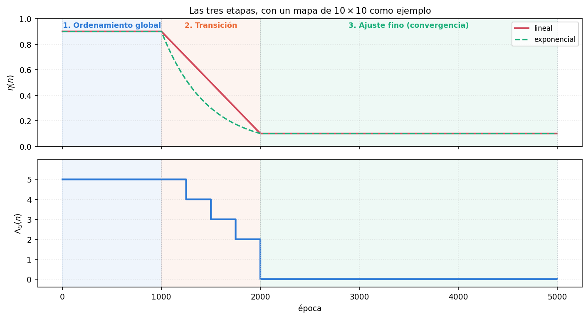

**1. Ordenamiento global (o topológico).**

- $\Lambda_G(n)$ **grande**, $\approx$ medio mapa (en un mapa $10\times10$, un entorno inicial de 5).
- $\eta(n)$ **grande**, entre 0,9 y 0,7.
- Duración: **500 a 1000 épocas**.

**2. Transición.**

- $\Lambda_G(n)$ se reduce **linealmente hasta 1**.
- $\eta(n)$ se reduce lineal o exponencialmente **hasta 0,1**.
- Duración: $\approx$ **1000 épocas**.

**3. Ajuste fino (o convergencia).**

- $\Lambda_G(n) = 0$: **sólo se actualiza la ganadora**.
- $\eta(n) = $ cte, entre **0,1 y 0,01**.
- Duración: hasta convergencia, $\approx$ **3000 épocas**.

El ejemplo aritmético que hace la clase para la transición: mapa $10\times10$, entorno inicial 5, 1000 épocas de transición. Se usa $\Lambda_G=5$ en las primeras 200 épocas, 4 entre la 200 y la 400, 3 entre la 400 y la 600, 2 entre la 600 y la 800, y 1 en las últimas 200.

> **OJO — una época no es una iteración**
> Una **época** es una pasada completa por el archivo de entrenamiento; una **iteración** $n$ es un solo patrón. Con 1000 patrones, "500 épocas" son 500\,000 presentaciones. Los números de arriba están en épocas y son criterios prácticos que funcionaron en muchas aplicaciones, no resultados teóricos.

### Verificación: ¿hace falta de verdad la etapa de ordenamiento?

Se entrenaron dos mapas de $8\times8$ sobre 3000 puntos uniformes en $[-1,1]^2$, **misma semilla, mismos datos, mismo $\eta$**, cambiando una sola cosa: uno arranca con $\Lambda_G = 4$ (etapa de ordenamiento) y el otro con $\Lambda_G = 0$ desde el principio.

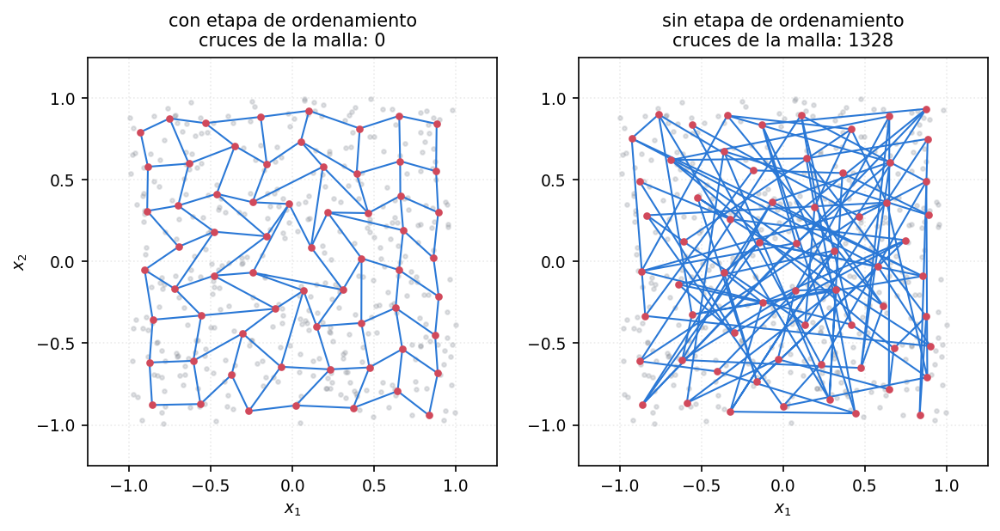

| Corrida | Cruces de la malla consigo misma |
|---|---:|
| Con etapa de ordenamiento ($\Lambda_G: 4 \to 0$) | **0** |
| Sin etapa de ordenamiento ($\Lambda_G = 0$ siempre) | **1328** |

Las dos corridas cuantizan bien el espacio: las 64 neuronas quedan repartidas sobre el cuadrado en los dos casos. Pero sólo la primera está **ordenada**. Sin la etapa de ordenamiento el mapa aprende los datos y **no aprende la topología**, que es lo único que lo distingue de $k$-medias.

> **PARA LA DEFENSA — el número que conviene tener a mano**
> "Sin la primera etapa el mapa cuantiza igual de bien pero queda anudado: la malla se cruza a sí misma 1328 veces contra 0." Es la forma más corta de justificar por qué las tres etapas no son un capricho.

### Claves de la sección 6

| Clave | Qué tenés que poder responder |
|---|---|
| Etapa 1 | $\Lambda_G \approx$ medio mapa, $\eta \in [0{,}7;\,0{,}9]$, 500–1000 épocas |
| Etapa 2 | $\Lambda_G \to 1$ lineal, $\eta \to 0{,}1$, $\approx$1000 épocas |
| Etapa 3 | $\Lambda_G = 0$, $\eta \in [0{,}01;\,0{,}1]$ cte, $\approx$3000 épocas |
| Para qué la etapa 1 | Para el **ordenamiento topológico**; sin ella la malla queda anudada |
| Para qué la etapa 3 | Ajuste fino: cada neurona termina de caer en el centro de su grupo |

---

## 7. Formación de mapas topológicos

*Esta sección entera reconstruye las diapositivas 29 a 36, que son siete viñetas con el enunciado de cada ejemplo y ninguna figura: todo se desarrolló en el pizarrón (transcripciones 004 y 005).*

### Ejemplo 1 — $\mathbb{R}^1 \to \mathbb{R}^1$, 2 neuronas

Una sola entrada escalar, dos neuronas, sin entorno. Cada $\mathbf{w}_j$ tiene un solo peso, así que **datos y pesos viven en la misma recta** y se pueden dibujar juntos. Los patrones están en dos grupos, alrededor de $-1$ y de $+1$; los pesos arrancan al azar en $[-0{,}5;\,0{,}5]$.

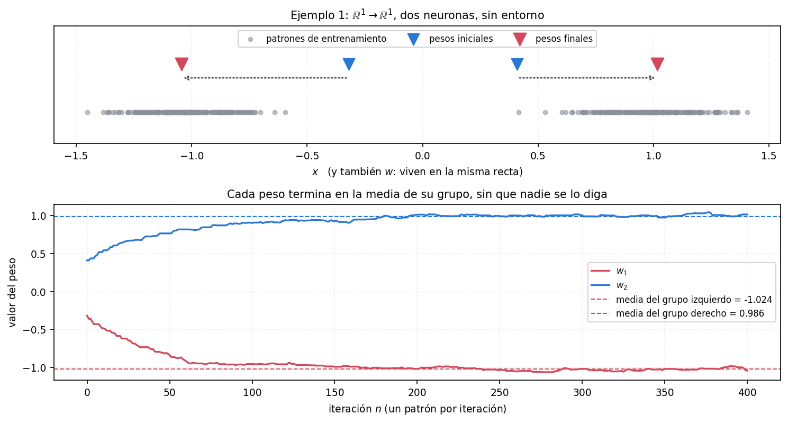

Cuando entra un patrón del grupo derecho gana el peso que esté más cerca, y ese peso se corre un poco hacia la derecha. Como la mayoría de los patrones de ese grupo le van a tocar a la misma neurona, esa neurona **se va corriendo cada vez más hacia el centro del grupo**, y cada vez gana con más frecuencia. El otro peso queda para el otro grupo.

| | $w_1$ | $w_2$ |
|---|---:|---:|
| Valor final tras 400 patrones | $-1{,}045$ | $+1{,}016$ |
| Media real del grupo correspondiente | $-1{,}024$ | $+0{,}986$ |

Cada peso terminó en la media de su grupo con dos centésimas de diferencia, **sin que nadie le dijera cuántos grupos había ni cuál era cuál**. Eso es el aprendizaje no supervisado, y es lo mismo que hacía $k$-medias en la unidad de base radial — sólo que en línea, un patrón por vez.

### Ejemplo 2 y 3 — $\mathbb{R}^2$, 4 neuronas

Con dos entradas, $\mathbf{w}_j = (w_{j1}, w_{j2})$ es un punto del plano y se dibuja igual. Cuatro grupos de patrones, cuatro neuronas **sin entorno**:

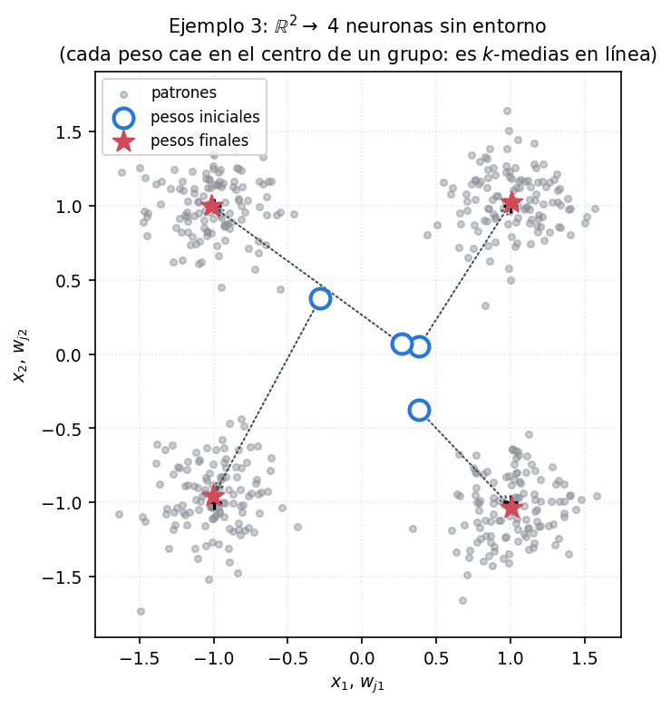

Los cuatro pesos caen en los cuatro centros: el peor de los cuatro quedó a **0,042** del centro de su grupo. Sin entorno, el SOM **es** $k$-medias en línea.

> **OJO — la ganadora no siempre es "la que corresponde", y no importa**
> La clase se detiene en esto: en las primeras iteraciones puede ganar una neurona que no era la esperada, porque los pesos arrancaron en cualquier lado. No pasa nada. Lo que decide el resultado es que **para la mayoría de los patrones de un grupo va a ganar la misma neurona**, y esa mayoría la arrastra al centro. El argumento es estadístico, no determinista.

### Qué agrega el entorno

Ahora sí con vecindad. El ejemplo de la clase: mapa de $2\times2$, neuronas 1 y 2 conectadas entre sí.

Cuando un patrón activa a la 1, como la 1 está conectada con la 2, **también se actualiza la 2**, y al revés. Si los datos que hacen ganar a la 1 están arriba y los que hacen ganar a la 2 también están arriba, las dos van a ser traccionadas hacia arriba **juntas**. Al final, cuando el entorno se apaga, cada una se acomoda en el centro del grupo que le toca — pero ya partiendo de la misma región del espacio.

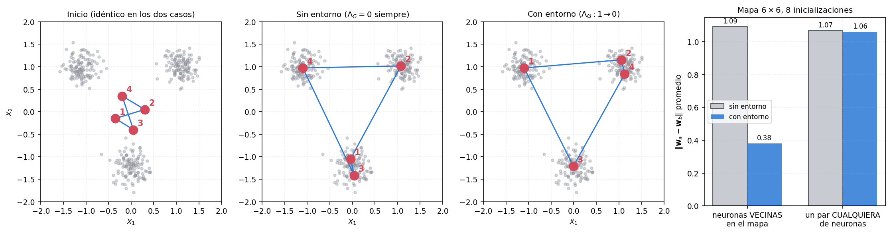

Para medirlo se entrenaron mapas de $6\times6$ sobre datos uniformes, 8 inicializaciones distintas, con y sin entorno, y se comparó la distancia media $\|\mathbf{w}_a - \mathbf{w}_b\|$ entre **neuronas vecinas en el mapa** contra la de **un par cualquiera**:

| | Vecinas en el mapa | Un par cualquiera |
|---|---:|---:|
| Sin entorno | 1,09 | 1,07 |
| Con entorno | **0,38** | 1,06 |

Sin entorno, dos neuronas vecinas en la cuadrícula están **tan lejos entre sí como dos neuronas cualesquiera**: la vecindad del mapa no dice absolutamente nada sobre los datos. Con entorno, las vecinas quedan a un tercio de esa distancia. **Ése es el ordenamiento topológico, y es lo único que aporta el entorno.**

### Ejemplo 4 — $\mathbb{R}^N \to \mathbb{R}^2$: el despliegue del pañuelo

El caso general y la razón práctica de todo el método. Una forma de mirar el resultado: **dibujar cada neurona en el lugar que indican sus pesos y unir con una línea a las que son vecinas en el mapa**. Al principio los pesos son pequeños y al azar, así que se ve una maraña apretada cerca del origen; a medida que el mapa se organiza, esa maraña se despliega **como quien abre un pañuelo**, hasta cubrir todo el espacio que tiene que cubrir.

![Corrida real: mapa $8\times8$, 3000 puntos uniformes en $[-1,1]^2$, $\eta: 0{,}60 \to 0{,}02$, $\Lambda_G: 4 \to 0$.](../imagenes/07-despliegue.png)

Fijate el segundo cuadro: en la etapa de ordenamiento la malla primero **se contrae** y recién después se estira. Es lo esperable — con $\Lambda_G = 4$ sobre un mapa de $8\times8$, casi todas las neuronas se actualizan con casi todos los patrones, así que todos los pesos se van juntos hacia la media de los datos. Sólo cuando el entorno empieza a achicarse cada neurona puede diferenciarse de sus vecinas.

> **IDEA DE FONDO — para qué sirve todo esto**
> El interés práctico del SOM no es agrupar (para eso está $k$-medias). Es que **proyecta un espacio de $\mathbb{R}^N$ que no podés visualizar sobre un mapa de dos dimensiones que sí**, y lo hace conservando la vecindad: patrones parecidos en $\mathbb{R}^{200}$ caen en neuronas cercanas del mapa. Los ejemplos de $\mathbb{R}^2$ se eligen porque se pueden dibujar; el caso que importa es $N=200$.

### Ejemplo 5 — el *phonetic typewriter* (Kohonen)

Mapa **hexagonal**. Se grabó cada fonema del finlandés muchas veces, por distintas personas; de cada grabación sale un vector de análisis en frecuencia, de dimensión alta. Esos vectores se le mostraron al mapa **sin decirle nunca de qué fonema era cada uno**.

Resultado: los fonemas parecidos quedaron agrupados en regiones bien identificadas del mapa — las explosivas por un lado, las vocales por otro. Después Kohonen **etiquetó** cada neurona con el fonema que más veces la había hecho ganar (sección 8). Al pronunciar una palabra, la secuencia de neuronas que se van activando dibuja **un camino sobre el mapa**, y ese camino identifica la palabra.

### Ejemplo 6 — el experimento de los países (Kohonen)

Vector de entrada por país: cantidad de habitantes, superficie, renta per cápita, consumo de proteínas, y así. Todos los países en un archivo, **sin decir cuál era cuál**. El mapa los agrupó, y al pintar el mapa del mundo con el color de la neurona que le tocó a cada país aparecen agrupaciones muy reconocibles: casi toda África de un color, Canadá y EEUU del mismo color, Argentina y México del mismo color.

### Ejemplo 7 — las demos

Las que trae Matlab, y las direcciones web de la diapositiva 37 (Regensburg, HUT, Bochum, y el buscador gnod.net). Sirven para ver el despliegue del pañuelo animado y con estructuras 3D.

### Claves de la sección 7

| Clave | Qué tenés que poder responder |
|---|---|
| Ejemplo 1 | 2 neuronas en $\mathbb{R}^1$: cada peso termina en la media de su grupo |
| Sin entorno | El SOM **es** $k$-medias en línea |
| Con entorno | Vecinas en el mapa $\to$ vectores de peso cercanos: ordenamiento topológico |
| El pañuelo | La malla arranca apretada, se contrae, y se despliega hasta cubrir el espacio |
| Para qué sirve | Proyectar $\mathbb{R}^N$ sobre un mapa 2D **conservando la vecindad** |
| Phonetic typewriter | Mapa hexagonal de fonemas; cada palabra es un camino sobre el mapa |

---

## 8. Agrupamiento y clasificación

La pregunta de la diapositiva 38: **¿cómo se usa un SOM para clasificar patrones?** Porque hasta acá es un método de agrupamiento no supervisado, como $k$-medias: nunca le dijimos qué queríamos a la salida.

Tres pasos:

1. **Entrenamiento no supervisado.** El SOM normal, sin usar las clases. (En principio es una desventaja: estamos tirando información que tenemos.)
2. **Etiquetado de neuronas.** Ahora sí se usan las clases. Se le muestran **todos** los patrones y se cuenta, para cada neurona, con cuántos patrones de cada clase ganó. A cada neurona se le pone la etiqueta de la clase **mayoritaria**.
3. **Clasificación por mínima distancia.** Ante un patrón desconocido se busca la ganadora y se responde **su etiqueta**.

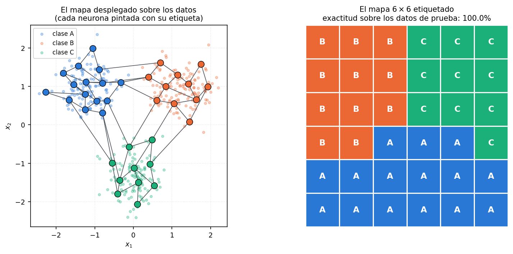

En esa corrida el mapa quedó ordenado: las 36 neuronas se etiquetaron todas (ninguna quedó muerta) y las etiquetas forman **tres regiones conexas** en la cuadrícula — no están salpicadas. Sobre los 180 patrones de prueba, que el mapa no vio nunca, la exactitud fue **100 %**.

> **IDEA DE FONDO — las regiones conexas son la prueba del ordenamiento**
> Que las A, las B y las C queden en zonas contiguas del mapa **no lo pidió nadie**: el etiquetado se hace neurona por neurona, sin mirar a las vecinas. Sale así porque el ordenamiento topológico ya puso a las neuronas vecinas sobre datos parecidos. Si el mapa saliera con las etiquetas mezcladas, eso sería el síntoma de que la etapa de ordenamiento falló.

> **OJO — el etiquetado es supervisado, el entrenamiento no**
> El SOM etiquetado **no** es un método supervisado: la supervisión aparece **después** del entrenamiento, y durante el entrenamiento se perdió la información de clase. Ésa es exactamente la crítica que motiva LVQ (sección 10), que usa las clases **desde la primera iteración**.

### Claves de la sección 8

| Clave | Qué tenés que poder responder |
|---|---|
| Los tres pasos | Entrenar no supervisado / etiquetar por mayoría / clasificar por mínima distancia |
| Cuándo entran las clases | Sólo en el paso 2, después del entrenamiento |
| Neurona muerta | La que nunca gana: se queda sin etiqueta |
| Señal de buen mapa | Las etiquetas forman regiones conexas sobre la cuadrícula |

---

## 9. Cuantización vectorial: los conceptos

**Cuantizar** es partir un rango continuo en una cantidad finita de valores (*cuantos*), porque en una computadora no hay resolución infinita: hay 8, 16 o 32 bits.

- **Cuantizador escalar:** se cuantiza un eje. Una señal muestreada y llevada a niveles discretos.
- **Cuantizador vectorial:** se cuantiza un **espacio**. El ejemplo más claro es una foto: cada región del plano queda representada por un píxel. Cuando una imagen "está pixelada" es porque los cuantos son demasiado grandes.

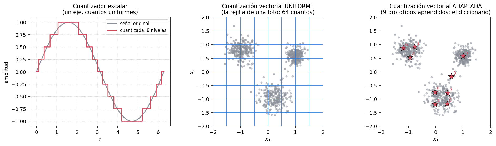

Lo interesante es que **no hace falta cuantizar de manera uniforme**. En algunas regiones del espacio hay muchos datos y conviene detalle; en otras no aparece nunca nada y gastar cuantos ahí es tirar bits. De ahí la idea de **cuantización vectorial adaptada a los datos**, que es lo que aprenden estos algoritmos.

**Terminología** (la misma cosa con otros nombres, para poder leer la bibliografía):

| En redes neuronales | En cuantización vectorial |
|---|---|
| vector de pesos $\mathbf{w}_j$ | **centroide** o **prototipo** $\mathbf{m}_i$ |
| el conjunto de neuronas | **diccionario** o ***code-book*** |
| velocidad de aprendizaje $\eta$ | $\alpha$ |
| (no hay neuronas en LVQ) | los prototipos están sueltos en el espacio |

**El proceso de cuantización: de vectores a números enteros.** Ésa es la frase de la diapositiva y vale la pena desarmarla, porque explica para qué sirve. Se parte una imagen en zonas; para cada zona se busca el prototipo del diccionario que más se le parece; y **se guarda solamente el índice de ese prototipo**, un entero, en lugar de todos los píxeles de la zona. Para descomprimir se vuelve a poner el prototipo. Es compresión **con pérdida**: el prototipo es una especie de promedio de todas las zonas parecidas (una curva, un borde), no la zona original.

**Tres maneras de entrenar un cuantizador**, en orden de cuánta información de clase usan:

1. **$k$-medias etiquetado.** No supervisado, y después se etiqueta.
2. **SOM etiquetado.** Ídem, con la ventaja del ordenamiento topológico. Es la sección 8.
3. **LVQ.** Supervisado **desde el entrenamiento**.

### Claves de la sección 9

| Clave | Qué tenés que poder responder |
|---|---|
| Escalar vs. vectorial | Se cuantiza un eje vs. se cuantiza un espacio |
| Por qué adaptar | Más detalle donde hay datos, ningún cuanto donde no hay |
| Diccionario / *code-book* | El conjunto de prototipos |
| Para qué sirve | Compresión con pérdida: se guarda el **índice** del prototipo |
| Tres formas de entrenarlo | $k$-medias etiquetado, SOM etiquetado, LVQ |

---

## 10. El algoritmo LVQ1

**1. Inicialización aleatoria.** Valores pequeños al azar, o copiando patrones del conjunto de entrenamiento (igual que el SOM). Cada prototipo **tiene asignada una clase desde el principio**: se pone al menos uno por clase, y varios por clase si la distribución es complicada.

**2. Selección.**

$$c(n) = \arg\min_i \left\{ \left\| \mathbf{x}(n) - \mathbf{m}_i(n) \right\| \right\}$$

**3. Adaptación.**

$$\mathbf{m}_c(n+1) = \mathbf{m}_c(n) + s(c,d,n)\,\alpha \left[ \mathbf{x}(n) - \mathbf{m}_c(n) \right]$$

$$s(c,d,n) =
\begin{cases}
+1 & \text{si } \mathcal{C}(c(n)) = d(n) \\[2pt]
-1 & \text{si } \mathcal{C}(c(n)) \neq d(n)
\end{cases}$$

**4. Volver a 2** hasta satisfacer el error de clasificación.

> **OJO — errata de la cátedra (errata 025, 7'58")**
> La diapositiva escribe la condición como $c(n) = d(n)$ y **está mal**. $c(n)$ es el **índice del prototipo ganador** y $d(n)$ es la **clase** del patrón: son cosas de distinto tipo, no se pueden comparar ($\mathbf{m}_{c}$ es un vector de $\mathbb{R}^N$, como los datos). Lo que tiene que coincidir con $d(n)$ es $\mathcal{C}(c(n))$, **la clase del prototipo ganador**. En este apunte ya está escrito corregido.

La regla dice: **si el prototipo ganador es de la clase correcta, acercalo al patrón; si no, alejalo.**

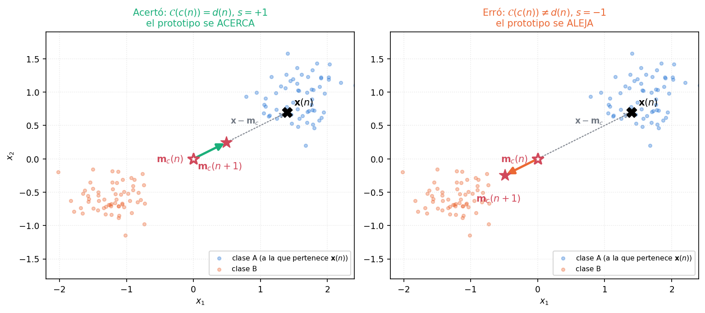

**Observaciones de la cátedra** (diapositivas 47 a 50):

- **No hay arquitectura neuronal.** No hay neuronas ni conexiones: hay prototipos sueltos en el espacio, cada uno puede ir a donde quiera. Es la diferencia central con el SOM.
- Se puede ver al cuantizador como **un SOM lineal, sin entorno y supervisado**.
- Quedan planteadas dos preguntas sobre la velocidad de aprendizaje: ¿existe un $\alpha_c$ óptimo **para cada centroide**? ¿y un $\alpha_c(n)$ óptimo **para cada instante**? (Sección 12.)

### Verificación: LVQ1 corriendo de verdad

Dos clases, una de ellas partida en dos nubes separadas (para que un solo prototipo por clase no alcance), 2 prototipos por clase, $\alpha_0 = 0{,}30$ decayendo un 8 % por época, 40 épocas.

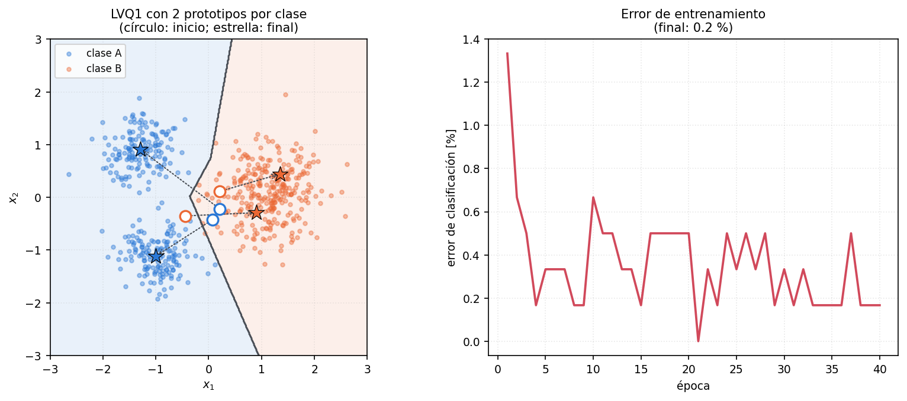

El error de clasificación sobre el conjunto de entrenamiento baja de **1,33 %** a **0,17 %**, y los cuatro prototipos terminan uno en cada nube. La frontera que arman es **lineal a trozos**: es la frontera de las regiones de Voronoi de los prototipos, y ahí está el límite del método — con $P$ prototipos no se pueden dibujar fronteras más complicadas que eso.

> **PARA LA DEFENSA — cuántos prototipos por clase**
> Es la pregunta natural y la respuesta está en esta figura. Con **un** prototipo por clase, la clase A (dos nubes separadas) habría quedado representada por un punto en el medio de las dos, que no es ninguna de las dos. Con dos por clase, cada nube tiene el suyo. La regla: **tantos prototipos por clase como "pedazos" tenga esa clase en el espacio**, y como eso no se sabe de antemano, se prueba.

### Claves de la sección 10

| Clave | Qué tenés que poder responder |
|---|---|
| Los 4 pasos | Inicializar / elegir ganador / acercar o alejar / repetir |
| $s(c,d,n)$ | $+1$ si acertó la clase, $-1$ si no |
| La errata | Va $\mathcal{C}(c(n)) = d(n)$, no $c(n)=d(n)$ |
| Vs. SOM | Sin arquitectura, sin entorno, y supervisado desde el entrenamiento |
| Frontera que produce | Lineal a trozos: las celdas de Voronoi de los prototipos |

---

## 11. SOM y LVQ, lado a lado

| | SOM | LVQ1 |
|---|---|---|
| Supervisión | **Ninguna** durante el entrenamiento | **Desde la primera iteración** |
| Arquitectura | Neuronas en un plano, con vecindad | **No hay**: prototipos sueltos |
| Entorno $\Lambda_G$ | Sí, y decreciente | **No existe** |
| Quién se actualiza | Ganadora **+ entorno** | **Sólo el ganador** |
| Sentido del ajuste | **Siempre acerca** | Acerca si acertó, **aleja si erró** |
| Corte | Sin cambios significativos en el mapa | Error de clasificación satisfactorio |
| Qué produce | Un mapa **ordenado topológicamente** | Un diccionario de prototipos etiquetados |
| Se usa para clasificar | Etiquetando después | Directamente |

> **IDEA DE FONDO — una sola ecuación con dos interruptores**
> $\mathbf{m}_c \mathrel{+}= s\,\alpha\,(\mathbf{x} - \mathbf{m}_c)$ es la ecuación del SOM con dos cambios: se le sacó el entorno (sólo se actualiza el ganador) y se le agregó el signo $s$. Poné $s=+1$ siempre y $\Lambda_G=0$ y tenés $k$-medias en línea. Agregale entorno y tenés el SOM. Agregale el signo en vez del entorno y tenés LVQ1. **Los tres algoritmos de la unidad son la misma línea de código con dos interruptores.**

---

## 12. LVQ1-O: la velocidad de aprendizaje óptima

Ésta es la parte que la cátedra deja **como ejercicio** ("Demostrar que…", diapositiva 62). Va completa.

### El problema

Partimos de la regla de adaptación y la desarmamos:

$$\mathbf{m}_c(n+1) = \mathbf{m}_c(n) + s(n)\alpha(n) \left[ \mathbf{x}(n) - \mathbf{m}_c(n) \right]$$

$$\mathbf{m}_c(n+1) = \mathbf{m}_c(n) + s(n)\alpha(n)\mathbf{x}(n) - s(n)\alpha(n)\mathbf{m}_c(n)$$

$$\boxed{\;\mathbf{m}_c(n+1) = \left[ 1 - s(n)\alpha(n) \right] \mathbf{m}_c(n) + s(n)\alpha(n)\,\mathbf{x}(n)\;}$$

Escrita así se lee sola: el prototipo nuevo es una **combinación** del prototipo viejo y del patrón que acaba de entrar, con pesos $[1-s\alpha]$ y $s\alpha$.

Ahora expandimos un paso más, reemplazando $\mathbf{m}_c(n)$ por lo que valía según la misma ecuación una iteración antes:

$$\mathbf{m}_c(n+1) = \left[ 1 - s(n)\alpha(n) \right]
\Big\{ \mathbf{m}_c(n-1) + s(n-1)\alpha(n-1)\left[\mathbf{x}(n-1) - \mathbf{m}_c(n-1)\right] \Big\}
+ s(n)\alpha(n)\mathbf{x}(n)$$

Y ahí está lo que había que ver: **$\mathbf{x}(n-1)$ queda afectado dos veces por $\alpha$** — una vez por el $\alpha(n-1)$ con el que entró, y otra por el factor $[1-s(n)\alpha(n)]$ de la iteración siguiente. $\mathbf{x}(n)$, en cambio, está multiplicado por una sola $\alpha$.

Si $\alpha$ es constante y menor que 1, esto se repite en cascada: el penúltimo patrón lleva dos factores, el antepenúltimo tres, y así. **La importancia relativa de los primeros patrones de entrenamiento siempre será menor que la de los últimos.** Con $\alpha = 0{,}5$, un patrón que entró dos iteraciones atrás influye $0{,}25$; diez iteraciones atrás, $10^{-3}$. El centroide **se olvida rápido** de lo que se le mostró primero, y su valor final depende casi sólo del final del archivo — que es un orden arbitrario.

> **IDEA DE FONDO — el problema no es la velocidad, es la equidad**
> No estamos buscando que converja más rápido. Estamos buscando que el prototipo final sea **el promedio de su grupo** y no un promedio con memoria corta. Que todos los patrones pesen igual es lo que hace que $\mathbf{m}_c$ sea un centroide de verdad.

### La condición

Si queremos que $\alpha$ afecte por igual a todos los patrones, tiene que decrecer con el tiempo, y de forma tal que **el peso efectivo del patrón anterior siga siendo el mismo que el del patrón actual**:

$$\underbrace{\alpha_c(n)}_{\text{peso de } \mathbf{x}(n)} = \underbrace{\left[ 1 - s(n)\alpha_c(n) \right] \alpha_c(n-1)}_{\text{peso de } \mathbf{x}(n-1) \text{ después de este paso}}$$

### La demostración (esto es lo que hay que saber hacer en el pizarrón)

Partimos de la condición y despejamos $\alpha_c(n)$:

$$\alpha_c(n) = \left[ 1 - s(n)\alpha_c(n) \right] \alpha_c(n-1)$$

Distribuimos el lado derecho:

$$\alpha_c(n) = \alpha_c(n-1) - s(n)\,\alpha_c(n)\,\alpha_c(n-1)$$

Pasamos a la izquierda todo lo que tiene $\alpha_c(n)$:

$$\alpha_c(n) + s(n)\,\alpha_c(n)\,\alpha_c(n-1) = \alpha_c(n-1)$$

Sacamos $\alpha_c(n)$ de factor común:

$$\alpha_c(n)\left[ 1 + s(n)\,\alpha_c(n-1) \right] = \alpha_c(n-1)$$

Y despejamos:

$$\boxed{\;\alpha_c(n) = \frac{\alpha_c(n-1)}{1 + s(n)\,\alpha_c(n-1)}\;}$$

que es lo que había que demostrar. Con la advertencia de la cátedra: **no sobrepasar $\alpha > 1$**.

> **OJO — de dónde sale la advertencia de $\alpha > 1$**
> Es el caso $s(n) = -1$ (el prototipo erró). Ahí el denominador es $1 - \alpha_c(n-1)$, que es **menor que 1**, así que la fracción **hace crecer** a $\alpha$. Si se acumulan errores seguidos, $\alpha$ se dispara por encima de 1 y el prototipo empieza a pasarse de largo del patrón en cada corrección: el algoritmo se vuelve inestable. Por eso se satura. Ésta es la razón concreta de la nota, y es una buena pregunta de parcial.

> **OJO — hay un $\alpha_c$ por prototipo, no uno solo**
> El subíndice $c$ no es decorativo: cada prototipo lleva **su propio** $\alpha_c$, y se actualiza sólo en las iteraciones en las que **ese** prototipo gana. Es la respuesta a la primera de las dos preguntas de la diapositiva 50 ("¿existe un $\alpha_c$ óptimo para cada centroide?"): sí, y es esta recursión.

### Verificación numérica

Con $s(n) = +1$ siempre (el caso limpio), la recursión tiene forma cerrada:

$$\alpha_c(n) = \frac{\alpha_0}{1 + \alpha_0 (n-1)}$$

que se comprueba por inducción y se verifica en la figura: arrancando en $\alpha_0 = 0{,}9$ da $0{,}9$, $0{,}474$, $0{,}321$, …, $0{,}099$ en $n=10$. **$\alpha$ decae como $1/n$**, que es exactamente el ritmo con el que decae el peso de un dato nuevo en un promedio corrido.

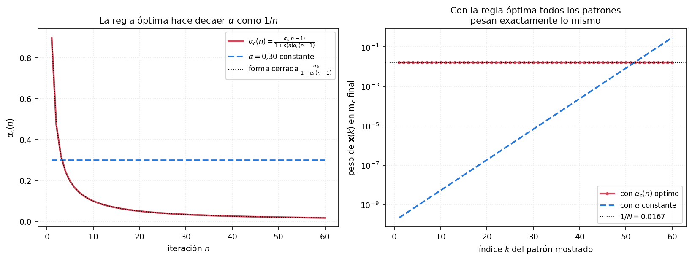

Se calculó el **peso efectivo** de cada patrón $\mathbf{x}(k)$ en el prototipo final tras 60 presentaciones, o sea $\alpha(k)\prod_{j>k}[1-\alpha(j)]$:

| | Peso del primer patrón | Peso del último | Relación |
|---|---:|---:|---:|
| $\alpha = 0{,}30$ constante | $2{,}2 \times 10^{-10}$ | $0{,}300$ | $1{,}4 \times 10^{9}$ |
| $\alpha_c(n)$ óptimo | $0{,}016636$ | $0{,}016636$ | **1,000000** |

Con $\alpha$ constante el último patrón pesa **mil cuatrocientos millones de veces** más que el primero. Con la regla óptima todos pesan exactamente lo mismo, hasta el último dígito. La demostración funciona.

### Claves de la sección 12

| Clave | Qué tenés que poder responder |
|---|---|
| El problema | Con $\alpha$ cte, los primeros patrones pesan mucho menos que los últimos |
| La forma útil de la regla | $\mathbf{m}_c(n+1) = [1-s\alpha]\mathbf{m}_c(n) + s\alpha\,\mathbf{x}(n)$ |
| La condición | $\alpha_c(n) = [1-s(n)\alpha_c(n)]\,\alpha_c(n-1)$ |
| El resultado | $\alpha_c(n) = \dfrac{\alpha_c(n-1)}{1+s(n)\alpha_c(n-1)}$ |
| Por qué saturar en 1 | Con $s=-1$ el denominador es $<1$ y $\alpha$ crece |
| Uno por prototipo | Cada $\mathbf{m}_c$ lleva su $\alpha_c$, y sólo se actualiza cuando gana |

---

## 13. Cuatro desarrollos para el pizarrón

Los cuatro que conviene tener practicados, con los puntos donde uno se traba.

### D1 — El algoritmo de entrenamiento del SOM, de memoria

**Llegás a:** los cuatro pasos, con la ecuación de adaptación partida en dos casos según el entorno.

**Trampa:** escribir la adaptación sin el caso "si $y_j \notin \Lambda_G(n)$". El enunciado tiene dos ramas y la segunda dice *no hagas nada*; si la olvidás, el desarrollo queda igual al de $k$-medias.

**Trampa 2:** poner $\arg\max$. Es un **mínimo** de distancia.

### D2 — Por qué la vecindad produce el ordenamiento topológico

**Llegás a:** el argumento de las dos neuronas conectadas. Si $j$ y $k$ son vecinas **en el mapa**, cada vez que gana una se actualiza la otra; entonces las dos son traccionadas hacia las mismas regiones de $\mathbb{R}^N$; entonces $\mathbf{w}_j$ y $\mathbf{w}_k$ terminan cerca **en el espacio de entrada**. Cuando el entorno se apaga, cada una se acomoda en su grupo, pero ya dentro de la misma zona.

**Checkpoint:** decir explícitamente **en qué espacio se mide cada cosa**. Si no lo decís, el argumento no se entiende.

**Trampa:** afirmar que el entorno mejora el agrupamiento. **No lo mejora**: sin entorno los pesos también caen en los centros de los grupos (ejemplo 3, error 0,042). Lo único que agrega el entorno es el **orden**.

### D3 — La forma "combinación convexa" de la regla de adaptación

**Llegás a:** $\mathbf{m}_c(n+1) = [1 - s\alpha]\,\mathbf{m}_c(n) + s\alpha\,\mathbf{x}(n)$, distribuyendo y agrupando.

**Trampa:** perder el signo al agrupar los dos términos en $\mathbf{m}_c(n)$. Sale $\mathbf{m}_c(n)(1 - s\alpha)$, con el $1$ del término original.

**Para qué sirve:** de acá salen las dos cosas de la sección 12 — la expansión que muestra el doble $\alpha$, y la condición de equidad.

### D4 — La velocidad de aprendizaje óptima

**Llegás a:** $\alpha_c(n) = \dfrac{\alpha_c(n-1)}{1 + s(n)\alpha_c(n-1)}$, en cuatro renglones: distribuir, pasar, factor común, despejar.

**Trampa:** arrancar mal la condición. Del lado izquierdo va $\alpha_c(n)$ **solo** (el peso del patrón actual); del derecho, $\alpha_c(n-1)$ **multiplicado por el factor de olvido** $[1-s(n)\alpha_c(n)]$. Si escribís el factor con $\alpha_c(n-1)$ adentro no cierra.

**Checkpoint:** verificá con $s=+1$ y $\alpha_0 = 0{,}9$: tiene que dar $0{,}9/1{,}9 = 0{,}474$.

---

## 14. Formulario

**SOM — ganadora**

$$j^*(n) = G(\mathbf{x}(n)) = \arg\min_{\forall j}\left\{\|\mathbf{x}(n) - \mathbf{w}_j(n)\|\right\}$$

**SOM — adaptación**

$$\mathbf{w}_j(n+1) =
\begin{cases}
\mathbf{w}_j(n) + \eta(n)\left(\mathbf{x}(n) - \mathbf{w}_j(n)\right) & y_j \in \Lambda_G(n) \\
\mathbf{w}_j(n) & y_j \notin \Lambda_G(n)
\end{cases}$$

**Excitación lateral uniforme**

$$\Lambda_G(n)=2 \Rightarrow
\begin{cases} h_{G,i} = \beta(n) & |G-i| \le 2 \\ h_{G,i} = 0 & |G-i| > 2 \end{cases}$$

**Excitación lateral gaussiana**

$$h_{G,i} = \beta(n)\,e^{-\frac{|G-i|^2}{2\sigma^2(n)}}$$

**Las tres etapas**

| Etapa | $\Lambda_G$ | $\eta$ | Épocas |
|---|---|---|---|
| Ordenamiento | $\approx$ medio mapa | 0,9 – 0,7 | 500 – 1000 |
| Transición | $\to 1$, lineal | $\to 0{,}1$, lineal o exp. | $\approx$ 1000 |
| Ajuste fino | $0$ | 0,1 – 0,01, cte | $\approx$ 3000 |

**LVQ1 — ganador y adaptación**

$$c(n) = \arg\min_i\left\{\|\mathbf{x}(n)-\mathbf{m}_i(n)\|\right\}$$

$$\mathbf{m}_c(n+1) = \mathbf{m}_c(n) + s(c,d,n)\,\alpha\left[\mathbf{x}(n)-\mathbf{m}_c(n)\right],
\qquad
s = \begin{cases} +1 & \mathcal{C}(c(n)) = d(n) \\ -1 & \mathcal{C}(c(n)) \neq d(n)\end{cases}$$

**LVQ1 — forma combinación**

$$\mathbf{m}_c(n+1) = \left[1 - s(n)\alpha(n)\right]\mathbf{m}_c(n) + s(n)\alpha(n)\,\mathbf{x}(n)$$

**LVQ1-O — velocidad óptima**

$$\alpha_c(n) = \left[1 - s(n)\alpha_c(n)\right]\alpha_c(n-1)
\qquad\Longrightarrow\qquad
\alpha_c(n) = \frac{\alpha_c(n-1)}{1 + s(n)\,\alpha_c(n-1)}$$

---

## 15. Errores típicos

1. **Confundir los dos espacios.** La vecindad se mide en el mapa; la distancia que elige la ganadora, en $\mathbb{R}^N$. Es el error número uno de toda la unidad.
2. **Creer que el entorno sirve para agrupar mejor.** Sirve para **ordenar**. Sin entorno el agrupamiento es igual de bueno (y es $k$-medias).
3. **Decir que el SOM es supervisado porque se puede clasificar con él.** El entrenamiento es no supervisado; el etiquetado viene **después**.
4. **Escribir $c(n) = d(n)$ en LVQ.** Va $\mathcal{C}(c(n)) = d(n)$: la **clase** del prototipo ganador. Está en la errata 025.
5. **Poner entorno en LVQ.** No hay. No hay ni siquiera arquitectura neuronal: son prototipos sueltos.
6. **Olvidar la segunda rama de la adaptación del SOM** (las de afuera del entorno **no se tocan**).
7. **Mezclar épocas con iteraciones** al citar las duraciones de las tres etapas.
8. **Decir que $\Lambda_G=2$ son 2 neuronas por lado en diagonal también.** Son las 24 de alrededor: distancia de Chebyshev, un cuadrado.
9. **Dejar $\alpha$ constante en LVQ y decir que converge al centroide.** Converge a algo dominado por los últimos patrones: relación $1{,}4\times10^9$ entre el último y el primero.
10. **Olvidar el subíndice $c$ en $\alpha_c$.** Hay uno por prototipo, y sólo avanza cuando ese prototipo gana.

---

## 16. Autoevaluación

Si podés responder estas doce sin mirar, la unidad está.

1. Definí auto-organización y dá el ejemplo biológico del que salen estas redes.
2. Dibujá la arquitectura del SOM. ¿Cuántas capas tiene? ¿Qué es $\mathbf{w}_j$ y en qué espacio vive?
3. ¿Por qué se dice que es una red **competitiva**? Escribí la ecuación de la ganadora.
4. Dibujá una vecindad cuadrada de radio 1 y una de radio 2. ¿Cuántas neuronas hay en cada una?
5. Escribí las tres funciones de excitación lateral. ¿Cuál se usa en la práctica y por qué la otra es la interesante biológicamente?
6. Escribí los cuatro pasos del entrenamiento. ¿Qué pasa con las neuronas que no están en el entorno?
7. Nombrá las tres etapas con sus valores de $\Lambda_G$, $\eta$ y duración. ¿Qué pasa si te salteás la primera?
8. Explicá con dos neuronas por qué la vecindad produce ordenamiento topológico. ¿En qué espacio se mide cada distancia?
9. ¿Cuál es el interés práctico de un SOM, si $k$-medias ya agrupa? Contá el *phonetic typewriter*.
10. ¿Cómo se usa un SOM para clasificar? ¿En qué paso entran las clases?
11. Escribí LVQ1 completo. ¿Qué significa $s(c,d,n)$ y cuál es la errata de la diapositiva?
12. Demostrá que $\alpha_c(n) = \alpha_c(n-1)/[1+s(n)\alpha_c(n-1)]$ y explicá por qué no puede pasar de 1.
