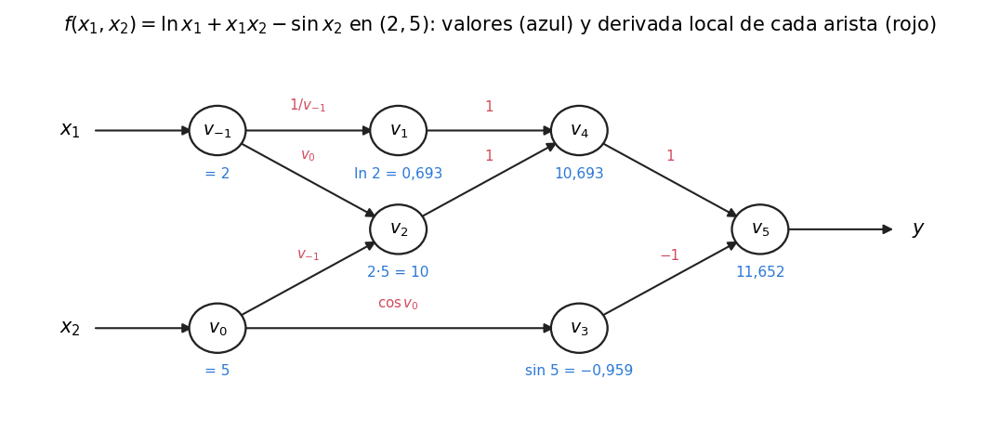
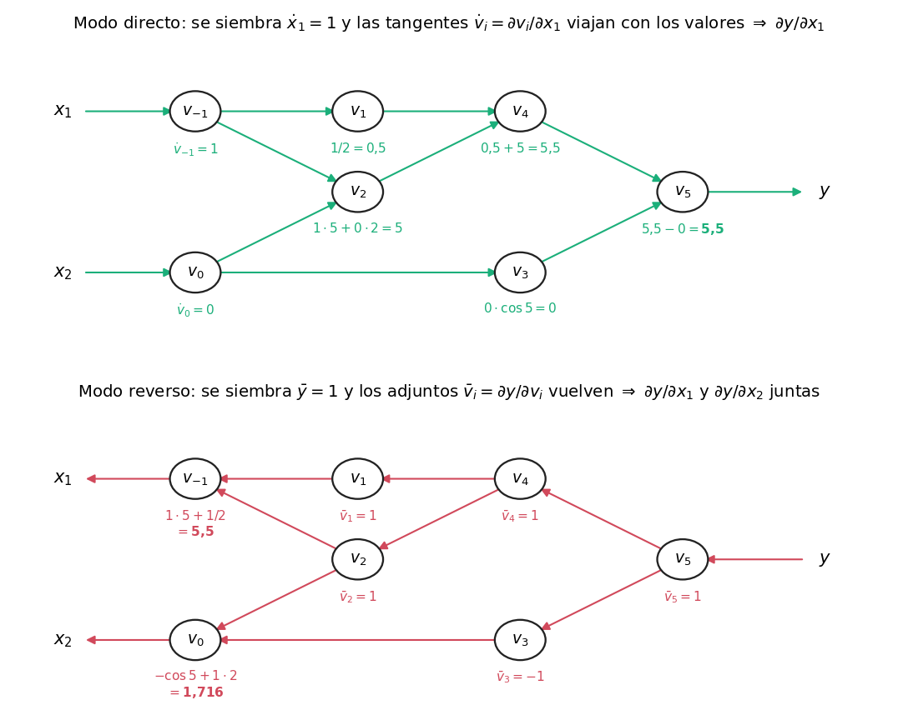
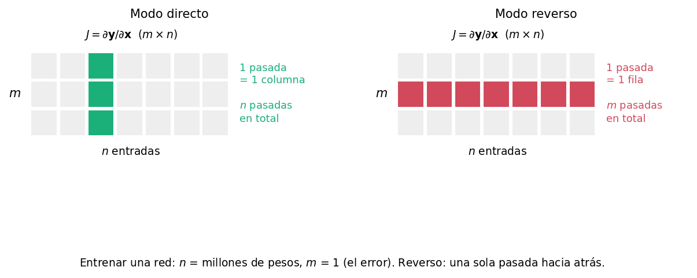
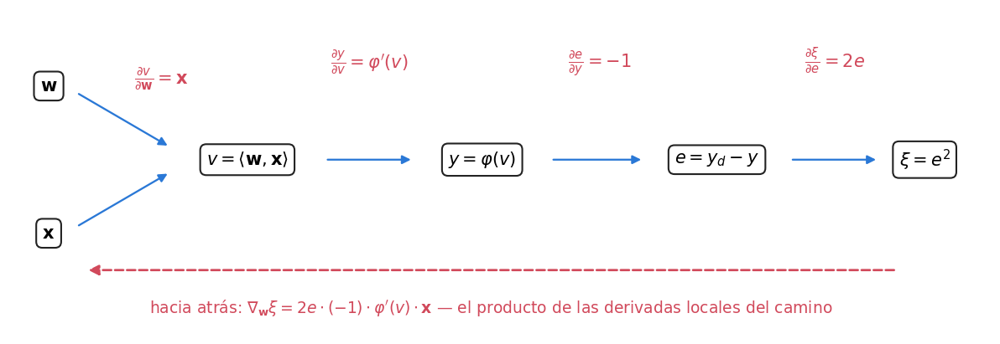
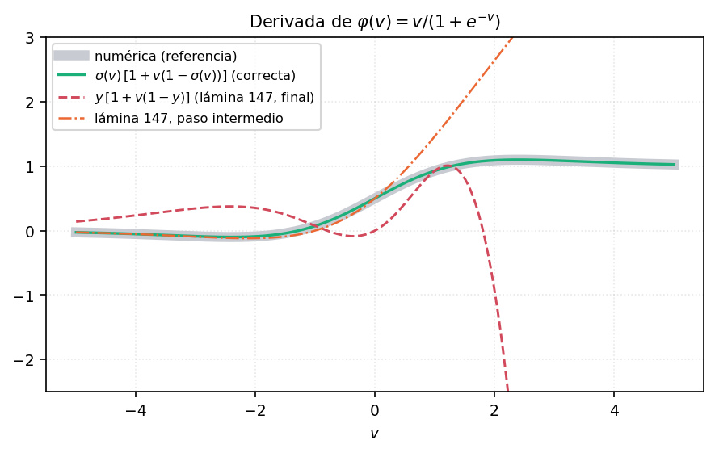
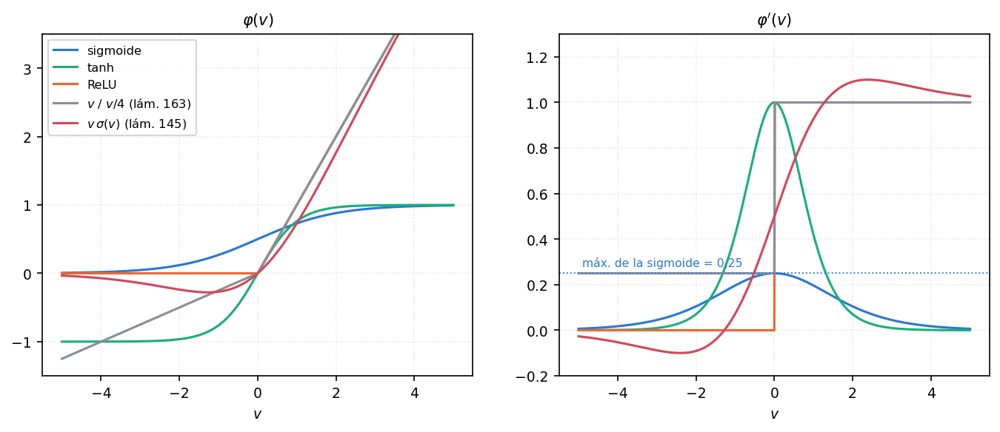

*Notación: se sigue la de las láminas. $\mathbf{w}$ es el vector de pesos con el umbral adentro ($x_0=-1$, $w_0$ el sesgo), $v = \langle \mathbf{w},\mathbf{x}\rangle$ la salida lineal, $y=\varphi(v)$ la salida de la neurona, $y_d$ la salida deseada y $\xi(n)$ el error instantáneo. En la parte de derivación automática aparecen tres notaciones nuevas: $v_i$ son los **valores intermedios** del cálculo (no las salidas lineales de una neurona: es otra $v$, la del paper de Baydin), $\dot v_i$ son las **tangentes** del modo directo y $\bar v_i$ los **adjuntos** del modo reverso.*

*Sobre las fuentes. Las ocho transcripciones son subtítulos automáticos de la charla grabada en video y no sirven para reconstruir nada: sólo confirman el orden de los temas. Además, esa charla es la versión de 2019 de las diapositivas, que repasa el perceptrón y la retropropagación (ya están en la unidad 01) y no tiene la última parte. Este apunte sigue las **diapositivas de 2026**. El énfasis se tomó de cómo están armadas las láminas: el desarrollo paso a paso del mapa logístico, las tablas de los modos directo y reverso, y el mismo entrenamiento escrito cuatro veces, primero a mano y después con $\partial P$.*

*Todas las figuras son reconstrucciones propias. Los números salen de `../imagenes/graficos_profundo.py`, que además trae un motor de derivación automática de 60 líneas (sección 9) con el que se verificaron **todas** las derivadas del apunte. Hay cuatro erratas en las láminas (§12 y §13), todas verificadas numéricamente.*

---

## 1. El mapa: dónde queda el aprendizaje profundo

La clase arranca ubicando todo lo que se vio en la materia dentro de un mapa más grande. No hay nada que derivar acá, pero es la pregunta de apertura típica: *«¿qué cambia con el aprendizaje profundo respecto de lo que ya vimos?»*.

**Métodos clásicos de aprendizaje automático** (láminas 3 a 5):

| Tipo | Tarea | Métodos que nombra la cátedra |
|---|---|---|
| Supervisados | Clasificación | Naive Bayes, SVM, árboles de decisión, $k$-NN |
| | Regresión | Regresión lineal, regresión logística |
| No supervisados | Agrupamiento (*clustering*) | $k$-medias, DBSCAN |
| | Reducción dimensional | PCA, factorización de matrices no negativas |
| Por refuerzo | | |

**Procesos de aprendizaje** (láminas 6 a 9). Hay dos ejes que no hay que mezclar:

- **Tipos de aprendizaje** (qué información hay): supervisado, no supervisado, por refuerzo, híbridos.
- **Reglas de aprendizaje** (cómo se cambian los pesos): por **corrección de error** (perceptrón, retropropagación), **competitivo** (SOM, LVQ), **hebbiano** (Hopfield), **Boltzmann**.

Y *«muchos más»*: semi-supervisado, auto-supervisado, transductivo, *online*, activo, multi-tarea, *zero/one/few-shot*, adversarial generativo, federado, transferencia, destilación de conocimiento… La lámina no desarrolla ninguno. Sólo uno vuelve después: el **auto-supervisado**, como remedio del desvanecimiento del gradiente (§2).

**Arquitecturas** (láminas 10 a 17):

| | Tradicionales | Profundas |
|---|---|---|
| Hacia adelante | Perceptrón simple, multicapa, base radial | DBN, CNN (LeNet, AlexNet, VGG, U-Net, ResNet, DenseNet, GCN…) |
| Recurrentes | Kohonen, Hopfield, Boltzmann, Elman/Jordan, ART | GRU, LSTM, atención, *transformers* |
| Otros | Parcialmente recurrentes o conectadas, modulares | GAN, aprendizaje por refuerzo profundo, *deep learning* bayesiano, *normalizing flows*, modelos de difusión |

> **OJO — el SOM está en la fila de las recurrentes**
> La lámina 12 pone las redes de Kohonen entre las **recurrentes**, por las conexiones laterales entre neuronas del mapa (la función de excitación lateral de la unidad 05). En la práctica el algoritmo que se implementa no tiene realimentación, pero la clasificación de la cátedra es ésa. Si te preguntan, citá la lámina y aclarás el porqué.

Las láminas 18 a 25 son una línea de tiempo (del perceptrón de los '50 a los *transformers* y la difusión) y los retratos de Hinton, Bengio y LeCun, los tres del premio Turing 2018. Son contexto: no se desarrolla nada.

### Claves de la sección 1

| Clave | Qué tenés que poder responder |
|---|---|
| Tipo vs. regla | Tipo = qué información hay; regla = cómo se ajustan los pesos |
| Ubicar lo visto | Perceptrón y MLP: supervisado y corrección de error. SOM: no supervisado y competitivo. Hopfield: hebbiano |
| Profundas | Hacia adelante (CNN), recurrentes (LSTM, *transformers*) y otros (GAN, difusión) |

---

## 2. ¿Qué pasa si conectamos *muuuchas* neuronas?

Es **la** lámina de la parte introductoria (lámina 34, que se arma de a una línea entre la 26 y la 34). Son cuatro problemas, cada uno con su remedio:

| Problema | Remedio (lo que lo destrabó) |
|---|---|
| Hacen falta **muchísimos datos** para entrenar | La revolución de los **grandes datos** |
| **Alto costo computacional** | Las **GPU** (unidades de procesamiento gráfico) |
| **Desvanecimiento del gradiente** | Pre-entrenamiento **auto-supervisado**, **normalización por lotes** y otros «condimentos»: **ReLU**, *dropout*, *pooling*… |
| **Dificultad para obtener los gradientes** en modelos complejos y programarlos a gran escala | **Programación diferenciable** $\partial P$ |

El cuarto es el tema del resto de la clase. El tercero es el que más se pregunta, porque sale directo de la retropropagación que ya sabés.

### El desvanecimiento del gradiente, desde la retropropagación

En la unidad 01 el gradiente local de una neurona oculta de la capa $p$ se obtenía de los de la capa siguiente:

$$\delta_j^{(p)} = \Big(\sum_k \delta_k^{(p+1)}\, w_{kj}^{(p+1)}\Big)\;\varphi'\big(v_j^{(p)}\big)$$

Si se desenrolla esa recursión desde la salida hasta la capa 1, el $\delta$ de la capa 1 queda como una **suma de productos**: cada producto tiene un factor $\varphi'$ y un peso **por cada capa que atraviesa**. Con $L$ capas son $L$ factores $\varphi'$ multiplicados.

Para la sigmoide, $\varphi'(v) = y(1-y)$, que vale como mucho $0{,}25$ (en $v=0$, figura 7). Entonces cada capa multiplica el gradiente por algo **menor que un cuarto** (salvo que los pesos compensen), y con 30 capas:

$$0{,}25^{30} \approx 8{,}7\times10^{-19}$$


La simulación lo confirma: con sigmoide, la capa 1 recibe $3{,}3\times10^{-19}$ veces el gradiente que recibe la capa 30. El valor es estable entre semillas (de $9\times10^{-20}$ a $5\times10^{-19}$). Esas capas **no aprenden**: su $\Delta w = \mu\,\delta\, x$ es cero a efectos prácticos. Con tanh, cuya derivada llega a 1, la relación es $0{,}1$. Con ReLU, cuya derivada vale exactamente 1 en la parte activa, es del orden de 1 (entre $0{,}7$ y $4{,}7$ según la semilla): el gradiente llega entero.

> **IDEA DE FONDO — por qué se llama «profundo» y por qué costó tanto**
> El multicapa de la unidad 01 **ya era** una red profunda en potencia: nada en la retropropagación limita la cantidad de capas. Lo que pasaba es que al agregar capas el gradiente no llegaba a las primeras. «Profundo» no es una arquitectura nueva sino **el conjunto de trucos que hicieron entrenable lo que ya existía**: datos, GPU, activaciones que no aplastan el gradiente y derivadas automáticas.

**Los condimentos** que nombra la lámina 32, en una línea cada uno (la clase no los desarrolla; esto es reconstrucción):

- **ReLU**, $\varphi(v)=\max(0,v)$: derivada 1 en la parte activa, así que no achica el gradiente al atravesar la capa. Es la explicación directa de la figura 9.
- **Normalización por lotes** (*batch normalization*): se normalizan las $v$ de cada capa a media 0 y varianza 1 sobre el lote. Así la neurona trabaja cerca de $v=0$, donde $\varphi'$ es máxima, y no se satura.
- **Pre-entrenamiento auto-supervisado**: se entrenan primero las capas con una tarea que no necesita etiquetas (por ejemplo, reconstruir la entrada) y se arranca el entrenamiento supervisado desde pesos que ya son buenos.
- ***Dropout***: durante el entrenamiento se apaga al azar una fracción de neuronas en cada paso. Es regularización (combate el sobreajuste de la unidad 04), no un remedio del gradiente.
- ***Pooling***: reducir resolución tomando el máximo o el promedio de una ventana. Es de las CNN y reduce parámetros.

### Claves de la sección 2

| Clave | Qué tenés que poder responder |
|---|---|
| Los cuatro problemas | Datos, cómputo, desvanecimiento, gradientes difíciles de programar, cada uno con su remedio |
| Desvanecimiento | Producto de $L$ factores $\varphi'\le 0{,}25$: $0{,}25^{30}\approx 10^{-18}$ |
| Por qué ReLU | $\varphi'=1$ en la parte activa: no achica el gradiente |
| Qué es «profundo» | Lo que hizo entrenable algo que ya existía |

---

## 3. Programación diferenciable: qué es y qué no es

Lámina 35: *LeCun Manifesto* (una publicación de 2018 de Yann LeCun, cuya idea es que el aprendizaje profundo, más que un tipo de red, es una forma de programar: **escribir programas cuyos parámetros se ajustan por gradiente**).

La lámina 36 da los otros nombres con los que aparece: $\partial P$ (*differentiable programming*), *Automatic Differentiation*, *Algorithmic Differentiation*, *Dynamic Computational Graphs*, *autodiff*, *autograd*. Hasta ahí son sinónimos.

> **OJO — la lámina 36 mete dos intrusos en la lista de sinónimos**
> Al final de la lista aparecen *Symbolic Differentiation* y *Numerical Differentiation*. **No son sinónimos de derivación automática**: son justamente las dos alternativas contra las que la clase la compara en la lámina 62 (§5), y el punto de toda esa parte es que la automática **no es ninguna de las dos**. Si en el oral decís que la derivación automática «es derivación numérica», estás diciendo lo contrario de lo que enseña la clase. El paper que usa la cátedra (Baydin et al., 2018) lo aclara en la primera página.

La definición operativa que conviene tener:

> **PARA LA DEFENSA — qué es $\partial P$ en una oración**
> *Escribís la función que calcula el error como un programa común, con lazos, condicionales y lo que haga falta, y el sistema calcula sus derivadas **exactas** respecto de cualquier variable, aplicando la regla de la cadena operación por operación mientras el programa corre.* No derivás vos, no aproxima, y no arma una fórmula.

---

## 4. El ejemplo del mapa logístico

La clase elige un ejemplo que no tiene nada que ver con redes neuronales, a propósito: una función definida por una **iteración**, que se complica muy rápido al derivarla.

**El modelo** (láminas 37 y 38). Es el crecimiento de una población con límite:

$$\frac{dL}{dt} = rL\left(1-\frac{L}{K}\right)$$

$L$ es la cantidad de individuos, $r$ la tasa de crecimiento y el factor $(1-L/K)$ frena el crecimiento cuando $L$ se acerca a la capacidad $K$. La versión discreta, con la población normalizada $\ell_n \in [0,1]$:

$$\ell_{n+1} = r\,\ell_n(1-\ell_n)$$


Lo que muestran las láminas 39 a 56 es que una regla de una línea puede dar cualquier comportamiento. Con $r=2{,}8$ converge a un **punto fijo**; con $r=3{,}1$ oscila entre **dos** valores; con $r=3{,}5$ entre **cuatro**; y con $r=3{,}9$ es **caótico**. El diagrama de bifurcación junta todo: cada vez que $r$ pasa un umbral ($3$, $1+\sqrt6 \approx 3{,}449$, que es el $3{,}4494896$ de la lámina 43, …) el ciclo se duplica, hasta el caos.

Para la clase lo que importa no es la dinámica sino la **pregunta de la lámina 57**: con $\ell_1 = x$, ¿cuánto vale $d\ell_n/dx$ a lo largo de las iteraciones?

### La derivada a mano (la tabla de la lámina 59)

Con $r=4$:

| $n$ | $\ell_n$ | $\dfrac{d\ell_n}{dx}$ sin simplificar | $\dfrac{d\ell_n}{dx}$ simplificada |
|---|---|---|---|
| 1 | $x$ | $1$ | $1$ |
| 2 | $4x(1-x)$ | $4(1-x) - 4x$ | $4 - 8x$ |
| 3 | $16x(1-x)(1-2x)^2$ | $16(1-x)(1-2x)^2 - 16x(1-2x)^2 - 64x(1-x)(1-2x)$ | $16(1-10x+24x^2-16x^3)$ |
| 4 | $64x(1-x)(1-2x)^2(1-8x+8x^2)^2$ | cuatro términos de dos renglones | $64(1-42x+\dots-2048x^7)$ |

Así se ve la **explosión de expresiones** (*expression swell*): cada iteración multiplica el tamaño de la derivada, porque la regla del producto convierte cada producto de $k$ factores en una suma de $k$ términos, y cada término arrastra copias de todo lo anterior.

### Para la pizarra: la derivada del mapa logístico, y la recursión que la evita

**Te preguntan:** *«Derivá $\ell_4$ respecto de $x$»*, o, más probable, *«¿por qué no conviene derivar simbólicamente?»*.

**Paso 1.** Escribís $\ell_2 = 4x(1-x)$ y la derivás por la regla del producto.

> **Llegás a:** $\;\dfrac{d\ell_2}{dx} = 4(1-x) + 4x\cdot(-1) = 4-8x$

**Paso 2.** Para $\ell_3$ **no** reemplazás todo en función de $x$. Usás la regla de la cadena sobre la recursión, mirando $\ell_3$ como función de $\ell_2$:

$$\ell_3 = 4\ell_2(1-\ell_2) \;\Rightarrow\; \frac{d\ell_3}{dx} = \frac{d\ell_3}{d\ell_2}\cdot\frac{d\ell_2}{dx} = \big(4 - 8\ell_2\big)\,\frac{d\ell_2}{dx}$$

> **Llegás a** la recursión, que vale para cualquier $n$:
> $$\boxed{\;\frac{d\ell_{n+1}}{dx} = (4 - 8\ell_n)\,\frac{d\ell_n}{dx}\;}$$
> **La frase:** *la derivada de la iteración siguiente es la derivada de la actual multiplicada por una derivada local que sólo depende del **valor** actual $\ell_n$.*

**Paso 3.** Hacés la cuenta con números, con $x=0{,}3$, arrastrando **un par** $(\ell_n,\; d\ell_n/dx)$:

| $n$ | $\ell_n$ | $d\ell_n/dx$ | Cuenta |
|---|---:|---:|---|
| 1 | 0,300000 | 1,000000 | semilla: $d\ell_1/dx = dx/dx = 1$ |
| 2 | 0,840000 | 1,600000 | $(4 - 8\cdot0{,}3)\cdot 1$ |
| 3 | 0,537600 | $-4{,}352000$ | $(4-8\cdot0{,}84)\cdot1{,}6$ |
| 4 | 0,994345 | **1,309082** | $(4-8\cdot0{,}5376)\cdot(-4{,}352)$ |

**Paso 4 (el remate).** Mostrás que ese par es exactamente el código de la lámina 75:

```python
def fp(x):
    (v, dv) = (x, 1)                         # semilla: dl1/dx = 1
    for i in [1, 2, 3]:
        (v, dv) = (4*v*(1-v), 4*dv - 8*v*dv) # el par avanza junto
    return (v, dv)                           # (l4, dl4/dx)
```

> **Llegás a:** $4\,dv - 8v\,dv = (4-8v)\,dv$, la recursión del paso 2.
> **La frase:** *esto es derivación automática en modo directo: se arrastra el valor y su derivada juntos, y en ningún momento existe la fórmula de la derivada.*

**Checkpoint:** con $x=0{,}3$, la fórmula de cuatro términos de la lámina 68, la forma simplificada de grado 7 y `fp(0.3)` dan las tres $1{,}3090816$. Está verificado.

**Trampa 1:** en la asignación `(v,dv) = (4*v*(1-v), 4*dv-8*v*dv)`, el `v` de la derecha es el **viejo** en los dos lados, porque Python evalúa la tupla entera antes de asignar. Si lo escribís en dos renglones (`v = ...` y después `dv = ...`) el segundo usa el `v` nuevo y **da mal**.

**Trampa 2:** la semilla es $dv=1$, no $dv=0$. Es $dx/dx$.

### Claves de la sección 4

| Clave | Qué tenés que poder responder |
|---|---|
| El modelo | $\ell_{n+1}=r\ell_n(1-\ell_n)$; punto fijo, ciclos, caos según $r$ |
| La pregunta | $d\ell_n/dx$ con $\ell_1=x$ |
| Explosión de expresiones | La regla del producto multiplica términos en cada iteración |
| La recursión | $d\ell_{n+1}/dx = (4-8\ell_n)\,d\ell_n/dx$ |
| El par | $(v,dv)$ avanza junto; semilla $dv=1$ |

---

## 5. Cuatro formas de obtener la derivada

La lámina 62 es el diagrama central de la primera mitad, y las láminas 63 a 75 lo recorren caja por caja.


| Forma | Qué hace | Resultado | Problema |
|---|---|---|---|
| **Manual** | Derivás en papel y codificás la fórmula | Exacto | Lento, propenso a errores (la lámina 147 tiene uno, §12), hay que rehacerlo por cada cambio del modelo |
| **Simbólica** | Un programa (tipo Mathematica o sympy) manipula la **expresión** | Exacto | **Explosión de expresiones**; necesita forma cerrada: no deriva un `for` ni un `if` |
| **Numérica** | $\dfrac{f(x+h)-f(x)}{h}$ con $h$ chico | **Aproximado** | Error de truncado + error de redondeo; una evaluación extra por cada variable |
| **Automática** | Aplica la regla de la cadena **a cada operación elemental**, con **valores** | Exacto | Hay que guardar los valores intermedios (en modo reverso) |


**Lo que muestra la derecha, y conviene saber explicar:** el error de la diferencia hacia adelante tiene forma de **V**.

- Con $h$ **grande** domina el **truncado**: la fórmula es la definición de derivada **sin** el límite, y el error es proporcional a $h$. Es la rama recta de la derecha, de pendiente 1.
- Con $h$ **chico** domina el **redondeo**: $f(x+h)$ y $f(x)$ son casi iguales, su resta pierde casi todas las cifras significativas, y encima se divide por un número minúsculo.

Con el $h=10^{-6}$ de la lámina el error es $7{,}6\times10^{-5}$. El mejor $h$ ronda $10^{-9}$ (error $2\times10^{-8}$), y con $h=10^{-13}$ el error vuelve a subir a $1{,}3\times10^{-4}$. **Achicar $h$ no mejora indefinidamente.** La diferencia centrada mejora el truncado (llega a $3{,}5\times10^{-11}$), pero sigue siendo una aproximación.

> **OJO — «exacto» no quiere decir «simbólico»**
> La derivación automática es exacta en el mismo sentido que es exacta la función: comete sólo el redondeo de la aritmética de punto flotante, igual que $f$. **No aproxima la derivada.** Y no arma ninguna fórmula: en ningún momento del cálculo existe la expresión de $f'(x)$. Existen **números** que se van propagando.

### Ventajas de la derivación automática (láminas 76 a 82)

| Ventaja | En una línea |
|---|---|
| **Exactitud** | Derivadas exactas, sin el error de aproximación de la numérica |
| **Evita la explosión de expresiones** | Propaga valores, no fórmulas |
| **Automatización y eficiencia** | La regla de la cadena se aplica sola, operación por operación; el costo es del mismo orden que evaluar la función |
| **Prototipado rápido** | Cambiar el modelo no obliga a re-derivar nada |
| **Flexibilidad** | Deriva programas con lazos, condicionales y recursión; no necesita forma cerrada |
| **Escalabilidad** | Viable con miles de millones de parámetros |

> **OJO — un matiz sobre la lámina 77**
> La lámina dice que la exactitud *«ayuda a evitar el desvanecimiento de los gradientes»*. Hay que decirlo con cuidado. El desvanecimiento de la §2 es una propiedad del **gradiente verdadero**: el producto de 30 factores menores que $0{,}25$ **es** $10^{-19}$, y la derivación automática calcula ese número exacto. Lo que la exactitud sí evita es sumarle un **error numérico** encima: con diferencias finitas, un gradiente de $10^{-19}$ quedaría enterrado bajo un error de $10^{-5}$. **El remedio del desvanecimiento es cambiar la función** (ReLU, normalización), no la forma de derivarla.

### Claves de la sección 5

| Clave | Qué tenés que poder responder |
|---|---|
| Las cuatro | Manual, simbólica, numérica, automática; cuáles son exactas |
| Simbólica | Explosión de expresiones; no deriva `for` ni `if` |
| Numérica | Error en V: truncado ($\propto h$) y redondeo ($\propto 1/h$) |
| Automática | Regla de la cadena sobre valores, operación por operación |
| Las seis ventajas | Exactitud, sin explosión, eficiencia, prototipado, flexibilidad, escala |

---

## 6. El grafo de primitivas

Para ver cómo funciona la derivación automática por dentro, la clase deja el mapa logístico y toma la función del ejemplo de Baydin (láminas 83 y 84):

$$f(x_1,x_2) = \ln(x_1) + x_1x_2 - \sin(x_2)$$

Todo programa, por complicado que sea, termina ejecutando **operaciones elementales**: sumas, productos, $\ln$, $\sin$, $\exp$… Cada una se llama **primitiva**, y de cada primitiva se conoce la derivada **local**, es decir, la de su salida respecto de sus entradas. Se escribe cada resultado intermedio como una variable $v_i$:

| Variable | Operación | Valor en $(2,5)$ |
|---|---|---:|
| $v_{-1}$ | $x_1$ | 2 |
| $v_0$ | $x_2$ | 5 |
| $v_1$ | $\ln v_{-1}$ | 0,693 |
| $v_2$ | $v_{-1}\times v_0$ | 10 |
| $v_3$ | $\sin v_0$ | $-0{,}959$ |
| $v_4$ | $v_1+v_2$ | 10,693 |
| $v_5$ | $v_4 - v_3$ | 11,652 |
| $y$ | $v_5$ | **11,652** |



La numeración con índices negativos para las entradas es la del paper: $v_{-1}, v_0$ son las entradas, $v_1 \dots v_5$ las intermedias.

> **IDEA DE FONDO — la regla de la cadena en un grafo**
> La derivada de la salida respecto de una entrada es la **suma, sobre todos los caminos** de la entrada a la salida, del **producto** de las derivadas locales de las aristas del camino. Desde $x_1$ hay **dos** caminos: por $\ln$ ($v_{-1}\to v_1\to v_4\to v_5$) y por el producto ($v_{-1}\to v_2\to v_4\to v_5$):
> $$\frac{\partial y}{\partial x_1} = \underbrace{\tfrac{1}{v_{-1}}\cdot1\cdot1}_{\text{por } \ln} + \underbrace{v_0\cdot1\cdot1}_{\text{por } \times} = \tfrac12 + 5 = 5{,}5$$
> Los dos modos de la derivación automática son dos formas de organizar esa misma suma de productos: **de la entrada hacia la salida** (directo) o **de la salida hacia la entrada** (reverso).

---

## 7. Modo directo

La idea es la del par $(v, dv)$ del mapa logístico, generalizada. Se elige **una entrada** respecto de la cual derivar y a cada $v_i$ se le asocia su **tangente**:

$$\dot v_i = \frac{\partial v_i}{\partial x_1}$$

Se **siembra** $\dot x_1 = 1$ y $\dot x_2 = 0$ (la derivada de $x_1$ respecto de sí misma es 1 y la de $x_2$ respecto de $x_1$ es 0), y cada tangente se calcula con la regla de la cadena **a partir de las tangentes de sus entradas**, en el mismo orden en que se calculan los valores. La lámina 85 pone la tabla original a la izquierda y la de tangentes a la derecha, renglón por renglón:

| Valor (traza primal) | | Tangente | | |
|---|---:|---|---|---:|
| $v_{-1} = x_1$ | 2 | $\dot v_{-1} = \dot x_1$ | | 1 |
| $v_0 = x_2$ | 5 | $\dot v_0 = \dot x_2$ | | 0 |
| $v_1 = \ln v_{-1}$ | 0,693 | $\dot v_1 = \dot v_{-1}/v_{-1}$ | $= 1/2$ | 0,5 |
| $v_2 = v_{-1}\times v_0$ | 10 | $\dot v_2 = \dot v_{-1}v_0 + \dot v_0 v_{-1}$ | $= 1\cdot5+0\cdot2$ | 5 |
| $v_3 = \sin v_0$ | $-0{,}959$ | $\dot v_3 = \dot v_0\cos v_0$ | $= 0\cdot\cos5$ | 0 |
| $v_4 = v_1+v_2$ | 10,693 | $\dot v_4 = \dot v_1 + \dot v_2$ | $= 0{,}5+5$ | 5,5 |
| $v_5 = v_4-v_3$ | 11,652 | $\dot v_5 = \dot v_4 - \dot v_3$ | $= 5{,}5-0$ | 5,5 |
| $y = v_5$ | **11,652** | $\dot y = \dot v_5$ | | **5,5** |

Una pasada da **una** derivada: $\partial y/\partial x_1 = 5{,}5$. Para $\partial y/\partial x_2$ hay que **repetir todo** sembrando $\dot x_1 = 0,\ \dot x_2=1$ (da 1,716).

> **OJO — la regla del producto aparece sola**
> Fijate en $\dot v_2 = \dot v_{-1}v_0 + \dot v_0 v_{-1}$: es la regla del producto, $(uv)' = u'v + uv'$, aplicada **a una sola operación**. Nadie la aplicó a una expresión grande: se aplica a $v_{-1}\times v_0$ y listo. La explosión de expresiones no aparece porque en cada renglón $v_{-1}$ y $v_0$ ya son **números**.

---

## 8. Modo reverso

Ahora se organiza la suma de productos al revés. A cada $v_i$ se le asocia su **adjunto**:

$$\bar v_i = \frac{\partial y}{\partial v_i}$$

o sea, *cuánto cambia la salida si se mueve un poco $v_i$*. Se **siembra** $\bar y = \bar v_5 = \partial y/\partial y = 1$ y se recorre el grafo **de la salida hacia la entrada**. Primero hay que haber hecho la pasada hacia adelante completa y **guardado todos los valores**, porque las derivadas locales ($\cos v_0$, $1/v_{-1}$, $v_0$…) los necesitan.



La tabla de la lámina 88, que las láminas 89 a 98 recorren renglón por renglón. Se lee **de abajo hacia arriba**, en el orden en que se ejecuta:

| Adjunto | Regla de la cadena | Cuenta | Valor |
|---|---|---|---:|
| $\bar v_5 = \bar y$ | semilla | | 1 |
| $\bar v_4$ | $\bar v_5\,\dfrac{\partial v_5}{\partial v_4}$ | $1\times1$ | 1 |
| $\bar v_3$ | $\bar v_5\,\dfrac{\partial v_5}{\partial v_3}$ | $1\times(-1)$ | $-1$ |
| $\bar v_1$ | $\bar v_4\,\dfrac{\partial v_4}{\partial v_1}$ | $1\times1$ | 1 |
| $\bar v_2$ | $\bar v_4\,\dfrac{\partial v_4}{\partial v_2}$ | $1\times1$ | 1 |
| $\bar v_0$ | $\bar v_3\,\dfrac{\partial v_3}{\partial v_0}$ | $-1\times\cos5$ | $-0{,}284$ |
| $\bar v_{-1}$ | $\bar v_2\,\dfrac{\partial v_2}{\partial v_{-1}}$ | $1\times v_0$ | 5 |
| $\bar v_0 \mathrel{+}=$ | $\bar v_2\,\dfrac{\partial v_2}{\partial v_0}$ | $-0{,}284 + 1\times v_{-1}$ | **1,716** |
| $\bar v_{-1} \mathrel{+}=$ | $\bar v_1\,\dfrac{\partial v_1}{\partial v_{-1}}$ | $5 + 1/v_{-1}$ | **5,5** |
| $\bar x_1 = \bar v_{-1}$ | | | **5,5** |
| $\bar x_2 = \bar v_0$ | | | **1,716** |

> **IDEA DE FONDO — los renglones con `+=` son el corazón del modo reverso**
> $v_0$ se usa **dos veces** (en el $\sin$ y en el producto), y $v_{-1}$ también (en el $\ln$ y en el producto). Por cada uso hay un camino de vuelta, y la regla de la cadena para varias variables dice que las contribuciones **se suman**:
> $$\bar v_0 = \bar v_3\frac{\partial v_3}{\partial v_0} + \bar v_2\frac{\partial v_2}{\partial v_0}$$
> Es lo que las láminas 95 a 98 marcan con los superíndices $\bar v_0^{(1)}, \bar v_0^{(2)}$. **Si en lugar de acumular se sobrescribe, el resultado es la contribución de un solo camino, y está mal.** Es lo mismo que en la retropropagación de la unidad 01: el $\delta$ de una neurona oculta tiene una **sumatoria** sobre $k$ porque su salida alimenta a varias neuronas de la capa siguiente.

**Las láminas 100 a 103 lo escriben en Python, sin ninguna biblioteca:**

```python
# pasada hacia adelante: se calculan Y SE GUARDAN los valores
v_1 = x1;  v0 = x2
v1 = math.log(v_1);  v2 = v_1 * v0;  v3 = math.sin(v0)
v4 = v1 + v2;        v5 = v4 - v3;   y = v5

# pasada hacia atrás: los adjuntos ('p' de 'prima')
v5p = 1                         # semilla
v4p = v5p * 1;    v3p = v5p * -1
v1p = v4p * 1;    v2p = v4p * 1
v0p  = v3p * math.cos(v0)       # primer camino hacia v0
v_1p = v2p * v0                 # primer camino hacia v_1
v0p  = v0p  + v2p * v_1         # segundo camino: SE SUMA
v_1p = v_1p + v1p / v_1         # segundo camino: SE SUMA
x1p, x2p = v_1p, v0p            # 5.5, 1.7163378145367738
```

La lámina 102 lo reescribe guardando cada variable como un par `[valor, adjunto]`, con `v[0]` el valor y `v[1]` el adjunto, que es la estructura que usa una biblioteca real.

### Por qué el reverso y no el directo



- **Directo:** una pasada da la derivada de **todas las salidas** respecto de **una entrada** (una columna del jacobiano). Para el gradiente completo hacen falta $n$ pasadas.
- **Reverso:** una pasada da la derivada de **una salida** respecto de **todas las entradas** (una fila). Hacen falta $m$ pasadas.

Al entrenar una red, la función a derivar es el **error**: $n$ = cantidad de pesos (millones) y $m=1$. El modo reverso da **todo el gradiente en una pasada hacia atrás**, con un costo del orden de una evaluación de la función. Con el modo directo harían falta millones de pasadas. Por eso PyTorch implementa el reverso. (Este análisis de costo es reconstrucción, tomado de Baydin et al.; la lámina muestra el hecho concreto: las dos derivadas salen de la misma pasada.)

> **PARA LA DEFENSA — la retropropagación ES el modo reverso**
> La retropropagación de la unidad 01 es **el caso particular** de la derivación automática en modo reverso aplicado a un perceptrón multicapa con error cuadrático: el $\delta_j$ es el adjunto $\bar v_j = \partial\xi/\partial v_j$ de la salida lineal de la neurona $j$. Lo nuevo no es la idea, es que **ya no hay que deducir las ecuaciones de los $\delta$ a mano** para cada arquitectura: se aplican solas, primitiva por primitiva.

### Para la pizarra: los dos modos sobre $\ln x_1 + x_1x_2 - \sin x_2$

**Te preguntan:** *«Calculá $\nabla f$ en $(2,5)$ con derivación automática. Explicá la diferencia entre los modos.»*

**Paso 1.** Dibujás el grafo de primitivas (figura 4) y escribís la traza de valores. Sin valores no hay nada que propagar.

> **Llegás a:** $v_1=0{,}693$, $v_2=10$, $v_3=-0{,}959$, $v_4=10{,}693$, $y=v_5=11{,}652$.

**Paso 2 (directo).** Definís $\dot v_i = \partial v_i/\partial x_1$, sembrás $(\dot x_1,\dot x_2)=(1,0)$ y bajás por la tabla.

> **Llegás a:** $\dot y = 5{,}5$. **Checkpoint:** $\partial f/\partial x_1 = 1/x_1 + x_2 = 0{,}5+5$.

**Paso 3.** Decís que para $\partial f/\partial x_2$ hay que **repetir todo** con $(0,1)$. Con $n$ entradas son $n$ pasadas.

**Paso 4 (reverso).** Definís $\bar v_i = \partial y/\partial v_i$, sembrás $\bar y = 1$ y subís por el grafo al revés.

> **Llegás a:** $\bar x_1 = 5{,}5$ y $\bar x_2 = 1{,}716$ **en la misma pasada**.
> **Checkpoint:** $\partial f/\partial x_2 = x_1 - \cos x_2 = 2 - 0{,}284$.

**Paso 5 (la frase del cierre).** *Una red tiene millones de entradas-pesos y una salida-error: por eso se usa el reverso, y la retropropagación es un caso particular de él.*

**Trampa 1:** olvidar el `+=` en $\bar v_0$ o en $\bar v_{-1}$. Si te da $\bar x_1 = 5$ o $\bar x_2 = -0{,}284$, sobrescribiste.
**Trampa 2:** creer que el modo reverso no necesita la pasada hacia adelante. La necesita, y además tiene que **guardar** todos los valores intermedios (por eso consume memoria).
**Trampa 3:** $\partial v_3/\partial v_0 = \cos v_0$ **evaluado**: $\cos 5 = 0{,}284$. Una calculadora en grados te da $0{,}996$.

### Claves de las secciones 6 a 8

| Clave | Qué tenés que poder responder |
|---|---|
| Primitiva | Operación elemental de derivada local conocida |
| Tangente | $\dot v_i = \partial v_i/\partial x_j$; se siembra la entrada; va hacia adelante |
| Adjunto | $\bar v_i = \partial y/\partial v_i$; se siembra $\bar y=1$; va hacia atrás |
| Acumulación | Variable usada dos veces $\Rightarrow$ los adjuntos se **suman** |
| Costo | Directo: $n$ pasadas. Reverso: $m$ pasadas (y guarda los valores) |
| Retropropagación | Modo reverso aplicado al MLP; $\delta_j = \bar v_j$ |

---

## 9. PyTorch: la misma cuenta, hecha por la biblioteca

Láminas 104 a 118. El código es **el mismo programa de la pasada hacia adelante**, con dos cambios: las entradas son tensores que piden gradiente, y la pasada hacia atrás se reemplaza por una línea.

```python
x1 = torch.tensor(2., requires_grad=True)   # "derivá respecto de mí"
x2 = torch.tensor(5., requires_grad=True)
v_1 = x1;  v0 = x2
v1 = torch.log(v_1)     # tensor(0.6931, grad_fn=<LogBackward0>)
v2 = v_1 * v0           # tensor(10.,    grad_fn=<MulBackward0>)
v3 = torch.sin(v0)      # tensor(-0.9589, grad_fn=<SinBackward0>)
v4 = v1 + v2            # tensor(10.6931, grad_fn=<AddBackward0>)
v5 = v4 - v3            # tensor(11.6521, grad_fn=<SubBackward0>)
y = v5
y.backward()            # TODA la pasada hacia atrás de la sección 8
print(x1.grad, x2.grad) # tensor(5.5000) tensor(1.7163)
```

**Qué se va guardando en cada paso** (láminas 112 a 118). Cada resultado sale con un atributo `grad_fn`: es el **nodo del grafo** que lo produjo, y sabe calcular la derivada local de su operación. `LogBackward0` sabe que la derivada del $\ln$ es $1/v$, `MulBackward0` que la del producto es el otro factor, y así. Las entradas terminan en nodos `AccumulateGrad`, que son los que **acumulan** el adjunto en `.grad` (lámina 111). El grafo que dibuja PyTorch es el mismo de la figura 4.

> **IDEA DE FONDO — el grafo se arma mientras el programa corre**
> Nadie le declaró a PyTorch el grafo de antemano: **cada operación, al ejecutarse, agrega su nodo**. Eso es lo que significa *Dynamic Computational Graphs* en la lista de la lámina 36, y es lo que hace posible derivar a través de un `for` o de un `if` (§14): el grafo que queda registrado es **el del camino que efectivamente se ejecutó**.

### Qué hace `backward()` por dentro (reconstrucción)

El motor que usa el script de este apunte para verificar todas las derivadas. No es de la cátedra, pero es la mejor forma de responder *«¿qué hace `y.backward()`?»*, porque son las tablas de la sección 8 escritas una sola vez:

```python
class Valor:
    def __init__(self, dato, padres=(), locales=()):
        self.dato = dato          # el valor v_i
        self.grad = 0.0           # el adjunto, arranca en 0
        self.padres = padres      # de qué nodos salió
        self.locales = locales    # dv_i/dv_padre, una por padre

    def __mul__(self, otro):      # cada primitiva sabe su derivada local
        return Valor(self.dato * otro.dato, (self, otro), (otro.dato, self.dato))
    def __add__(self, otro):
        return Valor(self.dato + otro.dato, (self, otro), (1.0, 1.0))
    def log(self):
        return Valor(math.log(self.dato), (self,), (1.0 / self.dato,))

    def backward(self):
        orden = orden_topologico(self)   # entradas primero, salida última
        self.grad = 1.0                  # semilla: y barra = 1
        for nodo in reversed(orden):     # de la salida hacia las entradas
            for padre, local in zip(nodo.padres, nodo.locales):
                padre.grad += nodo.grad * local   # cadena, ACUMULANDO
```

Con él, `a.log() + a*b - b.sin()` en $(2,5)$ da $5{,}500000$ y $1{,}716338$, lo mismo que la tabla, que PyTorch y que la derivada numérica centrada.

> **OJO — por eso hace falta `zero_grad()`**
> Fijate en el `+=` de la última línea: `backward()` **suma** en `.grad`, no asigna. Dentro de una pasada eso es lo correcto (§8). Pero si se entrena en un lazo y no se ponen los gradientes en cero entre un patrón y el siguiente, **el gradiente del patrón $n$ se suma al de todos los anteriores**. Ésa es la razón del `w.grad.zero_()` de la lámina 132 y del `optimizer.zero_grad()` de la 134. No es un detalle de la biblioteca: es la consecuencia directa de que los adjuntos se acumulan.

---

## 10. Aprendizaje con $\partial P$: una neurona

Láminas 119 y 120: *«¡Bien! Magia ya tenemos… Pero ¿cómo la usamos? ¿Cómo es que esta magia dio lugar a la revolución de las redes neuronales profundas?»*. La respuesta de la clase: entrenar la **misma** neurona cuatro veces, cambiando cada vez algo distinto (el criterio de error, la activación, la cantidad de capas), y mostrar que con $\partial P$ cada cambio cuesta **una línea**, mientras que a mano cada cambio es una deducción nueva.



### Para la pizarra: el gradiente de una neurona sigmoidea, a mano

Es el desarrollo de las láminas 121 a 130. La unidad 01 lo hizo con $\tfrac12$ adelante; **esta lámina no lo pone**, así que aparece un 2.

**Paso 1.** Planteás el descenso por gradiente y el criterio:

$$\mathbf w(n+1) = \mathbf w(n) - \mu\,\nabla_{\mathbf w}\xi(n), \qquad \xi(n) = \big(y_d(n)-y(n)\big)^2 = \big(y_d(n) - \varphi(\langle\mathbf w,\mathbf x\rangle)\big)^2$$

**Paso 2.** Regla de la cadena a través de $y$ y de $v$:

$$\frac{\partial\xi}{\partial w_i} = \frac{\partial\xi}{\partial y}\cdot\frac{\partial y}{\partial v}\cdot\frac{\partial v}{\partial w_i}$$

> **Llegás a:** $\;\dfrac{\partial\xi}{\partial w_i} = 2(y_d-y)(-1)\cdot\varphi'(v)\cdot x_i = -2(y_d-y)\,\varphi'(v)\,x_i$

**Paso 3.** Derivás la sigmoide $\varphi(v) = 1/(1+e^{-v})$. La lámina la reescribe como potencia:

$$\varphi(v) = (1+e^{-v})^{-1} \;\Rightarrow\; \varphi'(v) = -(1+e^{-v})^{-2}\cdot\frac{d}{dv}(1+e^{-v}) = -(1+e^{-v})^{-2}\cdot(-e^{-v}) = \frac{e^{-v}}{(1+e^{-v})^2}$$

**Paso 4.** El truco de la lámina 129 para que quede en función de $\varphi$: **sumar y restar 1** en el numerador.

$$\varphi'(v) = \frac{1}{1+e^{-v}}\cdot\frac{e^{-v}}{1+e^{-v}} = \frac{1}{1+e^{-v}}\cdot\frac{(1+e^{-v}) - 1}{1+e^{-v}} = \frac{1}{1+e^{-v}}\left(1 - \frac{1}{1+e^{-v}}\right)$$

> **Llegás a:** $\;\varphi'(v) = \varphi(v)\,\big(1-\varphi(v)\big) = y(1-y)$

**Paso 5.** Reemplazás:

> **Llegás a:**
> $$\nabla_{\mathbf w}\xi = -2(y_d-y)\,y(1-y)\,\mathbf x
> \qquad\Longrightarrow\qquad
> \mathbf w(n+1) = \mathbf w(n) + 2\mu\,(y_d-y)\,y(1-y)\,\mathbf x$$

**Checkpoint numérico** (del script). Con $\mathbf w = (0;\,0{,}5;\,0{,}5)$, $\mathbf x = (-1;\,0{,}8;\,-0{,}3)$, $y_d=1$ y $\mu=0{,}1$:

| | Valor |
|---|---|
| $v = 0\cdot(-1) + 0{,}5\cdot0{,}8 + 0{,}5\cdot(-0{,}3)$ | 0,25 |
| $y = \sigma(0{,}25)$ | 0,562177 |
| $y(1-y)$ | 0,246134 |
| $\nabla_{\mathbf w}\xi$, a mano **y** con el motor automático | $(0{,}215527;\ -0{,}172421;\ 0{,}064658)$ |
| $\mathbf w(n+1)$ | $(-0{,}021553;\ 0{,}517242;\ 0{,}493534)$ |

**Trampa:** el signo. $\partial\xi/\partial y = -2(y_d-y)$, con el menos que sale de derivar $-y$. Si lo perdés, la actualización sube por el gradiente.

### Las cuatro versiones del mismo código (láminas 131 a 135)

| | A mano (`numpy`) | Con $\partial P$ (`torch`) |
|---|---|---|
| Pesos | `w = numpy.array([0.0,0.5,0.5])` | `w = torch.tensor([...], requires_grad=True)` |
| Hacia adelante | `v = w @ x[n]`; `y = 1/(1+numpy.exp(-v))` | igual, con `torch.exp` |
| Error | `e2 = (yd[n]-y)**2` (no se usa) | `e2 = (yd[n]-y)**2` (**es** el punto de partida) |
| Gradiente | **la fórmula del paso 5, escrita a mano** | `e2.backward()` |
| Actualización | `w = w + lr*2*(yd[n]-y)*y*(1-y)*x[n]` | `with torch.no_grad(): w -= lr*w.grad`; `w.grad.zero_()` |
| Más simple | | `optimizer = torch.optim.SGD([w], lr=0.1)`, `optimizer.step()`, `optimizer.zero_grad()` |

> **OJO — en numpy el error ni se usa; en torch es todo**
> En la versión a mano la línea `e2 = ...` está de adorno: la actualización usa la **fórmula derivada**, no el error. En la versión con $\partial P$ es al revés: lo único que se escribe es **cómo se calcula el error**, y el gradiente sale de ahí. Es la inversión de la lámina 36: se programa la función, no su derivada. El `with torch.no_grad()` existe para que la actualización de los pesos **no** se registre como una operación más del grafo.

---

## 11. Otro criterio de error: la entropía cruzada

Láminas 136 a 143. Se cambia sólo el criterio:

$$\xi(n) = -\Big[y_d\log y + (1-y_d)\log(1-y)\Big]$$

La activación es la misma, así que de la regla de la cadena **sólo cambia el primer factor**: $\partial y/\partial v = y(1-y)$ y $\partial v/\partial w_i = x_i$ ya se conocen.

### Para la pizarra: la derivada de la entropía cruzada y la cancelación

**Paso 1.** Derivás respecto de $y$ (lámina 140):

$$\frac{\partial\xi}{\partial y} = -\left[\frac{y_d}{y} + \frac{1-y_d}{1-y}\cdot(-1)\right] = -\frac{y_d}{y} + \frac{1-y_d}{1-y}$$

**Paso 2.** Común denominador:

$$\frac{\partial\xi}{\partial y} = \frac{-y_d(1-y) + (1-y_d)\,y}{y(1-y)} = \frac{-y_d + \cancel{y_d y} + y - \cancel{y_d y}}{y(1-y)}$$

> **Llegás a:** $\;\dfrac{\partial\xi}{\partial y} = \dfrac{y - y_d}{y(1-y)}$

**Paso 3.** Multiplicás por los otros dos factores (lámina 141):

$$\frac{\partial\xi}{\partial w_i} = \frac{y-y_d}{y(1-y)}\cdot y(1-y)\cdot x_i$$

**Paso 4 — lo que la lámina deja escrito sin simplificar.** El $y(1-y)$ **se cancela**:

> **Llegás a:**
> $$\boxed{\;\nabla_{\mathbf w}\xi = (y - y_d)\,\mathbf x \qquad\Longrightarrow\qquad \mathbf w(n+1) = \mathbf w(n) - \mu\,(y-y_d)\,\mathbf x\;}$$
> **La frase:** *con entropía cruzada y sigmoide, el gradiente es el error por la entrada, sin la derivada de la activación.* Es la regla del LMS de la unidad 01.

**Checkpoint:** con los mismos números de la §10, $(y-y_d)\,\mathbf x = -0{,}437823\cdot(-1;\ 0{,}8;\ -0{,}3) = (0{,}437823;\ -0{,}350259;\ 0{,}131347)$. Coincide con el motor automático.


> **IDEA DE FONDO — por qué importa la cancelación (reconstrucción)**
> Con error cuadrático, el gradiente tiene el factor $y(1-y)$, que se anula cuando la neurona se satura. Si la neurona está saturada **y equivocada** ($v=-6$, $y=0{,}0025$, $y_d=1$), el factor que empuja vale $2(y_d-y)y(1-y) = 0{,}0049$: la neurona casi no aprende justo cuando más lo necesita. Con entropía cruzada el factor es $y-y_d = -0{,}998$, doscientas veces más. Es el mismo problema del desvanecimiento de la §2, en una sola neurona.

> **OJO — el código de la lámina 142 es peligroso tal como está**
> La versión numpy escribe literalmente `(y-yd[n])/(y*(1-y)) * y*(1-y) * x[n]`, sin cancelar. Matemáticamente da lo mismo, pero si la sigmoide satura en punto flotante (`y == 1.0` exacto, que pasa con $v \gtrsim 37$) queda `0/0 = nan` y los pesos se arruinan. La versión con $\partial P$ de la lámina 143 tiene el mismo riesgo en el `log(1-y)`. Por eso las bibliotecas traen `BCEWithLogitsLoss`, que calcula todo junto a partir de $v$.

---

## 12. Otra función de activación, y la errata de la lámina 147

Láminas 144 a 148. Se cambia ahora la activación y se deja el error cuadrático:

$$\varphi(v) = \frac{v}{1+e^{-v}} = v\,\sigma(v)$$

(Hoy se la conoce como *SiLU* o *swish*; la lámina no le pone nombre.) La regla de la cadena es la misma de la §10, así que otra vez todo el trabajo está en $\varphi'(v)$. La lámina 147 lo resuelve con puntos suspensivos y **las dos igualdades que muestra están mal**.

### Para la pizarra: la derivada correcta

**Paso 1.** Regla del cociente, con $u = v$ y $w = 1+e^{-v}$ (entonces $w' = -e^{-v}$):

$$\varphi'(v) = \frac{1\cdot(1+e^{-v}) - v\cdot(-e^{-v})}{(1+e^{-v})^2}$$

> **Llegás a:** $\;\varphi'(v) = \dfrac{1+e^{-v}+v\,e^{-v}}{(1+e^{-v})^2}$
> La lámina escribe $1+e^{-v}+v\,(1+e^{-v})$ en el numerador: le sobra el $1$ dentro del paréntesis.

**Paso 2.** Partís la fracción y usás lo de la §10 ($\sigma = 1/(1+e^{-v})$ y $e^{-v}/(1+e^{-v})^2 = \sigma(1-\sigma)$):

$$\varphi'(v) = \frac{1}{1+e^{-v}} + v\,\frac{e^{-v}}{(1+e^{-v})^2} = \sigma(v) + v\,\sigma(v)\big(1-\sigma(v)\big)$$

> **Llegás a:**
> $$\boxed{\;\varphi'(v) = \sigma(v)\,\big[1 + v\,(1-\sigma(v))\big]\;}$$
> La lámina escribe $y(n)\,[1+v(n)(1-y(n))]$, o sea, con $y = v\sigma(v)$ donde va $\sigma(v)$. Son funciones distintas: en esta neurona **$y$ no es la sigmoide**. Escrita en función de $y$, la forma correcta es $\varphi'(v) = y + \sigma(v)(1-y)$.



| $v$ | Numérica | Automática | Correcta | Lámina, paso intermedio | Lámina, final |
|---:|---:|---:|---:|---:|---:|
| $-2$ | $-0{,}0908$ | $-0{,}0908$ | $-0{,}0908$ | $-0{,}1192$ | $0{,}3521$ |
| $0{,}7$ | $0{,}8234$ | $0{,}8234$ | $0{,}8234$ | $1{,}1359$ | $0{,}6420$ |
| $3$ | $1{,}0881$ | $1{,}0881$ | $1{,}0881$ | $3{,}8103$ | $-13{,}0688$ |

> **PARA LA DEFENSA — la errata es el argumento de la clase**
> La lámina 148 dice *«pero ahora que ya sabemos usar la magia… directo a $\partial P$»* y reemplaza toda la deducción por una línea: `y = v / (1 + torch.exp(-v))`. La lámina anterior tiene justamente un error de derivación a mano. Si te toca este tema, contalo así: *la versión con $\partial P$ de la lámina 148 da el gradiente correcto; la fórmula a mano de la 147, codificada en numpy, entrenaría con un gradiente equivocado sin que nada avise.*

---

## 13. Más neuronas y más capas

**Dos neuronas en cascada** (láminas 149 a 151). La lámina 150 empieza la deducción de los $\delta$ de la capa oculta a mano y la corta con puntos suspensivos: es la retropropagación de la unidad 01 otra vez. La lámina 151 hace lo mismo con $\partial P$: se agregan los pesos `w1` y `w2`, se concatena el $-1$ del umbral (`torch.cat([m1b, y1a])`) y **el resto del código no cambia**: `ce.backward()`, `optimizer.step()`, `optimizer.zero_grad()`.

> **OJO — la lámina 150 mezcla dos sigmoides**
> Los $\delta$ de la lámina 150 llevan el factor $\tfrac12\,y_j(1-y_j)$. El $\tfrac12$ viene de la **sigmoide bipolar** de la unidad 01, cuya derivada es $\tfrac12(1+y)(1-y)$. La $y(1-y)$ es la derivada de la **sigmoide logística** que se usa en toda esta parte. Juntas no corresponden a ninguna función. Con la logística va $y_j(1-y_j)$ sin $\tfrac12$. Lo verificado: para una red 2-1-1 con los pesos de la lámina 151, la retropropagación a mano con $\delta^{(2)} = (y_d-y)\,y(1-y)$ y $\delta^{(1)} = \delta^{(2)}\,w^{(2)}_1\,y^{(1)}(1-y^{(1)})$ da el mismo gradiente que el motor automático en las cinco componentes.

**Más capas, otra activación en el medio** (láminas 152 a 158). Se agrega `w3` y una capa con $\varphi(v) = \dfrac{2}{1+e^{-2v}}-1$ (que es $\tanh v$). Con $\partial P$ se cambia **una línea**: `y2a = 2/(1+torch.exp(-2*v2))-1`. La lámina 157 lo simplifica con los módulos `torch.nn.Sigmoid()`, `torch.nn.Tanh()` y `torch.nn.MSELoss()`.

> **OJO — dos erratas de código, fáciles de copiar**
> - **Lámina 154:** `y2a = 1/(1+torch.exp(-v1))` usa `v1`; va `v2`. Tal como está, la segunda capa oculta **ignora** `w2`: su salida es una copia de la primera. El programa corre sin errores, `w2` recibe gradiente cero y la red se entrena como si tuviera una capa menos.
> - **Lámina 158:** `y = sigmoid(v1)` usa `v1`; va `v`. La salida de la red sería la de la primera capa: `w2` y `w3` no participan.
>
> Las dos son del tipo que la derivación automática **no detecta**: deriva exactamente el programa que escribiste, aunque no sea el que querías.

**Muchas capas** (láminas 159 y 160). Las capas ocultas se recorren con un `for h in range(M-2)` sobre una lista de matrices `wh`. Es la **flexibilidad** de la lámina 81: la red es un programa con un lazo, y el grafo se arma solo, tantas capas como vueltas dé el lazo. (En la lámina 160 la última capa sigue escrita como `w3 @ yh`; con $M$ capas sería la última matriz de la lista.)

---

## 14. Activaciones con un `if`

Láminas 161 a 166. Tres activaciones que **no tienen una fórmula única**, escritas con un condicional adentro del lazo:

| Lámina | $\varphi(v)$ | $\varphi'(v)$ | Nombre habitual |
|---|---|---|---|
| 161–162 | $v$ si $v>0$; $0$ si no | $1$ si $v>0$; $0$ si no | ReLU |
| 163–164 | $v$ si $v>0$; $v/4$ si no | $1$ si $v>0$; $1/4$ si no | ReLU con fuga (*leaky*) |
| 165–166 | $\sigma(v)$ si $v>0$; $v/4$ si no | $\sigma(1-\sigma)$ si $v>0$; $1/4$ si no | (ninguno: es un ejemplo) |



La derivación simbólica no puede con esto: no hay **una** expresión que derivar. La automática sí, porque el `if` se ejecuta con un número concreto y el grafo registra **sólo la rama que se tomó**. Verificado con el motor: con la de la lámina 163, en $v=1{,}5$ da derivada 1 y en $v=-1{,}5$ da $0{,}25$.

> **OJO — lo que la derivación automática no ve (reconstrucción)**
> La de la lámina 165 es **discontinua** en $v=0$: por la izquierda tiende a $0/4=0$ y por la derecha a $\sigma(0)=0{,}5$. La derivación automática devuelve la derivada **de la rama tomada** ($1/4$ o $\sigma(1-\sigma)$) y no se entera del salto: un paso de gradiente que cruce el cero produce un cambio que ninguna derivada anticipó. Con ReLU pasa algo parecido en $v=0$, donde la derivada no existe: la biblioteca elige una convención (0) y sigue. Es la contracara de la flexibilidad: **se deriva el programa, sea o no una función derivable**.

> **OJO — `if vh > 0` sólo funciona porque hay una neurona por capa**
> En las láminas cada capa oculta tiene **una** neurona, así que `vh` es un solo número y el `if` tiene sentido. Con una capa de 50 neuronas, `vh` es un vector y el `if` es ambiguo (PyTorch da error). Se escribe `torch.relu(vh)` o `torch.where(vh > 0, vh, vh/4)`, que aplican la condición elemento por elemento.

---

## 15. El Lego de las arquitecturas profundas

Láminas 167 a 176. La idea que cierra la clase: con $\partial P$, una red profunda se **arma con piezas**. Cada pieza (una convolución, una activación, una normalización, una suma) sabe su derivada local, y cualquier cosa que se arme con ellas se entrena con el mismo `backward()`. Las láminas muestran sólo los diagramas; los comentarios de la tabla son reconstrucción:

| Arquitectura | Qué la caracteriza | Pieza nueva |
|---|---|---|
| **LeNet-5** (LeCun, 1998) | Convolución → submuestreo → convolución → submuestreo → capas completas. Dígitos de $32\times32$ | Convolución y *pooling* |
| **VGG-16** | 16 capas, siempre convoluciones de $3\times3$ apiladas | Profundidad con piezas chicas |
| **Inception** | Convoluciones de varios tamaños **en paralelo**, concatenadas | Ramas en paralelo |
| **ResNet** | Cada bloque suma su entrada a su salida: $\mathbf y = F(\mathbf x) + \mathbf x$ | Conexión residual |
| **DenseNet** | Cada capa recibe las salidas de **todas** las anteriores | Conexiones densas |
| **U-Net** | Codificador que achica, decodificador que agranda, y conexiones que cruzan entre los dos niveles. Entra una imagen y sale una imagen (segmentación) | Salida con forma de imagen |
| **Diseños automáticos** | La arquitectura misma se busca con un algoritmo (búsqueda de arquitecturas neuronales); la lámina 175 muestra dos celdas recurrentes encontradas así | La red como variable de diseño |

> **IDEA DE FONDO — por qué ResNet cierra el círculo con la §2 (reconstrucción)**
> Si $\mathbf y = F(\mathbf x) + \mathbf x$, entonces $\dfrac{\partial\mathbf y}{\partial\mathbf x} = \dfrac{\partial F}{\partial\mathbf x} + I$. Aunque la derivada de $F$ sea minúscula, el gradiente atraviesa el bloque por el término $I$ **sin achicarse**. Es otro remedio del desvanecimiento, esta vez desde la **arquitectura**, y es lo que permitió entrenar redes de más de cien capas. Y se implementa con una suma, cuya derivada local ya conocés: vale 1.

---

## 16. Cinco desarrollos para el pizarrón

### D1 — Por qué se desvanece el gradiente

*Desarrollo: sección 2.*

**Llegás a:** $\delta^{(1)}$ contiene productos de $L$ factores $\varphi'$; con la sigmoide cada uno vale a lo sumo $0{,}25$, y $0{,}25^{30} \approx 8{,}7\times10^{-19}$. La simulación da $3\times10^{-19}$.

**Trampa:** atribuirlo a un error numérico. Es el valor **verdadero** del gradiente; derivarlo exacto no lo arregla.

### D2 — La recursión del mapa logístico y el código `fp`

*Desarrollo: sección 4, “Para la pizarra”.*

**Llegás a:** $d\ell_{n+1}/dx = (4-8\ell_n)\,d\ell_n/dx$, y que `(v,dv) = (4*v*(1-v), 4*dv-8*v*dv)` es esa recursión. Con $x=0{,}3$: $1{,}309082$.

**Trampa:** actualizar `v` antes de calcular `dv`.

### D3 — Modo directo y reverso sobre $\ln x_1 + x_1x_2 - \sin x_2$

*Desarrollo: sección 8, “Para la pizarra”.*

**Llegás a:** $(5{,}5;\ 1{,}716)$; directo en dos pasadas, reverso en una, con los dos `+=`.

**Checkpoint:** $\nabla f = (1/x_1 + x_2;\ x_1 - \cos x_2)$.

### D4 — El gradiente de la neurona sigmoidea, con los dos criterios

*Desarrollo: secciones 10 y 11.*

**Llegás a:** cuadrático $\Rightarrow -2(y_d-y)\,y(1-y)\,\mathbf x$; entropía cruzada $\Rightarrow (y-y_d)\,\mathbf x$, por la cancelación de $y(1-y)$.

**Trampa:** la derivada de la sigmoide. El paso de «sumar y restar 1» es el que se olvida.

### D5 — La derivada de $v\,\sigma(v)$, y dónde se equivoca la lámina

*Desarrollo: sección 12.*

**Llegás a:** $\sigma(v)[1+v(1-\sigma(v))]$.

**Checkpoint:** en $v=0$ vale $\sigma(0) = 0{,}5$ (la figura 7 lo muestra). La fórmula de la lámina, $y(1+v(1-y))$, en $v=0$ da $y = 0$.

---

## 17. Formulario

**Los cuatro problemas y sus remedios**

| Problema | Remedio |
|---|---|
| Datos | Grandes datos |
| Cómputo | GPU |
| Desvanecimiento del gradiente | Auto-supervisado, normalización por lotes, ReLU, *dropout*, *pooling* |
| Gradientes en modelos complejos | $\partial P$ |

**Mapa logístico**

$$\ell_{n+1} = r\,\ell_n(1-\ell_n), \quad \ell_1 = x \qquad\qquad \frac{d\ell_{n+1}}{dx} = r\,(1-2\ell_n)\,\frac{d\ell_n}{dx}$$

**Diferenciación numérica**

$$f'(x) \approx \frac{f(x+h)-f(x)}{h}\quad(\text{error} \propto h)
\qquad\qquad
f'(x) \approx \frac{f(x+h)-f(x-h)}{2h}\quad(\text{error} \propto h^2)$$

**Tangentes y adjuntos**

$$\dot v_i = \frac{\partial v_i}{\partial x_j}\ \text{(directo; semilla } \dot x_j=1)
\qquad\qquad
\bar v_i = \frac{\partial y}{\partial v_i} = \sum_{k\,:\,v_i \to v_k}\bar v_k\,\frac{\partial v_k}{\partial v_i}\ \text{(reverso; semilla } \bar y=1)$$

**Ejemplo de Baydin**

$$f = \ln x_1 + x_1x_2 - \sin x_2,\quad (2,5):\quad f = 11{,}652,\quad \nabla f = (5{,}5;\ 1{,}716)$$

**Neurona sigmoidea**

$$\sigma'(v) = \sigma(v)\big(1-\sigma(v)\big)$$

$$\xi = (y_d-y)^2 \;\Rightarrow\; \nabla_{\mathbf w}\xi = -2(y_d-y)\,y(1-y)\,\mathbf x$$

$$\xi = -[y_d\log y + (1-y_d)\log(1-y)] \;\Rightarrow\; \nabla_{\mathbf w}\xi = (y-y_d)\,\mathbf x$$

**Activaciones**

| $\varphi(v)$ | $\varphi'(v)$ |
|---|---|
| $\sigma(v) = 1/(1+e^{-v})$ | $\sigma(1-\sigma)$, máx. $0{,}25$ |
| $\tanh v = \dfrac{2}{1+e^{-2v}}-1$ | $1-\tanh^2 v$, máx. 1 |
| $\max(0,v)$ | $1$ si $v>0$; $0$ si no |
| $v\,\sigma(v)$ | $\sigma(v)[1+v(1-\sigma(v))]$ |

**El ciclo de entrenamiento con $\partial P$**

```python
optimizer = torch.optim.SGD([w1, w2], lr=0.1)
for ep in range(Nep):
    for n in range(N):
        y = red(x[n])                # hacia adelante: arma el grafo
        e = criterio(y, yd[n])       # el error ES lo que se programa
        e.backward()                 # modo reverso: llena .grad
        optimizer.step()             # w <- w - lr * w.grad
        optimizer.zero_grad()        # .grad acumula: hay que vaciarlo
```

---

## 18. Errores típicos

1. **Decir que la derivación automática es derivación numérica.** No aproxima nada: aplica la regla de la cadena exacta a cada operación. La lámina 36 las pone en la misma lista, pero la 62 las separa.
2. **Decir que es derivación simbólica.** No construye ninguna expresión de $f'$: propaga **números**.
3. **Olvidar la acumulación en el modo reverso.** Si una variable se usa dos veces, sus adjuntos se **suman** ($\bar v_0$ y $\bar v_{-1}$ del ejemplo).
4. **Olvidar `zero_grad()`**, o no saber por qué hace falta: porque `backward()` acumula.
5. **Creer que el modo reverso no necesita la pasada hacia adelante.** La necesita, y además guarda todos los valores.
6. **Decir que el modo directo se usa para entrenar redes.** Necesitaría una pasada por peso.
7. **Atribuir el desvanecimiento a errores numéricos.** Es el valor verdadero del gradiente.
8. **Copiar la derivada de la lámina 147.** Es $\sigma(v)[1+v(1-\sigma(v))]$, no $y[1+v(1-y)]$.
9. **Copiar el código de las láminas 154 y 158.** `v1` donde va `v2` y `v`: el programa corre y la red entrena mal sin avisar.
10. **Poner el $\tfrac12$ de la bipolar con la derivada de la logística** (lámina 150).
11. **Simplificar mal la entropía cruzada**: el resultado es $(y-y_d)\,\mathbf x$, **sin** $y(1-y)$ y **sin** el 2.
12. **Pensar que la retropropagación y el modo reverso son cosas distintas.** La primera es un caso particular del segundo.

---

## 19. Autoevaluación

Si podés responder estas catorce sin mirar, la unidad está.

1. Nombrá los cuatro problemas de conectar *muuuchas* neuronas y el remedio de cada uno.
2. Explicá con la fórmula de $\delta$ por qué se desvanece el gradiente con sigmoide y por qué ReLU lo evita.
3. ¿Qué es la programación diferenciable? ¿Por qué no es ni derivación simbólica ni numérica?
4. Dibujá el diagrama de las cuatro formas de derivar el mapa logístico. ¿Cuáles son exactas?
5. Deducí la recursión de $d\ell_{n}/dx$ y hacé tres iteraciones con $x=0{,}3$.
6. ¿Por qué el error de la diferencia finita tiene forma de V en función de $h$?
7. Dibujá el grafo de primitivas de $\ln x_1 + x_1x_2 - \sin x_2$ y calculá $\partial f/\partial x_1$ en modo directo.
8. Calculá el gradiente completo en modo reverso. ¿En qué renglones se acumula y por qué?
9. ¿Por qué se entrena con el modo reverso? Explicalo con el jacobiano.
10. ¿Qué es `grad_fn`? ¿Qué hace `y.backward()`? ¿Por qué hay que llamar a `zero_grad()`?
11. Deducí el gradiente de una neurona sigmoidea con error cuadrático, incluida la derivada de la sigmoide.
12. Ídem con entropía cruzada. ¿Qué se cancela, y por qué eso ayuda cuando la neurona satura?
13. Derivá $v/(1+e^{-v})$ y señalá los dos errores de la lámina 147.
14. ¿Cómo deriva PyTorch una activación definida con un `if`? ¿Qué pasa en la discontinuidad de la lámina 165?
