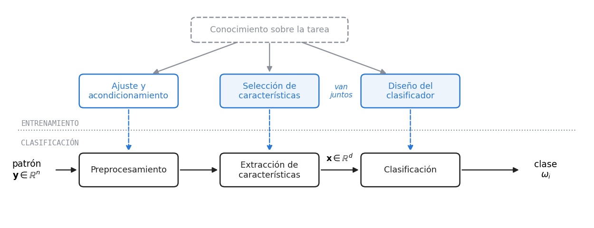
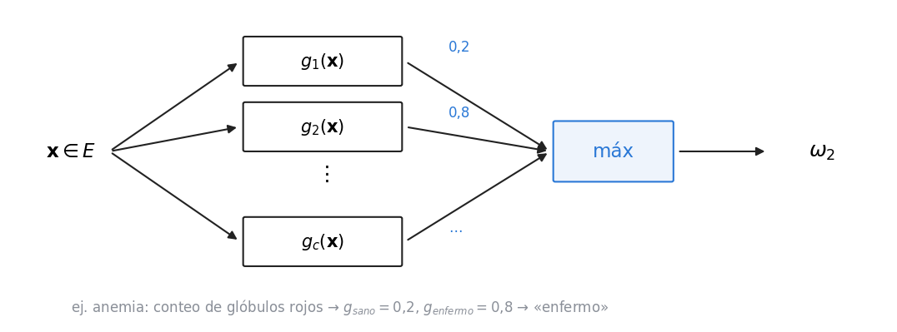
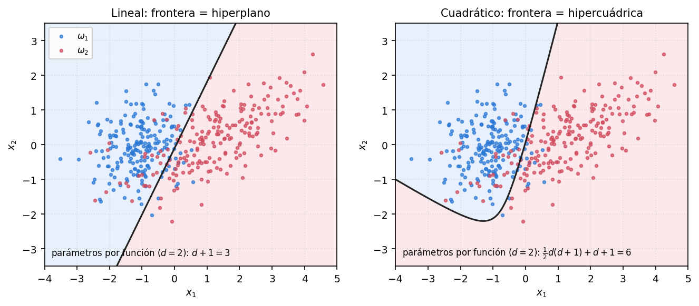
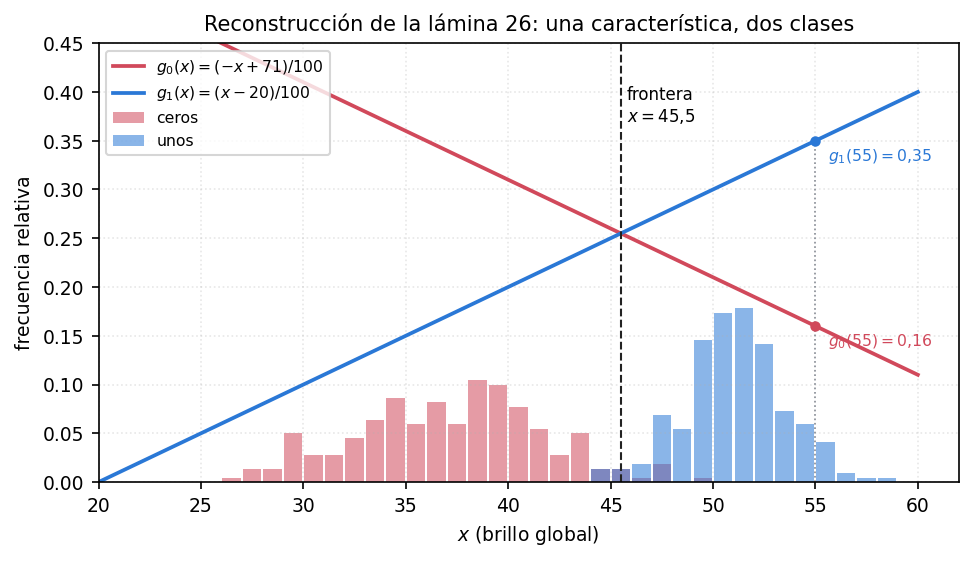
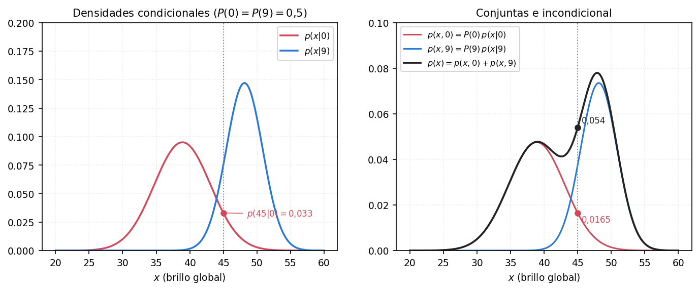
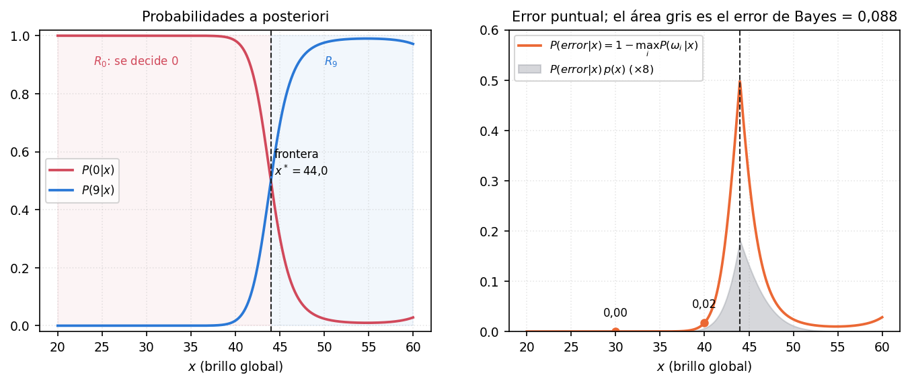
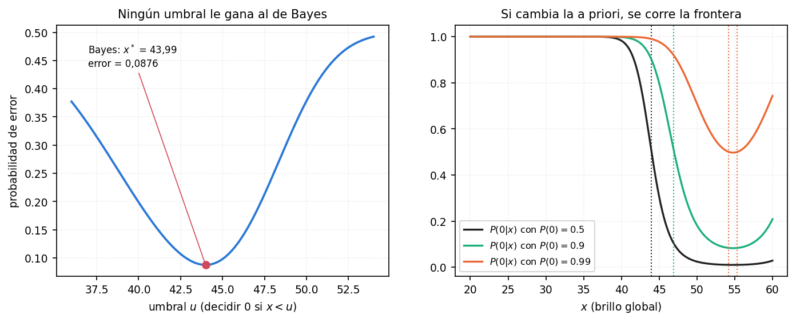

*Notación: ojo con la $y$. En esta unidad $\mathbf{y}$ es el **patrón crudo** recién adquirido y $\mathbf{x}$ el **vector de características** que sale del preproceso. En las unidades de redes neuronales $y$ era la **salida** de una neurona: son cosas distintas y conviene decirlo al empezar. $c$ es la cantidad de clases, $\omega_i$ la clase $i$, $g_i$ su función discriminante. La cátedra escribe $P(\cdot)$ tanto para probabilidades como para densidades; acá se hace lo mismo y se avisa cuando la diferencia importa (§7).*

*Es la unidad más conceptual de la materia: casi no hay algoritmos, hay definiciones. Pero es la que le da el marco a todo lo demás. Cuando decís «frontera de decisión» en el perceptrón estás usando una definición de acá, y el clasificador de Bayes es la vara contra la que se mide todo el resto.*

*Las láminas con figura (bloques, OCR geométrico y sintáctico, histogramas, curvas de probabilidad) están reconstruidas en las figuras 1 a 8. Las densidades del ejemplo del brillo se armaron para que reproduzcan exactamente los números de la lámina 31, así que todos los valores que siguen (fronteras, errores, a posteriori) son de ese modelo y salen de `../imagenes/graficos_bayes.py`.*

---

## 1. De qué se trata

El punto de partida es una tarea que un humano resuelve sin esfuerzo: **¿cuántas llaves hay en esta imagen?** Con cuatro llaves separadas la contestás de un golpe de vista y sin incerteza, aunque nunca hayas visto una llave de ese modelo. Si la imagen se complica (aparecen un tornillo y una cerradura, sombras, objetos solapados), empezás a necesitar pasadas de comprobación. Y si se complica lo suficiente, **te equivocás**.

Ese proceso es el que se quiere reproducir en una máquina: **detectar** los objetos, **identificarlos** y **asignarles una etiqueta**.

**Aprendizaje maquinal** (lámina 7): *programar máquinas para aprender a realizar una **tarea**, mejorando su **desempeño** basado en la **experiencia**.* Cada palabra cuenta:

- **tarea**: hay un objetivo específico que resolver;
- **desempeño**: tiene que poder medirse, para comparar un sistema contra otro que resuelve lo mismo;
- **experiencia**: cuantos más ejemplos ve, mejor debería inferir sobre ejemplos nuevos.

Hay dos **restricciones adicionales** que se le pueden pedir: **mínima intervención humana** (el objetivo de máxima es que funcione solo) y **un conjunto reducido de ejemplos**. La segunda importa porque en muchos campos conseguir datos etiquetados es carísimo: tomografías rotuladas por un médico, por ejemplo.

---

## 2. Dónde estamos parados: las dos ramas de la IA

| | **IA clásica** | **Reconocimiento de formas** |
|---|---|---|
| Qué modela | el **razonamiento** humano | la **percepción** humana |
| Con qué técnicas | Lógica | Teoría de la Decisión Estadística y Teoría de Lenguajes Formales |
| Tipo de aprendizaje | **deductivo** | **inductivo** |

El ejemplo de la clase: detectar anemia a partir del conteo de glóbulos rojos. En la **IA clásica** se sienta al médico al lado del programador para que vaya diciendo *«éste está sano, éste está anémico»*, y con eso se escriben reglas `if…then`. En el **reconocimiento de formas** no se le pregunta a nadie por las reglas: se le muestran ejemplos al sistema y las reglas salen de ahí.

> **IDEA DE FONDO — inductivo significa «a partir de ejemplos»**
> Es la palabra que separa las dos ramas y la que ubica a toda la materia. Todo lo que viste (perceptrón, multicapa, radial, SOM) es aprendizaje inductivo.

**Vista como disciplina de la IA** (lámina 10), un sistema de reconocimiento hace cuatro cosas:

1. **Adquisición y representación del conocimiento**: tomar los patrones de la realidad y guardarlos como conjuntos de patrones o prototipos.
2. **Aprendizaje**: algoritmos de aprendizaje **inductivo** a partir de un conjunto de entrenamiento.
3. **Clasificación**: etiquetar patrones **nuevos**, que no estaban en el entrenamiento. Es la capacidad de **generalización**: si se entrenó con mil llaves y llega una llave antigua, que el sistema diga «llave».
4. **Evaluación**: medir la bondad, la confianza o el error del sistema.

### Claves de las secciones 1 y 2

| Clave | Qué tenés que poder responder |
|---|---|
| Aprendizaje maquinal | Tarea, desempeño medible, experiencia; y las dos restricciones |
| Las dos ramas | Razonamiento/lógica/deductivo contra percepción/estadística/inductivo |
| Las cuatro cosas | Adquisición y representación, aprendizaje, clasificación, evaluación |

---

## 3. Patrón y reconocimiento de patrones

**Patrón** (lámina 11): objeto de interés, identificable del resto. Puede estar bien definido (las cuatro llaves separadas) o ser **difuso, no visible o no tangible**: la voz de una persona grabada en un restaurante lleno, la cara de alguien en una tribuna de fútbol.

**Reconocimiento de patrones (RP)**: estudio de los procesos de percepción y razonamiento humanos, con tres sub-tareas:

1. **distinguir y aislar** los patrones;
2. **reunirlos en grupos** (si no se puede identificar a cada persona de la tribuna, al menos decir cuáles son de la misma hinchada);
3. **asignarles un nombre** identificatorio a cada grupo.

El **objetivo del RP** es crear sistemas informáticos que imiten ese comportamiento.

### El diagrama de bloques

El **paradigma conceptual** (lámina 12) tiene tres bloques: **(a) adquisición**, la transducción del mundo real a una representación digital (la cámara, el micrófono, el analizador de sangre); **(b) procesamiento digital**, acondicionamiento y representación alternativa; y **(c) clasificación**, la decisión sobre la clase.

El **paradigma funcional** (lámina 13) separa el procesamiento en dos: **preprocesamiento** (mejorar contraste en una imagen, ecualizar un audio) y **extracción de características**. Y agrega arriba lo que pasa **durante el entrenamiento**, que es donde se va la mayor parte del tiempo: el ajuste y acondicionamiento, la **selección de características** y el **diseño del clasificador**.

**Por qué hace falta extraer características.** Una cara en un rectángulo de $100\times100$ píxeles es, matemáticamente, un **vector de dimensión 10.000**. Construir un clasificador sobre 10.000 números es impracticable. El bloque de extracción mide unas pocas cosas (distancia entre los ojos, de los ojos a la boca, tono de piel, relación de aspecto de la cara) y entrega **cinco números en vez de diez mil**, que son los que identifican a la persona.

> **OJO — los dos bloques donde entra el experto, y por qué van juntos**
> La **selección de características** (qué medir) y el **diseño del clasificador** (qué tipo usar) son donde el desarrollador pone lo que sabe o lo que aprende de expertos en la tarea. Van **siempre juntos**: si el descriptor es un vector numérico se usa un clasificador estadístico; si es una cadena de símbolos, uno sintáctico. Y elegir mal una característica no es neutro: **puede confundir al sistema más de lo que lo ayuda**. El ejemplo de la clase es identificar personas por el color de ojos: hay muchísima gente con iris marrones, así que esa medida no discrimina nada.

> **OJO — la palabra «patrón» se usa para dos cosas**
> La clase lo advierte: según el libro, «patrón» es la señal **adquirida** ($\mathbf{y}$) o su **descripción** ($\mathbf{x}$). En los dos casos se refiere al objeto que se quiere reconocer, en un caso crudo y en el otro transformado. Si en un oral te dicen «el patrón» después del extractor, es $\mathbf{x}$.

---

## 4. Las dos aproximaciones, con el mismo ejemplo

| | **Geométrica o estadística** | **Estructural o sintáctica** |
|---|---|---|
| Base teórica | Teoría Estadística de la Decisión | Teoría de Lenguajes Formales |
| El patrón es… | un **vector numérico** | una **cadena de símbolos** |
| Las clases se representan por… | **patrones prototipo** | **reglas sintácticas** |
| Clasificadores típicos | gaussianos, basados en distancia, redes neuronales | autómatas, gramáticas, HMM |

**El mismo problema resuelto de las dos formas** (láminas 15 a 19): OCR de dígitos manuscritos, para distinguir ceros, seis y nueves.

**Geométrica.** Se parte la imagen al medio y se cuentan los píxeles blancos de cada mitad: dos números, **brillo superior** $x_1$ y **brillo inferior** $x_2$. Una medida tan simple funciona porque está pensada para la tarea: el **9** tiene el trazo arriba, así que su mitad superior tiene **menos** blanco (en la lámina, $\approx140$ arriba y $\approx200$ abajo); el **6** es al revés; y el **0**, simétrico, queda en el medio. En el plano $(x_1,x_2)$ aparecen tres nubes, y el clasificador son **dos rectas** que las separan. Un dígito nuevo se mide, cae en una región y listo.

**Sintáctica.** Se recorre el **contorno** del dígito desde una esquina y en cada píxel se anota hacia dónde se movió, con un código de 4 u 8 direcciones. Para el 7 de la figura: siete `0` (a la derecha por la barra), después `6` y `5` (baja en diagonal), `4` para volver por la base, `1` y `2` para subir por el otro borde, y así:

$$\texttt{0000000666565565412112123444442}$$

El clasificador es un **autómata**: un modelo por dígito que cambia de estado según los símbolos que llegan, más una **gramática** que dice qué cadenas son válidas. El ejemplo del 3 de la lámina 19 muestra por qué funciona con trazos de distinto tamaño: el autómata **se queda** en el estado «tramo horizontal» mientras sigan llegando `0`, sin importar cuántos, y cambia cuando llega el símbolo de bajada.

> **PARA LA DEFENSA — el ejemplo del brillo sirve para toda la unidad**
> El profesor lo usa para mostrar la aproximación geométrica, después las probabilidades y al final el clasificador de Bayes. Si lo tenés dibujado, tenés la unidad.

---

## 5. Patrón, características y clases, formalmente

**Patrón adquirido** (lámina 21): una variable aleatoria $n$-dimensional

$$\mathbf{y} = [y_1\ y_2\ \dots\ y_n]^{\mathsf{T}}, \qquad y_i \in \mathbb{R}$$

que es un punto del **espacio de patrones** $P \subset \mathbb{R}^n$. Para una cara, $n=10.000$; para un segundo de audio a 44,1 kHz, $n = 44.100$.

**Vector de características** (lámina 22): lo que sale del extractor,

$$\mathbf{x} = [x_1\ x_2\ \dots\ x_d]^{\mathsf{T}}, \qquad d \le n$$

y vive en el **espacio de características** $E \subset \mathbb{R}^d$. Con $d=n$ no se reduce nada: es un **cambio de representación** (por ejemplo, una transformación lineal que maximiza la varianza). Con $d<n$ hay **reducción de dimensionalidad**, que es lo habitual y lo buscado.

### Las tres propiedades deseables de las características

1. **Precisión**: objetos diferentes, representaciones diferentes.
2. **Unicidad o determinismo**: cada objeto tiene una sola representación.
3. **Continuidad en el espacio**: inmunidad al ruido y capacidad de generalización.

> **OJO — la tercera es la que no se puede relajar**
> La clase lo dice explícitamente: las dos primeras se pueden aflojar y el sistema igual anda bien. La **continuidad** no, porque es la que le da **robustez**: si me saco una foto con menos luz, o con anteojos, el punto se mueve **poco** en el espacio de características y el sistema me sigue reconociendo. Y es lo que permite generalizar: un cero nuevo cae **cerca** de la nube de ceros aprendida.

### Las clases

$$\Omega = \{\omega_1, \omega_2, \dots, \omega_c\} \qquad\qquad \Omega^* = \{\omega_1, \dots, \omega_c, \omega_0\}$$

$c$ es la cantidad de **clases informacionales** (las salidas del sistema: la identidad de una persona, el tipo de llave, *sano* o *anémico*). El **conjunto extendido** $\Omega^*$ agrega $\omega_0$, la **clase de rechazo**: el sistema dice *«no estoy seguro, revise la muestra»* y un experto humano decide. Con un conteo de glóbulos rojos justo en el límite, eso es mejor que arriesgar.

### Claves de las secciones 3 a 5

| Clave | Qué tenés que poder responder |
|---|---|
| Las tres sub-tareas del RP | Aislar, agrupar, etiquetar |
| Los bloques | Adquisición, preproceso, extracción, clasificación; y arriba selección y diseño |
| Para qué la extracción | Reducir dimensión conservando lo que discrimina: 10.000 → 5 |
| Geométrica vs. sintáctica | Vector y prototipos contra cadena y reglas; brillo contra código de contorno |
| $\mathbf{y}$ vs. $\mathbf{x}$ | Patrón adquirido ($n$) contra características ($d\le n$) |
| Las tres propiedades | Precisión, unicidad, **continuidad** (la que no se relaja) |
| $\omega_0$ | Rechazo: decir «no sé» y derivar al experto |

---

## 6. El clasificador estadístico

**Definición** (lámina 23): un clasificador estadístico es una máquina formada por $c$ **funciones discriminantes**

$$g_i : E \to \mathbb{R}, \qquad 1 \le i \le c$$

tal que, dado un patrón $\mathbf{x}\in E$,

$$\mathbf{x} \text{ se asigna a la clase } \omega_i \quad\text{si}\quad g_i(\mathbf{x}) > g_j(\mathbf{x}) \quad \forall\, j \neq i$$

En castellano: **cada clase le pone un puntaje al patrón y gana el más alto.** El ejemplo de la clase: un conteo de glóbulos rojos pasa por $g_{\text{sano}}$ y da 0,2; pasa por $g_{\text{enfermo}}$ y da 0,8; el máximo es 0,8, así que el paciente se clasifica como enfermo.

### Regiones y fronteras de decisión

**Regiones** (lámina 24): el clasificador **parte el espacio** en $c$ regiones

$$R_i = \{\mathbf{x} \in E : g_i(\mathbf{x}) > g_j(\mathbf{x})\ \ \forall\, j \neq i\}$$

**Fronteras**: las superficies que separan regiones contiguas, donde hay **empate**:

$$g_i(\mathbf{x}) - g_j(\mathbf{x}) = 0, \qquad i\neq j$$

En el ejemplo de los dígitos, la región del 9 es todo lo que está de una recta verde para arriba, la del 0 la franja central y la del 6 lo de abajo. Un punto justo **sobre** la recta es un empate: es un caso natural de **rechazo**.

> **IDEA DE FONDO — esto ya lo venías usando sin la definición**
> La frontera de decisión del perceptrón es exactamente esto con $c=2$ y $g$ lineal. El clasificador por mínima distancia del SOM etiquetado y de LVQ también: su función discriminante es $g_i(\mathbf{x}) = -\|\mathbf{x}-\mathbf{m}_i\|$, y elegir el prototipo más cercano es elegir la $g_i$ más grande. **Todos los clasificadores de la materia son casos particulares de esta definición.**

### Clasificadores básicos: lineal y cuadrático

**Lineal** (lámina 25): las $g$ son combinaciones lineales de las características.

$$g(\mathbf{x}) = \sum_{i=1}^{d} w_i x_i + w_0 = \mathbf{w}^{\mathsf{T}}\mathbf{x} + w_0$$

con $d+1$ parámetros; sus fronteras son **hiperplanos**.

**Cuadrático**: se agregan los productos entre características.

$$g(\mathbf{x}) = \sum_{i=1}^{d}\sum_{j=1}^{d} w_{ij}x_ix_j + \sum_{i=1}^{d} w_i x_i + w_0 = \mathbf{x}^{\mathsf{T}}\mathbf{W}\mathbf{x} + \mathbf{w}^{\mathsf{T}}\mathbf{x} + w_0$$

con $\tfrac12 d(d+1) + d + 1$ parámetros; sus fronteras son **hipercuádricas** (elipsoides, paraboloides, hiperboloides).

### Para la pizarra: por qué el cuadrático tiene $\tfrac12 d(d+1)+d+1$ parámetros

**Paso 1.** Contás la parte lineal: $d$ pesos $w_i$ más el término independiente $w_0$. Son $d+1$.

**Paso 2.** La doble sumatoria tiene $d^2$ términos $w_{ij}x_ix_j$, pero $x_ix_j = x_jx_i$: los términos $w_{ij}$ y $w_{ji}$ multiplican **lo mismo**, así que sólo cuenta su suma. Es decir, $\mathbf{W}$ puede tomarse **simétrica**.

**Paso 3.** Una matriz simétrica de $d\times d$ tiene libres la diagonal ($d$) y un triángulo ($\tfrac{d(d-1)}{2}$):

> **Llegás a:** $\;d + \dfrac{d(d-1)}{2} = \dfrac{d(d+1)}{2}$, y en total $\;\dfrac{d(d+1)}{2} + d + 1$.

**Checkpoint:** con $d=2$ son $3+2+1 = 6$: $x_1^2,\ x_2^2,\ x_1x_2,\ x_1,\ x_2,\ 1$. Con $d=10$: 66 contra 11. Con $d=100$: 5151 contra 101.

**La frase:** *el cuadrático traza fronteras curvas, pero sus parámetros crecen con $d^2$. Es el compromiso de la unidad de generalización: más parámetros libres, más capacidad y más riesgo de sobreajuste.*

### El ejemplo en una dimensión (lámina 26)

Se simplifica la tarea a **ceros contra unos** con **una sola característica**, el brillo global. Los ceros tienen menos píxeles blancos (su trazo ocupa más), así que su histograma queda a la izquierda. La lámina dibuja dos funciones discriminantes lineales:

$$g_0(x) = \frac{-x + 71}{100} \qquad\qquad g_1(x) = \frac{x-20}{100}$$

**La frontera** sale de igualar: $-x+71 = x-20 \Rightarrow x = 45{,}5$. A la izquierda gana $g_0$ y a la derecha $g_1$. Con $x = 55$: $g_1 = 0{,}35 > g_0 = 0{,}16$, así que es un 1.

> **OJO — los números dichos en clase no son los de las rectas**
> En la clase se dice que la frontera está «en 45» y que en $x=55$ vale $g_1 \approx 0{,}32$ y $g_0 \approx 0{,}2$. Son lecturas a ojo del gráfico. Con las fórmulas de la lámina son **45,5**, **0,35** y **0,16**. Si en el oral te dan las fórmulas, calculá; no cites los números de la clase.

La lámina 27 hace lo mismo en **dos** dimensiones (seis contra nueve, brillos superior e inferior): ahora cada $g$ es un **plano** sobre $(x_1,x_2)$, y la frontera es la **recta** donde se cortan los dos planos.

### Claves de la sección 6

| Clave | Qué tenés que poder responder |
|---|---|
| Definición | $c$ funciones $g_i:E\to\mathbb{R}$ y la regla del máximo |
| Región | Donde gana una $g_i$ |
| Frontera | Donde empatan: $g_i-g_j=0$ |
| Lineal | $d+1$ parámetros, hiperplanos |
| Cuadrático | $\tfrac12d(d+1)+d+1$ (por la simetría de $\mathbf W$), hipercuádricas |
| Ejemplo 1D | Frontera en $x=45{,}5$ |

---

## 7. Las cuatro probabilidades

Todo lo que sigue apunta a construir **una buena función discriminante**. La respuesta va a ser una probabilidad, pero se llega por partes. La clase usa dos ejemplos en paralelo: la anemia (clasificar a un paciente en *sano* o *anémico* según el conteo de glóbulos rojos) y el brillo de los dígitos 0 y 9.

### 7.1 Probabilidad a priori $P(\omega_i)$

*«Probabilidad de observar la etiqueta sin saber qué muestra es».* Es la proporción de muestras de $\omega_i$ en el total: qué fracción de la población es anémica. Es el conocimiento que se tiene **antes** de medir nada.

$$0 \le P(\omega_i) \le 1 \qquad\qquad \sum_{i=1}^{c} P(\omega_i) = 1$$

Con esto solo ya se puede armar el **clasificador trivial**: decidir por $\omega_1$ si $P(\omega_1) > P(\omega_2)$, sin mirar el patrón.

> **OJO — el clasificador trivial acierta muchísimo y no sirve para nada**
> Si el 1 % de la población es anémica, decir siempre *«sano»* acierta el 99 %. Es un desempeño altísimo y un sistema inútil. Además, el profesor remarca que **el costo de los dos errores no es el mismo**: decirle «sano» a un anémico hace que no reciba tratamiento, y decirle «anémico» a un sano le cuesta un suplemento de hierro. Nada de eso está en las probabilidades, y por eso los clasificadores basados sólo en la a priori son *«muy simples pero no efectivos»*.

### 7.2 Densidad condicional $P(\mathbf{x}|\omega_i)$

*«Probabilidad de observar la muestra $\mathbf{x}$ sabiendo que la etiqueta es $\omega_i$».* Caracteriza **cómo se distribuyen las muestras dentro de cada clase**.

La imagen de la clase: **dos contenedores**, uno con todos los análisis de los sanos y otro con los de los anémicos. Metés la mano **en uno de los dos** y preguntás qué chance hay de sacar un conteo de cuatro millones.

$$P(\mathbf{x}|\omega_i) \ge 0 \qquad\qquad \int_E P(\mathbf{x}|\omega_i)\,d\mathbf{x} = 1$$

### 7.3 Probabilidad conjunta $P(\mathbf{x},\omega_i)$

*«Probabilidad de observar la muestra $\mathbf{x}$ con la etiqueta $\omega_i$».*

$$P(\mathbf{x},\omega_i) = P(\omega_i)\,P(\mathbf{x}|\omega_i)$$

Ahora los dos contenedores se **vuelcan en uno solo**, se revuelve y se mete la mano. Es menor que la condicional, porque además de sacar ese valor tiene que tocarte esa clase.

### 7.4 Densidad incondicional $P(\mathbf{x})$

*«Probabilidad de observar la muestra $\mathbf{x}$ sin saber cuál es su etiqueta».*

$$P(\mathbf{x}) = \sum_{j=1}^{c} P(\mathbf{x},\omega_j) = \sum_{j=1}^{c} P(\mathbf{x}|\omega_j)\,P(\omega_j)$$

Caracteriza la distribución de las muestras con **independencia de las clases**. Cumple $P(\mathbf{x})\ge0$ y $\int_E P(\mathbf{x})\,d\mathbf{x} = 1$.

### Los cuatro números sobre el ejemplo del brillo (lámina 31)

| Cantidad | Valor | Cómo se lee | Cómo se obtiene |
|---|---:|---|---|
| $P(\omega=0)$ | 0,5 | hay tantos ceros como nueves | dato; el trivial no sirve |
| $P(x=45\,\vert\,\omega=0)$ | 0,033 | altura de la curva roja de la izquierda en 45 | dato |
| $P(x=45,\ \omega=0)$ | 0,0165 | altura de la curva roja de la derecha | $0{,}033\times0{,}5$ |
| $P(x=45)$ | 0,054 | altura de la curva negra | $0{,}0165 + 0{,}5\cdot P(45\vert9)$ |

De la última fila se despeja lo que la lámina no dice: $P(45|9) = (0{,}054-0{,}0165)/0{,}5 = 0{,}075$.

> **OJO — dos detalles de la lámina 31**
> - La lámina pone $P(x=45,\omega=0) = 0{,}016$. La cuenta da **0,0165**: es un truncamiento, no un error conceptual, pero si lo calculás en el pizarrón da 0,0165.
> - $x$ es **continua**, así que $P(x=45|\omega=0)$ no es la probabilidad de que el brillo valga exactamente 45 (eso es cero): es el **valor de la densidad** en 45. Por eso puede ser mayor que 1 si la curva es angosta, y por eso la condición de normalización es una integral. En los cocientes de Bayes da igual, porque el $dx$ se simplifica arriba y abajo; pero si te preguntan «¿qué es 0,033?», la respuesta precisa es *«la densidad del brillo de los ceros evaluada en 45»*.

> **PARA LA DEFENSA — cómo no confundirlas**
> Se distinguen por **qué se sabe y qué se pregunta**. *A priori*: pregunto por la clase sin mirar la muestra. *Condicional*: sé la clase y pregunto por la muestra (**un** contenedor). *Conjunta*: pregunto por las dos juntas (todo mezclado, y me tiene que tocar esa clase). *Incondicional*: pregunto por la muestra y no me importa la clase (todo mezclado, cualquier clase).

### Claves de la sección 7

| Clave | Qué tenés que poder responder |
|---|---|
| Las cuatro | Escribirlas y decir qué se sabe y qué se pregunta en cada una |
| Conjunta | Producto de a priori por condicional |
| Incondicional | Suma de las conjuntas sobre todas las clases |
| Los números | 0,5; 0,033; 0,0165; 0,054, y despejar $P(45\vert9)=0{,}075$ |
| Trivial | Acierta mucho, ignora la muestra y el costo del error |

---

## 8. La probabilidad a posteriori y la regla de Bayes

Ésta es **la pregunta que de verdad importa**: le damos al sistema el patrón medido (*«el brillo es 45»*, *«el conteo es de tres millones»*) y queremos la clase.

**Probabilidad a posteriori** $P(\omega_i|\mathbf{x})$ (lámina 32): *«probabilidad de observar la etiqueta $\omega_i$ sabiendo que la muestra es $\mathbf{x}$»*. Se calcula con la **regla de Bayes**:

$$P(\omega_i|\mathbf{x}) = \frac{P(\mathbf{x}|\omega_i)\,P(\omega_i)}{P(\mathbf{x})} = \frac{P(\mathbf{x}|\omega_i)\,P(\omega_i)}{\sum_{j=1}^{c}P(\mathbf{x}|\omega_j)\,P(\omega_j)}$$

Cumple $0 \le P(\omega_i|\mathbf{x}) \le 1$ y $\sum_i P(\omega_i|\mathbf{x}) = 1$.

### Para la pizarra: de dónde sale la regla de Bayes

**Paso 1.** Escribís la conjunta **de las dos formas posibles**: condicionando en la clase o condicionando en la muestra.

$$P(\mathbf{x},\omega_i) = P(\mathbf{x}|\omega_i)\,P(\omega_i) = P(\omega_i|\mathbf{x})\,P(\mathbf{x})$$

**Paso 2.** Despejás la a posteriori:

> **Llegás a:** $\;P(\omega_i|\mathbf{x}) = \dfrac{P(\mathbf{x}|\omega_i)\,P(\omega_i)}{P(\mathbf{x})}$

**Paso 3.** Reemplazás el denominador por la incondicional de la §7.4, y mostrás que las a posteriori suman 1: el denominador es justamente la suma de todos los numeradores.

**Paso 4 (con números).** En $x=45$:

$$P(0|45) = \frac{0{,}033\times0{,}5}{0{,}054} = \frac{0{,}0165}{0{,}054} = 0{,}306 \qquad P(9|45) = \frac{0{,}0375}{0{,}054} = 0{,}694$$

Suman 1. Un brillo de 45 es más probablemente un 9, aunque $P(45|0)$ no es despreciable.

**Trampa:** confundir $P(\mathbf{x}|\omega_i)$ con $P(\omega_i|\mathbf{x})$. La primera es cuánto encaja la muestra en la clase; la segunda, cuánto cree el sistema que la muestra es de la clase. No son iguales ni siquiera con a prioris iguales, porque hay que normalizar.

> **IDEA DE FONDO — Bayes es una actualización**
> La a posteriori es la **a priori corregida después de observar $\mathbf{x}$**. Antes de medir, la mejor apuesta era $P(\omega_i)$; la evidencia la mueve. El numerador la empuja según lo bien que $\mathbf{x}$ encaja en la clase, y el denominador renormaliza.

**Qué forma tiene** (láminas 33 y 34). Para los brillos bajos la a posteriori del 0 vale prácticamente **1** y la del 9, **0**; para los altos, al revés; y en el medio se cruzan. **Ese cruce es la frontera de decisión** de la §6, y es donde el sistema tiene la máxima incerteza. En la reconstrucción cae en $x^* = 44{,}0$.

---

## 9. El clasificador de Bayes

La idea de la lámina 33 (*«Idea para un clasificador…»*): si las a posteriori ya se comportan como se quiere que se comporte una función discriminante (una es mayor donde están los ceros, la otra donde están los nueves), **se las usa como funciones discriminantes**.

**Regla de clasificación de Bayes** (lámina 34): asignar a $\mathbf{x}$ la clase de mayor probabilidad a posteriori.

$$\hat\omega = \arg\max_{\omega_i:\,1\le i\le c} P(\omega_i|\mathbf{x}) \qquad\qquad g_i(\mathbf{x}) = P(\omega_i|\mathbf{x})$$

### Las tres formas equivalentes

$$g_i(\mathbf{x}) = \frac{P(\mathbf{x}|\omega_i)P(\omega_i)}{P(\mathbf{x})} \;\equiv\; P(\mathbf{x}|\omega_i)\,P(\omega_i) \;\equiv\; \log P(\mathbf{x}|\omega_i) + \log P(\omega_i)$$

**Hay que saber justificar los dos pasos:**

1. **Se tira el denominador** porque $P(\mathbf{x})$ es **el mismo para todas las clases**: divide a todas por igual y no cambia cuál es la mayor.
2. **Se aplica el logaritmo** porque es **monótono creciente**: no cambia el orden, y convierte el producto en suma, lo que simplifica mucho las cuentas con gaussianas.

> **OJO — qué quiere decir «equivalentes»**
> $(g_1,\dots,g_c) \equiv (f(g_1),\dots,f(g_c)) \equiv (g_1',\dots,g_c')$ si producen **las mismas regiones de decisión**, con $f$ monótona creciente. De una función discriminante no importan sus valores sino **el orden** entre ellas. Ojo: después de tirar $P(\mathbf{x})$ las $g_i$ ya **no** son probabilidades (no suman 1), pero el clasificador es el mismo.

### El error de Bayes

**Error puntual** (lámina 35): la probabilidad de equivocarse con **ese** patrón es la de que la clase verdadera no sea la ganadora.

$$P(\text{error}|\mathbf{x}) = 1 - \max_{1\le i\le c} P(\omega_i|\mathbf{x})$$

**Error medio** del clasificador: se promedia sobre todos los patrones posibles, pesando cada uno por lo frecuente que es.

$$P(\text{error}) = \int_E P(\text{error}|\mathbf{x})\,P(\mathbf{x})\,d\mathbf{x}$$

**Con números** (figura 7, derecha). Con brillo **30**, $P(0|30) = 1$ y el error es $1-1 = 0$: seguro que es un cero. Con brillo **42**, las a posteriori valen $0{,}86$ y $0{,}14$, y el error es $0{,}14$. En la frontera ($x=44$) llega a $0{,}5$, lo peor posible con dos clases. Integrando, el error de Bayes del ejemplo es **0,088**.

> **OJO — el ejemplo del 40 de la clase**
> En la clase se dice que con brillo 40 las a posteriori valen 0,8 y 0,2 y el error es 20 %. Es un ejemplo ilustrativo. En la reconstrucción, que respeta los números de la lámina 31, en 40 el error es 0,02 y el 0,8/0,2 aparece cerca de $x=42{,}5$. El razonamiento es el mismo: *uno menos el máximo*.

### Para la pizarra: por qué el de Bayes es el de mínimo error

La lámina lo afirma («es de mínimo error»); el argumento entra en cuatro renglones y conviene tenerlo.

**Paso 1.** Cualquier clasificador, en cada $\mathbf{x}$, elige **alguna** clase $\omega_k$. Su error en ese punto es $1 - P(\omega_k|\mathbf{x})$.

**Paso 2.** Ese número es **mínimo** cuando $P(\omega_k|\mathbf{x})$ es máxima, o sea cuando se elige la clase de mayor a posteriori. Es la regla de Bayes.

**Paso 3.** El error medio es una integral de $P(\text{error}|\mathbf{x})\,P(\mathbf{x})$ con $P(\mathbf{x}) \ge 0$. Si el integrando es mínimo **en cada punto**, la integral es mínima.

> **Llegás a:** ningún clasificador tiene menor $P(\text{error})$ que el de Bayes. Su error es la **cota inferior** del problema.

**Checkpoint numérico** (figura 8, izquierda): si en el ejemplo se decide «0 si $x<u$» y se barre el umbral $u$, el error es 0,199 con $u=40$, 0,121 con $u=42$, **0,0876 con $u=44$** y 0,098 con $u=45$. El mínimo cae exactamente en la frontera de Bayes, $x^*=43{,}99$.

> **OJO — las regiones de Bayes no tienen por qué ser un intervalo**
> Las dos densidades del ejemplo tienen distinta dispersión (la del 0 es más ancha), así que se cruzan **dos veces**: en 44,0 y en 65,6. Más allá de 65,6 vuelve a ganar el 0, porque la campana ancha decae más despacio. En la figura 7 se ve que $P(0|x)$ empieza a subir en el borde derecho. La región del 0 son **dos pedazos**. Es la versión en una dimensión de las fronteras cuadráticas de la §6: gaussianas con varianzas distintas dan fronteras cuadráticas.

### Qué pasa si cambia la a priori

La frontera de Bayes está donde $P(\mathbf{x}|\omega_0)P(\omega_0) = P(\mathbf{x}|\omega_9)P(\omega_9)$: si una clase se vuelve más probable a priori, **la frontera se corre hacia la otra** y le quita territorio (figura 8, derecha). En el ejemplo:

| $P(\omega=0)$ | Frontera (primer cruce) | Error de Bayes | Error del trivial |
|---:|---:|---:|---:|
| 0,5 | 44,0 | 0,088 | 0,500 |
| 0,9 | 47,0 | 0,058 | 0,100 |
| 0,99 | 54,2 | 0,0100 | 0,0100 |

Con $P(0)=0{,}99$ el 9 sólo gana en la franja de 54,2 a 55,3, y el error de Bayes **coincide** con el del trivial. Es el caso de la anemia: cuando una clase es rarísima, el mejor clasificador en **cantidad de errores** apenas le gana a decir siempre «sano». Por eso la cátedra insiste en que la **tasa de error no es todo**: hay que pesar el costo de cada tipo de error, y eso el clasificador de Bayes, tal como se lo define acá, no lo hace.

---

## 10. Por qué no se puede usar, y por qué existe el resto de la materia

Si el de Bayes es el mejor posible, ¿por qué no se usa siempre? La lámina 35 lo contesta: **no se conoce lo que necesita**.

- **$P(\omega_i)$ es desconocida.** La proporción de anémicos se estima con la muestra que se tiene, pero en otra región del mundo puede ser otra, porque esa población es naturalmente distinta.
- **$P(\mathbf{x}|\omega_i)$ es desconocida.** Se puede armar el histograma con mil pacientes, pero si mañana se suman diez más, el histograma cambia. Nunca se tiene la distribución verdadera: se tiene una estimación.
- Y aunque se tuvieran, **las regiones de integración** del error son complejas (ya en una dimensión son dos pedazos).

Faltan justamente **los dos factores del numerador**. La solución que da la lámina es **estimar** el error, que es lo que se hace con validación cruzada (unidad 04).

> **IDEA DE FONDO — la frase que cierra la unidad**
> *«Todo lo que van a aprender en la materia son métodos que **aproximan** al clasificador de Bayes.»* El error de Bayes es una cota que no se puede bajar, y las redes neuronales, los clasificadores gaussianos y todo lo demás intentan acercarse a ella **sin conocer las distribuciones**. Si te preguntan para qué sirve esta unidad si el clasificador no se puede construir, la respuesta es ésa: para saber contra qué se compara todo lo demás.

### Claves de las secciones 8 a 10

| Clave | Qué tenés que poder responder |
|---|---|
| Regla de Bayes | Deducirla de las dos formas de la conjunta; nombrar cada factor |
| Clasificador | $\hat\omega = \arg\max P(\omega_i\vert\mathbf{x})$ |
| Equivalencias | Se tira $P(\mathbf{x})$ (común a todas); se aplica $\log$ (monótono) |
| Error puntual | $1-\max_i P(\omega_i\vert\mathbf{x})$; 0 lejos de la frontera, 0,5 en ella |
| Mínimo error | El integrando es mínimo punto a punto |
| A priori | Corre la frontera hacia la clase menos probable |
| Por qué no se usa | $P(\omega_i)$ y $P(\mathbf{x}\vert\omega_i)$ desconocidas; se estima el error |

---

## 11. Aplicaciones (láminas 36 a 43)

La clase cierra con ejemplos, sin desarrollo. Conviene tener uno o dos para ilustrar:

| Aplicación | Qué es el patrón | Qué clasificador se menciona |
|---|---|---|
| OCR de texto manuscrito (una palabra en una tableta) | Imagen reducida y sus gradientes horizontal y vertical | Modelos ocultos de Markov concatenados: uno por letra, gramática de números |
| Señales de tránsito (cámara en el auto) | Recorte de la imagen | Detección y reconocimiento del cartel (velocidad máxima…) |
| Rostro, expresiones y emociones | Imagen de la cara | |
| Malezas en agricultura | Imagen del cultivo | |
| Sonidos masticatorios en rumiantes | Señal de audio | |

Y la lista de la lámina 43: imágenes (OCR, firmas, patentes, control de calidad), habla y lenguaje (palabras aisladas, habla continua, identificación del locutor, traducción), biomédicas (segmentación de tejidos, biometría) y economía (minería de datos, fraude).

---

## 12. Tres desarrollos para el pizarrón

### D1 — «Definí un clasificador estadístico»

*Desarrollo: sección 6.*

**Llegás a:** las $c$ funciones $g_i:E\to\mathbb{R}$ y la regla del máximo; $R_i$ y $g_i-g_j=0$ con un dibujo; lineal ($d+1$) y cuadrático ($\tfrac12d(d+1)+d+1$, justificado por la simetría).

**Remate:** *«el perceptrón es exactamente esto con dos clases y $g$ lineal»*.

### D2 — «Deducí el clasificador de Bayes»

*Desarrollo: secciones 7 a 9.*

**Llegás a:** las cuatro probabilidades con los contenedores; la regla de Bayes desde la conjunta; $\hat\omega = \arg\max P(\omega_i|\mathbf{x})$; las dos simplificaciones con su justificación; el error puntual y el medio; que es de mínimo error (argumento punto a punto); que no se puede construir.

**Trampa:** decir que no se puede construir «porque es muy complejo». Es porque **no se conocen** $P(\omega_i)$ ni $P(\mathbf{x}|\omega_i)$.

### D3 — Cuentas con los números de la lámina 31

**Te dan:** $P(0) = P(9) = 0{,}5$, $P(45|0) = 0{,}033$, $P(45) = 0{,}054$.

**Llegás a:** conjunta $0{,}0165$; $P(45|9) = 0{,}075$; $P(0|45) = 0{,}306$; $P(9|45)=0{,}694$; decisión: 9; error puntual $0{,}306$.

**Checkpoint:** las dos a posteriori suman 1.

---

## 13. Formulario

| Qué | Fórmula |
|---|---|
| Patrón adquirido | $\mathbf{y} = [y_1 \dots y_n]^{\mathsf{T}} \in P \subset \mathbb{R}^n$ |
| Características | $\mathbf{x} = [x_1 \dots x_d]^{\mathsf{T}} \in E \subset \mathbb{R}^d$, $d \le n$ |
| Clases | $\Omega = \{\omega_1,\dots,\omega_c\}$; con rechazo $\Omega^* = \Omega\cup\{\omega_0\}$ |
| Regla de decisión | $\mathbf{x}\to\omega_i$ si $g_i(\mathbf{x}) > g_j(\mathbf{x})\ \forall j\ne i$ |
| Región | $R_i = \{\mathbf{x} : g_i(\mathbf{x}) > g_j(\mathbf{x})\ \forall j\neq i\}$ |
| Frontera | $g_i(\mathbf{x}) - g_j(\mathbf{x}) = 0$ |
| Lineal | $\mathbf{w}^{\mathsf{T}}\mathbf{x} + w_0$; $d+1$ parámetros |
| Cuadrático | $\mathbf{x}^{\mathsf{T}}\mathbf{W}\mathbf{x}+\mathbf{w}^{\mathsf{T}}\mathbf{x}+w_0$; $\tfrac12d(d+1)+d+1$ |
| Conjunta | $P(\mathbf{x},\omega_i) = P(\omega_i)\,P(\mathbf{x}\vert\omega_i)$ |
| Incondicional | $P(\mathbf{x}) = \sum_j P(\mathbf{x}\vert\omega_j)P(\omega_j)$ |
| Bayes | $P(\omega_i\vert\mathbf{x}) = P(\mathbf{x}\vert\omega_i)P(\omega_i)/P(\mathbf{x})$ |
| Clasificador de Bayes | $\hat\omega = \arg\max_i P(\omega_i\vert\mathbf{x})$ |
| Equivalentes | $P(\mathbf{x}\vert\omega_i)P(\omega_i) \equiv \log P(\mathbf{x}\vert\omega_i) + \log P(\omega_i)$ |
| Error puntual | $1 - \max_i P(\omega_i\vert\mathbf{x})$ |
| Error medio | $\int_E P(\text{error}\vert\mathbf{x})\,P(\mathbf{x})\,d\mathbf{x}$ |

---

## 14. Errores típicos

1. **Confundir $P(\mathbf{x}|\omega_i)$ con $P(\omega_i|\mathbf{x})$.** La condicional sabe la clase y pregunta por la muestra; la a posteriori, al revés.
2. **Decir que el clasificador trivial «anda mal».** Anda **muy bien** en aciertos; el problema es que ignora la muestra y el costo del error.
3. **Escribir la incondicional sin la a priori.** Es $\sum_j P(\mathbf{x}|\omega_j)P(\omega_j)$.
4. **Tirar $P(\mathbf{x})$ sin justificar.** Se puede porque es **común a todas las clases**.
5. **Justificar el logaritmo sólo con «simplifica».** La razón es que es **monótono creciente**: no cambia el orden, y por eso tampoco las regiones.
6. **Decir que el de Bayes no se usa «porque es complejo».** Es porque faltan $P(\omega_i)$ y $P(\mathbf{x}|\omega_i)$.
7. **Leer $P(x=45|\omega=0)=0{,}033$ como la probabilidad de que el brillo sea 45.** Es una densidad.
8. **Contar $d^2+d+1$ parámetros en el cuadrático.** $\mathbf{W}$ es simétrica: son $\tfrac12d(d+1)+d+1$.
9. **Suponer que cada región de decisión es un solo pedazo.** Con varianzas distintas, no (el ejemplo tiene dos cruces).
10. **Confundir la $\mathbf{y}$ de esta unidad con la salida de una neurona.** Acá es el patrón crudo.
11. **Decir que la continuidad de las características se puede relajar.** Las que se relajan son la precisión y la unicidad.

---

## 15. Autoevaluación

Si podés responder estas catorce sin mirar, la unidad está.

1. Enunciá la definición de aprendizaje maquinal y las dos restricciones adicionales.
2. ¿Qué diferencia a la IA clásica del reconocimiento de formas? ¿Qué tipo de aprendizaje usa cada una?
3. Dibujá el diagrama funcional. ¿Qué bloques existen sólo en entrenamiento? ¿Por qué la selección de características y el diseño del clasificador van juntos?
4. ¿Por qué hace falta extraer características? Usá el ejemplo de la cara.
5. Resolvé el OCR de 0, 6 y 9 con las dos aproximaciones. ¿Qué es un código de contorno?
6. Nombrá las tres propiedades de las características y cuál no se puede relajar.
7. Definí clasificador estadístico, región y frontera de decisión.
8. Deducí la cantidad de parámetros del clasificador cuadrático.
9. Con $g_0 = (-x+71)/100$ y $g_1=(x-20)/100$, ¿dónde está la frontera? ¿Qué clase le toca a $x=55$?
10. Escribí las cuatro probabilidades y explicalas con los contenedores.
11. Con los números de la lámina 31, calculá la conjunta, $P(45|9)$ y las dos a posteriori.
12. Deducí la regla de Bayes y justificá las dos formas equivalentes del clasificador.
13. ¿Por qué el clasificador de Bayes es de mínimo error? ¿Por qué igual no se puede construir?
14. ¿Qué le pasa a la frontera si la a priori de una clase sube a 0,99? ¿Qué tiene que ver con la anemia?
