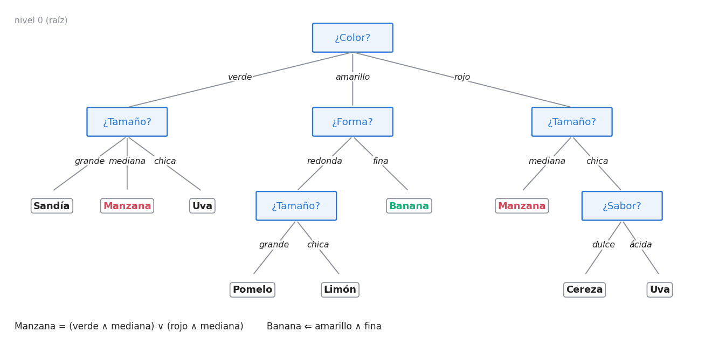
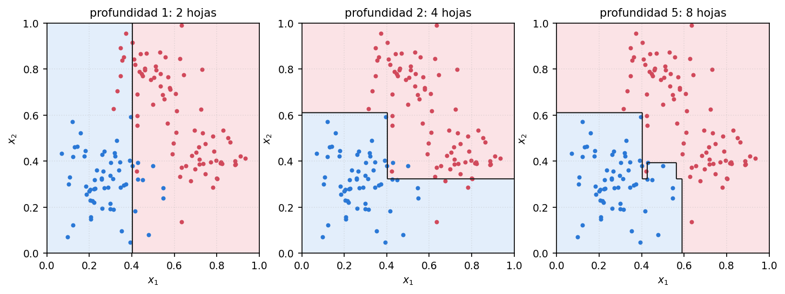
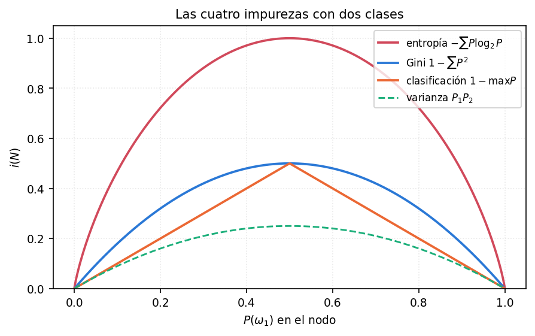
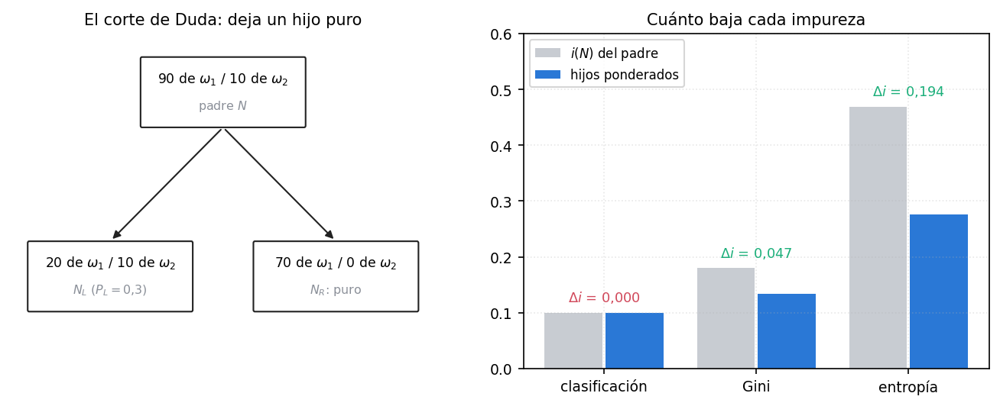
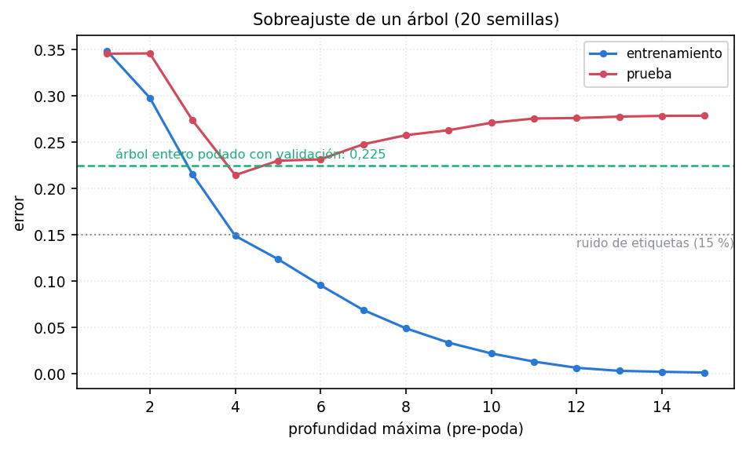
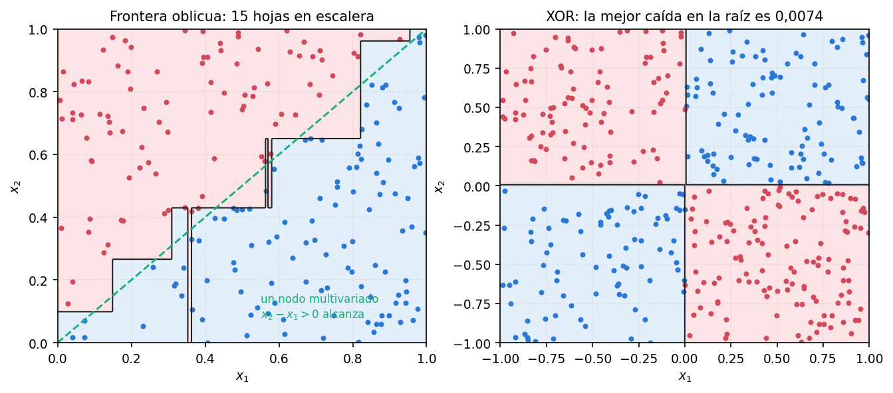
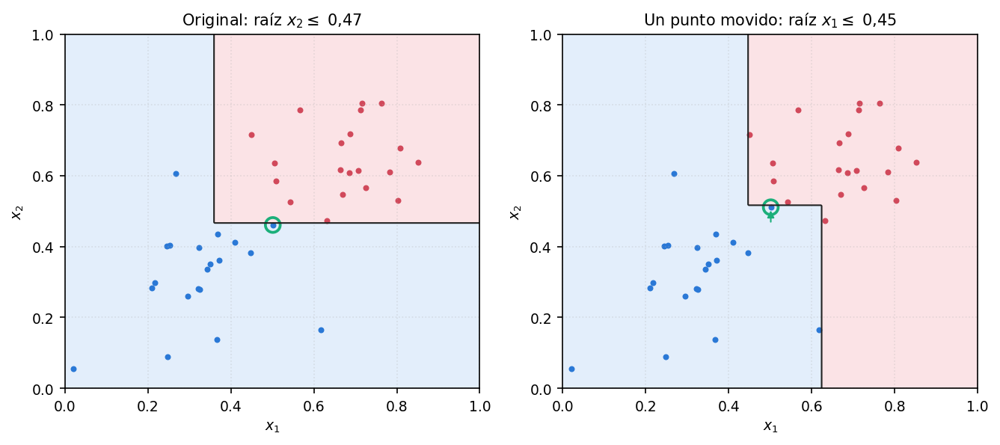

*Sobre las fuentes. Este tema **no tiene diapositivas ni transcripciones** en la carpeta. En la cursada aparece como uno de los «métodos básicos de aprendizaje supervisado» (unidad 4 de la planificación) y como uno de los seis clasificadores del ejercicio 2 de la guía de TP 3. El apunte se arma sobre el capítulo 8 de Duda–Hart–Stork, que es la bibliografía de la materia para reconocimiento de patrones, y el ejemplo de las frutas, el del nodo 90/10 y las seis preguntas de CART son de ahí. Como no hay clase que marque el énfasis, el nivel es el de un oral: el método en detalle, el algoritmo de construcción y sobre todo **la impureza** (qué mide y qué decisión se toma con ella). Gini y entropía se dan con sus propiedades, sin deducción.*

*Las figuras 4 a 7 salen de una implementación propia de CART de unas 80 líneas, en `../imagenes/graficos_arboles.py`, que se controló contra `DecisionTreeClassifier` de scikit-learn (coinciden en el 98,8 % de las predicciones; las diferencias vienen de cómo se desempatan cortes igual de buenos). Todos los números del apunte salen de esa corrida.*

*La parte práctica con scikit-learn está en `Practicas/TP3/Resumenes/00-tp3-scikit-learn.md` (§2.5).*

---

## 1. Por qué hacen falta: datos sin métrica

Todo lo que viste hasta acá (perceptrón, multicapa, radial, SOM, LVQ, el clasificador de Bayes) comparte un supuesto: los patrones son **vectores de números reales** y existe una **distancia natural** entre ellos. En el vecino más cercano la distancia **es** el método; en una red neuronal aparece porque entradas cercanas producen salidas parecidas.

Hay problemas donde eso no existe. El ejemplo de Duda es clasificar peces y mamíferos marinos por **los dientes**: algunos son finos y pequeños (la ballena, que filtra), otros vienen en varias filas (el tiburón), otros son colmillos (la morsa) y otros animales directamente no tienen (el calamar). **¿Cuál es la distancia entre «colmillo» y «varias filas»?** No hay ninguna.

Esa información se llama **nominal**: discreta, sin orden natural y sin similitud definida. Un patrón se describe con una **tupla de propiedades**. Una fruta, por ejemplo, es $\{\text{rojo},\ \text{brillante},\ \text{dulce},\ \text{chica}\}$, forma corta de *color = rojo*, *textura = brillante*, *sabor = dulce*, *tamaño = chico*.

> **OJO — «atributo» y «característica» no son sinónimos en este capítulo**
> Duda reserva **característica** (*feature*) para los datos de valor real y usa **atributo** para los dos casos, nominales y reales. En la unidad 07 todo era «característica» porque todo era $\mathbf{x}\in\mathbb{R}^d$.

---

## 2. Qué es un árbol de decisión

La idea es la del juego de las **veinte preguntas**: clasificar con una secuencia de preguntas en la que **la próxima pregunta depende de la respuesta anterior**. Sirve justo para datos nominales, porque las preguntas son del tipo *sí/no* o *«¿el valor de esta propiedad está en este conjunto?»*, que no necesitan ninguna métrica.



El vocabulario:

- **Nodo raíz**: el primero, arriba por convención. Pregunta por el valor de una propiedad.
- **Ramas**: salen de cada nodo, una por cada respuesta posible. Tienen que ser **mutuamente excluyentes y exhaustivas**: se sigue una y sólo una.
- **Nodos de decisión**: los internos; cada uno es la raíz de un **sub-árbol**.
- **Hojas**: los terminales, sin más preguntas. **Cada hoja lleva una etiqueta de clase.**

**Clasificar** es empezar en la raíz, responder la pregunta, bajar por la rama correspondiente, repetir y, al llegar a una hoja, asignar su etiqueta.

Dos cosas del árbol de las frutas que conviene notar:

- **La misma pregunta puede aparecer en varios lugares** (*¿Tamaño?* aparece tres veces), y **distintos nodos pueden tener distinta cantidad de ramas** (el color tiene tres; la forma, dos).
- **Varias hojas pueden llevar la misma etiqueta**: Manzana aparece dos veces, y Uva también.

### La interpretabilidad

Es la ventaja que distingue a los árboles de casi todo lo demás, y tiene **dos formas**:

**1. Se puede leer la decisión sobre un patrón concreto** como la conjunción de las decisiones a lo largo de su camino. El patrón $\{$dulce, amarillo, fino, mediano$\}$ es **Banana** porque *(color = amarillo)* **y** *(forma = fina)*. El sabor y el tamaño ni se miraron.

**2. Se puede describir una clase entera** con conjunciones y disyunciones:

$$\text{Manzana} = (\text{verde} \wedge \text{mediana}) \vee (\text{rojo} \wedge \text{mediana})$$

y, como las amarillas nunca llegan a una hoja «mediana», se puede simplificar a $\text{mediana} \wedge \neg\,\text{amarillo}$.

> **IDEA DE FONDO — por qué esto importa tanto**
> Una red neuronal entrenada es una matriz de pesos: anda, pero no puede decir **por qué** decidió lo que decidió. Un árbol devuelve una **regla en castellano**. En medicina, en agronomía o en cualquier dominio donde un humano firma la decisión, eso vale más que un punto de exactitud. Es también el lugar natural para **incorporar conocimiento de un experto**.

Dos beneficios más: **clasificar es rapidísimo** (una secuencia corta de comparaciones) y **no hace falta que los atributos sean numéricos**.

### Claves de las secciones 1 y 2

| Clave | Qué tenés que poder responder |
|---|---|
| Datos nominales | Discretos, sin orden ni similitud; los dientes |
| Qué supuesto se rompe | Todos los métodos anteriores necesitan una distancia |
| Vocabulario | Raíz, ramas (excluyentes y exhaustivas), nodos de decisión, hojas con etiqueta |
| Interpretabilidad | Regla de un patrón (conjunción del camino) y descripción de una clase (disyunción de caminos) |

---

## 3. CART: las seis preguntas

Hasta acá se sabe **usar** un árbol. Ahora hay que **construirlo** a partir de datos etiquetados.

La idea de fondo es **recursiva**. El árbol va partiendo el conjunto de entrenamiento en subconjuntos cada vez más chicos. Lo ideal sería que cada subconjunto tuviera todas las muestras de **la misma clase**, y entonces se dice que es **puro** y ahí se corta. Como en general no pasa, en cada nodo hay que decidir:

> **o declaro hoja a este nodo y acepto una decisión imperfecta, o elijo otra propiedad y sigo partiendo.**

**CART** (*Classification and Regression Trees*) no es un algoritmo único sino un **marco general** con **seis preguntas**, que es la forma de tenerlo ordenado:

| # | Pregunta | Sección |
|---|---|---|
| 1 | ¿Propiedades binarias o multivaluadas? ¿Cuántas ramas por nodo? | §4 |
| 2 | **¿Qué propiedad se pregunta en cada nodo?** | §5 |
| 3 | ¿Cuándo se declara hoja a un nodo? | §6 |
| 4 | Si el árbol queda demasiado grande, ¿cómo se lo poda? | §7 |
| 5 | Si una hoja es impura, ¿qué etiqueta lleva? | §8 |
| 6 | ¿Qué se hace con los datos faltantes? | §9 |

> **PARA LA DEFENSA — si te piden «el algoritmo de construcción», contestá con estas seis**
> No es una lista del apunte: es la estructura con la que el libro organiza todo el capítulo. Enumerarlas y desarrollar la segunda, que es la importante, muestra que tenés el método completo y no sólo la fórmula de Gini.

### Para la pizarra: el algoritmo, en pseudocódigo

La función recursiva de la implementación de este apunte, sin los detalles de Python. Cada renglón contesta una de las seis preguntas:

```text
crecer(D):                              # D = patrones que llegan a este nodo
    N = nodo con los conteos de clase de D
    si i(N) = 0  o  se cumple el criterio de parada:     # pregunta 3
        devolver N como hoja, con la clase mayoritaria   # pregunta 5
    para cada atributo k y cada umbral u:                # preguntas 1 y 2
        calcular Δi(k, u) partiendo D en {x_k <= u} y {x_k > u}
    elegir (k*, u*) con Δi máximo
    N.izquierda = crecer(D con x_k* <= u*)
    N.derecha   = crecer(D con x_k* >  u*)
    devolver N
```

> **Llegás a:** un algoritmo **voraz** (*greedy*): en cada nodo se elige el mejor corte **mirando sólo ese nodo**, sin mirar lo que va a pasar más abajo. De ahí salen dos de sus problemas: el efecto horizonte (§7) y la inestabilidad (§10).

**Trampa:** decir que el árbol «busca el mejor árbol». Busca el mejor **corte**, nodo por nodo. Encontrar el árbol óptimo es un problema combinatorio intratable, y por eso se usa la búsqueda voraz.

---

## 4. Pregunta 1: cuántas ramas por nodo

Cada decisión en un nodo es un **corte** (*split*), porque parte un subconjunto de los datos. La cantidad de ramas que salen de un nodo es el **factor de ramificación** $B$. Lo elige el diseñador y puede variar dentro del árbol.

**Pero cualquier decisión se puede escribir con decisiones binarias.** En las frutas, la raíz pregunta por el color con $B=3$; se la reemplaza por dos nodos binarios encadenados: *«¿es verde?»* y, por el «no», *«¿es amarillo?»*. Por esa **potencia expresiva universal de los árboles binarios**, y porque son más simples de entrenar, se trabaja casi siempre con $B=2$.

> **IDEA DE FONDO — con datos reales, el corte binario es un hiperplano perpendicular a un eje**
> Si la pregunta es *«¿$x_k \le u$?»*, la frontera que produce es un **hiperplano perpendicular al eje $k$**. Un árbol binario sobre datos reales dibuja entonces regiones de decisión hechas de **rectángulos alineados con los ejes** (figura 4). Es la imagen que hay que tener en la cabeza, y también su limitación (§11).



---

## 5. Pregunta 2: la impureza, el corazón del método

**Qué se busca.** En cada nodo, la pregunta que deje a los hijos **lo más puros posible**, es decir, lo más cerca posible de «todos de la misma clase». Para elegir hay que **medir** esa mezcla, y esa medida es la **impureza**.

### La definición

$i(N)$ es la impureza del nodo $N$, y se le pide una sola cosa:

> $i(N) = 0$ si **todos** los patrones que llegan al nodo son de la misma clase, y **máxima** cuando las clases están igualmente representadas.

En todo lo que sigue, $P(\omega_j)$ es **la fracción de los patrones del nodo $N$ que son de la clase $\omega_j$**. No es la probabilidad a priori de la unidad 07: es una proporción **medida en ese nodo**, que cambia de nodo a nodo.

### Las cuatro medidas

**Entropía** (o impureza de información), la más usada:

$$i(N) = -\sum_j P(\omega_j)\,\log_2 P(\omega_j)$$

**Varianza**, la forma polinómica más simple, para dos clases:

$$i(N) = P(\omega_1)\,P(\omega_2)$$

**Gini**, la generalización de la anterior a más clases:

$$i(N) = \sum_{i \neq j} P(\omega_i)P(\omega_j) = 1 - \sum_j P^2(\omega_j)$$

Se lee así: **es la tasa de error esperada en el nodo si la etiqueta de cada patrón se sorteara según la distribución de clases del propio nodo.**

**Clasificación** (o de error):

$$i(N) = 1 - \max_j P(\omega_j)$$

Es la fracción de patrones del nodo que quedarían mal clasificados si se lo declarara hoja (§8). Es la más «picuda» en el punto de clases equilibradas y tiene **derivada discontinua** allí.



> **OJO — con dos clases, varianza y Gini son la misma función**
> Con $c=2$: $1 - (P_1^2 + P_2^2) = 1 - P_1^2 - (1-P_1)^2 = 2P_1(1-P_1) = 2P_1P_2$. Los máximos con dos clases: entropía 1 bit, Gini 0,5, clasificación 0,5, varianza 0,25. Con tres clases iguales, Gini llega a $2/3$ y la entropía a $\log_2 3 = 1{,}585$ bits.

### Cómo se elige la pregunta

La de **mayor caída de impureza**:

$$\Delta i(T) = i(N) - P_L\,i(N_L) - (1 - P_L)\,i(N_R)$$

$N_L$ y $N_R$ son los hijos izquierdo y derecho, y $P_L$ es la fracción de los patrones de $N$ que la pregunta $T$ manda a la izquierda. **El mejor corte es el que maximiza $\Delta i(T)$.**

> **IDEA DE FONDO — con entropía, la caída de impureza es la ganancia de información**
> Por eso la literatura habla indistintamente de «maximizar la ganancia de información» y de «minimizar la impureza de entropía». Y como cada pregunta binaria es un sí/no, con dos clases **esa ganancia no puede pasar de un bit**.

**Cortes multivaluados** ($B>2$): partir en muchas ramas baja la impureza «gratis», sólo por partir en más pedazos. Se corrige con la **razón de ganancia**, que divide $\Delta i$ por la entropía del propio reparto entre las ramas.

### Para la pizarra: por qué Gini y no clasificación (el nodo 90/10)

Es el ejemplo de Duda y muestra que las medidas **no son equivalentes**.

**Te dan:** un nodo con **90 patrones de $\omega_1$ y 10 de $\omega_2$**, y un corte que manda **20 de $\omega_1$ y 10 de $\omega_2$ a la izquierda** y **70 de $\omega_1$ y 0 de $\omega_2$ a la derecha**.

**Paso 1.** Las proporciones: padre $(0{,}9;\,0{,}1)$; izquierda $(2/3;\,1/3)$; derecha $(1;\,0)$. Y $P_L = 30/100 = 0{,}3$.

**Paso 2.** Las impurezas del padre:

> **Llegás a:** clasificación $1-0{,}9 = 0{,}100$; Gini $1 - (0{,}81 + 0{,}01) = 0{,}180$; entropía $-0{,}9\log_2 0{,}9 - 0{,}1\log_2 0{,}1 = 0{,}469$.

**Paso 3.** Las de los hijos: la derecha es pura, así que vale 0 con cualquier medida. La izquierda:

> **Llegás a:** clasificación $1 - 2/3 = 0{,}333$; Gini $1 - (4/9 + 1/9) = 4/9 = 0{,}444$; entropía $0{,}918$.

**Paso 4.** La caída, ponderando los hijos:

| Medida | $i(N)$ | $i(N_L)$ | $i(N_R)$ | $0{,}3\,i(N_L)+0{,}7\,i(N_R)$ | $\Delta i$ |
|---|---:|---:|---:|---:|---:|
| clasificación | 0,100 | 0,333 | 0 | 0,100 | **0,000** |
| Gini | 0,180 | 0,444 | 0 | 0,133 | **0,047** |
| entropía | 0,469 | 0,918 | 0 | 0,276 | **0,194** |



**La frase:** *el corte es bueno, porque dejó un hijo puro, pero la mayoría sigue siendo $\omega_1$ en los dos hijos, así que la tasa de error no cambia. La impureza de clasificación no lo ve; Gini y entropía sí. Duda dice que Gini **anticipa** los cortes útiles que vienen después.*

**Trampa 1:** comparar la impureza de los hijos **sin ponderar**. $i(N_L) = 0{,}444$ es **mayor** que la del padre; sólo ponderada por $0{,}3$ queda menor.
**Trampa 2:** confundir $P_L$ (fracción de **patrones** que van a la izquierda: 0,3) con $P(\omega_1)$ en el hijo izquierdo (2/3).

> **OJO — el dato que contradice la intuición**
> Según el libro, *la elección de la función de impureza raramente afecta mucho al clasificador final y a su exactitud*. Lo que **sí** lo determina es **el criterio de parada y el método de poda**. Si te preguntan «¿Gini o entropía?», la respuesta completa es: en la práctica da casi igual (Gini es algo más barata porque no usa logaritmos; entropía tiene la lectura de teoría de la información), y **lo que hay que cuidar es cuándo parar y cómo podar**. La que conviene no usar para elegir cortes es la de clasificación, por el ejemplo de arriba.

### Claves de la sección 5

| Clave | Qué tenés que poder responder |
|---|---|
| Qué es la impureza | La mezcla de clases del nodo: 0 si es puro, máxima si están parejas |
| Qué es $P(\omega_j)$ | La **fracción de patrones del nodo** de esa clase |
| Las cuatro medidas | Entropía, varianza, Gini, clasificación; escribir al menos Gini y entropía |
| Qué se decide con ella | Qué pregunta va en cada nodo: la de $\Delta i$ máximo |
| $\Delta i$ | Hijos ponderados por la fracción de patrones que va a cada uno |
| El 90/10 | Clasificación da $\Delta i = 0$; Gini 0,047; entropía 0,194 |
| Qué importa más | La parada y la poda, no la medida |

---

## 6. Pregunta 3: cuándo parar

Si se parte hasta el final, cada hoja termina con muy pocos patrones: impureza cero y **sobreajuste** garantizado. Si se para demasiado pronto, el árbol no aprendió. Es el compromiso de la unidad 04 con otra ropa.



La figura lo muestra: el error de **entrenamiento** baja siempre (a profundidad 15 ya es casi 0), mientras que el de **prueba** baja hasta la profundidad 4 (0,214) y después **sube** hasta 0,279, que es lo que da el árbol entero, de 67 hojas en promedio. Ese árbol aprendió el ruido: el mejor error posible acá es 0,15, la fracción de etiquetas volteadas.

Las formas de parar:

- **Validación cruzada.** Se entrena con una parte y se deja de partir cuando el error sobre la otra deja de bajar.
- **Umbral de caída de impureza.** Se para cuando el mejor $\Delta i$ disponible no supera un umbral $\beta$. Ventajas: el árbol puede crecer **desbalanceado** (sigue por unas ramas y no por otras) y usa **todos los datos** para entrenar.
- **Criterio de complejidad.** Minimizar $\;\alpha\cdot\text{tamaño} + \sum_{\text{hojas}} i(N)$, que es la idea de **longitud de descripción mínima**: la suma de impurezas mide la incerteza que queda, y el tamaño, la complejidad. El problema es elegir $\alpha$. (Es el `ccp_alpha` de scikit-learn.)
- **Significancia estadística.** Se prueba con $\chi^2$ si el mejor corte **difiere significativamente de un corte al azar**. Si no, se deja de partir.
- Y los topes simples que trae cualquier biblioteca: **profundidad máxima**, **mínimo de patrones por hoja**.

---

## 7. Pregunta 4: la poda y el efecto horizonte

Parar tiene un problema de fondo, con nombre propio: el **efecto horizonte**. La decisión en un nodo $N$ **no mira lo que pasaría en sus descendientes**. Un criterio de parada puede declarar hoja a $N$ y cerrar la puerta a cortes muy buenos más abajo. Parar sesga el aprendizaje hacia árboles donde la gran caída de impureza está **cerca de la raíz**.

### Para la pizarra: el XOR, un caso donde parar falla

**Paso 1.** Dibujás dos clases en los cuadrantes opuestos (figura 5, derecha): roja arriba a la izquierda y abajo a la derecha; azul en los otros dos.

**Paso 2.** Mostrás que **ningún** corte de la raíz sirve: cualquier recta vertical u horizontal deja de cada lado aproximadamente la mitad de cada clase. Los hijos quedan tan mezclados como el padre.

> **Llegás a:** $\Delta i \approx 0$ para todos los cortes de la raíz. Con 400 puntos, el mejor da $\Delta i = 0{,}0074$ con Gini.

**Paso 3.** Con un umbral de parada $\beta = 0{,}01$, el árbol **se queda en la raíz**: una hoja, error de entrenamiento 0,453.

**Paso 4.** Sin umbral, el árbol corta igual en la raíz y **en el segundo nivel cada hijo se parte perfecto**:

> **Llegás a:** 4 hojas, error 0. El corte de la raíz no valía nada por sí mismo, pero **habilitaba** los siguientes, y el criterio de parada no podía verlo.

**La frase:** *eso es el efecto horizonte; el remedio es no parar temprano, sino hacer crecer el árbol entero y después podar.*



### La poda

1. Se hace crecer el árbol **entero**, hasta hojas de impureza mínima, más allá de cualquier horizonte.
2. Se consideran los **pares de hojas hermanas** (las que cuelgan de un mismo padre).
3. Se elimina todo par cuya fusión aumente **poco** la impureza (o, en la variante con validación, que no aumente el error sobre un conjunto de validación), y el padre pasa a ser hoja. Ese padre puede a su vez ser podado después.

Podar es la **operación inversa de partir**. Después de podar es normal que las hojas queden a distintas profundidades.

**Con números** (figura 6): en los mismos datos ruidosos, el árbol entero (67 hojas) tiene error de prueba 0,279; podándolo con 150 patrones de validación queda en 24 hojas y **0,225**, mejor en las 20 semillas. El 0,214 de la profundidad 4 es algo mejor, pero esa profundidad se eligió **mirando el error de prueba**, que en la práctica no se puede hacer.

> **OJO — los dos nombres, y con qué conectan**
> Parar antes es **pre-poda**; podar después de crecer es **post-poda**. Es el **corte temprano** de la unidad 04, aplicado a la estructura del árbol en lugar de a las épocas.

**Poda de reglas.** Cada hoja es una **regla**: la conjunción de las decisiones desde la raíz. Se escribe el árbol como lista de reglas y se eliminan las condiciones que no mejoran el desempeño sobre validación. Ventajas propias:

- puede eliminar una condición **en unas reglas y conservarla en otras** (la poda de nodos la tira o la deja para todos);
- puede quitar condiciones de nodos **cercanos a la raíz**, cosa que la fusión de hojas no hace.

**Poda contra parada, en una línea:** podar es mejor porque evita el efecto horizonte y usa todos los datos, pero es más caro; con conjuntos enormes el costo puede ser prohibitivo.

---

## 8. Pregunta 5: qué etiqueta lleva cada hoja

La más simple. Si la hoja es pura, lleva esa clase. Si no (lo normal después de parar o podar), lleva **la clase mayoritaria** de sus patrones. Por eso la impureza de clasificación de un nodo es exactamente la fracción de sus patrones que la hoja clasificaría mal.

> **OJO — una impureza bajísima en todas las hojas no es buena noticia**
> Si todas las hojas son puras y chicas, probablemente el árbol memorizó el entrenamiento (figura 6: error de entrenamiento 0, de prueba 0,279).

---

## 9. Pregunta 6: atributos faltantes

Hay dos situaciones y se resuelven distinto.

**Al entrenar.** Descartar los patrones incompletos desperdicia datos. Se calculan las impurezas **con la información presente**: si hay $n$ patrones en el nodo y a uno le falta $x_3$, los cortes sobre $x_1$ y $x_2$ se evalúan con los $n$ y los de $x_3$ con los $n-1$ que lo tienen.

**Al clasificar.** Hay que haberlo previsto al entrenar. Cada nodo guarda, además del **corte primario**, una lista ordenada de **cortes sustitutos** (*surrogate splits*): cortes sobre **otros** atributos, elegidos no por su caída de impureza sino por su **asociación predictiva** con el primario, es decir, por **cuántos patrones mandan al mismo lado** que él. Al clasificar un patrón incompleto se usa el primario si se puede y, si falta el atributo, el primer sustituto que no involucre un atributo faltante.

> **IDEA DE FONDO — el sustituto es un reemplazo por correlación**
> Equivale a reemplazar el valor faltante por el del atributo **más correlacionado** con él, localmente, en ese nodo.

Y un detalle que el libro remarca: **a veces que falte un atributo es información.** En medicina, que la glucemia no esté medida puede significar que el médico no vio motivo para pedirla. Entonces conviene tratar «falta» como **un valor más** del atributo.

---

## 10. Costos, complejidad e inestabilidad

**Priors y costos.** Si las frecuencias de las clases no son las mismas en entrenamiento y en uso, se **ponderan** las muestras. Y si los errores no cuestan lo mismo (la anemia de la unidad 07), se usa una **matriz de costos** $\lambda_{ij}$ (lo que cuesta decir $\omega_i$ cuando era $\omega_j$), que entra en la impureza:

$$i(N) = \sum_{ij}\lambda_{ij}\,P(\omega_i)P(\omega_j) \qquad \text{(Gini ponderada)}$$

**Complejidad** (con $n$ patrones en $d$ dimensiones, cortes axiales):

| | Orden | Por qué |
|---|---|---|
| Entrenar la raíz | $O(d\,n\log n)$ | hay que **ordenar** los datos por cada atributo para barrer los umbrales |
| Entrenar el árbol | $O\big(d\,n\,(\log n)^2\big)$ | un orden así por nivel, y los niveles son $O(\log n)$ |
| **Clasificar** | $O(\log n)$ | la profundidad del árbol |
| Memoria | $O(n)$ | la cantidad de nodos |

> **PARA LA DEFENSA — la moraleja de la tabla**
> **Entrenar es muchísimo más caro que clasificar**, y la diferencia crece con el problema. Un árbol entrenado es de los clasificadores más rápidos que existen: unas pocas comparaciones.

**Inestabilidad.** Es la desventaja más seria y hay que saber explicarla.



La causa es la del pseudocódigo de la §3: la construcción es **discreta y voraz**. Si dos cortes de la raíz son casi igual de buenos, mover un punto alcanza para que gane el otro, y **todo lo que cuelga de la raíz cambia**. Cualquier clasificador cambia un poco si cambian un poco los datos; un árbol puede cambiar **entero**.

> **IDEA DE FONDO — la inestabilidad es la razón de los ensambles (reconstrucción)**
> Si árboles entrenados con datos apenas distintos dan resultados muy distintos, **promediar muchos** árboles, cada uno entrenado con un remuestreo de los datos, reduce esa variabilidad. Eso es el ***bagging*** (y el bosque aleatorio, que además sortea los atributos en cada corte), el tercer ejercicio del TP 3. El *AdaBoost* del mismo ejercicio usa árboles muy chicos, de uno o dos cortes, como clasificadores débiles.

---

## 11. Árboles multivariados

El problema de los cortes paralelos a los ejes: si las clases se separan por una recta **oblicua**, el árbol tiene que aproximarla con una **escalera** (figura 5, izquierda). Con la frontera $x_2 = x_1$, el árbol puro necesita en promedio 6 hojas con 50 patrones, 14 con 200 y 29 con 800 (10 semillas cada uno): **crece con los datos**, porque cada escalón nuevo tapa unos pocos puntos más.

La solución es que cada nodo pregunte por una **combinación lineal**:

$$\text{¿es } \textstyle\sum_i w_i x_i \le w_0\ ?$$

Con eso los cortes van en cualquier dirección y el árbol se achica muchísimo: para $x_2 = x_1$ alcanza **un** nodo. Los pesos de cada nodo se encuentran con **LMS**, porque en los casos interesantes los datos no son linealmente separables, y LMS funciona igual.

> **IDEA DE FONDO — acá se cierra el círculo con la unidad 01**
> Cada nodo de un árbol multivariado **es un perceptrón**. El árbol pasa a ser una forma de combinar muchos clasificadores lineales chicos en una estructura de decisiones anidadas. Se pierde algo de interpretabilidad: la regla ya no es «color = amarillo» sino una desigualdad con pesos.

---

## 12. ID3, C4.5 y CART

| | **CART** | **ID3** | **C4.5** |
|---|---|---|---|
| Datos | nominales y reales | **sólo nominales** (los reales se discretizan) | nominales y reales |
| Ramas | binarias | una por valor del atributo | multivaluadas para nominales |
| Impureza | cualquiera (suele ser Gini o entropía) | razón de ganancia | razón de ganancia |
| Parada | varias | todo puro o **no quedan atributos** | heurísticas de significancia |
| Poda | sí | no, en su versión estándar | sí, **y poda de reglas** |
| Faltantes al clasificar | **cortes sustitutos** | — | baja por **todas** las ramas y combina las hojas, pesadas por la fracción de patrones de cada rama |

Dos consecuencias de la última fila, buenas para un oral: C4.5 **no aprovecha las correlaciones** entre atributos (que es lo que hacen los sustitutos de CART), pero **ocupa menos memoria**, porque no guarda sustitutos.

**¿Cuál es el mejor?** Según el libro, **ninguno domina a los demás**. Vale más comparar las piezas (impureza, parada, poda) que los nombres. Tres recomendaciones: la entropía anda bien casi siempre; **podar es preferible a parar**, salvo que los datos sean enormes; y la discretización de ID3 desperdicia el orden de los datos reales.

`DecisionTreeClassifier` de scikit-learn, el del TP 3, implementa una versión de **CART**: cortes binarios, criterio `"gini"` por defecto (o `"entropy"`), pre-poda con `max_depth`, `min_samples_leaf` o `min_impurity_decrease`, y post-poda por complejidad con `ccp_alpha`. No implementa cortes sustitutos.

---

## 13. Ventajas y desventajas

| Ventajas | Desventajas |
|---|---|
| **Interpretables**: dan reglas legibles | **Inestables**: mover un punto puede cambiar el árbol entero |
| Sirven para **datos nominales**, sin métrica | Construcción **voraz**: el mejor corte de cada nodo, no el mejor árbol |
| **Clasifican rapidísimo**: $O(\log n)$ | **Efecto horizonte** si se para en vez de podar |
| No exigen atributos numéricos ni en la misma escala | Los cortes axiales **se llevan mal con fronteras oblicuas** |
| Manejan **faltantes** (sustitutos) | **Sobreajustan** si no se poda |
| Admiten **costos y priors** en la impureza | Malos para conceptos simples que involucran muchos atributos a la vez (por ejemplo, «¿más de la mitad de los atributos valen 1?») |
| Lugar natural para el **conocimiento del experto** | **Entrenar** es caro comparado con clasificar |

> **PARA LA DEFENSA — dónde se ubican frente a lo demás**
> La conclusión de Duda: los árboles dan una exactitud **comparable** a la de las redes neuronales y el vecino más cercano, **sobre todo cuando no hay información previa sobre qué forma debería tener el clasificador**. Y son particularmente útiles con **datos no métricos**, que es el terreno donde los demás directamente no juegan.

---

## 14. Tres desarrollos para el pizarrón

### D1 — «Explicá los árboles de decisión»

**Paso 1.** Empezás por el problema: *«todos los métodos que vimos necesitan vectores reales y una distancia; con datos nominales esa distancia no existe»*.
**Paso 2.** Dibujás un árbol chico (el de las frutas) y nombrás raíz, ramas excluyentes y exhaustivas, nodos de decisión y hojas con etiqueta. Mostrás cómo baja un patrón.
**Paso 3.** La interpretabilidad, en sus dos formas.
**Paso 4.** Las seis preguntas de CART y el pseudocódigo recursivo (§3).
**Paso 5.** La impureza: qué se le pide, Gini y entropía, qué es $P(\omega_j)$ (**fracción del nodo**) y $\Delta i$ con los hijos ponderados.
**Paso 6 (remate).** *La medida casi no cambia el resultado; lo que importa es parar y podar.* Y el XOR como ejemplo de por qué conviene podar.

### D2 — El nodo 90/10

*Desarrollo: §5, «Para la pizarra».*

**Llegás a:** $\Delta i$ = 0 (clasificación), 0,047 (Gini), 0,194 (entropía).
**Checkpoint:** los hijos ponderados de Gini dan $0{,}3\cdot4/9 = 2/15 = 0{,}133$.

### D3 — El efecto horizonte con el XOR

*Desarrollo: §7, «Para la pizarra».*

**Llegás a:** ningún corte de la raíz baja la impureza; un umbral de parada deja una sola hoja (error 0,45); sin parar, dos niveles lo resuelven (error 0).

---

## 15. Formulario

| Qué | Fórmula |
|---|---|
| Entropía | $i(N) = -\sum_j P(\omega_j)\log_2 P(\omega_j)$ |
| Varianza (2 clases) | $i(N) = P(\omega_1)P(\omega_2)$ |
| Gini | $i(N) = \sum_{i\neq j}P(\omega_i)P(\omega_j) = 1 - \sum_j P^2(\omega_j)$ |
| Clasificación | $i(N) = 1 - \max_j P(\omega_j)$ |
| $P(\omega_j)$ | fracción de los patrones **del nodo** que son de $\omega_j$ |
| Caída de impureza | $\Delta i(T) = i(N) - P_L\,i(N_L) - (1-P_L)\,i(N_R)$ |
| Máximos (2 clases) | entropía 1; Gini 0,5; clasificación 0,5; varianza 0,25 |
| Gini con costos | $i(N) = \sum_{ij}\lambda_{ij}P(\omega_i)P(\omega_j)$ |
| Criterio de complejidad | $\alpha\cdot\text{tamaño} + \sum_{\text{hojas}} i(N)$ |
| Nodo multivariado | ¿$\sum_i w_ix_i \le w_0$? |
| Clasificar / entrenar | $O(\log n)$ / $O(d\,n\,(\log n)^2)$ |

---

## 16. Errores típicos

1. **Decir que $P(\omega_j)$ es la probabilidad a priori de la clase.** Es la **fracción de patrones del nodo**.
2. **Comparar impurezas de los hijos sin ponderar.** Van pesadas por la fracción de patrones que va a cada uno.
3. **Usar la tasa de error como criterio de corte.** Es ciega a cortes útiles (el 90/10).
4. **Decir que Gini y entropía dan árboles muy distintos.** Casi nunca; lo que cambia el árbol es la parada y la poda.
5. **Confundir parar con podar.** Parar es pre-poda y sufre el efecto horizonte; podar es hacer crecer entero y después fusionar.
6. **Decir que el árbol es estable porque es determinista.** Es determinista **y** muy inestable.
7. **Decir que los árboles son lentos.** Entrenar es caro; clasificar, $O(\log n)$.
8. **Creer que necesita atributos numéricos.** Su terreno natural son los **nominales**.
9. **Decir que el algoritmo encuentra el mejor árbol.** Encuentra el mejor corte nodo por nodo (voraz).
10. **Pensar que un árbol axial aproxima bien cualquier frontera.** Con fronteras oblicuas necesita una escalera que crece con los datos.

---

## 17. Autoevaluación

Si podés responder estas quince sin mirar, el tema está.

1. ¿Por qué el perceptrón o el vecino más cercano no sirven para el problema de los dientes? ¿Qué supuesto se rompe?
2. Dibujá un árbol chico y nombrá sus partes. ¿Qué condición cumplen las ramas de un nodo?
3. Escribí la regla que clasifica un patrón de tu árbol y la descripción lógica de una clase.
4. Enumerá las seis preguntas de CART y escribí el pseudocódigo de la construcción.
5. ¿Por qué alcanza con árboles binarios? ¿Qué forma tienen sus regiones con datos reales?
6. ¿Qué se le exige a una impureza? Escribí entropía y Gini.
7. En un nodo con 20 patrones de $\omega_1$ y 10 de $\omega_2$, calculá Gini (0,444), entropía (0,918) y clasificación (0,333).
8. Escribí $\Delta i(T)$. ¿Por qué los hijos van ponderados?
9. Resolvé el nodo 90/10. ¿Qué significa que Gini «anticipa»?
10. ¿Qué es el efecto horizonte? Mostralo con el XOR. ¿Cuál es el remedio?
11. ¿Qué gana la poda de reglas frente a la de nodos?
12. ¿Qué es un corte sustituto y cómo se elige? ¿Cómo resuelve C4.5 lo mismo?
13. ¿Por qué un árbol es inestable? ¿Qué tiene que ver con el *bagging*?
14. ¿Por qué un árbol axial es malo para la frontera $x_2 = x_1$? ¿Qué es un árbol multivariado?
15. Tres ventajas y tres desventajas. ¿En qué terreno un árbol le gana a una red neuronal?
