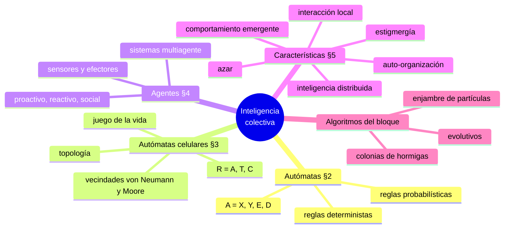
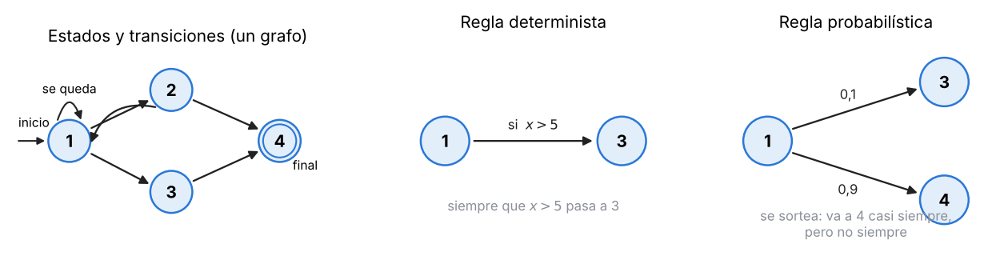
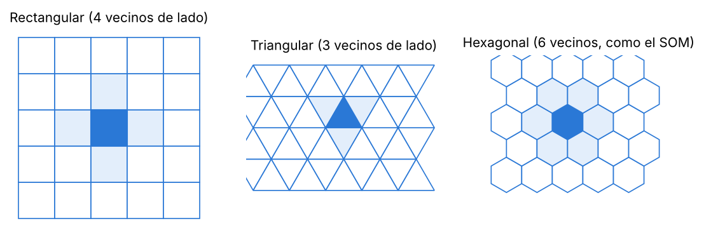
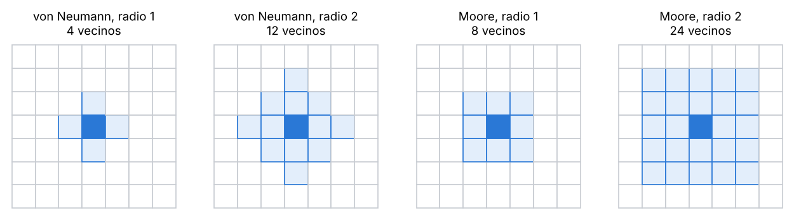
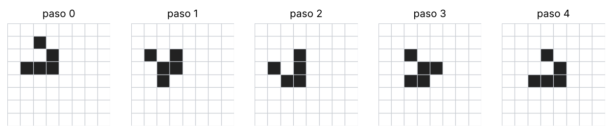
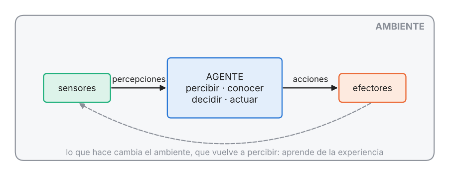

## Mapa del tema

---

## 1. La idea del bloque

En redes neuronales y en lógica borrosa había **un** sistema que resolvía el problema. Acá la inteligencia **surge de un colectivo**: muchos individuos sencillos que interactúan, y ninguno de ellos «sabe» resolver el problema.

> **IDEA DE FONDO — la frase con la que conviene arrancar**
> *«En inteligencia colectiva no hay un individuo inteligente: hay muchos individuos con reglas muy simples que interactúan, sobre todo localmente, y el comportamiento inteligente **emerge** de esa interacción.»* Todo lo demás de esta unidad es vocabulario para decir eso con precisión.

Antes de los algoritmos hay tres formalismos que sirven de marco: **autómatas**, **autómatas celulares** y **agentes**. Son **distintas formas de llegar a lo mismo**: individuos con estado que reciben algo, actúan y se influyen.

---

## 2. Autómatas de estados finitos

**Definición** (diapositiva):

$$A = \langle X,\ Y,\ E,\ D\rangle$$

| Símbolo | Qué es |
|---|---|
| $X$ | las **entradas** |
| $Y$ | las **salidas** |
| $E$ | el conjunto de **estados** por los que va pasando |
| $D$ | las **reglas de transición**: cómo se pasa de un estado a otro |

**Extensión con función de salida:** $y = \lambda(x, E)$. La salida depende de la entrada y del estado. A veces no hace falta: la salida es directamente el número de estado, o directamente no hay salida.

Se dibuja como un **grafo**: cada estado es un nodo y cada transición, una flecha. Puede haber un **estado inicial** (por donde siempre arranca) y uno **final** (donde termina el ciclo); hay autómatas que no los definen y funcionan continuamente. Una flecha que vuelve al mismo nodo es «quedarse en el estado».

### Reglas deterministas y probabilísticas

- **Determinista:** se evalúa una condición y la transición es segura. *«Estando en 1, si la entrada es mayor que 5, pasar a 3.»*
- **Probabilística:** cada transición tiene una probabilidad. *«Estando en 1, pasar a 3 con 0,1 y a 4 con 0,9.»* Se implementa sorteando: un número entre 1 y 10; si sale 1, va a 3; si no, a 4. **No hay certeza** de a dónde va: con más probabilidad a 4, pero no siempre.

De ahí la distinción entre **autómatas deterministas y probabilísticos**. Los dos se usan para hacer **modelos**.

> **OJO — guardá la regla probabilística**
> Es la primera aparición de algo que va a estar en todos los algoritmos del bloque: **reglas que combinan una parte determinista con una parte aleatoria**. En el AG la selección es exactamente una regla probabilística.

---

## 3. Autómatas celulares

**Definición** (diapositiva):

$$R = \langle A,\ T,\ C\rangle$$

| Símbolo | Qué es |
|---|---|
| $A$ | los **autómatas** que lo componen (cada uno es una «célula») |
| $T$ | la **topología**: cómo están organizados en el espacio |
| $C$ | el **acoplamiento** (la «colectividad»): quién se conecta con quién y cómo |

Es una **red de autómatas**. Se usaban para simular tejidos, donde cada autómata era una célula: de ahí el nombre.

### Topología

Triangular, rectangular, hexagonal… en 2 dimensiones, pero se pueden definir en más. Notá la relación con el **mapa autoorganizativo**, que también tenía neuronas con topología (y usaba mucho la hexagonal).

### Acoplamiento: vecindades y conexiones

**Tipo y tamaño de vecindad.** Definen con quién está conectado cada autómata y hasta dónde llega la conexión (otra vez, como en el SOM).

- **Von Neumann**: los que están a distancia 1 **en cruz** (arriba, abajo, izquierda, derecha). Radio 2: se agregan los que están a dos pasos en cruz y los de las diagonales que quedan a dos pasos.
- **Moore**: **todos** los que rodean al central, incluidas las diagonales. Radio 2: el cuadrado de $5\times5$.

> **Llegás a:** von Neumann tiene $2r(r+1)$ vecinos (4 con radio 1, 12 con radio 2); Moore tiene $(2r+1)^2 - 1$ (8 y 24).

**Tipo de conexión.**

- **Isotrópica**: igual en todas las direcciones.
- **Anisotrópica**: con un sentido preferencial. El autómata se conecta con distinta fuerza con el de la derecha que con el de arriba o el de la diagonal. Es más compleja, pero útil para modelar (por ejemplo, un impulso que se propaga mejor en una dirección, como en el tejido cardíaco).

### El juego de la vida de Conway

Ejemplo histórico, que da origen a los **modelos de vida artificial** (simular un sistema vivo por computadora). Una rejilla, como una placa de Petri, con un organismo o ninguno en cada celda, vecindad de Moore y cuatro reglas **deterministas**:

| Estado de la celda | Vecinos vivos | Pasa a |
|---|---|---|
| viva | menos de 2 | **muere** (soledad) |
| viva | más de 3 | **muere** (sobrepoblación: se quedan sin alimento) |
| viva | 2 o 3 | **sigue viva** |
| muerta | exactamente 3 | **nace** |

Lo que interesa es que **de cuatro reglas locales salen comportamientos globales complejos**: poblaciones que se extinguen, que explotan o estructuras que se desplazan solas. El ejemplo clásico es el **planeador**:

Para verlo andar: *Mirek's Cellebration*. Y las aplicaciones reales: crecimiento de plantas y bacterias (las simulaciones coinciden con lo que ocurre en la naturaleza), colonias de hormigas, enjambres, modelos presa–predador, **tejidos** (modelos completos del corazón para simular infartos o arritmias y probar una cirugía antes de hacerla), fluidos.

---

## 4. Agentes y sistemas multiagente

**Un agente es un sistema que** está **situado en un ambiente**, es capaz de **realizar acciones automáticas** y lo hace **para cumplir sus objetivos de diseño**. En una definición tan amplia, el autómata ya era un agente.

**Un agente inteligente debe ser:**

- **proactivo**: actúa sin que se lo pidan;
- **reactivo**: responde a una demanda o a un cambio del ambiente;
- **con habilidad social**: interactúa con otros agentes (o con humanos). Es lo que más interesa en la materia: un agente aislado es como un autómata aislado.

**Otra definición:** un agente es todo aquello que **percibe su ambiente mediante sensores** y **actúa sobre él mediante efectores**.

**Autonomía:** capacidad de **aprender de la experiencia** y de **modificar su comportamiento en tiempo de ejecución**. Es lo que más interesa en la materia: el agente no es siempre el mismo.

**Agente racional:** el que realiza las acciones correctas. **Agente racional ideal:** el que puede **percibir, conocer, decidir y actuar**.

### Sistemas multiagente

El énfasis pasa a la **cooperación**, que puede ser por **interacción**, por **contratos** o por **negociación**. Y aparece la **racionalidad social**: un agente la tiene si puede realizar acciones que generan un beneficio **a todos**, y si ese beneficio es mayor que sus pérdidas propias. Se formaliza con la utilidad:

$$\text{utilidad esperada} = f(\text{utilidad individual}) + f(\text{utilidad social})$$

---

## 5. Inteligencia colectiva: características

**Los nombres.** La terminología es dispersa porque el área es nueva (fines de los 90, auge a mediados de los 2000): **computación evolutiva** (algoritmos genéticos, programación genética, estrategias evolutivas), **inteligencia de colonias** (hormigas), **de enjambres** (abejas, pájaros), **colaborativa**, **social**. Se incluyen mutuamente y ninguna cubre todo.

**Las características**, una por una, con un ejemplo:

| Característica | Qué significa | Ejemplo |
|---|---|---|
| **Auto-organización** | la estructura no se define de antemano: se arma sola al ver los datos o al interactuar | el SOM ordenando sus neuronas según la estructura de los datos |
| **Estigmergía** | **colaboración a través del medio físico**: un individuo deja una marca en el ambiente y los otros reaccionan a esa marca | las hormigas y las feromonas |
| **Comportamiento emergente** | un comportamiento global que nadie programó, que surge de la interacción de muchos individuos sencillos | el planeador; el corazón: cada célula sólo transmite un impulso a la que sigue |
| **Inteligencia distribuida y robustez** | no hay un individuo que dirija; si uno falla, el sistema sigue | si muere una hormiga, el hormiguero sigue (como un nodo caído en internet) |
| **Fuerte interacción local** | los cercanos (físicamente o en otro sentido) interactúan mucho; los lejanos, poco | las vecindades de los autómatas y del SOM |
| **Organización social estructurada** | con el tiempo aparecen roles y jerarquías | — |
| **Colaboración vs. competencia** | siempre hay un compromiso: ninguno de los dos extremos es bueno | colaborar para conseguir el alimento de la colonia o cortarse solo |
| **Componentes estocásticas** | hay azar en las reglas, y es **una fortaleza** y una clave para la convergencia | igual que la inicialización al azar de una red |
| **Bio-inspiración** | se copia algo que a la naturaleza le funcionó y se lo usa en problemas que no tienen nada que ver | bandadas, hormigas, abejas, cardúmenes, rebaños, manadas |

> **IDEA DE FONDO — estigmergía, explicada**
> **Definición:** comunicación y coordinación **indirecta**, a través de modificaciones del ambiente. Nadie le dice nada a nadie: uno **deja una marca** y los demás **reaccionan a la marca**.
> **Ejemplo:** las hormigas no se comunican (o no sólo) directamente: dejan **feromonas** en el camino. Las otras detectan el rastro y tienden a seguirlo; los caminos más usados se refuerzan, y así la colonia termina llevando el alimento por un camino común sin que ninguna hormiga lo haya decidido.
> **El detalle que se escapa:** la estigmergía es **una** de las características, **no es común a todos** los algoritmos del bloque. En un algoritmo genético, por ejemplo, no hay medio físico compartido.

**Los individuos** tienen muchos nombres: *boids*, partículas, objetos, elementos, autómatas (en redes de autómatas celulares), agentes (en sistemas multiagente). ¿Y **neuronas**? Sí: una neurona también es un autómata con estado, y una red puede verse como un sistema multiagente; el SOM ya tenía auto-organización y comportamiento emergente.

**Los algoritmos que se ven en la materia:** algoritmos **evolutivos**, **colonias de hormigas** y **enjambre de partículas**. Otros que siguen los mismos principios y no se ven: difusión estocástica, formación de ríos, búsqueda gravitacional, sistemas inmunes artificiales, algoritmos meméticos.

**Aplicaciones:** optimización (aproximar funciones, **entrenar** otros sistemas como una red neuronal, estimar, identificar sistemas, planificar), búsqueda y ruteo (como alternativa a la búsqueda en profundidad o en amplitud), agrupamiento no supervisado y clasificación.

---

## 6. Claves de la unidad

| Clave | Qué tenés que poder responder |
|---|---|
| La idea | La inteligencia emerge de muchos individuos simples que interactúan |
| Autómata | $A = \langle X, Y, E, D\rangle$; grafo de estados; salida $y = \lambda(x,E)$ |
| Reglas | Determinista (condición → transición segura) y probabilística (se sortea) |
| Autómata celular | $R = \langle A, T, C\rangle$; topologías; vecindades von Neumann y Moore; iso/anisotrópica |
| Conway | Las cuatro reglas; comportamiento emergente |
| Agente | Situado en un ambiente, acciones automáticas, objetivos; sensores y efectores; autonomía |
| Agente inteligente | Proactivo, reactivo, con habilidad social |
| Racional ideal | Percibir, conocer, decidir, actuar |
| Multiagente | Cooperación (interacción, contratos, negociación); racionalidad social |
| Características | Las nueve de la tabla, con un ejemplo cada una |
| Estigmergía | Colaboración a través del medio; las feromonas |

## 7. Autoevaluación

1. ¿Qué diferencia a un algoritmo de inteligencia colectiva de una red neuronal entrenada?
2. Escribí la definición de autómata y explicá cada símbolo. Dibujá un grafo de cuatro estados con estado inicial y final.
3. Escribí una regla determinista y una probabilística. ¿Cómo se implementa la segunda?
4. Escribí la definición de autómata celular. Dibujá la vecindad de Moore y la de von Neumann de radio 2 y contá los vecinos (24 y 12).
5. ¿Qué es una conexión anisotrópica? Dá un caso donde tenga sentido.
6. Enunciá las reglas del juego de la vida. ¿Qué tiene que ver con el comportamiento emergente?
7. ¿Qué es un agente? ¿Qué se le pide a uno inteligente? ¿Y a uno racional ideal?
8. ¿Qué es la racionalidad social?
9. Definí estigmergía con un ejemplo. ¿Está presente en un algoritmo genético?
10. Nombrá cinco características de la inteligencia colectiva con un ejemplo cada una. ¿Por qué la inteligencia distribuida da robustez?
