## Mapa del tema

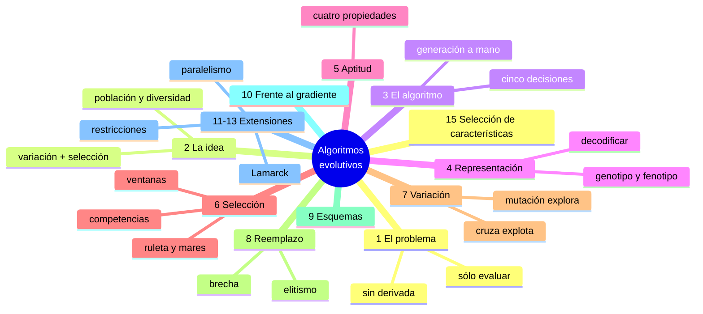

---

## 1. El problema que resuelven

Un algoritmo evolutivo es un método de **búsqueda**: sirve para encontrar una solución buena en un problema donde hay **muchísimas** soluciones posibles. Ejemplos:

- ubicar 10 figuras en un lienzo de tela desperdiciando lo menos posible;
- elegir los pesos de una red neuronal;
- elegir el orden en que un viajante recorre 100 ciudades.

En todos pasa lo mismo:

1. **No se pueden probar todas.** Con 100 ciudades hay $100!$ recorridos. Con 10 figuras en una grilla de $16\times16$, hay $256^{10}$ ubicaciones.
2. **Muchas veces no hay una fórmula ni una derivada** que diga para dónde mejorar. ¿Cuál es la derivada de «tela desperdiciada» respecto de «poner el círculo más a la izquierda»?
3. **Lo que sí se puede hacer es evaluar:** dada **una** solución concreta, calcular qué tan buena es.

Un algoritmo evolutivo usa **sólo** el punto 3. No necesita fórmula ni derivada: necesita poder **medir**. Por eso se aplica a problemas donde los métodos de gradiente (los que veníamos usando para entrenar redes) no sirven.

**El ejemplo que se usa en todo el apunte.** Para ver cada pieza con números, se toma un problema de juguete: encontrar el $x$ entero entre 0 y 31 que hace máxima a $f(x) = x^2$. Ya sabemos que la respuesta es 31, y justamente por eso sirve: se puede ver si el algoritmo se acerca.

---

## 2. La idea: copiar la evolución de Darwin

### Lamarck y Darwin

Hace 200 años ya se discutía que las especies cambian. **Lamarck** propuso un mecanismo: la jirafa se **esfuerza** por alcanzar las hojas altas, **estira** el cuello durante su vida y le **hereda** ese cuello más largo a sus hijos. **Falla** en eso último: los **caracteres adquiridos** durante la vida **no se heredan**. El que va al gimnasio no tiene hijos más musculosos. Lo que se hereda es lo que ya viene codificado en el material genético desde que el individuo nace.

**Darwin** explicó el cambio con dos piezas:

1. **Variación:** los hijos **nacen** con pequeñas diferencias respecto de sus padres. Hay jirafas que nacen con el cuello un poco más largo que otras.
2. **Selección natural:** las de cuello más largo comen mejor, por lo que tienen **más probabilidad** de sobrevivir y tener hijos, y les pasan esa característica.

Nadie estira nada. Lo que cambia es **qué proporción de la población** tiene cuello largo: en cada generación, las de cuello largo dejan un poco más de hijos que las otras, y la población entera se corre.

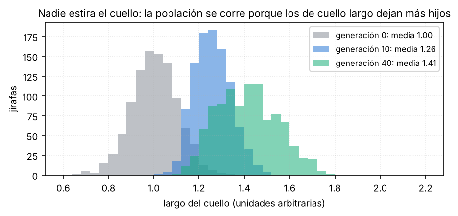

### Cómo se traduce a un algoritmo

| En la naturaleza | En el algoritmo |
|---|---|
| un individuo (una jirafa) | **una solución candidata** del problema (un valor de $x$, una ubicación de las figuras) |
| la población | un **conjunto** de soluciones candidatas que se mantienen a la vez |
| el material genético | la solución **escrita como una cadena de bits** (el **cromosoma**) |
| qué tan adaptado está al ambiente | qué tan buena es la solución: la **aptitud** |
| sobrevivir y reproducirse | ser elegido como **padre** de la próxima generación |
| la variación al nacer | **cruza** y **mutación** de los cromosomas |

De esta traducción salen cuatro reglas de diseño que van a aparecer en cada parte del algoritmo:

**1. Se trabaja con una población, no con una solución.** Una red neuronal entrenada con retropropagación es **una** solución que se va corrigiendo. Acá hay, por ejemplo, 100 soluciones a la vez, y la búsqueda avanza porque la población cambia.

**2. «Mejor adaptado» quiere decir «mejor según la aptitud».** En la naturaleza no existe el mejor individuo en sentido absoluto: existe el mejor adaptado a las condiciones de ahora. En el algoritmo, «las condiciones» son la función de aptitud que vos definís. Si la aptitud está mal definida, el algoritmo encuentra muy bien la solución equivocada.

**3. La selección tiene que tener azar.** El mejor tiene **más probabilidad** de ser padre, no la certeza, y el peor tiene **poca**, pero no cero. En §6 se ve con números por qué, si se eligen siempre los mejores, el algoritmo se traba.

**4. Hay que mantener la diversidad.** Si todos los individuos son iguales, la selección no tiene nada para elegir y la cruza de dos iguales da otro igual: **la búsqueda se detiene**. La mutación existe sobre todo para que eso no pase.

---

## 3. El algoritmo

### Una generación hecha a mano

Antes del pseudocódigo, una generación completa del ejemplo $f(x)=x^2$, con 4 individuos de 5 bits.

**Paso 1: población inicial al azar.**

| Individuo | Cromosoma | $x$ | Aptitud $f = x^2$ | Probabilidad de ser padre |
|---|---|---:|---:|---:|
| 1 | `01101` | 13 | 169 | 169/1170 = 14,4 % |
| 2 | `11000` | 24 | 576 | 49,2 % |
| 3 | `01000` | 8 | 64 | 5,5 % |
| 4 | `10011` | 19 | 361 | 30,9 % |
| | | | suma 1170; **media 292,5**; máx. 576 | |

**Paso 2: selección.** Cada uno tiene probabilidad de ser padre proporcional a su aptitud (la última columna; es la **ruleta**, §6). Se sortean 4 padres y salen, por ejemplo, el 13, el 24, otra vez el 24 y el 19. El 24 salió dos veces porque es el mejor; el 8 no salió, pero **podía** salir.

**Paso 3: cruza.** Se arman parejas, se corta a los dos padres **en el mismo lugar** y se intercambian las colas:

| Pareja | Corte | Hijos |
|---|---|---|
| `0110|1` (13) × `1100|0` (24) | después del 4.º bit | `01100` (12) y `11001` (25) |
| `11|000` (24) × `10|011` (19) | después del 2.º bit | `11011` (27) y `10000` (16) |

**Paso 4: mutación.** Cada bit de cada hijo se invierte con una probabilidad muy chica (por ejemplo, 1 %). En esta generación no salió ninguno.

**Paso 5: la nueva población** son los hijos.

| Cromosoma | $x$ | Aptitud |
|---|---:|---:|
| `01100` | 12 | 144 |
| `11001` | 25 | 625 |
| `11011` | 27 | 729 |
| `10000` | 16 | 256 |
| | | **media 438,5**; máx. 729 |

> **Llegás a:** en una generación la aptitud media pasó de **292,5 a 438,5** y la mejor, de **576 a 729**. El algoritmo nunca usó que $f = x^2$ ni ninguna derivada: sólo **eligió más a los mejores y los mezcló**. Se repite hasta llegar a `11111` (31).

**Por qué mejoró.** Los padres más elegidos (24 y 19) empiezan con `1`, que es lo que hace grande a $x$: ese primer bit vale 16. La cruza conservó ese `1` en tres de los cuatro hijos y le juntó otros bits buenos. Esa es la idea de fondo de todo el método: **los pedazos de cromosoma que están en las soluciones buenas se multiplican, y la cruza los junta** (en §9 se formaliza).

### El pseudocódigo de la diapositiva

```text
Inicializar(Población)                              # al azar
MejorAptitud ← Evaluar(Población)
mientras MejorAptitud < AptitudRequerida
    Progenitores ← SelecciónNatural(Población)      # paso 2
    Población    ← ReproducciónVariación(Progenitores)   # pasos 3, 4 y 5
    MejorAptitud ← Evaluar(Población)
fin
```

Es exactamente lo que se hizo a mano. `ReproducciónVariación` esconde la cruza, la mutación y el armado de la población nueva.

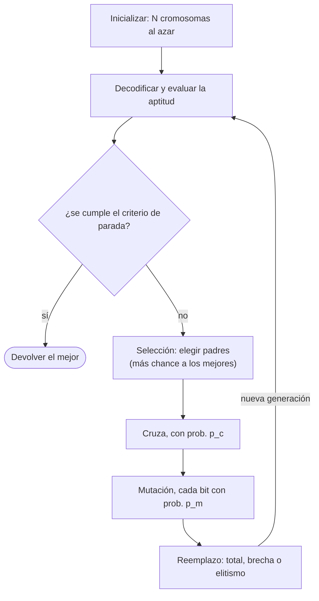

### El mismo algoritmo con las funciones a la vista

```text
AG(N, L, p_c, p_m):
    P ← N cromosomas de L bits al azar
    f ← aptitud(decodificar(P))
    mientras max(f) < f_requerida y no se pasó el máximo de generaciones:
        H ← {}                                        # los hijos
        mientras |H| < N:
            a ← seleccionar(P, f);  b ← seleccionar(P, f)
            si U(0,1) < p_c:  a, b ← cruzar(a, b)
            a ← mutar(a, p_m);  b ← mutar(b, p_m)
            H ← H ∪ {a, b}
        P ← H                                          # reemplazo (§8)
        f ← aptitud(decodificar(P))
    devolver el cromosoma de máxima f
```

Qué hace cada pieza, con el ejemplo:

| Pieza | Qué hace | En el ejemplo |
|---|---|---|
| `decodificar` | pasa el cromosoma a la solución del problema | `10011` → 19 |
| `aptitud` | mide qué tan buena es la solución | 19 → 361 |
| `seleccionar` | elige un padre, con más probabilidad cuanto mejor es | la ruleta |
| `U(0,1) < p_c` | la cruza se hace con probabilidad $p_c$ (por ejemplo 0,9); si no, los hijos son copias de los padres | |
| `cruzar` | corta a los dos padres en el mismo punto al azar e intercambia las colas | `0110|1` × `1100|0` |
| `mutar` | recorre los bits y cada uno se invierte con probabilidad $p_m$ (por ejemplo 0,01) | |
| `P ← H` | la nueva población reemplaza a la vieja | |

**Cuándo parar.** El `mientras` puede cortar por cualquiera de estos criterios, o por el primero que se cumpla:

- se llegó a una **cantidad máxima de generaciones**;
- se alcanzó la **aptitud deseada** (si se sabe cuánto es «suficientemente bueno»);
- la mejor aptitud **no mejoró durante $n$ generaciones** seguidas: el algoritmo se estancó.

**Las cinco decisiones.** Para aplicar el algoritmo a un problema cualquiera hay que decidir cinco cosas, que son los cinco «elementos de un algoritmo evolutivo» de la diapositiva:

1. **Representación:** cómo se escribe una solución como cromosoma (§4).
2. **Función de aptitud:** cómo se mide una solución (§5).
3. **Selección:** cómo se eligen los padres (§6).
4. **Operadores de variación:** cómo se cruzan y mutan (§7).
5. **Reemplazo:** quiénes forman la generación siguiente (§8).

> **IDEA DE FONDO — dónde está el trabajo**
> Las dos primeras **dependen del problema** y hay que pensarlas cada vez. Las otras tres son **casi siempre las mismas** y no saben nada del problema: cortan, pegan e invierten bits. Por eso, para resolver un problema nuevo con un algoritmo evolutivo, lo que hay que pensar bien es la representación y la aptitud.

---

## 4. Representación de los individuos

### Por qué hace falta

La cruza y la mutación sólo saben hacer tres cosas con cadenas de bits: **cortarlas, pegarlas e invertir un bit**. No saben qué es una figura, un peso o una ciudad. Entonces, antes de usar el algoritmo, hay que decidir **cómo se escribe cualquier solución del problema como una cadena de bits**. Esa decisión es la **representación**.

Dos nombres que salen de la biología:

- **Fenotipo:** la solución en el idioma del problema. «$x = 19$», «el triángulo va en (7,3)».
- **Genotipo:** la misma solución escrita como cadena de bits: `10011`. Se le dice **cromosoma**; cada posición es un **gen**, y los valores que puede tomar un gen (0 y 1) son los **alelos**.

Hacen falta dos funciones:

- **Decodificar** (genotipo → fenotipo). Es **imprescindible**: la aptitud se calcula sobre la solución, no sobre los bits. Con `10011` no se puede calcular $f$; con 19 sí.
- **Codificar** (fenotipo → genotipo). Sirve, por ejemplo, para meter en la población una solución que ya conocés.

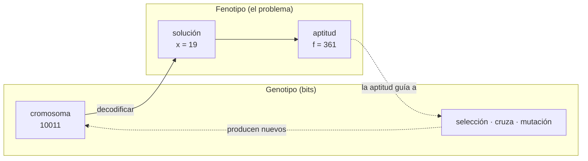

> **OJO — dónde ocurre cada cosa**
> La **cruza y la mutación** trabajan sobre el **genotipo** (los bits). La **aptitud** se mide sobre el **fenotipo** (la solución). Por eso se dice que el algoritmo busca «en un espacio codificado».

### Números reales en bits

Si la solución es un real $x \in [a, b]$, se usan $L$ bits $a_1 a_2 \ldots a_L$ que se leen como un entero entre 0 y $2^L-1$,
$$d = \sum_{i=1}^{L} 2^{L-i}\,a_i ,$$
y ese entero se estira al intervalo:

$$x = a + (b-a)\,\frac{d}{2^L - 1}$$

**Ejemplo:** $x\in[-100, 100]$ con 4 bits. El cromosoma `0101` es el entero 5, y entonces $x = -100 + 200\cdot 5/15 = -33{,}33$.

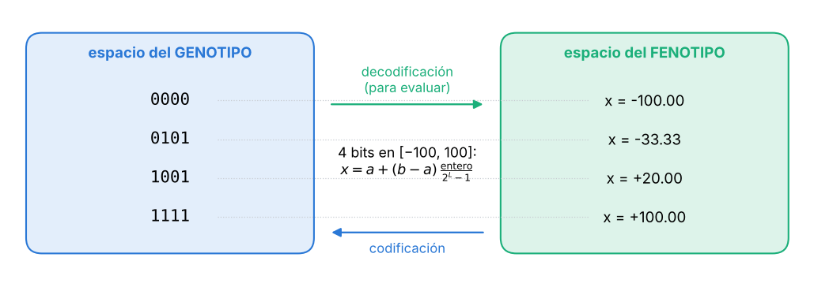

**Cuántos bits.** La distancia entre dos valores representables consecutivos es la **resolución**:

$$\Delta = \frac{b-a}{2^L-1}$$

Con 4 bits en $[-100,100]$, $\Delta = 13{,}3$: muy grueso. Con 20 bits, $\Delta = 0{,}00019$. Se eligen los bits según la precisión que se necesita: $L \ge \log_2\!\big((b-a)/\Delta + 1\big)$. Para $\Delta = 0{,}01$ en $[-1,1]$: $\log_2(201) = 7{,}65$, así que 8 bits.

**Un problema del binario: vecinos que difieren en muchos bits.** 7 es `0111` y 8 es `1000`. Son valores vecinos, pero difieren en **los cuatro bits**: para que una mutación lleve de 7 a 8 hacen falta cuatro inversiones a la vez, cosa muy improbable. El **código Gray** ordena los enteros de modo que dos consecutivos difieren siempre en **un** bit (en Gray, 7 es `0100` y 8 es `1100`). Por eso a veces se codifica en Gray en lugar de binario.

### Cómo se diseña una representación

**La pregunta para empezar:** si alguien ya hubiera resuelto el problema, **¿qué datos te tendría que pasar** para que puedas usar la solución? Esa lista de datos es el fenotipo. Después se decide cuántos bits usa cada dato.

**Ejemplo: figuras en un lienzo.** Hay que cortar figuras de un rectángulo de tela. Con 2 figuras, una solución sería:

```text
triángulo en (7, 3)
círculo   en (2, 2)
```

Eso alcanza para cortar: qué figura es y dónde va. Ahora, una regla fija para pasarlo a bits:

- **2 bits para el tipo de figura:** `01` triángulo, `10` círculo, `11` cuadrado.
- **4 bits por coordenada** (valores de 0 a 15).

```text
  tipo   coord. 1  coord. 2     tipo   coord. 1  coord. 2
   01      0111      0011        10      0010      0010
triángulo   7         3        círculo    2         2
```

El cromosoma es `01 0111 0011 10 0010 0010`: **10 bits por figura**. Con 10 figuras son **100 bits**, y una población de 1000 individuos es una matriz de $1000 \times 100$ bits.

> **IDEA DE FONDO — la prueba de una buena representación**
> Preguntate: **si corto este cromosoma en cualquier lugar y lo pego con otro, o le invierto un bit, ¿lo que sale sigue siendo una solución que se puede decodificar y evaluar?** En el lienzo, sí: cualquier cadena de 100 bits es una ubicación de 10 figuras (quizás mala, pero evaluable). Si la respuesta es «no», los operadores van a fabricar basura (y hay que hacer lo de §12).

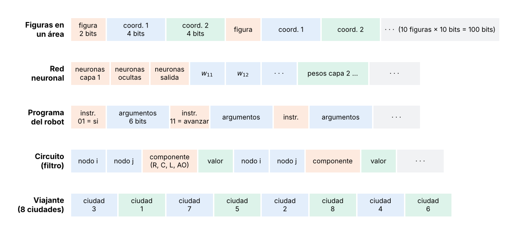

**Red neuronal.** La solución es la arquitectura (neuronas por capa) y todos los pesos. Cromosoma: unos bits por cada cantidad de neuronas y, uno atrás del otro, los pesos de cada capa, cada uno con la fórmula de los reales.

**Programa de un robot.** El robot tiene que recorrer las paredes de una habitación sin chocar. La solución es un programa: «si el sensor de adelante detecta algo, girar a la derecha; si no, avanzar».

- **Mala representación:** pasar el texto del programa a bits, letra por letra. Al cruzar dos programas o invertir un bit, `if` puede quedar `af`, y el programa ni compila. Falla la prueba de arriba.
- **Buena representación:** una lista de **instrucciones**, cada una con un **código** (`01` = si, `11` = avanzar, `10` = retroceder…) seguido de sus **argumentos** (qué sensor, qué valor). Cualquier cadena de bits es una lista de instrucciones válida, y la cruza intercambia instrucciones enteras entre programas.

**Circuito (un filtro).** Se numeran los nodos del circuito y, para cada par de nodos, se codifica **qué componente hay** (cable, resistencia, capacitor…) y **su valor**.

**Viajante.** La solución es el orden de las ciudades: un lugar por ciudad, con el número de ciudad (3 bits para 8 ciudades). Esta representación **no pasa la prueba**: al cruzar dos recorridos pueden salir ciudades repetidas y otras sin visitar. Cómo se resuelve está en §12.

### Representación fenotípica

No siempre se usan bits. Si los genes son **directamente los valores** del problema (un vector de números reales, una lista de ciudades), la representación se llama **fenotípica** (o real).

| Ventajas | Desventajas |
|---|---|
| No hay que codificar ni decodificar | La cruza y la mutación de bits no sirven: hay que usar **otros operadores** (§7) |
| La precisión no depende de cuántos bits se elijan | Hay que vigilar que los valores no se salgan del dominio $[a,b]$ |
| Un cambio chico en el gen es un cambio chico en la solución (no hay saltos como 7 → 8) | No vale el teorema de los esquemas (§9), que es para cadenas binarias |

---

## 5. La función de aptitud

### Qué es

Es la función que a cada solución le asigna **un número que dice qué tan buena es**: **más alto, mejor**. En el ejemplo, la aptitud de $x$ es $x^2$.

Es la pieza más importante del diseño, porque la selección se basa sólo en ella: **el algoritmo busca lo que la aptitud premia**, sea o no lo que querías.

### Lo que se le pide

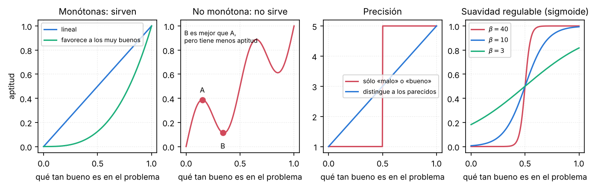

**1. Monotonicidad.** Si una solución es mejor que otra, tiene que tener **más** aptitud. Puede crecer en forma lineal o más rápido para los muy buenos, pero nunca puede bajar. Si baja, como en el panel 2 (B es mejor que A pero tiene menos aptitud), la selección favorece a A y **el algoritmo se mueve hacia peores soluciones**.

**2. Precisión.** Tiene que **distinguir soluciones parecidas**. Si sólo vale 1 («mala») o 5 («buena»), entre dos soluciones buenas la selección no tiene cómo elegir la mejor, y el algoritmo deja de mejorar apenas todas son «buenas».

**3. Suavidad regulable.** Conviene poder graduar con un parámetro qué tan abrupta es. La sigmoide con pendiente $\beta$ es el ejemplo: con $\beta$ grande separa mucho a los que están de un lado y del otro; con $\beta$ chico, poco. No es obligatoria.

**4. Penalización de la complejidad.** Si dos soluciones resuelven igual, que gane la más simple. Ejemplo: si una red con 100 neuronas ocultas clasifica igual que una con 10 000, se le resta aptitud a la grande. Si no, el algoritmo no tiene ningún motivo para preferir la chica.

### Del error a la aptitud

Muchos problemas se plantean como **minimizar** algo: un error, un costo, una distancia. La aptitud se **maximiza**, así que hay que darla vuelta con una función **decreciente**:

$$f = -E, \qquad f = C - E, \qquad f = \frac{1}{1+E}$$

La última vale 1 cuando $E = 0$, tiende a 0 cuando $E$ crece, y nunca es negativa (eso lo necesita la ruleta).

### Ejemplos

**Lienzo.** Lo que se quiere es aprovechar la tela, pero también que las figuras no se pisen ni se salgan. Se suma lo bueno y se resta lo malo:

$$f = A_{\text{ocupada}} - A_{\text{desperdiciada}} - A_{\text{solapada}} - 1000\cdot A_{\text{fuera}}$$

El coeficiente 1000 dice que dejar un pedazo de figura afuera es muchísimo peor que desperdiciar un poco de tela. Con los coeficientes se decide cuánto importa cada cosa.

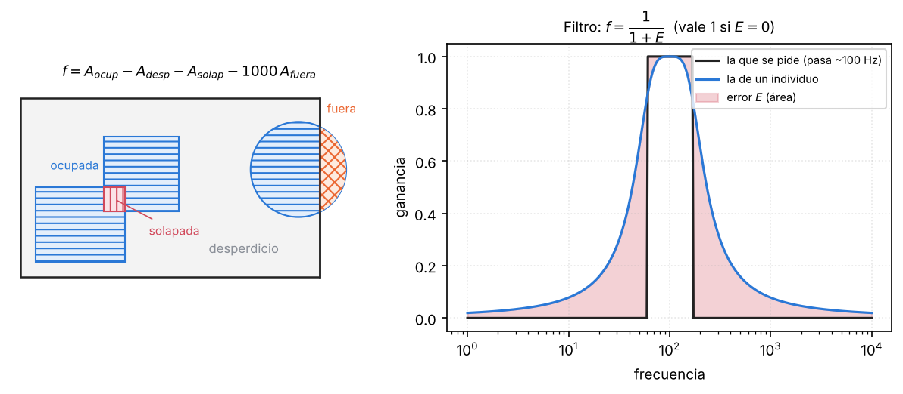

**Red neuronal.** La fracción de patrones bien clasificados. Si acierta 100 de 200 imágenes, $f = 0{,}5$. Mejor todavía: la tasa de acierto en **validación cruzada**, porque la de entrenamiento premia a la red que memoriza.

**Robot.** Se ponen puntos objetivo cada medio metro junto a las paredes y se cuenta cuántos alcanzó. Como también importa no dar vueltas de más, se resta la distancia recorrida:

$$f = \alpha\cdot(\text{objetivos alcanzados}) - \beta\cdot(\text{distancia recorrida})$$

**Filtro.** Se mide el área $E$ entre la respuesta en frecuencia pedida y la del circuito, y $f = 1/(1+E)$.

**Viajante.** $f = -(\alpha\cdot\text{distancia} + \text{otros costos})$, donde los otros costos pueden ser peajes u hoteles.

**Varios objetivos a la vez.** El lienzo y el robot quieren varias cosas al mismo tiempo. La forma más simple de resolverlo es la que se usó: una **suma ponderada** de los objetivos dentro de la aptitud.

**Aptitud sin fórmula.** Hay que ubicar los banners de una página web para que reciban más clics. El cromosoma son las coordenadas de cada banner, y la aptitud es **cuántos clics recibió** esa ubicación en el servidor real durante un día. No existe una fórmula ni, menos, una derivada. Al algoritmo no le importa: sólo necesita el número.

### Familias de funciones de aptitud

| Familia | Ejemplos |
|---|---|
| Promedios de error | error cuadrático medio, desviación media absoluta, error relativo medio |
| Estadísticas | varianza, validación cruzada, verosimilitud |
| Medidas de información | criterio de Akaike, criterio bayesiano, longitud mínima de descripción |
| Otras | correlaciones, distancias |

Las medidas de información combinan qué tan bien ajusta la solución con **cuántos parámetros usa**, así que sirven para la penalización de la complejidad.

---

## 6. Selección

### Por qué no se eligen simplemente los mejores

Parece lo obvio: quedarse con los dos mejores y cruzarlos. Con la población inicial del ejemplo, los dos mejores son:

```text
24 = 11000
19 = 10011
```

Mirá el **bit del medio**: es `0` en los dos. Para llegar a 31 (`11111`) hace falta un `1` ahí. Cruzando estos dos, **ningún hijo puede tener un `1` en el medio**, porque la cruza sólo reparte lo que los padres tienen. Ese `1` lo tenía el 13 (`01101`), que es el tercero, y se habría tirado.

> **IDEA DE FONDO — el peor también lleva información**
> Una solución mala en conjunto puede tener **un pedazo** que es justo lo que les falta a las buenas. Si la selección elige sólo a los mejores, la población se vuelve copia de ellos en pocas generaciones, se pierde la diversidad y el algoritmo queda atrapado en lo que esos primeros tenían. Eso se llama **convergencia prematura**.

De ahí los **dos requisitos** de todo método de selección:

1. **Favorecer a los más aptos:** la probabilidad de ser elegido tiene que crecer con la aptitud. Esto es lo que hace mejorar a la población.
2. **Darles posibilidad a todos:** hasta el peor tiene que poder salir, y el mejor puede no salir. Esto es lo que mantiene la diversidad.

Cuánto se favorece a los mejores se llama **presión selectiva**. Con mucha presión, el algoritmo converge rápido pero prematuramente. Con poca, la búsqueda es casi al azar. Cada método de selección es una forma de fijar esa presión.

### Rueda de ruleta

A cada individuo le toca una tajada de la ruleta **proporcional a su aptitud**. Se gira y sale el individuo donde cae. Para elegir 4 padres se gira 4 veces.

$$p_i = \frac{f_i}{\sum_{j=1}^{N} f_j}$$

![La ruleta de la población inicial del ejemplo, y la misma ruleta «estirada» sobre el intervalo [0, 1], que es como se programa.](../imagenes/07-ruleta.png)

**Cómo se programa.** No se dibuja ninguna ruleta. Se ponen las probabilidades una atrás de la otra sobre el intervalo $[0,1]$ (las **acumuladas**: 0,144; 0,637; 0,691; 1) y se sortea un número $r$ al azar entre 0 y 1. El individuo elegido es aquel en cuyo tramo cae $r$. Con $r=0{,}45$: está entre 0,144 y 0,637, así que sale el 24.

```text
ruleta(f):
    r ← U(0,1) · Σ f
    acumulada ← 0
    para i = 1..N:
        acumulada ← acumulada + f_i
        si acumulada ≥ r:  devolver i
```

Cumple los dos requisitos: el 24 sale casi la mitad de las veces y el 8, el 5,5 %, pero sale.

**Copias esperadas.** Si se gira $N$ veces, el individuo $i$ sale en promedio $N p_i = f_i / \bar f$ veces, donde $\bar f$ es la aptitud media. El 24 espera $576/292{,}5 = 1{,}97$ copias; el 8, $0{,}22$.

### El defecto de la ruleta: mira cocientes

La ruleta depende de **cuántas veces más grande** es una aptitud que otra, no de **cuál es mejor**. Por eso funciona mal cuando las aptitudes están todas muy juntas o hay uno muy por encima del resto.

**Ejemplo directo.** Dos individuos con aptitudes 1 y 2: la ruleta les da 33 % y 67 %. Si a los dos se les suma 50 (aptitudes 51 y 52), **el orden no cambió**, el segundo sigue siendo mejor, pero la ruleta les da 49,5 % y 50,5 %: casi una moneda.

De ahí los dos casos que tienen nombre:

**Mar de virtuosos.** Todos son buenos y casi iguales: aptitudes entre 49,9 y 50,1. Cada uno tiene prácticamente la misma tajada; el mejor no tiene ventaja. **La selección se vuelve un sorteo**, la presión desaparece y el algoritmo deja de mejorar, justo cuando está cerca de la solución.

**Mar de mediocres.** Un individuo con aptitud 10 entre 990 con aptitud 1. El bueno tiene una tajada de $10/1000 = 1\,\%$ y en cada tirada lo más probable es que salga un mediocre. Si se eligen pocos padres, el bueno probablemente no sale: en 2 tiradas, queda afuera con probabilidad $0{,}99^2 = 0{,}98$. Y si se gira la generación entera (991 veces), espera 9,9 copias, diez veces más que cualquiera: en unas 4 generaciones la población es casi toda copia suya. Cualquiera de los dos resultados es malo: **o se pierde la mejor solución o se pierde la diversidad**.

Los dos casos tienen la misma causa. Si se hace el histograma de las aptitudes, es **muy picudo**: todos amontonados en 50, o todos en 1. La ruleta sólo se porta bien cuando las aptitudes están razonablemente repartidas.

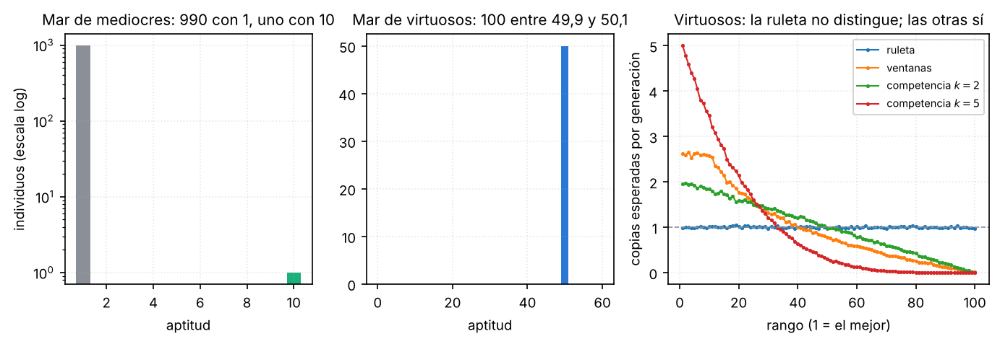

### Cómo se arregla

**Opción 1: re-escalar la aptitud** antes de la ruleta, para que las tajadas dependan de cuánto se separa cada uno del resto y no de la escala.

- **Escalado sigma:** se usa como cantidad de copias esperadas
$$c_i = 1 + \frac{f_i - \bar f}{2\sigma}$$
donde $\sigma$ es el desvío estándar de las aptitudes de la población. Con aptitudes 1 y 2: $\bar f = 1{,}5$, $\sigma = 0{,}5$, y las copias son 0,5 y 1,5. Con 51 y 52: $\bar f = 51{,}5$, $\sigma = 0{,}5$, y las copias son **otra vez 0,5 y 1,5**. Sumar una constante ya no cambia nada.
- **Escalado lineal:** $f' = af + b$, eligiendo $a$ y $b$ para que la media no cambie y el mejor espere entre 1,2 y 2 copias.
- **Por rango:** se reemplaza la aptitud por la **posición** en el orden (1.º, 2.º…). Es lo que hacen, en el fondo, los dos métodos que siguen.

**Opción 2: usar un método que sólo mire el orden.**

### Ventanas

Usa la aptitud **sólo para ordenar** a los individuos, de mejor a peor, y después sortea en «ventanas» cada vez más chicas:

1. Primer padre: se sortea uniforme entre **todos**.
2. Segundo padre: se sortea uniforme entre los mejores (por ejemplo, el 80 %).
3. Se sigue achicando la ventana. **Un padre por ventana.**

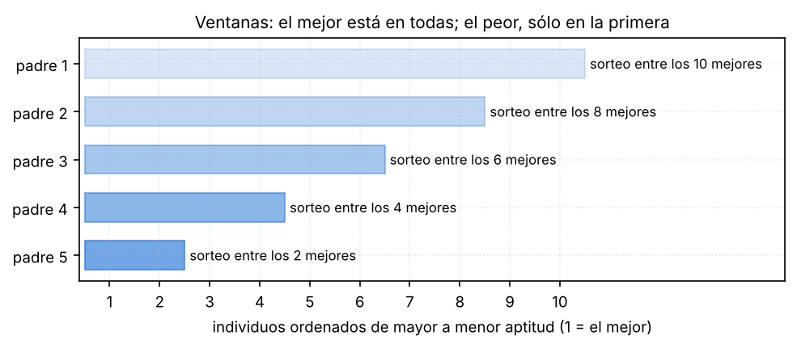

**Con el ejemplo.** Orden: 24, 19, 13, 8. Cuatro ventanas, de tamaño 4, 3, 2 y 1. Probabilidad de que cada uno sea elegido en un sorteo cualquiera:

| | Ventana de 4 | de 3 | de 2 | de 1 | Promedio |
|---|---:|---:|---:|---:|---:|
| 24 (1.º) | 1/4 | 1/3 | 1/2 | 1 | **0,521** |
| 19 (2.º) | 1/4 | 1/3 | 1/2 | — | **0,271** |
| 13 (3.º) | 1/4 | 1/3 | — | — | **0,146** |
| 8 (4.º) | 1/4 | — | — | — | **0,063** |

**Cómo cumple los requisitos:** el mejor está **en todas** las ventanas y tiene chance en cada una; el peor está **sólo en la primera**, así que tiene poca probabilidad, pero no cero. Y como usa el orden y no el valor, no le afectan los mares.

### Competencias (torneo)

Se eligen **$k$ individuos al azar** y gana el de mayor aptitud. Lo más común es $k=2$.

**Con el ejemplo y $k=2$.** Hay 6 parejas posibles entre 4 individuos, todas igual de probables. El 24 gana las 3 parejas en las que está; el 19 gana 2 (contra el 13 y el 8); el 13, 1; el 8, ninguna. Probabilidades: **0,50; 0,33; 0,17 y 0**.

- **El mejor** gana todas las competencias en las que entra: espera unas $k$ copias por generación, sea cual sea la escala de las aptitudes.
- **El peor no sale nunca** (no le gana a nadie, si los $k$ se eligen sin repetir). Todos los demás pueden salir.
- **$k$ es la perilla de la presión selectiva:** con $k=1$ es selección al azar; con $k=N$ gana siempre el mejor. Un $k$ más grande hace que los buenos ganen más.

Es el más usado porque es simple, no necesita ordenar la población y no tiene problemas con aptitudes negativas ni con los mares.

### Comparación

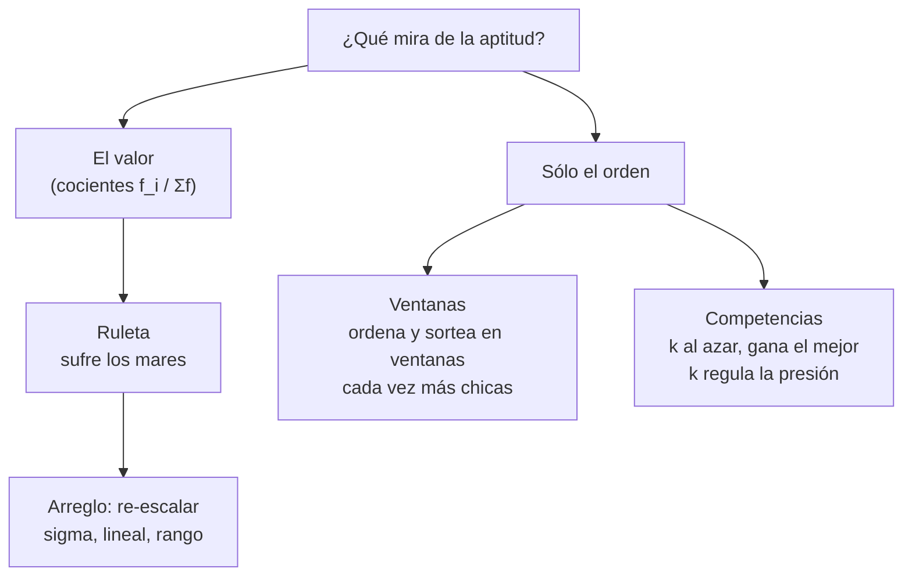

| | Ruleta | Ventanas | Competencias |
|---|---|---|---|
| Qué usa de la aptitud | el **valor** (los cocientes) | sólo el **orden** | sólo **quién gana** cada comparación |
| Mares de mediocres y virtuosos | **los sufre** | no | no |
| Aptitudes negativas | no (hay que desplazarlas) | da igual | da igual |
| Qué controla la presión | nada: la distribución de aptitudes | el tamaño de las ventanas | $k$ |
| Costo | una suma y una búsqueda por tirada | **ordenar** la población | $k$ comparaciones |
| ¿Puede salir el peor? | sí | sí (en la primera ventana) | no |

---

## 7. Operadores de variación

### Mutación

Se recorre el cromosoma y **cada bit se invierte con una probabilidad $p_m$** muy chica. Ejemplo: `10111101` → `10110101` (se invirtió el quinto bit).

**Para qué sirve:** es la única forma de que aparezca algo que **ningún** individuo de la población tiene. En el ejemplo de los dos mejores (`11000` y `10011`), la mutación es lo único que puede poner un `1` en el bit del medio.

**La tasa: ¿por gen o por individuo?** No es lo mismo. Con 100 individuos de 10 genes (1000 genes en total):

| Tasa | Si es por individuo | Si es por gen |
|---|---|---|
| 1 % | se muta 1 individuo | se mutan unos 10 genes; queda tocado el 9,6 % de los individuos |
| 10 % | se mutan 10 individuos | se mutan unos 100 genes; queda tocado el 65 % de los individuos |

La fracción de individuos con al menos un gen mutado sale de $1-(1-p_m)^L$: la probabilidad de que **ninguno** de sus $L$ genes mute es $(1-p_m)^L$. Hay dos convenciones habituales, y dicen casi lo mismo: dar la tasa **por gen** con $p_m \approx 1/L$ (en promedio un gen mutado por individuo), o dar la tasa **por individuo**, del orden de 0,1 (uno de cada diez hijos recibe una mutación, en un gen al azar). Lo importante es decir cuál de las dos se está usando.

### Cruza simple

Se elige **un punto de corte al azar**, el mismo en los dos padres, y se **intercambian las colas**. De dos padres salen dos hijos. Se aplica con probabilidad $p_c$ (alta: entre 0,8 y 0,9); si no se aplica, los hijos son copias de los padres.

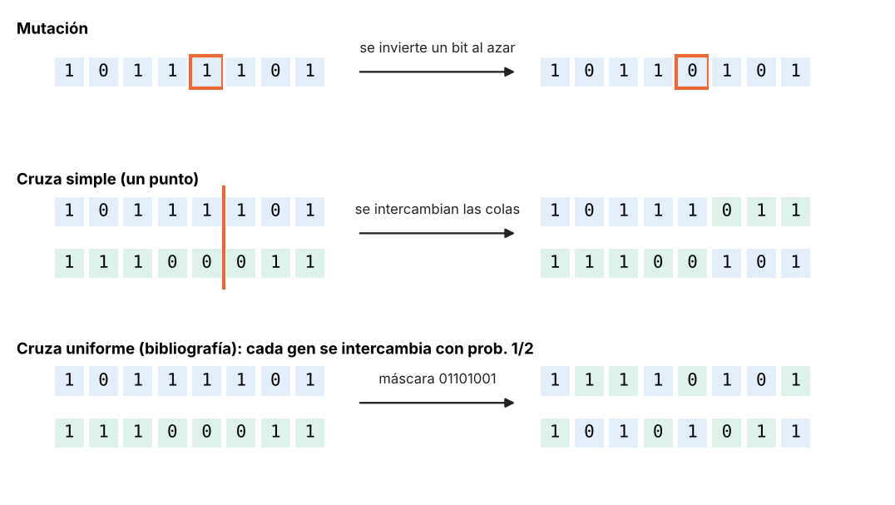

**Ejemplo:** `10111|101` y `11100|011`, cortando después del quinto bit, dan `10111011` y `11100101`.

**Para qué sirve:** junta en un hijo **pedazos buenos que estaban en padres distintos**. Si un padre es bueno por su primera mitad y el otro por la segunda, uno de los hijos tiene las dos mitades buenas. El otro hijo junta las malas, va a tener aptitud baja y la selección lo descarta. En el ejemplo de $x^2$: el 24 (`11000`) aporta el `11` del principio y el 19 (`10011`) el `011` del final, y sale el 27 (`11011`).

**Otras cruzas:**

- **De dos puntos:** se eligen dos cortes y se intercambia el tramo del medio. Se generaliza a $n$ puntos.
- **Uniforme:** para cada gen se decide al azar, con una **máscara** de bits, si se intercambia o no.

> **OJO — los cortes van en el mismo lugar en los dos padres**
> Si en un padre se cortara después del bit 3 y en el otro después del 7, un hijo saldría con $3 + (L-7)$ bits y el otro con $7 + (L-3)$: **otra longitud**, y ya no se pueden decodificar. Con cortes en las mismas posiciones, los tramos intercambiados tienen igual largo y los hijos conservan $L$. Además conviene cortar **entre** campos (entre una figura y otra, entre una instrucción y otra), para no partir un número al medio.

### El rol de cada uno: explotar y explorar

En un cromosoma binario, **no todos los bits pesan igual**. Con 8 bits, el primero vale 128 y el último, 1. Los bits altos deciden **en qué zona** está la solución; los bajos, el **ajuste fino**. Con eso se entiende qué hace cada operador:


**La cruza explota.** Los hijos sólo pueden tener lo que tienen los padres. Si los dos padres comparten los bits altos (porque ya están en la misma zona buena, como A = `00111100` y B = `01010101`, que empiezan con `0`), los hijos **también los comparten** y quedan en esa zona: los seis hijos posibles son 21, 53, 61, 84, 92 y 124, todos menores que 128. La cruza **busca dentro de la zona** que los padres ya encontraron.

**La mutación explora.** Puede tocar cualquier bit. Si toca uno bajo, el cambio es chico (60 → 61). Si toca uno alto, la solución **salta a otra zona** (60 → 188), aunque eso la haga peor en el momento. Es lo único que puede llevar a la población a una zona donde todavía no hay nadie, por ejemplo, la loma de la derecha, que es mejor.

> **IDEA DE FONDO — el compromiso**
> Sin cruza, el algoritmo no aprovecha lo que encontró. Sin mutación, la población se encierra en la zona donde empezó. Por eso la cruza se aplica casi siempre ($p_c\approx 0{,}9$) y la mutación, poco ($p_m$ de 0,5 % a 1 %), pero nunca cero.

### Operadores para representaciones fenotípicas

Cuando los genes son números reales, invertir un bit o cortar una cadena no tiene sentido. Se usan:

**Cruza aritmética:** el hijo es un promedio ponderado de los padres, gen por gen,
$$\tilde x_j = (1-\gamma)\,x_{1j} + \gamma\,x_{2j}, \qquad \gamma\in[0,1]$$
Con $\gamma = 0{,}5$ es el promedio. El hijo queda siempre **entre** los padres.

**Cruza BLX-$\alpha$:** cada gen del hijo se sortea uniforme en el intervalo entre los padres, **agrandado** un $\alpha$ de cada lado ($d_j = |x_{1j}-x_{2j}|$):
$$\tilde x_j \sim U\big[\min(x_{1j},x_{2j}) - \alpha d_j,\ \max(x_{1j},x_{2j}) + \alpha d_j\big]$$
Así el hijo puede caer un poco afuera de los padres. Si los padres son muy parecidos, el intervalo es chico.

**Mutación gaussiana:** se le suma a cada gen un ruido normal,
$$\tilde x_j = x_j + \sigma\,N(0,1)$$
Un $\sigma$ grande explora; uno chico ajusta. Es común achicar $\sigma$ a medida que pasan las generaciones. Después se recorta el gen al dominio $[a_j, b_j]$.

**Para permutaciones** (el viajante): mutar es **intercambiar dos posiciones**; la cruza de orden está en el apunte de variantes, §6.

---

## 8. Reemplazo generacional

Una vez generados los hijos, hay que decidir quiénes forman la población siguiente.

**Reemplazo total.** La población nueva son sólo los hijos; los padres desaparecen. Es lo que se hizo en el ejemplo a mano.

**Reemplazo con brecha generacional.** Una fracción de los padres **sobrevive** y convive con los hijos. Ejemplo: población de 200 y brecha del 20 %. Se eligen **40 padres** que pasan tal cual a la generación siguiente, y se generan **160 hijos**. La población sigue siendo de 200. Los 40 que sobreviven se eligen con el método de selección, o sea, con azar.

**Elitismo.** **El mejor** individuo pasa directo a la próxima generación, **sin cruza y sin mutación**, además de todo lo demás.

**Por qué importa el elitismo.** Sin él, el mejor puede perderse de una generación a otra: puede no salir en la selección, o salir y que la cruza o la mutación lo arruinen. Con elitismo, **la mejor aptitud de la población nunca baja**: se queda igual mientras no aparece uno mejor y sube en escalón cuando aparece.


| | Brecha generacional | Elitismo |
|---|---|---|
| Quiénes pasan | una **fracción** de los padres | **el mejor** (o unos pocos mejores) |
| Cómo se eligen | con el método de selección, **con azar** | el de **máxima aptitud**, sin azar |
| ¿Asegura que el mejor sobreviva? | **no** | **sí** |
| Efecto en la curva del mejor | puede empeorar | nunca empeora |

Se pueden usar juntos. El costo del elitismo: cuantos más individuos pasan sin cambios, menos diversidad. Con uno solo, el costo es despreciable.

---

## 9. Por qué funciona: el teorema de los esquemas

La explicación de §3 («los pedazos buenos se multiplican y la cruza los junta») tiene una versión formal.

**Esquema.** Es un patrón de bits con comodines `*`. Por ejemplo, `1****` representa a todos los cromosomas de 5 bits que empiezan con 1; en el ejemplo de $x^2$, todos los $x \ge 16$. Dos medidas de un esquema $H$:

- **Orden** $o(H)$: cuántas posiciones fijas tiene. `1****` tiene orden 1; `1**0*`, orden 2.
- **Longitud de definición** $\delta(H)$: distancia entre la primera y la última posición fija. `1****`: 0; `1**0*`: 3.

**El teorema.** Si $m(H,t)$ es la cantidad de individuos de la generación $t$ que encajan en el esquema, con selección por ruleta, cruza simple con probabilidad $p_c$ y mutación por bit con probabilidad $p_m$:

$$E\big[m(H,t+1)\big] \;\geq\; m(H,t)\;\frac{\bar f(H)}{\bar f}\;\Big[1 - p_c\,\frac{\delta(H)}{L-1}\Big]\;(1-p_m)^{o(H)}$$

Cada factor tiene un sentido:

- $\dfrac{\bar f(H)}{\bar f}$ es la **selección**: si los individuos del esquema son, en promedio, mejores que la población, el esquema gana copias.
- $1 - p_c\,\dfrac{\delta(H)}{L-1}$ es la probabilidad de que **la cruza no lo rompa**: la rompe sólo si el corte cae entre sus posiciones fijas, y hay $\delta(H)$ de esos lugares entre los $L-1$ posibles.
- $(1-p_m)^{o(H)}$ es la probabilidad de que **la mutación no toque** ninguna de sus posiciones fijas.

**Con el ejemplo.** En la población inicial, `1****` tiene dos individuos (24 y 19), con aptitud media $(576+361)/2 = 468{,}5$, contra $292{,}5$ de la población: cociente 1,60. Como $\delta = 0$, la cruza no lo puede romper. Copias esperadas: $2 \times 1{,}60 = 3{,}2$. Entre los hijos que salieron hay **3** que empiezan con 1 (25, 27 y 16).

> **Llegás a:** los esquemas **cortos**, **de orden bajo** y **con aptitud por encima de la media** reciben cada vez más copias, multiplicándose por un factor mayor que 1 en cada generación. Son los **bloques constructivos**, y la cruza los va combinando en soluciones cada vez mejores.

> **OJO — lo que el teorema no dice**
> Es una **cota inferior** del **valor esperado** de copias **en la generación siguiente**, que cuenta sólo cuánto destruyen la cruza y la mutación (no cuánto construyen). No asegura que se llegue al óptimo. Lo que sí se demostró aparte es que el AG **con elitismo** termina encontrando el óptimo con probabilidad 1, y **sin elitismo** no está garantizado. Es otra razón para usar elitismo.

---

## 10. Características frente a los métodos tradicionales

### Busca en muchos puntos a la vez

Un método de gradiente parte de **un** punto y se mueve cuesta abajo. Si la superficie tiene muchos mínimos locales, cae en el más cercano y ahí se queda: en el mínimo, el gradiente es cero y no le indica para dónde salir.

El algoritmo evolutivo tiene una **población** repartida por todo el espacio. Los individuos que están en zonas buenas dejan más hijos, y la población se va concentrando en las mejores zonas. Un individuo en un mínimo local no frena a los demás, y la mutación sigue mandando individuos lejos.


> **Llegás a:** en 30 corridas, el algoritmo genético llega cerca del mínimo global ($f < 0{,}5$) en **30 de 30**; el gradiente desde 30 puntos al azar, en **0 de 30** (termina, en mediana, en $f = 12{,}7$). En las generaciones 40 y 150 se ve una **cruz**: son mutantes a los que se les invirtió un bit alto de **una** de las dos coordenadas, y saltaron sobre un eje.

### No necesita derivadas ni fórmula

Sólo necesita poder **evaluar** cada solución. Eso le permite trabajar en superficies con **zonas planas**, donde el gradiente es cero, y en problemas sin fórmula, como los banners de §5.

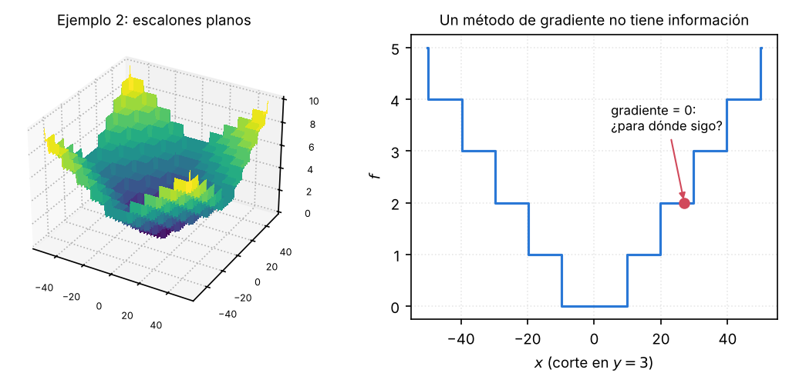

### Combina reglas fijas con azar

Los operadores siempre siguen las mismas reglas (cortar, intercambiar, elegir proporcional a la aptitud), pero con decisiones al azar adentro (qué padre, dónde cortar, qué bit). No es una búsqueda determinista como el gradiente ni una búsqueda puramente al azar, que tiraría cromosomas aleatorios hasta acertar: el azar está **guiado** por la aptitud.

### Varios objetivos

Con una aptitud que suma objetivos ponderados (§5) se persiguen varios a la vez.

### La desventaja: son lentos

Necesitan **muchas evaluaciones** de la aptitud: tamaño de la población por cantidad de generaciones. Cruzar y mutar es trivial; lo caro es evaluar, porque puede ser entrenar una red, simular un circuito o esperar los clics de un día. Es el cuello de botella, y se alivia paralelizando (§11).

### Comparación

| Métodos tradicionales (gradiente) | Algoritmos evolutivos |
|---|---|
| Trabajan con los propios parámetros | Trabajan con una codificación de los parámetros |
| Necesitan la derivada de la función | Sólo necesitan evaluar la función |
| Reglas deterministas | Reglas con una parte determinista y una aleatoria |
| Avanzan desde un punto | Avanzan desde muchos puntos a la vez |
| Rápidos, pero se quedan en el mínimo local más cercano | Lentos, pero hacen una búsqueda global |

**Ventajas:** búsqueda global que no queda atrapada en el primer mínimo local; no necesitan derivada ni fórmula; sirven para cualquier problema que se pueda codificar y medir, incluso con varios objetivos; se paralelizan fácil.

**Desventajas:** son lentos (muchas evaluaciones); tienen muchos parámetros para ajustar (población, $p_c$, $p_m$, selección, reemplazo), y la representación y la aptitud hay que diseñarlas para cada problema; no garantizan encontrar el óptimo en un tiempo dado, y dos corridas dan resultados distintos; si se pierde la diversidad, convergen prematuramente.

---

## 11. Paralelismo

Como lo caro es evaluar la aptitud y cada individuo se evalúa por separado, el algoritmo se paraleliza fácil.

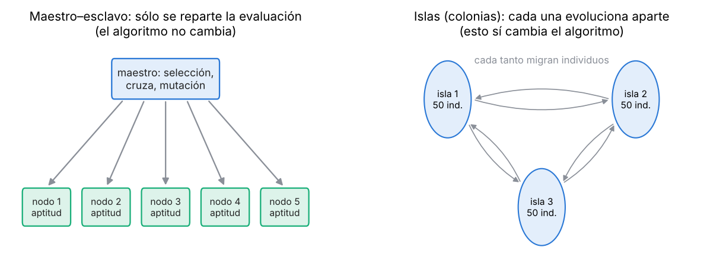

**Maestro–esclavo.** Una computadora (el maestro) hace la selección, la cruza y la mutación, que son baratas, y **reparte la evaluación** de los individuos entre los nodos de un clúster, los núcleos de un procesador o una GPU. **El algoritmo es exactamente el mismo**; sólo se reparte el trabajo.

**Islas.** La población se divide en subpoblaciones que evolucionan **por separado**, cada una en su procesador, y cada tanto **intercambian algunos individuos** (migración). Esto sí cambia el algoritmo: cada isla tiene su propia selección y su propia diversidad. Una variante, el modelo **celular**, sólo intercambia entre regiones vecinas.

---

## 12. Restricciones del problema

En muchos problemas hay soluciones **inválidas** (figuras fuera del lienzo, un viajante que repite ciudades, un gen fuera de su dominio) y la cruza y la mutación las fabrican igual. **Con el viajante:** los recorridos `1 2 3 4 5 6 7 8` y `3 7 5 1 6 8 2 4`, cruzados después del cuarto lugar, dan `1 2 3 4 | 6 8 2 4`, que repite el 2 y el 4 y no pasa por el 5 ni por el 7.

Las cinco formas de tenerlas en cuenta (redefinir la representación, rechazo, reparación, modificar los operadores y penalizar la aptitud), en orden de preferencia y con un ejemplo cada una, están en el apunte **Variantes de la computación evolutiva**, §6.

---

## 13. Lamarck en la computadora

En la naturaleza, lo que un individuo aprende durante su vida no se hereda (§2). En la computadora **sí se puede hacer**, y sirve para acelerar el algoritmo.

**Cómo.** A cada individuo, además de evolucionar, se le aplica una **búsqueda local**: por ejemplo, unos pocos pasos de gradiente desde su posición, si la función es derivable. Es su «aprendizaje durante la vida». Después hay dos opciones:

- **Lamarckiana:** el resultado de la búsqueda local **se escribe en el cromosoma** (se codifica de vuelta) y **se hereda**.
- **Baldwiniana:** la búsqueda local sólo **mejora la aptitud con la que compite**, pero el cromosoma no cambia. Se favorece a los individuos que «aprenden bien», sin heredar lo aprendido.

A los algoritmos que combinan evolución con búsqueda local se los llama **híbridos** o **meméticos**.

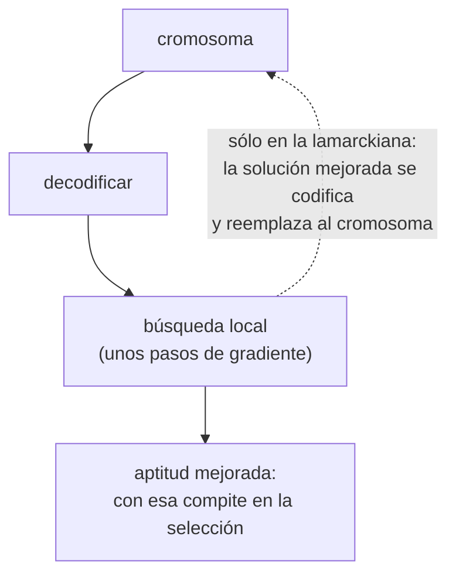

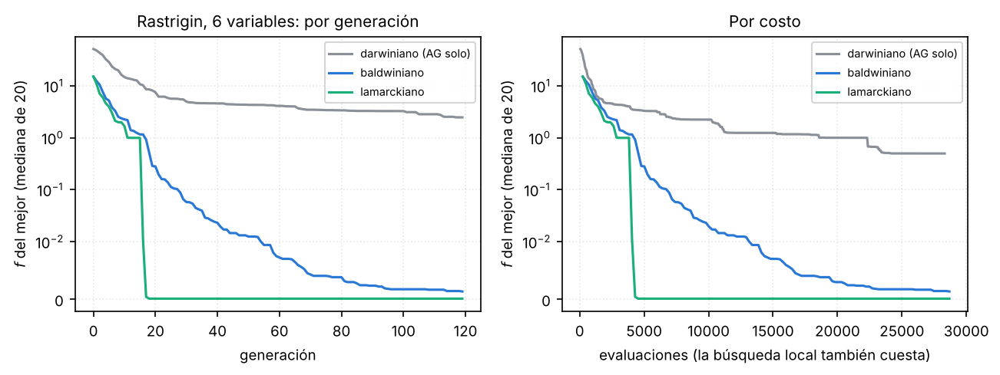

| Hasta $f<0{,}01$, 20 corridas | Lo logra | Generaciones (mediana) | Evaluaciones (mediana) |
|---|---|---:|---:|
| Algoritmo genético solo, hasta 480 generaciones | 10 de 20 | 306 | 18 085 |
| Baldwiniano | 20 de 20 | 56 | 13 624 |
| Lamarckiano | 20 de 20 | **16,5** | **4 184** |

El lamarckiano llega unas 18 veces antes en generaciones y unas 4 veces antes en costo total, aun pagando la búsqueda local. La razón: cada individuo deja de estar en una ladera y queda en el fondo de su valle, y eso es lo que pasa a sus hijos.

> **OJO — la contracara**
> Si todos los individuos de un valle bajan al mismo fondo y eso se escribe en el cromosoma, quedan **todos iguales**: se pierde diversidad. Si la búsqueda local es muy fuerte, el algoritmo converge al mínimo local más cercano de cada uno. Por eso se usan pocos pasos o se aplica a una parte de la población.

---

## 14. Otras ramas de la computación evolutiva

Lo visto hasta acá son los **algoritmos genéticos**. Las otras familias (las **estrategias de evolución**, con su regla de 1/5 y las reproducciones $(\mu+\lambda)$ y $(\mu,\lambda)$, y la **programación genética**, con programas como árboles) están en el apunte **Variantes de la computación evolutiva**.

## 15. Aplicación: selección de características

Es el caso de uso de la práctica: usar un algoritmo genético para decidir **qué variables de entrada** le conviene usar a un clasificador.

### El problema

Un patrón se describe con $m$ **características** (las variables de entrada del clasificador). Muchas veces son demasiadas: el ejemplo de la práctica, el conjunto *Leukemia*, tiene **7129** características por muestra (la expresión de genes medida con micro-arreglos de ADN) y sólo 38 muestras para entrenar.

**Selección de características:** elegir un **subconjunto** de las variables de entrada en el que el algoritmo de aprendizaje se tiene que concentrar.

**Para qué:**

- **Evitar el sobreajuste** y mejorar el desempeño. Con 7129 variables y 38 muestras, un clasificador encuentra siempre alguna combinación que separa el entrenamiento por casualidad.
- **Contrarrestar la maldición de la dimensionalidad.** Cuantas más dimensiones, más datos hacen falta para cubrir el espacio.
- Modelos **más rápidos y más baratos**: menos cosas para medir y para calcular.
- **Separar lo relevante de lo irrelevante:** saber qué variables importan es información en sí misma (en *Leukemia*, qué genes distinguen los dos tipos de leucemia).

### Reducción de dimensión contra selección de características

Las dos achican la cantidad de variables, pero de forma distinta:

- **Reducción de dimensión** (por ejemplo, PCA): **crea variables nuevas** como combinaciones de las originales y se queda con algunas. Las nuevas variables ya no son ninguna de las medidas.
- **Selección de características:** se queda con **algunas de las variables originales, tal cual**, y descarta el resto. Lo que queda se sigue pudiendo interpretar («el gen 1882 es importante»).


### Por qué no alcanza con mirar cada variable por separado

Lo más tentador es un **ranking**: medir qué tan útil es cada variable sola, quedarse con las mejores y descartar las demás antes de usar métodos más complejos. Las dos preguntas de la práctica muestran por qué eso puede fallar:

**1. ¿Una variable que sola no sirve puede servir junto con otra? (interacción).** Sí. En el panel izquierdo de la figura, las clases están en esquinas opuestas, como un XOR. Mirando sólo $x$, las dos clases están mezcladas en las dos mitades; lo mismo con sólo $y$. Juntas, separan perfecto. Un ranking pondría a $x$ y a $y$ al final y las descartaría.

**2. ¿Dos variables «redundantes» se pueden ayudar? (redundancia).** Sí. En el panel derecho, $x$ e $y$ están muy correlacionadas, así que parecen decir lo mismo, y muchos métodos se quedarían con una sola. Pero la diferencia entre las clases está en la dirección perpendicular a la diagonal, y para verla hacen falta **las dos**.

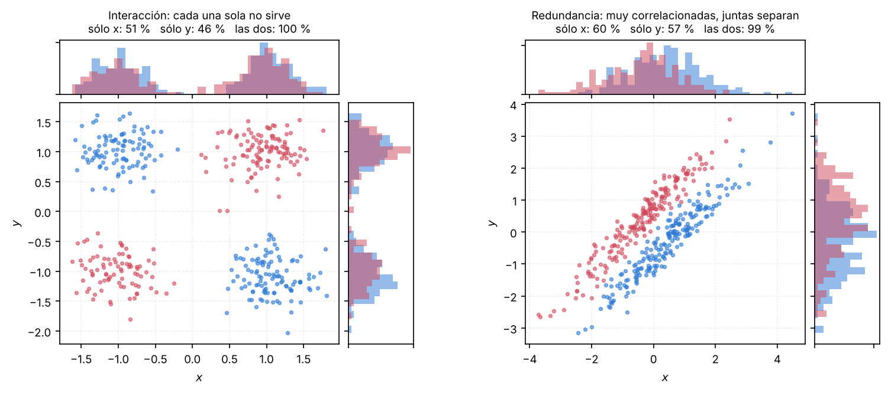

> **IDEA DE FONDO — por qué hace falta buscar subconjuntos**
> Lo que importa es **qué tan bueno es el conjunto**, no qué tan buena es cada variable sola. Por eso hay que evaluar **subconjuntos completos**, y ahí aparece el problema de cuántos hay.

### Cuántos subconjuntos hay

Para elegir $l$ variables de $m$ con garantía de encontrar el mejor subconjunto, habría que probar todos:

$$\binom{m}{l} = \frac{m!}{l!\,(m-l)!}$$

- $m = 20$, $l = 5$: **15 504** subconjuntos.
- $m = 100$, $l = 50$: $1{,}01 \times 10^{29}$.

Y eso con $l$ fijo. Si también se deja libre cuántas variables usar, son $2^m$ subconjuntos: $2^{20} \approx 10^6$, y con las 7129 de *Leukemia*, $2^{7129} \approx 10^{2146}$. Probarlos todos es imposible: hace falta una búsqueda **subóptima**, y es el tipo de problema de §1 (muchísimas soluciones, sin derivada, pero cada una se puede evaluar).

### El algoritmo genético para seleccionar características

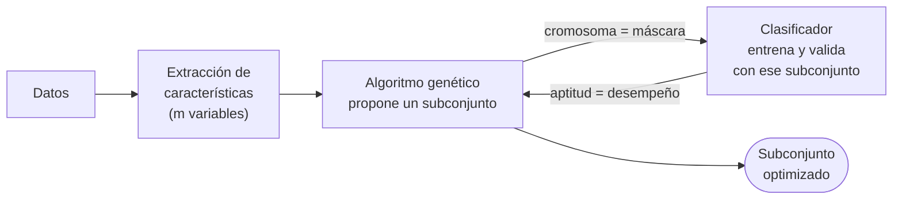

**Representación.** Un cromosoma **binario de $m$ bits**, uno por característica: el bit $j$ vale **1 si la característica $j$ se usa** y 0 si no. Cada individuo es una selección distinta. Ejemplo con 8 características: `11010011` usa la 1, 2, 4, 7 y 8.

**Esta representación pasa la prueba de §4:** cualquier corte y pegado, y cualquier bit invertido, dan otra máscara válida. Por eso se usan los operadores estándar sin cambios.

**El algoritmo** (traducido de la práctica):

```text
Algoritmo genético:
    inicializar la población
    evaluar la población
    repetir
        seleccionar padres
        cruzar los padres elegidos con probabilidad p_c
        mutar los hijos con probabilidad p_m
        aplicar la estrategia de reemplazo
        evaluar la población
    hasta que se cumpla el criterio de parada

Evaluar la población:
    para cada individuo de la población:
        obtener el subconjunto de características que indica su cromosoma
        armar los datos sólo con esas columnas
        entrenar el clasificador con el conjunto de entrenamiento
        probarlo con el conjunto de validación
        calcular el desempeño y asignarlo como aptitud
```

La primera parte es el AG de siempre. Todo lo particular del problema está en **evaluar**: cada evaluación es **entrenar un clasificador entero**. Por eso acá la desventaja de §10 (son lentos) pesa de verdad, y el paralelismo maestro–esclavo de §11 es lo primero que se aplica.

> **OJO — validación, no prueba**
> La aptitud se mide sobre un conjunto de **validación**, separado del de prueba. Si se midiera sobre el de prueba, el AG elegiría el subconjunto que mejor le va **a esos datos** y la estimación final del desempeño quedaría inflada.

**La aptitud.** Las dos de la práctica:

$$f = \text{acierto}$$

$$f = \alpha\cdot\text{acierto} - \beta\cdot\frac{\text{características elegidas}}{\text{características totales}}$$

La segunda es la **penalización de la complejidad** de §5: entre dos subconjuntos que clasifican igual, gana el que usa menos variables. $\alpha$ y $\beta$ dicen cuánto pesa cada cosa. Ejemplo: con $\alpha = 1$ y $\beta = 0{,}1$, un subconjunto de 2 de 20 variables con 100 % de acierto tiene $f = 1 - 0{,}1\cdot 2/20 = 0{,}99$; uno de 10 variables con el mismo acierto, $0{,}95$.

### Con números

Un conjunto de datos de prueba con **20 características**: 18 son ruido puro y 2 (la 3 y la 11) son las del XOR, que solas no sirven y juntas separan perfecto.


| Estrategia | Variables | Acierto |
|---|---|---:|
| Todas | 20 | 0,74 |
| Las 5 mejores del ranking | 2, 12, 13, 14, 19 | 0,46 |
| El AG (30 individuos, 40 generaciones) | **3 y 11**, en 10 de 10 corridas | **1,00** |

El ranking descarta justo las dos que importan, y usar todas mete tanto ruido que el clasificador se equivoca uno de cada cuatro. El AG encuentra el par en las 10 corridas, evaluando unos 5900 subconjuntos distintos de los $2^{20} \approx 10^6$ posibles.

### El conjunto de datos de la práctica

*Leukemia*: datos de expresión génica, medidos con micro-arreglos de ADN, para distinguir dos tipos de leucemia: **ALL** (leucemia linfocítica aguda) y **AML** (leucemia mielógena aguda). Cada muestra tiene **7129 características**.

| | Entrenamiento | Prueba |
|---|---:|---:|
| ALL | 27 | 20 |
| AML | 11 | 14 |
| Total | 38 | 34 |

El resultado de referencia de la práctica es un **UAR de 0,82**. El UAR (*unweighted average recall*) es el promedio de la tasa de acierto **de cada clase**: $\text{UAR} = \frac{1}{2}(\text{acierto en ALL} + \text{acierto en AML})$. Se usa porque las clases están desbalanceadas (27 contra 11): un clasificador que dijera siempre «ALL» tendría un 71 % de acierto en el entrenamiento, pero un UAR de 0,5.

---

## 16. Guion para desarrollarlo en el pizarrón

Este orden cubre todo el tema y cada paso se apoya en el anterior. Al lado de cada paso, qué conviene dibujar.

1. **El problema** (§1): muchas soluciones, no se pueden probar todas, no hay derivada; sólo se puede evaluar.
2. **La idea** (§2): Darwin, variación más selección, sobre una población; Lamarck falla porque lo adquirido no se hereda. *Dibujo:* el histograma de los cuellos que se corre de una generación a otra.
3. **El algoritmo** (§3): el pseudocódigo y las cinco decisiones. *Dibujo:* el ciclo inicializar → evaluar → seleccionar → cruzar y mutar → reemplazar.
4. **La generación a mano** con $x^2$: 4 cromosomas, aptitudes, porcentajes de la ruleta, dos cruzas y la media que sube de 292,5 a 438,5. *Dibujo:* la tabla y las cruzas con la barra del corte.
5. **Representación** (§4): genotipo y fenotipo, la fórmula de decodificación y la prueba de una buena representación (el robot). *Dibujo:* la tira del cromosoma del lienzo dividida en campos.
6. **Aptitud** (§5): las cuatro características, cada una con qué pasa si falla. *Dibujo:* una curva monótona y una que no lo es, con A y B.
7. **Selección** (§6): por qué no los mejores (el bit del medio), los dos requisitos, la ruleta, su defecto (1 y 2 contra 51 y 52) y las alternativas. *Dibujo:* la ruleta y la tira de probabilidades acumuladas con $r$.
8. **Cruza y mutación** (§7): qué hace cada una y por qué una explota y la otra explora. *Dibujo:* la curva con dos lomas, los padres en una, los hijos alrededor y el mutante que salta a la otra.
9. **Reemplazo** (§8): brecha y elitismo. *Dibujo:* la curva del mejor en escalera contra la que oscila.
10. **Cierre** (§10): búsqueda en muchos puntos contra gradiente, ventajas y desventajas. *Dibujo:* los anillos vistos desde arriba, el gradiente que queda en uno y la nube de puntos que llega al centro.
11. **Una aplicación** (§15): selección de características. *Dibujo:* el XOR de cuatro manchas para mostrar que las variables solas no sirven, la máscara binaria como cromosoma y el lazo AG → clasificador → aptitud.

---

## 17. Formulario

| Qué | Fórmula |
|---|---|
| Decodificación | $x = a + (b-a)\,\dfrac{\text{entero}}{2^L-1}$ |
| Resolución y bits | $\Delta = \dfrac{b-a}{2^L-1}$, $\quad L \ge \log_2\big((b-a)/\Delta+1\big)$ |
| Del error a la aptitud | $-E$, $\;C-E$, $\;\dfrac{1}{1+E}$ |
| Varios objetivos | $f = \sum_k \alpha_k\, f_k$ |
| Ruleta | $p_i = f_i / \sum_j f_j$; copias esperadas $f_i/\bar f$ |
| Escalado sigma | copias $= 1 + (f_i-\bar f)/(2\sigma)$ |
| Escalado lineal | $f' = af + b$, con la media igual y el mejor con 1,2 a 2 copias |
| Ventanas | $P(r) = \frac{1}{K}\sum_j \mathbb{1}[r\le w_j]/w_j$ |
| Competencias | el mejor espera $\approx k$ copias; $k=1$ es al azar |
| Mutación por gen | genes mutados $\approx p_m N L$; individuo intacto con prob. $(1-p_m)^L$ |
| Brecha generacional | pasan $GN$ padres; se generan $(1-G)N$ hijos |
| Teorema de los esquemas | $E[m(H,t+1)] \ge m(H,t)\,\frac{\bar f(H)}{\bar f}\,\big[1-p_c\frac{\delta(H)}{L-1}\big](1-p_m)^{o(H)}$ |
| Cruza aritmética | $\tilde x_j = (1-\gamma)x_{1j} + \gamma x_{2j}$ |
| BLX-$\alpha$ | $\tilde x_j \sim U[\min-\alpha d_j,\ \max+\alpha d_j]$ |
| Mutación gaussiana | $\tilde x_j = x_j + \sigma N(0,1)$ |
| Subconjuntos de $l$ entre $m$ | $\binom{m}{l} = \dfrac{m!}{l!(m-l)!}$; con $l$ libre, $2^m$ |
| Aptitud para selección de características | $f = \alpha\cdot\text{acierto} - \beta\cdot\dfrac{\#\text{elegidas}}{\#\text{totales}}$ |
| UAR (dos clases) | $\frac{1}{2}(\text{acierto clase 1} + \text{acierto clase 2})$ |

---

## 18. Errores típicos

1. **Decir que sobrevive «el mejor».** Sobrevive con **más probabilidad** el mejor según la aptitud, no con certeza.
2. **Elegir siempre a los mejores.** Se pierde la diversidad: los dos mejores del ejemplo no pueden generar un `1` en el bit del medio.
3. **Usar el error como aptitud.** La aptitud se maximiza: hay que darla vuelta (y que sea positiva si se usa la ruleta).
4. **Proponer una aptitud que no sea monótona o que tenga pocos valores.** El algoritmo va hacia peores soluciones o deja de distinguir a las buenas.
5. **Decir que la ruleta falla «porque tiene azar».** Falla porque usa **cocientes**: sumarle una constante a todos cambia las probabilidades.
6. **Dar una tasa de mutación sin decir si es por gen o por individuo.**
7. **Decir que la mutación sirve para mejorar.** La mayoría de las mutaciones empeoran: sirven para **mantener la diversidad y llegar a zonas nuevas**.
8. **Cortar a los dos padres en lugares distintos.** Cambia la longitud de los hijos.
9. **Confundir elitismo con brecha generacional.** Sólo el elitismo garantiza que el mejor no se pierda.
10. **Codificar un programa letra por letra.** La cruza y la mutación producen programas que no compilan.
11. **Decir que el teorema de los esquemas garantiza el óptimo.** Da una cota sobre las copias esperadas en la generación siguiente.
12. **Decir que el algoritmo no tiene parámetros.** Tiene muchos, y además hay que diseñar la representación y la aptitud.

---

## 19. Autoevaluación

1. ¿Qué tipo de problema resuelve un algoritmo evolutivo? ¿Qué necesita saber de la función y qué no?
2. ¿En qué falla Lamarck? ¿Qué dos piezas usa Darwin? ¿Qué cambia: el individuo o la población?
3. Hacé una generación a mano de $x^2$ con `01101`, `11000`, `01000` y `10011`: aptitudes, porcentajes de la ruleta, dos cruzas y la aptitud media nueva.
4. Escribí el pseudocódigo y nombrá las cinco decisiones. ¿Cuáles dependen del problema?
5. ¿Qué es genotipo y fenotipo? ¿Por qué hace falta decodificar?
6. ¿Cuánto vale `101010` en $[0,63]$? ¿Cuántos bits hacen falta para una resolución de 0,01 en $[-1,1]$?
7. Codificá dos figuras en un lienzo, bit por bit. ¿Cuántos bits son para 10 figuras?
8. ¿Cuál es la prueba de una buena representación? ¿Por qué no se codifica el programa del robot letra por letra?
9. Enunciá las cuatro características de la aptitud y explicá qué pasa si falla cada una.
10. Escribí la aptitud del lienzo y la del robot. ¿Cómo se manejan varios objetivos?
11. ¿Por qué no se eligen siempre los dos mejores? Mostralo con el ejemplo.
12. ¿Cuáles son los dos requisitos de la selección? ¿Qué es la presión selectiva?
13. Armá la ruleta del ejemplo y explicá cómo se programa.
14. ¿Por qué falla la ruleta con aptitudes 51 y 52? Explicá los dos mares y cómo se arreglan.
15. Calculá las probabilidades de selección de ventanas (4, 3, 2, 1) y de competencia con $k=2$ en el ejemplo.
16. ¿Por qué los cortes de la cruza van en el mismo lugar en los dos padres?
17. Explicá por qué la cruza explota y la mutación explora, usando el peso de los bits.
18. Diferenciá reemplazo total, brecha generacional y elitismo. Dibujá la curva del mejor con y sin elitismo.
19. Aplicá el teorema de los esquemas a `1****` en el ejemplo. ¿Qué dice y qué no dice?
20. ¿Por qué un algoritmo genético encuentra el mínimo de la superficie de anillos y el gradiente no? ¿Y en los escalones?
21. Mostrá cómo la cruza simple rompe un recorrido del viajante.
22. ¿Cómo se usa la idea de Lamarck para acelerar el algoritmo? ¿Qué diferencia hay con la versión baldwiniana?
23. ¿Qué es la selección de características y en qué se diferencia de la reducción de dimensión?
24. Dibujá un ejemplo donde dos variables solas no sirven y juntas sí. ¿Por qué falla un ranking de variables?
25. ¿Cuántos subconjuntos de 5 variables hay entre 20? ¿Y subconjuntos de cualquier tamaño entre 7129?
26. Diseñá el AG para seleccionar características: cromosoma, aptitud y qué hace la evaluación. ¿Por qué la aptitud se mide en validación?
27. ¿Qué es el UAR y por qué se usa con clases desbalanceadas?
