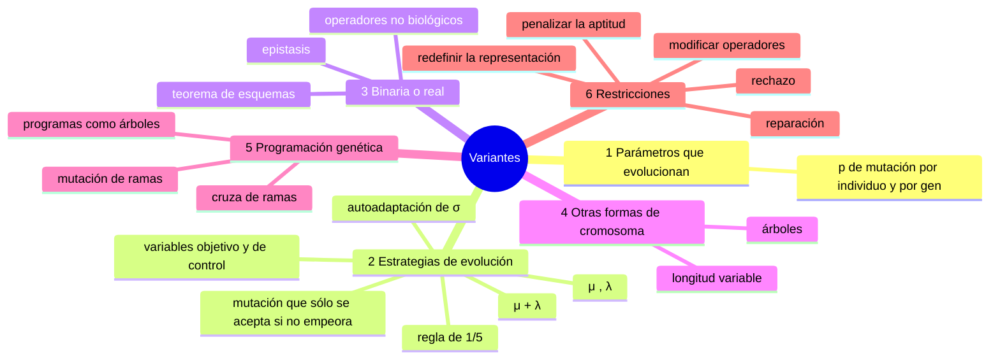
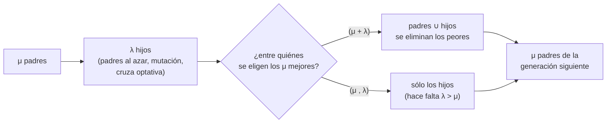
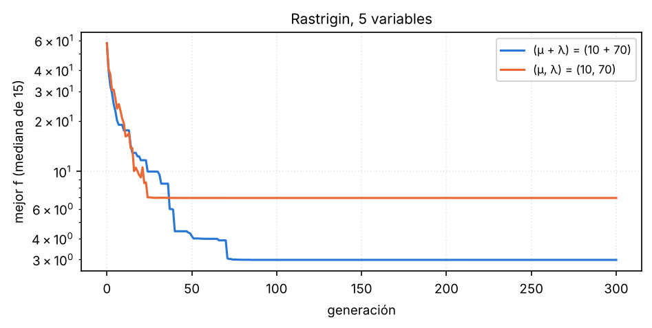
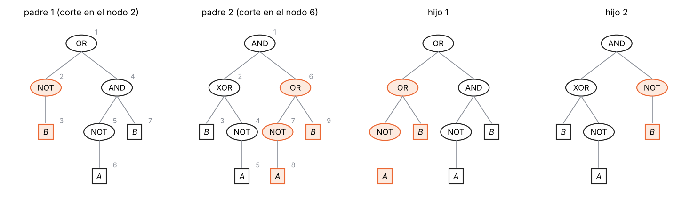
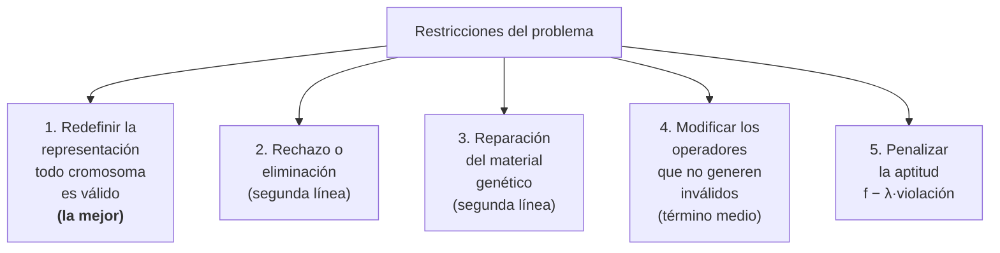

## Mapa del tema



---

## 1. La idea: que los parámetros también evolucionen

El algoritmo genético tiene parámetros que **controlan la evolución**:

- la probabilidad de mutación;
- la probabilidad de cruza;
- el tamaño de la población;
- la brecha generacional;
- el elitismo.

Hasta ahora se fijaban al principio y quedaban iguales toda la corrida. Pero no tiene por qué ser así:

- la probabilidad de mutación podría **cambiar con el tiempo**: alta al principio, para explorar, y baja al final, para afinar;
- podría ser **distinta para cada individuo**: uno que está lejos de cualquier cosa buena conviene que mute más;
- podría ser **distinta para cada gen**: algunas partes del cromosoma conviene que cambien más que otras.

Y si los parámetros pueden ser buenos o malos, se puede ir un paso más allá: **que evolucionen junto con la solución**. Los individuos con parámetros buenos generan mejores hijos, y esos parámetros se heredan. De esa idea salen las **estrategias de evolución**.

---

## 2. Estrategias de evolución

### Qué cambia respecto del algoritmo genético

| | Algoritmo genético | Estrategia de evolución |
|---|---|---|
| Representación | binaria (genotípica) | **real (fenotípica)**: los valores van directo en el cromosoma |
| Qué lleva el cromosoma | sólo la solución | **variables objetivo** (la solución) **y variables de control** (cómo mutar) |
| Aptitud (*fitness*) | según el problema | **igual**: según el problema |
| Operador principal | la cruza | **la mutación**; la cruza es optativa |
| Selección | según la aptitud (ruleta, ventanas, competencia) | **al azar**, combinada con la mutación |
| Reproducción | con azar (selección probabilística) | **determinística**: pasan los mejores |

**Aptitud** es la traducción de *fitness*: el número que dice qué tan buena es una solución. En las estrategias de evolución se define igual que en el algoritmo genético, según el problema; lo que cambia es todo lo demás.

**Variables objetivo** son las que siempre se evolucionaron: los pesos de una red, las coordenadas de las figuras, el orden de las ciudades. **Variables de control** (o estratégicas) son las que controlan la evolución. El ejemplo con el que nació todo esto es **cuánto muta cada individuo** (su probabilidad o su intensidad de mutación): cada individuo lleva la suya.

Un individuo es entonces un par:

$$\chi = (\underbrace{x_1, \ldots, x_n}_{\text{objetivo}},\ \underbrace{\sigma_1, \ldots, \sigma_n}_{\text{control}})$$

### La mutación que sólo se acepta si no empeora

Con genes reales no se puede «invertir un bit». La mutación es **sumarle a cada gen un número al azar** de una normal:

$$x_j' = x_j + \sigma_j\,N(0, 1)$$

$\sigma_j$ es el **tamaño del paso**: con $\sigma$ grande el hijo puede caer lejos; con $\sigma$ chico, cerca.

La particularidad de la estrategia de evolución original: se elige **un padre al azar**, se lo muta, y **el mutante sólo se queda si su aptitud no empeoró**; si empeoró, se descarta. Es una mezcla de **selección y mutación** en un solo paso.

El caso más simple es la **estrategia $(1+1)$**: un solo padre, un solo hijo por mutación, y se queda el mejor de los dos.

```text
Algoritmo: estrategia de evolución (1+1) con regla de 1/5
 1. x = punto inicial; σ = paso inicial
 2. repetir
      x' = x + σ·N(0, 1)                     (una normal nueva para cada componente)
      si f(x') ≤ f(x): x = x'                (el hijo reemplaza al padre sólo si no empeora)
      cada k iteraciones: mirar qué fracción de las últimas k mutaciones tuvo éxito
          más de 1/5  →  σ = σ / c           (agrandar)
          menos de 1/5 →  σ = σ · c          (achicar),   con c ≈ 0,82–0,85
    hasta cumplir la condición de fin
 3. devolver x
```

**Un paso a mano** (minimizar $f = x^2 + y^2$). Padre $\mathbf{x} = (8, 6)$, $f = 100$, $\sigma = 1$. Salen las normales $(-0{,}5;\ 0{,}3)$: el hijo es $(7{,}5;\ 6{,}3)$, con $f = 56{,}25 + 39{,}69 = 95{,}94$. Como no empeoró, **reemplaza al padre**. Si hubieran salido $(0{,}4;\ 0{,}2)$, el hijo $(8{,}4;\ 6{,}2)$ tendría $f = 109{,}0$: se descarta y el padre sigue.

### La regla de 1/5: ajustar el paso solo

¿Qué $\sigma$ usar? Si el paso es muy chico, se avanza muy lento. Si es muy grande, casi todas las mutaciones caen lejos y empeoran. La **regla de 1/5** (Rechenberg) lo ajusta mirando cuántas mutaciones salen bien:

- si **más de 1 de cada 5** mutaciones recientes mejoró al padre, el paso es demasiado prudente: se **agranda** $\sigma$;
- si **menos de 1 de cada 5** mejoró, el paso es demasiado grande: se **achica** $\sigma$.

En la figura se mira cada 20 iteraciones y se multiplica o divide $\sigma$ por 0,85.


> **Llegás a:** en 20 corridas de 600 iteraciones, el $f$ final mediano es $1{,}9\times10^{-3}$ con $\sigma$ fijo y $3{,}6\times10^{-6}$ con la regla de 1/5: **500 veces mejor**, sólo por ajustar el tamaño del paso.

### Dos formas de armar la generación siguiente

Con una población de $\mu$ padres que generan $\lambda$ hijos:



- **$(\mu + \lambda)$:** $\mu$ padres generan $\lambda \geq 1$ hijos. Se juntan padres e hijos y se eliminan los peores hasta quedar $\mu$. **Un padre bueno puede sobrevivir para siempre**: es elitista, el mejor nunca se pierde.
- **$(\mu, \lambda)$:** $\mu$ padres generan $\lambda > \mu$ hijos (muchos más hijos que padres; acá se suele usar también la cruza). La generación siguiente son **los $\mu$ mejores hijos**; los padres desaparecen siempre. Hace falta $\lambda > \mu$ para tener entre quiénes elegir.

En los dos casos **no hay ruleta ni competencia**: se ordenan y se toman los mejores. El azar está antes, en la elección de los padres y en la mutación.

**Ejemplo** (minimizando), con $\mu = 2$ y $\lambda = 4$. Los padres tienen $f = 3$ y $f = 5$; los hijos, $f = 4$, 6, 2 y 7.

| | Entre quiénes se elige | Pasan |
|---|---|---|
| $(\mu + \lambda)$ | 3, 5, 4, 6, 2, 7 | **2 y 3** (sobrevive un padre) |
| $(\mu, \lambda)$ | 4, 6, 2, 7 | **2 y 4** (el padre de 3 se pierde, aunque era mejor que el hijo de 4) |

```text
Algoritmo: estrategia de evolución (μ + λ) o (μ, λ)
 1. inicializar μ individuos (x, σ) al azar y evaluarlos
 2. repetir
      generar λ hijos: para cada uno
          elegir un padre al azar (y, si se usa cruza, otro más y cruzarlos)
          mutar primero su σ y después su x con ese σ
          evaluar
      (μ + λ): ordenar padres ∪ hijos y quedarse con los μ mejores
      (μ, λ):  ordenar sólo los hijos y quedarse con los μ mejores
    hasta cumplir la condición de fin
 3. devolver el mejor
```

### Cómo evolucionan las variables de control (autoadaptación)

Con una población, la regla de 1/5 ya no hace falta: cada individuo lleva su $\sigma$ y **lo muta antes de mutar sus $x$**:

$$\sigma_j' = \sigma_j\, e^{\tau N(0,1)} \qquad x_j' = x_j + \sigma_j'\, N(0,1) \qquad \tau \approx 1/\sqrt{n}$$

Multiplicar por una exponencial hace que $\sigma$ suba o baje en proporción y nunca se vuelva negativo. **Nadie evalúa $\sigma$ directamente**: la aptitud mide sólo $x$. Pero un hijo con un $\sigma$ adecuado para su zona tiende a caer en lugares mejores, sobrevive, y su $\sigma$ pasa a la generación siguiente. Así los parámetros evolucionan junto con la solución, que es la idea de §1.



> **Llegás a:** con $(\mu + \lambda)$ el mejor nunca empeora (0 % de las corridas) y termina en $f = 2{,}98$; con $(\mu, \lambda)$ el mejor de la población empeora alguna vez en el 100 % de las corridas y termina en $6{,}96$.

> **IDEA DE FONDO — qué se gana y qué se pierde en cada una**
> $(\mu + \lambda)$ **no pierde nunca lo mejor**, pero un individuo con un $\sigma$ malo y una buena posición puede quedarse para siempre y trabar la adaptación del paso. $(\mu, \lambda)$ **olvida** todo en cada generación: puede perder al mejor, pero también se deshace de los $\sigma$ que dejaron de servir y escapa mejor de un óptimo local. En este problema ganó $(\mu + \lambda)$; en problemas que cambian con el tiempo o con mucho ruido suele convenir $(\mu, \lambda)$.

---

## 3. Representación binaria o real

La terminología es confusa (algoritmo genético, evolutivo, estrategia de evolución, programación genética…). La distinción que usa la cátedra:

- **Genético:** representación **binaria**.
- **Evolutivo:** representación **real o fenotípica**: el valor va directo en el cromosoma.

Otra rama con nombre propio, la **programación evolutiva**, usa sólo mutación, sin cruza, y elige a los sobrevivientes por competencias entre padres e hijos.

| | Binaria (genético) | Real (evolutivo) |
|---|---|---|
| Genes y alelos | **muchos genes con pocos alelos** (0 o 1) | **pocos genes con muchos alelos** (cualquier real) |
| Convergencia | **respaldada por el teorema de los esquemas** con los operadores clásicos (más fácil de demostrar) | **muy dependiente de los operadores**: no hay un teorema general |
| Problemas | **epistasis**: un gen incorrecto invalida todo el cromosoma | hay que **redefinir los operadores**: ya no tienen nada de «biológicos» |
| | representación **lejana al dominio** del problema | representación cercana: el gen es el valor |
| | muchas **soluciones inválidas** en la población | |

### Epistasis: un bit que arruina todo

Con 8 bits, invertir el bit menos significativo cambia el número en 1; invertir el más significativo lo cambia en 128. Una **sola** mutación en el bit equivocado puede llevar el valor **fuera del dominio** y dejar inválido a todo el individuo, aunque el resto del cromosoma fuera excelente. Es lo que la cátedra llama **epistasis**: un gen incorrecto invalida todo el cromosoma.

**Ejemplo con números.** Un parámetro va de 0 a 100 y se codifica con 7 bits, que representan los enteros de 0 a 127:

- **27 de los 128** valores posibles (del 101 al 127, el **21 %**) son inválidos;
- desde un valor válido, una mutación de un bit lo vuelve inválido en **69 de los 707** casos posibles (el **9,8 %**).

Y si la representación es mala, la población puede terminar con la mayoría de los individuos inválidos (90 de 100, por ejemplo), y la evolución queda reducida a los pocos que son válidos.

**Representación lejana al dominio:** hay que pensar todo el tiempo qué significa cada número binario en el problema, y hace falta un esfuerzo importante para encontrar una buena codificación. El viajante con números de ciudad en binario es el ejemplo: es fácil de escribir, pero la cruza genera recorridos que repiten ciudades.

### Los operadores para genes reales

Si el gen es un número real, no se puede cambiar un 0 por un 1. Los operadores hay que **inventarlos** y no tienen nada que ver con la biología. El típico es la mutación de la estrategia de evolución: sumar un número al azar de una normal con cierta media y varianza. (Las cruzas para reales, como la aritmética y la BLX-$\alpha$, están en el apunte de algoritmos evolutivos, §7.)

---

## 4. Otras formas de cromosoma

**Cromosomas de longitud variable.** Si en la cruza se corta a los dos padres **en el mismo lugar**, los hijos tienen la misma longitud. Si se los corta en **lugares distintos**, un hijo queda más corto y el otro más largo. Según el problema, eso puede no tener sentido (un cromosoma que codifica exactamente 10 figuras) o ser justo lo que se quiere: el **programa del robot** no tiene por qué tener 50 instrucciones; uno puede tener 25 y otro 400.

**Cromosomas que no son una tira.** Un cromosoma no tiene por qué ser lineal: puede ser un **árbol** o un **grafo**. Hay problemas donde la estructura natural de la solución es un árbol, y forzarla a una tira hace que la cruza la rompa. El caso más importante es la programación genética.

---

## 5. Programación genética

### Qué es

El objetivo es **generar programas automáticamente**. El robot del apunte de algoritmos evolutivos ya era eso, con un cromosoma lineal de instrucciones; la programación genética usa una representación más adecuada para programas: **árboles**.

Los elementos de un programa, de menor a mayor complejidad: variables y constantes; operadores aritméticos y lógicos; funciones matemáticas (seno, logaritmo…); condicionales; bucles; recursiones.

### Representación en árbol

La expresión lógica $((A)\ \text{XOR}\ (\text{NOT}\ B))\ \text{AND}\ ((\text{NOT}\ A)\ \text{OR}\ B)$ es un árbol:

- la **raíz** es la operación de más alto nivel (el AND que une las dos mitades);
- cada **nodo interno** es un operador o una función, con sus argumentos como hijos;
- las **hojas** son las variables y las constantes ($A$, $B$).

Cualquier programa se puede escribir así: los nodos son las funciones y las instrucciones; sus hijos, los argumentos.

### Cruza: intercambio de ramas

1. Se **numeran los nodos** de los dos padres. Un estándar: de arriba hacia abajo, primero en profundidad, recorriendo cada rama antes de pasar a la siguiente (preorden).
2. Se elige **un nodo en cada padre** (en el ejemplo, el 2 del primero y el 6 del segundo).
3. Se **intercambian las ramas** que cuelgan de esos nodos.



Con las tablas de verdad (orden $AB$ = 00, 01, 10, 11):

| | Expresión | Tabla |
|---|---|---|
| Padre 1 | $\text{NOT}\,B\ \text{OR}\ (\text{NOT}\,A\ \text{AND}\ B)$ | 1, 1, 1, 0 |
| Padre 2 | $(B\ \text{XOR}\ \text{NOT}\,A)\ \text{AND}\ (\text{NOT}\,A\ \text{OR}\ B)$ | 1, 0, 0, 1 |
| Hijo 1 | $(\text{NOT}\,A\ \text{OR}\ B)\ \text{OR}\ (\text{NOT}\,A\ \text{AND}\ B)$ | 1, 1, 0, 1 |
| Hijo 2 | $(B\ \text{XOR}\ \text{NOT}\,A)\ \text{AND}\ \text{NOT}\,B$ | 1, 0, 0, 0 |

> **IDEA DE FONDO — por qué árboles**
> 1. **Cualquier intercambio de ramas da un programa válido**: una rama es una expresión completa, y se la pone donde había otra expresión completa. Con un cromosoma lineal y letras, la cruza producía programas que no compilaban.
> 2. **Los cambios no son tan abruptos**: el hijo conserva la estructura de su padre (la función central y una de las ramas) y sólo cambia una parte.
> 3. **La longitud es variable por naturaleza**: las ramas intercambiadas pueden tener tamaños distintos, y los programas crecen o se achican.

### Mutación: reemplazo de una rama

1. Se numeran los nodos y se elige **una rama** al azar.
2. Se **genera un árbol al azar** con las variables y los operadores del problema.
3. Se **reemplaza** la rama elegida por ese árbol.

Lo único que hace falta, además de lo de siempre, es **una función que genere árboles al azar**.

### La aptitud de un programa

Se **ejecuta** el programa sobre casos de prueba y se cuenta qué tan bien hace lo pedido. Si se busca una expresión que calcule el XOR (tabla 0, 1, 1, 0), la aptitud puede ser **cuántas filas de la tabla acierta**:

| | Tabla | Aciertos sobre 0, 1, 1, 0 |
|---|---|---|
| Padre 1 | 1, 1, 1, 0 | 3 |
| Padre 2 | 1, 0, 0, 1 | 0 |
| Hijo 1 | 1, 1, 0, 1 | 1 |
| Hijo 2 | 1, 0, 0, 0 | 1 |

> **OJO — dos cuidados propios de los árboles**
> **Clausura:** cualquier rama puede terminar como argumento de cualquier función, así que todas las funciones tienen que aceptar cualquier valor. Con operadores lógicos no hay problema; con aritméticos, una división puede recibir un 0, y se usa una **división protegida** (por ejemplo, que devuelva 1 si el divisor es 0).
> **Crecimiento:** como la longitud es libre, los árboles tienden a crecer generación tras generación con ramas que no aportan nada. Se pone una **profundidad máxima**, o se resta algo de aptitud por tamaño.

---

## 6. Restricciones del problema

### El problema

En muchos problemas hay soluciones **inválidas**: una figura afuera del lienzo, un viajante que repite ciudades, un parámetro fuera de su rango. La cruza y la mutación no saben nada del problema y las fabrican igual. Hay cinco formas de tenerlas en cuenta. Se enumeran en este orden; **la primera es la más deseable**, la segunda y la tercera son de **segunda línea**, la cuarta es un **término medio** que se usa mucho, y la quinta es la que ya se usó en el lienzo:



### 1. Redefinir la representación

**La mejor y la más deseable.** Pensar la codificación de modo que, **actúe como actúe la mutación o la cruza, el individuo que sale sea siempre válido**.

**Ejemplo:** un parámetro entre 0 y 100 con 7 bits. Codificado directo, 27 de los 128 valores son inválidos. Se **reescala**: el entero 0 representa el 0 y el entero 127 representa el 100, con una regla de tres en el medio:

$$x = 100 \cdot \frac{\text{entero}}{127}$$

Ahora **cualquier** combinación de 7 bits es un valor válido (el 64 es 50,39), y de paso hay más resolución (0,79 en vez de 1). Es la fórmula de decodificación de siempre, $x = a + (b-a)\,d/(2^L-1)$, usada a propósito para que no sobren valores.

El viajante con **permutaciones** y el robot con **códigos de instrucción** son el mismo principio.

### 2. Rechazo o eliminación

Un operador que, después de generar los hijos, **elimina los inválidos** y genera otros. Puede actuar al final o inmediatamente después de cada cruza o mutación: si sale un inválido, se descarta y se vuelve a cruzar o mutar hasta que salga uno válido.

Es una solución **de segunda línea**: si la representación es mala y la probabilidad de generar inválidos es alta, el algoritmo se pasa el tiempo verificando y regenerando (una cruza que hay que repetir 10, 15 o 50 veces). Sirve cuando los inválidos son **pocos** y hay una forma **rápida** de detectarlos, sin calcular la aptitud completa.

### 3. Reparación del material genético

Un operador que **corrige** al inválido cambiando algunos genes. Ejemplo: si una mutación dejó una figura fuera del área, se la vuelve a meter dentro del rango. En el viajante: cambiar las ciudades repetidas por las que faltan (`1 2 3 4 6 8 2 4` → `1 2 3 4 6 8 5 7`). Con genes reales: recortar al dominio.

También es **de segunda línea**: si hay muchos inválidos, el reparador está todo el tiempo haciendo cambios que **no son parte de la evolución**, sino una restricción artificial impuesta desde afuera.

### 4. Modificar los operadores de variación

Una alternativa **de término medio**, que se usa mucho: redefinir la cruza y la mutación para que **no puedan generar** inválidos, sabiendo la estructura que tiene el cromosoma.

- **Mutación restringida:** en el parámetro de 0 a 100 con 7 bits, impedir las mutaciones que llevan el valor por encima de 100.
- **Cruza sólo entre variables:** si el cromosoma tiene tres variables de 5, 10 y 10 bits (25 bits en total), la cruza sólo puede cortar en el **bit 5 o en el bit 15**, nunca adentro de una variable. Así mezcla variables completas, y no media variable de un padre con media del otro, que es donde aparecen los valores inválidos.
- **Viajante con cruza de orden:** se copia un tramo de un padre en su lugar y el resto se completa con las ciudades que faltan, **en el orden en que aparecen en el otro padre**. Con `1 2 3 4 5 6 7 8` y `3 7 5 1 6 8 2 4`, copiando el tramo `3 4 5` del primero en los lugares 3 a 5, el hijo es `7 1 3 4 5 6 8 2`: válido. Y la mutación es intercambiar dos ciudades.

### 5. Penalizar la aptitud

Hacer que la aptitud (el *fitness*) **baje** cuanto más se violan las restricciones: restar, dividir, o cualquier operación que la haga caer. Es lo que se hizo en el lienzo con $-1000 \cdot A_{\text{fuera}}$:

$$f_{\text{pen}}(x) = f(x) - \lambda \sum_m p_m(x)$$

donde $p_m(x)$ mide cuánto se viola la restricción $m$ (0 si se cumple). El peso $\lambda$, o una función (por ejemplo, logarítmica), dice qué tan grave es cada violación. La ventaja: un individuo «casi válido» conserva una aptitud útil y puede tener hijos válidos.


> **OJO — elegir $\lambda$ es parte del diseño**
> Si es chico, al algoritmo le conviene violar un poco la restricción. Si es enorme, todos los inválidos quedan igual de pésimos y se pierde la información de cuál está más cerca de ser válido. Una variante: que $\lambda$ **crezca con las generaciones**.

**Sin elegir $\lambda$, con competencias.** Si la selección es por competencia, cada duelo se puede decidir así: entre dos válidos, gana el de mejor aptitud; un válido le gana a cualquier inválido; entre dos inválidos, gana el que menos viola.

---

## 7. Guion para el pizarrón

1. **Parámetros que evolucionan** (§1): la probabilidad de mutación puede variar con el tiempo, por individuo y por gen. *Dibujo:* el individuo como (variables objetivo | variables de control).
2. **Estrategia de evolución** (§2): mutación gaussiana que sólo se acepta si no empeora (el paso a mano desde (8, 6)); regla de 1/5; $(\mu+\lambda)$ y $(\mu,\lambda)$ con el ejemplo de 2 padres y 4 hijos; autoadaptación de $\sigma$. *Dibujo:* el diagrama de las dos reproducciones.
3. **Binaria o real** (§3): la tabla; epistasis con el ejemplo de 7 bits (21 % de valores inválidos).
4. **Programación genética** (§5): el árbol, la numeración, la cruza de los nodos 2 y 6, la mutación de una rama. *Dibujo:* los dos padres y los dos hijos.
5. **Restricciones** (§6): las cinco, cada una con su ejemplo y cuándo conviene.

---

## 8. Formulario

| Qué | Fórmula |
|---|---|
| Individuo de una estrategia de evolución | $\chi = (x_1, \ldots, x_n, \sigma_1, \ldots, \sigma_n)$ |
| Mutación gaussiana | $x_j' = x_j + \sigma_j N(0,1)$ |
| Regla de 1/5 | éxitos $> 1/5$: agrandar $\sigma$; $< 1/5$: achicarlo |
| Autoadaptación | $\sigma_j' = \sigma_j e^{\tau N(0,1)}$, después $x_j' = x_j + \sigma_j' N(0,1)$ |
| $(\mu + \lambda)$ | los $\mu$ mejores entre padres e hijos ($\lambda \ge 1$) |
| $(\mu, \lambda)$ | los $\mu$ mejores entre los hijos ($\lambda > \mu$) |
| Reescalar para que todo valor sea válido | $x = a + (b-a)\,\dfrac{d}{2^L-1}$ |
| Penalización | $f_{\text{pen}} = f - \lambda \sum_m p_m(x)$ |

---

## 9. Errores típicos

1. **Decir que en una estrategia de evolución la selección es por ruleta.** Los padres se eligen al azar y la reproducción es determinística: pasan los mejores.
2. **Confundir $(\mu+\lambda)$ con $(\mu,\lambda)$.** En la primera compiten padres e hijos; en la segunda sólo los hijos, y hace falta $\lambda > \mu$.
3. **Decir que la representación real tiene convergencia asegurada.** El teorema de los esquemas es para cadenas binarias con los operadores clásicos, y aun ahí es una cota sobre el crecimiento esperado de los buenos esquemas, no una garantía de llegar al óptimo.
4. **Pensar que la cruza en programación genética corta una tira.** Intercambia **ramas** de dos árboles.
5. **Poner el rechazo como la mejor forma de manejar restricciones.** La mejor es la representación; el rechazo y la reparación son de segunda línea.
6. **Elegir la penalización sin pensar $\lambda$.** Con $\lambda$ chico, el óptimo penalizado queda fuera de lo permitido.

---

## 10. Autoevaluación

1. ¿Qué parámetros controlan la evolución? ¿De qué formas podría variar la probabilidad de mutación?
2. ¿Qué son las variables objetivo y las de control? Escribí un individuo de una estrategia de evolución.
3. Explicá la mutación de una estrategia de evolución y cuándo se acepta.
4. Enunciá la regla de 1/5 y explicá por qué tiene sentido.
5. Diferenciá $(\mu+\lambda)$ y $(\mu,\lambda)$. ¿Cuál es elitista? ¿Por qué la segunda necesita $\lambda > \mu$? Con padres de $f$ 3 y 5 e hijos 4, 6, 2 y 7, ¿quiénes pasan en cada una?
6. ¿Cómo evoluciona $\sigma$ si nadie lo evalúa?
7. Compará la representación binaria y la real (genes, alelos, convergencia, problemas).
8. ¿Qué es la epistasis? Mostrala con un parámetro de 0 a 100 en 7 bits.
9. ¿Cuándo tiene sentido un cromosoma de longitud variable?
10. Dibujá el árbol de $((A)\,\text{XOR}\,(\text{NOT}\,B))\,\text{AND}\,((\text{NOT}\,A)\,\text{OR}\,B)$, numeralo y hacé una cruza con otro árbol.
11. ¿Cómo se muta un árbol? ¿Qué hace falta para implementarlo? ¿Cómo se calcula la aptitud de un programa?
12. Nombrá las cinco formas de considerar las restricciones, con un ejemplo cada una. ¿Cuál es la más deseable y cuáles son de segunda línea? ¿Por qué?
13. ¿Cómo harías que un parámetro de 0 a 100 en 7 bits nunca sea inválido? ¿Y una cruza que nunca corte una variable al medio?
