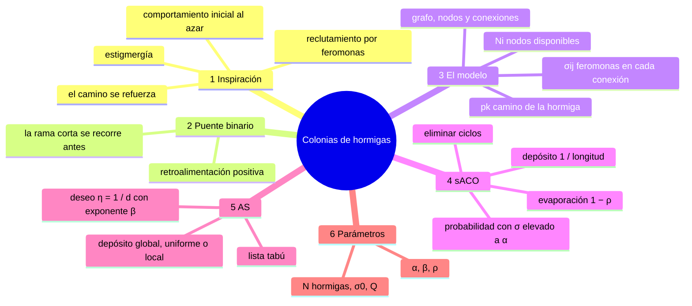
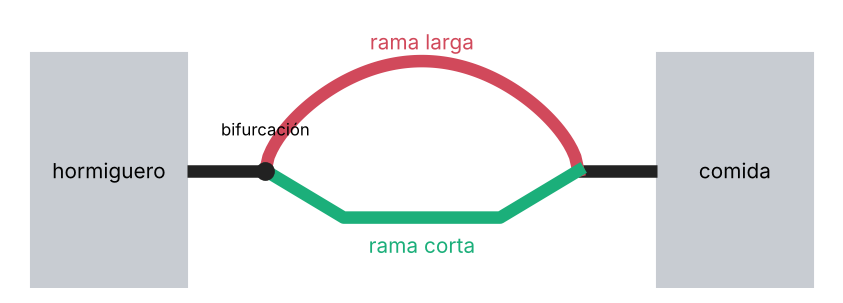
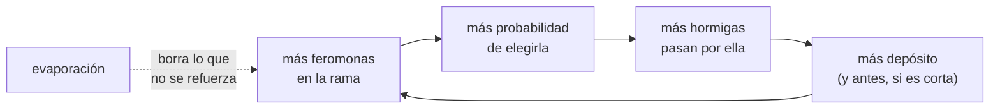
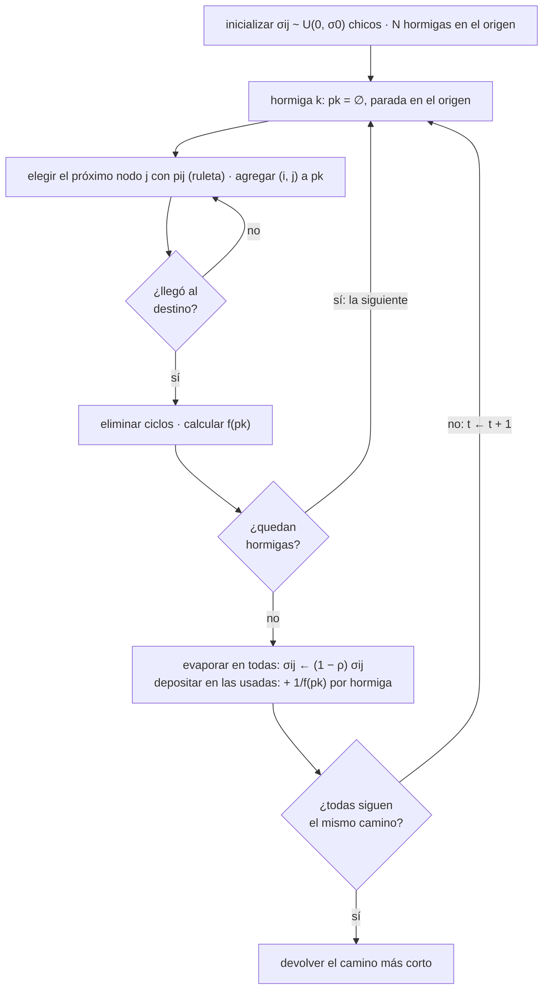
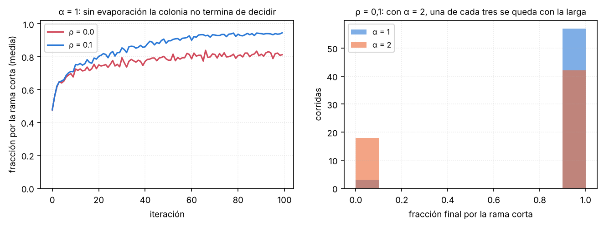

## Mapa del tema



---

## 1. El problema y la inspiración

### Qué problema resuelven

**Encontrar el camino más corto** entre un origen y un destino. «Corto» puede ser en distancia, en tiempo o en cualquier costo: el camino óptimo. Las hormigas lo hacen para ir del hormiguero a la comida, esquivando obstáculos, agua o lo que sea.

El algoritmo sirve para cualquier problema que se pueda escribir como **un camino en un grafo**: rutas, el viajante, ruteo en redes.

### Cómo lo hacen las hormigas

1. **Comportamiento inicial al azar.** Al principio no hay un rumbo: cada hormiga camina para cualquier lado, tanteando.
2. **Cuando alguna encuentra comida, se organizan** y empiezan a seguir todas el mismo camino:
    - **Reclutamiento por feromonas:** al volver con comida, la hormiga deja feromonas en el camino. En una simplificación habitual, deja una cantidad proporcional a la comida que encontró.
    - **Las otras siguen el rastro:** perciben las feromonas y eligen el camino que tiene más, **con más probabilidad**, no siempre. Un camino con un poco más de feromonas es preferido; uno sin nada, casi nunca.
    - **El camino se refuerza:** cada hormiga que lo sigue deja más feromonas, y eso atrae a más hormigas.

Dos cosas a notar:

- **La comunicación es indirecta.** Ninguna hormiga le dice a otra dónde está la comida.
- **Se comunican modificando el entorno físico**: dejan feromonas en el suelo y las otras las leen del suelo. Eso se llama **estigmergía**: usar el medio físico como medio de comunicación.

---

## 2. El experimento del puente binario

Es el experimento (hecho con hormigas reales, de una especie argentina) que dio origen a los algoritmos.

{width=70%}

**Qué pasa:**

1. Al principio, las hormigas eligen las dos ramas más o menos por igual.
2. Supongamos dos hormigas que salen juntas, a la misma velocidad: una por cada rama. La de la rama corta **llega antes** a la comida y **vuelve antes**, dejando feromonas en toda la rama corta.
3. Una hormiga que en ese momento está en la bifurcación ve **más feromonas en la rama corta**: la que fue por la larga todavía no volvió. Elige la corta con más probabilidad: de 10 hormigas, quizás 6 o 7 van por la corta y 3 o 4 por la larga.
4. Las de la corta vuelven antes y **refuerzan aún más** la corta. La diferencia crece.
5. Llega un punto en que la diferencia es tan grande que **todas van por la corta**.

Las hormigas encontraron el camino óptimo sin que ninguna lo supiera.




> **IDEA DE FONDO — lo que muestra el panel derecho**
> El mecanismo **amplifica cualquier diferencia**, también las que son puro azar. Si las ramas son iguales, la que por casualidad recibió un poco más al principio termina ganando. Si son distintas, la diferencia real (la corta recibe más) se suma a la del azar y casi siempre gana. Por eso hay que cuidar que las diferencias al azar no dominen: eso es lo que controlan $\alpha$ y $\rho$ (§4).

---

## 3. Del comportamiento al modelo

### Las definiciones

| Símbolo | Qué es |
|---|---|
| $G = (V, E)$ | **grafo**: $V$ son los vértices (los puntos donde la hormiga decide para dónde seguir), $E$ es la matriz de conexiones (un 1 si hay conexión, o mejor, el **costo** de pasar de un vértice a otro: distancia, tiempo…) |
| $\sigma_{ij}$ | **cantidad de feromonas** en la conexión entre $i$ y $j$ (si el grafo no es dirigido, $\sigma_{ij} = \sigma_{ji}$: lo que se deposita yendo sirve también para volver) |
| $k = 1, \ldots, N$ | las **hormigas** |
| $N_i$ | **nodos disponibles** a partir del nodo $i$ (los conectados con $i$) |
| $\mathbf{p}_k(t)$ | **camino** de la hormiga $k$: la lista de nodos por los que pasó; cambia en cada iteración y puede tener distinto tamaño |

Dos aclaraciones:

- **El tiempo $t$ avanza en 1 cuando todas las hormigas encontraron la comida y volvieron al origen.** No cuenta pasos de nodo a nodo; cuenta **caminos completos**.
- **$N_i^k$:** en algunos casos, los nodos disponibles para la hormiga $k$ excluyen los que **ya visitó**. Así no se forman ciclos (ir del 1 al 2 y del 2 volver al 1).

### Qué hay que interpretar según el problema

| Problema | Nodos | Costo $d_{ij}$ | $f(\mathbf{p}_k)$ |
|---|---|---|---|
| Hormigas reales | puntos de referencia del terreno | distancia, dificultad | largo del camino |
| Ruteo | intersecciones | tiempo de viaje | tiempo total |
| Viajante | ciudades | distancia entre ciudades | largo del recorrido cerrado |

---

## 4. Colonia de hormigas simple (sACO)

### El algoritmo

```text
Algoritmo: colonia de hormigas simple (sACO)
 1. t = 0; inicializar feromonas con valores pequeños al azar: σij(0) ~ U(0, σ0)
 2. ubicar N hormigas en el nodo origen
 3. repetir
    3.1 para cada hormiga k = 1..N
        3.1.1 pk(t) = ∅
        3.1.2 repetir
                elegir el próximo nodo j según la probabilidad pij(t)
                agregar el paso (i, j) al camino pk(t)
              hasta alcanzar el destino
        3.1.3 eliminar los ciclos de pk(t)
        3.1.4 calcular la longitud del camino f(pk(t))
    3.2 para cada conexión (i, j): evaporar      σij ← (1 − ρ) σij
    3.3 para cada conexión (i, j): depositar     σij(t+1) = σij(t) + Σ 1/f(pk(t))
                                                  (suma sobre las hormigas que pasaron por (i, j))
    3.4 t ← t + 1
    hasta que todas las hormigas sigan el mismo camino
 4. devolver el camino más corto
```



### Paso 3.1.2: elegir el próximo nodo

La hormiga está en el nodo $i$ y tiene que decidir a qué vecino ir. La probabilidad de ir a $j$ es:

$$p_{ij}^k(t) = \begin{cases} \dfrac{\sigma_{ij}^\alpha(t)}{\displaystyle\sum_{u \in N_i} \sigma_{iu}^\alpha(t)} & \text{si } j \in N_i \\[2ex] 0 & \text{en otro caso} \end{cases}$$

- **Numerador:** las feromonas de la conexión $(i, j)$, elevadas a $\alpha$.
- **Denominador:** lo mismo para todos los vecinos, para que las probabilidades sumen 1.
- Un nodo **no conectado** con $i$ tiene probabilidad 0: no se puede ir.

**Cómo se elige con esa probabilidad:** como la ruleta. Si hay 60 % para el camino 1 y 40 % para el 2, se tira un número del 1 al 10: del 1 al 6, camino 1; del 7 al 10, camino 2.

**Para qué sirve $\alpha$.** Al principio las feromonas son casi iguales. Con tres conexiones de $\sigma = 0{,}20$; $0{,}21$; $0{,}19$:

| $\alpha$ | $p$ (0,20) | $p$ (0,21) | $p$ (0,19) |
|---|---|---|---|
| 1 | 0,333 | 0,350 | 0,317 |
| 5 | 0,328 | 0,418 | 0,254 |
| 20 | 0,249 | 0,661 | 0,089 |

**$\alpha$ potencia las diferencias**: con $\alpha = 1$ una diferencia de 0,01 casi no cambia nada; con $\alpha = 20$ la conexión de 0,21 se lleva dos tercios de las hormigas. Sirve para que la colonia empiece a decidir antes, **pero** también amplifica las diferencias que son puro azar (lo muestra la figura del final de esta sección).

### Paso 3.1.3: eliminar los ciclos

Si la hormiga hizo `1 → 5 → 6 → 5 → 6 → 7`, las vueltas entre el 5 y el 6 no aportan nada. Se detectan y se borran: el camino queda `1 → 5 → 6 → 7`. Sin este paso, las conexiones del ciclo recibirían feromonas como cualquier otra; en la iteración siguiente serían un poco más probables, recibirían más, y la colonia terminaría **reforzando vueltas inútiles**. Borrar el ciclo hace que sólo se premien los tramos que acercan al destino.

### Paso 3.2: evaporación

$$\sigma_{ij} \leftarrow (1 - \rho)\,\sigma_{ij}$$

Modela que la feromona **se evapora** si nadie vuelve a pasar. Con $\rho = 0{,}1$, cada iteración queda el 90 % de lo que había; después el 90 % del 90 %, y así: **decae en forma exponencial**. Se hace en **todas** las conexiones, se haya pasado o no.

### Paso 3.3: depósito

$$\sigma_{ij}(t+1) = \sigma_{ij}(t) + \sum_{k \,/\, (i,j) \in \mathbf{p}_k(t)} \frac{1}{f(\mathbf{p}_k(t))}$$

Se recorren los caminos de **todas** las hormigas; en cada conexión por la que pasó la hormiga $k$, se suma $1/f$ de **su camino completo**. Una hormiga que encontró un camino corto deja **mucho** en todas las conexiones de su camino; una que dio una vuelta enorme deja **poco**.

> **OJO — de dónde sale la ventaja de la rama corta en el algoritmo**
> En el puente real, la rama corta gana porque las hormigas **vuelven antes** y depositan antes. En el algoritmo todas las hormigas terminan en la misma iteración: no hay «antes». La ventaja se pone **en el depósito**, con $1/f$: el camino corto deja más feromonas.

### Una iteración a mano

Grafo: origen $O$, destino $D$, y dos caminos: $O \to A \to D$ (conexiones de largo 1 y 1, total **2**) y $O \to B \to D$ (largos 2 y 1, total **3**). Todas las feromonas empiezan en 0,1; $\rho = 0{,}1$; $\alpha = 1$. Dos hormigas: una fue por $A$, la otra por $B$.

| Conexión | Inicial | Evaporación ($\times 0{,}9$) | Depósito | Final |
|---|---|---|---|---|
| $O$–$A$, $A$–$D$ | 0,1 | 0,09 | $+1/2$ | **0,59** |
| $O$–$B$, $B$–$D$ | 0,1 | 0,09 | $+1/3$ | **0,423** |

En la iteración siguiente, desde $O$:

$$p_{OA} = \frac{0{,}59}{0{,}59 + 0{,}423} = 0{,}582 \qquad p_{OB} = 0{,}418$$

El camino corto ya es preferido. Cada iteración que se repite esto, la diferencia crece.

Otro ejemplo de una sola conexión: $\sigma = 0{,}5$, $\rho = 0{,}1$, y pasaron dos hormigas cuyos caminos midieron 4 y 5:

$$\sigma = 0{,}9 \cdot 0{,}5 + \tfrac{1}{4} + \tfrac{1}{5} = 0{,}45 + 0{,}25 + 0{,}20 = 0{,}90$$

### Fin

**Hasta que todas las hormigas sigan el mismo camino**: se alinearon. Se devuelve el camino más corto encontrado; si todo funcionó, es el mismo para todas. En la práctica se agrega también un **máximo de iteraciones**, por si la colonia no termina de alinearse (por ejemplo, con $\alpha$ chico o $\rho$ muy grande).


> **Llegás a:** el camino medio de las hormigas (ya sin ciclos) pasa de 16,3 en la primera iteración a 13,0 en la 60, y 13 es el mínimo (calculado por búsqueda en anchura).

### Qué hacen $\rho$ y $\alpha$



| | La corta termina con > 90 % | La larga termina con > 90 % |
|---|---|---|
| $\alpha = 1$, $\rho = 0$ (sin evaporación) | 37 % de las corridas | 5 % |
| $\alpha = 1$, $\rho = 0{,}1$ | **95 %** | 5 % |
| $\alpha = 2$, $\rho = 0{,}1$ | 70 % | **30 %** |

- **Sin evaporación la colonia no termina de decidir.** Las feromonas sólo se acumulan: después de muchas iteraciones cada rama tiene tanto que un depósito nuevo casi no cambia las proporciones, y las probabilidades **se congelan** donde las dejó el azar de las primeras iteraciones. Con evaporación, lo viejo se va borrando y manda lo que se sigue depositando, que es justamente donde la corta tiene ventaja.
- **$\alpha$ grande decide demasiado rápido.** Con $\alpha = 2$ una ventaja de azar al principio se amplifica tanto que la colonia se queda con la rama larga en 3 de cada 10 corridas: **convergencia prematura**, lo mismo que en el algoritmo genético.

---

## 5. Sistema de hormigas (AS)

Es una mejora de sACO. Lo que cambia está en tres lugares: cómo se elige el próximo nodo, cómo se evitan los ciclos y cuánto se deposita.

### Cambio 1: la hormiga sabe algo del problema

$$p_{ij}^k(t) = \begin{cases} \dfrac{\sigma_{ij}^\alpha(t)\ \eta_{ij}^\beta}{\displaystyle\sum_{u \in N_i^k} \sigma_{iu}^\alpha(t)\ \eta_{iu}^\beta} & \text{si } j \in N_i^k \\[2ex] 0 & \text{en otro caso} \end{cases}
\qquad \eta_{ij} = \frac{1}{d_{ij}}$$

$\eta_{ij}$ es el **deseo de moverse** de $i$ a $j$: **inverso al costo** entre los nodos. Una conexión corta es más atractiva que una larga, aunque tengan las mismas feromonas. Es un conocimiento del problema que **a veces se tiene y a veces no**. El exponente $\beta$ le da más o menos peso, como $\alpha$ a las feromonas: **$\alpha$ y $\beta$ fijan la importancia relativa** de lo que aprendió la colonia y de lo que se sabe del problema.

**Ejemplo.** Las tres conexiones de antes ($\sigma = 0{,}20$; $0{,}21$; $0{,}19$), ahora con costos $d = 1$, 2 y 4, y $\alpha = 1$:

| $\beta$ | Numeradores $\sigma \cdot \eta^\beta$ | $p$ |
|---|---|---|
| 0 | 0,200 · 0,210 · 0,190 | 0,333 · 0,350 · 0,317 (igual que sACO) |
| 1 | 0,200 · 0,105 · 0,0475 | 0,567 · 0,298 · 0,135 |
| 2 | 0,200 · 0,0525 · 0,0119 | 0,757 · 0,199 · 0,045 |

Con $\beta = 0$ es sACO. Con $\beta = 2$, desde la primera iteración la hormiga ya prefiere la conexión corta, sin esperar a que las feromonas se acumulen.

En el ejemplo del grafo $O, A, B, D$, con $\beta = 1$: desde $O$, $p_{OA} = \dfrac{0{,}59 \cdot 1}{0{,}59 \cdot 1 + 0{,}423 \cdot \frac{1}{2}} = 0{,}736$ (contra 0,582 sin $\eta$).

### Cambio 2: lista tabú

$N_i^k$: de los vecinos de $i$ se **sacan los que la hormiga $k$ ya visitó** (están en su lista $\mathbf{p}_k$). Así **no se forman ciclos**, y desaparece el paso de eliminarlos. En el viajante es además obligatorio: cada ciudad se visita una vez.

**El viajante con AS.** No hay un origen y un destino: cada hormiga arranca en una ciudad (al azar o en una fija), va eligiendo entre las ciudades que todavía no visitó, y «llega al destino» cuando visitó todas y vuelve a la primera. $f(\mathbf{p}_k)$ es el largo del recorrido cerrado.

### Cambio 3: cuánto deposita cada hormiga

Primero se evapora igual que antes. Después:

$$\Delta\sigma_{ij}^k(t) = \begin{cases} Q / f(\mathbf{p}_k(t)) & \text{global} \\ Q & \text{uniforme} \\ Q / d_{ij} & \text{local} \end{cases}
\qquad
\sigma_{ij}(t+1) = \sigma_{ij}(t) + \sum_{k \,/\, (i,j) \in \mathbf{p}_k(t)} \Delta\sigma_{ij}^k(t)$$

| Estrategia | Qué mide | Con $Q = 1$, camino de largo 4, conexión de costo 1 |
|---|---|---|
| **Global** | **lo bueno que fue el camino completo**; con $Q = 1$ es el depósito de sACO | 0,25 |
| **Uniforme** | sólo **cuántas hormigas pasaron**; todas dejan lo mismo, llegaran por un camino corto o largo | 1 |
| **Local** | **cuánto costó ese tramo**: un tramo caro recibe menos | 1 |

### El algoritmo

```text
Algoritmo: sistema de hormigas (AS)
 1. t = 0; σij(0) ~ U(0, σ0)
 2. ubicar N hormigas en el nodo origen
 3. repetir
    3.1 para cada hormiga k = 1..N
        3.1.1 pk(t) = ∅
        3.1.2 repetir
                elegir el próximo nodo j según pij(t), con σ^α η^β y sólo entre Nik (tabú)
                agregar el paso (i, j) a pk(t)
              hasta alcanzar el destino
        3.1.3 calcular la longitud del camino f(pk(t))          (no hay ciclos que eliminar)
    3.2 para cada conexión (i, j):
          evaporar     σij ← (1 − ρ) σij
          depositar    σij(t+1) = σij(t) + Σ Δσij^k             (global, uniforme o local)
    3.3 t ← t + 1
    hasta que todas las hormigas sigan el mismo camino
 4. devolver el mejor camino
```

| | sACO | AS |
|---|---|---|
| Probabilidad | $\sigma^\alpha$ | $\sigma^\alpha \eta^\beta$, con $\eta = 1/d$ |
| Vecinos | $N_i$ | $N_i^k$: lista tabú |
| Ciclos | se eliminan después | no se forman |
| Depósito | $1/f$ | $Q/f$, $Q$ o $Q/d_{ij}$ |


> **Llegás a:** con $\beta = 0$ (sólo feromonas) el mejor recorrido queda, en la mediana, un 29 % más largo que el óptimo, y nunca lo encuentra. Con $\beta = 2$ encuentra el óptimo exacto en el 90 % de las corridas (depósito global) y en el 100 % (uniforme y local). En el viajante saber la distancia entre ciudades es casi todo; en este problema chico, con $\eta$ tan informativo, la forma del depósito importa poco.

---

## 6. Los parámetros

| Parámetro | Qué controla | Si es muy chico | Si es muy grande |
|---|---|---|---|
| $\alpha$ | peso de las feromonas | casi no se aprovecha lo aprendido: búsqueda al azar | se amplifica el azar inicial: convergencia prematura |
| $\beta$ (AS) | peso del deseo $\eta$ | se ignora lo que se sabe del problema | se vuelve una búsqueda «voy siempre al más cercano» |
| $\rho$ | evaporación | lo viejo pesa para siempre; no termina de decidir | se olvida todo enseguida; no hay memoria |
| $\sigma_0$ | feromonas iniciales | conviene que sea chico | los primeros depósitos casi no cambian las probabilidades: tarda en arrancar |
| $N$ | cantidad de hormigas | pocos caminos explorados por iteración | más costo por iteración |
| $Q$ (AS) | escala del depósito | lo depositado casi no pesa frente a lo que hay | un solo depósito decide todo: convergencia prematura |

$\sigma_0$ chico y al azar hace que al principio todas las conexiones sean casi igual de probables: el **comportamiento inicial al azar** de las hormigas reales.

---

## 7. Guion para el pizarrón

1. **El problema y la inspiración** (§1): camino más corto; los tres pasos; estigmergía.
2. **Puente binario** (§2): *dibujo* de las dos mesas y las dos ramas; contar por qué gana la corta; el ciclo de retroalimentación.
3. **El modelo** (§3): $G$, $\sigma_{ij}$, $N_i$, $\mathbf{p}_k$; cuándo avanza $t$.
4. **sACO** (§4): pseudocódigo; la fórmula de $p_{ij}$ y para qué sirve $\alpha$ (tabla 0,20 / 0,21 / 0,19); evaporación y depósito; *la iteración a mano* con $O, A, B, D$.
5. **AS** (§5): los tres cambios; $\eta = 1/d$ con $\beta$; tabú; las tres formas del depósito.
6. **Parámetros** (§6): qué pasa si $\alpha$ es grande y si no hay evaporación.

---

## 8. Formulario

| Qué | Fórmula |
|---|---|
| Inicialización | $\sigma_{ij}(0) \sim U(0, \sigma_0)$ |
| Probabilidad sACO | $p_{ij}^k = \dfrac{\sigma_{ij}^\alpha}{\sum_{u \in N_i} \sigma_{iu}^\alpha}$, si $j \in N_i$ |
| Probabilidad AS | $p_{ij}^k = \dfrac{\sigma_{ij}^\alpha \eta_{ij}^\beta}{\sum_{u \in N_i^k} \sigma_{iu}^\alpha \eta_{iu}^\beta}$, si $j \in N_i^k$; $\eta_{ij} = 1/d_{ij}$ |
| Evaporación | $\sigma_{ij} \leftarrow (1-\rho)\,\sigma_{ij}$ |
| Depósito sACO | $\sigma_{ij}(t+1) = \sigma_{ij}(t) + \sum_{k/(i,j)\in \mathbf{p}_k} 1/f(\mathbf{p}_k)$ |
| Depósito AS | $\Delta\sigma_{ij}^k = Q/f(\mathbf{p}_k)$ (global), $Q$ (uniforme), $Q/d_{ij}$ (local) |
| Fin | todas las hormigas siguen el mismo camino |

---

## 9. Errores típicos

1. **Decir que $t$ avanza en cada paso de una hormiga.** Avanza cuando **todas** completaron su camino.
2. **Depositar antes de evaporar, o evaporar sólo donde pasaron hormigas.** Se evapora en **todas** las conexiones, y después se deposita.
3. **Depositar según el largo del tramo en sACO.** En sACO es $1/f$ del **camino completo**, igual en todas las conexiones de ese camino. El depósito por tramo es la variante **local** de AS.
4. **Olvidar el denominador de la probabilidad**, o en AS poner en el denominador sólo las feromonas: van $\sigma^\alpha \eta^\beta$ de **todos** los vecinos permitidos.
5. **Pensar que la hormiga elige siempre el camino con más feromonas.** Elige **al azar con esas probabilidades**.
6. **Confundir $\eta$ con las feromonas.** $\eta$ es un dato fijo del problema ($1/d$); las feromonas son lo que la colonia aprende.
7. **Decir que la evaporación es un detalle biológico sin efecto.** Sin evaporación, el azar inicial no se olvida y la colonia no termina de decidir.

---

## 10. Autoevaluación

1. ¿Qué problema resuelven las colonias de hormigas? Nombrá tres aplicaciones.
2. Contá los tres pasos del comportamiento de las hormigas. ¿Qué es la estigmergía?
3. Explicá el puente binario. ¿Por qué gana la rama corta en la naturaleza? ¿Y en el algoritmo, donde todas vuelven al mismo tiempo?
4. ¿Qué pasa en el puente si las dos ramas son iguales? ¿Qué enseña eso?
5. Definí $G$, $\sigma_{ij}$, $N_i$, $N_i^k$ y $\mathbf{p}_k(t)$. ¿Cuándo avanza $t$?
6. Escribí el pseudocódigo de sACO.
7. Escribí la probabilidad de transición de sACO. Calculala para $\sigma = 0{,}20$; $0{,}21$; $0{,}19$ con $\alpha = 1$. ¿Qué cambia con $\alpha = 20$?
8. Hacé una iteración a mano en un grafo con dos caminos de largos 2 y 3.
9. ¿Para qué sirve la evaporación? ¿Qué pasa con $\rho = 0$? ¿Y con $\rho$ cercano a 1?
10. ¿Qué tres cosas cambian en AS respecto de sACO?
11. ¿Qué es $\eta_{ij}$ y para qué sirve $\beta$? Calculá las probabilidades con $d = 1, 2, 4$ y $\beta = 1$.
12. Explicá las tres formas de depósito de AS. ¿Cuál coincide con sACO?
