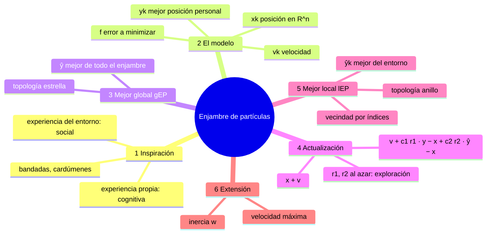
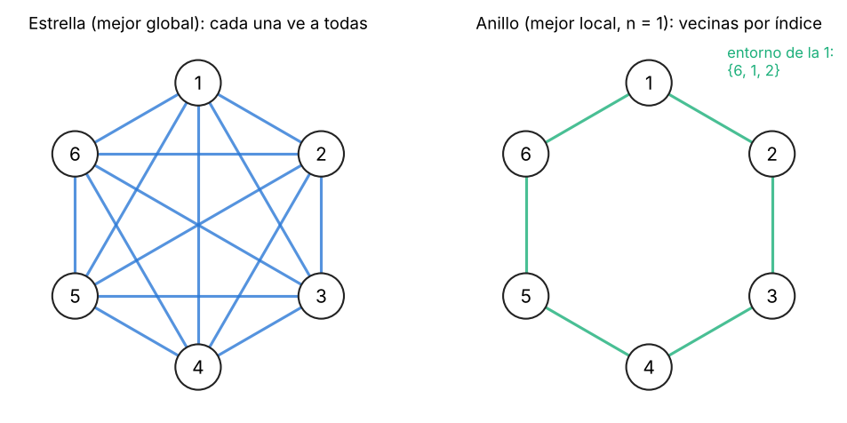
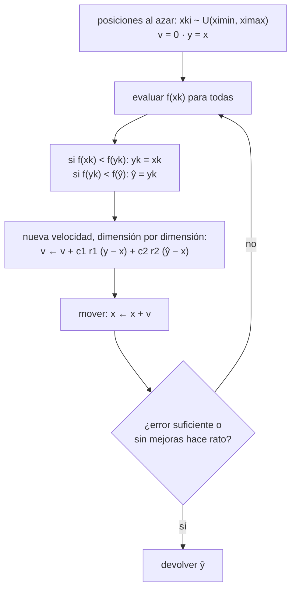
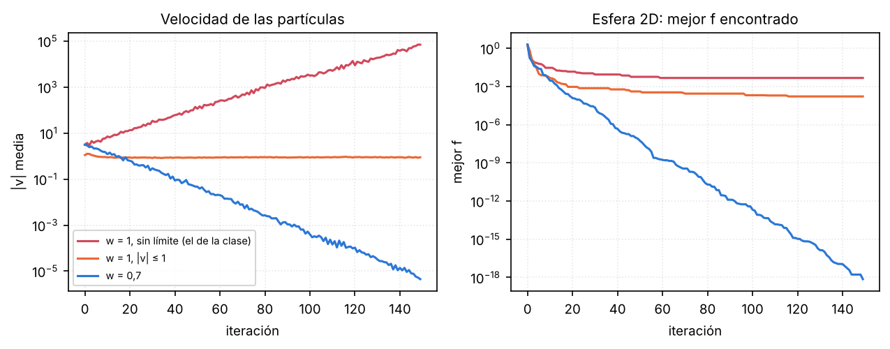

## Mapa del tema



---

## 1. El problema y la inspiración

### Qué problema resuelve

**Minimizar una función $f(\mathbf{x})$** de muchas variables reales: un error, un costo, una distancia. Es el mismo problema que resuelve un algoritmo genético con representación real: buscar el vector $\mathbf{x}$ que da el menor $f$. Se justifica cuando **la cantidad de dimensiones es tan grande** ($\mathbb{R}^{20}$, $\mathbb{R}^{200}$, $\mathbb{R}^{1000}$) que explorar el espacio con los métodos estándar es muy caro, o cuando $f$ no se puede derivar.

### La inspiración

Una **bandada de pájaros** (o un cardumen, o una nube de langostas). Cada individuo vuela ajustando su rumbo con dos fuentes de información:

- **su propia experiencia** (componente **cognitiva**): dónde le fue bien a él;
- **la experiencia de los demás** (componente **social**): dónde le fue bien a la bandada, o a los que tiene cerca.

En cada momento combina las dos para decidir **hacia dónde reorientar su velocidad**. El algoritmo copia exactamente eso: **emular el éxito propio y el de los vecinos**.

---

## 2. El modelo

| Símbolo | Qué es |
|---|---|
| $\mathbf{x}_k(t)$ | **posición** de la partícula $k$ en el tiempo $t$: un vector de $\mathbb{R}^n$, **una posible solución** |
| $\mathbf{v}_k(t)$ | **velocidad** de la partícula $k$: hacia dónde y cuánto se mueve en el próximo paso |
| $\mathbf{y}_k$ | **mejor posición personal**: la mejor que visitó la partícula $k$ desde $t = 0$ |
| $\hat{\mathbf{y}}$ | **mejor posición global**: la mejor entre todas las mejores personales (§3) |
| $f(\mathbf{x})$ | **función de error a minimizar**; cumple el papel de la aptitud |

**Regla básica del movimiento:**

$$\mathbf{x}_k(t+1) = \mathbf{x}_k(t) + \mathbf{v}_k(t+1)$$

Todo el algoritmo está en **cómo se calcula la velocidad**.

Cada dimensión puede ser algo distinto (una temperatura, una velocidad del viento, un peso de una red), así que cada una tiene su propio rango $[x_i^{\min}, x_i^{\max}]$.

---

## 3. Enjambre del mejor global (gEP)

### La topología estrella

**Todas las partículas conocen la información de todas.** La información social es una sola, la misma para todas: $\hat{\mathbf{y}}$, la mejor posición que visitó **cualquier** partícula en toda la historia.

{width=75%}

### El algoritmo

```text
Algoritmo: enjambre del mejor global (gEP)
 1. inicializar xki(0) ~ U(ximin, ximax)                     (cada dimensión en su rango)
    vk(0) = 0 (o valores chicos al azar);  yk = xk(0)
 2. repetir
    2.1 para cada partícula k = 1..N
          si f(xk(t)) < f(yk)  →  yk = xk(t)                 (mejor personal)
          si f(yk)   < f(ŷ)   →  ŷ  = yk                    (mejor global)
    2.2 para cada partícula k = 1..N
          vki(t+1) = vki(t) + c1 r1i (yki − xki(t)) + c2 r2i (ŷi − xki(t))     r1i, r2i ~ U(0, 1)
          xk(t+1)  = xk(t) + vk(t+1)
    hasta cumplir la condición de finalización
 3. devolver la mejor partícula encontrada (ŷ)
```



**Inicialización.** Las posiciones, al azar en el rango de cada dimensión. La velocidad inicial no la fija el algoritmo de la clase; lo habitual es arrancar en 0 (o con valores chicos al azar), y entonces el primer movimiento lo deciden sólo las atracciones.

**Paso 2.1.** En la primera iteración $\mathbf{y}_k$ todavía no tiene nada: se le asigna directamente la posición inicial. Después, cada vez que una partícula pasa por un lugar mejor que su récord, lo actualiza; y si ese récord es mejor que el del enjambre, actualiza $\hat{\mathbf{y}}$.

**Fin.** No hay algo tan claro como «todas las hormigas siguen el mismo camino». Se usa:

- **una cota de error**: el mejor $f$ está por debajo de lo que pide la aplicación;
- **no convergencia**: pasaron muchas iteraciones sin ninguna mejora; el algoritmo se estancó;
- y siempre, un **máximo de iteraciones**.

**Si una partícula se sale del rango.** Nada en la fórmula impide que $\mathbf{x}$ salga de $[x_i^{\min}, x_i^{\max}]$. Las soluciones habituales son las mismas ideas que las restricciones de los algoritmos evolutivos: **recortar** la posición al borde (reparación), o dejarla afuera pero **no actualizar** $\mathbf{y}_k$ ni $\hat{\mathbf{y}}$ con posiciones inválidas, para que las atracciones la traigan de vuelta.

Se devuelve $\hat{\mathbf{y}}$: el vector de variables que mejor resuelve el problema, como el mejor cromosoma en un algoritmo genético.

---

## 4. La actualización de la velocidad

$$v_{ki}(t+1) = \underbrace{v_{ki}(t)}_{\text{lo que traía}} + \underbrace{c_1\, r_{1i}\, \big(y_{ki} - x_{ki}(t)\big)}_{\text{cognitivo: hacia su mejor}} + \underbrace{c_2\, r_{2i}\, \big(\hat{y}_i - x_{ki}(t)\big)}_{\text{social: hacia el mejor del enjambre}}$$

Se calcula **dimensión por dimensión** (el subíndice $i$).

- **$y_{ki} - x_{ki}$** es la distancia, en la dimensión $i$, desde donde está la partícula hasta su mejor posición. Si su mejor está a la derecha, el término empuja a la derecha; cuanto más lejos, más fuerte.
- **$\hat{y}_i - x_{ki}$** es lo mismo hacia la mejor del enjambre.
- **$c_1$ y $c_2$** son **constantes de aceleración**, fijas: cuánto pesa cada atracción. $c_1$ grande: cada partícula confía en sí misma. $c_2$ grande: todas siguen al líder.
- **$r_{1i}$ y $r_{2i}$** son **números al azar** entre 0 y 1, **nuevos en cada iteración y en cada dimensión**. Si salen cerca de 1, la partícula sigue la atracción completa; si salen cerca de 0, casi la ignora. Como cambian por dimensión, el paso **no apunta exactamente** hacia $\mathbf{y}_k$ ni hacia $\hat{\mathbf{y}}$, sino a un punto de la «caja» que los rodea.

**Valores habituales** (de la bibliografía): $c_1 = c_2 = 2$ en la versión original, que necesita $V_{\max}$; con inercia, $w \approx 0{,}73$ y $c_1 = c_2 \approx 1{,}5$. En las figuras se usa $c_1 = c_2 = 1{,}5$.

### Ejemplo con números

Una partícula en $\mathbf{x} = (2, 3)$ con velocidad $\mathbf{v} = (0{,}5;\ -1)$. Su mejor posición es $\mathbf{y} = (1, 1)$; la del enjambre, $\hat{\mathbf{y}} = (0, 0)$. $c_1 = c_2 = 1{,}5$. Salen $\mathbf{r}_1 = (0{,}5;\ 0{,}2)$ y $\mathbf{r}_2 = (0{,}8;\ 0{,}4)$.

| | Dimensión 1 | Dimensión 2 |
|---|---|---|
| Cognitivo $c_1 r_1 (y - x)$ | $1{,}5 \cdot 0{,}5 \cdot (1 - 2) = -0{,}75$ | $1{,}5 \cdot 0{,}2 \cdot (1 - 3) = -0{,}6$ |
| Social $c_2 r_2 (\hat{y} - x)$ | $1{,}5 \cdot 0{,}8 \cdot (0 - 2) = -2{,}4$ | $1{,}5 \cdot 0{,}4 \cdot (0 - 3) = -1{,}8$ |
| $v$ nueva | $0{,}5 - 0{,}75 - 2{,}4 = -2{,}65$ | $-1 - 0{,}6 - 1{,}8 = -3{,}4$ |
| $x$ nueva | $2 - 2{,}65 = -0{,}65$ | $3 - 3{,}4 = -0{,}4$ |


### Una iteración completa a mano

Para ver el algoritmo entero, en **una dimensión**: minimizar $f(x) = x^2$ con tres partículas en $x = -4$, $1$ y $3$, velocidades en 0, $c_1 = c_2 = 1{,}5$. Para poder hacer la cuenta, todos los $r$ salen 0,5, así que cada atracción pesa $1{,}5 \cdot 0{,}5 = 0{,}75$ y la cuenta de cada fila es

$$v_{\text{nueva}} = v + 0{,}75\,(y - x) + 0{,}75\,(\hat{y} - x) \qquad x_{\text{nueva}} = x + v_{\text{nueva}}$$

**Iteración 1.** Las mejores personales son las posiciones iniciales ($f$ = 16, 1 y 9), y la mejor global es $\hat{y} = 1$.

| Partícula | $x$ | $y$ | $v$ nueva | $x$ nueva | $f$ |
|---|---|---|---|---|---|
| 1 | $-4$ | $-4$ | $0 + 0 + 0{,}75 \cdot 5 = 3{,}75$ | $-0{,}25$ | 0,0625 |
| 2 | 1 | 1 | $0 + 0 + 0 = 0$ | 1 | 1 |
| 3 | 3 | 3 | $0 + 0 + 0{,}75 \cdot (-2) = -1{,}5$ | 1,5 | 2,25 |

**Iteración 2.** Las tres mejoraron o empataron: $y_1 = -0{,}25$, $y_2 = 1$, $y_3 = 1{,}5$, y la nueva mejor global es $\hat{y} = -0{,}25$.

| Partícula | $x$ | $v$ nueva | $x$ nueva | $f$ |
|---|---|---|---|---|
| 1 | $-0{,}25$ | $3{,}75 + 0 + 0 = 3{,}75$ | **3,5** | 12,25 |
| 2 | 1 | $0 + 0 + 0{,}75 \cdot (-1{,}25) = -0{,}94$ | 0,06 | 0,004 |
| 3 | 1,5 | $-1{,}5 + 0 + 0{,}75 \cdot (-1{,}75) = -2{,}81$ | $-1{,}31$ | 1,72 |

Tres cosas que se ven en la cuenta:

- **El líder no se mueve si no trae velocidad.** En la iteración 1 la partícula 2 era a la vez su mejor y la mejor global: los dos tirones dan 0 y se queda quieta. Recién se mueve cuando aparece un líder distinto.
- **La velocidad que se arrastra hace pasar de largo.** La partícula 1 encontró el mejor punto ($-0{,}25$) pero conserva su velocidad de 3,75 y salta a 3,5. Sus atracciones la van a traer de vuelta en las iteraciones siguientes. Esto es exploración, y es también lo que la inercia $w < 1$ amortigua.
- **$\mathbf{y}$ no empeora nunca:** aunque la partícula 1 ahora esté en $f = 12{,}25$, su mejor personal sigue siendo $-0{,}25$.

> **IDEA DE FONDO — por qué el azar**
> Sin $r_1$ y $r_2$, cada partícula iría siempre hacia una combinación fija de su mejor y del mejor global. Si el enjambre cayó en un **mínimo local**, todas se encerrarían ahí y no saldrían nunca. Los factores al azar hacen que **no todas vayan exactamente al mismo lugar**: algunas exploran regiones inesperadas respecto de la trayectoria de la bandada, y pueden encontrar algo mejor. Es el mismo papel que la mutación en el algoritmo genético.

### Extensión: inercia y velocidad máxima

En la fórmula de arriba, la velocidad anterior se suma **entera** (coeficiente 1). Eso tiene un problema: la velocidad puede **crecer sin límite** y las partículas salen disparadas, pasan de largo al óptimo cada vez más lejos. En la bibliografía se usan dos arreglos:

- **Velocidad máxima:** después de calcular $v_{ki}$, se recorta a $[-V_{\max}, V_{\max}]$.
- **Peso de inercia $w$:** se multiplica la velocidad anterior por $w < 1$:
$$v_{ki}(t+1) = w\, v_{ki}(t) + c_1 r_{1i}(y_{ki} - x_{ki}) + c_2 r_{2i}(\hat{y}_i - x_{ki})$$
  Con $w$ chico la partícula «olvida» rápido hacia dónde iba y se concentra en las atracciones (explotación); con $w$ cercano a 1 sigue de largo (exploración). Una práctica común es bajar $w$ de 0,9 a 0,4 a lo largo de la corrida.



> **Llegás a:** a las 150 iteraciones, con $w = 1$ y sin límite la velocidad media es $7 \times 10^4$ (explotó) y el mejor $f$ es $4{,}7 \times 10^{-3}$; recortando $|v| \le 1$ el mejor $f$ es $1{,}7 \times 10^{-4}$; con $w = 0{,}7$ la velocidad se apaga ($4{,}5 \times 10^{-6}$) y el mejor $f$ es $7 \times 10^{-19}$.

---

## 5. Enjambre del mejor local (lEP)

### Qué cambia

Sólo la información **social**: en vez del mejor de todo el enjambre, cada partícula usa **el mejor de su entorno**. Lo cognitivo, la función de error, la inicialización y el fin quedan igual.

**Topología anillo:** cada partícula está relacionada con las que tiene al lado. «Al lado» no es geométrico: se decide por los **índices**. La 4 es vecina de la 3 y de la 5, aunque en el espacio estén lejos. El entorno de la partícula $k$, con $n$ vecinos hacia cada lado:

$$E_k = \{\mathbf{y}_{k-n}, \ldots, \mathbf{y}_{k-1}, \mathbf{y}_k, \mathbf{y}_{k+1}, \ldots, \mathbf{y}_{k+n}\}$$

$$\hat{\mathbf{y}}_k = \arg\min_{\mathbf{y}_u \in E_k} f(\mathbf{y}_u)$$

Y la velocidad usa $\hat{\mathbf{y}}_k$, **distinto para cada partícula**:

$$v_{ki}(t+1) = v_{ki}(t) + c_1 r_{1i}(y_{ki} - x_{ki}) + c_2 r_{2i}(\hat{y}_{ki} - x_{ki})$$

```text
Algoritmo: enjambre del mejor local (lEP)
 1. inicializar xki(0) ~ U(ximin, ximax);  vk(0) = 0;  yk = xk(0)
 2. repetir
    2.1 para cada partícula k = 1..N
          si f(xk(t)) < f(yk)  →  yk = xk(t)
    2.2 para cada partícula k = 1..N
          ŷk = argmin f(yu) entre los yu de su entorno Ek
          vki(t+1) = vki(t) + c1 r1i (yki − xki(t)) + c2 r2i (ŷki − xki(t))
          xk(t+1)  = xk(t) + vk(t+1)
    hasta cumplir la condición de finalización
 3. devolver la mejor partícula encontrada
```

### Ejemplo: el entorno de cada partícula

Seis partículas en anillo, $n = 1$. Los errores de sus mejores posiciones personales:

| Partícula | 1 | 2 | 3 | 4 | 5 | 6 |
|---|---|---|---|---|---|---|
| $f(\mathbf{y}_k)$ | 5 | 2 | 8 | 1 | 9 | 4 |
| Entorno | 6, 1, 2 | 1, 2, 3 | 2, 3, 4 | 3, 4, 5 | 4, 5, 6 | 5, 6, 1 |
| $\hat{\mathbf{y}}_k$ (lEP) | $\mathbf{y}_2$ | $\mathbf{y}_2$ | $\mathbf{y}_4$ | $\mathbf{y}_4$ | $\mathbf{y}_4$ | $\mathbf{y}_6$ |
| $\hat{\mathbf{y}}$ (gEP) | $\mathbf{y}_4$ | $\mathbf{y}_4$ | $\mathbf{y}_4$ | $\mathbf{y}_4$ | $\mathbf{y}_4$ | $\mathbf{y}_4$ |

En gEP todas corren hacia $\mathbf{y}_4$. En lEP hay **tres atractores** ($\mathbf{y}_2$, $\mathbf{y}_4$, $\mathbf{y}_6$): las partículas 1 y 2 todavía no «se enteraron» de $\mathbf{y}_4$. Si la 3 mejora gracias a $\mathbf{y}_4$, en la iteración siguiente la 2 lo sabrá, y después la 1: **la información viaja de vecino en vecino**, despacio.

> **IDEA DE FONDO — global o local**
> **gEP converge más rápido** porque todas siguen al mismo líder, pero si el líder está en un mínimo local, arrastra a todo el enjambre. **lEP converge más lento**: varios grupos exploran a la vez alrededor de líderes distintos, y es más difícil que todo el enjambre quede atrapado. Es otra vez el compromiso entre **explotación y exploración**.


> **Llegás a:** a las 50 iteraciones el global va adelante (mejor $f$ 31,7 contra 35,0). La dispersión media a la iteración 60 es 1,65 con global y 4,98 con local: el local sigue explorando. Al final (400 iteraciones) el local termina un poco mejor: mediana 8,5 contra 9,0.

---

## 6. Comparación con lo anterior

| | Algoritmo genético | Colonia de hormigas | Enjambre de partículas |
|---|---|---|---|
| Qué es un individuo | un cromosoma (una solución) | una hormiga que **construye** un camino | una partícula (una solución, $\mathbf{x}_k$) |
| Espacio | binario o real | **grafo** (problemas de caminos) | **real**, $\mathbb{R}^n$ |
| Qué se hereda o se aprende | genes, por selección y cruza | **feromonas** en el entorno (estigmergía) | **memorias** $\mathbf{y}_k$ y $\hat{\mathbf{y}}$ |
| Los individuos mueren | sí, en cada generación | no: las mismas hormigas vuelven a salir | no: las mismas partículas se mueven |
| Fuente de exploración | mutación | probabilidad de elegir el nodo | $r_1$, $r_2$ |
| Fin típico | generaciones, aptitud | todas siguen el mismo camino | cota de error o sin mejoras |

---

## 7. Guion para el pizarrón

1. **Problema e inspiración** (§1): minimizar $f$ en $\mathbb{R}^n$; bandadas; componente cognitiva y social.
2. **El modelo** (§2): $\mathbf{x}_k$, $\mathbf{v}_k$, $\mathbf{y}_k$, $\hat{\mathbf{y}}$, $f$; $\mathbf{x}(t+1) = \mathbf{x}(t) + \mathbf{v}(t+1)$.
3. **gEP** (§3): pseudocódigo; *dibujo* de la topología estrella.
4. **La velocidad** (§4): la fórmula término por término; *dibujo* de las tres flechas (el ejemplo con números); para qué están $r_1$ y $r_2$; la iteración a mano en una dimensión (el líder quieto y la partícula que pasa de largo). Si da el tiempo: inercia y $V_{\max}$.
5. **lEP** (§5): *dibujo* del anillo; $E_k$ y $\hat{\mathbf{y}}_k$; la tabla de seis partículas; global contra local.

---

## 8. Formulario

| Qué | Fórmula |
|---|---|
| Inicialización | $x_{ki}(0) \sim U(x_i^{\min}, x_i^{\max})$ |
| Mejor personal | si $f(\mathbf{x}_k) < f(\mathbf{y}_k)$: $\mathbf{y}_k = \mathbf{x}_k$ |
| Mejor global | si $f(\mathbf{y}_k) < f(\hat{\mathbf{y}})$: $\hat{\mathbf{y}} = \mathbf{y}_k$ |
| Velocidad (gEP) | $v_{ki}(t+1) = v_{ki} + c_1 r_{1i}(y_{ki} - x_{ki}) + c_2 r_{2i}(\hat{y}_i - x_{ki})$, $r \sim U(0,1)$ |
| Posición | $\mathbf{x}_k(t+1) = \mathbf{x}_k(t) + \mathbf{v}_k(t+1)$ |
| Entorno (lEP) | $E_k = \{\mathbf{y}_{k-n}, \ldots, \mathbf{y}_{k+n}\}$, $\hat{\mathbf{y}}_k = \arg\min_{E_k} f$ |
| Velocidad (lEP) | igual, con $\hat{y}_{ki}$ en lugar de $\hat{y}_i$ |
| Con inercia | $v_{ki}(t+1) = w\,v_{ki} + \ldots$, y opcional $\lvert v_{ki}\rvert \le V_{\max}$ |

---

## 9. Errores típicos

1. **Usar un único $r$ para todas las dimensiones o para toda la corrida.** $r_{1i}$ y $r_{2i}$ se sortean de nuevo en cada iteración, para cada dimensión.
2. **Confundir $\mathbf{y}_k$ con $\mathbf{x}_k$.** $\mathbf{x}_k$ es dónde está ahora; $\mathbf{y}_k$ es el mejor lugar por donde pasó, y sólo cambia si encuentra algo mejor.
3. **Decir que la vecindad del anillo es por distancia.** Es por **índices**: la 4 es vecina de la 3 y la 5.
4. **Decir que en lEP todas comparten $\hat{\mathbf{y}}$.** Cada partícula tiene su $\hat{\mathbf{y}}_k$.
5. **Pensar que la partícula va directo al mejor.** Se suma una **corrección a la velocidad**; con la velocidad que trae puede pasar de largo, y eso es exploración.
6. **Usar un $f$ a maximizar con el signo «$<$».** El algoritmo, tal como está escrito, **minimiza** un error.

---

## 10. Autoevaluación

1. ¿Qué problema resuelve el enjambre de partículas? ¿Cuándo se justifica?
2. ¿Cuál es la inspiración? ¿Qué son la componente cognitiva y la social?
3. Definí $\mathbf{x}_k$, $\mathbf{v}_k$, $\mathbf{y}_k$, $\hat{\mathbf{y}}$ y $f$.
4. Escribí el pseudocódigo de gEP.
5. Escribí la actualización de la velocidad y explicá cada término. ¿Qué pasa si $c_2 \gg c_1$? ¿Y si $c_1 \gg c_2$?
6. Calculá a mano una actualización con $\mathbf{x} = (2, 3)$, $\mathbf{v} = (0{,}5;\ -1)$, $\mathbf{y} = (1,1)$, $\hat{\mathbf{y}} = (0,0)$, $c_1 = c_2 = 1{,}5$, $\mathbf{r}_1 = (0{,}5;\ 0{,}2)$, $\mathbf{r}_2 = (0{,}8;\ 0{,}4)$.
7. ¿Para qué sirven $r_1$ y $r_2$? ¿Qué pasaría sin ellos?
8. ¿Cómo termina el algoritmo? ¿Qué se hace si una partícula sale del rango?
9. Hacé dos iteraciones a mano de $f(x)=x^2$ con partículas en $-4$, 1 y 3. ¿Por qué la partícula 2 no se mueve al principio? ¿Por qué la 1 pasa de largo?
10. ¿Qué cambia en lEP? Definí $E_k$ y $\hat{\mathbf{y}}_k$. Hacé la tabla para 6 partículas en anillo.
11. ¿Qué ventajas y desventajas tienen gEP y lEP?
12. ¿Qué problema tiene la velocidad con coeficiente 1? ¿Cómo lo arreglan la inercia y $V_{\max}$?
13. Compará partículas, hormigas y algoritmo genético.
