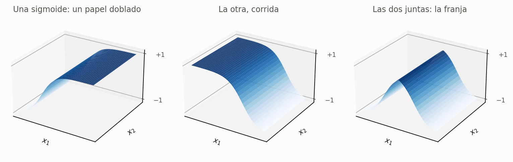
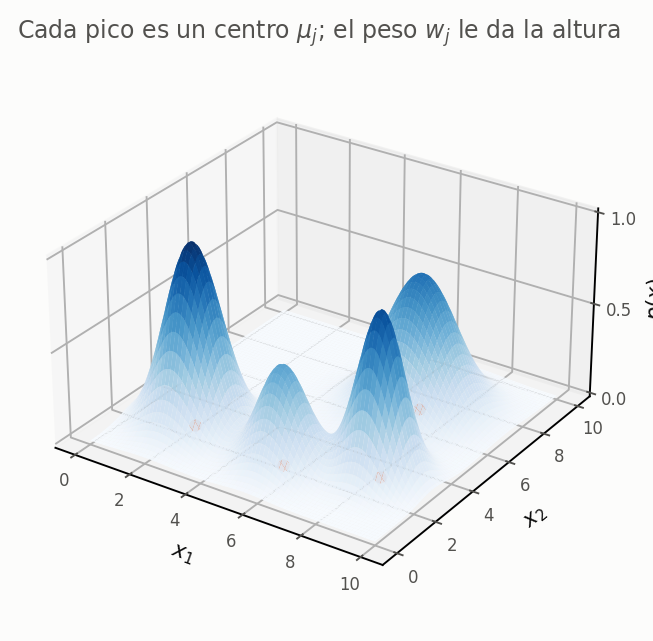
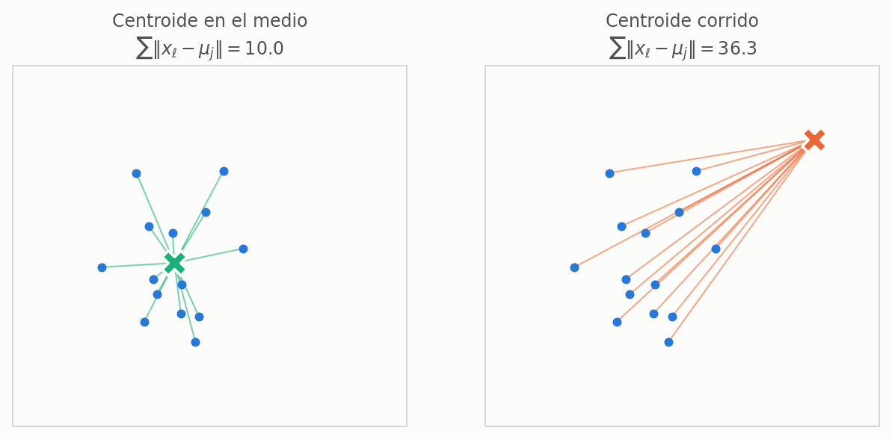
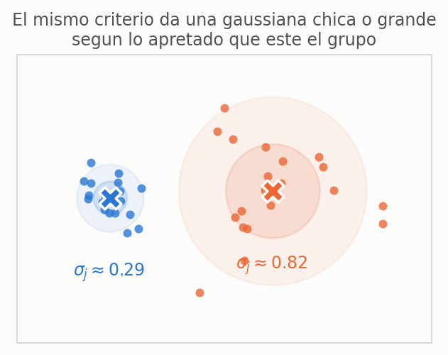
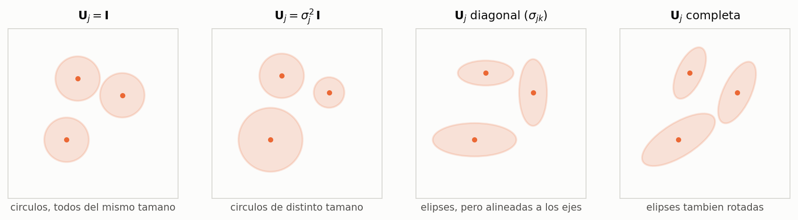
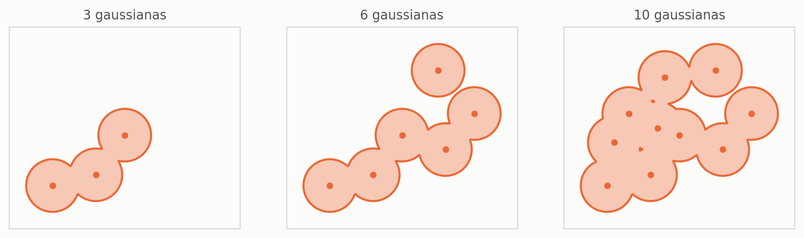
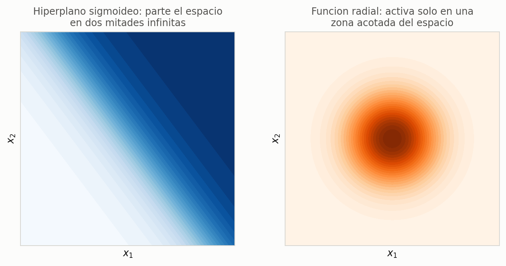

*Notación: vectores columna; **negritas** para vectores y matrices ($\mathbf{x}$, $\mathbf{U}_j$). El subíndice $j$ recorre las neuronas de la capa radial, el $k$ las de la capa de salida, el $\ell$ los patrones y el $i$ las dimensiones de la entrada. Mantener esos cuatro índices separados es la mitad del tema.*

*Cinco diapositivas de la cátedra tienen sólo el título: el profesor dibujaba en el pizarrón. Las figuras 1, 2, 3, 5, 10 y 11 reconstruyen esos dibujos a partir de su descripción hablada, y están marcadas como tales.*

---

## 1. Por qué aparecen: el XOR, una vez más

El XOR ya está resuelto —con tres perceptrones, o con una capa oculta y back-propagation— pero vale la pena volver a mirar *cómo* quedó resuelto, porque ahí está la idea de esta unidad.

Cada neurona con sigmoide, vista en tres dimensiones, es **un papel doblado**: una zona plana en $-1$, una subida y una zona plana en $+1$. Con la función signo la subida sería un escalón; con la sigmoide es una rampa. Lo único que se elige al entrenar es *dónde* está el doblez y *hacia dónde* mira.

La franja del XOR sale de superponer dos de esos papeles: uno que sube a la izquierda, otro que sube a la derecha, y una tercera neurona que combina las dos regiones. Funciona, pero es un rodeo: para encerrar una zona hay que armarla como intersección de medios planos.

> **IDEA DE FONDO — el problema no era el XOR, era la forma de la función**
> Un hiperplano sigmoideo siempre parte el espacio en dos mitades **infinitas**. Para encerrar algo hay que cruzar varias mitades, y por eso hacen falta capas. Si en vez de un papel doblado se usa una función que ya viene **cerrada** —una campana alrededor de un centro— encerrar una región deja de ser un problema de combinar y pasa a ser un problema de ubicar.

Se llama **radial** porque su valor depende sólo del **radio**: de la distancia al centro, no de la dirección. Todos los puntos que están a la misma distancia de $\boldsymbol{\mu}_j$ valen lo mismo.

Con radiales, el XOR se resuelve poniendo un círculo sobre cada patrón positivo y sumando las dos salidas. No hay que combinar semiplanos: hay que ubicar centros.

### Claves de la sección 1

| Clave | Qué tenés que poder responder |
|---|---|
| Papel doblado | Qué forma tiene una sigmoide en 3D y por qué no encierra nada |
| Radial | Por qué se llama así: depende del radio, no de la dirección |
| El cambio de fondo | Se cambia la *función de activación*, no la arquitectura |

---

## 2. De dónde vienen: aproximación de funciones

Las RBF **no** nacieron como clasificadores. Nacieron para **aproximar funciones**:

$$\varphi : \mathbb{R}^N \to \mathbb{R}, \qquad d = \varphi(\mathbf{x})$$

La salida deseada $d$ es un **real continuo**, no un $\pm 1$. Ésa es la diferencia de origen con el perceptrón, y explica por qué la capa de salida termina siendo lineal.

La propuesta de aproximación es una suma pesada de funciones centradas:

$$h(\mathbf{x}) = \sum_j w_j\, \varphi\!\left(\lVert \mathbf{x} - \boldsymbol{\mu}_j \rVert\right)$$

y la $\varphi$ que se usa casi siempre —y la que usa la cátedra— es la gaussiana:

$$\varphi(\kappa) = e^{-\frac{\kappa^2}{2\sigma^2}}$$

> **IDEA DE FONDO — leé la fórmula de adentro hacia afuera**
> Primero una **distancia** $\lVert \mathbf{x} - \boldsymbol{\mu}_j \rVert$, que es un escalar. Después una **no linealidad** $\varphi$ aplicada a ese escalar. Recién al final una **combinación lineal** con los pesos. Todo lo raro de la red pasa en el primer paso: es el único lugar de la materia donde la entrada no se combina con los pesos mediante un producto interno, sino que se compara con un prototipo mediante una distancia.

### Claves de la sección 2

| Clave | Qué tenés que poder responder |
|---|---|
| Origen | Aproximación de funciones con salida real, no clasificación |
| $\lVert \mathbf{x}-\boldsymbol{\mu}_j \rVert$ | Distancia a un prototipo, no producto interno |
| El rol de $w_j$ | Le da la altura (y el signo) a cada campana |

---

## 3. La arquitectura

Tres columnas y muy pocas reglas:

- **Entradas.** Los pesos entre la entrada y la capa radial **se fijan en 1** y no se entrenan. La entrada llega entera a cada gaussiana; lo que la neurona hace con ella lo deciden $\boldsymbol{\mu}_j$ y $\sigma_j$.
- **Capa radial.** Cada neurona es una gaussiana en $\mathbb{R}^N$, con $N$ la dimensión de la entrada. **No tiene sesgo**: sus parámetros son el vector de medias y la desviación.
- **Salida.** Un perceptrón simple con **salida lineal**: los pesos $w_{kj}$, la entrada $-1$ y su $w_{k0}$, y ninguna función de activación no lineal. Puede haber varias neuronas de salida.

> **OJO — dos negaciones que se preguntan**
> La capa radial **no** tiene sesgo, y la capa de salida **no** tiene no linealidad. Las dos son al revés que en el perceptrón multicapa, y las dos tienen la misma explicación: la no linealidad de esta red está toda concentrada en la gaussiana.

### Claves de la sección 3

| Clave | Qué tenés que poder responder |
|---|---|
| Pesos de entrada | Fijos en 1, no se entrenan |
| Capa radial | Sin sesgo; parámetros $\boldsymbol{\mu}_j$ y $\sigma_j$ |
| Capa de salida | Perceptrón simple lineal, con su $-1$ y su $w_{k0}$ |

---

## 4. El modelo matemático

$$y_k(\mathbf{x}_\ell) = \sum_{j=1}^{M} w_{kj}\, \varphi_j(\mathbf{x}_\ell)
\qquad\text{con}\qquad
\varphi_j(\mathbf{x}_\ell) = e^{-\frac{\lVert \mathbf{x}_\ell - \boldsymbol{\mu}_j \rVert^2}{2\sigma_j^2}}$$

Dos líneas y está toda la red. Conviene decirlas en voz alta así: *"la salida $k$ es la suma pesada de las $M$ salidas radiales, y cada salida radial es una gaussiana centrada en su propio $\boldsymbol{\mu}_j$"*.

Los índices, uno por uno:

| Índice | Recorre | Cuántos |
|:---:|---|---|
| $k$ | neuronas de la capa de salida | tantas como salidas pida el problema |
| $j$ | neuronas de la capa radial | $M$, se elige |
| $\ell$ | patrones del conjunto de entrenamiento | los que haya |
| $i$ o $k'$ | dimensiones de la entrada | $N$ |

**¿Cuáles son los parámetros a entrenar?** La pregunta está textual en la diapositiva 15, así que conviene tener la respuesta lista:

1. los centros $\boldsymbol{\mu}_j$ — uno por neurona radial, cada uno en $\mathbb{R}^N$;
2. las desviaciones $\sigma_j$ — o la matriz $\mathbf{U}_j$ en el caso general;
3. los pesos $w_{kj}$ de la capa de salida.

> **PARA LA DEFENSA — el modelo de la diapositiva está simplificado**
> Hay **un solo** $\sigma_j$ por neurona, igual para todas las dimensiones: la gaussiana es esférica. El caso general —una matriz de covarianza por neurona— es la sección 9. Si te preguntan por el modelo "posta", ése es.

---

## 5. El entrenamiento es mixto

Ésta es la particularidad de la unidad, y es lo primero que hay que decir si te preguntan por RBF:

> **IDEA DE FONDO — una red, dos paradigmas de aprendizaje**
> La capa radial se entrena **sin supervisión**: no se usa la salida deseada $d$ en ningún momento. La capa de salida se entrena **con supervisión**, igual que un perceptrón. Es el primer método no supervisado de la materia, y la primera red que combina los dos paradigmas.

La cátedra plantea dos métodos:

**Método 1 (el que se usa).** Dos etapas separadas.

1. Adaptación **no supervisada** de las RBF — por $k$-medias, por mapas autoorganizativos u otros.
2. Adaptación **supervisada** de los $w_{kj}$ — por LMS.

**Método 2.** Se inicializa con el método 1 y después se hace una adaptación supervisada de **todo**, incluidos los parámetros de la capa radial, calculando $\dfrac{\partial \xi}{\partial \mu_{ji}}$ y $\dfrac{\partial \xi}{\partial \sigma_j}$.

En general se adaptan las RBF y los $w_{kj}$ **por separado**. Es lo que vamos a desarrollar.

---

## 6. Etapa 1 — los centros por $k$-medias

### 6.1 Qué se busca

Encontrar $k$ conjuntos $C_j$ de patrones tales que:

- cada conjunto sea **lo más diferente posible** de los demás;
- los patrones **dentro** de cada conjunto sean **lo más parecidos posible** entre ellos;

y, para cada uno, su **centroide** $\boldsymbol{\mu}_j$ — que después será el centro de la gaussiana de la neurona $j$.

> **OJO — la $k$ de $k$-medias es la cantidad de neuronas radiales**
> No es un índice más: si ponés 10 neuronas en la capa radial, $k$-medias tiene que encontrar 10 conjuntos. Elegir la arquitectura y elegir $k$ son la misma decisión.

El criterio a minimizar es la suma de las distancias de cada patrón a su propio centroide:

$$\min J = \sum_{j=1}^{k} \sum_{\ell \in C_j} \lVert \mathbf{x}_\ell - \boldsymbol{\mu}_j \rVert^2$$

### 6.2 $k$-medias por lotes

1. **Inicialización.** Se forman los $k$ conjuntos $C_j(0)$ repartiendo los patrones $\mathbf{x}_\ell$ **al azar**.
2. **Centroides.** $\displaystyle \boldsymbol{\mu}_j(n) = \frac{1}{|C_j(n)|} \sum_{\ell \in C_j(n)} \mathbf{x}_\ell$ — un promedio vectorial simple, no ponderado.
3. **Reasignación.** Cada patrón se va al conjunto cuyo centroide tenga más cerca: $$\ell \in C_j(n) \iff \lVert \mathbf{x}_\ell - \boldsymbol{\mu}_j \rVert^2 < \lVert \mathbf{x}_\ell - \boldsymbol{\mu}_i \rVert^2 \quad \forall\, i \neq j$$
4. **Volver a 2** hasta que no se realicen reasignaciones.

> **IDEA DE FONDO — el promedio del paso 2 no es una receta, es la solución exacta**
> Con los conjuntos fijos, derivá $J$ respecto de $\boldsymbol{\mu}_j$ y igualá a cero: $\;\nabla_{\boldsymbol{\mu}_j} J = -2\sum_{\ell \in C_j}(\mathbf{x}_\ell - \boldsymbol{\mu}_j) = \mathbf{0}$, o sea $\sum_\ell \mathbf{x}_\ell = |C_j|\,\boldsymbol{\mu}_j$. El promedio **es** el punto donde el gradiente se anula. Por eso $k$-medias no necesita paso de aprendizaje: resuelve exactamente medio problema en cada iteración, y alterna.

**El criterio de parada es discreto.** No se para cuando $J$ baja poco: se para cuando **ningún patrón cambia de conjunto**. Si nadie se mueve, los centroides tampoco cambian, y la iteración siguiente sería idéntica.

### 6.3 $k$-medias online, y el gradiente que la diapositiva saltea

En lugar de recorrer todo el conjunto y después ajustar, se ajusta **patrón por patrón**. La diapositiva 30 escribe $\nabla_{\boldsymbol{\mu}} J = 0$ y en la línea siguiente aparece la regla ya hecha. Éstos son los pasos del medio.

Para el patrón $\mathbf{x}_\ell$ que acaba de entrar, el único término de $J$ que le corresponde es el de su conjunto:

$$J_\ell = \lVert \mathbf{x}_\ell - \boldsymbol{\mu}_j \rVert^2 = (\mathbf{x}_\ell - \boldsymbol{\mu}_j)^{\mathsf{T}} (\mathbf{x}_\ell - \boldsymbol{\mu}_j)$$

Se deriva respecto del vector $\boldsymbol{\mu}_j$, con la regla de la cadena (la derivada interna es $-\mathbf{I}$):

$$\nabla_{\boldsymbol{\mu}_j} J_\ell = 2\,(\mathbf{x}_\ell - \boldsymbol{\mu}_j) \cdot (-1) = -2\,(\mathbf{x}_\ell - \boldsymbol{\mu}_j)$$

Se da un paso **en contra** del gradiente, con velocidad $\eta'$:

$$\boldsymbol{\mu}_j(n+1) = \boldsymbol{\mu}_j(n) - \eta' \nabla_{\boldsymbol{\mu}_j} J_\ell = \boldsymbol{\mu}_j(n) + 2\eta'\,(\mathbf{x}_\ell - \boldsymbol{\mu}_j(n))$$

y absorbiendo el 2 en la constante ($\eta = 2\eta'$) queda la regla de la diapositiva:

$$\boxed{\;\boldsymbol{\mu}_j(n+1) = \boldsymbol{\mu}_j(n) + \eta\,\big(\mathbf{x}_\ell - \boldsymbol{\mu}_j(n)\big)\;}$$

**El algoritmo completo:**

1. **Inicialización.** Se eligen $k$ patrones al azar y se usan directamente como centroides iniciales: $\boldsymbol{\mu}_j(0) = \mathbf{x}'_\ell$.
2. **Selección del ganador.** $\;j^* = \arg\min_j \lVert \mathbf{x}_\ell - \boldsymbol{\mu}_j(n) \rVert$
3. **Adaptación.** $\;\boldsymbol{\mu}_{j^*}(n+1) = \boldsymbol{\mu}_{j^*}(n) + \eta\,(\mathbf{x}_\ell - \boldsymbol{\mu}_{j^*}(n))$
4. **Volver a 2** hasta no encontrar mejoras significativas en $J$.

> **OJO — leé la regla geométricamente antes de memorizarla**
> $\mathbf{x}_\ell - \boldsymbol{\mu}_{j^*}$ es el vector que va **del centroide al patrón**. La regla dice: *dá un paso de tamaño $\eta$ en esa dirección*. Con $\eta = 1$ el centroide salta encima del patrón y se olvida de todo lo anterior; con $\eta = 0$ no aprende nunca. Es exactamente la misma lectura que la corrección de error del perceptrón.

> **OJO — tres diferencias entre las dos versiones**
> **(1)** Por lotes cada vuelta del ciclo procesa **todo** el conjunto; online, **un solo patrón**. **(2)** Por lotes se mueven **todos** los centroides a la vez; online, **sólo el ganador**. **(3)** Por lotes no hay $\eta$; online sí. El criterio de parada también cambia: reasignaciones nulas contra "no hay mejoras significativas en $J$".

### Claves de la sección 6

| Clave | Qué tenés que poder responder |
|---|---|
| $J$ | Suma de distancias al cuadrado de cada patrón a su centroide |
| Los dos pasos que alternan | Recalcular centroides / reasignar patrones |
| Por qué el promedio | Es la solución exacta de $\nabla J = 0$ con los conjuntos fijos |
| $j^*$ | El centroide ganador: el más cercano al patrón que entró |
| Parada | Sin reasignaciones (lotes) / sin mejoras en $J$ (online) |

---

## 7. Cómo se elige $\sigma$

$k$-medias entrega los centros, no los anchos. Para $\sigma_j$ el criterio de la cátedra es directo: **una vez que tenés el centroide, calculás la desviación de los patrones que quedaron en ese conjunto respecto de él.**

$$\sigma_j^2 = \frac{1}{N\,|C_j|} \sum_{\ell \in C_j} \lVert \mathbf{x}_\ell - \boldsymbol{\mu}_j \rVert^2$$

> **OJO — la fórmula exacta es reconstrucción, el criterio no**
> En la clase el criterio se dice en palabras ("calcular la desviación entre ese centroide y todos los puntos que están adentro del conjunto") y no queda escrito en ninguna diapositiva. La expresión de arriba es esa idea puesta en símbolos: promedio de las distancias al cuadrado, dividido por $N$ para que quede una varianza **por dimensión** compatible con el $2\sigma_j^2$ del denominador. Si en el pizarrón te piden "la" fórmula, decí el criterio y escribila; lo que se evalúa es que entiendas de dónde sale, no un número.

> **IDEA DE FONDO — por qué se puede ser tan informal con $\sigma$**
> Porque **los pesos de salida arreglan lo que $\sigma$ no ajusta**. Si una gaussiana quedó ancha de más, su $w_{kj}$ puede bajarle la importancia en la suma final. Ésa es la razón por la que hasta el modelo más pobre —todas las gaussianas del mismo tamaño, $\mathbf{U}_j = \mathbf{I}$— funciona bien en la práctica, y es textual de la clase 018.

---

## 8. Etapa 2 — los pesos de la capa de salida

### 8.1 El desdoblamiento: por qué esto es un perceptrón simple

La etapa 1 terminó. Los $\boldsymbol{\mu}_j$ y los $\sigma_j$ quedan **fijos**, y los pesos de entrada ya estaban fijos en 1. Entonces, para cada patrón, la capa radial produce siempre el mismo vector de salidas $\boldsymbol{\varphi}(\mathbf{x}_\ell)$.

La imagen que usa el profesor: es como si alguien tomara tu archivo con las columnas $x_1, x_2$ y te devolviera **otro archivo** con las columnas $\varphi_1, \varphi_2, \varphi_3, \varphi_4$. Con ese archivo nuevo entrenás, y te olvidás de que hubo una etapa previa.

$$\mathbf{y} = \mathbf{W}\,\boldsymbol{\varphi}(\mathbf{x}_\ell)$$

Métodos para obtener $\mathbf{W}$:

- **pseudo-inversa** de $\boldsymbol{\varphi}(\mathbf{x}_\ell)$ — despejar $\mathbf{W}$ de un tirón, sin iterar;
- **gradiente descendente** sobre el error cuadrático instantáneo (**LMS**) — el que se desarrolla.

> **IDEA DE FONDO — de acá sale toda la ventaja de las RBF**
> Con la capa radial congelada, el problema que queda es **lineal en los parámetros**. No hay retropropagación, no hay derivada de sigmoide, no hay mínimos locales del lado supervisado. Cuando en la comparación con el MLP se dice "convergencia más simple (linealidad)", se está hablando exactamente de esto.

### 8.2 La derivación completa

**Error de la neurona de salida $k$** — notar el orden de la resta:

$$e_k(n) = y_k(n) - d_k(n)$$

**Criterio:**

$$\xi(n) = \frac{1}{2}\sum_k e_k^2(n) = \frac{1}{2}\sum_k \left( \sum_j w_{kj}(n)\,\varphi_j(n) - d_k(n) \right)^{\!2}$$

El cuadrado está para que un error positivo en una salida no se compense con uno negativo en otra —si se cancelaran, el criterio diría cero con todas las neuronas equivocadas—, y el $\tfrac{1}{2}$ está para que se simplifique al derivar. Podría ser valor absoluto; el cuadrado se elige por la facilidad de la derivada.

**Derivada respecto de un peso.** De la sumatoria externa sobre $k$ sólo sobrevive el término de esa neurona:

$$\frac{\partial \xi(n)}{\partial w_{kj}(n)} = \left( \sum_i w_{ki}(n)\,\varphi_i(n) - d_k(n) \right) \frac{\partial}{\partial w_{kj}} \left( \sum_i w_{ki}(n)\,\varphi_i(n) - d_k(n) \right)$$

Adentro del paréntesis derecho: $d_k$ es constante y se va; de la sumatoria sobre $i$, todos los términos con $i \neq j$ son constantes respecto de $w_{kj}$ y también se van. Queda sólo $\varphi_j$. Y el paréntesis izquierdo es, por definición, $e_k$:

$$\boxed{\;\frac{\partial \xi(n)}{\partial w_{kj}(n)} = e_k(n)\,\varphi_j(n)\;}$$

**Regla de aprendizaje** — paso en contra del gradiente:

$$w_{kj}(n+1) = w_{kj}(n) - \eta\, e_k(n)\, \varphi_j(n)$$

y escrita entera, sin abreviar el error:

$$w_{kj}(n+1) = w_{kj}(n) - \eta \left( \sum_i w_{ki}(n)\,\varphi_i(n) - d_k(n) \right) \varphi_j(n)$$

### 8.3 La trampa del signo

En la unidad del perceptrón el error era $e = d - y$ y la regla sumaba. Acá el error es $e_k = y_k - d_k$ y la regla **resta**. El profesor lo menciona al pasar: *"acá hay un pequeño cambio de notación respecto a lo que habíamos encontrado"*.

> **OJO — son la misma regla, y hay que poder mostrarlo en dos renglones**
> $$-\eta\,(y_k - d_k)\,\varphi_j \;=\; +\eta\,(d_k - y_k)\,\varphi_j$$
> El signo del paso y el orden de la resta se cancelan. Lo que **no** podés hacer es mezclar: si escribís $e = d - y$ tenés que sumar, y si escribís $e = y - d$ tenés que restar. La forma de no equivocarse es no memorizar el signo sino **derivarlo**: siempre se va en contra del gradiente, y el gradiente hereda el orden de la resta que hayas elegido.

**El control de tres segundos.** Suponé una sola salida, $\varphi_j > 0$, y que la red da **de más**: $y > d$, o sea $e > 0$. La regla resta $\eta e \varphi_j$, así que $w$ **baja**, y con eso $y$ baja. Correcto. Si te da al revés, tenés un signo cambiado.

### Claves de la sección 8

| Clave | Qué tenés que poder responder |
|---|---|
| El desdoblamiento | Congelada la capa radial, queda un perceptrón simple lineal |
| Los dos métodos | Pseudo-inversa y LMS |
| $\partial \xi / \partial w_{kj}$ | $e_k \varphi_j$, y de dónde sale cada factor |
| El signo | $e = y - d$ y la regla resta; con $e = d-y$ sumaría |

---

## 9. Las gaussianas $N$-dimensionales

Hasta acá cada gaussiana tenía un solo $\sigma_j$: era esférica. El caso general reemplaza ese escalar por una **matriz de covarianza** $\mathbf{U}_j \in \mathbb{R}^{N \times N}$:

$$\mathcal{N}(\mathbf{x}, \boldsymbol{\mu}_j, \mathbf{U}_j) = \frac{1}{(2\pi)^{N/2}\,|\mathbf{U}_j|^{1/2}} \cdot e^{-\frac{1}{2}\left[(\mathbf{x}-\boldsymbol{\mu}_j)^{\mathsf{T}} \mathbf{U}_j^{-1} (\mathbf{x}-\boldsymbol{\mu}_j)\right]}$$

**Cómo leer el exponente.** $(\mathbf{x}-\boldsymbol{\mu}_j)^{\mathsf{T}}(\ldots)(\mathbf{x}-\boldsymbol{\mu}_j)$ es la misma resta multiplicada dos veces: es la **norma al cuadrado** que teníamos antes, sólo que con la matriz metida en el medio. Y la matriz aparece **invertida**, que es lo mismo que decir que está *dividiendo*: en $\mathbb{R}^1$, $\mathbf{U}_j^{-1}$ es el escalar $1/\sigma_j^2$ y se recupera exactamente la fórmula de la sección 4. Lo de adelante es una constante y no cambia la forma.

La cátedra los numera al revés, del más simple al más completo:

**Caso simplificado 3 — $\mathbf{U}_j = \mathbf{I}$.** No queda nada en el denominador:

$$\mathcal{N}'(\mathbf{x}, \boldsymbol{\mu}_j) = e^{-\frac{1}{2}\sum_{k=1}^{N}(x_k - \mu_{jk})^2}$$

Círculos perfectos, **todos del mismo tamaño**, que sólo se pueden mover. Parece pobrísimo, y sin embargo alcanza para la mayoría de los problemas: los pesos de salida le dan a cada gaussiana la importancia que corresponda. Es el modelo que la cátedra usa en la práctica.

**Caso simplificado 2 — $\mathbf{U}_j = \sigma^2\mathbf{I}$, diagonal igual.** El $\sigma$ sale afuera de la sumatoria porque es un escalar:

$$\mathcal{N}(\mathbf{x}, \boldsymbol{\mu}_j, \mathbf{U}_j) = \frac{1}{(2\pi)^{N/2}\,\sigma^{N}} \cdot e^{-\frac{1}{2\sigma^2}\sum_{k=1}^{N}(x_k - \mu_{jk})^2}$$

Círculos de **distinto tamaño**: grande donde los patrones estén desparramados, chico donde estén apretados. Es el caso de la sección 7.

**Caso simplificado 1 — $\mathbf{U}_j$ diagonal general, con $\sigma_{jk}$.** Una varianza por dimensión y por neurona:

$$\mathcal{N}(\mathbf{x}, \boldsymbol{\mu}_j, \mathbf{U}_j) = \frac{1}{(2\pi)^{N/2}\,\prod_{k=1}^{N} \sigma_{jk}} \cdot e^{-\frac{1}{2}\sum_{k=1}^{N} \frac{(x_k - \mu_{jk})^2}{\sigma_{jk}^2}}$$

Ahora hay **elipses**: si los patrones se estiran en una dirección, la gaussiana se acuesta y los abarca sin tragarse otros que no correspondían. Pero sólo horizontales o verticales — **alineadas a los ejes**, nunca rotadas.

**Caso general.** La matriz completa. En $\mathbb{R}^2$:

$$\mathbf{U}_j = \begin{pmatrix} \sigma_{j11} & \sigma_{j12} \\ \sigma_{j21} & \sigma_{j22} \end{pmatrix}$$

Los de la diagonal son las varianzas de cada dimensión —lo del caso anterior—. Los **cruzados** son las varianzas entre dimensiones: cuánta relación hay entre la dimensión 1 y la 2. Son los que permiten **rotar** la elipse, y con eso se cubren todas las formas posibles.

> **OJO — dos constantes de normalización están mal en las diapositivas**
> La 53 escribe $(2\pi)^{N/2}\sqrt{N}\,\sigma$ donde va $(2\pi)^{N/2}\sigma^{N}$, y la 54 escribe $(2\pi)^{N/2}\sqrt{\sum_k \sigma_{jk}^2}$ donde va $(2\pi)^{N/2}\prod_k \sigma_{jk}$. Las dos coinciden con la correcta **sólo en $N=1$**; ya en $N=3$ dan alrededor del 30 % del valor que deberían.
> En la red **no molesta**, porque la constante se la come el peso $w_{kj}$ de la salida —de hecho la cátedra usa la gaussiana sin normalizar—. Pero si te piden escribir la gaussiana multivariada, escribí $|\mathbf{U}_j|^{1/2}$ en el denominador y de ahí bajá a cada caso: es siempre el determinante, y para una matriz diagonal el determinante es el **producto** de la diagonal.

### Claves de la sección 9

| Clave | Qué tenés que poder responder |
|---|---|
| El exponente | Norma al cuadrado con $\mathbf{U}_j^{-1}$ en el medio; en $\mathbb{R}^1$ es $1/\sigma^2$ |
| $\mathbf{U}_j = \mathbf{I}$ | Círculos iguales; alcanza porque los $w_{kj}$ compensan |
| Diagonal general | Elipses alineadas a los ejes |
| Matriz completa | Los términos cruzados son los que rotan la elipse |

---

## 10. Comparación RBF-NN contra MLP

| RBF-NN | MLP |
|---|---|
| 1 capa oculta | $p$ capas ocultas |
| distancia a prototipos gaussianos | hiperplanos sigmoideos |
| representaciones **locales** sumadas | representaciones **distribuidas** combinadas |
| convergencia más simple (linealidad) | back-propagation, con sus mínimos locales |
| entrenamiento más rápido | más lento |
| arquitectura más simple | más capas que elegir |
| combina dos paradigmas de aprendizaje | supervisado de punta a punta |

**Por qué le alcanza una capa oculta.** En el MLP la cantidad de capas decidía qué regiones se podían formar: semiplano, convexa, arbitraria. Acá no hace falta esa escalera, porque cada gaussiana se ubica donde quiera y con el tamaño que quiera; agregando neuronas se arma cualquier región, por complicada que sea.

**Local contra global.** Es la diferencia de fondo entre las dos arquitecturas:

Una gaussiana abarca **una zona acotada** del espacio y fuera de ella no dice nada. Un hiperplano siempre cubre **media hiperesfera**: separa la mitad que sí de la mitad que no, en todo el espacio, hasta el infinito.

> **PARA LA DEFENSA — la consecuencia práctica de "local"**
> Que las representaciones sean locales quiere decir que **cada neurona es responsable de una región**, y que se puede mirar una gaussiana y decir de qué se ocupa. En el MLP la respuesta a un patrón está repartida entre todas las neuronas ocultas y ninguna es responsable de nada en particular. Por eso una RBF es más fácil de inspeccionar, y por eso también se degrada distinto: un patrón lejos de todos los centros activa **poco a todas** las neuronas, mientras que un MLP siempre contesta algo con confianza.

---

## 11. Para la pizarra

### Guion: qué dibujar primero

| Si te preguntan… | Arrancá dibujando |
|---|---|
| ¿Por qué funciones radiales? | El XOR con los cuatro puntos, y encima el papel doblado contra el círculo |
| La arquitectura | Las tres columnas: 2 entradas, 4 gaussianas, un $\Sigma$. Después los pesos 1 y el $-1$ |
| El modelo | Las **dos** fórmulas de la sección 4, una debajo de la otra |
| ¿Qué se entrena? | Una lista de tres: $\boldsymbol{\mu}_j$, $\sigma_j$, $w_{kj}$ — y aclarar cuál en cada etapa |
| $k$-medias | Una nube de puntos con dos centroides y las distancias dibujadas |
| El entrenamiento de la salida | La red desdoblada: la capa radial tachada y las $\varphi_j$ como entradas nuevas |
| RBF vs MLP | Un círculo al lado de una recta que cruza toda la hoja |
| Gaussianas $N$-dim | Cuatro cuadraditos: círculos iguales, círculos distintos, elipses, elipses rotadas |

### D1 — La regla de $k$-medias online

**Te preguntan:** deducí cómo se mueve el centroide en la versión online.

**Arrancás escribiendo:** $J_\ell = \lVert \mathbf{x}_\ell - \boldsymbol{\mu}_j \rVert^2$

1. Pasalo a producto: $(\mathbf{x}_\ell - \boldsymbol{\mu}_j)^{\mathsf{T}}(\mathbf{x}_\ell - \boldsymbol{\mu}_j)$.
2. Derivá respecto de $\boldsymbol{\mu}_j$; la derivada interna es $-1$.
   **Llegás a:** $\nabla_{\boldsymbol{\mu}_j} J_\ell = -2(\mathbf{x}_\ell - \boldsymbol{\mu}_j)$
3. Paso en contra del gradiente: $\boldsymbol{\mu}_j - \eta' \nabla$.
   **Llegás a:** $\boldsymbol{\mu}_j + 2\eta'(\mathbf{x}_\ell - \boldsymbol{\mu}_j)$
4. Absorbé el 2 en la constante.
   **Llegás a:** $\boldsymbol{\mu}_j(n+1) = \boldsymbol{\mu}_j(n) + \eta(\mathbf{x}_\ell - \boldsymbol{\mu}_j(n))$

**Trampa:** el signo. El gradiente da $-2(\ldots)$ y el descenso pone otro menos: los dos menos dan el **más** de la regla final. Si te queda un menos, perdiste uno de los dos.

**Cierre hablado:** *"el centroide da un paso hacia el patrón, de una fracción $\eta$ del camino"*.

### D2 — La regla LMS de la capa de salida

**Te preguntan:** deducí la actualización de los pesos de la capa de salida.

**Arrancás escribiendo:** $e_k = y_k - d_k$ y $\xi = \tfrac{1}{2}\sum_k e_k^2$

1. Reemplazá $y_k$ por su expresión: $\xi = \tfrac{1}{2}\sum_k \left(\sum_j w_{kj}\varphi_j - d_k\right)^2$.
2. Derivá respecto de $w_{kj}$. El cuadrado baja un 2 que se come al $\tfrac{1}{2}$.
   **Llegás a:** $\left(\sum_i w_{ki}\varphi_i - d_k\right) \cdot \dfrac{\partial}{\partial w_{kj}}\left(\sum_i w_{ki}\varphi_i - d_k\right)$
3. Argumentá qué sobrevive: $d_k$ es constante; de la suma sobre $i$ sólo queda $i=j$.
   **Llegás a:** $\partial \xi / \partial w_{kj} = e_k\,\varphi_j$
4. Paso en contra del gradiente.
   **Llegás a:** $w_{kj}(n+1) = w_{kj}(n) - \eta\,e_k(n)\,\varphi_j(n)$

**Trampa:** el orden de la resta. Con $e = y - d$ la regla **resta**. Decilo en voz alta cuando lo escribas, para que se vea que no es un error.

**Cierre hablado:** *"es el LMS del perceptrón simple con salida lineal; la única diferencia es que la entrada ahora es $\varphi_j$ en vez de $x_i$"*.

### D3 — Por qué el promedio es el centroide

**Te preguntan:** ¿por qué en el paso 2 de $k$-medias se promedia?

1. Escribí $J$ con los conjuntos fijos y derivá respecto de $\boldsymbol{\mu}_j$.
   **Llegás a:** $-2\sum_{\ell \in C_j}(\mathbf{x}_\ell - \boldsymbol{\mu}_j) = \mathbf{0}$
2. Repartí la suma: $\sum_\ell \mathbf{x}_\ell - |C_j|\,\boldsymbol{\mu}_j = \mathbf{0}$.
   **Llegás a:** $\boldsymbol{\mu}_j = \dfrac{1}{|C_j|}\sum_{\ell \in C_j} \mathbf{x}_\ell$

**Cierre hablado:** *"no es una heurística: con los conjuntos fijos, el promedio es el mínimo exacto"*.

---

## 12. Formulario

| Qué | Fórmula |
|---|---|
| Salida de la red | $y_k(\mathbf{x}_\ell) = \sum_{j=1}^{M} w_{kj}\varphi_j(\mathbf{x}_\ell)$ |
| Función radial | $\varphi_j(\mathbf{x}_\ell) = e^{-\lVert \mathbf{x}_\ell - \boldsymbol{\mu}_j \rVert^2 / 2\sigma_j^2}$ |
| Criterio de $k$-medias | $J = \sum_j \sum_{\ell \in C_j} \lVert \mathbf{x}_\ell - \boldsymbol{\mu}_j \rVert^2$ |
| Centroide (lotes) | $\boldsymbol{\mu}_j = \frac{1}{|C_j|}\sum_{\ell \in C_j} \mathbf{x}_\ell$ |
| Reasignación | $\ell \in C_j \iff \lVert \mathbf{x}_\ell - \boldsymbol{\mu}_j \rVert^2 < \lVert \mathbf{x}_\ell - \boldsymbol{\mu}_i \rVert^2\ \forall i \neq j$ |
| Ganador (online) | $j^* = \arg\min_j \lVert \mathbf{x}_\ell - \boldsymbol{\mu}_j(n) \rVert$ |
| Adaptación (online) | $\boldsymbol{\mu}_{j^*}(n+1) = \boldsymbol{\mu}_{j^*}(n) + \eta(\mathbf{x}_\ell - \boldsymbol{\mu}_{j^*}(n))$ |
| Error de salida | $e_k(n) = y_k(n) - d_k(n)$ |
| Criterio supervisado | $\xi(n) = \frac{1}{2}\sum_k e_k^2(n)$ |
| Gradiente | $\partial \xi / \partial w_{kj} = e_k(n)\varphi_j(n)$ |
| Regla de aprendizaje | $w_{kj}(n+1) = w_{kj}(n) - \eta\,e_k(n)\varphi_j(n)$ |
| Gaussiana general | $\mathcal{N} = \frac{1}{(2\pi)^{N/2}|\mathbf{U}_j|^{1/2}} e^{-\frac{1}{2}(\mathbf{x}-\boldsymbol{\mu}_j)^{\mathsf{T}}\mathbf{U}_j^{-1}(\mathbf{x}-\boldsymbol{\mu}_j)}$ |

## Errores típicos

| Error | Cómo se detecta |
|---|---|
| Sumar en la regla de los pesos | Con $e = y-d$ la regla **resta**. Chequeo: si $y > d$, $w$ tiene que bajar |
| Restar en la regla de $k$-medias | Los dos menos (gradiente y descenso) dan **más**: el centroide va **hacia** el patrón |
| Poner sesgo en la capa radial | No tiene. El $-1$ está en la entrada de la **capa de salida** |
| Poner sigmoide en la salida | Es **lineal**: viene de aproximación de funciones |
| Confundir la $k$ de $k$-medias con la $k$ de $y_k$ | Una es la cantidad de neuronas **radiales**, la otra indexa las de **salida** |
| Decir que $k$-medias usa la salida deseada | Es **no supervisado**: $d$ no aparece en toda la etapa 1 |
| Escribir $\sqrt{\sum \sigma^2}$ en la gaussiana | Va el **determinante**: para diagonal, el **producto** de la diagonal |

## Autoevaluación

1. Dibujá una sigmoide en 3D y explicá por qué no puede encerrar una región.
2. ¿Por qué la capa radial no tiene sesgo y la de salida no tiene no linealidad?
3. Escribí las dos fórmulas del modelo y nombrá los cuatro índices.
4. ¿Qué parámetros se entrenan en cada etapa, y cuál usa la salida deseada?
5. Deducí la regla de $k$-medias online desde $\nabla J$.
6. ¿Por qué el paso 2 de $k$-medias por lotes es un promedio?
7. Explicá el desdoblamiento: por qué la etapa 2 es un perceptrón simple.
8. Deducí $\partial \xi / \partial w_{kj}$ justificando qué términos se anulan.
9. ¿Por qué la regla de esta unidad resta y la del perceptrón sumaba?
10. ¿Por qué a una RBF le alcanza una capa oculta y a un MLP no?
11. ¿Qué quiere decir que las representaciones sean locales?
12. Dibujá los cuatro casos de $\mathbf{U}_j$ y decí qué gana cada uno.
13. ¿Cómo se estima $\sigma_j$, y por qué se puede ser poco exigente con ese valor?
