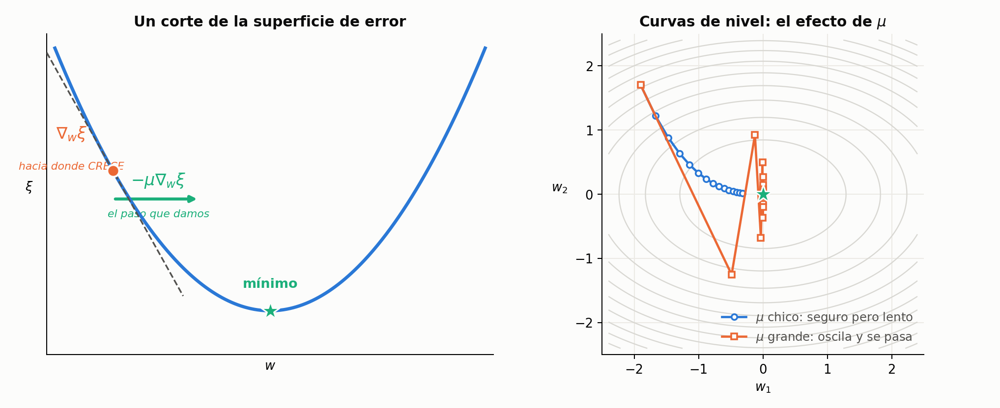
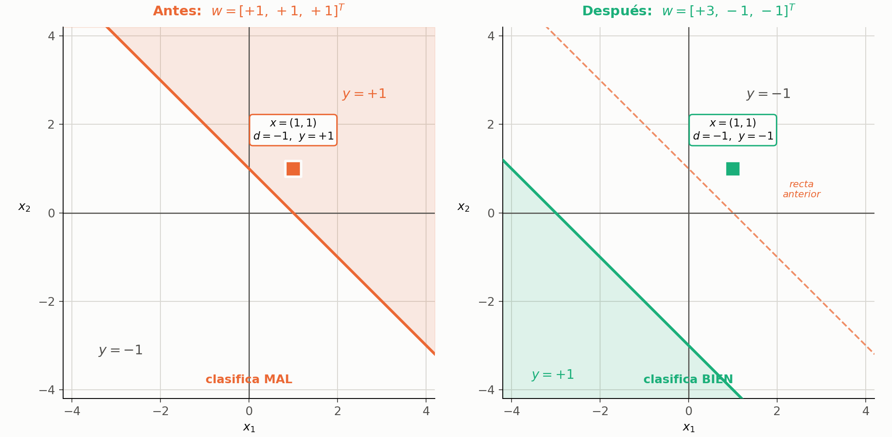

## 0. Cómo usar este apunte

El cuerpo de cada sección explica el tema. Al final de cada sección hay una **tabla de claves**: tapá el cuerpo, leé la clave de la izquierda e intentá responder lo de la derecha en voz alta.

Los recuadros **IDEA DE FONDO**, **OJO** y **PARA LA DEFENSA** son los detalles finos: lo que separa saber el procedimiento de entender el tema.

**Notación:** todos los vectores son columna, $x_0 = -1$ es la entrada de sesgo y $w_0$ el umbral, y $\langle w, x\rangle = w^{T}x$ es el producto interno.

Este apunte es la **unidad 2 del recorrido**: viene de la teoría del perceptrón simple (`01-perceptron-simple.pdf`) y desemboca en `03-xor-con-tres-neuronas.md`. Para practicar las deducciones en la pizarra, la hoja es `05-derivaciones-para-pizarra.md`, desarrollos **D1** y **D2**.

---

## 1. Por qué existe esta parte

En la parte anterior el aprendizaje se dedujo **por corrección de error**: una regla intuitiva, de sentido común — *si acertó no toques nada; si erró, movete en contra de lo que te hizo errar.*

Lo que se hace ahora es llegar **a la misma ecuación** por un camino formal: definir una función de error y minimizarla con **descenso por gradiente**.

> **PARA LA DEFENSA — no es un algoritmo nuevo**
> Es una *justificación matemática* de uno que ya tenías. Y el valor no es la elegancia: es que **ese camino formal sí generaliza** al perceptrón multicapa, donde la intuición ya no alcanza porque nadie sabe cuál debería ser la salida de una neurona oculta.

### Claves de la sección 1

| Clave | Qué tenés que poder responder |
|---|---|
| Motivo | Por qué se rehace algo que ya estaba resuelto |
| El pago | Qué habilita el camino formal que el intuitivo no |

---

## 2. La idea del gradiente

### 2.1 La superficie de error

El error es una función de los pesos, así que se lo puede pensar como una **superficie** sobre el espacio de pesos. Con dos pesos se grafica literal: eje $w_1$, eje $w_2$, y el error en vertical.

En cada punto, el **gradiente** $\nabla_w \xi$ apunta hacia donde el error **crece** más rápido. Como se busca el mínimo, hay que moverse en el **sentido opuesto**.

$$
w(n+1) = w(n) - \mu\, \nabla_w \xi\big(w(n)\big)
$$

| Término | Significado |
|---|---|
| $w(n)$, $w(n+1)$ | pesos actuales y de la iteración siguiente |
| $\nabla_w \xi$ | gradiente del error **respecto de los pesos** (vector columna, mismo tamaño que $w$) |
| $\mu$ | velocidad de aprendizaje |
| el signo $-$ | es *todo* el algoritmo: bajar en contra del gradiente |

> **OJO — el gradiente no apunta al mínimo**
> Apunta hacia donde el error **crece**. Por eso la ecuación lleva el menos. Es el error de enunciado más común en esta parte, y se nota enseguida en un oral.

### 2.2 El rol de $\mu$

- $\mu$ **grande** → pasos largos, se recorre rápido la superficie pero se corre riesgo de pasarse del mínimo y oscilar.
- $\mu$ **chico** → convergencia lenta pero estable.

El criterio que se da en clase: si la superficie es **suave**, se puede avanzar rápido; si es **escarpada o con altibajos**, hay que moverse con cuidado.

> **PARA LA DEFENSA — el compromiso, dicho bien**
> No alcanza con "más rápido o más lento". La formulación que se busca es: **con $\mu$ grande la red se aprende el último patrón que le mostraste y se olvida de todos los anteriores**, porque mueve los pesos tanto que borra el ajuste previo. Con $\mu$ chico aprende bien pero hay que mostrarle los datos muchísimas veces.

### 2.3 Por qué la figura es un paraboloide

No es una elección del dibujante. En el **caso lineal con error cuadrático** la función de error es **cuadrática en $w$**, o sea **convexa**, con **un único mínimo global**. De ahí que:

- el descenso por gradiente **converja al óptimo** con $\mu$ razonable;
- esa garantía **se pierda** en el perceptrón multicapa, donde la superficie tiene mínimos locales y mesetas. Ahí el mismo método pasa a llamarse **back-propagation**.

### Claves de la sección 2

| Clave | Qué tenés que poder responder |
|---|---|
| Superficie de error | Qué hay en cada eje y qué representa un punto |
| Gradiente | Hacia dónde apunta, y por qué eso obliga al signo menos |
| Ecuación básica | Escribirla completa |
| $\mu$ | El compromiso, en términos de qué se aprende y qué se olvida |
| Forma de la superficie | Por qué es convexa acá y por qué deja de serlo después |

---

## 3. La derivación (caso lineal)

### 3.1 El criterio de error instantáneo

$$
e^2(n) = \big[d(n) - y(n)\big]^2 = \big[d(n) - \langle w(n), x(n)\rangle\big]^2
$$

Dos cosas para notar:

1. **Error cuadrático**: penaliza la magnitud de la diferencia y no su signo.
2. **Se reemplazó $y$ por el producto interno**: se pasó de $y = \varphi(\langle w,x\rangle)$ a $y = \langle w,x\rangle$. Es decir, **se eliminó la función de activación**.

> **OJO — la simplificación que hay que declarar en voz alta**
> Se está analizando un **caso lineal**: la activación es la identidad, no $\mathrm{sgn}$ ni una sigmoide. En clase se lo remarca dos veces, y no es un detalle técnico — es lo que hace que la derivada salga limpia, porque $\mathrm{sgn}$ ni siquiera es derivable. Si arrancás la deducción sin aclararlo, la primera repregunta va a ser justamente ésa.

### 3.2 La derivada

Hay que calcular $\nabla_w e^2(n)$, o sea derivar **respecto de $w$**.

> **OJO — acá la variable es $w$**
> **$x(n)$ y $d(n)$ son constantes.** No se deriva respecto de $x$ como en Matemática. Es donde se traba la mitad del curso.

Regla de la cadena sobre el cuadrado:

$$
\nabla_w e^2(n) = 2\big[d(n) - \langle w(n),x(n)\rangle\big] \cdot \nabla_w\big(d(n) - \langle w(n),x(n)\rangle\big)
$$

El paréntesis interior: $d(n)$ es constante y deriva a cero; $\langle w,x\rangle = \sum_i w_i x_i$ deriva a $x$. Con el menos que lo precede:

$$
\nabla_w e^2(n) = 2\,e(n)\,\big(-x(n)\big)
$$

### 3.3 Reemplazo en la ecuación del gradiente

$$
\boxed{\;w(n+1) = w(n) + 2\mu\, e(n)\, x(n)\;}
$$

El menos del descenso se cancela con el menos de $-x(n)$: por eso la actualización queda **sumando**.

> **IDEA DE FONDO — la lectura geométrica**
> $e(n)$ es un escalar y $x(n)$ un vector columna, así que la corrección $2\mu\,e(n)\,x(n)$ es un vector **en la dirección del patrón de entrada**, con magnitud proporcional al error y signo según si la salida se quedó corta o larga. Cada paso empuja a $w$ a lo largo de $x$.
> Guardá esa forma —constante $\times$ error $\times$ entrada—: es la **misma estructura** que va a tener back-propagation.

### Claves de la sección 3

| Clave | Qué tenés que poder responder |
|---|---|
| Criterio | Escribir $e^2(n)$ y decir qué se simplificó |
| Respecto de qué | Qué es variable y qué es constante al derivar |
| El desarrollo | Los dos pasos de la regla de la cadena |
| El resultado | Por qué la actualización queda sumando |
| Lectura geométrica | En qué dirección se mueve $w$ y con qué magnitud |

---

## 4. Equivalencia con la regla intuitiva

La regla obtenida en la parte anterior era:

$$
w(n+1) = w(n) + \frac{\eta}{2}\big[y_d(n) - y(n)\big]\,x(n)
$$

y la nueva es $w(n+1) = w(n) + 2\mu\,e(n)\,x(n)$. Son **idénticas** si

$$
\frac{\eta}{2} = 2\mu \quad\Longleftrightarrow\quad \eta = 4\mu
$$

La constante la elegís vos, así que el número no es el punto: lo relevante es que **la forma de la ecuación es la misma**. Eso es lo que había que demostrar.

> **IDEA DE FONDO — de dónde sale el $\tfrac{1}{2}$**
> Con activación $\mathrm{sgn}$ las salidas son $\pm 1$, así que $e = d - y$ sólo puede valer $0$, $+2$ o $-2$. Entonces $\tfrac{\eta}{2}e \in \{0, +\eta, -\eta\}$, y la regla se lee: *si acertó no toques nada; si erró, sumá o restá $\eta x$.* **El $\tfrac{1}{2}$ está puesto para normalizar ese factor 2** de las salidas bipolares.

Esta regla, en su versión lineal, es el **LMS** (*least mean squares*), también llamado **regla delta** o **Widrow-Hoff**.

### 4.1 Pero no son el mismo algoritmo

Se parecen tanto que es fácil creer que son lo mismo. La diferencia está en **qué entra en el error**:

| | Qué es $y$ | Tamaño de la corrección |
|---|---|---|
| **Regla del perceptrón** | la salida **después** de $\mathrm{sgn}$ | siempre la misma, o nula |
| **LMS (caso lineal)** | la activación lineal, **sin** pasar por $\varphi$ | proporcional a cuán equivocada estuvo |

> **PARA LA DEFENSA — la consecuencia que importa**
> Mirá la franja marcada en el gráfico: entre $v=0$ y $v=1$ **el signo ya es correcto**, así que la regla del perceptrón deja de corregir — pero el LMS sigue, porque el valor todavía está lejos.
> De ahí sale la diferencia real: **si los datos no son linealmente separables, la regla del perceptrón no converge nunca**, mientras que el LMS igual converge a la solución de mínimo error cuadrático.
> Por eso Milone insiste con el aviso de *"estamos analizando un caso lineal donde hemos obviado la existencia de la función de activación"*: no es un tecnicismo, es lo que distingue los dos algoritmos.

> **IDEA DE FONDO — gradiente instantáneo, no del error total**
> Se minimiza $e^2(n)$, el error de **un** patrón, no el promedio sobre el conjunto. Es una aproximación ruidosa del gradiente verdadero: cada ejemplo tira para su lado. Por eso conviene $\mu$ chico, para que el promedio de muchos pasitos aproxime el descenso real. Es la diferencia entre entrenamiento **estocástico** (o por patrón) y **por lote**.

### Claves de la sección 4

| Clave | Qué tenés que poder responder |
|---|---|
| La equivalencia | Igualar las constantes y decir por qué el número no importa |
| El $\tfrac{1}{2}$ | Qué normaliza y de dónde viene ese 2 |
| Nombres | LMS, regla delta, Widrow-Hoff |
| La diferencia real | Qué entra en el error en cada regla |
| No separables | Cuál converge y cuál no, y por qué |
| Instantáneo | Qué se minimiza exactamente y qué implica para $\mu$ |

---

## 5. Ejemplo numérico

**Estado inicial**, tal como está en el apunte de cátedra:

$$
w(n) = \begin{bmatrix} +1 \\ +1 \\ +1 \end{bmatrix},
\qquad
x(n) = \begin{bmatrix} -1 \\ +1 \\ +1 \end{bmatrix},
\qquad d(n) = -1
$$

Recordá que $x_0 = -1$ es la entrada de sesgo: las entradas reales del patrón son $x_1 = +1$ y $x_2 = +1$.

**Paso 1 — salida actual:**

$$
\langle w,x\rangle = \begin{bmatrix} +1 & +1 & +1 \end{bmatrix}\begin{bmatrix} -1 \\ +1 \\ +1 \end{bmatrix} = -1 + 1 + 1 = +1
\;\Longrightarrow\; y = \mathrm{sgn}(+1) = +1
$$

Deseada $-1$, obtenida $+1$: hay error.

**Paso 2 — error:** $e = d - y = -1 - (+1) = -2$

**Paso 3 — actualización**, con $\mu = \tfrac{1}{2}$, o sea $2\mu = 1$:

$$
w(n+1) = \begin{bmatrix} +1 \\ +1 \\ +1 \end{bmatrix} + 1\cdot(-2)\begin{bmatrix} -1 \\ +1 \\ +1 \end{bmatrix}
= \begin{bmatrix} +1 \\ +1 \\ +1 \end{bmatrix} + \begin{bmatrix} +2 \\ -2 \\ -2 \end{bmatrix}
= \begin{bmatrix} +3 \\ -1 \\ -1 \end{bmatrix}
$$

**Paso 4 — verificación** con el mismo patrón:

$$
\langle w,x\rangle = \begin{bmatrix} +3 & -1 & -1 \end{bmatrix}\begin{bmatrix} -1 \\ +1 \\ +1 \end{bmatrix} = -3 - 1 - 1 = -5
\;\Longrightarrow\; y = -1 = d
$$

Error cero: **la neurona aprendió ese ejemplo en una sola iteración.**

### 5.1 Qué le pasó a la recta

Vale la pena mirar el ejemplo en el plano y no sólo en los números.

Antes, la frontera era $x_1 + x_2 = 1$ y el semiplano positivo estaba **arriba a la derecha**, que es donde cae el patrón — por eso daba $+1$ cuando tenía que dar $-1$. Después, la frontera pasó a $x_1 + x_2 = -3$ y el semiplano positivo quedó **abajo a la izquierda**.

> **OJO — la recta no se corrigió: se dio vuelta y se fue lejos**
> No sólo se desplazó: **el lado positivo cambió de lugar**. Y es esperable, porque $\mu = \tfrac{1}{2}$ es enorme para un ejemplo con entradas de módulo 1.
> Con un solo patrón no se nota el problema —quedó bien clasificado—, pero **si hubiera un archivo de entrenamiento, este paso habría roto casi todo lo aprendido antes**. Es exactamente el fenómeno del recuadro de la sección 2.2, ahora con números: *$\mu$ grande = la red se aprende el último y se olvida el resto.*
> El ejemplo usa $\mu$ grande **para que la cuenta dé redonda en el pizarrón**, no porque sea un buen valor.

> **OJO — el ejemplo mezcla dos casos**
> La fórmula se dedujo asumiendo salida **lineal**, pero en el ejemplo se aplica $\mathrm{sgn}$. Es un atajo didáctico. Si te lo preguntan: para el caso no lineal hay que derivar también $\varphi$, y por regla de la cadena aparece el factor $\varphi'(\langle w,x\rangle)$ — que es justamente lo que da lugar al término de **sensibilidad local** en back-propagation.

### Claves de la sección 5

| Clave | Qué tenés que poder responder |
|---|---|
| El cálculo | Rehacer los cuatro pasos sin mirar |
| El sesgo | Por qué $x_0=-1$ y cuánto aporta al producto interno |
| En el plano | Dónde quedó la recta antes y después, y de qué lado el $+1$ |
| $\mu$ del ejemplo | Por qué es grande y qué habría pasado con más patrones |
| La inconsistencia | Dónde se mezcla el caso lineal con $\mathrm{sgn}$ |

---

## 6. Del ejemplo al entrenamiento real

Un ejemplo se corrige de una. Con 50 o 100 patrones no se puede corregir a fondo por cada uno: arreglás uno y rompés otro. De ahí las tres decisiones prácticas:

1. **$\mu$ pequeño**, para que la red aprenda "un poquito de cada uno".
2. **Múltiples pasadas (épocas)** sobre todo el archivo de entrenamiento.
3. **Criterio de finalización**: que no se equivoque en ningún caso o en la menor cantidad posible; o error bajo un umbral; o máximo de épocas.

### El algoritmo completo

1. **Inicialización al azar**: $w(1) \in [-0.5,\ 0.5]$.
2. Para cada ejemplo $x(n)\,|\,d(n)$:
   - obtener la salida: $y(n) = \varphi\big(\langle w(n), x(n)\rangle\big)$
   - adaptar los pesos: $w(n+1) = w(n) + 2\mu\, e(n)\, x(n)$
3. Volver a 2 hasta satisfacer el criterio de finalización.

> **OJO — por qué la inicialización es chica y al azar**
> **Chica**, porque valores grandes saturarían una activación sigmoide: en la zona plana la derivada es casi cero y la red no aprende. **Al azar**, porque si todos los pesos arrancaran iguales, todas las neuronas de una capa calcularían lo mismo y se moverían juntas para siempre — no habría forma de que se especializaran. Con una sola neurona no se nota; con una red, es la diferencia entre aprender y no.

### Claves de la sección 6

| Clave | Qué tenés que poder responder |
|---|---|
| $\mu$ chico | Por qué con muchos patrones no se puede corregir a fondo |
| Épocas | Qué es una y por qué hacen falta varias |
| Finalización | Tres criterios posibles |
| Inicialización | Por qué chica y por qué al azar (dos motivos distintos) |

---

## 7. El límite: el problema del XOR

Con las clases dispuestas en diagonal, se prueba a mano dónde poner la recta: inclinándola, desplazándola con el sesgo — **siempre queda mal clasificado al menos uno**.

La razón de fondo: el perceptrón simple genera una **frontera de decisión lineal**, $\langle w,x\rangle = 0$, que es un hiperplano. Sólo puede resolver problemas **linealmente separables**, y el XOR no lo es.

> **PARA LA DEFENSA — el síntoma no es la causa**
> No es un problema de aprendizaje, ni de elegir bien $\mu$, ni de darle más épocas. El algoritmo funciona perfecto: es una **limitación estructural del modelo**. **No existe** ningún $w$ que resuelva el problema.
> El OR y el AND sí son linealmente separables y el perceptrón los resuelve. El XOR no.

La salida es agregar capas: con neuronas ocultas se componen varias fronteras lineales y se obtienen regiones no convexas. Eso es el **perceptrón multicapa**, y entrenarlo requiere exactamente este método extendido con la regla de la cadena a través de las capas: **back-propagation**.

Sigue en `03-xor-con-tres-neuronas.md`.

### Claves de la sección 7

| Clave | Qué tenés que poder responder |
|---|---|
| La prueba | Por qué mover o inclinar la recta no alcanza |
| La causa | Qué forma tiene la frontera y qué implica |
| Qué sí resuelve | OR y AND, y por qué |
| La salida | Qué se agrega y qué hace falta para entrenarlo |

---

## Formulario

| Expresión | Qué es |
|---|---|
| $y = \varphi\big(\langle w, x\rangle\big)$ | salida del perceptrón, con $x_0=-1$ |
| $\langle w, x\rangle = 0$ | frontera de decisión (recta / hiperplano) |
| $e(n) = d(n) - y(n)$ | error instantáneo |
| $e^2(n) = \big[d(n) - \langle w,x\rangle\big]^2$ | criterio de costo (caso lineal) |
| $\nabla_w e^2(n) = 2\,e(n)\,(-x(n))$ | gradiente del error |
| $w(n+1) = w(n) - \mu\,\nabla_w \xi$ | ecuación básica del gradiente |
| $w(n+1) = w(n) + 2\mu\, e(n)\, x(n)$ | **la regla LMS** |
| $\eta = 4\mu$ | equivalencia con la regla por corrección de error |

## Errores típicos

- Decir que el gradiente apunta al mínimo. Apunta a donde el error **crece**.
- Derivar respecto de $x$. La variable es $w$; $x$ y $d$ son constantes.
- Dejar el signo menos en la regla final. Se cancela con el $-x$.
- Deducir sin aclarar que es el **caso lineal**, sin función de activación.
- Confundir la regla del perceptrón con el LMS. La diferencia es qué entra en el error, y decide si converge o no en datos no separables.
- Explicar $\mu$ sólo como "rápido o lento", sin el olvido de lo aprendido.
- Creer que $\mu = \tfrac{1}{2}$ del ejemplo es un valor razonable. Está elegido para que la cuenta dé redonda.
- Decir que el perceptrón "no aprende" el XOR. **No existe solución**; no es que no la encuentre.

## Autoevaluación

1. Dibujá la superficie de error y explicá por qué la ecuación lleva un signo menos.
2. Deducí $\nabla_w e^2(n)$ paso a paso, aclarando qué es constante y qué variable.
3. Mostrá que la regla del gradiente y la de corrección de error son la misma. ¿De dónde sale el $\tfrac{1}{2}$?
4. ¿En qué se diferencian de verdad el LMS y la regla del perceptrón? ¿Cuál converge con datos no separables?
5. Rehacé el ejemplo numérico completo y dibujá la recta antes y después.
6. ¿Qué habría pasado en ese ejemplo si hubiera más patrones de entrenamiento?
7. Dos motivos distintos por los que los pesos se inicializan chicos y al azar.
8. ¿Por qué la superficie de error es convexa acá y deja de serlo en el multicapa?
9. Explicá por qué el XOR no es un problema de entrenamiento.
