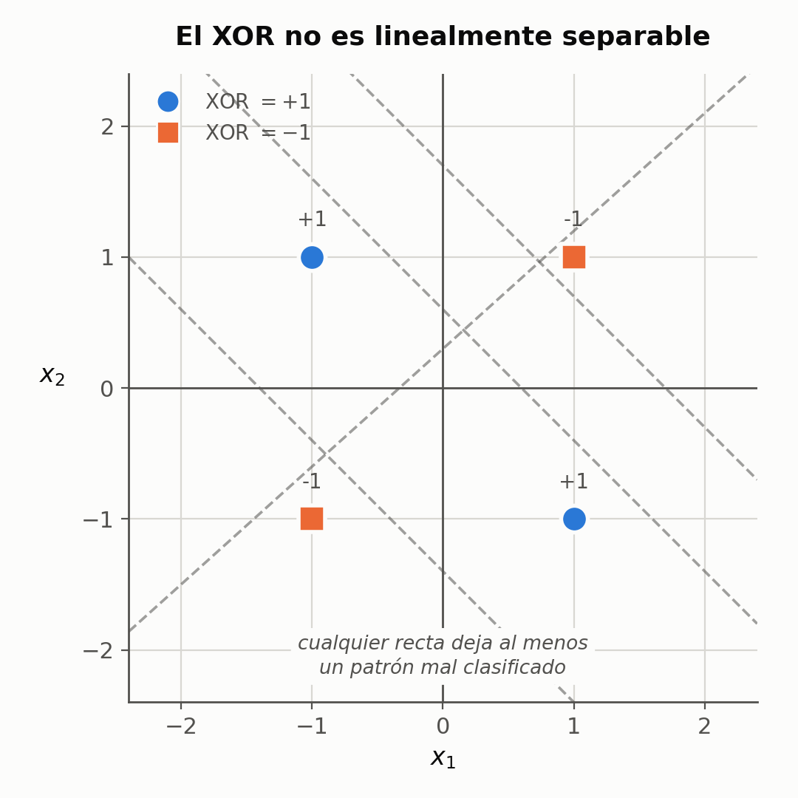
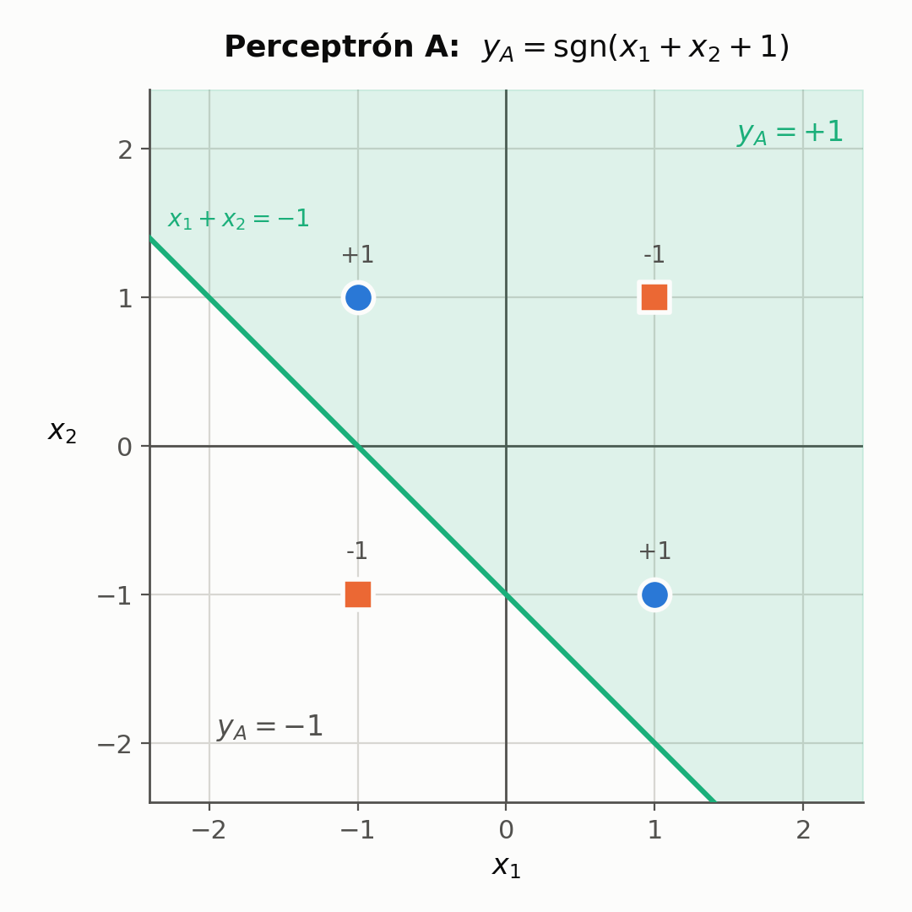
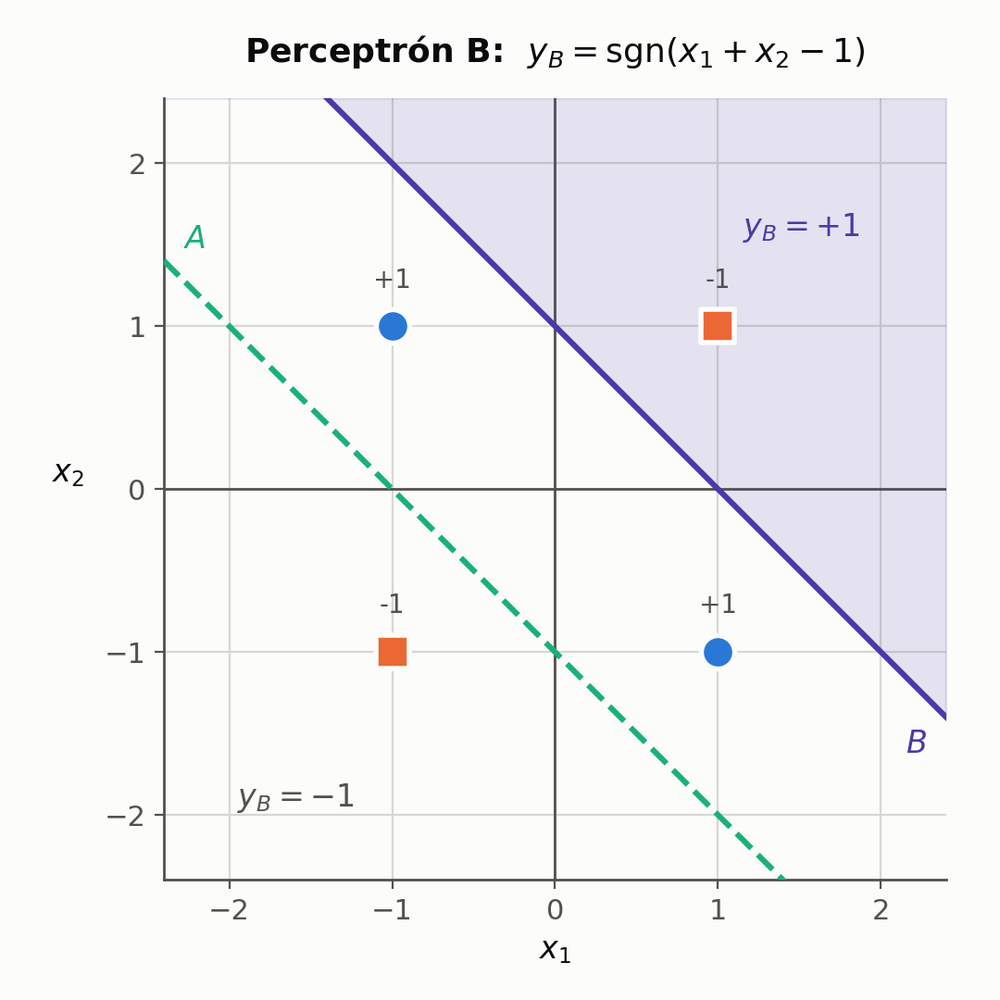
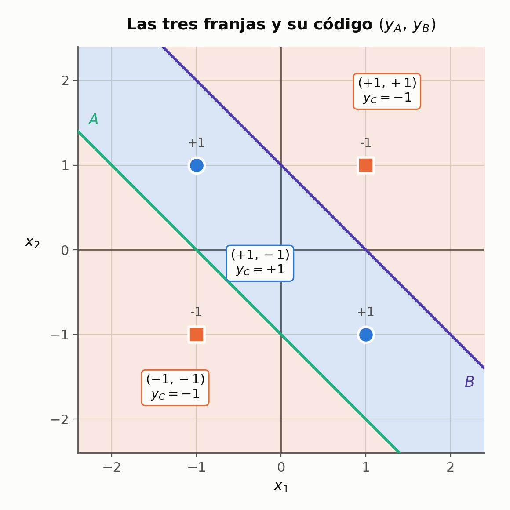
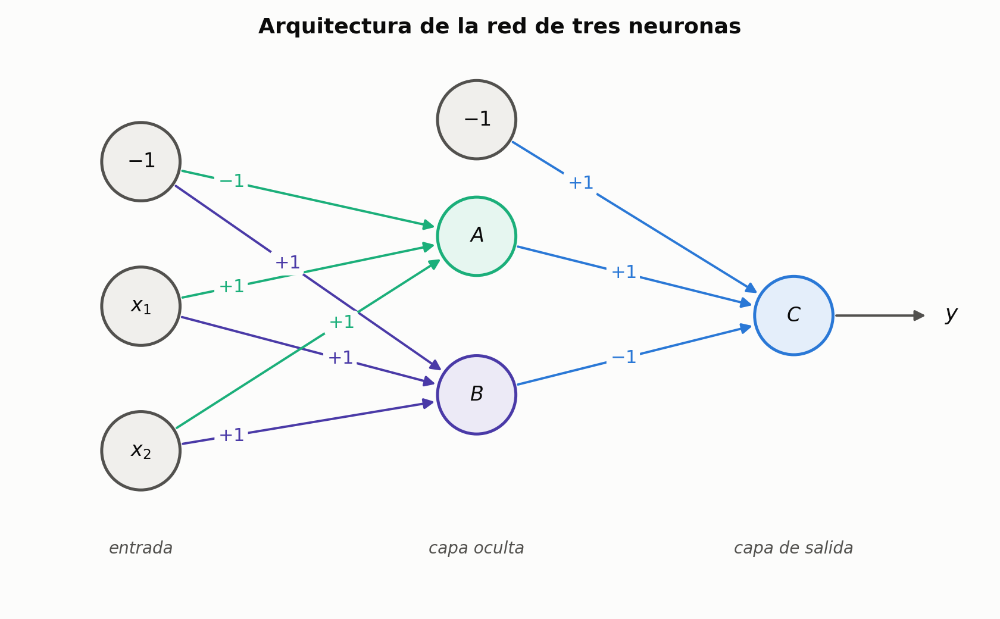

---

## 0. Cómo usar este apunte

El cuerpo de cada sección explica el tema. Al final de cada sección hay una **tabla de claves**: tapá el cuerpo, leé la clave de la izquierda e intentá responder lo de la derecha en voz alta. Ése es el modo de repaso; la primera lectura es corrida.

Los recuadros marcados **IDEA DE FONDO**, **OJO** y **PARA LA DEFENSA** son los detalles finos: lo que separa saber el procedimiento de entender el tema.

Convención de notación, igual que en el apunte anterior: **todos los vectores son columna**, $x_0 = -1$ es la entrada de sesgo y $w_0$ el umbral, y $\langle w, x\rangle = w^{T}x$ es el producto interno.

El recorrido es: *el XOR no se puede* → *partir el plano con dos rectas* → *traducir cada recta a pesos* → *conectar todo en una red* → *verificar*.

---

## 1. El punto de partida: el XOR no se puede

La unidad anterior terminó con una pregunta abierta: *¿el perceptrón simple puede resolver esto?*

Con codificación bipolar, la función **o exclusivo** es:

| $x_1$ | $x_2$ | XOR |
|:---:|:---:|:---:|
| $-1$ | $-1$ | $-1$ |
| $-1$ | $+1$ | $+1$ |
| $+1$ | $-1$ | $+1$ |
| $+1$ | $+1$ | $-1$ |



En clase se prueba a mano: se pasa la recta por un lado y "nos queda todo un plano mezclando zonas"; se la desplaza con el sesgo y pasa lo mismo; se la inclina y pasa lo mismo. **Donde sea que se ubique la recta queda al menos un patrón mal clasificado.**

La razón es estructural, no de entrenamiento: un perceptrón simple decide con $\langle w,x\rangle = 0$, que es una **recta** (un hiperplano en general), y por lo tanto sólo resuelve problemas **linealmente separables**. El XOR no lo es.

> **OJO — no confundir el síntoma con la causa**
> No es que el algoritmo de aprendizaje "no converge por mala suerte" o porque falte ajustar $\mu$. Es que **no existe** ningún vector $w$ que resuelva el problema. Ninguna cantidad de épocas lo va a encontrar.

### Claves de la sección 1

| Clave | Qué tenés que poder responder |
|---|---|
| Codificación | Por qué las salidas son $\pm 1$ y no $\{0,1\}$ |
| Prueba geométrica | Por qué mover o inclinar la recta no alcanza |
| Frontera de decisión | Qué ecuación la define y qué forma tiene |
| Causa del fallo | Por qué es limitación del modelo y no del entrenamiento |

---

## 2. La idea: partir el plano con más de una recta

La propuesta es **juntar más de un perceptrón** para "partir el plano de una manera un poco más inteligente". Con tres alcanza:

- **dos perceptrones** definen cada uno un semiplano;
- **un tercero** se queda con la zona donde esos semiplanos se intersecan.

El objetivo es que en esa zona intermedia queden **adentro los dos casos verdaderos** y **afuera los dos falsos**.

La observación clave de la geometría del XOR: los dos patrones que dan $+1$ están sobre la diagonal $x_1 + x_2 = 0$, y los dos que dan $-1$ están uno a cada lado ($x_1+x_2 = +2$ y $x_1+x_2 = -2$). Entonces alcanza con **dos rectas paralelas de pendiente $-1$**, una a cada lado de esa diagonal, que dejen la diagonal encerrada en el medio.

### Claves de la sección 2

| Clave | Qué tenés que poder responder |
|---|---|
| Estrategia | Qué hace cada uno de los tres perceptrones |
| Por qué paralelas | Dónde están los patrones $+1$ y los $-1$ respecto de $x_1+x_2$ |
| Franja | Qué tiene que quedar adentro y qué afuera |

---

## 3. De la recta a los pesos: la fórmula que se usa tres veces

Ubicar las rectas en el dibujo es la parte fácil. Lo que sigue es el paso operativo: **traducir cada recta a pesos sinápticos**, porque los pesos son lo único que existe en la red.

La frontera de decisión es $\langle w, x\rangle = 0$. Con la entrada extendida $x_0 = -1$:

$$
w_0(-1) + w_1 x_1 + w_2 x_2 = 0
\qquad\Longrightarrow\qquad
\boxed{\;x_2 = \frac{w_0}{w_2} \;-\; \frac{w_1}{w_2}\,x_1\;}
$$

Leído como $x_2 = b + m\,x_1$:

$$
\text{ordenada al origen } b = \frac{w_0}{w_2}
\qquad\qquad
\text{pendiente } m = -\frac{w_1}{w_2}
$$

Ése es todo el método: se lee del gráfico la ordenada al origen y la pendiente que se necesita, se plantean esos dos cocientes, y se elige cualquier terna que los cumpla.

> **IDEA DE FONDO — los pesos no son únicos, y eso importa**
> Fijate qué aparece en las dos ecuaciones: **sólo cocientes**. Hay **dos condiciones y tres incógnitas**, así que queda un grado de libertad — la **escala** del vector. En clase se dice: *"cualquier combinación de pesos que nos dé como resultado esa recta va a ser válida... podría haber muchas combinaciones"*, y se elige una en particular por comodidad.
>
> Verificado numéricamente con los pesos de A escalados:
>
> ```
>   factor   1.0: pesos [-1.  1.  1.]  ->  yA = [-1, 1, 1, 1]
>   factor   7.0: pesos [-7.  7.  7.]  ->  yA = [-1, 1, 1, 1]
>   factor  0.25: pesos [-0.25  0.25  0.25]  ->  yA = [-1, 1, 1, 1]
> ```
>
> Esto **conecta hacia atrás** con la unidad anterior: explica por qué dos entrenamientos con inicializaciones aleatorias distintas terminan en vectores de pesos distintos y ambos correctos. La solución no es un punto, es toda una **familia de vectores**.

> **OJO — la precisión que falta en "cualquier combinación"**
> Vale para cualquier múltiplo **positivo**. Con un factor **negativo** la recta es exactamente la misma, pero la neurona clasifica al revés: el semiplano que daba $+1$ pasa a dar $-1$.
>
> ```
>   factor   1.0: pesos [-1.  1.  1.]  ->  yA = [-1,  1,  1,  1]
>   factor  -1.0: pesos [ 1. -1. -1.]  ->  yA = [ 1, -1, -1, -1]
> ```
>
> O sea: **la recta fija la dirección de $w$, y el signo fija de qué lado está el $+1$.** El vector de pesos no sólo define la frontera: define además hacia dónde apunta la clase positiva. Si en un parcial te dan una recta y te piden los pesos, tenés que decidir también el sentido.

> **IDEA DE FONDO — la escala es irrelevante ahora, pero no siempre**
> Con $\mathrm{sgn}$, multiplicar $w$ por $7$ no cambia nada porque sólo importa el signo. Con una **sigmoide** sí cambia: $\|w\|$ grande hace la transición abrupta (se parece al signo) y $\|w\|$ chico la hace suave. Ese grado de libertad que acá parece un detalle se convierte en un parámetro real en cuanto se cambia la función de activación — que es lo que pasa en back-propagation.

### Claves de la sección 3

| Clave | Qué tenés que poder responder |
|---|---|
| Fórmula | Deducir $x_2 = \frac{w_0}{w_2} - \frac{w_1}{w_2}x_1$ desde $\langle w,x\rangle=0$ |
| $b$ y $m$ | Qué cociente da la ordenada y cuál la pendiente |
| No unicidad | Cuántas condiciones, cuántas incógnitas, qué queda libre |
| Signo | Qué cambia al multiplicar $w$ por un número negativo |
| Escala | Por qué no importa con $\mathrm{sgn}$ y sí con una sigmoide |

---

## 4. Perceptrón A



Del gráfico se lee la recta que se necesita: **pendiente $-1$**, y **cuando $x_1 = 0$ vale $x_2 = -1$**.

En palabras, lo que hace esta neurona es tan simple como: **suma las dos entradas, le agrega $1$, y devuelve el signo**.

Notá que el semiplano sombreado incluye a $(+1,+1)$, que debería dar $-1$: A sola se equivoca en ese patrón.

Aplicando la fórmula de la sección 3:

$$
\frac{w_{A0}}{w_{A2}} = -1
\qquad\qquad
-\frac{w_{A1}}{w_{A2}} = -1 \;\Longrightarrow\; \frac{w_{A1}}{w_{A2}} = +1
$$

Eligiendo $w_{A2} = +1$:

$$
w_A = \begin{bmatrix} -1 \\ +1 \\ +1 \end{bmatrix}
\qquad\Longrightarrow\qquad
y_A = \mathrm{sgn}\big(\langle w_A, x\rangle\big) = \mathrm{sgn}(x_1 + x_2 + 1)
$$

| $(x_1,x_2)$ | $x_1+x_2+1$ | $y_A$ |
|:---:|:---:|:---:|
| $(-1,-1)$ | $-1$ | $-1$ |
| $(-1,+1)$ | $+1$ | $+1$ |
| $(+1,-1)$ | $+1$ | $+1$ |
| $(+1,+1)$ | $+3$ | $+1$ |

> **OJO — A solo no resuelve nada**
> Milone lo remarca explícitamente: el perceptrón A da $+1$ también para $(+1,+1)$, que debería dar $-1$. Es **"una fase, una parte de la resolución del problema"**. Ninguna neurona oculta resuelve el problema por sí sola; lo resuelven en conjunto. Si en la defensa te preguntan "¿qué aprende la neurona oculta?", la respuesta no es "media función XOR" sino "una pregunta binaria sobre la entrada".

### Claves de la sección 4

| Clave | Qué tenés que poder responder |
|---|---|
| Lectura del gráfico | Qué ordenada y qué pendiente se necesitan |
| $w_A$ | Los tres pesos y de qué cocientes salen |
| En palabras | Qué operación hace la neurona A |
| Insuficiencia | Qué patrón clasifica mal A por sí solo |

---

## 5. Perceptrón B



Misma dinámica. La recta que se necesita tiene otra vez **pendiente $-1$**, pero ahora **cuando $x_1 = 0$ vale $x_2 = +1$**.

En palabras: **suma las dos entradas, les resta $1$, y devuelve el signo.** Ahora el único patrón dentro del semiplano positivo es $(+1,+1)$.

Planteando los cocientes:

$$
\frac{w_{B0}}{w_{B2}} = +1
\qquad\qquad
\frac{w_{B1}}{w_{B2}} = +1
\qquad\Longrightarrow\qquad
w_B = \begin{bmatrix} +1 \\ +1 \\ +1 \end{bmatrix}
$$

$$
y_B = \mathrm{sgn}(x_1 + x_2 - 1)
$$

| $(x_1,x_2)$ | $x_1+x_2-1$ | $y_B$ |
|:---:|:---:|:---:|
| $(-1,-1)$ | $-3$ | $-1$ |
| $(-1,+1)$ | $-1$ | $-1$ |
| $(+1,-1)$ | $-1$ | $-1$ |
| $(+1,+1)$ | $+1$ | $+1$ |

> **IDEA DE FONDO — el sesgo es lo único que cambia**
> $w_A$ y $w_B$ tienen **idénticos $w_1$ y $w_2$** y difieren **solamente en $w_0$**. Los pesos de las entradas fijan la *orientación* de la recta; el sesgo fija su *corrimiento*. Dos neuronas con la misma orientación y distinto sesgo generan una franja — y eso es exactamente lo que hace falta acá.
> Es el argumento más directo de por qué sin sesgo entrenable esta construcción sería imposible: sin $w_0$ ambas rectas pasarían por el origen, serían la misma recta, y no habría franja.

### Claves de la sección 5

| Clave | Qué tenés que poder responder |
|---|---|
| $w_B$ | Los tres pesos y en qué se diferencia de $w_A$ |
| Rol de $w_0$ | Qué controla el sesgo frente a $w_1, w_2$ |
| Sin sesgo | Por qué la construcción se caería |
| Verificación | Qué patrón es el único con $y_B = +1$ |

---

## 6. El plano queda partido en tres franjas



Como las dos rectas son paralelas y B está por encima de A, el plano queda dividido en **tres bandas**, y cada banda tiene un **código** $(y_A, y_B)$.

Lo notable es la banda del medio: contiene **los dos patrones que deben dar $+1$**, y ninguno de los que deben dar $-1$. Ésa es la zona que el tercer perceptrón tiene que reconocer.

Fijate también que dos patrones distintos —$(-1,+1)$ y $(+1,-1)$— comparten el mismo código. La capa oculta los volvió indistinguibles, y está bien: la función pide lo mismo para los dos.

| Región | $y_A$ | $y_B$ | Patrón que cae ahí | $y_C$ deseada |
|---|:---:|:---:|---|:---:|
| arriba de ambas | $+1$ | $+1$ | $(+1,+1)$ | $-1$ |
| **franja intermedia** | $+1$ | $-1$ | $(-1,+1)$ y $(+1,-1)$ | $+1$ |
| abajo de ambas | $-1$ | $-1$ | $(-1,-1)$ | $-1$ |
| — | $-1$ | $+1$ | **nunca ocurre** | X |

### Claves de la sección 6

| Clave | Qué tenés que poder responder |
|---|---|
| Tres franjas | Cuáles son y qué código tiene cada una |
| Franja intermedia | Qué dos patrones caen ahí y por qué es la que importa |
| Codificación | Qué significa que dos patrones distintos compartan código |

---

## 7. La tabla de verdad del perceptrón C y el *don't care*

Ahora se cambia de espacio: **las entradas del tercer perceptrón ya no son $x_1, x_2$ sino $y_A, y_B$.** La tabla de verdad que hay que cumplir es:

| $y_A$ | $y_B$ | $y_C$ |
|:---:|:---:|:---:|
| $-1$ | $-1$ | $-1$ |
| $-1$ | $+1$ | **X** |
| $+1$ | $-1$ | $+1$ |
| $+1$ | $+1$ | $-1$ |

> **IDEA DE FONDO — por qué hay una X en la tabla**
> La combinación $y_A = -1$ con $y_B = +1$ significaría "estoy **debajo** de la recta A pero **encima** de la recta B". Como las rectas son paralelas y B está por arriba de A, esa región **no existe**: *"nunca se forman regiones con esa intersección"*. Por eso en la tabla va una **X — don't care**: la salida de C en ese caso es irrelevante, nunca se va a evaluar.
> Consecuencia contable: de $2^2 = 4$ códigos posibles, la capa oculta genera **sólo 3**.

> **IDEA DE FONDO — la capa oculta cambia la representación**
> Éste es *el* concepto de toda la clase. El problema sigue siendo linealmente inseparable en el plano $(x_1, x_2)$ y siempre lo va a ser. Lo que pasa es que en el plano $(y_A, y_B)$ **los tres puntos alcanzables sí son linealmente separables**, y ahí un perceptrón simple común y corriente lo termina.
> La capa oculta no agrega "potencia de cálculo": cada neurona responde una pregunta binaria sobre la entrada ("¿estoy arriba de esta recta?"), y el vector de esas respuestas es una **nueva codificación** del patrón — una en la que el problema ya es fácil.

### Claves de la sección 7

| Clave | Qué tenés que poder responder |
|---|---|
| Cambio de espacio | Cuáles son las entradas de C |
| Tabla de verdad | Las cuatro filas, incluida la X |
| Don't care | Por qué esa combinación es geométricamente imposible |
| Separabilidad | Por qué el problema sí se resuelve en el plano oculto |

---

## 8. Perceptrón C

Se aplica por tercera vez la misma fórmula, pero ahora en el **plano oculto**. En el apunte de cátedra este plano se dibuja con **$y_B$ en el eje horizontal y $y_A$ en el vertical**, y la recta se escribe como:

$$
y_A = +1 + y_B
$$

es decir, ordenada al origen $+1$ y pendiente $+1$:

$$
\frac{w_{C0}}{w_{C2}} = +1
\qquad\qquad
-\frac{w_{C1}}{w_{C2}} = +1
\qquad\Longrightarrow\qquad
w_C = \begin{bmatrix} +1 \\ -1 \\ +1 \end{bmatrix}
$$

$$
y_C = \mathrm{sgn}(y_A - y_B - 1)
$$


En palabras: **toma la salida de A, le resta la salida de B, le resta $1$, y devuelve el signo.**

Éste ya no es el plano de las entradas: cada eje es la salida de una neurona oculta. Por eso el problema cambió de forma sin que cambiara la función que hay que aprender.

| $y_A$ | $y_B$ | $y_A - y_B - 1$ | $y_C$ | ¿coincide con la tabla? |
|:---:|:---:|:---:|:---:|:---:|
| $+1$ | $-1$ | $+1$ | $+1$ | sí |
| $+1$ | $+1$ | $-1$ | $-1$ | sí |
| $-1$ | $-1$ | $-1$ | $-1$ | sí |
| $-1$ | $+1$ | $-3$ | $-1$ | *don't care* |

> **OJO — el orden de los subíndices de $w_C$ es una trampa**
> En el apunte de cátedra, $w_{C1}$ y $w_{C2}$ están numerados según los **ejes del gráfico del plano oculto**, donde el eje "1" (horizontal) es $y_B$ y el eje "2" (vertical) es $y_A$. Por eso aparece $w_{C1} = -1$ y $w_{C2} = +1$ y sin embargo la ecuación queda $y_C = \mathrm{sgn}(y_A - y_B - 1)$: el $-1$ le corresponde a **$y_B$**, no a $y_A$.
> En el diagrama de la red, en cambio, la lectura es la natural y sin ambigüedad: **la conexión A→C pesa $+1$ y la conexión B→C pesa $-1$**. Si te confundís, guiate por el diagrama de la red, no por los subíndices.

### Claves de la sección 8

| Clave | Qué tenés que poder responder |
|---|---|
| Recta de C | Ordenada y pendiente, y en qué plano vive |
| $w_C$ | Los tres pesos y de qué cocientes salen |
| En palabras | Qué operación hace la neurona C |
| Subíndices | Por qué $w_{C1}=-1$ corresponde a $y_B$ |

---

## 9. La arquitectura completa

Con los tres vectores de pesos ya se puede dibujar la red entera:



Las conexiones, una por una:

| Conexión | Peso | | Conexión | Peso |
|---|:---:|---|---|:---:|
| $x_1 \to A$ | $+1$ | | $x_1 \to B$ | $+1$ |
| $x_2 \to A$ | $+1$ | | $x_2 \to B$ | $+1$ |
| $x_0 \to A$ | $-1$ | | $x_0 \to B$ | $+1$ |
| $A \to C$ | $+1$ | | $B \to C$ | $-1$ |
| $x_0 \to C$ | $+1$ | | | |

Y la función completa que calcula la red es:

$$
\left.
\begin{aligned}
y_A &= \mathrm{sgn}(x_1 + x_2 + 1) \\
y_B &= \mathrm{sgn}(x_1 + x_2 - 1)
\end{aligned}
\right\}
\;\Longrightarrow\;
y_C = \mathrm{sgn}(y_A - y_B - 1)
$$

> **PARA LA DEFENSA — "ya es una red neuronal, no es un perceptrón"**
> Con esa frase cierra la clase, y vale la pena tenerla clara. Lo que la convierte en red no es la cantidad de neuronas sino que **la salida de unas neuronas es la entrada de otras**. Tres perceptrones en paralelo, sin conectarse entre sí, seguirían siendo tres perceptrones simples: seguirían dando tres fronteras lineales independientes y ninguno resolvería el XOR. Es la **composición** —la capa oculta alimentando a la de salida— la que produce la frontera no lineal.

> **PARA LA DEFENSA — las tres cosas que hay que decir sobre esta red**
> 1. La neurona de salida **no es un mecanismo nuevo**: es el mismo perceptrón simple de la unidad anterior, sólo que sobre entradas transformadas.
> 2. Las regiones de decisión **dejan de ser semiplanos**: al intersecar semiplanos aparecen regiones convexas (franjas, polígonos), y con más capas, regiones arbitrarias. Ése es el salto de expresividad.
> 3. **Acá todavía no hay aprendizaje.** Todos los pesos se diseñaron a mano mirando el dibujo. La pregunta que queda abierta —¿cómo encuentra la red estos pesos sola, si nadie le dice cuál era la salida deseada de A o de B?— es la que responde **back-propagation**.

### Claves de la sección 9

| Clave | Qué tenés que poder responder |
|---|---|
| Diagrama | Dibujar la red de memoria con los 9 pesos |
| Sesgos | Cuántas entradas $x_0=-1$ hay y adónde van |
| Ecuación completa | Las tres expresiones encadenadas |
| Red vs. perceptrones | Qué la hace una red y no tres neuronas sueltas |

---

## 10. Verificación numérica

No alcanza con que cierre el dibujo: hay que evaluar la red completa sobre los cuatro patrones. En clase se hacen dos a mano y se dejan dos como ejercicio; conviene poder hacerlos sin ayuda.

### 10.1 A mano: el caso $(-1,-1)$

**Neurona A.** Entran $x_1=-1$ y $x_2=-1$, cada una por un peso $+1$, y además el sesgo:

$$
\langle w_A, x\rangle = \underbrace{(-1)(-1)}_{\text{sesgo}} + \underbrace{(+1)(-1)}_{x_1} + \underbrace{(+1)(-1)}_{x_2} = +1 - 1 - 1 = -1 \;\Rightarrow\; y_A = -1
$$

**Neurona B.** Lo mismo, pero con $w_{B0}=+1$:

$$
\langle w_B, x\rangle = (+1)(-1) + (+1)(-1) + (+1)(-1) = -1 -1 -1 = -3 \;\Rightarrow\; y_B = -1
$$

**Neurona C.** Recibe $y_A=-1$ por un peso $+1$, $y_B=-1$ por un peso $-1$, y su propio sesgo:

$$
(+1)(-1) + (+1)(-1) + (-1)(-1) = -1 -1 +1 = -1 \;\Rightarrow\; y = -1
$$

Correcto: con las dos entradas falsas, el o exclusivo debe dar $-1$.

> **OJO — el signo del sesgo es donde se equivoca todo el mundo**
> El sesgo aporta $w_0 \cdot x_0 = w_0 \cdot (-1) = -w_0$. O sea que **un peso de sesgo positivo resta y uno negativo suma**. En la neurona A, con $w_{A0} = -1$, el término del sesgo vale $+1$; en la B, con $w_{B0} = +1$, vale $-1$. Si lo copiás con el signo del peso en vez de con el signo del producto, te da todo al revés.

### 10.2 A mano: el caso $(-1,+1)$

$$
\langle w_A, x\rangle = +1 - 1 + 1 = +1 \;\Rightarrow\; y_A = +1
\qquad
\langle w_B, x\rangle = -1 - 1 + 1 = -1 \;\Rightarrow\; y_B = -1
$$

$$
y = \mathrm{sgn}\big((+1)(+1) + (-1)(-1) - 1\big) = \mathrm{sgn}(+1) = +1
$$

Correcto otra vez: con una sola entrada verdadera, el o exclusivo debe dar $+1$.

> **IDEA DE FONDO — dos de los cuatro casos son el mismo caso**
> El patrón $(+1,-1)$ no hace falta calcularlo: **da idéntico a $(-1,+1)$**. La razón es que en la primera capa **todos los pesos valen $+1$**, así que A y B reciben $x_1 + x_2$ y no distinguen de cuál entrada vino cada valor. Los dos patrones tienen la misma suma, así que producen las mismas $y_A$ e $y_B$.
> Esto no es una casualidad del ejemplo: es una **simetría de la red**. Cualquier red cuyos pesos de entrada sean todos iguales trata a las entradas como intercambiables — y el XOR, que es simétrico en sus argumentos, se lleva bien con eso. Si el problema **no** fuera simétrico, esos pesos iguales serían una limitación grave.

### 10.3 Los cuatro casos, verificados por programa

Con los pesos de las secciones 4, 5 y 8:

```
  x1  x2 |   vA  yA |   vB  yB |   vC   y |   d  ok
--------------------------------------------------------
  -1  -1 |   -1  -1 |   -3  -1 |   -1  -1 |  -1  True
  -1   1 |    1   1 |   -1  -1 |    1   1 |   1  True
   1  -1 |    1   1 |   -1  -1 |    1   1 |   1  True
   1   1 |    3   1 |    1   1 |   -1  -1 |  -1  True
--------------------------------------------------------
La red resuelve el XOR en los 4 patrones: True
```

Fijate en la columna $(y_A, y_B)$: aparecen sólo tres combinaciones distintas —$(-1,-1)$, $(+1,-1)$ y $(+1,+1)$— y $(-1,+1)$ nunca. Es la confirmación numérica del *don't care* de la sección 7.

El script está en `imagenes/verificacion_red_xor.py`.

Notá que las filas $(-1,+1)$ y $(+1,-1)$ son **idénticas columna por columna**, tal como anticipaba la simetría del recuadro anterior.

---

## 11. Lo que viene

Con la red armada y verificada, la unidad continúa en el apunte **`04-perceptron-multicapa.md`**, que cubre las diapositivas 30 en adelante:

1. **Regiones de decisión** según la cantidad de capas: una capa da semiplanos, dos dan regiones convexas, tres dan regiones arbitrarias.
2. **Arquitectura general** del perceptrón multicapa: notación matricial por capas ($\mathbf{W}^{I}, \mathbf{W}^{II}, \mathbf{W}^{III}$), propagación hacia adelante, y el cambio de $\mathrm{sgn}$ por la **sigmoide simétrica**.
3. **Back-propagation**: el método del gradiente de la unidad anterior, extendido con regla de la cadena capa por capa, para que la red encuentre sola los pesos que acá diseñamos a mano.

---

## Formulario

| Expresión | Qué es |
|---|---|
| $y = \mathrm{sgn}\big(\langle w, x\rangle\big)$ | salida de un perceptrón, con $x_0=-1$ |
| $\langle w, x\rangle = 0$ | frontera de decisión (recta / hiperplano) |
| $x_2 = \frac{w_0}{w_2} - \frac{w_1}{w_2}x_1$ | **la recta en función de los pesos** |
| $b = \frac{w_0}{w_2}$, $\;m = -\frac{w_1}{w_2}$ | ordenada al origen y pendiente |
| $w_A = [-1,\, +1,\, +1]^{T}$ | $y_A = \mathrm{sgn}(x_1+x_2+1)$ |
| $w_B = [+1,\, +1,\, +1]^{T}$ | $y_B = \mathrm{sgn}(x_1+x_2-1)$ |
| $w_C = [+1,\, -1,\, +1]^{T}$ | $y_C = \mathrm{sgn}(y_A-y_B-1)$, con el eje 1 $=y_B$ |
| $(y_A, y_B)$ | código de la capa oculta: 3 valores alcanzables de 4 |

## Errores típicos

- Decir que el perceptrón simple "no aprende" el XOR. **No es que no aprenda: no existe solución.**
- Pensar que cada neurona oculta resuelve media función. Resuelven **una pregunta binaria cada una**; la función sale de la combinación.
- Olvidar la X de la tabla de verdad, o inventarle un valor. Es un **don't care** y tiene una razón geométrica concreta.
- Confundir los dos planos: A y B viven en $(x_1,x_2)$; C vive en $(y_A,y_B)$.
- Creer que los pesos son únicos. Sólo importan **los cocientes**; queda libre la escala (positiva).
- Multiplicar los pesos por un número negativo pensando que "es la misma recta". Es la misma recta con **las clases invertidas**.
- Asignarle a $y_A$ el peso $w_{C1}=-1$ por el subíndice. En el plano oculto el eje 1 es $y_B$.
- Copiar el término del sesgo con el signo del peso. El sesgo aporta $-w_0$, porque $x_0 = -1$.
- Creer que esta construcción es el resultado de un entrenamiento. **Está diseñada a mano.**

## Autoevaluación

1. Escribí la tabla de verdad del XOR bipolar y marcá dónde caen los patrones respecto de $x_1+x_2$.
2. Deducí $x_2 = \frac{w_0}{w_2} - \frac{w_1}{w_2}x_1$ partiendo de $\langle w,x\rangle = 0$.
3. Te dan la recta $x_2 = 2 - 3x_1$. Proponé dos vectores de pesos distintos que la generen y expliquen la misma clasificación.
4. ¿Por qué las rectas de A y B tienen que ser paralelas? ¿Qué pasaría si se cruzaran?
5. Dados $w_A$ y $w_B$, calculá $(y_A, y_B)$ para los cuatro patrones sin mirar las tablas.
6. Explicá en una frase por qué la fila $(-1,+1)$ de la tabla de C lleva una X.
7. Dibujá la red completa con sus nueve pesos, de memoria.
8. ¿Qué hace que esto sea una red y no tres perceptrones sueltos?
9. ¿En qué espacio el problema se volvió linealmente separable, y por qué eso no contradice que el XOR no lo sea?
10. Calculá a mano el caso $(+1,+1)$ y comprobá que da $-1$.
11. ¿Por qué $(-1,+1)$ y $(+1,-1)$ dan exactamente lo mismo en toda la red?
12. ¿Qué información le falta a la red para poder aprender estos pesos sola?
