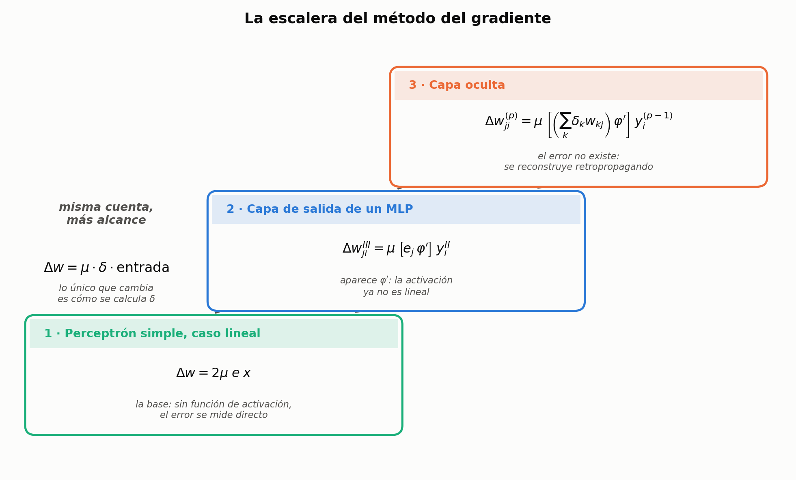
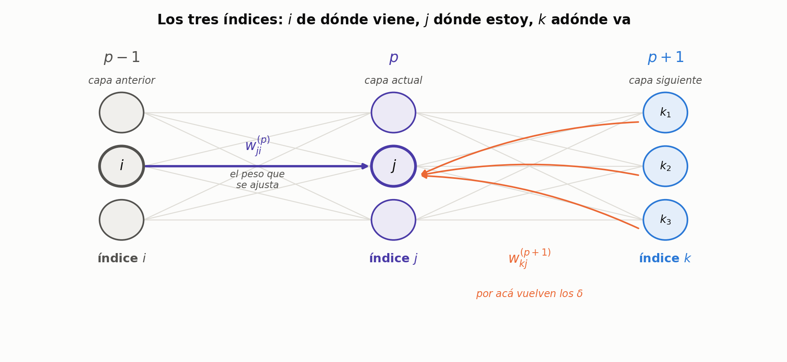
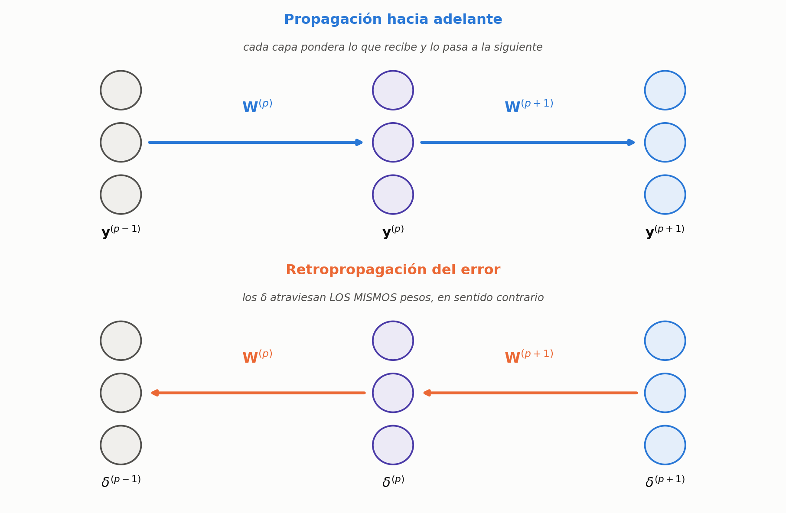

## Cómo usar esta hoja

Esto **no** es un apunte: es una hoja de práctica. La explicación de por qué cada cosa es como es está en `02-metodos-de-gradiente.md`, `03-xor-con-tres-neuronas.md` y `04-perceptron-multicapa.md`. Acá está sólo el esqueleto de las cuentas, en el orden en que hay que escribirlas.

Cada deducción tiene:

- **Te preguntan** — la consigna típica, en la forma en que la pueden pedir.
- **Arrancás escribiendo** — la primera línea en la pizarra. Si esta línea sale sola, el resto es mecánico.
- **Pasos numerados**, y debajo de cada uno un **Llegás a:** con el resultado esperado. Tapalos y verificá recién después de hacerlo.
- **Trampa** — el error concreto que se comete en ese paso.

Los siete desarrollos son **la misma cuenta** con distinto alcance:

---

## D1 · La ecuación básica del descenso por gradiente

**Te preguntan:** *"¿Qué es el método del gradiente y por qué sirve para entrenar?"*

**Arrancás dibujando**, no escribiendo: la superficie de error con los pesos como ejes.

**Paso 1.** Planteás que el error es una función de los pesos, así que se puede pensar como una superficie sobre el espacio de pesos.

> **Llegás a:** un dibujo con ejes $w_1$, $w_2$ y el error en vertical, y un punto sobre la superficie.

**Paso 2.** En ese punto, el gradiente $\nabla_w \xi$ apunta hacia donde el error **crece** más rápido.

> **Trampa:** decir que el gradiente apunta al mínimo. Apunta al **máximo** local de crecimiento; por eso se le pone el menos.

**Paso 3.** Para bajar, te movés en sentido opuesto, con un paso proporcional a $\mu$.

> **Llegás a:** $\;w(n+1) = w(n) - \mu\,\nabla_w \xi\big(w(n)\big)$

**Paso 4.** Cerrás con el rol de $\mu$: grande, se pasa y oscila; chico, converge pero lento.

> **Trampa:** decir sólo "más rápido / más lento". Lo que se pide es el compromiso: con $\mu$ grande **la red se aprende el último patrón y se olvida los anteriores**.

---

## D2 · LMS: la regla del perceptrón simple (caso lineal)

**Te preguntan:** *"Deducí la regla de aprendizaje del perceptrón simple por el método del gradiente."*

**Arrancás escribiendo:** el criterio de error instantáneo.

**Paso 1.** Escribís el error cuadrático de un patrón, reemplazando la salida por el producto interno.

> **Llegás a:** $\;e^2(n) = \big[d(n) - y(n)\big]^2 = \big[d(n) - \langle w(n), x(n)\rangle\big]^2$
> **Trampa:** olvidarte de aclarar en voz alta que **estás en el caso lineal**, sin función de activación. Es la simplificación de la que depende todo el resto.

**Paso 2.** Derivás respecto de $w$ aplicando la regla de la cadena sobre el cuadrado.

> **Llegás a:** $\;\nabla_w e^2(n) = 2\big[d(n) - \langle w,x\rangle\big]\cdot \nabla_w\big(d - \langle w,x\rangle\big)$
> **Trampa:** derivar respecto de $x$. Acá **$x$ y $d$ son constantes**; la variable es $w$.

**Paso 3.** Resolvés el paréntesis interior: $d$ es constante y da cero; $\langle w,x\rangle$ deriva a $x$.

> **Llegás a:** $\;\nabla_w e^2(n) = 2\,e(n)\,\big(-x(n)\big)$

**Paso 4.** Reemplazás en D1.

> **Llegás a:** $\;w(n+1) = w(n) + 2\mu\, e(n)\, x(n)$
> **Trampa:** dejar el signo menos. Se cancela con el $-x$: la corrección queda **sumando**.

**Paso 5 (el remate).** Comparás con la regla intuitiva de corrección de error y mostrás que son la misma con otra constante.

> **Llegás a:** $\;\dfrac{\eta}{2} = 2\mu \;\Longrightarrow\; \eta = 4\mu$

---

## D3 · Derivada de la sigmoide simétrica

**Te preguntan:** *"Deducí la derivada de la función de activación."*

**Arrancás escribiendo:** la definición, y aclarando que es **la simétrica**, entre $-1$ y $+1$.

**Paso 1.** Escribís $\varphi$ y derivás respecto de $v$ como cociente.

> **Llegás a:** $\;\dfrac{\partial y_j}{\partial v_j} = \dfrac{2\,e^{-v_j}}{\big(1+e^{-v_j}\big)^2}$

**Paso 2.** Partís esa fracción en dos factores.

> **Llegás a:** $\;2\cdot\dfrac{1}{1+e^{-v_j}}\cdot\dfrac{e^{-v_j}}{1+e^{-v_j}}$

**Paso 3.** En el segundo factor **sumás y restás $1$** en el numerador.

> **Llegás a:** $\;\dfrac{e^{-v_j}}{1+e^{-v_j}} = \dfrac{-1+1+e^{-v_j}}{1+e^{-v_j}} = 1 - \dfrac{1}{1+e^{-v_j}}$
> **Trampa:** no explicar el truco. Decilo: *"sumar y restar uno es no hacer nada, pero me deja partirlo en dos"*.

**Paso 4.** Despejás $\dfrac{1}{1+e^{-v_j}}$ de la definición de la sigmoide y reemplazás en los dos factores.

> **Llegás a:** $\;\dfrac{1}{1+e^{-v_j}} = \dfrac{y_j+1}{2}$, y con eso $\;2\cdot\dfrac{y_j+1}{2}\left(1-\dfrac{y_j+1}{2}\right)$

**Paso 5.** Simplificás.

> **Llegás a:** $\;\boxed{\varphi'(v_j) = \tfrac{1}{2}\big(1+y_j\big)\big(1-y_j\big)}$
> **Trampa:** escribir $(1+y)(y-1)$. Da **negativa**, y una función creciente no puede tener derivada negativa.
> **Control de tres segundos:** en $v=0$ tiene que dar $+0{,}5$.

**Paso 6 (si te lo piden).** Decís por qué importa: la derivada quedó **en función de la salida**, que la pasada hacia adelante ya calculó. No hay que recalcular ninguna exponencial.

---

## D4 · El último factor y la definición de $\delta$

**Te preguntan:** *"Planteá la regla de la cadena para ajustar un peso de una red."*

**Arrancás escribiendo:** la cadena de dependencias completa.

**Paso 1.** Escribís de qué depende qué: $\xi \leftarrow e_j \leftarrow y_j \leftarrow v_j \leftarrow w_{ji}$.

> **Llegás a:** $\;\dfrac{\partial \xi}{\partial w_{ji}} = \dfrac{\partial \xi}{\partial e_j}\dfrac{\partial e_j}{\partial y_j}\dfrac{\partial y_j}{\partial v_j}\dfrac{\partial v_j}{\partial w_{ji}}$

**Paso 2.** Resolvés el último factor. Escribís $v_j = \sum_i w_{ji} y_i$ y derivás respecto de **un** peso: todos los términos con índice distinto de $i$ son constantes.

> **Llegás a:** $\;\dfrac{\partial v_j}{\partial w_{ji}} = y_i(n)$
> **Trampa:** confundir $y_i$ con $y_j$. $y_i$ es **la entrada** por esa conexión (salida de la capa anterior); $y_j$ es la salida de la neurona.

**Paso 3.** Agrupás los tres factores restantes y los bautizás.

> **Llegás a:** $\;\delta_j(n) = -\dfrac{\partial \xi}{\partial y_j}\,\dfrac{\partial y_j}{\partial v_j}$
> Decí las tres palabras: **gradiente** (es una derivada), **local** (de esa neurona), **instantáneo** (en la iteración $n$).

**Paso 4.** Armás la regla de ajuste.

> **Llegás a:** $\;\boxed{\Delta w_{ji}(n) = \mu\,\delta_j(n)\,y_i(n)}$
> **Trampa:** perder el signo. El menos de $\delta$ cancela el $-\mu$ del gradiente.

---

## D5 · $\delta$ de la capa de salida

**Te preguntan:** *"Deducí el ajuste de los pesos de la capa de salida."*

**Arrancás escribiendo:** $\Delta w^{III}_{ji} = \mu\,\delta^{III}_j\,y^{II}_i$, y aclarás que $y^{II}_i$ es **la entrada** a la capa III.

**Paso 1.** Escribís el $\delta$ y separás la parte ya conocida (la derivada de la activación) de la que falta.

> **Llegás a:** $\;\delta^{III}_j = -\dfrac{\partial \xi}{\partial y^{III}_j}\cdot\tfrac{1}{2}\big(1+y^{III}_j\big)\big(1-y^{III}_j\big)$

**Paso 2.** Abrís $\dfrac{\partial \xi}{\partial y^{III}_j}$ en dos eslabones.

> **Llegás a:** $\;\dfrac{\partial \xi}{\partial e_j}\,\dfrac{\partial e_j}{\partial y^{III}_j}$

**Paso 3.** Primer eslabón: reemplazás $\xi = \tfrac{1}{2}\sum_k e_k^2$ y derivás respecto de $e_j$. **Sobrevive un solo término** y el $2$ que baja se cancela con el $\tfrac{1}{2}$.

> **Llegás a:** $\;\dfrac{\partial \xi}{\partial e_j} = e_j(n)$

**Paso 4.** Segundo eslabón: $e_j = d_j - y^{III}_j$, con $d_j$ constante.

> **Llegás a:** $\;\dfrac{\partial e_j}{\partial y^{III}_j} = -1$

**Paso 5.** Juntás: el $-1$ cancela el menos de adelante.

> **Llegás a:** $\;\boxed{\delta^{III}_j = \tfrac{1}{2}\,e_j\,\big(1+y^{III}_j\big)\big(1-y^{III}_j\big)}\quad\star$
> **Marcá la estrella en la pizarra.** La vas a reusar en D6.

**Paso 6.** Escribís el ajuste final y **decís su estructura en voz alta**.

> **Llegás a:** $\;\Delta w^{III}_{ji} = \eta\; e_j\,\big(1+y^{III}_j\big)\big(1-y^{III}_j\big)\; y^{II}_i$
> **La frase:** *velocidad de aprendizaje, por error, por derivada de la activación, por entrada.*

---

## D6 · $\delta$ de una capa oculta

**Te preguntan:** *"¿Y cómo se ajustan los pesos de una capa oculta, si ahí no hay salida deseada?"*

**Arrancás dibujando** tres capas y marcando los índices: $i$ de dónde viene, $j$ dónde estoy, $k$ adónde va. **Sin esto la cuenta se te mezcla.**

**Paso 1.** Planteás el problema: el error se mide en la capa de salida, pero hay que derivar respecto de una neurona de la capa oculta. Hay que **atravesar la capa de salida**.

**Paso 2.** Escribís el $\delta$ y reemplazás $\xi$, metiendo la derivada dentro de la sumatoria.

> **Llegás a:** $\;\delta^{II}_j = -\sum_k e_k\,\dfrac{\partial e_k}{\partial y^{II}_j}\;\cdot\;\tfrac{1}{2}\big(1+y^{II}_j\big)\big(1-y^{II}_j\big)$
> **Trampa:** colapsar la sumatoria como en D5. Acá **ningún** término es constante: la neurona oculta alimenta a **todas** las de salida.

**Paso 3.** Abrís $\dfrac{\partial e_k}{\partial y^{II}_j}$ en tres eslabones, atravesando la capa de salida.

> **Llegás a:** $\;\dfrac{\partial e_k}{\partial y^{III}_k}\;\dfrac{\partial y^{III}_k}{\partial v^{III}_k}\;\dfrac{\partial v^{III}_k}{\partial y^{II}_j}$

**Paso 4.** Resolvés los tres.

> **Llegás a:**
> $(1)\;\dfrac{\partial e_k}{\partial y^{III}_k} = -1$
> $(2)\;\dfrac{\partial y^{III}_k}{\partial v^{III}_k} = \tfrac{1}{2}\big(1+y^{III}_k\big)\big(1-y^{III}_k\big)$
> $(3)\;\dfrac{\partial v^{III}_k}{\partial y^{II}_j} = w^{III}_{kj}$
> **Trampa:** evaluar la derivada de la activación en la neurona equivocada. La de $(2)$ va en **$k$**; la que arrastrás desde el paso 2 va en **$j$**. Son **dos** derivadas distintas.

**Paso 5.** Reemplazás; el $-1$ cancela el menos.

> **Llegás a:** $\;\delta^{II}_j = \sum_k e_k\,\tfrac{1}{2}\big(1+y^{III}_k\big)\big(1-y^{III}_k\big)\,w^{III}_{kj}\;\cdot\;\tfrac{1}{2}\big(1+y^{II}_j\big)\big(1-y^{II}_j\big)$

**Paso 6 (el remate).** Señalás la estrella de D5: eso que quedó adentro de la sumatoria **es $\delta^{III}_k$**.

> **Llegás a:** $\;\boxed{\delta^{II}_j = \left[\sum_k \delta^{III}_k\,w^{III}_{kj}\right]\tfrac{1}{2}\big(1+y^{II}_j\big)\big(1-y^{II}_j\big)}$

**Paso 7.** Explicás qué es el corchete. **Éste es el punto que te están evaluando.**

> **La frase:** *es un promedio ponderado de los $\delta$ de la capa siguiente, pesado por los pesos que las unen. Estamos haciendo pasar los $\delta$ por los mismos pesos, en sentido contrario. Por eso se llama retropropagación.*

---

## D7 · La generalización a una capa $p$

**Te preguntan:** *"Escribí la regla general para una capa cualquiera."*

**Paso 1.** Renombrás: $p$ es donde estás, $p-1$ de dónde viene la entrada, $p+1$ la capa siguiente.

**Paso 2.** Escribís la fórmula.

> **Llegás a:**
> $$\Delta w^{(p)}_{ji}(n) = \eta\;\big\langle \boldsymbol{\delta}^{(p+1)},\, \mathbf{w}^{(p+1)}_j \big\rangle\;\big(1+y^{(p)}_j\big)\big(1-y^{(p)}_j\big)\;y^{(p-1)}_i(n)$$
> **Trampa:** decir que $\mathbf{w}^{(p+1)}_j$ es una fila. Es **la columna $j$**: los pesos que **salen** de la neurona $j$.

**Paso 3.** Cerrás con por qué esto termina la unidad: **no importa cuántas capas tenga la red**. Se empieza por la de salida, donde el $\delta$ sale del error verdadero, y de ahí para atrás cada capa arma el suyo con los de la siguiente. Es un bucle, no una fórmula por capa.

---

## Guion de pizarra: qué escribir primero según lo que te pregunten

| Si te preguntan… | Arrancá con | Y no te olvides de |
|---|---|---|
| "¿Por qué el perceptrón no resuelve el XOR?" | los 4 puntos y dos o tres rectas fallando | decir que **no existe** solución, no que no converge |
| "¿Para qué sirve el sesgo?" | la recta pasando por el origen sin él | $x_0=-1$, y que $w_0$ se aprende como cualquier peso |
| "Deducí la regla de aprendizaje" | el criterio de error instantáneo | aclarar si estás en el caso lineal o no |
| "¿Por qué se cambia la función signo?" | la discontinuidad de $\mathrm{sgn}$ en el origen | que **hay que derivar** para aplicar el gradiente |
| "¿Qué es el $\delta$?" | la cadena $\xi \leftarrow e \leftarrow y \leftarrow v \leftarrow w$ | las tres palabras: gradiente, local, instantáneo |
| "¿Cómo aprende una capa oculta?" | los tres índices $i$, $j$, $k$ dibujados | el corchete y la frase de la retropropagación |
| "Explicá back-propagation" | el algoritmo en 5 pasos | que primero **todos** los $\delta$, después **todos** los $\Delta w$ |
| "¿Qué puede resolver cada arquitectura?" | la tabla de tres filas | que tres capas es **existencia**, no aprendizaje |

## Las constantes, para que no te trabe

En cada deducción la constante se redefine para absorber los factores numéricos que van apareciendo. **No es un error ni hay que memorizar los valores**: lo que se evalúa es la forma de la ecuación.

| Dónde | Constante | Absorbe |
|---|---|---|
| D1 | $\mu$ | nada, es la original |
| D2 | $\eta = 4\mu$ | el $2$ de la derivada y el $\tfrac{1}{2}$ de la regla intuitiva |
| D5, D6, D7 | $\eta$ | el $\tfrac{1}{2}$ que viene del $\delta$ |

## Los seis controles de signo

Son los lugares donde se pierde un menos y la red termina aprendiendo al revés:

1. El gradiente apunta hacia arriba: por eso el paso lleva **menos**.
2. En D2, el $-x$ de la derivada cancela ese menos: la corrección queda **sumando**.
3. El $\delta$ se define **con** signo menos adelante.
4. En D5, $\partial e_j/\partial y_j = -1$ cancela el menos del $\delta$.
5. En D6, pasa exactamente lo mismo con el factor $(1)$.
6. $\varphi'$ es $(1+y)(1-y)$, **positiva** siempre. En $v=0$ vale $+0{,}5$.
