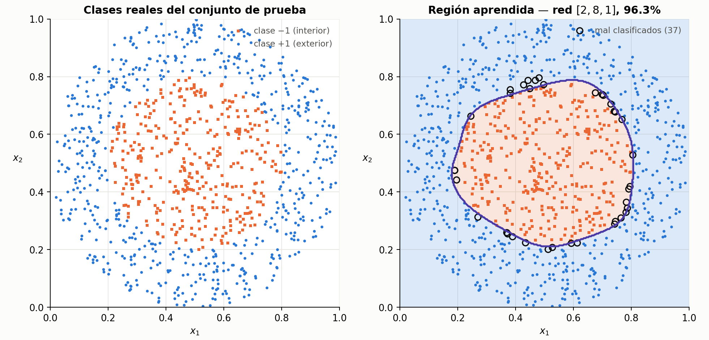

*Los apuntes `01` y `02` deducen las ecuaciones. Éste toma **el código que ya está en el TP2** y muestra qué línea es cada ecuación, para que en la defensa puedas señalar el renglón y decir la fórmula.*

---

## 1. Las tres decisiones de diseño

Antes del código, las tres decisiones que hay que poder justificar. Son lo primero que se pregunta.

### 1.1 Una matriz por capa, guardadas en una lista

$$
\mathbf{W}^{I},\ \mathbf{W}^{II},\ \mathbf{W}^{III} \;\longrightarrow\; \texttt{self.pesos = [W1, W2, W3]}
$$

Así el algoritmo no depende de cuántas capas haya: los bucles recorren la lista. Es la traducción directa de la fórmula general del apunte `02` §13, que vale para una capa $p$ cualquiera.

Con `neuronas_por_capa=[2, 4, 1]` quedan:

```
capa 1: pesos (2, 4), umbrales (4,)
capa 2: pesos (4, 1), umbrales (1,)
```

Notá el orden de los índices: **`pesos[capa][i, j]` es el peso de la neurona $i$ de la capa anterior hacia la neurona $j$ de la capa actual.** Es la traspuesta de la convención $w_{ji}$ del apunte, y eso es a propósito: permite escribir la propagación como `activacion @ pesos`, que es lo natural en NumPy.

### 1.2 El sesgo va aparte, en `umbrales`

En el apunte el sesgo entra como una entrada más, $x_0 = -1$ con su peso $w_0$. En el código está separado y **sumando**:

$$
\text{apunte:}\quad v_j = \sum_{i=1}^{N} w_{ji}x_i - w_{j0}
\qquad\qquad
\text{código:}\quad \texttt{entrada\_neta = activacion @ pesos + umbral}
$$

> **PARA LA DEFENSA — son lo mismo, con el signo cambiado**
> Es la pregunta más probable sobre el código. Las dos formas son **equivalentes**, y la relación es
> $$b_j = -\,w_{j0}$$
> porque en el apunte el término del sesgo es $w_{j0}\cdot x_0 = w_{j0}\cdot(-1) = -w_{j0}$.
> Ninguna es más correcta: la entrada extendida es más compacta para deducir (un solo producto interno), y el vector aparte es más cómodo para programar (no hay que agregarle una columna de $-1$ a los datos en cada capa). **Lo que no se puede hacer es mezclarlas y perder el signo.**

### 1.3 La derivada se calcula con la salida, no con la entrada neta

```python
def derivada_activacion(self, salida):
    return 0.5 * (1 - salida ** 2)
```

Es exactamente $\varphi'(v_j) = \tfrac{1}{2}(1+y_j)(1-y_j)$ del apunte `02` §9, factorizado como diferencia de cuadrados: $(1+y)(1-y) = 1-y^2$.

Por eso el parámetro se llama `salida` y no `entrada_neta`: **no hace falta guardar los $v$ ni recalcular ninguna exponencial**, alcanza con las activaciones que la propagación hacia adelante ya dejó guardadas.

### Claves de la sección 1

| Clave | Qué tenés que poder responder |
|---|---|
| Lista de matrices | Por qué el algoritmo no depende de la cantidad de capas |
| Orden de índices | Por qué `pesos[capa][i, j]` está traspuesto respecto de $w_{ji}$ |
| El sesgo | La relación $b_j = -w_{j0}$ y por qué las dos formas son equivalentes |
| La derivada | Por qué recibe la salida y no $v$ |

---

## 2. La clase completa

```python
class PerceptronMulticapa:
    def __init__(self, neuronas_por_capa, tasa_aprendizaje=0.1, semilla=None):
        generador = np.random.default_rng(semilla)
        self.tasa_aprendizaje = tasa_aprendizaje
        self.pesos = [
            generador.uniform(-0.5, 0.5, (neuronas_por_capa[i], neuronas_por_capa[i + 1]))
            for i in range(len(neuronas_por_capa) - 1)
        ]
        self.umbrales = [
            generador.uniform(-0.5, 0.5, neuronas_por_capa[i + 1])
            for i in range(len(neuronas_por_capa) - 1)
        ]

    def activacion(self, entrada_neta):
        return 2 / (1 + np.exp(-entrada_neta)) - 1

    def derivada_activacion(self, salida):
        return 0.5 * (1 - salida ** 2)

    def propagar(self, entradas):
        activaciones = [entradas]
        for pesos_capa, umbral_capa in zip(self.pesos, self.umbrales):
            entrada_neta = activaciones[-1] @ pesos_capa + umbral_capa
            activaciones.append(self.activacion(entrada_neta))
        return activaciones

    def entrenar_un_patron(self, entradas, salida_deseada):
        activaciones = self.propagar(entradas)
        error_salida = salida_deseada - activaciones[-1]

        deltas = [error_salida * self.derivada_activacion(activaciones[-1])]
        for capa in range(len(self.pesos) - 1, 0, -1):
            delta_propagado = self.derivada_activacion(activaciones[capa]) * (self.pesos[capa] @ deltas[0])
            deltas.insert(0, delta_propagado)

        for capa in range(len(self.pesos)):
            self.pesos[capa] = self.pesos[capa] + self.tasa_aprendizaje * np.outer(activaciones[capa], deltas[capa])
            self.umbrales[capa] = self.umbrales[capa] + self.tasa_aprendizaje * deltas[capa]

        return error_salida
```

Y los tres métodos que faltan, que no son algoritmo pero sí hacen falta para los tres ejercicios:

```python
    def clasificar(self, entradas):
        salidas = self.predecir(entradas)
        if salidas.shape[1] == 1:                       # dos clases: decide el signo
            return np.where(salidas[:, 0] >= 0, 1.0, -1.0)
        return np.argmax(salidas, axis=1)               # varias clases: gana la mayor

    @staticmethod
    def _clase_deseada(deseadas):
        if deseadas.ndim == 1:
            return np.where(deseadas >= 0, 1.0, -1.0)
        return np.argmax(deseadas, axis=1)

    def probar(self, entradas, deseadas):
        aciertos = self.clasificar(entradas) == self._clase_deseada(deseadas)
        return 100 * aciertos.mean(), int((~aciertos).sum())

    def entrenar(self, entradas, deseadas, maximo_epocas=1000, tolerancia=0.1):
        errores_por_epoca, error_cuadratico_por_epoca, historial = [], [], []
        deseadas_2d = deseadas if deseadas.ndim > 1 else deseadas[:, None]
        for _ in range(maximo_epocas):
            suma_cuadratica = 0.0
            for entrada, deseada in zip(entradas, deseadas_2d):
                error = self.entrenar_un_patron(entrada, deseada)
                suma_cuadratica += 0.5 * float(np.sum(error ** 2))
            _, cantidad_errores = self.probar(entradas, deseadas)
            errores_por_epoca.append(cantidad_errores)
            error_cuadratico_por_epoca.append(suma_cuadratica)
            historial.append(self._copiar_estado())
            if cantidad_errores == 0:
                break
        return errores_por_epoca, error_cuadratico_por_epoca, historial
```

> **IDEA DE FONDO — `clasificar` es lo único que cambia entre dos clases y tres**
> Con una sola salida la decisión es el **signo**. Con varias, gana la neurona de **mayor salida**
> (*winner-takes-all*), y no el signo de cada una por separado: si dos salidas dan positivo, el signo
> no sabe cuál elegir. Toda la generalización del ejercicio 3 vive en esas dos líneas.

> **OJO — `entrenar` ya devuelve las dos curvas que pide el ejercicio 3**
> `errores_por_epoca` es el error de **clasificación** por época y `error_cuadratico_por_epoca` es
> $\sum_n \xi(n)$ por época. No hay que instrumentar nada: ya están.

---

## 3. El mapa: cada ecuación, su línea

Ésta es la tabla para tener a mano en la defensa.

| Apunte `02` | Ecuación | Línea de código |
|---|---|---|
| §2 | $\mathbf{W}^{(p)}$, una matriz por capa | `self.pesos = [...]` |
| §4 | $\varphi(v)=\frac{2}{1+e^{-v}}-1$ | `2 / (1 + np.exp(-entrada_neta)) - 1` |
| §9 | $\varphi'(v_j)=\frac{1}{2}(1+y_j)(1-y_j)$ | `0.5 * (1 - salida ** 2)` |
| §3 | $v^{(p)}_j=\langle \mathbf{w}^{(p)}_j, \mathbf{y}^{(p-1)}\rangle$ | `activaciones[-1] @ pesos_capa + umbral_capa` |
| §3 | $y^{(p)}_j=\varphi(v^{(p)}_j)$ | `activaciones.append(self.activacion(...))` |
| §5 | $e_j = d_j - y^{III}_j$ | `error_salida = salida_deseada - activaciones[-1]` |
| §11 | $\delta^{III}_j = e_j\,\varphi'(y^{III}_j)$ | `error_salida * self.derivada_activacion(activaciones[-1])` |
| §12 | $\delta^{(p)}_j = \big[\sum_k \delta^{(p+1)}_k w^{(p+1)}_{kj}\big]\varphi'(y^{(p)}_j)$ | `self.derivada_activacion(...) * (self.pesos[capa] @ deltas[0])` |
| §10 | $\Delta w_{ji} = \mu\,\delta_j\,y_i$ | `self.tasa_aprendizaje * np.outer(activaciones[capa], deltas[capa])` |
| §14 | $w(n{+}1) = w(n) + \Delta w$ | `self.pesos[capa] = self.pesos[capa] + ...` |
| §14 | $\Delta w_{j0} = \mu\,\delta_j\,(-1)$ | `self.umbrales[capa] + self.tasa_aprendizaje * deltas[capa]` |

> **OJO — la línea del sesgo no tiene el $(-1)$**
> En el apunte el ajuste del peso de sesgo es $\mu\,\delta_j\,(-1)$, y en el código es `+ tasa * deltas[capa]`, sin el menos. **No es un error:** como $b_j = -w_{j0}$, al derivar respecto de $b$ en vez de $w_0$ el signo se da vuelta y queda $\Delta b_j = +\mu\,\delta_j$. Los dos ajustan la frontera para el mismo lado.
> Si te lo preguntan, la respuesta corta es: *"el código optimiza $b$, no $w_0$, y $b=-w_0$"*.

> **PARA LA DEFENSA — dónde señalar cuando pregunten "¿dónde está la retropropagación?"**
> En `self.pesos[capa] @ deltas[0]`. Eso es el corchete $\sum_k \delta_k w_{kj}$: el producto de la **matriz de pesos** por el **vector de deltas de la capa siguiente**. Es el paso que hace pasar el error por los mismos pesos, en sentido contrario.
> Y el bucle va `range(len(self.pesos) - 1, 0, -1)` —**al revés**— porque el $\delta$ de una capa necesita el de la capa siguiente ya calculado.

---

## 4. El recorrido de un patrón

Los tres pasos del apunte `02` §14, en el orden en que los hace el código:

**1. Hacia adelante** (`propagar`). Devuelve una **lista con las activaciones de todas las capas**, no sólo la salida. Eso no es un capricho: los pasos 2 y 3 las necesitan.

**2. Hacia atrás.** Se calcula primero $\delta$ de la salida, y después el bucle va de la anteúltima capa hacia la primera insertando cada delta al principio de la lista (`deltas.insert(0, ...)`), para que al final el índice de `deltas` coincida con el de `pesos`.

**3. Ajuste.** Recién acá se tocan los pesos, en un bucle aparte.

> **PARA LA DEFENSA — por qué el ajuste está en un bucle separado**
> Es el punto fino de la clase (apunte `02` §14). Las activaciones y los deltas **ya están calculados con los pesos viejos**, así que el bucle de ajuste puede recorrer las capas en cualquier orden y da lo mismo.
> Lo que **no** se puede hacer es intercalar: si actualizaras `pesos[capa]` dentro del bucle de deltas, el delta siguiente se calcularía con pesos a medio mover y el gradiente dejaría de ser el gradiente en $w(n)$. Por eso son dos bucles y no uno.

> **IDEA DE FONDO — es entrenamiento estocástico**
> `entrenar_un_patron` ajusta los pesos **después de cada patrón**, no al final de la época. Eso es coherente con el criterio de error **instantáneo** $\xi(n)$ del apunte `02` §5: nunca se promedia sobre el conjunto. Es lo que justifica usar $\mu$ chico.

### Claves de la sección 4

| Clave | Qué tenés que poder responder |
|---|---|
| Qué devuelve `propagar` | Por qué la lista completa y no sólo la salida |
| El bucle al revés | Por qué los deltas se calculan de atrás para adelante |
| Dos bucles | Por qué el ajuste está separado del cálculo de deltas |
| Estocástico | Cuándo se actualizan los pesos y con qué criterio de error se corresponde |

---

## 5. Verificación sobre el XOR

Corrí la clase con los datasets del TP2, variando la cantidad de neuronas ocultas y la semilla. Ojo con lo que sale:

```
--- 2 neuronas ocultas: convergen 8/10
    semilla     0: converge     4 epocas   100.0% test
    semilla     1: converge     4 epocas   100.0% test
    semilla     2: converge     4 epocas   100.0% test
    semilla     3: converge     4 epocas   100.0% test
    semilla     7: converge     4 epocas   100.0% test
    semilla    11: converge     4 epocas   100.0% test
    semilla    42: NO conv.   300 epocas    56.0% test
    semilla    99: NO conv.   300 epocas    56.0% test
    semilla   123: converge     4 epocas   100.0% test
    semilla  2024: converge     4 epocas   100.0% test

--- 4 neuronas ocultas: convergen 10/10   (3 a 5 épocas, 100% en todas)
```

> **OJO — cuidado con cómo se enuncia esto en la defensa**
> El notebook compara "XOR con 4 ocultas" contra "XOR con 2 ocultas" y muestra que la segunda no converge. **Con la semilla 42 es cierto — pero es un resultado de esa semilla, no de la arquitectura.** Con 8 de 10 semillas, dos neuronas ocultas convergen en 4 épocas y clasifican 100%.
> Si decís "con 2 ocultas no converge" y el profe prueba con otra semilla, quedás pagando. La afirmación defendible es:
> *"con dos neuronas ocultas la convergencia **depende de la inicialización**: en algunas corridas cae en un mínimo local y se queda en el 56%, que es nivel de azar. Con cuatro, converge siempre."*

> **PARA LA DEFENSA — esto conecta con la teoría, y vale oro**
> Es el recuadro de *existencia contra aprendizaje* del apunte `02` §1, ahora con evidencia propia:
> - En el apunte `01` **diseñamos a mano** una red de dos neuronas ocultas que resuelve el XOR. O sea que la solución con dos **existe**.
> - Acá se ve que el algoritmo, desde una inicialización al azar, **a veces no la encuentra**.
>
> Ésa es exactamente la letra chica de "tres capas resuelven cualquier problema": la arquitectura lo permite, encontrar los pesos es otra cosa. Y agregar neuronas de más no cambia lo que la red *puede* representar — **cambia la probabilidad de que el entrenamiento llegue**.

> **OJO — qué mide `tolerancia`**
> El criterio de corte cuenta un patrón como fallado si $|e| > 0{,}1$ sobre la **salida continua**, no si se equivoca de clase. Es **más estricto** que el error de clasificación: una salida de $0{,}7$ cuando se esperaba $1$ clasifica bien pero cuenta como error. Por eso `errores_por_epoca` puede no dar cero aunque el porcentaje de aciertos sea 100%.

### Claves de la sección 5

| Clave | Qué tenés que poder responder |
|---|---|
| 2 vs. 4 ocultas | Qué se puede afirmar y qué no |
| Mínimos locales | Por qué la misma arquitectura converge o no según la semilla |
| Existencia vs. aprendizaje | Cómo se conecta con el diseño a mano del apunte `01` |
| `tolerancia` | Qué mide, y por qué no es el error de clasificación |

---

## 6. Preguntas probables, y por dónde arrancar la respuesta

| Si te preguntan… | Señalá | Y decí |
|---|---|---|
| "¿Dónde está el sesgo?" | `self.umbrales` | que es la entrada $x_0=-1$ del apunte, con $b=-w_0$ |
| "¿Por qué esa derivada?" | `0.5 * (1 - salida ** 2)` | que es $\frac{1}{2}(1+y)(1-y)$ factorizado, y que depende de la salida para no recalcular la exponencial |
| "¿Dónde está la retropropagación?" | `self.pesos[capa] @ deltas[0]` | que es $\sum_k \delta_k w_{kj}$: el error pasando por los mismos pesos, al revés |
| "¿Por qué guardás todas las activaciones?" | `return activaciones` | que el ajuste usa las salidas calculadas con los pesos **viejos** |
| "¿Por qué dos bucles y no uno?" | los dos `for capa in ...` | que primero van **todos** los deltas y después **todos** los ajustes |
| "¿Actualiza por patrón o por época?" | `entrenar_un_patron` | por patrón: es estocástico, coherente con $\xi(n)$ instantáneo |
| "¿Por qué con 2 ocultas a veces falla?" | la tabla de semillas | mínimo local; existencia $\neq$ aprendizaje |
| "¿Cuándo corta el entrenamiento?" | `if errores_en_esta_epoca == 0: break` | y aclarar qué cuenta como error (la tolerancia, no la clase) |

---

## 7. Ejercicio 2: las clases concéntricas

La consigna pide **determinar la estructura apropiada** y **representar gráficamente la clasificación**. La estructura no se busca a los tumbos: se argumenta con los tres pasos del apunte `02` §1.

### 7.1 Qué dicen los datos

```
concent_trn: 1499 patrones, 2 entradas    concent_tst: 1000 patrones
centroide: (0.501, 0.496)
clase -1:  552 patrones, radio 0.013 a 0.303   <- el disco interior
clase +1:  947 patrones, radio 0.297 a 0.503   <- el anillo exterior
```

Las dos clases se separan casi perfectamente con **una circunferencia de radio $0{,}30$ centrada en $(0{,}5;\ 0{,}5)$**: ese círculo ideal clasifica bien el $99{,}5\%$ del entrenamiento. Ésa es la cota superior contra la que hay que comparar la red.

### 7.2 El argumento de la arquitectura

1. **Forma necesaria:** la clase $-1$ está **encerrada** por la $+1$, así que hace falta una región **cerrada**.
2. **Cuántas capas:** un recinto cerrado aproximadamente circular es **convexo**, y las regiones convexas cerradas son lo que dan **dos capas**. No hay concavidades ni huecos, así que la tercera capa no aporta nada.
3. **Cuántas neuronas:** $N$ ocultas dan un polígono de hasta $N$ lados. Con $2$ **no se puede cerrar**; con $3$ apenas un triángulo; a más neuronas, mejor aproximación al círculo.

### 7.3 El preprocesamiento, que no es un detalle

Los datos vienen en $[0,1]^2$. **Entrenar sobre ellos tal cual no funciona:**

```
preprocesamiento            aciertos test  errores ult. epoca
-------------------------------------------------------------
crudo [0,1]                        63.10%                1499
centrado (x - 0.5)                 63.10%                1499
centrado y escalado x4             95.10%                 504
```

El $63{,}1\%$ es exactamente la proporción de la clase $+1$ en el conjunto de prueba: **la red no aprende nada y contesta siempre la clase mayoritaria**.

> **PARA LA DEFENSA — por qué centrar no alcanza y escalar sí**
> Es el recuadro de la sección 4 del apunte `02`, visto del otro lado. Ahí el problema era **saturación**: pesos grandes, $v$ grande, $\varphi' \approx 0$, no aprende. Acá es el problema **opuesto**: con entradas en $[-0{,}5;\ 0{,}5]$ y pesos iniciales en $[-0{,}5;\ 0{,}5]$, la salida lineal $v$ queda diminuta, la sigmoide trabaja en su tramo casi recto y la red se comporta como un modelo lineal — que sobre este problema no puede hacer más que votar por la clase mayoritaria.
> Escalar la entrada le da al producto interno el rango que necesita. Es equivalente a subir $b$ o a permitir pesos más grandes: **son el mismo grado de libertad**, el de la sección 3 del apunte `01`.

### 7.4 El barrido de arquitecturas

Con los datos escalados, tres semillas por configuración, 60 épocas:

```
 ocultas   semilla 0   semilla 1   semilla 2     medio
------------------------------------------------------
       2      63.10%      63.10%      69.30%    65.17%
       3      94.60%      63.10%      63.10%    73.60%
       4      95.50%      94.80%      63.10%    84.47%
       6      95.40%      95.40%      63.10%    84.63%
       8      96.30%      95.00%      93.40%    94.90%
      12      94.30%      93.60%      95.80%    94.57%
```

> **IDEA DE FONDO — la tabla es la teoría, medida**
> Leela contra el paso 3 del apunte `02` §1:
> - **2 ocultas nunca funciona.** No es mala suerte: con dos semiplanos **no se puede cerrar una región**. Es una imposibilidad geométrica, igual que el XOR con una recta.
> - **3 a 6 funciona a veces.** Ya se puede cerrar el polígono, pero se está en el mínimo justo y la convergencia depende de la inicialización.
> - **8 en adelante funciona siempre**, y el rendimiento se planta en $\sim 95\%$. Pasar de 8 a 12 no mejora: el techo ya no lo pone la arquitectura.
>
> Y el techo medido ($\sim 96\%$) contra el círculo ideal ($99{,}5\%$) es la diferencia entre **un polígono y una circunferencia**. Se ve en el gráfico.

### 7.5 El código

```python
FACTOR_DE_ESCALA = 4.0
CENTRO_DE_LOS_DATOS = 0.5


def normalizar(entradas):
    return (entradas - CENTRO_DE_LOS_DATOS) * FACTOR_DE_ESCALA


entradas_entrenamiento, deseadas_entrenamiento = cargar_patrones(
    DIRECTORIO_DATASET / "concent_trn.csv")
entradas_prueba, deseadas_prueba = cargar_patrones(
    DIRECTORIO_DATASET / "concent_tst.csv")

red_concent = PerceptronMulticapa(
    neuronas_por_capa=[2, 8, 1],
    tasa_aprendizaje=0.1,
    semilla=0,
)
red_concent.entrenar(
    normalizar(entradas_entrenamiento),
    deseadas_entrenamiento,
    maximo_epocas=60,
    tolerancia=0.1,
)

porcentaje_aciertos, cantidad_errores = red_concent.probar(
    normalizar(entradas_prueba), deseadas_prueba)
```

El gráfico que pide la consigna se arma evaluando la red sobre una grilla que cubre el plano y
pintando cada punto según el signo de la salida; encima van los patrones de prueba con el color de la
clase que la red les asignó. Eso es sólo `matplotlib` y está en `imagenes/ejercicio2_concent.py`.

### 7.6 El resultado



**Mirá la forma de la frontera.** No es una circunferencia: es un **polígono de lados apenas curvos**, y tiene tantos lados como neuronas ocultas. Es la figura `07` de regiones de decisión, pero aprendida en vez de dibujada.

Y los 37 errores están **todos sobre el borde**, ninguno adentro ni lejos. Eso dice que la red no se equivocó de forma: se equivocó por la resolución del polígono contra el círculo real.

### Claves de la sección 7

| Clave | Qué tenés que poder responder |
|---|---|
| El argumento | Los tres pasos, aplicados a las concéntricas |
| Por qué 2 no anda | Que es imposibilidad geométrica, no mala suerte |
| El preprocesamiento | Por qué sin escalar da la clase mayoritaria |
| El techo | Por qué se planta en $\sim 95\%$ y qué lo explica |
| La figura | Por qué la frontera es un polígono y cuántos lados tiene |

---

## 8. Ejercicio 3: las tres especies de Iris

La consigna pide tres cosas: **estructura óptima**, **explorar tasas de aprendizaje**, y **las curvas
de error cuadrático total y error de clasificación por época**.

### 8.1 Qué cambia respecto de los dos anteriores

Sólo una cosa: **hay tres salidas en vez de una**. Las especies vienen codificadas

$$[-1,-1,+1] = \text{setosa} \qquad [-1,+1,-1] = \text{versicolor} \qquad [+1,-1,-1] = \text{virginica}$$

así que la capa de salida tiene tres neuronas y la carga pasa `n_salidas=3`:

```python
entradas_entrenamiento, deseadas_entrenamiento = cargar_patrones(
    DIRECTORIO_DATASET / "iris81_trn.csv", n_salidas=3)
entradas_prueba, deseadas_prueba = cargar_patrones(
    DIRECTORIO_DATASET / "iris81_tst.csv", n_salidas=3)
```

Y la regla de decisión pasa a ser **winner-takes-all**, que es lo que ya resuelve `clasificar` de la
sección 2. Nada más de la clase cambia.

### 8.2 Qué dicen los datos

```
iris81_trn: 111 patrones, 4 entradas, 3 salidas
iris81_tst:  37 patrones

               longitud sép.  ancho sép.  longitud pét.  ancho pét.
   mínimo               4.30        2.00           1.10        0.10
   máximo               7.70        4.40           6.90        2.50
   desvío               0.79        0.49           1.85        0.76

clases en entrenamiento:  setosa 45, virginica 34, versicolor 32
```

> **OJO — el conjunto de prueba tiene patrones repetidos**
> Hay 8 valores que aparecen dos o tres veces entre los 37. Eso importa para leer los porcentajes:
> **cada patrón vale 2,7 %**, y un patrón duplicado vale 5,4 %. Un salto de 94,59 % a 100 % no son
> "dos errores distintos": puede ser **un solo punto contado dos veces**. Conviene decirlo antes de
> que te lo pregunten.

Las cuatro variables están en centímetros y con rangos distintos, así que conviene **estandarizar**
—restar la media y dividir por el desvío, ambos calculados sobre el conjunto de entrenamiento—:

```python
media = entradas_entrenamiento.mean(axis=0)
desvio = entradas_entrenamiento.std(axis=0)


def normalizar(entradas):
    return (entradas - media) / desvio
```

> **PARA LA DEFENSA — acá normalizar no es decisivo, y hay que decirlo así**
> A diferencia de las concéntricas, en Iris entrenar sobre los datos crudos **también funciona**
> (95,1 % contra 94,6 % estandarizado, promediando cinco semillas). Se estandariza igual porque la
> longitud del pétalo tiene un desvío casi cuatro veces mayor que el del ancho del sépalo y domina el
> producto interno, pero **no es lo que decide el resultado**. Si decís que sin normalizar no anda,
> como en el ejercicio 2, te estarías equivocando.

### 8.3 El barrido de arquitecturas

Cinco semillas por configuración, 200 épocas, $\mu = 0{,}1$, datos estandarizados:

```
   arquitectura     train      test
  --------------------------------
   4 -> 3           99.10%   100.00%     <- sin capa oculta
   4 -> 2 -> 3      99.10%    94.59%
   4 -> 4 -> 3      99.10%    94.59%
   4 -> 6 -> 3      99.10%    94.59%
   4 -> 10 -> 3     99.10%    94.59%
   4 -> 20 -> 3     99.10%    94.59%
   4 -> 6 -> 6 -> 3 99.10%    94.59%
```

Todas dan **exactamente lo mismo en entrenamiento**: fallan 1 patrón de 111. Y en prueba, agregar
capas ocultas no mejora — empeora en un punto.

> **IDEA DE FONDO — la conclusión del ejercicio es que no hace falta capa oculta**
> Iris es **casi linealmente separable**: con la sola capa de salida, tres neuronas trazan tres
> hiperplanos en $\mathbb{R}^4$ y eso alcanza. Es el paso 1 del apunte `02` §1 leído al derecho: *¿qué
> forma tiene la región que necesito?* Acá, planos. Y si la frontera es lineal, **una capa alcanza**.
> Por eso la "estructura óptima" que pide la consigna es **la más chica que resuelve el problema**, no
> la más grande: agregar neuronas no cambia lo que la red puede representar cuando ya le sobraba.

Y la diferencia entre el 100 % y el 94,59 % es **un solo punto**:

```
patrón x = (6.1, 3.0, 4.9, 1.8)   etiquetado virginica   la red dice versicolor
```

que aparece **dos veces** en el conjunto de prueba y falla con todas las semillas y todas las
arquitecturas con capa oculta. Es el solapamiento clásico entre *versicolor* y *virginica*: un punto
que, mirando sólo esas cuatro medidas, es genuinamente ambiguo. No es un problema del entrenamiento.

### 8.4 El barrido de tasas de aprendizaje

Arquitectura 4 → 6 → 3, semilla 0, 200 épocas sin corte anticipado. La columna de la derecha es en qué
época el error de clasificación toca su valor mínimo:

```
     μ     ξ época 1   ξ época 10   ξ época 50   ξ época 200   toca el piso en
  ----------------------------------------------------------------------------
  0.01        174.01        69.02        33.14          4.43        época 51
  0.05        122.99        36.35         4.15          3.17        época 11
  0.10        100.93        11.94         3.64          3.31        época  6
  0.30         80.75         4.42         3.62          3.56        época  2
  0.50         75.59         4.02         3.67          3.65        época  2
  0.90         74.32         3.85         3.73          3.73        época  3
  1.50         77.42         3.92         3.95          4.03        época 140
```

Se leen las tres zonas del compromiso del apunte `01` §7, medidas:

- **$\mu$ chico (0,01).** Aprende, pero lentísimo: a las 200 épocas $\xi$ todavía está en 4,43 mientras
  los demás ya se plantaron en 3,3, y el error de clasificación tarda 51 épocas en llegar donde los
  otros llegan en 6.
- **$\mu$ medio (0,05 a 0,5).** El mejor comportamiento: baja rápido y queda estable.
- **$\mu$ grande (1,5 en adelante).** Empieza a **oscilar**. Y esto se puede mostrar con un número en
  vez de con una impresión:

```
   desvío de ξ en las últimas 10 épocas
   μ = 0.10  ->  0.0016      estable
   μ = 0.90  ->  0.0005      estable
   μ = 1.50  ->  0.1537      oscila
   μ = 2.50  ->  0.0003      se estancó en ξ = 6.0, peor que todos
```

> **PARA LA DEFENSA — el desvío de $\xi$ es la evidencia, no la intuición**
> Que $\mu$ grande "oscila" se dice siempre y casi nunca se muestra. El desvío de $\xi$ en las últimas
> épocas salta **dos órdenes de magnitud** entre $\mu = 0{,}9$ y $\mu = 1{,}5$: ahí está el número.
> Y conecta con la justificación del apunte `01` §7.1 bis: la garantía de que el error baja sale de una
> aproximación **de primer orden**, válida sólo cerca del punto. Con $\mu$ grande el paso cae lejos, la
> aproximación deja de valer y el error puede subir. **La oscilación no es un accidente numérico: es la
> hipótesis del método rompiéndose.**

### 8.5 El código del barrido

Sin nada de graficación: `entrenar` ya devuelve las dos curvas que pide la consigna.

```python
def evaluar(neuronas_por_capa, tasa, semillas=range(5), maximo_epocas=200):
    """Devuelve el acierto medio en prueba y la curva de la primera semilla."""
    aciertos, curvas = [], None
    for semilla in semillas:
        red = PerceptronMulticapa(neuronas_por_capa, tasa, semilla)
        errores_por_epoca, error_cuadratico_por_epoca, _ = red.entrenar(
            normalizar(entradas_entrenamiento), deseadas_entrenamiento,
            maximo_epocas=maximo_epocas, tolerancia=0.0)
        aciertos.append(red.probar(normalizar(entradas_prueba), deseadas_prueba)[0])
        if curvas is None:
            curvas = (error_cuadratico_por_epoca, errores_por_epoca)
    return float(np.mean(aciertos)), curvas


ARQUITECTURAS = [[4, 3], [4, 2, 3], [4, 4, 3], [4, 6, 3], [4, 10, 3], [4, 20, 3]]
TASAS = [0.01, 0.05, 0.1, 0.3, 0.5, 0.9, 1.5]

barrido_arquitecturas = {tuple(c): evaluar(c, 0.1)[0] for c in ARQUITECTURAS}
barrido_tasas = {tasa: evaluar([4, 6, 3], tasa) for tasa in TASAS}
```

`barrido_tasas[tasa][1]` es el par `(error_cuadratico_por_epoca, errores_por_epoca)`: las dos series
que hay que graficar contra el número de época, una por cada tasa.

### Claves de la sección 8

| Clave | Qué tenés que poder responder |
|---|---|
| Qué cambió | Sólo `n_salidas=3` y la regla winner-takes-all de `clasificar` |
| Winner-takes-all | Por qué el signo no alcanza con tres salidas |
| La estructura óptima | Que es la más chica, y por qué: el problema es casi linealmente separable |
| El punto que falla | Que es uno solo, duplicado, y del solapamiento versicolor/virginica |
| Las tres zonas de $\mu$ | Lento, bueno, oscilante — con los números de la tabla |
| La evidencia de la oscilación | El desvío de $\xi$ en las últimas épocas |

---

## 9. Lo que queda por hacer

Las tres conclusiones del notebook siguen en *"Pendiente"* — ésas las escribís vos, que sos el que
las defiende.

Y un renglón que conviene corregir antes: la celda que compara el XOR con 2 y con 4 neuronas ocultas
lo cuenta como si 2 no alcanzaran. **Con 2 ocultas convergen 8 de cada 10 semillas en 4 épocas**; la
42 —la que usás— es de las que fallan. La afirmación defendible es la de la sección 5: *la
convergencia depende de la inicialización*.
