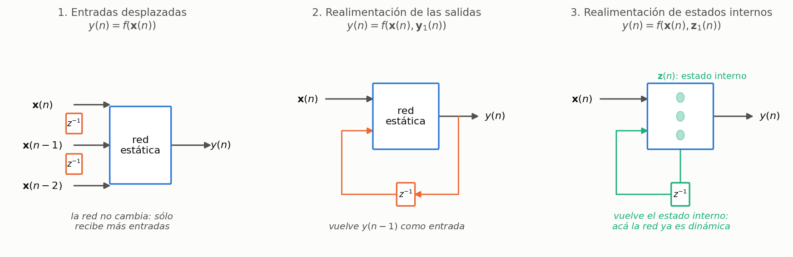
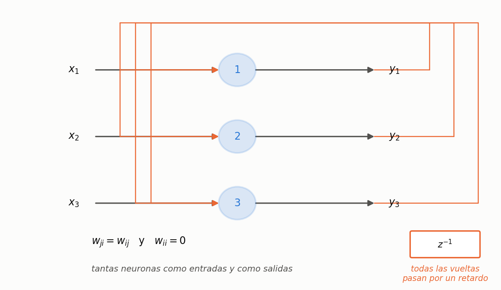
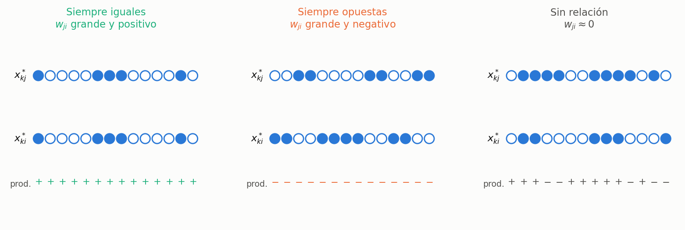
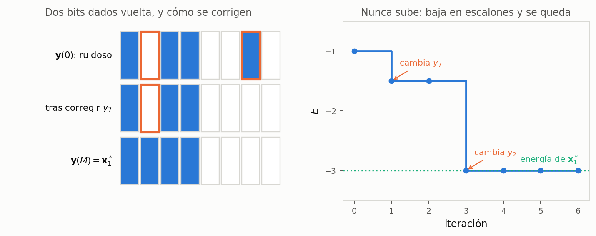
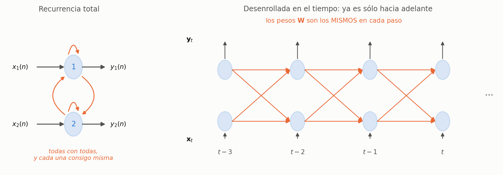
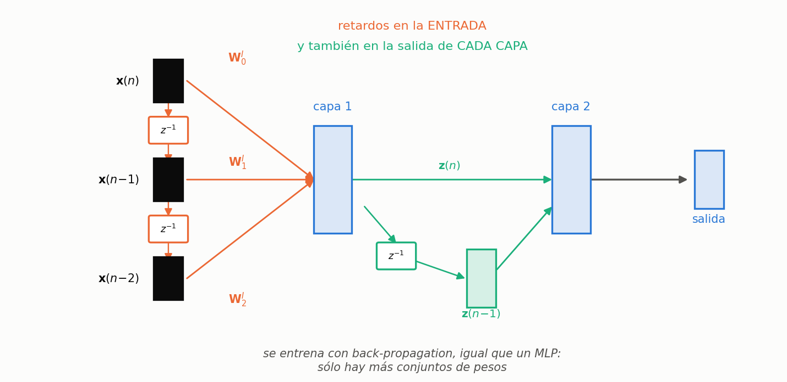

*Notación: $n$ y $t$ son el tiempo **discreto** (no se usa $t$ para tiempo continuo acá). En las diapositivas de la introducción, el subíndice indica el retardo: $\mathbf{y}_1(n)$ significa $\mathbf{y}(n-1)$. En las notas de BPTT el tiempo va como primer subíndice: $y_{t,j}$ es la salida de la neurona $j$ en el instante $t$.*

*Las figuras 1, 6, 10 y 12 reconstruyen diapositivas que en el PDF están vacías o son ilegibles: el profesor las dibujaba en el pizarrón.*

---

## 1. Por qué dinámicas

Todo lo que vimos hasta acá es **estático**: entra un patrón, sale una salida, se acabó. Si el problema tiene historia —predecir la temperatura de mañana, reconocer una palabra hablada— eso no alcanza. Hay tres formas de meterle tiempo a una red, y sólo la tercera la vuelve dinámica de verdad.



**Aproximación 1 — entradas desplazadas.** $y(n) = f(\mathbf{x}(n))$, donde $\mathbf{x}(n)$ se agranda para incluir $\mathbf{x}(n-1)$, $\mathbf{x}(n-2)$, … Si medías temperatura, humedad y viento (3 entradas) y expandís 5 instantes hacia atrás, la red pasa a tener $6 \times 3 = 18$ entradas.

**Aproximación 2 — realimentación de las salidas.** $y(n) = f(\mathbf{x}(n), \mathbf{y}_1(n))$. Vuelven las **salidas** de instantes anteriores. Tiene que ser $\mathbf{y}(n-1)$ como mínimo: la salida actual todavía no está calculada.

**Aproximación 3 — realimentación de estados internos.** $y(n) = f(\mathbf{x}(n), \mathbf{z}_1(n))$. Vuelven las salidas de las **neuronas ocultas**.

**Caso general:** $y(n) = f(\mathbf{x}(n), \mathbf{z}_1(n), \mathbf{y}_1(n))$ — las tres cosas a la vez.

> **IDEA DE FONDO — sólo la tercera cambia la red**
> En las aproximaciones 1 y 2 la red **sigue siendo estática**: la misma que ya sabés entrenar, sólo que con más entradas. Entra un patrón, sale una salida, sin ninguna dinámica interna. La memoria está afuera, en cómo armaste el vector de entrada. En la 3 la red guarda estado propio, y ahí sí empieza a comportarse dinámicamente. Es la distinción que más se pregunta de esta introducción.

### Claves de la sección 1

| Clave | Qué tenés que poder responder |
|---|---|
| Las tres aproximaciones | Entradas retardadas / salidas realimentadas / estados internos |
| $\mathbf{y}_1(n)$ | Es $\mathbf{y}(n-1)$: el subíndice es el retardo |
| Estático vs. dinámico | Las dos primeras no cambian la red; la tercera sí |

---

## 2. Clasificación


Las **TDNN** son las de la aproximación 1 generalizada, y tienen una propiedad muy práctica: se siguen entrenando con back-propagation, tal cual. Las **recurrentes** permiten conexiones hacia atrás —de una neurona a sí misma, a otras de la misma capa, o a capas anteriores— y ahí hay que inventar algo nuevo.

---

## 3. Redes de Hopfield: arquitectura y modelo



Tantas neuronas como entradas y como salidas, **una sola capa**, y cada neurona realimenta a **todas las demás** a través de un retardo.

$$y_j(n) = \operatorname{sgn}\!\left( \sum_{i=1}^{N} w_{ji}\, y_i(n-1) - \theta_j \right)
\qquad
\operatorname{sgn}(x) = \begin{cases} +1 & x > 0 \\ y_j(n-1) & x = 0 \\ -1 & x < 0 \end{cases}$$

con dos restricciones sobre los pesos:

$$w_{ji} = w_{ij}\ \ \forall\, i \neq j \qquad\qquad w_{ii} = 0\ \ \forall\, i$$

> **OJO — el caso $x = 0$ no es el de siempre**
> En el perceptrón, $\operatorname{sgn}(0)$ era $+1$ por convención. Acá vale $y_j(n-1)$: **la neurona se queda como estaba**. Tiene sentido en una red dinámica —si el estímulo neto es nulo, no hay razón para cambiar de estado— y es exactamente el tipo de detalle que se pregunta.

> **OJO — $w_{ii}=0$ no se entrena, se impone**
> No es que quede en cero: se fuerza en cero y no se toca nunca. Una neurona no se realimenta a sí misma. Y la simetría tampoco es un resultado: es una condición de diseño, y es la que hace que exista la función de energía de la sección 6.

**Generalidades** (diapositivas 14 a 16):

- Cada neurona tiene un **disparo probabilístico**: en cada paso se sortea cuál se actualiza.
- **Conexiones simétricas**.
- El entrenamiento es **no supervisado**: no hay salida deseada en ningún momento.
- Puede usarse como **memoria asociativa**: se accede **por contenido**, no por dirección. Le das una foto con ruido y te devuelve la que tenía guardada.

---

## 4. Almacenamiento: aprendizaje hebbiano

Dado un conjunto de **memorias fundamentales** (o datos limpios) $X^* = \{\mathbf{x}^*_k \in \mathbb{R}^N\}$, con $P$ patrones:

$$w_{ji} = \frac{1}{N} \sum_{k=1}^{P} x^*_{kj}\, x^*_{ki}$$

Cada peso es (casi) un promedio del **producto** de dos componentes a lo largo de todos los patrones. Hay tres casos, y conviene tenerlos dibujados:



| Cómo se comportan $i$ y $j$ | Cada producto | La suma | $w_{ji}$ |
|---|---|---|---|
| Siempre iguales ($+,+$ o $-,-$) | siempre $+1$ | se acumula | grande y **positivo** |
| Siempre opuestas | siempre $-1$ | se acumula | grande y **negativo** |
| Sin relación | mitad $+1$, mitad $-1$ | se cancela | $\approx 0$ |

> **IDEA DE FONDO — qué guarda realmente la red**
> No guarda los patrones: guarda **qué relación hay entre cada par de posiciones**. Que dos píxeles se prendan siempre juntos, o siempre al revés, o que no tengan nada que ver. Ésa es la regla de Hebb: los pesos crecen entre neuronas que se activan juntas, sin ninguna corrección de error de por medio.

> **OJO — se divide por $N$, no por $P$**
> $N$ es la **dimensión** (la cantidad de neuronas); $P$ es la cantidad de patrones, y es sobre lo que corre la sumatoria. Es fácil cruzarlos porque intuitivamente uno promediaría sobre los patrones.

**Observaciones** (diapositivas 20 a 22):

- El entrenamiento **NO es iterativo**. Se muestran los patrones una vez, se hace la cuenta y listo. Se sabe de antemano cuánto va a tardar.
- $w_{ji}$ es mayor cuando las neuronas $i$ y $j$ se tienen que activar juntas.
- La capacidad está limitada a $$P_{\max} = \frac{N}{2\ln(N)}$$ con un 1 % de error.

> **PARA LA DEFENSA — la capacidad es chiquísima, y conviene decir el número**
> Con $N = 100$ neuronas, $P_{\max} = 100 / (2 \ln 100) \approx 10.9$: **once** memorias fundamentales. Una imagen de $100\times100$ píxeles necesita $N = 10\,000$ neuronas y guarda unas 543. Que el límite crezca **más lento que $N$** es el gran problema práctico de estas redes.

### Un ejemplo a mano: guardar dos patrones

Con $N=8$ neuronas y dos memorias fundamentales. Las elijo **ortogonales** ($\mathbf{x}^*_1 \cdot \mathbf{x}^*_2 = 0$), que es el caso favorable:

$$\mathbf{x}^*_1 = (+1,+1,+1,+1,-1,-1,-1,-1)^{\mathsf{T}} \qquad
\mathbf{x}^*_2 = (+1,+1,-1,-1,+1,+1,-1,-1)^{\mathsf{T}}$$

Aplicando $w_{ji} = \frac{1}{8}\sum_{k=1}^{2} x^*_{kj}x^*_{ki}$, y mostrando $8\,\mathbf{W}$ para no arrastrar fracciones:

$$8\,\mathbf{W} = \begin{pmatrix}
0 & 2 & 0 & 0 & 0 & 0 & -2 & -2 \\
2 & 0 & 0 & 0 & 0 & 0 & -2 & -2 \\
0 & 0 & 0 & 2 & -2 & -2 & 0 & 0 \\
0 & 0 & 2 & 0 & -2 & -2 & 0 & 0 \\
0 & 0 & -2 & -2 & 0 & 2 & 0 & 0 \\
0 & 0 & -2 & -2 & 2 & 0 & 0 & 0 \\
-2 & -2 & 0 & 0 & 0 & 0 & 0 & 2 \\
-2 & -2 & 0 & 0 & 0 & 0 & 2 & 0
\end{pmatrix}$$

Cuatro cosas para leer de esa matriz:

- Es **simétrica** y tiene la **diagonal nula**, como tenía que ser.
- Las posiciones 1 y 2 valen lo mismo en los dos patrones: $w_{12} = +2/8$, grande y positivo.
- Las posiciones 1 y 7 son opuestas en los dos: $w_{17} = -2/8$, grande y negativo.
- Las posiciones 1 y 3 coinciden en $\mathbf{x}^*_1$ y se oponen en $\mathbf{x}^*_2$: los productos se cancelan y $w_{13} = 0$. **Ese cero es el tercer caso de Hebb, y es visible en la cuenta.**

> **OJO — dos patrones en ocho neuronas ya es mucho**
> $P_{\max} = 8/(2\ln 8) = 1{,}92$. Guardar dos ya está sobre el límite. Funciona igual **porque los elegí ortogonales**: la cota vale para patrones al azar. Si hubiera tomado dos parecidos, la recuperación fallaría — y eso es exactamente lo que produce los estados espúreos.

---

## 5. Recuperación

Dado un patrón $\mathbf{x}$ (incompleto, ruidoso…) se **fuerza** la salida inicial:

$$\mathbf{y}(0) = \mathbf{x}$$

y después se itera:

1. $j^* = \operatorname{rnd}(N)$ — se elige una neurona **al azar**;
2. $y_{j^*}(n) = \operatorname{sgn}\!\left( \sum_{i=1}^{N} w_{ji}\, y_i(n-1) \right)$;
3. volver a 1 hasta no observar cambios en las $y_j$.


**Observaciones** (diapositivas 25 a 28):

- El proceso de recuperación **SÍ es iterativo** (dinámico).
- En general **no se usan los $\theta_j$** — por eso desaparecen de la fórmula del paso 2.
- La salida final es $\mathbf{y}(M)$ cuando no hay cambios al **recorrer todas** las salidas.
- Se pueden obtener **estados espúreos y oscilaciones**.

> **IDEA DE FONDO — Hopfield es el espejo de todo lo anterior**
> En el perceptrón y el multicapa: entrenamiento **iterativo**, uso **directo**. En Hopfield: entrenamiento **directo**, uso **iterativo**. Está dado vuelta, y es la mejor forma de recordarlo.

> **OJO — el criterio de parada es una pasada completa, no una neurona**
> No alcanza con que la neurona que tocó no cambie. Hay que recorrer **todas** sin que ninguna cambie: recién ahí nada puede moverse en el futuro, porque a cada neurona le entra lo mismo que antes. Cuánto tarda no se sabe: pueden ser tres iteraciones o quinientas.

### El mismo ejemplo, recuperando

Le doy $\mathbf{x}^*_1$ con **dos bits dados vuelta** (las posiciones 2 y 7), o sea un 25 % de ruido, y dejo correr el algoritmo. Con la semilla que usé, el sorteo de neuronas dio 7, 1, 2, 2, 2, 7, …

| Paso | $j^*$ | $v_{j^*} = \sum_i w_{ji} y_i$ | $y_{j^*}$ nuevo | Estado | ¿Cambió? |
|:---:|:---:|:---:|:---:|---|:---:|
| — | — | — | — | $(+\,-\,+\,+\,-\,-\,+\,-)$ | — |
| 1 | 7 | $-0{,}25$ | $-1$ | $(+\,-\,+\,+\,-\,-\,-\,-)$ | **sí** |
| 2 | 1 | $+0{,}25$ | $+1$ | sin cambios | no |
| 3 | 2 | $+0{,}75$ | $+1$ | $(+\,+\,+\,+\,-\,-\,-\,-)$ | **sí** |
| 4–11 | varias | — | — | sin cambios | no |

En el paso 11 ya se recorrieron las ocho neuronas sin un solo cambio: **convergió**, y el resultado es exactamente $\mathbf{x}^*_1$.

Fijate el paso 3: $v_2 = +0{,}75$ es la suma de lo que "opinan" las otras siete neuronas sobre cuánto debería valer la 2. Como la mayoría del resto quedó consistente con $\mathbf{x}^*_1$, la arrastran al valor correcto. Ése es todo el mecanismo de la memoria asociativa.

---

## 6. Campos energéticos y estados espúreos


La forma de entender qué pasa: el almacenamiento **cava un paisaje** de picos y valles sobre el espacio de estados, y en el fondo de los valles quedan las memorias fundamentales. La recuperación arranca en el punto sucio $\mathbf{y}(0)=\mathbf{x}$ y **baja** por la ladera hasta el fondo del valle más cercano.

### La función de energía

La cátedra habla del campo energético pero no escribe la función. Es ésta:

$$E(\mathbf{y}) = -\frac{1}{2}\sum_{j}\sum_{i} w_{ji}\, y_j\, y_i$$

y con ella el "paisaje" deja de ser una metáfora: es una función concreta que le asigna un número a cada estado posible de la red. Leerla es fácil: si dos neuronas están en el estado que su peso "quiere" —las dos iguales y $w_{ji}>0$, o cruzadas y $w_{ji}<0$— ese término aporta **negativo** y baja la energía. Cada par contento baja $E$; cada par a disgusto la sube.

**Por qué el algoritmo de recuperación baja por el valle.** Cuando se actualiza una sola neurona $j$, sólo cambian los términos que la contienen. Llamando $v_j = \sum_i w_{ji} y_i$, ese aporte es $-y_j v_j$, y el cambio de energía al pasar de $y_j$ a $y_j^{\text{nuevo}}$ vale

$$\Delta E = -\left(y_j^{\text{nuevo}} - y_j\right) v_j$$

La regla es $y_j^{\text{nuevo}} = \operatorname{sgn}(v_j)$, así que $y_j^{\text{nuevo}}$ y $v_j$ **siempre tienen el mismo signo**. Si la neurona no cambia, $\Delta E = 0$. Si cambia, $(y_j^{\text{nuevo}} - y_j)$ tiene el signo de $v_j$ y el producto queda positivo, con lo cual $\Delta E < 0$.

$$\boxed{\;\Delta E \le 0 \text{ en todo paso}\;}$$

Como $E$ sólo puede tomar una cantidad **finita** de valores ($2^N$ estados) y nunca sube, no puede bajar para siempre: la red **tiene** que quedarse quieta. Eso es la convergencia.



En el ejemplo de las ocho neuronas: la energía arranca en $-1{,}0$, baja a $-1{,}5$ cuando se corrige $y_7$, baja a $-3{,}0$ cuando se corrige $y_2$, y ahí se queda. $-3{,}0$ es exactamente la energía de $\mathbf{x}^*_1$.

> **IDEA DE FONDO — acá se paga la simetría**
> La demostración de arriba usa que el aporte del par $(i,j)$ es **uno solo**, y eso vale porque $w_{ji}=w_{ij}$. Si los pesos no fueran simétricos, $E$ podría **subir**: lo verifiqué sobre 4000 configuraciones al azar — con $\mathbf{W}$ simétrica el mayor aumento observado fue exactamente $0$; con $\mathbf{W}$ asimétrica la energía llegó a subir $6{,}2$.
> Por eso $w_{ji}=w_{ij}$ no es un capricho: **es la condición que garantiza que la red converja**. Y $w_{ii}=0$ evita que una neurona se auto-refuerce y quede clavada por su propio peso.

### Estados espúreos y oscilaciones

Que la red converja no quiere decir que converja **a lo correcto**. El paisaje puede tener valles que nadie cavó a propósito:

- **Estados espúreos.** Mínimos locales que no corresponden a ninguna memoria almacenada. La red cae ahí y devuelve algo que se parece un poco a una memoria y un poco a otra, pero no es ninguna. Aparecen al pasarse de capacidad, o con memorias muy parecidas entre sí.
- **Oscilaciones.** La red queda dando vueltas entre dos estados y nunca se estabiliza: $+1, -1, +1, -1, \dots$

> **OJO — el negativo de una memoria también es un mínimo**
> $E(-\mathbf{y}) = E(\mathbf{y})$, porque la energía es cuadrática en $\mathbf{y}$. En el ejemplo: $E(-\mathbf{x}^*_1) = -3{,}0$, igual que $E(\mathbf{x}^*_1)$. O sea que **por cada memoria que guardás, guardás gratis su negativo**, y la red puede converger a él. Es el estado espúreo más fácil de nombrar si te lo preguntan.

### Qué tan chica es la capacidad

$$P_{\max} = \frac{N}{2\ln N}$$

| $N$ (neuronas) | $P_{\max}$ | Qué significa |
|---:|---:|---|
| 10 | 2,2 | dos memorias |
| 100 | 10,9 | once |
| 1 000 | 72,4 | setenta y dos |
| 10 000 | 543 | una imagen de $100\times100$ guarda 543 caras |

> **PARA LA DEFENSA — el número que hay que saber leer**
> $P_{\max}$ crece **más lento que $N$**: al pasar de 100 a 10 000 neuronas, las neuronas se multiplican por 100 y las memorias sólo por 50. Peor: los **pesos** crecen como $N^2$, así que con 10 000 neuronas tenés $10^8$ pesos para guardar 543 patrones. Es carísimo, y es la razón principal por la que Hopfield hoy no se usa como memoria en producción.

### Los tres finales posibles

| Final | Qué pasó | Por qué |
|---|---|---|
| La memoria correcta | cayó en el valle que corresponde | todo bien |
| Un **estado espúreo** | cayó en un mínimo local | pasado de capacidad, o memorias parecidas |
| **Oscilación** | no converge nunca | idem, o pesos no simétricos |

## 7. BPTT: la idea del desenrollado

Ahora una red **totalmente recurrente** que sí queremos entrenar: dos entradas, dos neuronas, todas conectadas con todas y cada una consigo misma.



El truco es **desenrollarla a lo largo del tiempo**: dibujar una copia de la red por cada instante, alimentando cada copia con la salida de la anterior. Lo que queda es una red **profunda pero puramente hacia adelante**, sin ninguna realimentación — y eso ya lo sabemos entrenar.

$$\mathbf{y}_t = \varphi\!\left( \mathbf{W}^{I} \mathbf{x}_t + \mathbf{W}\, \mathbf{y}_{t-1} \right)$$

o, en forma escalar, que es la que sirve para derivar:

$$y_{t,j} = \varphi(v_{t,j}) = \varphi\!\left( \sum_i w^{I}_{ji}\, x_{t,i} + \sum_i w_{ji}\, y_{t-1,i} \right)$$

con la sigmoidea simétrica $\varphi(v) = \dfrac{2}{1+e^{-v}} - 1$.

> **OJO — hay una sola copia de los pesos**
> Las capas del desenrollado **comparten los pesos**: el $\mathbf{W}$ que actúa en $t-3$ es el mismo objeto que el que actúa en $t$. La red que hay que entrenar al final es la chiquita. Toda la dificultad de BPTT sale de acá.

> **OJO — la clase y las notas dicen cosas distintas sobre eso**
> En la clase 030 dice que, por el peso compartido, hay que hacer *"alguna especie de promediación ponderada"*. Las notas lo resuelven bien y **no es un promedio: es una suma**. Si un mismo peso aporta al error por varios caminos, la regla de la cadena manda **sumar** todos los aportes. La respuesta que vale es la de las notas.

**BPTT truncada.** No se puede desenrollar hasta el infinito: con una secuencia de 10 000 pasos, 10 000 capas es inviable. Se elige una profundidad $P$ y se retropropaga sólo hasta ahí.

---

## 8. BPTT: la derivación para los pesos recurrentes

El error total sobre toda la secuencia:

$$E = \sum_{t=1}^{T} E_t = \frac{1}{2}\sum_{t=1}^{T}\sum_{k=1}^{N} e_{t,k}^2 = \frac{1}{2}\sum_{t=1}^{T}\sum_{k=1}^{N} (y_{t,k} - d_{t,k})^2$$

y el gradiente de un peso es la suma de lo que aporta en cada instante:

$$\frac{\partial E}{\partial w_{ji}} = \frac{\partial E_0}{\partial w_{ji}} + \frac{\partial E_1}{\partial w_{ji}} + \cdots + \frac{\partial E_T}{\partial w_{ji}}$$

### Paso 1 — el caso $t=0$

La red desenrollada tiene una sola capa. $E_0$ depende de los $\mathbf{W}$ que actúan sobre el estado inicial $\mathbf{y}_{-1}$, así que la cadena tiene tres factores:

$$\frac{\partial E_0}{\partial w_{ji}} = \frac{\partial E_0}{\partial y_{0,j}}\, \frac{\partial y_{0,j}}{\partial v_{0,j}}\, \frac{\partial v_{0,j}}{\partial w_{ji}}$$

**Primer factor.** De la sumatoria sobre $k$ sólo sobrevive $k=j$, porque $\partial e_{0,k}/\partial y_{0,j} = 1$ únicamente cuando $k=j$:

$$\frac{\partial E_0}{\partial y_{0,j}} = \frac{\partial}{\partial y_{0,j}} \frac{1}{2}\sum_k e_{0,k}^2 = \sum_k e_{0,k}\,\frac{\partial e_{0,k}}{\partial y_{0,j}} = e_{0,j}$$

**Segundo factor.** La derivada de la activación:

$$\frac{\partial y_{0,j}}{\partial v_{0,j}} = \varphi'(v_{0,j}) = \tfrac{1}{2}\,(1 - y_{0,j})(1 + y_{0,j})$$

**Tercer factor.** De $v_{0,j} = \sum_\ell w_{j\ell}\, y_{-1,\ell}$ sólo sobrevive $\ell = i$:

$$\frac{\partial v_{0,j}}{\partial w_{ji}} = y_{-1,i}$$

Juntando, y llamando

$$\delta_{0,j} \triangleq \frac{\partial E_0}{\partial y_{0,j}}\,\frac{\partial y_{0,j}}{\partial v_{0,j}} = (y_{0,j} - d_{0,j})\,\varphi'(v_{0,j})$$

queda simplemente

$$\frac{\partial E_0}{\partial w_{ji}} = \delta_{0,j}\, y_{-1,i}$$

### Paso 2 — el caso $t=1$: aparecen dos aportes

Con la red desenrollada en dos capas, $E_1$ depende del mismo $w_{ji}$ por **dos caminos**.


$$\frac{\partial E_1}{\partial w_{ji}} = \underbrace{\frac{\partial E_1}{\partial w_{1,ji}}}_{\text{directo}} + \underbrace{\frac{\partial E_1}{\partial w_{0,ji}}}_{\text{indirecto}}$$

*(La notación $w_{0,ji}$ y $w_{1,ji}$ es un abuso deliberado: son **el mismo peso**, actuando en dos instantes.)*

**El aporte directo** sale igual que antes:

$$\frac{\partial E_1}{\partial w_{1,ji}} = e_{1,j}\cdot \varphi'(v_{1,j}) \cdot y_{0,i} = \delta_{1,j}\, y_{0,i}$$

**El aporte indirecto** es el que tiene todo el trabajo. Acá $j$ es la neurona actuando en $t=0$, que recibe $y_{-1,i}$ y cuya salida alimenta a **todas** las neuronas $k$ de $t=1$:


$$\begin{aligned}
\frac{\partial E_1}{\partial w_{0,ji}}
&= \frac{\partial E_1}{\partial y_{0,j}}\, \frac{\partial y_{0,j}}{\partial v_{0,j}}\, \frac{\partial v_{0,j}}{\partial w_{0,ji}} \\[4pt]
&= \left(\frac{\partial}{\partial y_{0,j}} \frac{1}{2}\sum_{k=1}^{N} e_{1,k}^2\right) \cdot \varphi'(v_{0,j}) \cdot y_{-1,i} \\[4pt]
&= \sum_{k} e_{1,k}\, \frac{\partial e_{1,k}}{\partial y_{1,k}}\, \frac{\partial y_{1,k}}{\partial v_{1,k}}\, \frac{\partial v_{1,k}}{\partial y_{0,j}} \cdot \varphi'(v_{0,j})\; y_{-1,i} \\[4pt]
&= \sum_{k} e_{1,k} \cdot 1 \cdot \varphi'(v_{1,k}) \cdot w_{jk} \cdot \varphi'(v_{0,j})\; y_{-1,i} \\[4pt]
&= \left( \sum_{k} \delta_{1,k}\, w_{jk} \right) \varphi'(v_{0,j})\; y_{-1,i} \;=\; \delta_{0,j}\, y_{-1,i}
\end{aligned}$$

> **OJO — este $\delta_{0,j}$ no es el $\delta_{0,j}$ del paso 1**
> Se llaman igual y son cosas distintas. El del paso 1 venía de $E_0$; éste viene de retropropagar $E_1$ un paso hacia atrás. Las notas lo dicen explícitamente y proponen escribirlos $\delta_{0,j}^{(E_0)}$ y $\delta_{0,j}^{(E_1)}$ si hace falta desambiguar. En el pizarrón, decilo en voz alta cuando lo escribas.

### Paso 3 — la generalización

Sumando los dos aportes:

$$\frac{\partial E_1}{\partial w_{ji}} = \delta_{1,j}\, y_{0,i} + \delta_{0,j}\, y_{-1,i} = \sum_{\tau=1}^{0} \delta_{\tau,j}\, y_{\tau-1,i}$$

y para un $t$ cualquiera:

$$\boxed{\;\frac{\partial E_t}{\partial w_{ji}} = \sum_{\tau=t}^{0} \delta_{\tau,j}\, y_{\tau-1,i}\;}$$

con los $\delta$ definidos **recursivamente**:

$$\delta_{\tau,j} = \begin{cases}
(y_{\tau,j} - d_{\tau,j})\;\varphi'(v_{\tau,j}), & \text{si } \tau = t \\[8pt]
\left( \displaystyle\sum_k w_{jk}\, \delta_{\tau+1,k} \right)\varphi'(v_{\tau,j}), & \text{si } \tau < t
\end{cases}$$

El gradiente global y la actualización:

$$\frac{\partial E}{\partial w_{ji}} = \sum_{t=1}^{T} \sum_{\tau=t}^{0} \delta_{\tau,j}\, y_{\tau-1,i}
\qquad\qquad
w_{ji} \leftarrow w_{ji} - \eta\, \frac{\partial E}{\partial w_{ji}}$$

> **IDEA DE FONDO — es back-propagation, con el tiempo como profundidad**
> La recursión de $\delta$ es idéntica a la del multicapa: el $\delta$ de una neurona sale de los $\delta$ de las que alimenta, pesados por las conexiones, por la derivada de su propia activación. Lo único que cambió es que "la capa siguiente" ahora es **el instante siguiente**, y que los pesos son los mismos en todas las capas.

---

## 9. Los pesos de entrada

El desarrollo es el mismo; cambia **un solo factor**. En vez de

$$\frac{\partial v_{0,j}}{\partial w_{ji}} = \frac{\partial}{\partial w_{ji}} \sum_\ell w_{j\ell}\, y_{-1,\ell} = y_{-1,i}$$

ahora es

$$\frac{\partial v_{0,j}}{\partial w^{I}_{ji}} = \frac{\partial}{\partial w^{I}_{ji}} \sum_\ell w^{I}_{j\ell}\, x_{0,\ell} = x_{0,i}$$

y por lo tanto, con **los mismos $\delta$**:

$$\frac{\partial E_t}{\partial w^{I}_{ji}} = \sum_{\tau=t}^{0} \delta_{\tau,j}\, x_{\tau,i}$$

> **PARA LA DEFENSA — decilo así y ahorrás media pizarra**
> "Los $\delta$ son los mismos; lo único que cambia es el último factor de la cadena, que pasa de $y_{\tau-1,i}$ a $x_{\tau,i}$." Es cierto y es lo que se busca escuchar: el $\delta$ no sabe nada de por dónde entró la señal.

---

## 10. BPTT optimizado: el $\delta^*$ acumulativo

Esta sección está en las notas y **no se dio en clase**. Vale la pena, porque el algoritmo de arriba es caro.

El problema: para cada $t$ hay que recorrer todos los $\tau$ desde $t$ hasta 0, así que el trabajo crece con $T^2$. Pero si se escriben todos los aportes juntos y se **agrupan factores comunes**, aparece una estructura recursiva. Para $t=2$:

$$\frac{\partial E}{\partial w} =
\underbrace{\frac{\partial E_2}{\partial v_2}}_{\delta^*_2}\frac{\partial v_2}{\partial w}
+ \underbrace{\left(\frac{\partial E_1}{\partial v_1} + \delta^*_2 \frac{\partial v_2}{\partial v_1}\right)}_{\delta^*_1}\frac{\partial v_1}{\partial w}
+ \underbrace{\left(\frac{\partial E_0}{\partial v_0} + \delta^*_1 \frac{\partial v_1}{\partial v_0}\right)}_{\delta^*_0}\frac{\partial v_0}{\partial w}$$

Cada $\delta^*$ es el anterior **actualizado**: se lo multiplica por $\partial v_{t+1}/\partial v_t$ y se le suma el error directo de ese instante. En general:

$$\delta^*_t \triangleq \frac{\partial E_t}{\partial v_t} + \delta^*_{t+1}\, \frac{\partial v_{t+1}}{\partial v_t}$$

Desarrollando los dos términos —el directo es $(y_t - d_t)\varphi'(v_t)$, y el segundo es $\sum_k \delta^*_{t+1,k}\, w_{jk}\, \varphi'(v_{t,j})$— aparece $\varphi'$ como **factor común**, y queda:

$$\boxed{\;\delta^*_{t,j} = \left[ (y_{t,j} - d_{t,j}) + \sum_k w_{jk}\, \delta^*_{t+1,k} \right] \varphi'(v_{t,j})\;}$$

con lo cual los gradientes son una sola sumatoria:

$$\frac{\partial E}{\partial w_{ji}} = \sum_{t=T-1}^{0} \delta^*_{t,j}\, y_{t-1,i}
\qquad\qquad
\frac{\partial E}{\partial w^{I}_{ji}} = \sum_{t=T-1}^{0} \delta^*_{t,j}\, x_{t,i}$$

Desaparece la sumatoria interna sobre $\tau$: la complejidad baja de $O(T^2)$ a $O(T)$.

> **IDEA DE FONDO — la diferencia entre $\delta$ y $\delta^*$ en una línea**
> El $\delta$ común lleva el error de **un** instante hacia atrás, y hay que repetir el barrido para cada instante. El $\delta^*$ **acumula**: al ir de $T-1$ hacia 0 arrastra los errores de todos los instantes posteriores ya sumados, así que un solo barrido alcanza. Es la misma idea que hace lineal a back-propagation frente a calcular cada derivada por separado.

### Los dos algoritmos

**BPTT original — $O(T^2)$**

```
dW_I ← 0,  dW ← 0
para t = 0 hasta T-1:
    δ ← (y_t − d_t)
    para τ = t hasta 0:              # truncada: hasta máx(0, t−P)
        δ    ← δ ⊙ φ'(v_τ)
        dW_I ← dW_I + δ · x_τᵀ
        dW   ← dW   + δ · y_{τ−1}ᵀ
        δ    ← Wᵀ · δ
```

**BPTT optimizado — $O(T)$**

```
dW_I ← 0,  dW ← 0,  δ* ← 0
para t = T-1 hasta 0:
    δ*   ← (y_t − d_t) + δ*
    δ*   ← δ* ⊙ φ'(v_t)
    dW_I ← dW_I + δ* · x_tᵀ
    dW   ← dW   + δ* · y_{t−1}ᵀ
    δ*   ← Wᵀ · δ*
```

Las dos versiones **acumulan** los gradientes y actualizan los pesos al final de la secuencia.

### Control de dimensiones

Antes de escribir nada en el pizarrón conviene tener claro qué forma tiene cada cosa. Con $N$ neuronas y entradas de dimensión $M$:

| Objeto | Forma | Se lee |
|---|---|---|
| $\mathbf{x}_t$ | $M \times 1$ | la entrada en el instante $t$ |
| $\mathbf{y}_t$, $\mathbf{v}_t$, $\boldsymbol{\delta}_t$ | $N \times 1$ | uno por neurona |
| $\mathbf{W}^{I}$ | $N \times M$ | de la entrada a las neuronas |
| $\mathbf{W}$ | $N \times N$ | de las neuronas a sí mismas |
| $\boldsymbol{\delta}\cdot\mathbf{x}_t^{\mathsf{T}}$ | $N \times M$ | mismo tamaño que $\mathbf{W}^{I}$ ✓ |
| $\boldsymbol{\delta}\cdot\mathbf{y}_{t-1}^{\mathsf{T}}$ | $N \times N$ | mismo tamaño que $\mathbf{W}$ ✓ |
| $\mathbf{W}^{\mathsf{T}}\boldsymbol{\delta}$ | $N \times 1$ | otro $\boldsymbol{\delta}$: por eso la recursión cierra |

> **OJO — la transpuesta del paso hacia atrás**
> Hacia adelante se usa $\mathbf{W}$; hacia atrás, $\mathbf{W}^{\mathsf{T}}$. En la fórmula escalar eso es la diferencia entre $\sum_i w_{ji}\,y_{t-1,i}$ (se suma sobre el **segundo** índice) y $\sum_k w_{jk}\,\delta_{\tau+1,k}$ (se suma sobre el **primero**, mirándolo desde $j$). Es el error de signo/índice más común al escribir BPTT de memoria: si te queda $\mathbf{W}$ sin transponer en la vuelta, las dimensiones te avisan.

### Cuánto cuesta, y por qué se trunca

El BPTT original recorre, para cada $t$, todos los $\tau$ desde $t$ hasta 0. Eso es $1+2+\cdots+T \approx T^2/2$ pasos de retropropagación.

| Longitud $T$ | BPTT original ($\approx T^2/2$) | Truncado a $P=5$ ($\approx TP$) | Optimizado ($T$) |
|---:|---:|---:|---:|
| 10 | 50 | 50 | 10 |
| 100 | 5 000 | 500 | 100 |
| 1 000 | 500 000 | 5 000 | 1 000 |

**BPTT truncada** limita el bucle interno a $P$ pasos: `para τ = t hasta máx(0, t−P)`. Se pierde la capacidad de aprender dependencias más largas que $P$, pero se gana poder correrlo. En la clase 030 lo plantea así: *"podemos elegir tomar una memoria de dos instantes, el actual y el anterior, y hacer la expansión sobre esos"*.

> **PARA LA DEFENSA — truncar y optimizar no son lo mismo**
> **Truncar** cambia el resultado: descarta aportes reales del gradiente a cambio de velocidad. **Optimizar** con el $\delta^*$ da **exactamente el mismo gradiente** que el algoritmo original, sólo que reorganizado para calcularlo en un barrido. Se pueden combinar, pero son decisiones distintas.

---

## 12. Dos errores en las notas de BPTT

> **OJO — el índice del factor $\varphi'$ en el aporte indirecto**
> Las notas escriben $(1 - y_{0,i})(1 + y_{0,i})$ —con **$i$**— cuatro veces, en las dos secciones. Va con **$j$**: es la derivada de la activación de la neurona $j$ en $t=0$, y la $i$ es el índice de la entrada, que sólo aparece en el último factor de la cadena. Lo confirma el propio documento: la definición recursiva de $\delta_{\tau,j}$ que da unas líneas después lleva $j$.

> **OJO — falta el $\tfrac{1}{2}$ en la derivada de la sigmoide (otra vez)**
> Las notas definen $\varphi(v) = \frac{2}{1+e^{-v}} - 1$ y después usan $\varphi' = (1-y)(1+y)$. Con esa $\varphi$ la derivada correcta es $\varphi' = \tfrac{1}{2}(1-y)(1+y)$ —verificado contra la derivada numérica, error $1.3\times10^{-10}$—. La forma sin el $\tfrac{1}{2}$ corresponde a $\varphi(v) = \frac{2}{1+e^{-2v}}-1$.
> **Acá importa más que en el perceptrón**, porque el factor aparece **una vez por paso desenrollado** y se acumula: con cinco pasos hacia atrás el $\delta$ sale $2^5 = 32$ veces más grande. Es el mismo desliz de la diapositiva 45 de multicapa.
> El control de siempre: en $v=0$ la derivada tiene que dar $\tfrac{1}{2}$.

> **IDEA DE FONDO — por qué el $(1-y)(1+y)$ igual es una buena noticia**
> Las notas hacen notar algo que sí es correcto y vale repetir: ese factor **acota** el $\delta$, porque $|y| \le 1$ hace que nunca supere 1. Eso frena la **explosión de gradientes** que aparece cuando hay muchas capas desenrolladas. Con otras activaciones hay que agregar mecanismos extra —normalización, recorte de gradientes—.

---

## 13. TDNN: redes con retardos en el tiempo



Es la aproximación 1 llevada hasta el final: retardos **en la entrada** y también en la **salida de cada capa**. Cada conjunto de retardos trae su propia matriz de pesos ($\mathbf{W}^I_0$, $\mathbf{W}^I_1$, $\mathbf{W}^I_2$, …).

Se entrena con **back-propagation, tal cual**: no hay recurrencia, sólo más conjuntos de pesos.

> **OJO — cada retardo se paga en pesos**
> Si la entrada tiene $M$ componentes, la capa 1 tiene $H$ neuronas y ponés $R$ retardos en la entrada, no tenés una matriz $M \times H$ sino $R+1$ matrices: $(R+1)\,M\,H$ pesos. Con $M=3$, $H=10$ y $R=5$ pasás de 30 a 180 pesos **sólo en la primera capa**, y todavía faltan los retardos de las salidas de capa. Por eso la TDNN es simple de entrenar pero se vuelve grande enseguida.


Lo interesante es qué ve cada capa. La capa 1 mira tres instantes de la entrada: memoria **corta**. La capa 2 mira tres salidas de la capa 1, y cada una de ésas ya resumía tres instantes: es **la memoria de la memoria**, o sea memoria media. La capa de salida, memoria **larga**. Sin poner ningún retardo enorme, la red termina viendo muy hacia atrás.

Aplicaciones: reconocimiento del **habla**, sobre todo, y de **caracteres manuscritos**, donde hay que acordarse de los trazos anteriores para saber qué letra es la actual. Y el eje no tiene que ser tiempo: en una imagen puede ser **espacio**.

---

## 14. Elman y Jordan


Las dos son **parcialmente recurrentes**: guardan algo en una "capa de contexto" con retardo y lo vuelven a meter como entrada. La diferencia es **de dónde sale lo que se guarda**:

| | Qué realimenta | A dónde vuelve |
|---|---|---|
| **Elman** | la salida de la **capa oculta** | a la entrada de esa misma capa |
| **Jordan** | la salida de **la red** | a la entrada de la capa anterior |

En las dos se pueden encadenar varios retardos para tener más memoria. Y en las dos hay realimentación de verdad: no son *feed-forward* como la TDNN.

**Cómo se entrenan.** La cátedra deja el algoritmo afuera —*"no vamos a ver en detalle el algoritmo de entrenamiento, por lo menos vamos a dejar un panorama de cómo son las arquitecturas"*—, así que si te preguntan alcanza con la idea: la capa de contexto se trata como **una entrada más** en cada paso, con sus valores congelados (los del instante anterior), y con eso la red vuelve a ser hacia adelante y se entrena con back-propagation común. Es BPTT truncada a un solo paso. Si querés retropropagar más atrás, hay que desenrollar como en la sección 7.

> **PARA LA DEFENSA — cómo ordenar las cuatro arquitecturas**
> **TDNN**: sin recurrencia, sólo retardos; back-propagation común. **Elman y Jordan**: recurrencia parcial, por una capa de contexto. **BPTT**: recurrencia total, que se desenrolla para poder entrenarla. **Hopfield**: recurrencia total también, pero sin entrenamiento por gradiente — Hebb de una pasada.

---

## 15. Dónde encaja esta unidad en toda la materia

Es la última unidad, y es la que cierra varios ejes que venían abiertos. Vale tener el cuadro completo, porque en un oral es la clase de pregunta que se hace al final.

| Red | ¿Estática o dinámica? | Entrenamiento | ¿Iterativo al entrenar? | ¿Iterativo al usar? |
|---|---|---|---|---|
| Perceptrón simple | estática | supervisado (corrección de error / LMS) | sí | no |
| Perceptrón multicapa | estática | supervisado (back-propagation) | sí | no |
| Base radial | estática | **mixto**: no supervisado + supervisado | sí | no |
| **Hopfield** | **dinámica** | **no supervisado** (Hebb) | **no** | **sí** |
| **BPTT / Elman / Jordan** | **dinámica** | supervisado (BP sobre la red desenrollada) | sí | no |
| **TDNN** | estática con memoria | supervisado (back-propagation) | sí | no |

Tres lecturas que salen de ese cuadro:

**El eje supervisado / no supervisado.** Apareció por primera vez en base radial, con $k$-medias entrenando la capa radial. Hopfield es el segundo caso, y es más radical: **toda** la red se entrena sin salida deseada.

**El eje iterativo.** Hopfield es el único caso de toda la materia donde el entrenamiento es directo y el uso es iterativo. En todo lo demás es al revés. Si hay una sola frase para llevarse de esta unidad, es ésa.

**El eje del gradiente.** El método del gradiente recorre la materia entera con la misma forma —derivar el error, ir en contra del gradiente— y en cada unidad cambia sólo qué es "la capa siguiente": en el multicapa es la capa de arriba; en BPTT es **el instante siguiente**. Hopfield es la excepción: no hay gradiente en ningún lado.

> **PARA LA DEFENSA — la pregunta de cierre más probable**
> *"¿Por qué se llaman dinámicas?"* La respuesta corta: porque **la salida no queda determinada por la entrada actual**. En Hopfield, porque la red itera hasta estabilizarse y recién ahí hay salida. En las recurrentes, porque el estado interno arrastra la historia. Todo lo demás que vimos responde una entrada y termina.

---

## 16. Para la pizarra

### Guion: qué dibujar primero

| Si te preguntan… | Arrancá dibujando |
|---|---|
| ¿Por qué dinámicas? | Los tres bloques con el cuadradito $z^{-1}$, uno al lado del otro |
| Estático vs. dinámico | La aproximación 1 al lado de la 3, y señalá dónde está la memoria |
| Arquitectura de Hopfield | Tres neuronas en columna, entradas y salidas, y las flechas cruzadas con el retardo |
| Aprendizaje hebbiano | Dos filas de $\pm1$ y la fila de productos abajo |
| ¿Por qué falla Hopfield? | El paisaje de energía con tres valles y uno chiquito de más |
| BPTT | Primero la red chiquita recurrente, después las cuatro copias en fila |
| El aporte indirecto | La neurona $j$ en $t$ abanicándose hacia las $k$ de $t+1$ |
| TDNN | La columna de entradas retardadas, y recién después las capas |

### D1 — El $\delta$ de BPTT (aporte indirecto)

**Te preguntan:** deducí cómo se retropropaga el error a través del tiempo.

**Arrancás escribiendo:** $\dfrac{\partial E_1}{\partial w_{0,ji}} = \dfrac{\partial E_1}{\partial y_{0,j}}\dfrac{\partial y_{0,j}}{\partial v_{0,j}}\dfrac{\partial v_{0,j}}{\partial w_{0,ji}}$

1. Aclará que $j$ es la neurona en $t=0$ y que su salida alimenta a **todas** las $k$ de $t=1$. Dibujá el abanico.
2. Abrí el primer factor: $\frac{\partial}{\partial y_{0,j}}\frac{1}{2}\sum_k e_{1,k}^2$, y encadená por $y_{1,k}$ y $v_{1,k}$.
   **Llegás a:** $\sum_k e_{1,k}\,\varphi'(v_{1,k})\, w_{jk}$
3. Reconocé que $e_{1,k}\varphi'(v_{1,k})$ es $\delta_{1,k}$.
   **Llegás a:** $\left(\sum_k w_{jk}\,\delta_{1,k}\right)\varphi'(v_{0,j})\,y_{-1,i} = \delta_{0,j}\,y_{-1,i}$
4. Sumá el aporte directo y generalizá.
   **Llegás a:** $\dfrac{\partial E_t}{\partial w_{ji}} = \sum_{\tau=t}^{0} \delta_{\tau,j}\, y_{\tau-1,i}$

**Trampa 1:** el $\varphi'$ del aporte indirecto va con **$j$**, no con $i$.
**Trampa 2:** $\varphi' = \tfrac{1}{2}(1-y)(1+y)$, con el medio.
**Trampa 3:** los aportes se **suman**; no es un promedio.

**Cierre hablado:** *"es back-propagation con el tiempo haciendo de profundidad, y con los pesos compartidos entre capas"*.

### D2 — El $\delta^*$ acumulativo

**Te preguntan:** ¿cómo se evita el costo cuadrático?

1. Escribí los aportes de $E_0$, $E_1$ y $E_2$ en notación simplificada $\partial E/\partial v \cdot \partial v/\partial w$.
2. Agrupá por $\partial v_t/\partial w$.
   **Llegás a:** tres corchetes, cada uno con el anterior adentro.
3. Definí $\delta^*_t = \dfrac{\partial E_t}{\partial v_t} + \delta^*_{t+1}\dfrac{\partial v_{t+1}}{\partial v_t}$ y sacá $\varphi'$ como factor común.
   **Llegás a:** $\delta^*_{t,j} = \left[(y_{t,j}-d_{t,j}) + \sum_k w_{jk}\delta^*_{t+1,k}\right]\varphi'(v_{t,j})$

**Cierre hablado:** *"un solo barrido de $T-1$ a 0; el $\delta^*$ ya trae acumulado todo lo que viene después"*.

### D4 — Por qué Hopfield converge

**Te preguntan:** ¿por qué la recuperación termina?

**Arrancás escribiendo:** $E(\mathbf{y}) = -\frac{1}{2}\sum_j\sum_i w_{ji}\,y_j\,y_i$

1. Actualizás una sola neurona $j$: sólo cambian los términos que la contienen.
   **Llegás a:** $\Delta E = -(y_j^{\text{nuevo}} - y_j)\, v_j$, con $v_j = \sum_i w_{ji}y_i$
2. Argumentá el signo: la regla es $y_j^{\text{nuevo}} = \operatorname{sgn}(v_j)$, así que los dos tienen el mismo signo.
   **Llegás a:** si no cambia, $\Delta E = 0$; si cambia, $\Delta E < 0$
3. Cerrá con el argumento de finitud: $E$ nunca sube y sólo puede tomar $2^N$ valores.
   **Llegás a:** la red tiene que quedarse quieta

**Trampa:** el paso 1 **necesita** que $\mathbf{W}$ sea simétrica, para que el par $(i,j)$ aporte una sola vez. Decilo: es la razón de ser de esa restricción.

**Cierre hablado:** *"converge porque baja una función acotada que sólo puede tomar finitos valores; que converja a la memoria correcta ya es otra cosa"*.

### D3 — Los tres casos de Hebb

**Te preguntan:** justificá por qué $w_{ji} = \frac{1}{N}\sum_k x^*_{kj}x^*_{ki}$ aprende.

1. Dibujá dos filas de $\pm 1$ y la fila de productos.
2. Caso iguales: todos los productos $+1$ → suma grande positiva.
3. Caso opuestas: todos $-1$ → suma grande negativa.
4. Caso sin relación: mitad y mitad → se cancela, $w \approx 0$.

**Cierre hablado:** *"el peso guarda la relación entre dos posiciones, no las posiciones"*.

---

## 17. Formulario

| Qué | Fórmula |
|---|---|
| Caso general dinámico | $y(n)=f(\mathbf{x}(n),\mathbf{z}_1(n),\mathbf{y}_1(n))$ |
| Hopfield: modelo | $y_j(n)=\operatorname{sgn}\!\left(\sum_i w_{ji}y_i(n-1)-\theta_j\right)$ |
| Hopfield: restricciones | $w_{ji}=w_{ij}\ \forall i\neq j$; $\;w_{ii}=0$ |
| Hopfield: almacenamiento | $w_{ji}=\frac{1}{N}\sum_{k=1}^{P}x^*_{kj}x^*_{ki}$ |
| Hopfield: energía | $E(\mathbf{y})=-\frac{1}{2}\sum_j\sum_i w_{ji}y_jy_i$, y $\Delta E \le 0$ en todo paso |
| Hopfield: capacidad | $P_{\max}=\dfrac{N}{2\ln N}$ (1 % de error) |
| Hopfield: recuperación | $\mathbf{y}(0)=\mathbf{x}$; $\;j^*=\operatorname{rnd}(N)$; $\;y_{j^*}(n)=\operatorname{sgn}\!\left(\sum_i w_{ji}y_i(n-1)\right)$ |
| RNN: paso adelante | $\mathbf{y}_t=\varphi(\mathbf{W}^I\mathbf{x}_t+\mathbf{W}\mathbf{y}_{t-1})$ |
| Error de la secuencia | $E=\frac{1}{2}\sum_t\sum_k (y_{t,k}-d_{t,k})^2$ |
| Derivada de la activación | $\varphi'(v)=\frac{1}{2}(1-y)(1+y)$ |
| $\delta$ recursivo | $\delta_{\tau,j}=\left(\sum_k w_{jk}\delta_{\tau+1,k}\right)\varphi'(v_{\tau,j})$, con $\delta_{t,j}=e_{t,j}\varphi'(v_{t,j})$ |
| Gradiente (recurrentes) | $\frac{\partial E_t}{\partial w_{ji}}=\sum_{\tau=t}^{0}\delta_{\tau,j}y_{\tau-1,i}$ |
| Gradiente (entrada) | $\frac{\partial E_t}{\partial w^I_{ji}}=\sum_{\tau=t}^{0}\delta_{\tau,j}x_{\tau,i}$ |
| $\delta^*$ acumulativo | $\delta^*_{t,j}=\left[(y_{t,j}-d_{t,j})+\sum_k w_{jk}\delta^*_{t+1,k}\right]\varphi'(v_{t,j})$ |

## Errores típicos

| Error | Cómo se detecta |
|---|---|
| Decir que la aproximación 1 vuelve dinámica a la red | La red no cambia: sólo recibe más entradas |
| Poner $\operatorname{sgn}(0)=+1$ en Hopfield | Acá vale $y_j(n-1)$: la neurona se queda como estaba |
| Dividir por $P$ en la regla de Hebb | Se divide por $N$, la dimensión; la suma corre sobre los $P$ patrones |
| Decir que Hopfield entrena iterando | Al revés que todo lo anterior: entrena directo, **usa** iterando |
| Parar la recuperación con una neurona quieta | Hay que recorrer **todas** sin cambios |
| Promediar los aportes en BPTT | Se **suman**: es la regla de la cadena sobre un peso compartido |
| Usar $\varphi'=(1-y)(1+y)$ | Falta el $\frac{1}{2}$. En $v=0$ tiene que dar $0{,}5$ |
| Poner $i$ en el $\varphi'$ del aporte indirecto | Va $j$: es la activación de la neurona, no de la entrada |
| Confundir Elman con Jordan | Elman realimenta la **oculta**; Jordan, la **salida** |
| Olvidar $\mathbf{W}^{\mathsf{T}}$ en el paso hacia atrás | Las dimensiones no cierran: hacia adelante $\mathbf{W}$, hacia atrás $\mathbf{W}^{\mathsf{T}}$ |
| Decir que truncar y optimizar son lo mismo | Truncar cambia el gradiente; el $\delta^*$ da el mismo, más rápido |

## Autoevaluación

1. Explicá las tres aproximaciones y cuál vuelve dinámica a la red.
2. ¿Qué significa el subíndice en $\mathbf{y}_1(n)$?
3. Dibujá la arquitectura de Hopfield y justificá $w_{ii}=0$ y la simetría.
4. ¿Por qué $\operatorname{sgn}(0)=y_j(n-1)$ y no $+1$?
5. Justificá la regla de Hebb con los tres casos.
6. Calculá $P_{\max}$ para $N=100$ y comentá el resultado.
7. ¿Por qué el entrenamiento no es iterativo y la recuperación sí?
8. ¿Cuál es el criterio de parada de la recuperación, y por qué ése?
9. Dibujá el campo energético y explicá los estados espúreos y las oscilaciones.
10. Explicá el desenrollado y por qué permite usar back-propagation.
11. ¿Qué problema trae que los pesos sean compartidos, y cómo se resuelve?
12. Deducí el aporte indirecto de $\partial E_1/\partial w_{ji}$.
13. Escribí la definición recursiva de $\delta_{\tau,j}$ y explicá los dos casos.
14. ¿Qué cambia en la derivación para los pesos de entrada?
15. ¿Qué es el $\delta^*$ y por qué baja la complejidad a $O(T)$?
16. ¿Qué es BPTT truncada y por qué hace falta?
17. Dibujá una TDNN y explicá la "memoria de la memoria".
18. Diferencia entre Elman y Jordan, y cómo se entrenan.
19. Escribí la función de energía y demostrá que $\Delta E \le 0$.
20. ¿Por qué la simetría de $\mathbf{W}$ es indispensable y no un detalle?
21. ¿Por qué el negativo de una memoria es siempre un mínimo?
22. Armá el cuadro estático/dinámico y supervisado/no supervisado de toda la materia.
