*Los resúmenes de cada unidad explican **por qué** funciona cada pieza, con las derivaciones y los ejemplos numéricos. Este archivo es sólo el **qué**: los algoritmos, uno atrás del otro, en el orden en que se ejecutan. Cada ecuación con un párrafo debajo que dice qué significa. Sirve para repasar de corrido y para desarrollar en la pizarra.*

| # | Algoritmo | Supervisado | Entrenamiento |
|---|---|---|---|
| 1 | Perceptrón simple — corrección de error | sí | iterativo |
| 2 | Perceptrón simple — gradiente (LMS) | sí | iterativo |
| 3 | Perceptrón multicapa — back-propagation | sí | iterativo |
| 4 | Base radial | mixto | dos fases |
| 5 | Hopfield | no | **directo** |
| 6 | BPTT | sí | iterativo |
| 7 | SOM | no | iterativo |
| 8 | LVQ1 | sí | iterativo |
| 9 | Capacidad de generalización y evaluación | — | *procedimiento* |
| 10 | Bases estadísticas: clasificador de Bayes | — | *marco teórico* |
| 11 | $k$ vecinos más cercanos | sí | **ninguno** (guarda los datos) |
| 12 | Naïve Bayes | sí | directo (cuenta frecuencias) |
| 13 | Árboles de decisión | sí | recursivo, voraz |
| 14 | Máquinas de vectores de soporte | sí | optimización (sin mínimos locales) |
| 15 | Ensambles: bagging, boosting, stacking | sí | según el esquema |

La sección 0 son las generalidades de las unidades 1 y 2; las 1 a 9, las redes y el protocolo de evaluación; la 10, las bases estadísticas; las 11 a 15, los **algoritmos tradicionales** de aprendizaje automático, que se piden a nivel conceptual: la idea, la fórmula de decisión cuando la hay, y ventajas y desventajas.


**Cómo está armada cada sección.** Arriba, el recuadro violeta **«contame sobre…»**: la respuesta de un minuto para cuando te piden que desarrolles el tema, en el orden *qué es → cómo está armado → cómo aprende → qué lo distingue → su límite*. Después la idea de fondo, las ecuaciones en orden, y al final la respuesta de treinta segundos con las repreguntas.

**Los recuadros «OJO» e «IDEA DE FONDO» sueltos** en medio de una sección son los **conceptos que se preguntan sin fórmula**: regiones de decisión, qué es una gaussiana, qué significa hebbiano, estático contra dinámico… Cada uno remite al resumen de la unidad, donde está desarrollado.


**Convenciones que cambian entre algoritmos** — las que más se mezclan en la pizarra:

- **Umbral:** entra como un peso más, $w_0$, con entrada fija $x_0 = -1$.
- **Signo del error:** perceptrón y multicapa usan $e = d - y$ y la regla **suma**; RBF (fase 2) y BPTT usan $e = y - d$ y la regla **resta**. Es la misma cuenta escrita al revés.
- **Paso:** $\eta$ en la corrección de error, $\mu$ en LMS y back-propagation (la equivalencia entre ellos se indica en cada sección), $\alpha$ en LVQ.
- **Derivada de la sigmoide simétrica** siempre en función de la salida: $\varphi'(v) = \tfrac12(1+y)(1-y)$.

---

\newpage

# 0. Generalidades — unidades 1 y 2

> **SI TE DICEN — «¿qué es una red neuronal y en qué se inspira?»**
> «Es un sistema formado por **muchas unidades simples** —neuronas— **muy interconectadas**, que procesan **en paralelo**, y cuyo conocimiento **no está programado** sino guardado en la **fuerza de las conexiones** (los pesos), que se ajustan **aprendiendo de ejemplos**. La inspiración es el cerebro: miles de millones de neuronas lentas que, trabajando en paralelo, resuelven percepción y reconocimiento mejor que cualquier computadora secuencial. Del cerebro se copia la idea —suma ponderada de entradas, umbral, aprendizaje en las sinapsis—, no el detalle biológico.»

*Contexto de la materia, no desarrollo. Va para ubicar todo lo que sigue.*

## Las técnicas de la inteligencia computacional

La **inteligencia computacional** reúne técnicas que resuelven problemas **aprendiendo o adaptándose a partir de datos**, en lugar de programar reglas explícitas (eso es la IA clásica, simbólica, **deductiva**; ésta es **inductiva**, aprende de ejemplos). Las cuatro familias del programa:

| Técnica | Se inspira en | Para qué |
|---|---|---|
| **Redes neuronales** | el cerebro | aprender funciones y clasificar a partir de ejemplos |
| **Lógica borrosa** | el razonamiento aproximado humano | razonar con conceptos imprecisos («temperatura alta») |
| **Computación evolutiva** | la evolución natural | optimizar buscando con poblaciones de soluciones |
| **Inteligencia colectiva** | colonias de hormigas, bandadas | optimizar con muchos agentes simples que cooperan |

Este parcial es la primera: redes neuronales y aprendizaje automático.

## El cerebro contra la computadora

| | Cerebro | Computadora clásica |
|---|---|---|
| Unidades | $\sim10^{11}$ neuronas, **lentas** (milisegundos) | pocos procesadores, **rapidísimos** (nanosegundos) |
| Conexiones | $\sim10^{14}$–$10^{15}$ sinapsis: cada neurona con miles | pocas y fijas |
| Procesamiento | **masivamente paralelo** y distribuido | **secuencial** (Von Neumann) |
| Memoria | **en las conexiones**, distribuida, direccionable por contenido | en posiciones, direccionable por dirección |
| Cómo adquiere conocimiento | **aprende** de la experiencia | se **programa** |
| Si se rompe una parte | se degrada suavemente: **tolerante a fallas** | falla |
| Bueno para | percepción, reconocimiento, datos ruidosos | cálculo exacto y repetitivo |

**La limitación del cálculo computacional**, en una frase: un problema que el cerebro resuelve en décimas de segundo —reconocer una cara— le cuesta muchísimo a una computadora secuencial millones de veces más rápida, porque el cerebro gana **por paralelismo y por aprender**, no por velocidad. Ésa es la motivación de las redes neuronales.

## La neurona biológica y las escalas del cerebro

**La neurona:** las **dendritas** reciben los estímulos de otras neuronas; el **cuerpo** (soma) los acumula; si la suma supera un **umbral**, sale un pulso por el **axón** — **todo o nada**. La conexión entre el axón de una y la dendrita de otra es la **sinapsis**: puede ser **excitatoria** (empuja a disparar) o **inhibitoria** (frena), y fuerte o débil. **Aprender es modificar las sinapsis**, no las neuronas.

**Las escalas de organización estructural**, de la más chica a la más grande: **moléculas** → **sinapsis** → **microcircuitos** neuronales → **árboles dendríticos** → **neuronas** → **circuitos locales** → **circuitos interregionales** → **sistema nervioso central**. La idea: la capacidad del cerebro no está en ningún nivel aislado sino en la **organización** — unidades simples que, conectadas en niveles cada vez más grandes, producen comportamiento complejo. Las redes artificiales copian sólo el nivel de la neurona y sus conexiones.

## El modelo de neurona

$$v = \sum_i w_i x_i - u = \langle \mathbf{w}, \mathbf{x}\rangle \quad (x_0 = -1,\ w_0 = u) \qquad y = \varphi(v)$$

| Biología | Modelo |
|---|---|
| sinapsis | peso $w_i$: **positivo** excitatoria, **negativo** inhibitoria, magnitud = fuerza |
| acumulación en el soma | suma ponderada: el **campo local** $v$ |
| umbral de disparo | umbral $u$ (como peso $w_0$ con entrada $-1$) |
| pulso por el axón | función de activación $\varphi$ |

**Funciones de activación:** **signo** (todo o nada, $\pm1$), **lineal** (sin saturar), **lineal a tramos**, **sigmoide** (la forma de la S, derivable: la del multicapa) y **gaussiana** (local: la de la RBF). Lo que el modelo deja afuera: la dinámica temporal de los pulsos y la química de la sinapsis.

## Características de las redes neuronales

- **Aprenden de ejemplos** (adaptabilidad): no se programan, se entrenan, y se pueden reentrenar si el entorno cambia.
- **Generalizan:** responden bien ante datos que no vieron — lo que realmente importa (sección 9).
- **No linealidad:** con activaciones no lineales aproximan relaciones complejas.
- **Paralelismo y procesamiento distribuido:** el conocimiento está repartido en todos los pesos.
- **Tolerancia a fallas y al ruido:** si se daña una neurona o una entrada viene sucia, el desempeño se degrada suavemente, no colapsa.
- **Contracara:** son **cajas negras** (poco interpretables) y necesitan datos y ajuste de hiperparámetros.

## Clasificación de las arquitecturas

| Criterio | Tipos | Ejemplos de la materia |
|---|---|---|
| **Flujo de la señal** | **hacia adelante** (*feedforward*): la señal va de la entrada a la salida y termina | perceptrón simple, multicapa, RBF, TDNN |
| | **recurrentes** (realimentadas): hay conexiones hacia atrás | Hopfield, Elman, Jordan, BPTT; la cátedra pone también al SOM (por las conexiones laterales) |
| **Cantidad de capas** | **monocapa** / **multicapa** | perceptrón simple, Hopfield / multicapa, RBF |
| **Conectividad** | **total** / **parcial** | Hopfield (todas con todas) / redes con capas |

## Clasificación de los procesos de aprendizaje

Dos ejes que **no hay que mezclar**:

| Eje | Opciones | Ejemplos |
|---|---|---|
| **Tipo** — qué información hay | **supervisado** (hay salida deseada) | perceptrón, multicapa, LVQ, BPTT |
| | **no supervisado** (sólo entradas) | SOM, $k$-medias, Hopfield |
| | **por refuerzo** (sólo una señal de premio o castigo) | — |
| | **híbrido** | RBF (fase 1 no supervisada + fase 2 supervisada) |
| **Regla** — cómo cambian los pesos | **corrección de error** | perceptrón, LMS, back-propagation |
| | **competitivo** (gana uno) | SOM, LVQ, $k$-medias |
| | **hebbiano** (correlación) | Hopfield |
| | **Boltzmann** (estocástico) | — (sólo se nombra) |

> **OJO — LVQ combina los dos ejes**
> Es **supervisado** por el tipo (usa etiquetas) y **competitivo** por la regla (gana el más cercano). Por eso la pregunta «¿supervisado o competitivo?» está mal planteada: son ejes distintos. (Resumen `01-aprendizaje-profundo`, §1, y `01-perceptron-simple-y-gradiente`, §1 a §3.)

---

\newpage

# 1. Perceptrón simple — corrección de error

> **SI TE DICEN — «contame sobre el perceptrón simple»**
> «Es el modelo más simple de neurona artificial. Hace el producto interno entre sus pesos y la entrada —con el umbral metido como un peso más, con entrada fija $-1$— y le aplica la función signo: la salida es $\pm1$, así que clasifica en dos clases. Geométricamente traza un **hiperplano** y dice de qué lado cayó cada punto. Se entrena con supervisión, patrón por patrón: si acierta no se toca nada; si se equivoca, a los pesos se les suma $\tfrac{\eta}{2}$ por el error por la entrada, y eso **gira el hiperplano** hacia el lado correcto. Se repite hasta una pasada completa sin errores. Y el límite es la clave: eso está garantizado **sólo si el problema es linealmente separable**; con el XOR no converge nunca, y eso es lo que motiva el multicapa.»


> **IDEA DE FONDO — en qué consiste**
> Una sola neurona que traza una **recta** (un hiperplano) y dice de qué lado cayó cada punto. Tiene dos partes que se repiten patrón por patrón: **calcular la salida** y, **sólo si se equivocó, mover la recta**. La imagen para recordarlo: la recta está mal puesta, entra un punto que quedó del lado equivocado, y la recta **gira un poco hacia ese punto**. Si el punto ya estaba bien, no pasa nada. Repetido muchas veces, la recta se acomoda hasta no equivocarse con ninguno — y eso está garantizado **sólo si los datos se pueden separar con una recta**.


## Datos de partida

$$\{(\mathbf{x}(n),\ d(n))\}, \qquad x_0 = -1$$

Pares entrada–salida deseada. La componente $x_0=-1$ es fija y existe para que el umbral entre como un peso más, $w_0 = u$, y no haya que tratarlo aparte.

## Salida

$$y = \varphi\big(\langle \mathbf{w}, \mathbf{x}\rangle\big)$$

Se hace el producto interno entre los pesos y la entrada, y se le aplica la función de activación. Todo el perceptrón es eso.

$$\langle \mathbf{w}, \mathbf{x}\rangle = 0$$

Los puntos donde el producto interno da cero son la **frontera de decisión**: un hiperplano que parte el espacio de entrada en dos semiplanos.

## Adaptación

$$\mathbf{w}(n+1) = \mathbf{w}(n) + \frac{\eta}{2}\,\big[d(n)-y(n)\big]\,\mathbf{x}(n)$$

Si la salida coincide con la deseada, el corchete es cero y los pesos no se tocan. Si no coincide, los pesos se mueven en la dirección de la entrada, con el signo del error: la frontera gira hacia el lado que corrige ese patrón.

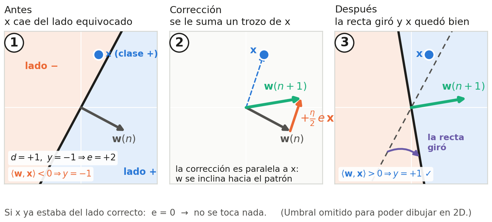{width=100%}

## Parada

$$d(n) = y(n) \quad \forall n$$

Se termina cuando una pasada completa por el conjunto no produce ninguna corrección. Está garantizado que eso pasa **sólo si el problema es linealmente separable**.

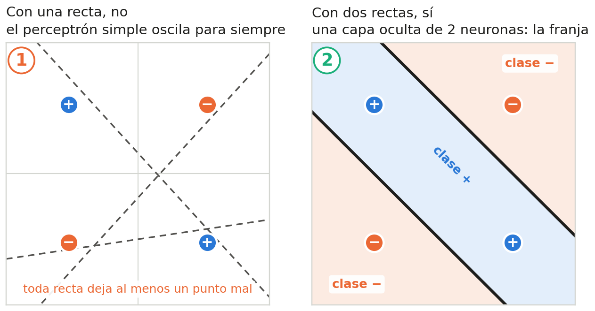{width=78%}

> **OJO — por qué no alcanza el perceptrón simple, dicho con el gradiente**
> Con la función signo la regla ni siquiera converge en el XOR: la recta oscila para siempre. Si se la cambia por LMS o por una **sigmoide** para poder derivar, el algoritmo sí converge, pero **al mínimo de un error que no es cero**: la superficie de error de una sola neurona no tiene ningún punto con error nulo, porque ese punto sería una recta que separa el XOR, y no existe. El gradiente hace bien su trabajo —encuentra la *mejor* recta— y la mejor recta igual se equivoca en al menos un patrón. **El límite no es del algoritmo de entrenamiento, es del modelo**: una neurona sola sólo puede trazar un hiperplano.
> **La construcción a mano con tres neuronas** (rara vez se pide, está en `01-perceptron-simple-y-gradiente`, §13 a §17): dos neuronas de la primera capa trazan **dos rectas paralelas** que dejan los dos patrones de una clase en la franja del medio; la tercera recibe esas dos salidas, y en ese plano nuevo el problema **ya es linealmente separable**. La capa oculta no separa: **cambia la representación** para que una recta alcance.


### Cómo se lee la regla

$e(n)$ es un **escalar** y $\mathbf{x}(n)$ un **vector**, así que la corrección $\tfrac{\eta}{2}e(n)\mathbf{x}(n)$ es un vector **en la dirección del patrón de entrada**, con magnitud proporcional al error y signo según si la salida se quedó corta o larga. Cada paso empuja a $\mathbf{w}$ a lo largo de $\mathbf{x}$, y como $\mathbf{w}$ es la normal de la frontera, la recta **gira** hacia el lado que corrige ese patrón.

> **PARA LA DEFENSA — la respuesta de treinta segundos**
> *«Una neurona que traza un hiperplano y dice de qué lado cayó cada punto. Se le muestra un patrón: si acierta no se toca nada, y si se equivoca los pesos se mueven en la dirección del patrón, con el signo del error. Eso gira la frontera hacia el lado correcto. Se repite hasta una pasada completa sin correcciones, y eso está garantizado sólo si los datos son linealmente separables.»*
> **La repregunta segura:** ¿y si no son separables? No converge: queda oscilando. Ése es el límite que motiva el multicapa, y el ejemplo es el XOR.

---

\newpage

# 2. Perceptrón simple — regla del gradiente (LMS)

> **SI TE DICEN — «contame sobre LMS»**
> «Es la misma neurona con otra lógica de entrenamiento. En vez de corregir sólo cuando se equivoca, defino una función que **mide el error** —el error cuadrático— y muevo los pesos **en contra de su gradiente**, que es la dirección de máximo descenso. Para poder derivar uso la neurona **lineal**, sin el signo, porque el signo no es derivable. La cuenta da la regla de Widrow-Hoff: $\mathbf{w}(n+1) = \mathbf{w}(n) + 2\mu\,e\,\mathbf{x}$, **velocidad por error por entrada**. El punto delicado es $\mu$: grande, oscila y se queda con el último patrón; chico, converge pero muy lento. Lo importante es que fija **el esquema de todo lo supervisado que viene después**: multicapa, radial y BPTT también bajan por el gradiente, sólo que con un gradiente más difícil de calcular.»


> **IDEA DE FONDO — en qué consiste**
> La misma neurona, pero con otra filosofía: en vez de reaccionar sólo cuando se equivoca, **define un número que mide lo mal que está** y se mueve siempre en la dirección que más lo baja. Tres partes: **definir el criterio de error**, **derivarlo** respecto de los pesos, y **moverse en contra de esa derivada**. La imagen: una pelota bajando por una ladera, donde la altura es el error y la posición son los pesos. Es el molde de todos los algoritmos supervisados que vienen después — multicapa, radial y BPTT son este mismo esquema con un gradiente más difícil de calcular.


*Mismo modelo de neurona; cambia de dónde sale el ajuste. Acá no se corrige el error, se minimiza una función.*

## Criterio

$$e^2(n) = \big[d(n) - \langle \mathbf{w}(n), \mathbf{x}(n)\rangle\big]^2, \qquad e(n) = d(n) - y(n)$$

Se define una medida de lo mal que está la red para el patrón actual: el error al cuadrado. Se trabaja en el **caso lineal** —$y = \langle \mathbf{w},\mathbf{x}\rangle$, sin activación— porque $\operatorname{sgn}$ no es derivable. Y el criterio va **sin** el $\tfrac12$: por eso el resultado lleva un $2\mu$.

## Regla del gradiente

$$\Delta \mathbf{w}(n) = -\mu\,\nabla_{\mathbf{w}}\,e^2(n)$$

Los pesos se mueven en la dirección **opuesta** al gradiente, que es la de máximo crecimiento del error: se baja por la superficie de error. $\mu$ dice qué tan grande es el paso.

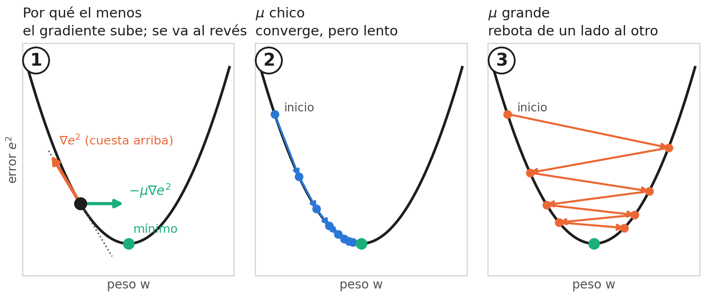{width=100%}

## LMS (Widrow-Hoff)

$$\mathbf{w}(n+1) = \mathbf{w}(n) + 2\mu\,e(n)\,\mathbf{x}(n)$$

Resolviendo el gradiente para este criterio queda esto: paso, por error, por entrada. Es la misma forma que la corrección de error, y de hecho coinciden con $\eta = 4\mu$.

### Cómo se lee la regla

La estructura **velocidad de aprendizaje $\times$ error $\times$ entrada** es la misma de la sección anterior, pero el origen es distinto: no sale de reaccionar ante un error, sale de **derivar una función y moverse en contra del gradiente**. Y ésa es la forma que se va a repetir en el multicapa, en la fase 2 de las radiales y en BPTT — lo único que cambia en cada uno es **cuán difícil es calcular ese gradiente**.

> **PARA LA DEFENSA — la respuesta de treinta segundos**
> *«Misma neurona, otra filosofía: en vez de corregir cuando se equivoca, defino un número que mide lo mal que está —el error cuadrático— y me muevo siempre en la dirección que más lo baja, que es la opuesta al gradiente. La cuenta se hace en el caso lineal, sin activación, porque el signo no es derivable. El resultado es paso por error por entrada, y coincide con la corrección de error salvo una constante.»*
> **Las dos repreguntas seguras:** por qué el menos (el gradiente apunta cuesta **arriba**, al máximo crecimiento del error) y qué pasa con $\mu$ (grande: oscila y **la red se aprende el último patrón y se olvida los anteriores**; chico: converge pero lentísimo).

> Acá aparece por primera vez la estructura que se repite en todo lo que sigue: **velocidad de aprendizaje, por error, por entrada**.

---

\newpage

# 3. Perceptrón multicapa — back-propagation

> **SI TE DICEN — «contame sobre el perceptrón multicapa»**
> «Agrega **capas ocultas** con activación sigmoidea —la simétrica, entre $-1$ y $1$—. Combinando semiplanos puede formar regiones arbitrarias, así que ya no depende de que el problema sea lineal: resuelve el XOR. Se entrena con **retropropagación**, que es descenso por gradiente del error cuadrático, en tres pasos por patrón: **hacia adelante** capa por capa, **error** en la salida, y **deltas hacia atrás**. El problema central es que **las ocultas no tienen salida deseada**. Se resuelve con el **delta**, el gradiente de error local: en la salida es error por derivada de la activación; en una oculta se arma con los deltas de la capa siguiente, pesados por las conexiones que las unen. Así todos los pesos se ajustan con la misma regla: $\mu$ **por delta por entrada**. Los riesgos: mínimos locales, saturación (derivada casi cero) y sobreajuste, que se controla con un conjunto de monitoreo.»


> **IDEA DE FONDO — en qué consiste**
> Varias capas de neuronas, cada una alimentando a la siguiente. Por cada patrón se hacen **tres cosas en este orden**: **ir hacia adelante** calculando las salidas de capa en capa, **medir el error** en la última, y **volver hacia atrás repartiendo la culpa**. El problema que resuelve, y es todo el tema: una neurona oculta **no tiene salida deseada**, así que no se sabe cuánto se equivocó. La solución: su error se arma **juntando los errores de todas las neuronas que ella alimenta**, cada uno pesado por la conexión que las une. Eso es lo que significa «retropropagar»: el error viaja hacia atrás por los mismos cables que la señal viajó hacia adelante.


## Arquitectura

$$\mathbf{v}^{(p)} = \mathbf{W}^{(p)}\,\mathbf{y}^{(p-1)} \qquad y^{(p)}_j = \varphi\big(v^{(p)}_j\big)$$

Cada capa toma la salida de la anterior, la multiplica por su matriz de pesos y le aplica la activación. $\mathbf{W}^{(p)}$ es de $M_p \times (M_{p-1}+1)$: la columna extra es la del sesgo.

$$\varphi(v) = \frac{2}{1+e^{-bv}} - 1$$

La sigmoide **simétrica**, que va de $-1$ a $+1$. Se usa ésta y no la logística porque las salidas centradas en cero hacen que el aprendizaje sea más parejo.

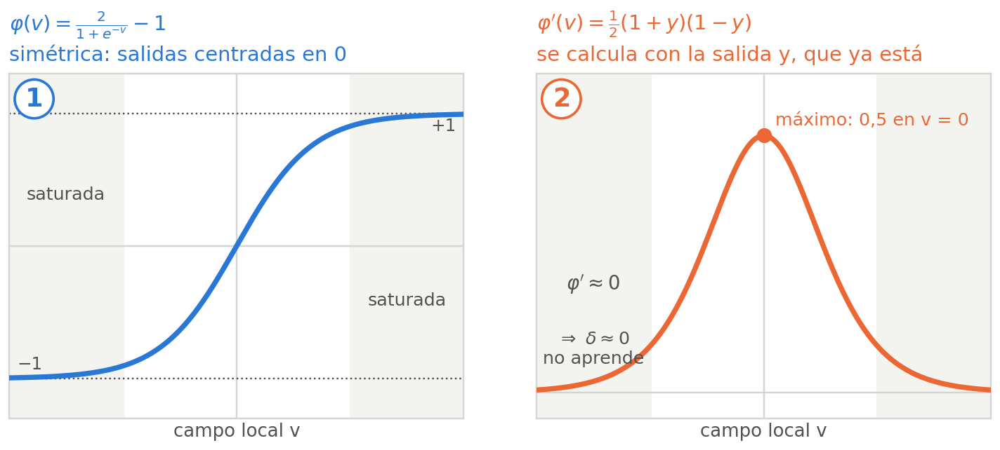{width=95%}

> **OJO — la sigmoide: ventajas y desventajas (se pregunta en conceptual)**
> **Por qué se usa:** es **derivable** en todo punto, que es lo único que exige el gradiente y lo que el signo no cumple; con $b$ grande se parece al signo tanto como se quiera; la simétrica está **centrada en cero**, lo que empareja el aprendizaje; y su derivada se escribe **con la salida**, así que sale gratis del paso hacia adelante.
> **Qué cuesta:** en los extremos **se satura** y la derivada se hace casi cero, así que la neurona deja de aprender (parálisis) — por eso los pesos iniciales van **chicos**; en redes con muchas capas esos factores menores que uno se multiplican y el gradiente **se desvanece** (resumen de aprendizaje profundo, §2). Y es una respuesta **global**: opina sobre todo el semiespacio, aun lejísimos de cualquier dato de entrenamiento, que es justo la diferencia con la gaussiana de la sección 4.

## Regiones de decisión: qué resuelve cada cantidad de capas

| Capas de neuronas | Región que puede formar | Ejemplo |
|---|---|---|
| **Una** | un **semiplano** (hiperplano en $\mathbb{R}^N$) | OR, AND; falla en el XOR |
| **Dos** | regiones **convexas**: intersección de semiplanos | resuelve el XOR; falla con clases entrelazadas o regiones con huecos |
| **Tres** | regiones **arbitrarias**: cóncavas, con huecos, no conexas | clases entrelazadas (las medialunas) |

Cada neurona de la primera capa aporta un semiplano; la segunda capa los **interseca** (regiones convexas); la tercera **une** esas regiones convexas, y la unión de convexas puede tener cualquier forma.

> **OJO — dos letras chicas que se preguntan**
> **Cómo se cuentan las capas:** en la cátedra son capas **de neuronas**; las entradas no cuentan. La red del XOR es de **dos** capas. **Existencia no es aprendizaje:** que tres capas *puedan* formar cualquier región dice que **existen** pesos que lo resuelven, no que back-propagation los vaya a encontrar — para eso están los mínimos locales, $\mu$ y la inicialización. (Resumen `02-perceptron-multicapa`, §1.)


## Error

$$e_j(n) = d_j(n) - y_j(n) \qquad \xi(n) = \frac{1}{2}\sum_{j=1}^{M} e_j^2(n)$$

El error de cada neurona de salida, y el error instantáneo de la red como la suma de todos al cuadrado.

## Regla del gradiente

$$\Delta w_{ji}(n) = -\mu\,\frac{\partial \xi(n)}{\partial w_{ji}(n)}$$

Lo mismo que en el perceptrón, pero ahora el peso puede estar en cualquier capa y no hay salida deseada para las ocultas. Eso es lo que hay que resolver.

$$\frac{\partial \xi}{\partial w_{ji}} = \frac{\partial \xi}{\partial e_j}\,\frac{\partial e_j}{\partial y_j}\,\frac{\partial y_j}{\partial v_j}\,\frac{\partial v_j}{\partial w_{ji}}$$

La cadena a derivar. Los dos primeros factores dan el error, el tercero es la derivada de la activación y el cuarto es la entrada que llega por esa conexión.

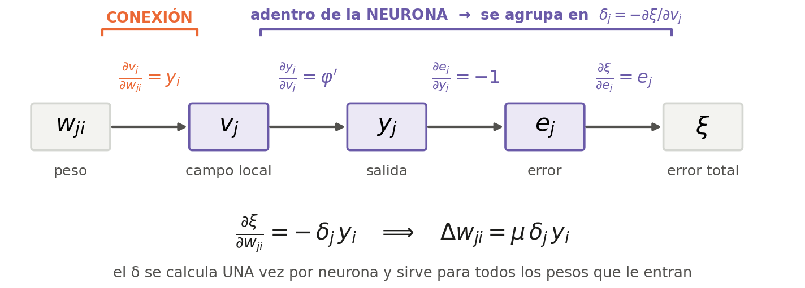{width=100%}

## La derivada de la activación

$$\varphi'(v_j) = \tfrac{1}{2}\big(1+y_j\big)\big(1-y_j\big)$$

Se escribe en función de la **salida**, no del campo local: como $y_j$ ya está calculado del paso hacia adelante, la derivada sale gratis. El $\tfrac12$ va (con $b$ general sería $b/2$).

## Los deltas

$$\delta_j(n) = -\frac{\partial \xi}{\partial y_j}\,\varphi'(v_j)$$

Se le pone nombre a todo lo que pasa **dentro** de la neurona, para separarlo de lo que pasa en la conexión.

$$\delta_j = -\frac{\partial \xi}{\partial y_j}\,\frac{\partial y_j}{\partial v_j} = -\frac{\partial \xi}{\partial v_j}$$

Los dos factores de la definición son la regla de la cadena de **una sola** derivada: la del error respecto del **campo local**. Así se lee el $\delta$ en una línea: **cuánta culpa tiene esa neurona en el error total** — cuánto bajaría el error si su estímulo neto cambiara un poquito, y en qué sentido conviene moverlo.

Su nombre completo es **gradiente de error local instantáneo**, y cada palabra está justificada: **gradiente** porque es una derivada, **local** porque es de esa neurona en particular, **instantáneo** porque está evaluado en la iteración $n$.

Y el corte no es arbitrario: de los cuatro factores de la cadena, el $\delta$ agrupa **los tres que dependen de la neurona** y deja afuera **el que depende de la conexión** ($y_i$). Por eso se calcula **una sola vez por neurona** y se reutiliza para todos los pesos que entran a ella — y por eso es **lo único que una capa necesita de la capa siguiente**, que es lo que hace posible propagar hacia atrás.

> **PARA LA DEFENSA — por qué la definición no se escribe con $e_j$, y el signo**
> Porque **una neurona oculta no tiene $e_j$**: no hay salida deseada para ella. Lo que sí existe siempre es $\partial\xi/\partial y_j$, que vale $-e_j$ en la capa de salida y $-\sum_k \delta_k w_{kj}$ en una oculta. La definición genérica es la única que sirve para los dos casos; definirla como $e_j\varphi'$ te deja sin forma de bajar a las ocultas.
> **El menos** de la definición es el que hace que la actualización quede **sumando**: se come el $-\mu$ de la regla del gradiente. En clase el $\delta$ aparece primero sin el menos y enseguida con él; la versión que se usa es **con** el menos.
> **La respuesta de treinta segundos:** *«El delta es el gradiente de error local instantáneo: menos la derivada del error respecto del campo local de esa neurona. Agrupa todo lo que pasa adentro de la neurona y deja afuera lo de la conexión, y por eso el ajuste queda delta por entrada. En la capa de salida sale del error verdadero; en una oculta, de los deltas de la capa siguiente pesados por los pesos que las unen.»*

$$\delta^{III}_j = \tfrac{1}{2}\,e_j\big(1+y^{III}_j\big)\big(1-y^{III}_j\big)$$

En la capa de salida hay salida deseada, así que el delta es directo: error por derivada de la activación.

$$\delta^{II}_j = \left[\sum_k \delta^{III}_k\,w^{III}_{kj}\right]\tfrac{1}{2}\big(1+y^{II}_j\big)\big(1-y^{II}_j\big)$$

En una capa oculta no hay salida deseada, así que el error se trae de atrás: se juntan los deltas de la capa siguiente, cada uno pesado por la conexión que lo une con esta neurona. **El corchete reemplaza al error**, y el resto de la fórmula es idéntico.

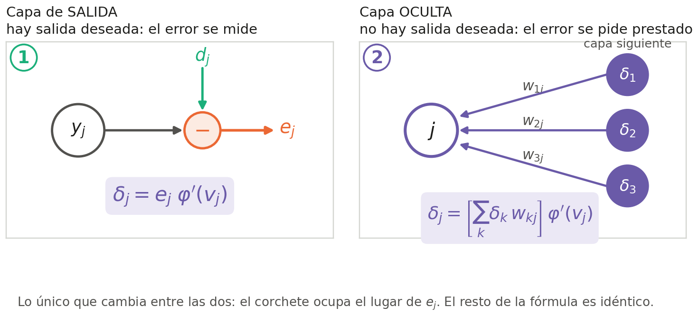{width=95%}

## Actualización

$$\Delta w_{ji}(n) = \mu\,\delta_j(n)\,y_i(n) \qquad w_{ji}(n+1) = w_{ji}(n) + \Delta w_{ji}(n)$$

La regla vale para cualquier capa: paso, por delta de la neurona a la que llega la conexión, por la señal que entra por ella. Lo único que cambia entre capas es cómo se calculó el delta.

$$\Delta w^{(p)}_{j0} = \mu\,\delta^{(p)}_j\,(-1)$$

El peso de sesgo se ajusta igual, con la entrada fija $-1$.

## Término de momento

$$\Delta w_{ji}(n) = \mu\,\delta_j(n)\,y_i(n) \;+\; \alpha\,\Delta w_{ji}(n-1), \qquad 0 \le \alpha < 1$$

A la regla de siempre se le suma **una fracción $\alpha$ del ajuste anterior** del mismo peso. El descenso por gradiente gana **inercia**, como una pelota que baja por la superficie de error: si el gradiente apunta siempre para el mismo lado, los pasos se acumulan y **acelera** (zonas planas, valles largos); si cambia de signo de un paso al otro —rebotando entre las paredes de un valle angosto—, los aportes se cancelan y **amortigua la oscilación**. De yapa, la inercia puede llevarlo más allá de un mínimo local poco profundo. Con $\alpha = 0$ se vuelve a la regla común; con $\alpha$ cerca de 1 se pasa de largo. Es un hiperparámetro más, y se elige con monitoreo.

> **OJO — velocidad de aprendizaje y momento, cada uno en su papel**
> $\mu$ fija **el tamaño del paso** en la dirección del gradiente actual: grande oscila o diverge, chico converge lentísimo. $\alpha$ fija **cuánto pesa la historia**: suaviza la dirección. Una variante habitual es un $\mu$ que **decrece** con las épocas: pasos largos al principio para acercarse, cortos al final para afinar.

## Inicialización, finalización y topología

**Inicialización:** todos los pesos **al azar y chicos** (por ejemplo, en $[-0{,}5;\,0{,}5]$). **Al azar** para romper la simetría: si dos neuronas ocultas arrancan iguales, reciben el mismo delta y se quedan iguales para siempre. **Chicos** para que la sigmoide arranque en su zona lineal, con derivada máxima, y no saturada. Como el resultado depende de la inicialización —cae en el valle más cercano—, se entrena con **varias semillas**.

**Criterios de finalización** (se combinan):

- **cantidad máxima de épocas** — una época es una pasada por todos los patrones;
- **error de entrenamiento** por debajo de una tolerancia, o **tasa de aciertos** suficiente;
- el error **deja de bajar** (el gradiente se hizo casi nulo: meseta o mínimo);
- y el que importa para generalizar: **parada temprana** con el conjunto de **monitoreo**, cuando su error toca un mínimo y empieza a subir (sección 9).

**Topología y parámetros de entrenamiento:** la **cantidad de capas** sale de la forma de la región que hace falta (tabla de regiones de decisión: recta, convexa o arbitraria); la **cantidad de neuronas ocultas**, de cuántos semiplanos necesita esa región —$N$ ocultas dan un polígono de hasta $N$ lados— más un margen, porque con el mínimo justo el entrenamiento cuesta encontrar la solución. Neuronas de entrada = atributos; de salida = clases (o salidas pedidas). Capas, neuronas, $\mu$, $\alpha$ y épocas son **hiperparámetros**: se prueban varias combinaciones y se elige con **monitoreo o validación cruzada, nunca con la prueba**. Y se normalizan los datos antes de entrenar. (Resumen `02-perceptron-multicapa`, §1 y §14; `03-implementacion-en-python`, §7 y §8.)


## La generalización: una capa $p$ cualquiera

$$\Delta w^{(p)}_{ji}(n) = \eta\;\big\langle \boldsymbol{\delta}^{(p+1)},\ \mathbf{w}^{(p+1)}_j \big\rangle\;\big(1+y^{(p)}_j\big)\big(1-y^{(p)}_j\big)\;y^{(p-1)}_i(n)$$

Una sola fórmula para **todas** las capas, tenga la red tres o veinte. Los tres índices: $p$ es la capa donde estoy parado, $p-1$ de dónde viene la entrada, $p+1$ la capa siguiente. Leída en voz alta: **velocidad de aprendizaje, por error, por derivada de la activación en la capa actual, por entrada**. Y acá $\eta = \mu/2$, porque absorbe el $\tfrac12$ de la derivada.

$$\big\langle \boldsymbol{\delta}^{(p+1)},\ \mathbf{w}^{(p+1)}_j \big\rangle = \sum_k \delta^{(p+1)}_k\,w^{(p+1)}_{kj}$$

El producto interno desplegado. $k$ recorre las neuronas de la **capa siguiente** y $j$ queda fijo, así que $\mathbf{w}^{(p+1)}_j$ es **la columna $j$** de esa matriz: los pesos que **salen** de la neurona $j$, no los que entran. Hacia adelante se suma sobre el segundo índice de $w_{kj}$; hacia atrás, sobre el primero. Es la misma matriz transpuesta, y de ahí el nombre del método.

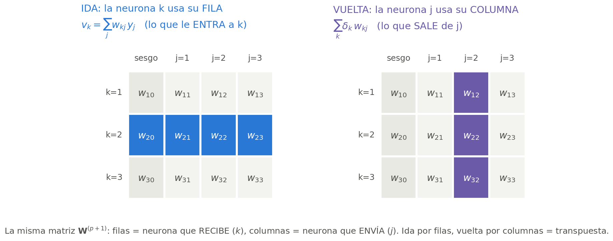{width=95%}

## Los dos bordes

La fórmula general es idéntica en todas las capas y sólo falla en los extremos, porque ahí **falta un vecino**.

$$\Delta w^{(III)}_{ji} = \eta\;\underbrace{\big(d_j - y^{(III)}_j\big)}_{e_j}\;\big(1+y^{(III)}_j\big)\big(1-y^{(III)}_j\big)\;y^{(II)}_i$$

**Capa de salida:** no existe $p+1$, así que el producto interno se reemplaza por el **error verdadero**. Todo lo demás queda igual.

$$\Delta w^{(I)}_{ji} = \eta\;\big\langle \boldsymbol{\delta}^{(II)},\ \mathbf{w}^{(II)}_j \big\rangle\;\big(1+y^{(I)}_j\big)\big(1-y^{(I)}_j\big)\;x_i$$

**Primera capa:** no existe $p-1$, así que la «salida de la capa anterior» es la **entrada de la red**.

$$\delta^{(III)}_j \;\longrightarrow\; \delta^{(II)}_j \;\longrightarrow\; \delta^{(I)}_j$$

Y el orden no es negociable: los $\delta$ se calculan **de la salida hacia atrás**, porque cada capa necesita los de la siguiente. El de la capa de salida es el único que se puede calcular sin depender de nadie.

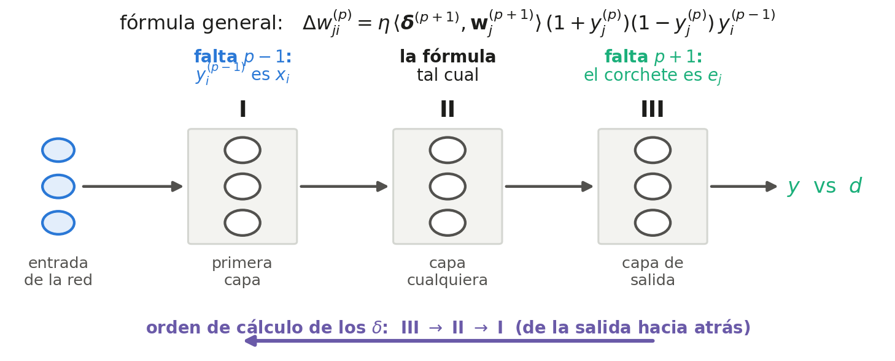{width=95%}

## El corchete, desglosado un nivel

$$\big\langle \boldsymbol{\delta}^{(III)},\ \mathbf{w}^{(III)}_j \big\rangle = \tfrac{1}{2}\sum_k \big(d_k - y^{(III)}_k\big)\big(1+y^{(III)}_k\big)\big(1-y^{(III)}_k\big)\,w^{(III)}_{kj}$$

Reemplazando $\delta^{(III)}_k$ por su fórmula y sacando el $\tfrac12$ afuera de la suma, el corchete queda escrito **sólo con cosas ya calculadas**: las salidas deseadas, las salidas de la red y los pesos.

> **OJO — dos derivadas de activación distintas, y el $\tfrac12$**
> La derivada de adentro del corchete va evaluada en **$k$** (capa siguiente); la de afuera, en **$j$** (capa actual). Escribirlas con el mismo índice es el error más común del tema. Y de los dos $\tfrac12$: el de adentro es el del $\delta^{(p+1)}$ y se escribe; el de la capa actual está absorbido en $\eta$.
>
> **Y hasta acá no más.** Con más capas, cada $\delta^{(p+1)}$ tiene adentro otro corchete, y desplegar eso son cuatro renglones ilegibles. La gracia del $\delta$ es justamente **no** desplegarlo: se calcula una vez por neurona y en cada capa se lo trata como un número que ya está.

---

\newpage

# 4. Redes de base radial

> **SI TE DICEN — «contame sobre las redes de base radial»**
> «Es una red de dos capas donde las neuronas ocultas son **gaussianas** en vez de sigmoideas: cada una tiene un centro, responde fuerte si la entrada está cerca y casi nada si está lejos. Son **detectores locales**, burbujas, en vez de semiplanos. La salida es una **combinación lineal** de esas respuestas. El entrenamiento es **mixto, en dos fases**. Primero, **sin mirar etiquetas**, se ubican los centros con $k$-medias: cada dato va al centro más cercano y cada centro se muda al promedio de sus datos, hasta que nadie cambie. Después, **con las etiquetas**, se entrenan los pesos de salida con LMS, usando las gaussianas como entradas. La ventaja: esa segunda fase es un **problema lineal**, más simple que retropropagar. Como variante, después se pueden ajustar también centros y anchos por gradiente.»


> **IDEA DE FONDO — en qué consiste**
> Cambiar de representación para que el problema se vuelva fácil. Tiene **dos fases con criterios distintos**: primero, **sin mirar las etiquetas**, se ubican unas cuantas «burbujas» gaussianas donde hay datos; después, **mirando las etiquetas**, se decide cuánto pesa cada burbuja en la salida. La imagen: cada neurona oculta es un detector local que se enciende cuando la entrada cae cerca de su centro y se apaga si está lejos — al revés de la sigmoide, que responde a todo un semiespacio. Y la clave del método: una vez fijadas las burbujas, **la salida es una combinación lineal**, así que la segunda mitad es un problema lineal, sin capas ocultas que derivar.


*Dos fases con criterios distintos: la primera no supervisada ubica las funciones, la segunda supervisada las combina.*

## Arquitectura

$$\varphi_j(\mathbf{x}_\ell) = e^{-\lVert \mathbf{x}_\ell - \boldsymbol{\mu}_j \rVert^2 / 2\sigma_j^2}$$

Cada neurona oculta responde según **qué tan cerca** está la entrada de su centro $\boldsymbol{\mu}_j$: máximo si coincide, y cae con la distancia a una velocidad que fija $\sigma_j$. Es una activación local, al revés que la sigmoide, que responde a todo un semiespacio.

> **IDEA DE FONDO — qué es una gaussiana, sin fórmula**
> Una **campana**: vale 1 justo en el centro $\boldsymbol{\mu}_j$ y cae suave y simétricamente con la distancia, hasta hacerse prácticamente cero. Dos parámetros la definen: **dónde está** ($\boldsymbol{\mu}_j$, un vector del espacio de entrada) y **qué tan ancha es** ($\sigma_j$, un escalar). En $\mathbb{R}^2$ es una montañita redonda; cortada a una altura fija, un círculo. La neurona, entonces, no pregunta «¿de qué lado estás?» como la sigmoide sino **«¿qué tan cerca estás de mi centro?»**.


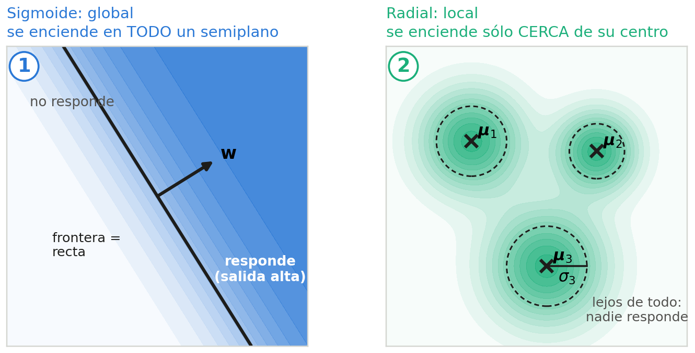{width=88%}

$$y_k(\mathbf{x}_\ell) = \sum_{j=1}^{M} w_{kj}\,\varphi_j(\mathbf{x}_\ell)$$

La salida es una **combinación lineal** de esas respuestas. Y ahí está la clave del método: fijadas las funciones radiales, la salida es lineal en los pesos, así que la segunda fase es un problema fácil.

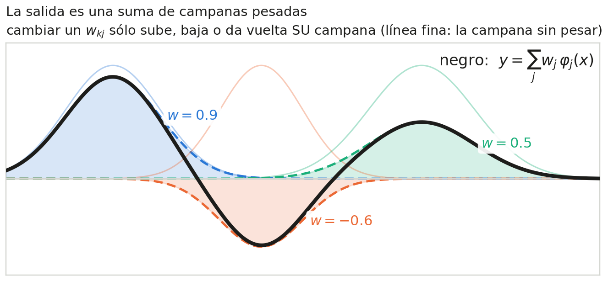{width=90%}

> **OJO — la arquitectura, para dibujarla**
> Tres columnas: **entradas** $x_1,\dots,x_N$ (no son neuronas); **capa radial** con $M$ gaussianas **sin sesgo**, cada entrada conectada a todas con pesos **fijos en 1** que no se entrenan — lo que decide la respuesta son $\boldsymbol{\mu}_j$ y $\sigma_j$; **capa de salida** que es un perceptrón **lineal** (sin activación, con su entrada $-1$ y su $w_{k0}$), con los pesos $w_{kj}$ en las flechas que van de cada gaussiana a cada salida. Toda la no linealidad está en las gaussianas. **Una sola** capa oculta: no hace falta más, porque agregando gaussianas se arma cualquier región.


## Fase 1 — centros, no supervisada ($k$-medias)

$$J = \sum_j \sum_{\ell \in C_j} \lVert \mathbf{x}_\ell - \boldsymbol{\mu}_j \rVert^2$$

El criterio: que cada dato esté lo más cerca posible del centro de su grupo. Se minimiza alternando dos pasos.

$$\ell \in C_j \iff \lVert \mathbf{x}_\ell - \boldsymbol{\mu}_j \rVert^2 < \lVert \mathbf{x}_\ell - \boldsymbol{\mu}_i \rVert^2 \quad \forall\, i \neq j$$

**Reasignación:** cada dato se asigna al centro más cercano.

$$\boldsymbol{\mu}_j = \frac{1}{|C_j|}\sum_{\ell \in C_j} \mathbf{x}_\ell$$

**Recálculo:** cada centro se muda al promedio de los datos que le tocaron. Se repite hasta que nadie cambia de grupo.

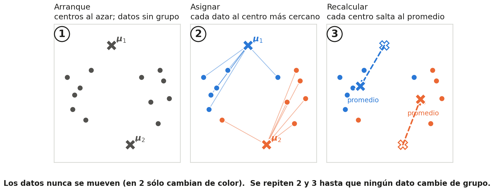{width=100%}

$$j^* = \arg\min_j \lVert \mathbf{x}_\ell - \boldsymbol{\mu}_j(n) \rVert \qquad \boldsymbol{\mu}_{j^*}(n+1) = \boldsymbol{\mu}_{j^*}(n) + \eta\big(\mathbf{x}_\ell - \boldsymbol{\mu}_{j^*}(n)\big)$$

La versión **en línea**, patrón por patrón: gana el centro más cercano y se corre un poco hacia el dato. Es la misma idea que el SOM pero sin vecindad (no se toma: basta con saber que existe).

## Fase 2 — pesos, supervisada

$$e_k(n) = y_k(n) - d_k(n) \qquad \xi(n) = \frac{1}{2}\sum_k e_k^2(n)$$

Recién acá aparecen las salidas deseadas. **Ojo con el signo:** acá el error se define al revés que en el perceptrón, $e = y - d$, y por eso la regla lleva $-\eta$. Es la misma cuenta que $+\eta\,(d-y)$.

$$\frac{\partial \xi}{\partial w_{kj}} = e_k(n)\,\varphi_j(n)$$

El gradiente es sencillo porque la salida es lineal en los pesos: no hay ninguna derivada de activación que arrastrar.

$$w_{kj}(n+1) = w_{kj}(n) - \eta\,e_k(n)\,\varphi_j(n)$$

Error por activación de la neurona oculta. Es LMS otra vez, con las $\varphi_j$ haciendo de entradas.

### Métodos 1 y 2 de entrenamiento

**Método 1 (el que se usa):** las dos fases de arriba, **por separado** — primero los centros con $k$-medias (o con un SOM), después los $w_{kj}$ con LMS.

**Método 2:** se arranca con el método 1 y después se ajusta **todo junto por gradiente**, incluidos centros y anchos: además de $\partial\xi/\partial w_{kj}$ se calculan $\partial\xi/\partial\mu_{ji}$ y $\partial\xi/\partial\sigma_j$. Conceptualmente es lo mismo que back-propagation: la culpa del error de salida se lleva hacia atrás hasta la capa radial, y **cada gaussiana se corre y se ensancha o angosta en la dirección que más baja el error**. Gana precisión, pero pierde la ventaja del método 1 —la fase supervisada deja de ser lineal— y vuelven los mínimos locales.


### Cómo se lee

$\varphi_j(\mathbf{x})$ se lee como **cuánto se parece la entrada al centro $j$**: vale 1 si cae justo encima y cae con la distancia a una velocidad que fija $\sigma_j$. Es un **detector local**, al revés de la sigmoide, que responde a todo un semiespacio. Y $w_{kj}$ se lee como **cuánto pesa esa burbuja en la salida $k$**.

Por eso la frontera de una RBF son **burbujas** y la de un multicapa son **semiespacios cortados**: la diferencia entre los dos métodos está en la forma de la activación, no en el algoritmo.

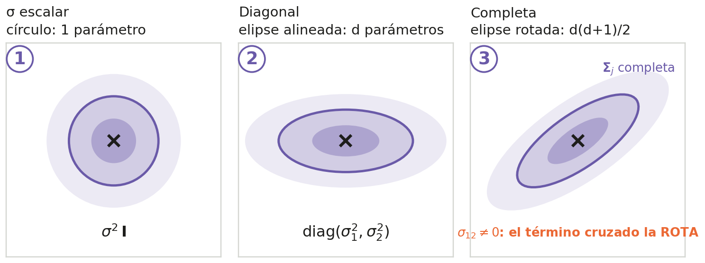{width=95%}

**Los casos de la matriz de covarianza** — conceptual; las fórmulas $N$-dimensionales no se toman:

| $\mathbf{U}_j$ | Forma de la burbuja | Qué libertad agrega |
|---|---|---|
| $\mathbf{I}$ | círculos (esferas) **todos iguales** | sólo se mueven de lugar; alcanza casi siempre, porque los $w_{kj}$ compensan |
| $\sigma_j^2\mathbf{I}$ — diagonal con valores **iguales** | esferas de **distinto tamaño** | un ancho por neurona: el modelo de esta sección |
| diagonal **general**, un $\sigma_{jk}$ por dimensión | **elipses alineadas a los ejes** | se estiran en horizontal o vertical, pero nunca giran |
| **completa** | elipses con **cualquier orientación** | los términos cruzados (covarianzas entre dimensiones) la **rotan**: cualquier forma elíptica |

Cada caso agrega una libertad y más parámetros para estimar; ninguno cambia la idea, que sigue siendo *encerrar una zona alrededor de un centro*. (Resumen `01-redes-de-base-radial`, §9.)

**Qué es cada cosa en las sumatorias** — escalar, vector o matriz:

| Símbolo | Qué es | Tamaño |
|---|---|---|
| $\mathbf{x}_\ell$, $\boldsymbol{\mu}_j$ | vectores, **del mismo espacio** (por eso se pueden restar) | $N$ |
| $\lVert \mathbf{x}_\ell - \boldsymbol{\mu}_j\rVert^2$ | escalar: la distancia al cuadrado, $\sum_i (x_{\ell i}-\mu_{ji})^2$ | 1 |
| $\sigma_j$, $\varphi_j(\mathbf{x}_\ell)$ | escalares: el ancho, y la respuesta de **una** neurona | 1 |
| $\boldsymbol{\varphi}(\mathbf{x}_\ell)$ | el vector de las $M$ respuestas: la **nueva representación** del patrón | $M$ |
| $\mathbf{W}$, con elementos $w_{kj}$ | matriz: una fila por salida, una columna por gaussiana | $K \times M$ |
| $\mathbf{U}_j$ | matriz de covarianza de la neurona $j$ | $N \times N$ |

La suma sobre $i$ recorre **dimensiones** (dentro de la distancia); la suma sobre $j$ recorre **gaussianas** (en la salida); la de $k$-medias, sobre $\ell\in C_j$, recorre **patrones**. Confundir qué recorre cada sumatoria es el error de lectura típico.


| | RBF | Multicapa |
|---|---|---|
| Activación oculta | gaussiana: **local** | sigmoide: **global** |
| Capas ocultas | una sola | las que haga falta |
| Qué representa cada neurona | una **zona** del espacio | un **semiespacio**; la respuesta queda repartida |
| Entrenamiento | mixto, dos fases, la segunda **lineal** | supervisado de punta a punta, back-propagation |
| Mínimos locales | la fase 2 no tiene | sí |
| Velocidad | más rápido | más lento |
| Lejos de los datos | todas las neuronas dan ≈ 0: «no sé» | siempre contesta algo, con confianza |
| Costo | necesita **más neuronas** si la dimensión es alta: hay que cubrir el espacio con burbujas | con pocos hiperplanos cubre mucho |

> **PARA LA DEFENSA — la respuesta de treinta segundos**
> *«Se cambia de representación para que el problema se vuelva fácil. Primero, sin mirar las etiquetas, se ubican unas gaussianas donde hay datos —eso es $k$-medias—. Después, con las etiquetas, se decide cuánto pesa cada una en la salida. Y la clave: fijadas las gaussianas, la salida es una combinación lineal de ellas, así que la segunda fase es un problema lineal, sin capas ocultas que derivar.»*
> **Las repreguntas seguras:** por qué el entrenamiento es **mixto** (fase 1 no supervisada, fase 2 supervisada); qué pasa si las gaussianas tienen que ser elipses (se reemplaza el escalar $\sigma_j$ por una matriz de covarianza); y el **método 2**, que arranca con el método 1 y después ajusta todo —centros y anchos incluidos— por gradiente.

---

\newpage

# 5. Hopfield

> **SI TE DICEN — «contame sobre la red de Hopfield»**
> «Es una **memoria asociativa**: guarda patrones de $\pm1$, y si le das uno incompleto o con ruido te devuelve el guardado más parecido. Es **una sola capa**, todas las neuronas conectadas con todas, con **pesos simétricos y sin autoconexiones**. Tiene dos fases. **Almacenar no itera**: los pesos salen de una cuenta con la **regla de Hebb**: la suma de $x_j x_i$ sobre los patrones, dividida por $N$, que mide cuánto coinciden esas dos neuronas. **Recuperar sí itera**: cargo el patrón sucio como estado inicial, sorteo una neurona, le pongo el signo de su campo local, y repito hasta que **ninguna** de las $N$ neuronas quiera cambiar. **Siempre converge**, porque con pesos simétricos hay una **energía que nunca sube**. Sus límites: capacidad baja, del orden de $N/(2\ln N)$ patrones, y **estados espurios**, como el negativo de cada patrón.»


> **IDEA DE FONDO — en qué consiste**
> Una memoria que se consulta **por contenido**: le das un dato roto y te devuelve el dato entero. Tiene **dos fases**: **almacenar**, que es una sola cuenta y no itera, y **recuperar**, que itera hasta quedarse quieta. La idea de fondo: el recuerdo **no se guarda en ningún lugar**, se guarda como **acuerdos entre las partes del recuerdo** — para cada par de neuronas, si suelen coincidir o suelen oponerse. Por eso están **todas conectadas con todas**, en una sola capa. Y recuperar es **una votación ponderada que se repite**: se sortea una neurona, las demás le dicen qué valor debería tener, **el peso del cable es cuánto vale cada voto**, gana la mayoría, y se repite hasta que nadie cambia.

## El marco: redes estáticas y dinámicas

Hopfield abre la unidad de **redes dinámicas**, y antes de la red se pregunta el marco.

**¿Por qué «dinámicas»?** Porque **la salida no queda determinada por la entrada actual**. Una red **estática** —perceptrón, multicapa, RBF— es una función: entra un patrón, sale una salida, y la misma entrada da siempre la misma salida. Una **dinámica** tiene **estado**: su salida depende de lo que pasó antes (recurrentes) o de un proceso que evoluciona en el tiempo hasta asentarse (Hopfield).

**Tres formas de meter tiempo en una red:**

| Aproximación | Qué vuelve a entrar | ¿La red es dinámica? |
|---|---|---|
| 1. Entradas desplazadas | $\mathbf{x}(n-1), \mathbf{x}(n-2),\dots$ junto con $\mathbf{x}(n)$ | **no**: sigue siendo estática, con más entradas (TDNN) |
| 2. Salidas realimentadas | $\mathbf{y}(n-1)$ | según la cátedra, **no**: la salida anterior entra como una entrada más y la red es la misma |
| 3. Estados internos realimentados | salidas de las ocultas, $\mathbf{z}(n-1)$ | **sí**: la red guarda estado propio (Elman, recurrentes en general) |

> **OJO — la distinción que más se pregunta**
> En las aproximaciones 1 y 2 la memoria está **afuera**, en cómo se armó el vector de entrada: la red es la misma que ya se sabe entrenar, con más entradas, sin dinámica interna. Sólo en la 3 la red **guarda estado propio** y se comporta dinámicamente. Decir que agregar entradas retardadas vuelve dinámica a una red es el error típico. (Jordan, que realimenta la salida, figura igual entre las recurrentes porque el sistema completo tiene un lazo; se entrena congelando ese contexto como una entrada más.)

**Qué problemas resuelve cada una.** Las estáticas, problemas donde **el orden no importa**: clasificar una flor por sus medidas, un dígito por sus píxeles. Las dinámicas, problemas **con historia**: series temporales (predecir la temperatura de mañana), habla, texto, control, cualquier cosa donde la respuesta correcta depende de lo que vino antes. **No conviene usar una estática** en un problema temporal de memoria larga o de longitud variable: habría que fijar de antemano cuántos instantes mirar, las entradas crecen con cada retardo, y lo que quedó fuera de la ventana no existe para la red.

**Cómo se ordena la unidad.** Las redes con retardos (TDNN) se entrenan con back-propagation tal cual. Las **recurrentes** —con conexiones hacia atrás— necesitan algo nuevo, y ahí hay dos caminos: **Hopfield**, que esquiva el gradiente (Hebb de una pasada), y **BPTT**, que lo enfrenta desenrollando la red en el tiempo. Hopfield es recurrente —todas contra todas, con el estado volviendo a entrar— y es el caso más puro de red dinámica: se la usa **dejándola evolucionar**. (Resumen `01-redes-dinamicas`, §1, §2 y §15.)

| Red | ¿Estática o dinámica? | Entrenamiento |
|---|---|---|
| Perceptrón, multicapa, RBF | estática | supervisado (RBF: mixto) |
| TDNN | estática con memoria en la entrada | supervisado, back-propagation común |
| Elman, Jordan, BPTT | dinámica | supervisado, back-propagation sobre la red desenrollada |
| Hopfield | dinámica | **no supervisado** (Hebb), sin iterar |


## Arquitectura

$$N \text{ neuronas}, \quad \text{una sola capa}, \quad y_j(n) = \operatorname{sgn}\Big(\sum_{i} w_{ji}\,y_i(n-1)\Big), \quad w_{ji} = w_{ij}, \quad w_{jj} = 0$$

**Una sola capa** de $N$ neuronas bipolares ($\pm1$), tantas como componentes tiene el patrón: cada neurona es a la vez **entrada y salida** de una posición del dato. La salida de cada neurona **vuelve, a través de un retardo, a la entrada de todas las demás** — de ahí lo recurrente. No hay capa de entrada aparte: el patrón entra **una sola vez**, como estado inicial. Pesos **simétricos** y **sin autoconexiones**; la activación es el signo, **sin umbral** (los $\theta_j$ del modelo general no se usan), y en el empate la neurona conserva su valor.

## Datos de partida

$$\mathbf{x}^*_k \in \{-1,+1\}^N, \qquad k = 1,\dots,P$$

$P$ patrones para guardar, cada uno un vector de $N$ componentes que valen $-1$ o $+1$. Esos $N$ lugares son las $N$ neuronas.

## Fase 1 — Almacenamiento

$$w_{ji} = \frac{1}{N}\sum_{k=1}^{P} x^*_{kj}\,x^*_{ki} \qquad \forall\, i \neq j$$

Para cada par de neuronas se recorren los patrones multiplicando el valor que tiene una por el valor que tiene la otra. Como son $\pm1$, cada producto da $+1$ si coinciden y $-1$ si se oponen: el peso mide **en cuántos patrones coincidieron menos en cuántos difirieron**.

$$w_{jj} = 0 \qquad \forall\, j$$

Ninguna neurona se conecta consigo misma. Se impone: la fórmula daría $P/N$ y esa neurona se haría caso a sí misma por encima de todas las demás.

$$w_{ji} = w_{ij}$$

La conexión entre dos neuronas es una sola. Con la regla de arriba se cumple solo, porque el producto no distingue el orden.

> **IDEA DE FONDO — memoria asociativa**
> Una memoria común se consulta **por dirección**: le das «el casillero 37» y te devuelve lo que haya ahí. Una **memoria asociativa** (o *direccionable por contenido*) se consulta **por el contenido mismo**: le das un pedazo, o una versión con ruido, del dato, y te devuelve el dato entero. Hopfield es **autoasociativa**: la clave y lo que devuelve son del mismo tipo — entra un patrón sucio y sale el limpio. Las **memorias fundamentales** son los $P$ patrones guardados.

> **IDEA DE FONDO — qué significa que el aprendizaje sea hebbiano**
> La **regla de Hebb** viene de la neurofisiología: *si dos neuronas se activan juntas, la conexión entre ellas se refuerza*. En la red: el peso entre $i$ y $j$ crece cuando las dos tienen el mismo valor, decrece cuando tienen valores opuestos, y queda en cero cuando no hay relación. Tres rasgos lo definen, y son lo que se pregunta:
>
> - **Es local:** para ajustar $w_{ji}$ sólo hace falta la actividad de **las dos neuronas que ese peso une**. Nada de información de otras partes de la red.
> - **Es correlacional:** $w_{ji}$ es, salvo la escala, la **correlación** entre las componentes $i$ y $j$ a lo largo de los patrones.
> - **No hay error ni salida deseada:** en ningún momento se calcula una salida para compararla con nada. Por eso es **no supervisado**, y por eso **no itera**: no hay nada que ir corrigiendo, es una cuenta.

| | Hebbiano (Hopfield) | Corrección de error (perceptrón, multicapa) |
|---|---|---|
| Qué mira | coincidencia de las actividades de dos neuronas | diferencia entre salida deseada y obtenida |
| Necesita $d$ | **no** | **sí** |
| Cuándo cambia el peso | siempre que las dos neuronas coincidan u opongan | **sólo si hay error**: si acierta, no se toca nada |
| Cómo se entrena | **una cuenta**, una pasada | **iterando** hasta que el error baje |
| Información que usa | local al par de neuronas | el error, que en las ocultas hay que retropropagar |
| Qué aprende | **relaciones** entre partes del patrón | una **función** entrada → salida |

> **PARA LA DEFENSA — ¿por qué aprende? Porque cada patrón guardado queda como punto fijo**
> Si se carga la red con una memoria $\mathbf{x}^*_m$ y se calcula el campo local de una neurona, la suma de Hebb se abre en dos partes:
> $$v_j = \sum_{i\neq j} w_{ji}\,x^*_{mi} = \underbrace{\frac{N-1}{N}\,x^*_{mj}}_{\text{el propio patrón}} \;+\; \underbrace{\frac{1}{N}\sum_{k\neq m} x^*_{kj}\sum_{i\neq j} x^*_{ki}\,x^*_{mi}}_{\text{interferencia de los demás}}$$
> El primer término **apunta exactamente al valor que la neurona ya tiene**. Si la interferencia es chica —pocos patrones, y distintos entre sí—, el signo de $v_j$ es el de $x^*_{mj}$: **ninguna neurona cambia**, el patrón es estable, y es un mínimo de la energía. Un patrón con un poco de ruido cae cerca y rueda hasta ahí. Eso es «aprender» en Hopfield: **cavar un valle en cada memoria**.
> Y de ahí sale el límite: con muchos patrones, o patrones parecidos, la interferencia le gana al primer término, las memorias dejan de ser estables y aparecen valles que nadie cavó. Ésa es la razón de la capacidad $P_{\max}$.


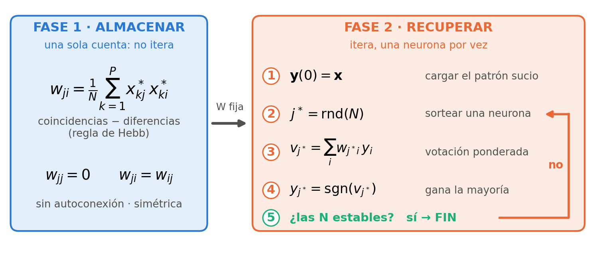{width=100%}

## Fase 2 — Recuperación

$$\mathbf{y}(0) = \mathbf{x}$$

El patrón incompleto o con ruido se escribe directamente como estado inicial de las neuronas.

$$j^* = \operatorname{rnd}(N)$$

Se sortea cuál neurona se actualiza en este paso.

$$v_{j^*}(n) = \sum_{i=1}^{N} w_{j^*i}\,y_i(n-1)$$

El campo local: el valor actual de cada una de las demás, multiplicado por el peso que la une con la elegida, todo sumado. Es una votación ponderada, donde el peso es cuánto vale cada voto.

$$y_{j^*}(n) = \operatorname{sgn}\big(v_{j^*}(n)\big), \qquad \operatorname{sgn}(x) = \begin{cases} +1 & x > 0 \\ y_{j^*}(n-1) & x = 0 \\ -1 & x < 0 \end{cases}$$

El nuevo valor es el signo de ese total: gana la mayoría. En el empate la neurona conserva lo que tenía.

$$y_j(n) = y_j(n-1) \qquad \forall\, j \neq j^*$$

Las demás quedan como estaban: se toca **una sola** por paso.

$$\operatorname{sgn}\big(v_j(n)\big) = y_j(n) \quad \forall\, j = 1,\dots,N \;\Longrightarrow\; \text{fin}$$

Se corta cuando, **recorriendo todas las neuronas**, ninguna cambia: cada una ya tiene el signo de su campo local. Recién ahí nada puede moverse después, porque a cada neurona le entraría lo mismo que ya le entró. La salida es ese estado estable.

> **OJO — no alcanza con «$N$ sorteos seguidos sin cambios»**
> Como $j^*$ se **sortea** (con reposición), $N$ sorteos seguidos pueden repetir neuronas y dejar otras sin revisar, y una de ésas todavía podría cambiar. La condición es que **las $N$** estén estables. En la práctica se hace un barrido por todas las neuronas en orden aleatorio (una permutación), o se verifica al final que $\operatorname{sgn}(v_j) = y_j$ para todas. Si en la pizarra las recorrés en orden para que se siga la cuenta, aclaralo: el algoritmo las sortea.

> **OJO — acá es donde la red es dinámica**
> El entrenamiento fue una cuenta; **la recuperación es un sistema que evoluciona en el tiempo**. El estado $\mathbf{y}(n)$ depende del estado anterior, no sólo de la entrada: la entrada sólo fija **dónde arranca**. La salida no es una función del patrón sino **el punto donde la trayectoria se detiene**, un estado estable. Por eso Hopfield es el caso inverso de todo lo demás: **no itera para entrenar, itera para usarse**.


## Convergencia

$$E(\mathbf{y}) = -\frac{1}{2}\sum_{j}\sum_{i} w_{ji}\,y_i\,y_j$$

Cada par de neuronas aporta un término que baja la energía cuando el par está como su peso "quiere". El $\tfrac12$ compensa que la doble suma cuenta cada par dos veces.

$$\Delta E = -\big(y_{j^*}(n) - y_{j^*}(n-1)\big)\,v_{j^*}(n)$$

Al actualizar una sola neurona, los únicos términos que se mueven son los que la contienen. **Esto vale porque los pesos son simétricos:** si no, el par $(i,j)$ aportaría dos términos distintos.

$$\Delta E = 2\,y_{j^*}(n-1)\,v_{j^*}(n) < 0 \quad\text{si cambió} \qquad \Delta E = 0 \quad\text{si no cambió}$$

Si la neurona se dio vuelta fue porque su valor viejo no coincidía con el signo del campo: tienen signos distintos, el producto es negativo y la energía bajó.

$$\boxed{\;\Delta E \le 0\;} \;\wedge\; 2^N < \infty \;\Longrightarrow\; \text{converge en pasos finitos}$$

La energía nunca sube, está acotada por abajo y hay finitos estados: no puede bajar para siempre. El detalle que hace funcionar el argumento: cada **cambio** baja la energía **estrictamente** (en el empate la neurona no cambia), así que la red no puede volver nunca a un estado por el que ya pasó.

> **OJO — ¿y las «oscilaciones» de la diapositiva?**
> La diapositiva dice que se pueden obtener estados espurios **y oscilaciones**. Las dos cosas son ciertas, pero en condiciones distintas: con **una neurona por vez** (asincrónica) y **pesos simétricos con diagonal cero**, la red **siempre converge**, que es lo que demuestra la energía. Oscila si se rompe alguna de esas condiciones: si se actualizan **todas a la vez** (sincrónica) puede quedar alternando entre dos estados, y con **pesos no simétricos** la energía deja de existir y puede dar vueltas sin fin. Si te preguntan «¿siempre converge?», la respuesta es «sí, con actualización asincrónica y pesos simétricos».


$$E(-\mathbf{y}) = E(\mathbf{y}) \qquad P_{\max} = \frac{N}{2\ln N}$$

Dar vuelta todas las neuronas no cambia la energía: por cada memoria guardada queda su negativo como estado espúreo.


La capacidad, en cambio, crece más lento que $N$, mientras la cantidad de pesos crece como $N^2$: guardar muchos patrones sale caro.

> **OJO — los estados espurios, completos**
> Un **estado espurio** es un mínimo de la energía que **no es ninguna memoria guardada**: la red converge ahí —la convergencia está garantizada, *a qué* converge no— y devuelve algo que no se almacenó. Tres fuentes: el **negativo** de cada memoria, que tiene la misma energía; las **mezclas** de memorias, estados que se parecen un poco a cada una (típicamente el signo de la suma de tres patrones guardados); y, **pasada la capacidad**, valles que aparecen por la interferencia entre patrones. En el mapa de energía se ven como valles que nadie cavó a propósito, al lado de los que cavó Hebb: un patrón sucio que arranca cerca de uno de ésos cae ahí.

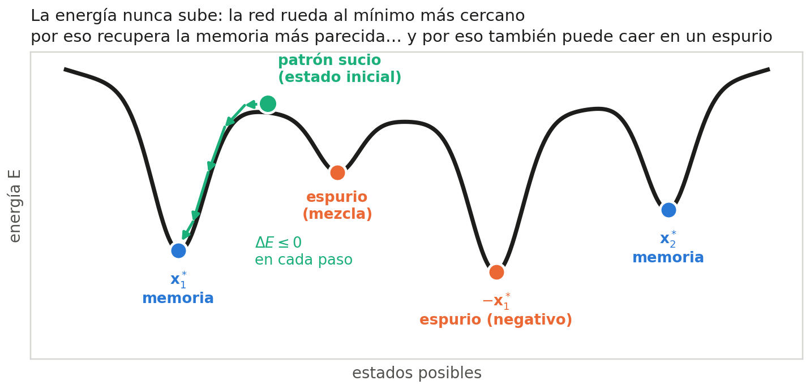{width=92%}

### Cómo se leen las tres piezas

**$w_{ji}$** — *coincidencias menos diferencias*: en cuántos patrones esas dos neuronas tuvieron el mismo valor, menos en cuántos difirieron. Es **el acuerdo** entre dos posiciones del dato.

**$v_j$** — *una votación ponderada*: cada neurona opina sobre cuánto debería valer $j$, y **el peso del cable es cuánto vale cada voto**. Positivo dice «tenemos que coincidir», negativo «tenemos que oponernos», cero «no opino».

**$E$** — *cuánta incomodidad hay en la red*: cuántos pares están en contra de lo que su peso quiere. Cada par contento la baja, cada par a disgusto la sube.

> **PARA LA DEFENSA — la respuesta de treinta segundos**
> *«Es una memoria asociativa: se consulta por contenido y no por dirección. El recuerdo no se guarda en ningún lugar, se guarda como acuerdos entre las partes del recuerdo, y por eso están todas las neuronas conectadas con todas. Almacenar es una sola cuenta —Hebb—, y recuperar es una votación ponderada que se repite hasta que nadie cambia. Y siempre termina, porque hay una energía que nunca sube.»*
> **Las repreguntas seguras:** por qué es **hebbiano** (el peso crece cuando dos neuronas se activan juntas, no hay salida deseada en ningún momento, y el ajuste depende sólo de la correlación entre las dos actividades); por qué la diagonal es cero; qué pasa si los pesos no son simétricos (puede oscilar, y se cae la demostración); y qué es un estado espúreo.

---

\newpage

# 6. BPTT

> **SI TE DICEN — «contame sobre BPTT»**
> «Es cómo se entrena una **red recurrente**, donde la salida de un instante vuelve a entrar en el siguiente. La idea es **desenrollarla en el tiempo**: $T$ instantes son $T$ copias en fila, o sea una red profunda, y le aplico retropropagación. Primero recorro toda la secuencia **hacia adelante guardando** campos locales y salidas; después calculo los errores y **vuelvo hacia atrás en el tiempo** propagando los deltas con la **transpuesta** de la matriz de recurrencia. Dos diferencias con el multicapa: como **las copias comparten los mismos pesos**, los aportes de todos los instantes **se suman** sobre el mismo peso; y los pesos se actualizan **recién al final de la secuencia**. Como la memoria crece con $T$, se puede **truncar** la vuelta a pocos instantes, a costa de perder dependencias largas. Elman y Jordan son el caso truncado a un solo paso.»


> **IDEA DE FONDO — en qué consiste**
> Entrenar una red recurrente con back-propagation, **desenrollando el tiempo**: si la red se realimenta durante $T$ instantes, se la dibuja como $T$ copias en fila y se la trata como una red profunda. Tres partes: **ida** por toda la secuencia guardando todo, **medir los errores**, y **vuelta en el tiempo** acumulando gradientes. Las dos diferencias con el multicapa, que son de donde salen todas las preguntas: **el tiempo hace de profundidad**, y **las copias comparten los mismos pesos** — por eso los aportes de todos los instantes **se suman** sobre el mismo peso en vez de ajustar cada capa por separado.


## Datos de partida

$$\{(\mathbf{x}_t,\ \mathbf{d}_t)\}_{t=0}^{T-1}$$

Una secuencia, con salida deseada en los instantes que la tengan. No todos necesitan tenerla.

## Inicialización

$$\mathbf{W}^{I},\ \mathbf{W} \sim \text{al azar, chicos} \qquad \mathbf{y}_{-1} = \mathbf{0} \qquad \Delta\mathbf{W} = \Delta\mathbf{W}^{I} = \mathbf{0}$$

Pesos chicos para que las neuronas no arranquen saturadas con $\varphi'\approx0$. Estado previo nulo y acumuladores en cero.

## Paso hacia adelante

$$\mathbf{v}_t = \mathbf{W}^{I}\mathbf{x}_t + \mathbf{W}\,\mathbf{y}_{t-1} \qquad \mathbf{y}_t = \varphi(\mathbf{v}_t)$$

Lo que entra tiene dos partes: la entrada de ese instante y la salida de la propia red en el anterior. Ésa es toda la recurrencia, y la **misma** $\mathbf{W}$ se usa en todos los instantes.

$$\text{guardar } \mathbf{v}_t,\ \mathbf{y}_t \quad \forall\, t$$

La vuelta va a necesitar $\varphi'(\mathbf{v}_t)$ de cada instante. Es la diferencia práctica más grande con el multicapa, y la razón de que la memoria crezca con $T$.

## Error

$$\mathbf{e}_t = \mathbf{y}_t - \mathbf{d}_t \qquad E = \frac{1}{2}\sum_{t}\sum_{k} e_{t,k}^2$$

El error de la secuencia es la suma de los errores de todos los instantes. Los que no tienen salida deseada aportan cero. Igual que en la RBF, $e = y - d$: por eso la actualización del final **resta**.

## Gradiente — forma derivada

$$\delta_{t,j} = e_{t,j}\,\varphi'(v_{t,j})$$

En el instante donde se midió el error, el delta es directo: igual que la capa de salida del multicapa.

$$\delta_{\tau,j} = \left(\sum_k w_{kj}\,\delta_{\tau+1,k}\right)\varphi'(v_{\tau,j}) \qquad \tau < t$$

Hacia atrás en el tiempo, el delta se arrastra: los deltas del instante siguiente, pesados por las conexiones, por la derivada de la activación de esta neurona en este instante. **El tiempo hace de profundidad.** Ojo con el índice: hacia adelante $v_{\tau+1,k}$ recibe $w_{kj}\,y_{\tau,j}$, así que hacia atrás se suma sobre $k$ con $w_{kj}$ — es la columna $j$, lo mismo que $\mathbf{W}^{\mathsf{T}}$ en la forma optimizada.

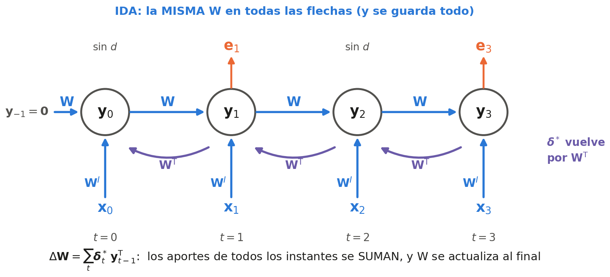{width=100%}

$$\frac{\partial E_t}{\partial w_{ji}} = \sum_{\tau=0}^{t} \delta_{\tau,j}\,y_{\tau-1,i} \qquad \frac{\partial E_t}{\partial w^{I}_{ji}} = \sum_{\tau=0}^{t} \delta_{\tau,j}\,x_{\tau,i}$$

El error de un instante se reparte sobre **todos** los anteriores, porque el mismo peso participó en todos, y los aportes se **suman**. Para los pesos de entrada los deltas son los mismos: cambia sólo el último factor.

## Gradiente — forma optimizada

$$\boldsymbol{\delta}^*_T = \mathbf{0} \qquad \boldsymbol{\delta}^*_t = \big[\mathbf{e}_t + \mathbf{W}^{\mathsf{T}}\boldsymbol{\delta}^*_{t+1}\big] \odot \varphi'(\mathbf{v}_t)$$

El delta acumulado junta el error medido en ese instante con todo lo arrastrado de los posteriores, ya sumado. Se recorre de $T-1$ a $0$, al revés que la propagación. La **transpuesta** es lo que distingue la ida de la vuelta.

$$\Delta\mathbf{W} \mathrel{+}= \boldsymbol{\delta}^*_t\,\mathbf{y}_{t-1}^{\mathsf{T}} \qquad \Delta\mathbf{W}^{I} \mathrel{+}= \boldsymbol{\delta}^*_t\,\mathbf{x}_t^{\mathsf{T}}$$

En el mismo barrido se acumulan los dos gradientes. Da **exactamente el mismo** gradiente que la forma derivada, reorganizado, pero en **un solo barrido**: el costo baja de $O(T^2)$ a $O(T)$.

## Actualización

$$\mathbf{W} \leftarrow \mathbf{W} - \eta\,\Delta\mathbf{W} \qquad \mathbf{W}^{I} \leftarrow \mathbf{W}^{I} - \eta\,\Delta\mathbf{W}^{I}$$

Los pesos se tocan **al final de la secuencia**. Si se actualizaran en el medio del barrido, los deltas que faltan usarían una $\mathbf{W}$ distinta de la que se usó hacia adelante.

## Truncado

$$\tau \ge \max(0,\ t-P) \qquad\qquad O(T^2) \longrightarrow O(T\,P)$$

Truncar limita la vuelta a $P$ instantes: el costo pasa a $O(T\,P)$, pero se pierden las dependencias más largas que $P$. Las dos cosas abaratan el cálculo, con una diferencia que se pregunta: **truncar cambia el gradiente (es una aproximación); optimizar con $\delta^*$ no (da el mismo, exacto).**

## Arquitecturas con retardo

$$\tilde{\mathbf{x}}_t = \big(\mathbf{x}_t,\ \mathbf{x}_{t-1},\ \dots,\ \mathbf{x}_{t-D}\big)$$

**TDNN:** la entrada se amplía con sus retardos y la red vuelve a ser hacia adelante. Toda la memoria está en la entrada, no en la red.

> **OJO — por qué la TDNN no es recurrente ni dinámica**
> Porque **no tiene ninguna conexión hacia atrás**: la señal va de la entrada a la salida y termina. Los retardos son sólo **una forma de armar la entrada** —una ventana que se desliza sobre la secuencia— y, en la TDNN completa, también la entrada de cada capa. Si se le presenta **la misma ventana, da siempre la misma salida**: es una función, no tiene estado. Por eso se entrena con back-propagation común, sin desenrollar nada. El precio: sólo recuerda lo que entra en la ventana, y cada retardo agrega un juego de pesos. Aplicaciones: habla y manuscritos. (Resumen `01-redes-dinamicas`, §13.)


$$\mathbf{y}_t = \varphi\big(\mathbf{W}^{I}\mathbf{x}_t + \mathbf{W}^{C}\mathbf{c}_t\big), \qquad \mathbf{c}_t = \mathbf{y}^{\text{oculta}}_{t-1} \;\;(\text{Elman}) \qquad \mathbf{c}_t = \mathbf{y}^{\text{salida}}_{t-1}\;\;(\text{Jordan})$$

La capa de contexto guarda la salida anterior —de la oculta en Elman, de la salida en Jordan— y se trata como una entrada más con valores congelados. Con eso se entrena con back-propagation común: es BPTT truncada a un solo paso.

> **OJO — las cuatro arquitecturas, ordenadas** (las «otras» sólo se nombran)
> **TDNN:** sin recurrencia, sólo retardos. **Elman y Jordan:** recurrencia **parcial**, por una capa de contexto — Elman realimenta la oculta, Jordan la salida. **Recurrente completa con BPTT:** recurrencia total, desenrollada para poder derivarla. **Hopfield:** recurrencia total también, pero sin gradiente: Hebb de una pasada.


### Cómo se lee

**$\delta_{\tau,j}$** es el mismo delta del multicapa, con «capa siguiente» reemplazado por «**instante** siguiente»: el tiempo hace de profundidad. **$\delta^*_t$** es el delta **acumulado**: ya trae sumados los errores de todos los instantes posteriores, y por eso alcanza un solo barrido.

Y la suma sobre $\tau$ se lee así: **el error de un instante se reparte sobre todos los instantes anteriores, porque el mismo peso participó en todos**. Los aportes **se suman** — no se promedian.

> **PARA LA DEFENSA — la respuesta de treinta segundos**
> *«Es back-propagation con el tiempo haciendo de profundidad. Si la red se realimenta durante $T$ instantes, la dibujo como $T$ copias en fila y la trato como una red profunda. Con dos diferencias: las copias comparten los mismos pesos, así que los aportes de todos los instantes se suman sobre el mismo peso; y hay que guardar toda la secuencia hacia adelante, porque la vuelta necesita la derivada de la activación de cada instante.»*
> **Las repreguntas seguras:** los aportes se **suman**, no se promedian; hacia adelante va $\mathbf{W}$ y hacia atrás $\mathbf{W}^{\mathsf{T}}$; los pesos se actualizan **al final** de la secuencia, nunca en el medio del barrido; y **truncar no es lo mismo que optimizar** — truncar cambia el gradiente, el $\delta^*$ da exactamente el mismo.

---

\newpage

# 7. SOM

> **SI TE DICEN — «contame sobre el SOM»**
> «El mapa de Kohonen es una red **no supervisada** que acomoda prototipos sobre los datos **y además los deja ordenados**. Cada neurona tiene un vector de pesos **en el mismo espacio que las entradas** y un lugar en una **grilla**, normalmente 2D. Por cada patrón, dos pasos: **competencia** —gana la neurona más cercana al dato— y **adaptación** —la ganadora **y sus vecinas de la grilla** se acercan al dato una fracción $\eta$—. Esa vecindad es lo que lo separa de $k$-medias: produce el **ordenamiento topológico**, neuronas vecinas en el mapa representan zonas vecinas de los datos. Se entrena en **tres etapas**: ordenamiento (vecindad grande, $\eta$ alta), transición, y ajuste fino (vecindad cero, $\eta$ chica). Se corta por épocas, porque no hay error que medir. Sirve para agrupar y visualizar datos de alta dimensión y, etiquetando las neuronas al final, para clasificar.»


> **IDEA DE FONDO — en qué consiste**
> Acomodar unos pocos prototipos para que representen a muchos datos, **y además queden ordenados entre sí**. Dos partes por cada patrón: **competir** (gana el prototipo más cercano) y **adaptar** (el ganador se corre un poco hacia el dato). La imagen clave: los pesos de cada neurona **viven en el mismo espacio que los datos**, así que son un punto que se va mudando hacia donde hay datos. Y lo que lo hace un *mapa* y no una simple cuantización: **cuando el ganador se mueve, arrastra a sus vecinos de la grilla**. Por eso neuronas contiguas terminan representando zonas contiguas del espacio de entrada.


## Datos de partida

$$\{\mathbf{x}(n)\} \subset \mathbb{R}^M, \qquad \text{sin etiquetas}$$

Sólo vectores de entrada. El entrenamiento es **no supervisado**: la red se organiza a partir de cómo están distribuidos los datos.

## Arquitectura

$$\mathbf{w}_j \in \mathbb{R}^M, \qquad j = 1,\dots,N$$

Los pesos de cada neurona viven **en el mismo espacio que las entradas**: son un punto del espacio de datos, no coeficientes. Por eso tiene sentido la distancia entre una entrada y una neurona.

Las neuronas están además en una grilla, que no tiene nada que ver con $\mathbb{R}^M$: define **quién es vecino de quién**, y es lo único que la topología aporta.

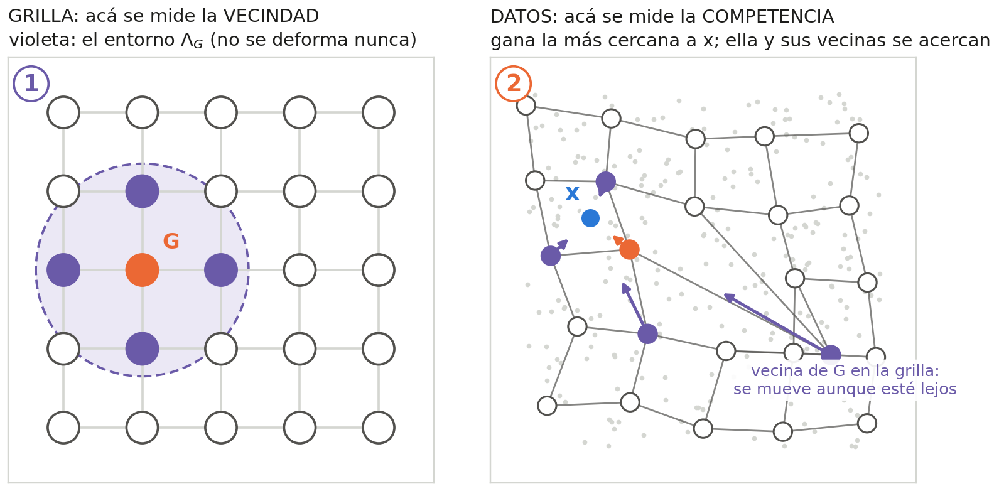{width=95%}

## Inicialización

$$\mathbf{w}_j(0) \sim \text{al azar, chicos y distintos entre sí}$$

Distintos obligatoriamente: dos neuronas que arrancan en el mismo punto ganan y se mueven siempre juntas, y nunca se separan.

## Competencia

$$j^*(n) = G(\mathbf{x}(n)) = \arg\min_{\forall j}\big\{\lVert \mathbf{x}(n) - \mathbf{w}_j(n)\rVert\big\}$$

Se presenta una entrada y gana la neurona más cercana en el espacio de datos, midiendo con distancia euclídea.

## Vecindad

$$h_{G,i} = \beta(n)\,e^{-\frac{|G-i|^2}{2\sigma^2(n)}}$$

La influencia sobre cada neurona decae con su distancia **en la grilla** a la ganadora: la de al lado se mueve casi tanto como ella, una lejana casi nada. Con entorno uniforme, en cambio, es $\beta(n)$ adentro del radio y cero afuera.

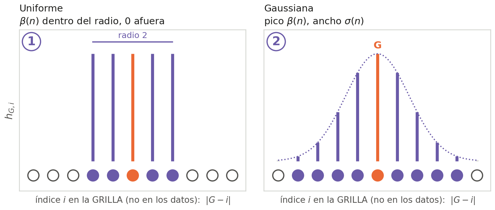{width=95%}

## Adaptación

$$\mathbf{w}_j(n+1) = \begin{cases} \mathbf{w}_j(n) + \eta(n)\big(\mathbf{x}(n) - \mathbf{w}_j(n)\big) & y_j \in \Lambda_G(n) \\[2pt] \mathbf{w}_j(n) & y_j \notin \Lambda_G(n) \end{cases}$$

La ganadora y sus vecinas se mueven hacia la entrada: el paréntesis es el vector que va de la neurona al dato, y $\eta$ dice qué fracción de ese camino se recorre. Las de afuera del entorno no se tocan. Ésta es la versión con **entorno uniforme**, la que se implementa.

$$\mathbf{w}_j(n+1) = \mathbf{w}_j(n) + h_{G,j}(n)\,\big(\mathbf{x}(n) - \mathbf{w}_j(n)\big) \qquad \forall\, j$$

Con **vecindad gaussiana**, cada neurona recibe $h_{G,j}(n)$ en lugar de $\eta(n)$: la ganadora se mueve con el pico $\beta(n)$ y las demás cada vez menos según su distancia en la grilla. No hay corte en seco, y achicar $\sigma(n)$ es la forma continua de reducir el entorno.

Que se muevan **las vecinas de la grilla** es lo único que separa un SOM de una cuantización vectorial cualquiera: es lo que hace que neuronas contiguas terminen representando zonas contiguas del espacio de entrada.

## Decaimiento — las tres etapas

$$\eta(n) \downarrow, \qquad \Lambda_G(n) \downarrow$$

| Etapa | $\Lambda_G$ | $\eta$ | Épocas |
|---|---|---|---|
| Ordenamiento | $\approx$ medio mapa | 0,9 – 0,7 | 500 – 1000 |
| Transición | $\to 1$, lineal | $\to 0{,}1$ | $\approx$ 1000 |
| Ajuste fino | $0$ | 0,1 – 0,01, cte. | $\approx$ 3000 |

Primero se ordena el mapa a lo grande con entorno amplio y pasos largos; después se afina con entorno nulo y pasos cortos. No hay error que mirar: se corta por cantidad de épocas.

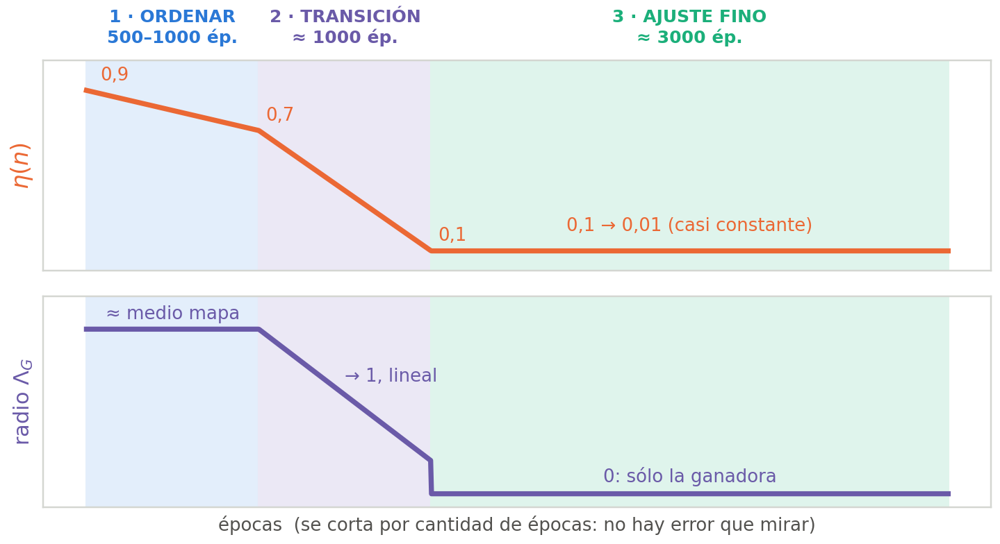{width=90%}

### Cómo se lee la adaptación

$\mathbf{x} - \mathbf{w}_j$ **no es un error contra una salida deseada**: es el vector que va de la neurona al dato, dos puntos del mismo espacio. Y $\eta$ es **qué fracción de ese trecho se recorre**. Por eso el entrenamiento es no supervisado aunque la fórmula se parezca a la del gradiente.

Y hay **dos distancias distintas** en el algoritmo, que es lo que más se confunde: la de la competencia se mide **en el espacio de los datos**; la de la vecindad, **en la grilla**. Una neurona puede tener su peso lejísimos del patrón y actualizarse igual, sólo porque en el mapa está al lado de la ganadora. **Eso es exactamente lo que produce el ordenamiento topológico.**

> **IDEA DE FONDO — ordenamiento topológico, en una definición**
> Que **la vecindad en la grilla refleje la vecindad en los datos**: dos neuronas contiguas en el mapa tienen pesos cercanos en $\mathbb{R}^M$, y dos patrones parecidos activan neuronas cercanas en el mapa. Con eso, un espacio de muchas dimensiones queda **desplegado** sobre una grilla de 2D sin romper las relaciones de cercanía — es lo que permite **visualizarlo**.
> **Por qué el SOM lo logra y $k$-medias no:** en $k$-medias cada centro se mueve sólo por sus propios datos; los centros **no saben nada unos de otros**, así que el centro 3 puede terminar al lado del 17 y lejos del 4 — el índice no significa nada. En el SOM, al moverse, **la ganadora arrastra a sus vecinas de la grilla**, y con entorno grande al principio el mapa entero se despliega en orden antes de afinar. **La vecindad es la única diferencia**, y es toda la diferencia. (Resumen `01-mapas-autoorganizativos`, §7 y §9.)


> **PARA LA DEFENSA — la respuesta de treinta segundos**
> *«Acomoda unos pocos prototipos para que representen a muchos datos, y además queden ordenados entre sí. Por cada patrón: gana el prototipo más cercano y se corre un poco hacia el dato. Lo que lo hace un mapa y no una simple cuantización es que el ganador arrastra a sus vecinos de la grilla, y por eso neuronas contiguas terminan representando zonas contiguas del espacio de entrada.»*
> **Las repreguntas seguras:** por qué $k$-medias **no** tiene ordenamiento topológico (no hay vecindad: se mueve sólo el ganador); para qué sirve la etapa de ordenamiento y qué parámetros son clave ($\Lambda_G$ grande y $\eta$ alta); y por qué los pesos iniciales tienen que ser **distintos entre sí**.

---

\newpage

# 8. LVQ1

> **SI TE DICEN — «contame sobre LVQ»**
> «Es la **versión supervisada** de la idea del SOM. Hay prototipos en el espacio de datos, **cada uno con una clase asignada**. Por cada patrón gana el más cercano y comparo su clase con la del dato: **si coincide, el prototipo se acerca; si no, se aleja**. Se mueve **sólo el ganador**, sin vecindad, porque no busco un mapa ordenado sino **ubicar bien la frontera entre clases**. Un dato nuevo toma la clase del prototipo más cercano. La variante **LVQ1-O** le da a cada prototipo **su propia tasa de aprendizaje**, que baja cuando acierta y sube cuando se equivoca, para que todos los patrones pesen parecido y el resultado no dependa del orden en que se presentaron.»


> **IDEA DE FONDO — en qué consiste**
> Lo mismo que el SOM pero **con etiquetas y con castigo**. Tres partes: **competir**, **ver si el ganador era de la clase correcta**, y **premiar o castigar**. Si acertó, el prototipo se acerca al dato; si se equivocó, **se aleja**. Eso es todo lo que cambia, y cambia el objetivo: al SOM le importa cubrir bien el espacio, a LVQ le importa **dónde queda la frontera entre clases**. Por eso acá no hay vecindad: se mueve sólo el ganador.


## Datos de partida

$$\{(\mathbf{x}(n),\ d(n))\}, \qquad \mathcal{C}(i) \text{ asignada a cada prototipo}$$

Acá **sí** hay etiquetas: LVQ es supervisado. Y cada prototipo tiene su clase asignada de antemano.

## Ganador

$$c(n) = \arg\min_i\big\{\lVert \mathbf{x}(n) - \mathbf{m}_i(n)\rVert\big\}$$

Igual que en el SOM: gana el prototipo más cercano.

## Signo

$$s(c,d,n) = \begin{cases} +1 & \mathcal{C}(c(n)) = d(n) \\ -1 & \mathcal{C}(c(n)) \neq d(n) \end{cases}$$

Acá está toda la diferencia con el SOM: se compara la clase del prototipo que ganó con la clase verdadera del dato.

## Adaptación

$$\mathbf{m}_c(n+1) = \mathbf{m}_c(n) + s(c,d,n)\,\alpha\big[\mathbf{x}(n) - \mathbf{m}_c(n)\big]$$

El ganador se mueve **hacia** el dato si acertó la clase, y se **aleja** si se equivocó. El castigo es lo que no existe en el SOM, y es lo que empuja la frontera entre clases a su lugar.

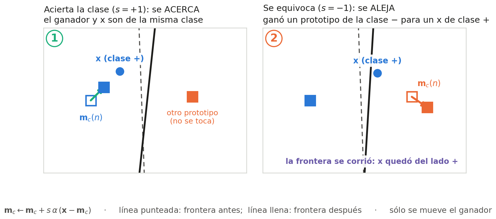{width=95%}

$$\mathbf{m}_i(n+1) = \mathbf{m}_i(n) \qquad \forall\, i \neq c$$

Se mueve **sólo el ganador**: no hay vecindad. A LVQ no le interesa la topología, le interesa la frontera de decisión.

> **OJO — cómo queda cada prototipo asociado a una clase, y dónde entra la supervisión**
> La clase de cada prototipo **se asigna al inicializar**, antes de entrenar: se pone al menos uno por clase —varios si la clase tiene una forma complicada— y se inicializan al azar o copiando patrones de esa clase. **La supervisión entra en el signo, en cada iteración**: la clase del ganador se compara con la etiqueta del patrón. Para clasificar un dato nuevo, se busca el prototipo más cercano y se le asigna su clase: el espacio queda partido en las zonas de influencia de cada prototipo, y la frontera de decisión es la línea que separa zonas de prototipos de **distinta** clase.
> **Por qué no hay ordenamiento topológico:** no hay grilla ni vecindad —los prototipos son puntos sueltos, sin arquitectura neuronal— y el objetivo tampoco lo pide: con la supervisión el método busca **dónde poner la frontera**, no cubrir el espacio de forma ordenada. Un prototipo incluso **se aleja** de datos cercanos si son de otra clase.


## Forma combinación

$$\mathbf{m}_c(n+1) = \big[1 - s(n)\alpha(n)\big]\,\mathbf{m}_c(n) + s(n)\alpha(n)\,\mathbf{x}(n)$$

La misma regla reescrita: el prototipo nuevo es una combinación del viejo y del patrón que acaba de entrar. Escrita así se ve el problema del $\alpha$ constante.

## LVQ1-O — el $\alpha$ óptimo

$$\alpha_c(n) = \big[1 - s(n)\alpha_c(n)\big]\,\alpha_c(n-1)$$

La condición que se impone: que el patrón anterior siga pesando lo mismo que el actual después de este paso. Con $\alpha$ constante no pasa — cada patrón viejo arrastra un factor más, y el prototipo termina dependiendo casi sólo del final del archivo, que es un orden arbitrario.

$$\boxed{\;\alpha_c(n) = \frac{\alpha_c(n-1)}{1 + s(n)\,\alpha_c(n-1)}\;}$$

Despejando queda esto: un $\alpha$ propio de cada prototipo, que decrece solo cuando acierta y crece cuando se equivoca. **Hay que saturarlo en 1** (la advertencia de la cátedra: «no sobrepasar $\alpha > 1$»). Con $s=-1$ el denominador es $1-\alpha_c(n-1) < 1$ y $\alpha$ crece; si se acumulan errores seguidos pasa de 1, el prototipo se pasa de largo del patrón en cada corrección y el algoritmo se vuelve inestable.

### Cómo se lee

Todo LVQ está en el **signo**. Con $s=+1$ el prototipo se acerca al dato; con $s=-1$ **se aleja**. Ese castigo no existe en el SOM, y es lo que cambia el objetivo: al SOM le importa **cubrir bien el espacio**, a LVQ le importa **dónde queda la frontera entre clases**. Por eso acá no hay vecindad — la topología no le interesa.

> **PARA LA DEFENSA — la respuesta de treinta segundos**
> *«Es el SOM con etiquetas y con castigo. Gana el prototipo más cercano, se mira si su clase era la correcta, y si acertó se acerca al dato y si se equivocó se aleja. Se mueve sólo el ganador: no hay vecindad, porque no busca un mapa ordenado sino una buena frontera de decisión.»*
> **Las repreguntas seguras:** dónde entra la supervisión (**desde la primera iteración**, a diferencia del SOM etiquetado, donde entra recién después de entrenar); por qué no tiene ordenamiento topológico; y el problema del $\alpha$ constante — los primeros patrones pesan cada vez menos y el prototipo termina dependiendo del final del archivo, que es un orden arbitrario.

---

\newpage

# 9. Capacidad de generalización y protocolo de evaluación

> **SI TE DICEN — «contame sobre generalización y evaluación»**
> «Generalizar es **funcionar bien con datos que la red no vio**, que es lo que realmente importa: el error de entrenamiento se puede llevar a cero memorizando. Como ese error no se puede calcular, **se estima con datos apartados**. Los datos se parten en **tres conjuntos disjuntos y estratificados**: entrenamiento ajusta los pesos, monitoreo decide hiperparámetros y cuándo parar, y prueba se mira **una sola vez** al final. El **sobreajuste** se ve en las curvas: entrenamiento sigue bajando mientras monitoreo toca un mínimo y sube; ahí se corta, **parada temprana**. Con pocos datos, **validación cruzada de $k$ particiones**: se entrena $k$ veces rotando qué bloque es de prueba y se reporta **media y varianza** del error. Para medir, la **matriz de confusión**: sensibilidad, especificidad, precisión, exactitud, $F_1$. **Nunca una sola medida**, porque con clases desbalanceadas la exactitud engaña.»


> **IDEA DE FONDO — en qué consiste**
> Contestar «¿qué tan bien anda esto?» **sin engañarse**. Lo que interesa no es el error sobre los datos con los que entrené —ése lo puedo llevar a cero memorizando— sino el error sobre datos que la red **nunca vio**. Como ese error no se puede calcular, se **estima**, y todo el protocolo existe para que esa estimación no esté inflada. Tres partes: **partir los datos** en conjuntos con trabajos distintos, **monitorear** el entrenamiento para saber cuándo parar, y **medir** con el número adecuado. La trampa que hay que saber nombrar: si elegís la cantidad de épocas o la arquitectura mirando el conjunto de prueba, ese número **ya no mide generalización**, porque lo usaste para decidir.


*No es un algoritmo de aprendizaje, pero es procedimiento y se pregunta igual.*

> **IDEA DE FONDO — la superficie de error, que es el terreno de todo esto**
> Si se grafica el error contra los pesos, queda una **superficie**: con un peso, una curva; con dos, un paisaje; con miles, algo que no se puede imaginar. Entrenar por gradiente es **bajar por esa superficie** desde un punto al azar. Las superficies reales tienen **mínimos locales** (se cae en el valle más cercano al arranque), **mesetas** (gradiente cero, el algoritmo no sabe hacia dónde ir) y rugosidad. Consecuencia práctica: la misma red con los mismos datos da resultados distintos según la inicialización, así que **nunca se reporta una sola corrida**. Y «parámetro» no son sólo los pesos: la cantidad de neuronas o de capas también, y ésos **no** los ajusta el gradiente — los elige uno, y ahí está la trampa de más abajo. (Resumen `01-capacidad-de-generalizacion`, §1.)


## Qué es generalizar

$$\varepsilon_{\text{gen}} = E\big[\varepsilon(\mathbf{x})\big]_{\mathbf{x}\sim\text{población}} \;\approx\; \varepsilon_{\text{prueba}}$$

La **capacidad de generalización** es el error esperado sobre toda la población de datos posibles, no sólo los que tengo. Como la población no se conoce, se la representa con un puñado de patrones **apartados desde el principio** y nunca usados para ajustar nada: ésa es la única estimación honesta que existe.

$$\varepsilon_{\text{entrenamiento}} \;\leq\; \varepsilon_{\text{prueba}}$$

En la práctica, casi siempre: el entrenamiento optimizó justo sobre esos patrones. (No es un teorema — con pocos patrones de prueba puede salir al revés por azar — pero si pasa seguido hay que sospechar de la partición.) Por eso **el error de entrenamiento nunca se reporta como resultado** — no mide nada que le importe a nadie. La distancia entre los dos números es lo que se llama **brecha de generalización**.

## Memorizar contra generalizar

$$\varepsilon_{\text{entren}}(n) \downarrow \quad\text{mientras}\quad \varepsilon_{\text{monit}}(n) \uparrow$$

El síntoma del **sobreajuste**, y es lo único que hay que saber dibujar: dos curvas contra las épocas. La de entrenamiento baja siempre; la de monitoreo baja, toca un mínimo y **vuelve a subir**. A partir de ese punto la red dejó de aprender la regla y empezó a aprender el ruido de los patrones concretos que le tocaron.

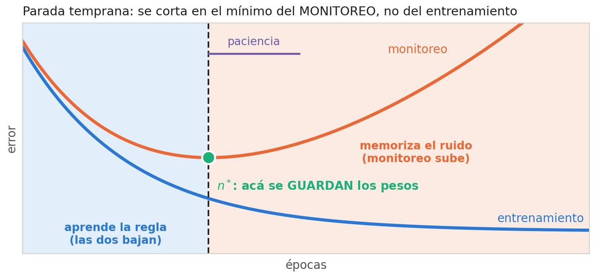{width=90%}

| Capacidad del modelo | Error de entrenamiento | Error de monitoreo | Nombre |
|---|---|---|---|
| Insuficiente | alto | alto | **subajuste** — ni siquiera puede representar la regla |
| Adecuada | bajo | bajo | el punto que se busca |
| Excesiva | ≈ 0 | alto | **sobreajuste** — memorizó |

La capacidad se regula con la **cantidad de parámetros** (neuronas ocultas, capas, cantidad de centros en una RBF) y con **cuánto se entrena**. Con muchos parámetros y muchas épocas, cualquier red pasa por todos los puntos de entrenamiento — y no sirve para nada.

> **OJO — sobreajuste no es un error del algoritmo**
> El algoritmo hace exactamente lo que se le pidió: minimizar el error sobre el conjunto de entrenamiento. El problema es que **ése no era el objetivo real**. Por eso la solución no está adentro del algoritmo sino afuera: en cómo se parten los datos y cuándo se corta.

## Las tres particiones

$$\mathcal{D} = \mathcal{D}_{\text{entren}} \cup \mathcal{D}_{\text{monit}} \cup \mathcal{D}_{\text{prueba}}, \qquad \mathcal{D}_i \cap \mathcal{D}_j = \emptyset$$

El conjunto se parte en tres pedazos **disjuntos**. Disjuntos de verdad: un patrón repetido en dos conjuntos arruina la medición igual que si no se hubiera partido nada.

$$\mathcal{D}_{\text{entren}} \to \mathbf{W} \qquad \mathcal{D}_{\text{monit}} \to \text{hiperparámetros y parada} \qquad \mathcal{D}_{\text{prueba}} \to \text{el número final}$$

Cada uno tiene **un solo trabajo**, y ésa es la frase para el oral:

- **Entrenamiento** (≈ 50–70 %): es el único que entra en la regla de actualización. Sus patrones ajustan los pesos.
- **Monitoreo** o validación (≈ 15–25 %): **no ajusta pesos**, sólo se mide sobre él. Con eso se decide cuántas épocas, cuántas neuronas ocultas, qué $\mu$, qué arquitectura.
- **Prueba** (≈ 15–25 %): se guarda en un cajón y se mira **una sola vez**, al final, con todo ya decidido. Es el que estima la generalización.

$$\text{proporción de clases en cada partición} \;=\; \text{proporción en } \mathcal{D}$$

**Estratificación:** las tres particiones tienen que respetar la proporción original de clases. Si el 10 % de los datos es de la clase positiva, el 10 % de cada partición también. Sin eso, una partición puede quedarse sin ejemplos de una clase y el número no significa nada.

Y antes de partir, **se mezcla**: un archivo ordenado por clase partido tal cual deja el conjunto de prueba con una sola clase adentro.

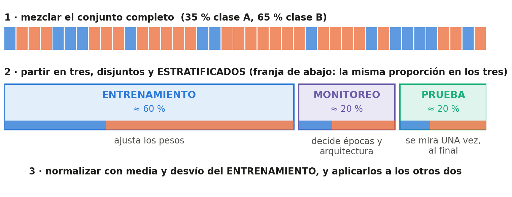{width=95%}

> **OJO — la normalización también se contamina**
> Media, desvío, mínimos y máximos para normalizar se calculan **sólo con el conjunto de entrenamiento** y después se aplican a los otros dos. Calcularlos sobre todo el conjunto es filtrar información de la prueba hacia el entrenamiento, y el error de prueba sale optimista.

## Monitoreo y parada temprana

$$n^{*} = \arg\min_{n}\; \varepsilon_{\text{monit}}(n) \qquad \mathbf{W}^{*} = \mathbf{W}(n^{*})$$

**Parada temprana:** se entrena midiendo el error de monitoreo época por época, y se guarda la red del **mínimo de esa curva**, no la del final. El entrenamiento puede seguir un rato más para confirmar que el mínimo era el mínimo —eso es la *paciencia*— pero los pesos que quedan son los de $n^{*}$.

$$\varepsilon_{\text{monit}} \text{ decide} \;\Longrightarrow\; \varepsilon_{\text{monit}} \text{ ya no mide}$$

Y acá está la razón de ser del tercer conjunto, que es lo que más se pregunta. El monitoreo **no entrena** —sus patrones nunca entran en $\Delta w$— pero **sí decide**: la época elegida es la que a él le convino. Después de usarlo para elegir, su error quedó tan sesgado como el de entrenamiento, sólo que menos. Por eso hace falta un conjunto de **prueba** que no haya participado de ninguna decisión.

> **OJO — el error más común de todos: ajustar hiperparámetros con el test**
> El caso típico: se parten los datos, se define una red con 20 neuronas ocultas, se entrena, se mide sobre prueba… y como no dio bien, **se prueba con 10**, se vuelve a medir sobre prueba, y se reporta la mejor. Parece inocente, y es **sobreentrenar un nivel más arriba**: los pesos no vieron la prueba, pero **la cantidad de neuronas se eligió mirándola**. Ese número ya participó de una decisión y dejó de estimar la generalización. Lo mismo con las épocas, $\mu$, la cantidad de centros de una RBF, el $k$ de $k$-NN o la profundidad de un árbol.
> **La regla:** los datos de prueba **no se usan para nada** hasta el final. Todo lo que sea elegir —arquitectura, épocas, cualquier hiperparámetro— se decide con **monitoreo**, o con validación cruzada **dentro** del entrenamiento. La imagen de la cátedra: el cliente te manda sólo los datos de entrenamiento y **se queda** con los de prueba para evaluarte; si los tenés a mano, comportate como si no los tuvieras.


## Validación cruzada de $k$ particiones ($k$-fold)

$$\mathcal{D} = \bigcup_{j=1}^{k}\mathcal{F}_j, \qquad \mathcal{F}_i \cap \mathcal{F}_j = \emptyset, \qquad |\mathcal{F}_j| \approx N/k$$

El conjunto se parte en $k$ bloques (*folds*) disjuntos y del mismo tamaño, **estratificados** igual que antes. Se usa cuando hay **pocos datos**: apartar un 20 % fijo para prueba sería desperdiciar patrones y, además, el resultado dependería demasiado de cuáles tocaron.

$$\varepsilon_j = \varepsilon\big(\mathcal{F}_j\big) \quad \text{entrenando con} \quad \mathcal{D}\setminus\mathcal{F}_j, \qquad j = 1,\dots,k$$

Se entrena $k$ veces. En la vuelta $j$, el bloque $\mathcal{F}_j$ hace de prueba y los otros $k-1$ de entrenamiento. Así **cada patrón se usa para medir exactamente una vez** y para entrenar $k-1$ veces. Cada vuelta **reinicializa los pesos de cero**: si no, la segunda red arrancaría sabiendo cosas del bloque que le toca medir.

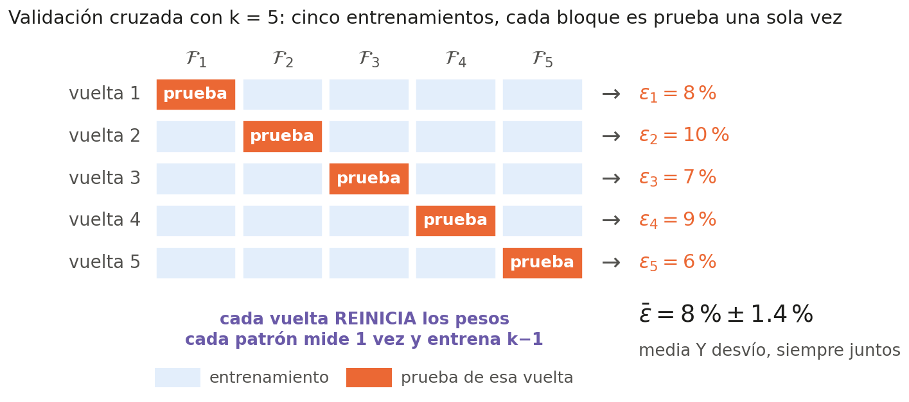{width=90%}

$$\bar{\varepsilon} = \frac{1}{k}\sum_{j=1}^{k}\varepsilon_j \qquad \sigma^2_\varepsilon = \frac{1}{k}\sum_{j=1}^{k}\big(\varepsilon_j - \bar{\varepsilon}\big)^2$$

El resultado es la **media** de los $k$ errores, y **la varianza se reporta siempre con ella**: dice si el resultado es estable o si dependió de qué patrones tocaron. Una media de 8 % con desvío de 1 % y otra de 8 % con desvío de 6 % son resultados completamente distintos.

$$k = N \;\Longrightarrow\; \textit{leave-one-out}$$

El caso extremo: cada bloque es **un solo patrón**. Se entrena $N$ veces y se mide sobre uno cada vez. Aprovecha el máximo de datos posible, pero cuesta $N$ entrenamientos y la estimación tiene **mucha varianza**. Los valores usuales son $k = 5$ o $k = 10$, que equilibran costo y estabilidad.

**Las variantes, y cómo se llaman:**

| Variante | Cómo parte | Cuándo |
|---|---|---|
| ***k*-fold** | $k$ bloques, rota cuál es de prueba; la $k$ cuenta **particiones** | lo estándar, $k = 5$ o $10$ |
| **leave-$k$-out** | deja $k$ **patrones** afuera por vez; la $k$ cuenta **patrones** | misma familia, otra nomenclatura |
| **leave-one-out** | un patrón afuera, $N$ entrenamientos | muy pocos datos; caro, pero con poco sesgo |
| **particiones solapadas** | los bloques comparten patrones | pocos datos: más particiones, pero ya **no son independientes** y la varianza sale subestimada |
| **bootstrap** | cada partición se sortea **con reposición** | muchísimas particiones; el mismo sorteo que usa bagging |


> **OJO — la validación cruzada evalúa un método, no entrega un modelo**
> Al terminar hay $k$ redes distintas, y ninguna es «la» red. Lo que se estimó es qué tan bien anda **el procedimiento** (esta arquitectura, con estos hiperparámetros, sobre estos datos). Elegido el procedimiento, el modelo final se entrena **de nuevo, con todos los datos**.
> Y si dentro de la validación cruzada además hay que elegir hiperparámetros, el conjunto de monitoreo sale de los $k-1$ bloques de entrenamiento — **nunca** del bloque que está haciendo de prueba.

## Matriz de confusión

|  | predijo $\oplus$ | predijo $\ominus$ | total real |
|---|---|---|---|
| **es $\oplus$** | $t_\oplus$ | $f_\ominus$ | $N_\oplus$ |
| **es $\ominus$** | $f_\oplus$ | $t_\ominus$ | $N_\ominus$ |

La tabla cruza **lo que era** (filas) contra **lo que dijo** (columnas). La diagonal son los aciertos; fuera de la diagonal, los dos tipos de error, que casi nunca cuestan lo mismo.

$$N_\oplus = t_\oplus + f_\ominus \qquad N_\ominus = f_\oplus + t_\ominus \qquad N = N_\oplus + N_\ominus$$

Los totales por fila son los que **realmente** pertenecen a cada clase. Ojo con la lectura de los nombres: $f_\ominus$ es «dijo negativo y erró», o sea que **era positivo**. El subíndice nombra lo que la red **dijo**, no lo que era.

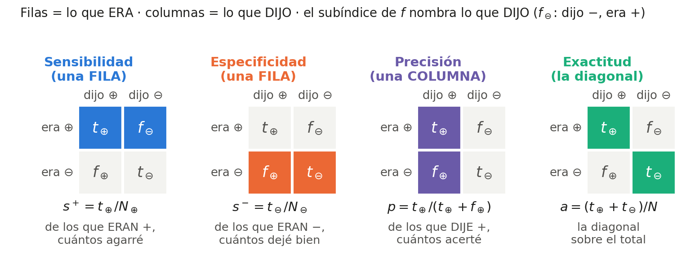{width=100%}

$$s^{+} = \frac{t_\oplus}{N_\oplus} \qquad s^{-} = \frac{t_\ominus}{N_\ominus} \qquad p = \frac{t_\oplus}{t_\oplus + f_\oplus} \qquad a = \frac{t_\oplus + t_\ominus}{N}$$

**Sensibilidad** $s^{+}$: de los que **eran** positivos, cuántos agarré (una fila). **Especificidad** $s^{-}$: de los que **eran** negativos, cuántos dejé pasar bien (la otra fila). **Precisión** $p$: de los que **dije** positivos, cuántos acerté (una columna). **Exactitud** $a$: la diagonal sobre el total.

$$F_1 = \frac{2t_\oplus}{2t_\oplus + f_\oplus + f_\ominus} = 2\,\frac{s^{+}p}{s^{+}+p} \qquad G = \sqrt{s^{+}p}$$

Combinan sensibilidad y precisión en un número: $F_1$ es su **media armónica** y $G$ la **geométrica**. Las dos castigan el desbalance: si una de las dos es cero, el combinado es cero, cosa que un promedio común no haría.

> **OJO — el clasificador trivial, que es la repregunta clásica**
> Con 95 % de negativos, una red que contesta **siempre negativo** consigue $a = 0{,}95$, $s^{-} = 1$ y $s^{+} = 0$. La exactitud sola la haría pasar por excelente. Por eso **nunca se reporta una sola medida**, y por eso con clases desbalanceadas se mira $F_1$, $G$ o la matriz completa.

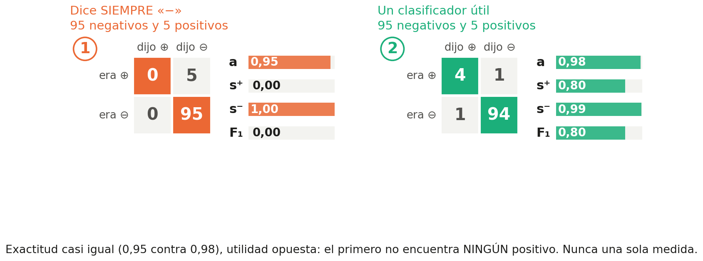{width=92%}

$$e = 1-a \qquad \delta_e = \frac{e_r - e}{e_r}$$

La mejora relativa respecto de un sistema de referencia: pasar de 98 % a 99 % de exactitud es **reducir el error a la mitad**, y pasar de 50 % a 51 % no es lo mismo aunque el salto de exactitud sea igual.

## Medidas para predicción

$$e_i = y_i - \hat{y}_i \qquad \tilde{\varepsilon}_A = \frac{1}{N}\sum_i \lvert e_i\rvert \qquad \tilde{\varepsilon}_S = \frac{1}{N}\sum_i e_i^2 \qquad \tilde{\varepsilon}_R = \sqrt{\tilde{\varepsilon}_S}$$

No se puede usar la suma de los errores: los signos se compensan. Por eso valor absoluto o cuadrado, y la raíz del cuadrático para volver a las **unidades del dato**. El cuadrático castiga más los errores grandes; el absoluto trata a todos igual.

### Cómo se lee

Todo el protocolo se lee con **una sola pregunta por conjunto: ¿este número participó de alguna decisión?** El de entrenamiento participó de todas, así que no mide nada. El de monitoreo participó de una —cuándo parar y qué arquitectura—, así que mide de más. El de prueba no participó de ninguna: es el único que estima la generalización, y por eso se mira **una sola vez**.

Y la matriz de confusión se lee **por dirección**: sensibilidad y especificidad miran **una fila** cada una (de los que **eran** de esa clase, cuántos agarré); la precisión mira **una columna** (de los que **dije** de esa clase, cuántos acerté); la exactitud mira todo. Un clasificador que dice siempre lo mismo engaña a varias de ellas.

> **PARA LA DEFENSA — la respuesta de treinta segundos**
> *«Generalizar es andar bien con datos que la red no vio, y como ese error no se puede calcular, se estima apartando datos desde el principio. Los datos se parten en tres conjuntos disjuntos y estratificados: entrenamiento ajusta los pesos, monitoreo decide cuándo parar y qué arquitectura usar, y prueba se mira una sola vez al final. Si hay pocos datos se usa validación cruzada de k particiones: se entrena k veces rotando cuál bloque hace de prueba, y se reporta la media de los k errores junto con la varianza.»*
> **Las repreguntas seguras:** por qué no alcanza con dos conjuntos (**porque el monitoreo decide, y lo que decide ya no puede medir**); cómo se ve el sobreajuste (**las dos curvas: entrenamiento baja, monitoreo toca un mínimo y sube — ahí se corta**); por qué cada vuelta de la validación cruzada **reinicializa los pesos**; y por qué la exactitud sola no sirve (**el clasificador trivial con clases desbalanceadas**).

---

\newpage

# 10. Bases estadísticas del reconocimiento de patrones

> **SI TE DICEN — «contame sobre las bases estadísticas del reconocimiento de patrones»**
> «Un sistema de reconocimiento **adquiere** la señal, la **preprocesa**, **extrae características** —pocos números que describen el objeto— y **clasifica**. Un **clasificador estadístico** es un conjunto de **funciones discriminantes**, una por clase: cada una le pone un puntaje al patrón y gana la más alta; eso parte el espacio en **regiones**, separadas por **fronteras** donde empatan. La mejor función discriminante posible es la **probabilidad a posteriori** $P(\omega_i\mid\mathbf{x})$, que sale de la **regla de Bayes**: verosimilitud por a priori, normalizado. El **clasificador de Bayes** elige la clase de mayor a posteriori y es el de **mínimo error** posible. El problema: para construirlo hay que conocer las a prioris y las densidades de cada clase, y nunca se conocen. **Todo el resto de la materia son formas de aproximarlo** sin conocer esas distribuciones.»


> **IDEA DE FONDO — en qué consiste**
> Poner en números la pregunta «¿de qué clase es esto?». Antes de mirar el patrón sólo sé **cuán común es cada clase** (la a priori). Mirar el patrón me da **evidencia**: qué tan esperable es ese valor dentro de cada clase. Bayes **combina las dos cosas** y me dice cuánto creer en cada clase **después** de mirar. Elegir la más creíble es lo mejor que se puede hacer — y ésa es la vara contra la que se mide todo clasificador.

## El sistema de reconocimiento

**Adquisición** (el sensor: del mundo a números) → **preprocesamiento** (limpiar, realzar) → **extracción de características** → **clasificación**. Y durante el diseño, dos bloques donde entra el conocimiento del experto: **qué características medir** y **qué clasificador usar**. Se extraen características porque el patrón crudo es enorme —una cara de $100\times100$ son 10.000 números— y unas pocas medidas bien elegidas la describen mejor. De las propiedades deseables de una característica, la que no se puede relajar es la **continuidad**: patrones parecidos tienen que caer cerca en el espacio de características; eso da robustez al ruido y permite generalizar.

Dos aproximaciones: la **estadística o geométrica** (el patrón es un **vector**, las clases son regiones del espacio: todo lo de esta materia) y la **estructural o sintáctica** (el patrón es una **cadena de símbolos** y se clasifica con gramáticas o autómatas).

## El clasificador estadístico

$$g_i : E \to \mathbb{R}, \quad i = 1,\dots,c \qquad\qquad \mathbf{x} \to \omega_i \iff g_i(\mathbf{x}) > g_j(\mathbf{x}) \;\; \forall\, j \neq i$$

**Una función discriminante por clase; cada una le pone un puntaje al patrón, y gana la más alta.**

$$R_i = \{\mathbf{x} : g_i(\mathbf{x}) > g_j(\mathbf{x})\ \forall j\neq i\} \qquad\qquad \text{frontera: } g_i(\mathbf{x}) - g_j(\mathbf{x}) = 0$$

Las funciones parten el espacio en **regiones de decisión**, y las **fronteras** son donde dos empatan. Si las $g$ son **lineales** ($d+1$ parámetros), las fronteras son hiperplanos; si son **cuadráticas** ($\tfrac12 d(d+1)+d+1$ parámetros), hipercuádricas. Más parámetros, fronteras más flexibles y más riesgo de sobreajuste.

> **IDEA DE FONDO — todos los clasificadores de la materia son esto**
> El perceptrón es el caso de dos clases con $g$ lineal. LVQ, el SOM etiquetado y $k$-NN usan $g_i(\mathbf{x}) = -$distancia al prototipo: el más cercano es el de $g$ más grande. Cambia **cómo se construyen las $g$**, no la regla del máximo.

## Las cuatro probabilidades

| Nombre | Símbolo | Qué se sabe → qué se pregunta |
|---|---|---|
| **A priori** | $P(\omega_i)$ | nada → ¿qué clase? (proporción de la clase en la población) |
| **Condicional** (verosimilitud) | $P(\mathbf{x}\mid\omega_i)$ | la clase → ¿qué tan esperable es este $\mathbf{x}$? |
| **Conjunta** | $P(\mathbf{x},\omega_i) = P(\mathbf{x}\mid\omega_i)\,P(\omega_i)$ | → ¿este $\mathbf{x}$ **y** esta clase? |
| **Incondicional** | $P(\mathbf{x}) = \sum_j P(\mathbf{x}\mid\omega_j)\,P(\omega_j)$ | → ¿este $\mathbf{x}$, de cualquier clase? |

Con la a priori sola se arma el **clasificador trivial** —elegir siempre la clase más común—: acierta mucho con clases desbalanceadas y no sirve para nada (sección 9).

## La regla de Bayes

$$\boxed{\;P(\omega_i\mid\mathbf{x}) = \frac{P(\mathbf{x}\mid\omega_i)\,P(\omega_i)}{P(\mathbf{x})}\;}$$

La **a posteriori**: cuánto creer en la clase **después** de ver el patrón. Sale de escribir la conjunta de las dos formas, $P(\mathbf{x}\mid\omega_i)P(\omega_i) = P(\omega_i\mid\mathbf{x})P(\mathbf{x})$, y despejar. Se lee como una **actualización**: la a priori, corregida por cuánto encaja $\mathbf{x}$ en la clase, y normalizada para que las a posteriori sumen 1.

> **OJO — la trampa clásica**
> $P(\mathbf{x}\mid\omega_i)$ **no es** $P(\omega_i\mid\mathbf{x})$. La primera es cuánto encaja la muestra en la clase; la segunda, cuánto creer que la muestra es de esa clase. Y como $\mathbf{x}$ es continua, $P(\mathbf{x}\mid\omega_i)$ es una **densidad**: puede valer más que 1.

## El clasificador de Bayes

$$\hat{\omega} = \arg\max_i P(\omega_i\mid\mathbf{x}) \;\equiv\; \arg\max_i P(\mathbf{x}\mid\omega_i)\,P(\omega_i) \;\equiv\; \arg\max_i \big[\log P(\mathbf{x}\mid\omega_i) + \log P(\omega_i)\big]$$

Se usan las a posteriori como funciones discriminantes. Las tres formas deciden **lo mismo**: se puede **tirar $P(\mathbf{x})$** porque es igual para todas las clases, y **tomar logaritmo** porque es creciente y no cambia el orden. De una función discriminante sólo importa **el orden**, no el valor.

$$P(\text{error}\mid\mathbf{x}) = 1 - \max_i P(\omega_i\mid\mathbf{x}) \qquad\qquad P(\text{error}) = \int P(\text{error}\mid\mathbf{x})\,P(\mathbf{x})\,d\mathbf{x}$$

**Por qué es el de mínimo error:** en cada $\mathbf{x}$, cualquier clasificador elige alguna clase y se equivoca con probabilidad uno menos la a posteriori de esa clase; eso es mínimo eligiendo la de **mayor** a posteriori. Si el error es mínimo en cada punto, el promedio también. **El error de Bayes es la cota inferior**: ningún clasificador puede bajarla. Si una clase se vuelve más probable a priori, la frontera se corre hacia la otra y le quita territorio.

## Por qué no se puede usar — y para qué sirve igual

Para construirlo hacen falta $P(\omega_i)$ y $P(\mathbf{x}\mid\omega_i)$, y **nunca se conocen**: sólo se tienen muestras, y cualquier estimación cambia con más datos. Por eso **todos los métodos de la materia aproximan al clasificador de Bayes** sin conocer las distribuciones: Naïve Bayes lo aproxima suponiendo independencia; $k$-NN, estimando localmente con los vecinos; las redes, aprendiendo las fronteras directamente. Y como el error tampoco se puede calcular, **se estima** con datos apartados: validación cruzada (sección 9).

> **PARA LA DEFENSA — la respuesta de treinta segundos**
> *«Un clasificador estadístico es un conjunto de funciones discriminantes, una por clase, y gana la mayor; eso define regiones y fronteras de decisión. La mejor función discriminante es la a posteriori, que sale de la regla de Bayes: verosimilitud por a priori sobre la incondicional. El clasificador de Bayes elige la clase de mayor a posteriori y es el de mínimo error. No se puede construir porque no se conocen las distribuciones, y por eso todo lo demás son formas de aproximarlo.»*
> **Las repreguntas seguras:** por qué se puede tirar $P(\mathbf{x})$; por qué es de mínimo error; la diferencia entre condicional y a posteriori; y qué pasa con la frontera si cambia la a priori. (Todo desarrollado, con el ejemplo numérico del brillo, en el resumen `01-bases-estadisticas`.)

---

\newpage

# 11. $k$ vecinos más cercanos ($k$-NN)

> **SI TE DICEN — «contame sobre $k$-NN»**
> «Es el clasificador más simple que hay: **no tiene entrenamiento**. Guarda todos los patrones etiquetados y, para clasificar uno nuevo, busca los **$k$ más cercanos** —con distancia euclídea— y le asigna la clase que **más se repite** entre ellos. No supone ninguna forma para la frontera, así que se adapta a cualquiera. El punto delicado es $k$: con $k$ chico la frontera sigue a cada punto y se aprende el ruido; con $k$ grande se suaviza, y en el extremo contesta siempre la clase mayoritaria. Se elige con **validación cruzada**, nunca con la prueba. Sus límites: predecir es caro porque hay que medir la distancia a **todos** los patrones, depende de la **escala** de los atributos, y funciona mal con muchas dimensiones.»


> **IDEA DE FONDO — en qué consiste**
> «Decime con quién andás y te diré quién sos». No hay modelo ni pesos: **los datos son el modelo**. Todo el trabajo se hace al clasificar: medir distancias, ordenar, votar. La imagen: un círculo que se agranda alrededor del punto nuevo hasta encerrar $k$ patrones, y gana la clase que tenga más adentro. Es de la misma familia que SOM y LVQ —todo se decide por **cercanía**—, pero sin prototipos: cada patrón de entrenamiento es su propio prototipo.


## Datos de partida

$$\{(\mathbf{x}_n,\ d_n)\}_{n=1}^{N}, \qquad k \in \{1, 2, \dots\}$$

Los patrones etiquetados, que se **guardan tal cual**. Y un solo hiperparámetro, $k$. «Entrenar» es esto y nada más.

## Distancias

$$\lVert \mathbf{x} - \mathbf{x}_n \rVert = \sqrt{\sum_{i} (x_i - x_{ni})^2} \qquad n = 1,\dots,N$$

Para el patrón nuevo se calcula la distancia a **cada uno** de los guardados. Es la misma distancia que la competencia del SOM, y el mismo cuidado: si un atributo va de 0 a 1000 y otro de 0 a 1, el primero manda solo. Por eso **se normaliza antes**, con media y desvío calculados sobre entrenamiento.

## Vecindario

$$\mathcal{N}_k(\mathbf{x}) = \{\text{los } k \text{ patrones con menor } \lVert \mathbf{x} - \mathbf{x}_n\rVert\}$$

Se ordenan las distancias y se quedan los $k$ primeros.

## Voto

$$\hat{d}(\mathbf{x}) = \arg\max_{c}\ \sum_{n \in \mathcal{N}_k(\mathbf{x})} [\,d_n = c\,]$$

El corchete vale 1 si el vecino es de la clase $c$ y 0 si no: la suma **cuenta votos**, y gana la clase con más. Con dos clases conviene $k$ **impar**, para que no haya empate. Una variante pesa cada voto por la inversa de la distancia, para que los más cercanos cuenten más.

## El efecto de $k$

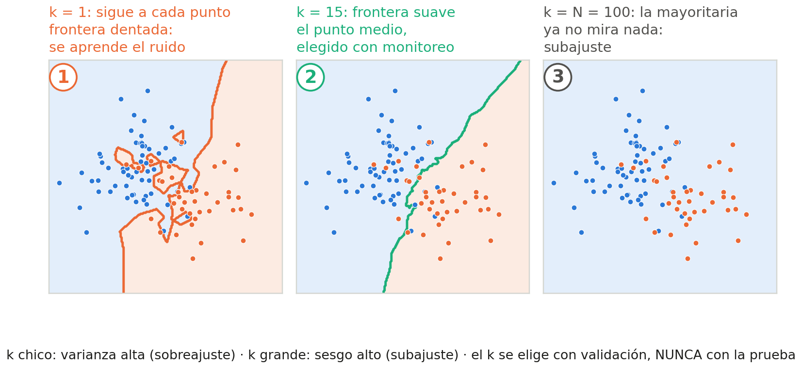{width=100%}

| $k$ | Frontera | Qué pasa |
|---|---|---|
| **chico** ($k=1$) | dentada, con islas alrededor de puntos sueltos | error de entrenamiento **cero** (cada patrón es su propio vecino); se aprende el ruido: **sobreajuste**, varianza alta |
| **intermedio** | suave | el punto que se busca |
| **grande** ($k \to N$) | cada vez más lisa; en $k=N$ desaparece | contesta siempre la clase **mayoritaria**: **subajuste**, sesgo alto; con clases desbalanceadas, la chica desaparece |

**Cómo se elige $k$:** se prueban varios valores y se queda el de menor error **sobre monitoreo**, o con validación cruzada **dentro** del conjunto de entrenamiento. Nunca mirando la prueba: $k$ es un hiperparámetro como la cantidad de neuronas ocultas, y cae en la misma trampa de la sección 9.

### Cómo se lee

$k$ hace el papel de la **capacidad del modelo**, pero al revés que las neuronas ocultas: **menos** $k$ es **más** flexible. Con $k=1$ la frontera tiene tantas piezas como patrones; con $k$ grande cada decisión promedia muchos patrones y el ruido se cancela. Es el compromiso sesgo–varianza de la sección 9 con una sola perilla.

| Ventajas | Desventajas |
|---|---|
| **Sin entrenamiento**: agregar datos es sólo guardarlos | **Predecir es caro**: distancia a todos los patrones, $O(N)$ por consulta |
| **Sin supuestos** de forma: cualquier frontera | Guarda **todo** el conjunto en memoria |
| Multiclase de forma natural | Sensible a la **escala**: hay que normalizar |
| Una sola perilla, fácil de interpretar | Sensible a **atributos irrelevantes**, que meten ruido en la distancia |
| Con muchos datos, el error de 1-NN es a lo sumo el doble del error de Bayes | **Maldición de la dimensionalidad**: con muchas dimensiones todas las distancias se parecen y «el más cercano» deja de significar algo |

> **PARA LA DEFENSA — la respuesta de treinta segundos**
> *«Guarda los datos y, para clasificar, busca los $k$ más cercanos y vota. No tiene entrenamiento ni supuestos de forma, por eso se adapta a cualquier frontera. $k$ chico sobreajusta porque sigue a cada punto; $k$ grande subajusta porque termina votando siempre la mayoritaria; se elige con validación. Y es caro al predecir, y depende de la escala.»*
> **Las repreguntas seguras:** qué error de entrenamiento tiene con $k=1$ (**cero**, y no significa nada); por qué hay que normalizar; por qué $k$ impar; y por qué no se puede elegir $k$ mirando la prueba.

---

\newpage

# 12. Naïve Bayes

> **SI TE DICEN — «contame sobre Naïve Bayes»**
> «Es el clasificador de Bayes con una simplificación. El de Bayes asigna cada patrón a la clase de **mayor probabilidad a posteriori**, y se sabe que es el de **mínimo error**; el problema es que para usarlo hay que conocer la densidad conjunta de todos los atributos en cada clase, que no se puede estimar. Naïve Bayes supone que **los atributos son independientes dentro de cada clase**: entonces la conjunta es el **producto** de las densidades de cada atributo, y cada una se estima por separado —con una gaussiana o contando frecuencias—. Para clasificar: por cada clase, a priori por el producto de las verosimilitudes, y gana la mayor. Ventajas: rapidísimo y con pocos datos; desventaja: el supuesto casi nunca es cierto, y falla cuando la información está en la **relación** entre atributos.»


> **IDEA DE FONDO — en qué consiste**
> Dar vuelta la pregunta. En vez de «¿qué clase es este dato?», preguntar **«si fuera de la clase A, ¿qué tan esperable sería este dato? ¿y si fuera de la B?»**, y quedarse con la clase bajo la cual el dato resulta menos raro, corregida por cuán común es esa clase. Lo «ingenuo» es mirar **cada atributo por separado**, como si no tuvieran nada que ver entre sí.

## Regla de Bayes

$$P(\omega_i \mid \mathbf{x}) = \frac{P(\mathbf{x} \mid \omega_i)\,P(\omega_i)}{P(\mathbf{x})}$$

La **a posteriori** —la probabilidad de la clase habiendo visto el dato— sale de la **verosimilitud** $P(\mathbf{x}\mid\omega_i)$ por la **a priori** $P(\omega_i)$, sobre una constante. (Resumen `01-bases-estadisticas`, §8.)

## El supuesto ingenuo

$$P(\mathbf{x} \mid \omega_i) = \prod_{k=1}^{d} P(x_k \mid \omega_i)$$

**Atributos independientes dentro de cada clase.** Con eso, en vez de estimar una densidad de $d$ dimensiones por clase —imposible con pocos datos— se estiman **$d$ densidades de una dimensión**. Cada una, una gaussiana con media y varianza de ese atributo en esa clase (o una tabla de frecuencias si el atributo es discreto). La a priori, la fracción de patrones de cada clase.

## La decisión: máximo a posteriori (MAP)

$$\boxed{\;\hat{\omega} = \arg\max_{i}\ P(\omega_i)\prod_{k=1}^{d} P(x_k \mid \omega_i)\;}$$

**La fórmula que hay que saber leer.** Por cada clase se multiplica **qué tan común es la clase** por **qué tan esperable es cada atributo del dato en esa clase**, y gana la mayor. El denominador $P(\mathbf{x})$ desapareció porque es **el mismo para todas las clases**: no cambia cuál es la mayor.

$$\hat{\omega} = \arg\max_{i}\ \Big[\log P(\omega_i) + \sum_{k=1}^{d}\log P(x_k \mid \omega_i)\Big]$$

La misma decisión con logaritmos, que es como se calcula: el log es creciente, así que no cambia el ganador, y evita que el producto de muchos números chicos se haga cero en la computadora.

### Cómo se lee

Cada atributo **vota por separado** con su verosimilitud, y los votos se multiplican. Si un atributo casi descarta una clase —verosimilitud cercana a cero—, el producto entero se hunde: **un solo atributo puede vetar una clase**. De ahí un cuidado práctico: si un valor nunca apareció en una clase, su frecuencia estimada es cero y anula todo; se corrige sumando una cuenta chica a cada frecuencia (*suavizado de Laplace*).

> **OJO — dónde falla y por qué sigue vivo**
> Falla cuando **la información está en la correlación** entre atributos: en una imagen, un píxel de un trazo implica los de al lado, y tratarlos como independientes **cuenta dos veces** la misma evidencia (en el TP3 fue el peor de los seis en Digits). Sigue vivo porque, aunque sus probabilidades salgan mal calibradas, **el ganador suele ser el correcto**, y porque con muchas variables y pocos datos —texto, spam— es de lo poco que se puede estimar.

| Ventajas | Desventajas |
|---|---|
| **Rapidísimo** de entrenar: son conteos, medias y varianzas, sin iterar | El supuesto de **independencia** casi nunca se cumple |
| Necesita **pocos datos**: densidades de una dimensión | Atributos correlacionados **cuentan doble** la evidencia |
| Escala a **muchísimas variables** (texto) | Probabilidades **mal calibradas**: sirven para decidir, no para creerles el número |
| Multiclase natural; da probabilidades | Si la forma supuesta (gaussiana) no es la real, la estimación falla |
| Poco sensible a atributos irrelevantes, que votan parejo en todas las clases | Frecuencias cero anulan la clase si no se suaviza |

> **PARA LA DEFENSA — la respuesta de treinta segundos**
> *«Es el clasificador de Bayes —el de mínimo error, que elige la clase de mayor a posteriori— haciéndolo estimable con un supuesto: atributos independientes dentro de cada clase. Así la verosimilitud es un producto de densidades de una dimensión. Para clasificar, a priori por producto de verosimilitudes, y gana el máximo. Es rápido y anda con pocos datos, pero falla cuando la información está en la relación entre atributos.»*
> **Las repreguntas seguras:** por qué se puede tirar $P(\mathbf{x})$ (es igual para todas las clases); qué es lo «naïve» (la independencia, que es el producto); y para qué el logaritmo (no cambia el orden, y evita el cero numérico).

---

\newpage

# 13. Árboles de decisión

> **SI TE DICEN — «contame sobre los árboles de decisión»**
> «Clasifican con una **secuencia de preguntas**, como el juego de las veinte preguntas: cada nodo pregunta por **un atributo** —«¿el color es rojo?», «¿el largo es menor que 3,5?»—, cada respuesta lleva por una rama, y al llegar a una **hoja** se asigna su clase. Sirven incluso para datos **nominales**, sin métrica. Se construyen de arriba hacia abajo, en forma **recursiva y voraz**: en cada nodo se prueban todos los cortes posibles y se elige el que deja a los hijos **más puros**, midiendo la **impureza** —entropía o Gini—. Se para cuando el nodo es puro o no vale la pena seguir, y como parar temprano tiene el **efecto horizonte**, lo usual es crecer el árbol entero y después **podar**. Su gran ventaja: es **interpretable**, se lee como reglas. Sus problemas: **sobreajusta** si no se poda y es **inestable**.»


> **IDEA DE FONDO — en qué consiste**
> Partir el conjunto de entrenamiento, una y otra vez, con preguntas sobre un atributo por vez, hasta que cada pedazo tenga una sola clase. Toda la inteligencia del método está en **elegir la pregunta**: la que más «ordena» los datos. Y la forma de medir el desorden es la **impureza**: cero si todos los patrones del nodo son de la misma clase, máxima si están mezclados en partes iguales.

## Estructura

**Nodo raíz** arriba, **nodos de decisión** en el medio —cada uno pregunta por un atributo—, **ramas** por cada respuesta posible —excluyentes y exhaustivas—, **hojas** con una etiqueta de clase. Clasificar es bajar desde la raíz respondiendo preguntas. Con atributos numéricos cada pregunta es un umbral, $x_k \le u$, así que la frontera queda hecha de **cortes perpendiculares a los ejes**.

## Algoritmo de construcción

```text
crecer(D):                              # D = patrones que llegan a este nodo
    si i(N) = 0 o se cumple la parada:  devolver hoja con la clase mayoritaria
    para cada atributo k y cada umbral u:
        calcular Δi(k, u) partiendo D en {x_k <= u} y {x_k > u}
    elegir (k*, u*) con Δi máximo
    hijo izquierdo = crecer(D con x_k* <= u*)
    hijo derecho   = crecer(D con x_k* >  u*)
```

**Voraz**: en cada nodo elige el mejor corte **de ese nodo**, sin mirar qué pasa más abajo. Encontrar el mejor árbol entero es intratable; por eso se hace así.

## La impureza

$$i(N) = -\sum_j P(\omega_j)\log_2 P(\omega_j) \quad\text{(entropía)} \qquad i(N) = 1 - \sum_j P^2(\omega_j) \quad\text{(Gini)}$$

$P(\omega_j)$ es la **fracción de patrones del nodo** que son de la clase $\omega_j$ — no la a priori. Las dos valen **cero** en un nodo puro y son **máximas** con las clases parejas (con dos clases: 1 bit la entropía, 0,5 Gini). La entropía mide **cuánta información falta** para saber la clase; Gini, **la probabilidad de equivocarse** si se etiquetara al azar con las proporciones del nodo.

$$i(N) = 1 - \max_j P(\omega_j) \quad\text{(de clasificación)}$$

La más simple: la fracción de patrones que la hoja clasificaría mal. **Mínimamente hay que acordarse de ésta.** Es mala para **elegir** cortes —es plana en tramos y a veces no distingue un corte útil de uno inútil—, por eso se construye con entropía o Gini.

## La decisión que se toma con la impureza

$$\Delta i = i(N) - P_L\,i(N_L) - (1-P_L)\,i(N_R)$$

**Se elige el corte que maximiza la caída de impureza**: la impureza del padre menos el promedio de la de los hijos, pesado por cuántos patrones van a cada uno. Con entropía, esa caída es la **ganancia de información**.

## Parada, poda y hojas

Si se parte hasta el final, cada hoja queda pura con dos o tres patrones: **sobreajuste**. Parar temprano (umbral en $\Delta i$, profundidad máxima, mínimo de patrones por hoja) tiene el **efecto horizonte**: un corte que no mejora nada puede habilitar cortes excelentes más abajo —el XOR es el ejemplo—. Por eso lo usual es **crecer el árbol entero y después podar**: fusionar hojas hermanas mientras no empeore el error sobre un conjunto de validación. Las hojas impuras llevan la **clase mayoritaria**.

### Cómo se lee

La impureza **no es un error contra una salida deseada**: mide mezcla, y se calcula igual en cualquier nodo. La idea de todo el método en una línea: **preguntar primero lo que más ordena**. Por eso los atributos que quedan cerca de la raíz son los más informativos, y de ahí sale la *importancia de atributos* del TP3.

| Ventajas | Desventajas |
|---|---|
| **Interpretable**: se lee como reglas «si… entonces» | **Inestable**: cambiar unos pocos datos puede cambiar el árbol entero |
| Sirve para datos **nominales**, sin métrica, y no necesita normalizar | **Sobreajusta** si no se poda |
| **Clasifica rapidísimo**: unas pocas preguntas | Construcción **voraz**: el mejor corte, no el mejor árbol; efecto horizonte |
| Tolera atributos irrelevantes (no los elige) y datos faltantes | Cortes axiales: una frontera **oblicua** se aproxima con una **escalera** |
| Selecciona atributos solo | Entrenar es caro frente a clasificar |

> **PARA LA DEFENSA — la respuesta de treinta segundos**
> *«Una cadena de preguntas sobre un atributo por vez, que termina en una hoja con una clase. Se construye recursivamente: en cada nodo se elige el corte que más baja la impureza —entropía o Gini—, hasta que los nodos sean puros; después se poda para no sobreajustar. Es interpretable y rápido, pero inestable y voraz.»*
> **Las repreguntas seguras:** qué es la impureza y cuándo vale cero; qué decisión se toma con ella (**qué atributo y qué umbral preguntar en cada nodo**); por qué podar en vez de parar (efecto horizonte); y por qué la frontera es una escalera. (Todo desarrollado en el resumen `01-arboles-de-decision`.)

---

\newpage

# 14. Máquinas de vectores de soporte (SVM)

> **SI TE DICEN — «contame sobre las SVM»**
> «Es un clasificador lineal con un criterio distinto para elegir la recta. Si las clases son separables hay **infinitos hiperplanos** que las separan; la SVM elige el que deja el **margen más ancho**, la mayor distancia a los puntos más cercanos de cada clase. Esos puntos del borde son los **vectores de soporte**, y son los únicos que definen la frontera: los demás se pueden mover sin cambiar nada. La idea es que un pasillo ancho **generaliza mejor**. Si no son separables, se permite que algunos puntos invadan el margen pagando una penalización. Y para fronteras no lineales está el **truco del núcleo**: separar linealmente en un espacio transformado de más dimensiones, sin calcular nunca esa transformación, porque sólo hacen falta **productos internos**. No van fórmulas: la idea, el margen y el núcleo.»


> **IDEA DE FONDO — en qué consiste**
> El perceptrón para en **cualquier** recta que separe: la primera que encuentra, a veces raspando un punto. La SVM elige **la mejor**: la que queda en el medio del pasillo más ancho posible entre las clases. Frontera con aire alrededor = frontera que resiste datos nuevos un poco distintos. Y como sólo la definen los puntos del borde, el resto del conjunto **no opina**.

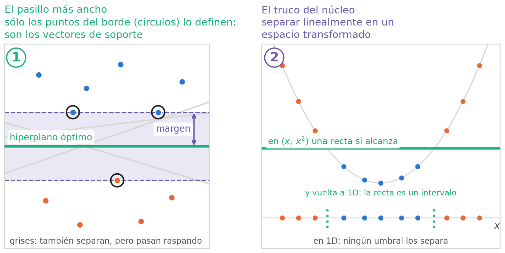{width=100%}

## El hiperplano y el margen

$$\langle \mathbf{w}, \mathbf{x}\rangle + b = 0 \qquad \text{margen} = \frac{2}{\lVert\mathbf{w}\rVert}$$

La frontera es un hiperplano, como en el perceptrón (acá el umbral va aparte, como $b$). El ancho del pasillo es inversamente proporcional a $\lVert\mathbf{w}\rVert$: **maximizar el margen es minimizar $\lVert\mathbf{w}\rVert$**, con la condición de que cada patrón quede del lado correcto y fuera del pasillo. Es un problema de optimización **convexo**: tiene **un solo mínimo**, sin los mínimos locales del multicapa.

## Vectores de soporte

Los patrones que quedan **justo en el borde** del pasillo. La solución depende **sólo de ellos**: si se borra cualquier otro patrón y se vuelve a entrenar, la frontera no cambia. Por eso la SVM es poco sensible a los puntos lejanos, y por eso se llama así: esos vectores «sostienen» el hiperplano.

## Margen blando

Con datos reales las clases se superponen y no hay pasillo limpio. Se permite que algunos patrones **invadan el margen o crucen**, pagando un costo controlado por un hiperparámetro $C$: con $C$ grande casi no se toleran errores (margen angosto, riesgo de sobreajuste); con $C$ chico se toleran más (margen ancho, frontera más simple). Otra perilla de capacidad, que se elige con validación.

## El truco del núcleo

$$\mathbf{x} \;\longmapsto\; \boldsymbol{\phi}(\mathbf{x}) \qquad\qquad K(\mathbf{x}, \mathbf{x}') = \big\langle \boldsymbol{\phi}(\mathbf{x}),\ \boldsymbol{\phi}(\mathbf{x}')\big\rangle$$

La idea tiene dos partes. **Una:** llevar los datos a un espacio de **más dimensiones** donde sí sean linealmente separables, y trazar ahí el hiperplano; vuelto al espacio original, ese hiperplano es una **curva**. **Dos, el truco:** el entrenamiento y la clasificación de la SVM sólo usan **productos internos entre patrones**, así que alcanza con una función $K$ que dé el producto interno en el espacio transformado **sin calcular nunca $\boldsymbol{\phi}$**. Ese espacio puede tener dimensión enorme —con el núcleo gaussiano, infinita— y el costo es el de evaluar $K$.

| Núcleo | Frontera en el espacio original |
|---|---|
| lineal, $\langle\mathbf{x},\mathbf{x}'\rangle$ | hiperplano |
| polinomial, $(\langle\mathbf{x},\mathbf{x}'\rangle + 1)^p$ | superficies polinomiales de grado $p$ |
| gaussiano (RBF), $e^{-\lVert\mathbf{x}-\mathbf{x}'\rVert^2/2\sigma^2}$ | cualquier forma: burbujas alrededor de los vectores de soporte |

### Cómo se lee

Con núcleo gaussiano, la SVM se parece mucho a una **red de base radial**: la decisión es una suma pesada de gaussianas. La diferencia es **quién elige los centros**: en la RBF los pone $k$-medias sin mirar las etiquetas; en la SVM los centros son los **vectores de soporte**, elegidos por el criterio del margen. La analogía para el oral: si dos clases están mezcladas sobre una hoja, **arrugás la hoja** de la forma correcta y las separás con un corte recto de tijera; al desarrugarla, el corte quedó curvo.

| Ventajas | Desventajas |
|---|---|
| **Margen máximo**: es una forma de regularizar, generaliza bien | Hay que elegir **núcleo** y sus parámetros, y $C$ (validación cruzada) |
| Problema **convexo**: un solo óptimo, sin mínimos locales | **Costoso** con muchos patrones: el entrenamiento crece más que lineal con $N$ |
| Depende sólo de los **vectores de soporte** | Es **binaria** por naturaleza: multiclase con uno-contra-uno o uno-contra-todos |
| Funciona bien en **alta dimensión** | No da probabilidades directamente; **poco interpretable** con núcleo |
| El núcleo da fronteras no lineales sin costo explícito | Sensible a la **escala**: hay que normalizar |

> **PARA LA DEFENSA — la respuesta de treinta segundos**
> *«De todos los hiperplanos que separan las clases, elige el de margen máximo, el pasillo más ancho; sólo los puntos del borde —los vectores de soporte— lo definen. El margen ancho es lo que le da buena generalización. Para fronteras no lineales usa el truco del núcleo: separa linealmente en un espacio de más dimensiones, sin calcular la transformación, porque sólo necesita productos internos.»*
> **Las repreguntas seguras:** qué es un vector de soporte (y qué pasa si se mueve un punto que no lo es: **nada**); por qué el margen ayuda a generalizar; y en qué se diferencia del perceptrón (**el perceptrón para en cualquier recta que separe; la SVM elige la del margen máximo**).

---

\newpage

# 15. Ensambles de clasificadores

> **SI TE DICEN — «contame sobre los ensambles»**
> «Un ensamble **combina varios clasificadores** para decidir mejor que cualquiera de ellos solo. La condición es que sean **mejores que el azar** y que **se equivoquen en cosas distintas**: así, al votar, los errores de unos los tapan los aciertos de otros. Hay tres esquemas. **Bagging**: muchos modelos iguales entrenados **en paralelo**, cada uno sobre una muestra **bootstrap** del conjunto, y voto por mayoría; baja la **varianza**. **Boosting**, con AdaBoost como ejemplo: modelos débiles entrenados **en serie**, donde cada uno le da más peso a los patrones que el anterior clasificó mal, y voto ponderado; baja el **sesgo**. **Stacking**: modelos distintos y un **meta-clasificador** que aprende a combinar sus salidas. Suelen ganar las competencias porque reducen el error sin tener que encontrar el modelo perfecto; el precio es costo e interpretabilidad.»


> **IDEA DE FONDO — en qué consiste**
> Un jurado de personas mediocres pero que **se equivocan en cosas distintas** decide mejor que cualquiera de ellas. Lo que arruina un jurado es que todos piensen igual. Por eso la pregunta de fondo de cada esquema es **cómo lograr que los miembros sean distintos**: bagging les da **datos distintos**, boosting les da **pesos distintos** según lo que el anterior erró, stacking usa **algoritmos distintos**.

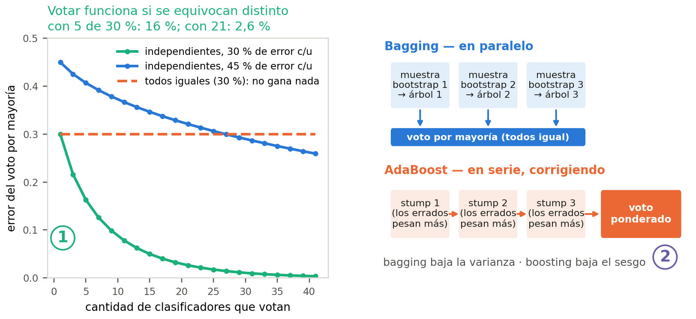{width=100%}

## Por qué votar funciona

$$P(\text{la mayoría se equivoca}) = \sum_{j > M/2} \binom{M}{j} p^{j}(1-p)^{M-j}$$

Con $M$ clasificadores **independientes**, cada uno con error $p < 0{,}5$, la mayoría se equivoca sólo si se equivocan más de la mitad **a la vez**. Con cinco clasificadores de 30 % de error, el voto se equivoca un **16 %**; con veintiuno, un **2,6 %**. Las dos condiciones son necesarias: si $p > 0{,}5$ votar **empeora**, y si todos son iguales (errores totalmente correlacionados) el voto es igual a uno solo. En la práctica los miembros nunca son del todo independientes, así que la ganancia es menor, pero la idea es ésa.

## Bagging (*bootstrap aggregating*)

$$\mathcal{D}^{(m)} = \text{$N$ patrones sorteados de $\mathcal{D}$ con reposición}, \qquad \hat{y} = \text{mayoría}\big(\hat{y}^{(1)},\dots,\hat{y}^{(M)}\big)$$

Cada modelo se entrena sobre una **muestra bootstrap**: algunos patrones salen repetidos y cerca de un **37 %** queda afuera, así que cada uno ve un conjunto un poco distinto. Se entrenan **en paralelo, sin hablarse**, y votan con el mismo peso. Funciona con modelos **inestables y de varianza alta** —árboles profundos—, porque promediar muchos que fluctúan distinto **baja la varianza**. *Random forest* es bagging de árboles donde además cada corte se elige entre un subconjunto al azar de atributos, para que los árboles se parezcan todavía menos.

## Boosting y AdaBoost

$$\hat{y} = \operatorname{sgn}\Big(\sum_{m=1}^{M} \alpha_m\,\hat{y}^{(m)}\Big)$$

Sólo la idea: los modelos se entrenan **en secuencia**. Todos los patrones arrancan con el mismo peso; después de cada ronda, **los mal clasificados suben de peso** para que el siguiente modelo se concentre en ellos. Al final cada modelo vota con un peso $\alpha_m$ que es mayor cuanto mejor le fue. Usa modelos **débiles** —apenas mejores que el azar, típicamente un *stump*: un árbol de una sola pregunta— y encadenándolos construye uno fuerte: **baja el sesgo**. El riesgo: como insiste con lo que no puede clasificar, un patrón **ruidoso o mal etiquetado** termina con muchísimo peso y deforma el modelo.

| | Bagging | AdaBoost |
|---|---|---|
| Entrenamiento | **en paralelo**, independientes | **en serie**, cada uno depende del anterior |
| Cómo logra diversidad | datos distintos (**bootstrap**) | pesos distintos sobre los patrones (**los errados pesan más**) |
| Voto | por mayoría, **todos igual** | **ponderado** por el desempeño de cada uno |
| Modelo base típico | fuerte e inestable (árbol profundo) | débil (*stump*) |
| Qué reduce | **varianza** | **sesgo** |
| Con ruido o *outliers* | robusto | sensible: se obsesiona con ellos |

## Stacking (apilamiento)

Se entrenan **varios modelos distintos** —por ejemplo un $k$-NN, una SVM y un árbol— y en vez de votar, sus salidas se usan como **entradas de un segundo clasificador**, el **meta-clasificador**, que **aprende a combinarlos**: a cuál creerle más y en qué zona. Es la opción que aprovecha modelos **heterogéneos**.

> **OJO — la trampa del stacking, que es la de la sección 9**
> El meta-clasificador tiene que entrenarse con predicciones hechas sobre datos que **los modelos base no vieron** —por ejemplo, las de validación cruzada—. Si se lo entrena con las predicciones sobre el mismo conjunto de entrenamiento, aprende a creerle al modelo que **más memorizó**, que es justo el que peor va a generalizar.

## Por qué los ensambles suelen ganar

Porque atacan el error por el costado: en vez de buscar **el** modelo perfecto, combinan varios buenos. El promedio **cancela la parte del error que no comparten** (bagging, varianza) o **va sumando lo que a cada uno le falta** (boosting, sesgo), y ninguno de los dos requiere que un solo modelo sea excelente. Además son más **estables**: el resultado depende menos de la partición y de la inicialización. Por eso dominan en datos tabulares y en competencias.

| Ventajas | Desventajas |
|---|---|
| Mejor **exactitud** que sus miembros | **Costo**: entrenar y evaluar $M$ modelos |
| Más **estables** frente a los datos y la inicialización | Se pierde la **interpretabilidad** (cien árboles no se leen) |
| Bagging se paraleliza; boosting saca provecho de modelos simples | Más hiperparámetros: cuántos modelos, de qué tipo, cómo combinar |
| Stacking aprovecha modelos de tipos distintos | Si los miembros se equivocan igual, **no se gana nada** |

> **PARA LA DEFENSA — la respuesta de treinta segundos**
> *«Combina varios clasificadores que se equivocan en cosas distintas, para que al votar los errores se cancelen. Bagging entrena en paralelo sobre muestras bootstrap y vota por mayoría: baja la varianza. Boosting entrena en serie, cada modelo concentrado en lo que erró el anterior, y vota ponderado: baja el sesgo. Stacking entrena un meta-clasificador sobre las salidas de modelos distintos.»*
> **Las repreguntas seguras:** qué es una muestra bootstrap (sorteo **con reposición**; queda afuera ~37 %); la diferencia bagging–AdaBoost (**paralelo contra serie**, voto igual contra ponderado, varianza contra sesgo); por qué AdaBoost es sensible al ruido; y la condición para que un ensamble sirva (**mejores que el azar y diversos**).

---

\newpage

# Los algoritmos, lado a lado

| Algoritmo | Qué ajusta | Criterio | Competitivo | Parada |
|---|---|---|---|---|
| Perceptrón (corrección) | $\mathbf{w}$ | $d - y$ | no | sin errores en una pasada |
| Perceptrón (LMS) | $\mathbf{w}$ | $e^2$ | no | épocas / error |
| Multicapa | todas las $\mathbf{W}^{(p)}$ | $\tfrac12\sum e_j^2$ | no | épocas / monitoreo |
| Base radial fase 1 | $\boldsymbol{\mu}_j$ | $J$ de $k$-medias | **sí** | sin reasignaciones |
| Base radial fase 2 | $w_{kj}$ | $\tfrac12\sum e_k^2$ | no | épocas / error |
| Hopfield | $w_{ji}$ (una vez) | — (Hebb) | no | $N$ pasos sin cambios |
| BPTT | $\mathbf{W}$, $\mathbf{W}^{I}$ | $\tfrac12\sum_t\sum_k e^2$ | no | épocas |
| SOM | $\mathbf{w}_j$ y vecinas | — | **sí** | épocas |
| LVQ1 | $\mathbf{m}_c$ | acierto de clase | **sí** | épocas |
| Algoritmo tradicional | Qué guarda o ajusta | Cómo decide | Frontera | Perilla de capacidad |
|---|---|---|---|---|
| $k$-NN | los datos, tal cual | voto de los $k$ más cercanos | cualquiera | $k$ (chico = flexible) |
| Naïve Bayes | a prioris y una densidad por atributo y clase | máximo a posteriori | la que den las densidades | — (el supuesto fija la forma) |
| Árbol | preguntas sobre un atributo | recorrer hasta una hoja | escalera de cortes axiales | profundidad, poda |
| SVM | los vectores de soporte | lado del hiperplano de margen máximo | lineal, o curva con núcleo | $C$ y el núcleo |
| Ensamble | $M$ modelos | voto (igual, ponderado o aprendido) | la de sus miembros, combinada | $M$ y el tipo de miembro |


## Las cinco frases que ordenan todo

1. **Perceptrón, multicapa, RBF fase 2 y BPTT son el mismo esquema:** bajar por el gradiente de un error cuadrático. Lo que cambia es qué tan difícil es calcular ese gradiente.
2. ***k*-medias, SOM y LVQ son el mismo esquema:** gana el más cercano y se mueve hacia el dato. Lo que cambia es quién más se mueve — nadie, los vecinos de la grilla, o el ganador con signo.
3. **Hopfield es la única red que no itera para entrenar:** una cuenta y listo. Y es la única que itera para usarse. (Entre los tradicionales, $k$-NN y Naïve Bayes tampoco iteran: uno guarda los datos, el otro cuenta.)
4. **La activación decide la forma de la frontera:** sigmoide, semiespacios; radial, burbujas locales.
5. **Todo modelo tiene una perilla de capacidad** —neuronas ocultas, centros, $k$, profundidad, $C$, épocas— y **ninguna se elige mirando la prueba**. Poca capacidad: subajuste; mucha: sobreajuste; el punto justo lo decide el monitoreo o la validación cruzada.
